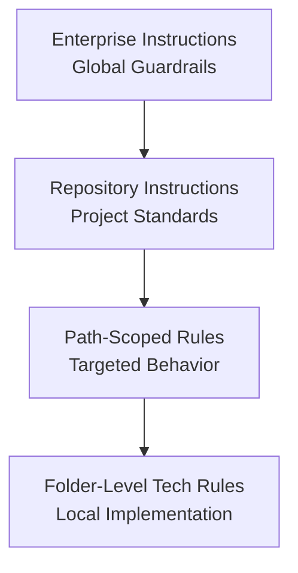

---
marp: true
theme: default
paginate: true
title: "AI Assisted Software Development"
subtitle: "From Code to Copilot"
style: |
  section {
    background-color: #0D7FA8;
    color: white;
    font-family: 'Segoe UI', Tahoma, Geneva, Verdana, sans-serif;
    padding: 60px;
  }
  h1 {
    font-size: 72px;
    font-weight: 600;
    margin-bottom: 60px;
    color: white;
  }
  .info-box {
    background-color: rgba(255, 255, 255, 0.9);
    color: #333;
    padding: 30px 40px;
    margin: 25px 0;
    border-radius: 12px;
    display: flex;
    align-items: center;
    gap: 30px;
    font-size: 28px;
  }
  .icon {
    font-size: 48px;
    min-width: 60px;
    color: #E67E22;
  }
  .info-text {
    flex: 1;
  }
  .contact-info {
    font-size: 24px;
    margin-top: 10px;
    line-height: 1.6;
  }
  .contact-info a {
    color: #2E86C1;
    text-decoration: none;
  }
  .logo {
    position: absolute;
    top: 40px;
    right: 60px;
    background: white;
    padding: 15px 30px;
    border-radius: 8px;
    font-size: 40px;
    font-weight: bold;
    color: #0D7FA8;
    letter-spacing: 8px;
  }
---
# Welcome to AI-Assisted Software Development

<!-- layout: Title Slide -->

## Welcome to AI Assisted Software Development

From Code to Copilot

::: notes
Duration ~00:02

Welcome participants to the AI Assisted Software Development course. This is your opening slide, so set a positive and engaging tone. Introduce the course name and tagline "From Code to Copilot" which emphasizes the journey from traditional software development to AI-augmented practices.

Key talking points:

- Express enthusiasm about the learning journey ahead
- Acknowledge the transformative nature of AI in software development
- Set expectations that this will be hands-on and practical
- Encourage questions and participation throughout

Transition: "Let's start by introducing ourselves..."
:::

---

---
marp: true
theme: default
paginate: true
---
## John Michael Miller

**Principal Software Engineer at CODE**
Played roles of developer, architect, devops engineer, platform engineer, test architect, release manager
AI Practitioner and advocate for effectively using AI to write code

- LinkedIn: [www.linkedin.com/in/johnmichaelmiller](www.linkedin.com/in/johnmichaelmiller)
- Email: [john.miller@codemag.com](john.miller@codemag.com)
- Blog: [codemag.com/blog/AIPractitioner](codemag.com/blog/AIPractitioner)

::: notes
John Michael Miller is a Principal Software Engineer at CODE with over 15 years of experience in software development. He has held various roles including developer, architect, DevOps engineer, platform engineer, test architect, and release manager. John is an AI/ML enthusiast and advocates for effectively using AI to write code. You can connect with him on LinkedIn, reach out via email, or read his blog posts on AI-assisted software development.
- [AI Practitioner Resources](codemag.com/aipractitioner)
:::

---

---
marp: true
theme: default
paginate: true
---

<!-- layout: Centered Two Titles -->

# Course Introductions || Hi, I'm a Developer Who Has Talked to a Robot

::: notes
Duration ~00:01

Opening slide for the introduction section. The centered two-title layout displays "Course Introductions" as the main title and "Hi, I'm a Developer Who Has Talked to a Robot" as the subtitle, creating a friendly and approachable tone for the personal introductions that follow.

Key talking points:

- This is an icebreaker moment
- Set a casual, engaging tone
- The witty subtitle helps create rapport
- Brief pause after displaying to let attendees read

Transition: "Let's go around the room and introduce ourselves..."
:::

---

## Introductions

- Who you are
- Who do you work for
- What you do
- What you've done with AI tools
- What you want to learn

::: notes
Duration ~00:10-15 (depending on class size)

Facilitate round-robin introductions. This is valuable for building rapport and understanding the experience level and expectations of the group.

Facilitation tips:

- Start by modeling with your own introduction
- Keep each person to ~2 minutes
- Note common themes or interests for later reference
- Pay attention to AI experience levels to adjust pace
- Listen for specific learning goals to address during the course

Key observations to note:

- Who has extensive AI coding experience vs. newcomers
- What tools people have tried (Copilot, ChatGPT, Cursor, etc.)
- Common pain points or challenges mentioned
- Areas of particular interest

Transition: "Great to meet everyone! Now let's talk about why we're all here..."
:::

---

---
marp: true
theme: default
paginate: true
---
# About CODE Magazine || Thirty Years and Still Compiling

## About CODE


::: notes
CODE is a custom software company, a staff augmentation company, CODE Magazine for software developers, and training like this webinar. We've been in business for 30 years and the magazine just hit its 25th anniversary. Visit the website at https://www.codemag.com/ for more details.
:::

---

---
marp: true
theme: default
paginate: false
---
# Course Daily Themes || Five Days. One AI. Zero Excuses.

## Daily Themes

| Day       | Theme                                                                                  |
| --------- | -------------------------------------------------------------------------------------- |
| Monday    | AI Guardrails: Instructions, Copilot UI |
| Tuesday   | AI Guardrails: Prompts, Copilot for Teams, Models and Context, LLMs |
| Wednesday | AI Guardrails: Agents, Skills, Managing Context, Instructions vs Prompts vs Agents, Test Automation and Code Quality, MCP                       |
| Thursday  | AI Assisted Brownfield SD: AI Implementation Workflow, Addressing Technical Debt, Building a Backlog, Multi-Implementation Comparison, AI Practitioner Resources |
| Friday    | AI Assisted Greenfield SD: Specification Driven Software Development, Architecture Specification, Technology Specification, Implementation Specification, Implementation Planning, Implementation Prompts, Vertical Slice Implementation, Code Review with GitHub Copilot |

::: notes
Duration ~00:03

Present the week-long course structure. This overview helps participants understand the progression and big-picture organization of the training.

Key talking points:

- Days 1-3 focus on building AI guardrails through instructions, prompts, and agents
- Thursday shifts to brownfield (existing codebases) scenarios
- Friday covers greenfield (new projects) development
- Each day builds on previous concepts
- The progression moves from foundational controls to practical application

Emphasize that guardrails come first because they're essential for safe, effective AI-assisted development. The brownfield/greenfield split acknowledges that these scenarios have different challenges and considerations.

Transition: "Today we'll start with the foundation..."
:::

---

<!-- _class: lead -->

## Course Modules

- Intro
- **▶ AI Assisted Software Development**
- Intro to Copilot
- AI Assistance in Action
- Adding AI Guardrails

---

<!-- _class: lead -->

# AI Assisted Software Development

---

## AI Assisted Software Development

- Core Thesis
- The AI Revolution?

---

# What's the Big Deal About AI? || The More Things Change, the More They Still Compile

<!-- _class: lead -->

## Core Thesis

> "Programming hasn't changed, but how we go about it has changed, again."

- AI-assisted development is an evolution of programming tools
- The mission is still translating intent into machine behavior
- Better abstractions increase speed, not replace judgment

::: notes
Open with the quote and set the framing: this is continuity, not replacement.
:::

---

## Timeline (1940s-2010s)

- Machine code -> assembly: first abstraction layer
- High-level languages: FORTRAN, COBOL, C moved us toward human logic
- Structured/OOP era: modularity, reuse, and domain modeling
- IDEs/libraries: integrated tooling accelerated delivery
- Web/scripting + cloud/APIs: orchestration over low-level plumbing

**Pattern**: every era raised abstraction while preserving core programming intent.

::: notes
Deliver this quickly as historical context, then pivot to AI as the next rung.
:::

---

## AI-Assisted Coding (Now)

- Natural language becomes a practical coding interface
- AI can generate scaffolding, tests, and documentation
- Developers iterate through dialogue: prompt, inspect, refine
- Context quality determines output quality

**Shift**: from only writing code to directing code creation.

::: notes
Emphasize that AI amplifies experienced developers by accelerating routine work.
:::

---

## The New Programmer Role

- Curator of context (requirements, constraints, examples)
- Validator of output (correctness, performance, maintainability)
- Steward of alignment (business goals, user value, ethics)

**AI understands intent better than old tools, but still needs expert oversight.**

::: notes
Address replacement anxiety directly: judgment and architecture remain human-led.
:::

---

## What Hasn't Changed

- Testing, review, and validation are still mandatory
- Security, architecture, and compliance are still your responsibility
- Critical thinking remains the differentiator

**What changed**: expression of intent
**What did not**: accountability for software outcomes

::: notes
Use this as the reality-check slide before closing.
:::

---

---
ai_generated: false
operator: "johnmillerATcodemag-com"
source: "johnmillerATcodemag-com"
---
# The AI Revolution in Software Development || With Great Token Budget Comes Great Responsibility

## The AI Revolution?

What hasn't changed and what has.

---

## Why AI Assisted Software Development

If used effectively, it will give you superpowers

- The courage to
  - Take on codebases that few would touch
  - Use technologies you should know but don't
  - Write more high-quality code than you have ever written before
  - Take on the nice to haves

::: notes
Career Transformation: - Those who adapt: become 10x more productive, tackle bigger challenges, expand skill sets - Those who resist: may find themselves struggling with modern development expectations - New roles emerging: AI prompt engineers, AI code reviewers, AI-assisted architects

Superpowers Explained: - Legacy codebases: AI can quickly understand and explain complex, undocumented systems - New technologies: Learn frameworks/languages faster with AI as a coding partner - Code quality: AI suggests improvements, catches bugs, generates comprehensive tests - Nice to haves: Features that were “too time-consuming” become feasible

Examples to share: - Developer who used AI to modernize a 15-year-old PHP codebase in weeks instead of months - Team that adopted a new framework (React to Vue) with AI assistance in days - 80% reduction in boilerplate code writing time - Comprehensive test suites generated automatically

Key message: AI doesn't replace developers—it amplifies their capabilities
:::

---

## AI-First & Prompt-First

AI-First Development
- A software engineering philosophy where AI is embedded across the entire SDLC–requirements, design, implementation, testing, documentation, compliance, and maintenance.
Prompt-First Development
- A workflow pattern where prompts, instruction files, and chat modes are treated as first-class, version-controlled artifacts.

::: notes
AI-First is the broad philosophy. Prompt-First is the tactical layer that enables predictable AI behavior. You can do Prompt-First without being AI-First, but not the reverse.
:::

---

## What Each Optimizes For

| Focus Area    | AI-First                  | Prompt-First                       |
| ------------- | ------------------------- | ---------------------------------- |
| Scope         | Entire SDLC               | Interaction layer                  |
| Goal          | Lifecycle integration     | Deterministic AI behavior          |
| Optimization  | Velocity, governance      | Prompt quality, reproducibility    |
| Risk Controls | Human-in-loop, provenance | Versioned prompts, context control |

::: notes
This table is the heart of the comparison. AI-First is about organizational and architectural change. Prompt-First is about artifact discipline and predictable outputs.
:::

---

## How They Treat Artifacts

AI-First
  - Requirements written with AI collaboration in mind
  - AI-generated scaffolds, tests, docs
  - Provenance enforced across all AI outputs
  - Architecture assumes AI participation

Prompt-First
  - Prompts and instruction files are version-controlled
  - Prompts define behavioral contracts
  - Reusable prompt modules
  - Chat modes define safe, predictable interactions

::: notes
AI-First changes what you build and how you build it. Prompt-First changes how you communicate intent to the AI.
:::

---

## Relationship Between the Two

Prompt-First is a subset of AI-First.
Prompt-First = mechanics
AI-First = philosophy + architecture + lifecycle integration

::: notes
This is the conceptual hierarchy. Prompt-First is necessary but not sufficient for AI-First maturity.
:::

---

<!-- layout: Two Content -->

## AI First Software Development

Building software where AI is a core capability, not an add-on.

**Why AI-First**
  - Software requirements are increasingly expressed in natural language.
  - AI copilots accelerate architecture, coding, testing, and documentation.
  - Teams shift from writing code to designing intent and validating outputs.
**Outcomes**
  - Faster iteration cycles
  - Better documentation and test coverage

::: column

**Core principles**
  - **Prompt-First Design** — workflows expressed as structured prompts
  - **AI-Native Architecture** — modular boundaries and deterministic interfaces
  - **Human-in-the-Loop** — review, validation, and traceability everywhere
  - **Continuous Verification** — tests, analysis, and guardrails on every output
  - **Lifecycle Governance** — versioning, provenance, and risk-based controls

- Reduced cognitive load on developers
- More resilient, adaptable systems

::: notes
This slide frames what we mean by AI-First development. The key idea is that AI isn't an add-on or a productivity booster—it becomes a core capability of the software lifecycle. When we design systems today, we assume AI will participate in requirements, architecture, coding, testing, and documentation.

Why AI-First
“Teams increasingly express requirements in natural language. AI can interpret those requirements and generate scaffolding, code, tests, and documentation.”
“This shifts the developer's role from writing every line of code to defining intent, constraints, and quality expectations.”
“The goal isn't to replace engineering judgment—it's to amplify it.”

Core Principles

Prompt-First Design
“We start with structured prompts that capture behaviors, invariants, and interfaces. These become durable artifacts, just like design docs.”

AI-Native Architecture
“We design modules with clear boundaries so AI-generated components remain predictable and testable. Deterministic interfaces are essential.”

Human-in-the-Loop
“AI accelerates creation, but humans validate correctness, safety, and alignment with business intent. Review is built into the workflow.”

Continuous Verification
“Every AI-generated artifact—code, tests, docs—runs through automated checks. Static analysis, unit tests, and guardrails catch drift early.”

Lifecycle Governance
“We treat prompts, outputs, and revisions as versioned assets. Provenance and traceability matter for compliance, debugging, and long-term maintainability.”

Outcomes
“Teams iterate faster because intent moves directly into working prototypes.”
“Documentation and test coverage improve because AI can generate them continuously.”
“Developers spend more time on architecture and correctness, less on boilerplate.”
“The result is software that's more adaptable and resilient over time.”
:::

---

<!-- layout: Two Content -->

## Prompt-First Software Development

Design the intent first — let AI generate the implementation.

**Why Prompt-First**
  - Behaviors and constraints are expressed in structured natural language.
  - Prompts become first-class source-of-truth artifacts.
  - Teams shift from writing functions to defining outcomes, invariants, and interfaces.

**Benefits**
  - Faster iteration from idea to working software
  - Higher consistency across generated components

::: column

**Core practices**
  - **Structured Prompts** — templates for features, APIs, data models, tests, and refactors
  - **Instruction Files** — persistent, versioned guidance for code generation
  - **Deterministic Boundaries** — clear contracts keep outputs predictable
  - **Validation Loops** — tests plus human review ensure correctness and safety
  - **Prompt Versioning** — track intent evolution just like code changes

- Reduced cognitive load on developers
- Better alignment between business intent and implementation

::: notes
“This slide introduces the core idea behind Prompt-First development. Instead of starting with code, we start with intent. Prompts become the primary design artifact, and AI becomes the mechanism that turns intent into implementation.”

Why Prompt-First
“Modern development increasingly begins with natural-language descriptions of behavior. Prompt-First formalizes that by treating prompts as first-class inputs to the software lifecycle.”
“The developer's role shifts from writing code line-by-line to defining outcomes, constraints, invariants, and interfaces.”
“This creates a tighter alignment between business intent and the resulting system.”

Core Practices

Structured Prompts
“We don't rely on ad-hoc prompting. We use templates for features, APIs, data models, tests, and refactors. This creates consistency and reduces ambiguity.”

Instruction Files
“These are durable, versioned prompt artifacts that guide AI generation. They act like living design documents that the AI reads every time it produces code.”

Deterministic Boundaries
“We design modules with clear contracts so AI-generated code stays predictable. The AI can generate the internals, but the interfaces remain stable and human-controlled.”

Validation Loops
“Every AI-generated artifact goes through automated tests and human review. The goal is to catch drift early and ensure correctness.”

Prompt Versioning
“Prompts evolve just like code. Tracking changes helps with debugging, reproducibility, and compliance.”

Benefits
“Teams move from idea to working software much faster because intent flows directly into generation.”
“Generated components become more consistent because they're driven by structured prompts, not one-off instructions.”
“Developers spend more time on architecture and correctness, less on boilerplate.”
“The end result is a system that's easier to maintain and adapt over time.”
:::

---

## Concrete Examples

**Prompt-First Example**
  - Promptfile for generating unit tests
  - Instruction file for documentation
  - Chat mode for brownfield developers

**AI-First Example**
  - Requirements → AI-generated scaffolds
  - Code changes → AI-assisted reviews
  - Docs → continuously AI-generated
  - Modernization → AI-guided refactoring plans
  - Provenance → enforced everywhere

::: notes
Use these examples to help teams visualize the difference.
Prompt-First is about interfaces; AI-First is about the entire workflow.
:::

---

## Shortest Summary

- **AI-First = philosophy + architecture + lifecycle integration**
- **Prompt-First = structured, version-controlled interfaces for interacting with AI**

::: notes
End with this summary to reinforce the distinction.
It's the cleanest way to remember the relationship.
:::

---

<!-- _class: lead -->

## Course Modules

- Intro
- AI Assisted Software Development
- **▶ Intro to Copilot**
- AI Assistance in Action
- Adding AI Guardrails

---

<!-- _class: lead -->

# Intro to Copilot

---

## Intro to Copilot

- Repository and Tool Setup
- Hands-On with GitHub Copilot in Visual Studio 2026
- Lab: Getting Started with GitHub Copilot

---

---
marp: true
theme: default
paginate: true
---
# Repository and Tool Setup || Clone Something, Break Nothing

## Repository and Tool Setup

Cloning course repository
GitHub authentication

---

---
ai_generated: true
model: "openai/gpt-5.3-codex@unknown"
operator: "johnmillerATcodemag-com"
chat_id: "exercise-repository-fork-clone-deck-20260322"
prompt: |
  create an exercise marp slide deck using the slides\exercise-template.pptx template for the following:


  ## Exercise: Clone the AI-Assisted-Software-Development Repository

  Prerequisites: Git, GitHub account
  Objectives
  Fork the AI-Assisted-Software-Development repo
  Activities
  Clone the git@github.com:johnmillerATcodemag-com/AI-Assisted-Software-Development.gitrepository
  Switch to the brownfield branch
  Success Criteria
  Cloned repository exists locally

  ::: notes
  Duration ~00:10

  Objective: Fork the course repos Tasks
  Search GitHub for
  AI-Assisted-Software-Development
  Fork this repo
  This will create a personal copy under your GitHub account
  You can make changes without affecting the original repo
  :::

  ---

  ## Exercise: Fork the AIASD-20260209-BF Repo

  Objectives
    - Explore an unfamiliar codebase
  Activities
    - Fork this repo https://github.com/j0hnnymiller/AIASD-20260209-BF.git
    - Clone the forked repo
    - Create a GitHub PAT https://github.com/settings/tokens
    - Store the PAT in the GITHUB_TOKEN environment variable

  ::: column

  Success Criteria
    - Repo is available locally

  ::: notes
  Duration ~00:20

  Guide participants through creating a fork of the brownfield exercise repository, cloning it locally, and creating a GitHub PAT for authenticated access. Emphasize that this setup work enables the later brownfield labs.
  :::

  ---

  ## Exercise: Fork the repos

  Objective
    - Fork the course repos
    - Search GitHub for

  - AI-Assisted-Software-Development
  - zeus.academia.3b
    Fork the repos
  - This will create a personal copy under your GitHub account
  - You can make changes without affecting the original repo
started: "2026-03-22T00:00:00Z"
ended: "2026-03-22T00:10:00Z"
task_durations:
  - task: "exercise deck authoring"
    duration: "00:06:00"
  - task: "provenance logging"
    duration: "00:02:00"
  - task: "readme update"
    duration: "00:02:00"
total_duration: "00:10:00"
ai_log: "ai-logs/2026/03/22/exercise-repository-fork-clone-deck-20260322/conversation.md"
source: "johnmillerATcodemag-com"
marp: true
theme: default
paginate: true
---

# Exercise: Fork and Clone Repositories || Exercise: Your First git clone of Many

## Exercise: Clone the AI-Assisted-Software-Development Repository

**Setup and Objectives**

Prerequisites

- Git
- GitHub account

Objectives

- Fork the AI-Assisted-Software-Development repository
- Clone your fork to your local machine
- Switch to the brownfield branch to confirm branch navigation

::: column

**Activities and Success Criteria**

Activities

1. Search GitHub for AI-Assisted-Software-Development.
2. Fork the repository into your GitHub account.
3. Clone your fork locally with SSH or HTTPS.
4. Open a terminal in the cloned repository.
5. Switch to the brownfield branch.

```bash
git clone git@github.com:<your-username>/AI-Assisted-Software-Development.git
cd AI-Assisted-Software-Development
git checkout brownfield
```

Success Criteria

- Repository is forked under your GitHub account
- Cloned repository exists locally
- Brownfield branch is checked out successfully

::: notes
Duration ~00:10

Set the context by explaining that this is foundational setup for all later course tasks. Guide participants to fork first, then clone their own fork, so they have push access and can safely make changes without affecting the original repository. If students hit authentication issues, pause briefly to confirm whether they are using SSH keys or HTTPS credentials and help them choose one method consistently. Close by asking everyone to run 'git branch --show-current' so they can verify they are on the brownfield branch before moving forward.
:::

---

## Exercise: Fork the AIASD-20260209-BF Repo

**Objectives**

- Explore an unfamiliar codebase with a safe personal fork
- Clone and validate local access to the brownfield exercise repository
- Configure PAT-based authentication for GitHub operations

::: column

**Activities and Success Criteria**

Activities

1. Open https://github.com/j0hnnymiller/AIASD-20260209-BF.git.
2. Fork the repository to your personal GitHub account.
3. Clone the forked repository locally.
4. Create a GitHub PAT at https://github.com/settings/tokens.
5. Store the token in the 'GITHUB_TOKEN' environment variable.

```bash
$env:GITHUB_TOKEN = "<your-pat>"

export GITHUB_TOKEN="<your-pat>"
```

Success Criteria

- Forked repository exists in your GitHub account
- Repository is available locally and can be opened in VS Code
- 'GITHUB_TOKEN' is set in the current shell session

::: notes
Duration ~00:20

Frame this as brownfield readiness work and explain that a clean setup now prevents workflow friction later. Walk students through forking and cloning first, then move to PAT creation with a reminder to use least-privilege token scopes and never commit tokens to source control. During the hands-on period, check that everyone can authenticate successfully before they continue into subsequent labs. Transition by emphasizing that local clone plus PAT setup is the baseline for future repository analysis and change workflows.
:::

---

## Exercise: Fork the Repos

**Objective**

- Fork the course repositories needed for independent practice

::: column

**Activities and Success Criteria**

Activities

1. Search GitHub for the following repositories:
   - AI-Assisted-Software-Development
   - zeus.academia.3b
2. Fork both repositories into your GitHub account.
3. Confirm each fork appears under your account.
4. Optional: clone each fork locally for offline work.

Success Criteria

- Both repositories are forked to your GitHub account
- You can identify the original upstream repositories
- You can explain why forking protects the source repositories

::: notes
Duration ~00:10

Use this slide as a consolidation exercise to reinforce the fork-first workflow pattern across multiple repositories. Encourage participants to describe the difference between upstream and origin in their own words, because that understanding reduces merge and push mistakes later in the course. If time permits, have learners quickly clone one of the forks and verify remotes using 'git remote -v' as a confidence check. End with a short recap that forking gives each participant a safe workspace while preserving the integrity of the course-owned repositories.
:::

---

---
ai_generated: true
model: "anthropic/claude-3.5-sonnet@2024-10-22"
operator: "johnmillerATcodemag-com"
chat_id: "vs2026-copilot-deck-20260327"
prompt: |
  Using slides\marp\hands-on-with-github-copilot-vs-code.deck.md as a guide, and
  "docs\research-GitHub Copilot in Visual Studio Code vs Visual Studio 2026 Community Edition.docx"
  as a source, create a marp deck that describes the GitHub Copilot features in Visual Studio 2026.
started: "2026-03-27T00:00:00Z"
ended: "2026-03-27T00:30:00Z"
task_durations:
  - task: "requirements analysis"
    duration: "00:05:00"
  - task: "content creation"
    duration: "00:20:00"
  - task: "review and refinement"
    duration: "00:05:00"
total_duration: "00:30:00"
ai_log: "ai-logs/2026/03/27/vs2026-copilot-deck-20260327/conversation.md"
source: "johnmillerATcodemag-com"
---

# Hands-On with GitHub Copilot in Visual Studio || GitHub Copilot Meets the IDE That Never Left

---

marp: true
theme: default
paginate: true

---

## Hands-On with GitHub Copilot in Visual Studio 2026

Enterprise-grade AI assistance for .NET developers

- Installing and configuring Copilot
- Deep .NET/C# productivity features
- Debugging and profiler integration
- Agent mode and MCP support
- Microsoft Learn integration

::: notes
Welcome .NET developers to GitHub Copilot in Visual Studio 2026. This session covers the unique, deeply integrated AI features designed for enterprise-scale development. Visual Studio offers features that go beyond VS Code, including doc comment generation, QuickInfo enhancements, profiler agent, and Microsoft Learn integration.

**Target Audience**: .NET, C#, C++, and enterprise Windows developers
**Prerequisites**: Visual Studio 2026 Community, Professional, or Enterprise edition
**Duration**: 90 minutes hands-on
:::

---

## Installation and Setup

Getting started with Copilot in Visual Studio 2026

- **Install GitHub Copilot extension** from Extensions > Manage Extensions
- **Sign in with GitHub account** via Tools > Options > GitHub
- **Configure settings** via Tools > Options > GitHub > Copilot
- **Verify activation** by opening a code file and observing inline suggestions

**Subscription Plans:**

- Free: 2,000 completions + 50 chat requests/month
- Pro/Pro+: Unlimited completions, premium models
- Business/Enterprise: Centralized management, BYOK

::: notes
**Installation Demo (5 minutes):**

1. Open Visual Studio 2026
2. Go to Extensions > Manage Extensions
3. Search for "GitHub Copilot" and install
4. Restart Visual Studio when prompted
5. Tools > Options > GitHub > Sign in with GitHub account
6. Accept authorization in browser
7. Return to Visual Studio and verify connection

**Key Points:**

- Copilot is an **optional** extension; VS works fully without it
- Subscription managed via GitHub, not Visual Studio licenses
- Free tier is sufficient for learning and small projects
- Enterprise customers get centralized policy controls

**Common Issues:**

- Authentication failures: Clear browser cache or try different browser
- Extension not appearing: Ensure Visual Studio 2026 or later
- No suggestions: Check Tools > Options > GitHub > Copilot > Enable completions

**Reference**: https://docs.github.com/copilot/using-github-copilot/getting-started-with-github-copilot-in-visual-studio
:::

---

## Core Features: Inline Completions

Ghost text suggestions as you type

- **Automatic suggestions** appear as gray ghost text
- **Tab to accept** entire suggestion
- **Ctrl+Right Arrow** to accept next word
- **Next Edit Suggestions (NES)** predict follow-up edits anywhere in the file
- **Navigation arrows** in gutter indicate suggested changes

**Use Cases:**

- Completing method implementations
- Generating boilerplate code
- Writing LINQ queries
- Creating unit tests

::: notes
**Demo: Inline Completions (8 minutes)**

1. **Basic Completion:**
   - Create new C# class: 'public class OrderProcessor'
   - Start typing method signature: 'public decimal Calculate'
   - Observe ghost text suggestion completing the method
   - Press Tab to accept

2. **Multi-line Completion:**
   - Type method comment: '// Calculate order total with discounts'
   - Press Enter, start method: 'public decimal CalculateTotal('
   - Copilot suggests full method with parameters, logic, return

3. **Next Edit Suggestions (NES):**
   - Rename a variable (e.g., 'price' to 'unitPrice')
   - Look for gutter arrows indicating related changes
   - Press Tab to navigate and accept suggestions
   - Demonstrate how NES updates all related references

**Key Teaching Points:**

- Ghost text is **predictions**, not guaranteed correct—always review
- NES uses recent changes to predict logical follow-up edits
- Multi-line suggestions can scaffold entire methods, reducing boilerplate
- Accept word-by-word (Ctrl+Right Arrow) for fine-grained control

**Troubleshooting:**

- No suggestions appearing: Check enabled in Tools > Options
- Wrong suggestions: Improve context with better comments or method names
- Performance issues: Close unused files, update Visual Studio

**Best Practices:**

- Write descriptive method names and comments to guide suggestions
- Use NES for refactoring—faster than Find/Replace
- Review generated code for logic errors, security issues
  :::

---

## Copilot Chat: Natural Language Assistance

Multi-surface conversational AI

**Chat Surfaces:**

- **Chat Pane** (View > Chat): Dedicated window for Q&A and research
- **Inline Chat** (Alt+/): In-editor modifications and queries
- **Context Menus**: Right-click code > Ask Copilot

**Key Capabilities:**

- Code explanations and documentation
- Refactoring suggestions
- Bug fixing and error analysis
- Generating tests and documentation
- Answering .NET/C# questions

::: notes
**Demo: Copilot Chat Modes (10 minutes)**

1. **Chat Pane (Q&A):**
   - Open View > Chat (or Ctrl+Q, type "Copilot Chat")
   - Ask: "What's the difference between IEnumerable and IQueryable?"
   - Ask: "Show me how to use async/await with HttpClient"
   - Ask: "Generate a repository pattern for Entity Framework Core"
   - Observe detailed, context-aware responses

2. **Inline Chat (Code Modifications):**
   - Select a method in the editor
   - Press Alt+/ to open inline chat
   - Type: "Add error handling with try-catch and logging"
   - Press Enter—Copilot modifies the code inline
   - Review changes before accepting

3. **Context Menu Integration:**
   - Right-click a complex LINQ query
   - Select "Ask Copilot" > "Explain this code"
   - Observe detailed explanation in chat pane
   - Try "Optimize this query" or "Add comments"

**Key Teaching Points:**

- Chat pane is best for **research, planning, architecture questions**
- Inline chat is best for **direct code modifications, refactoring**
- Context menu provides **quick access** to common AI actions
- Copilot maintains conversation history for follow-up questions

**Advanced Usage:**

- Use '/explain', '/fix', '/tests' slash commands for quick actions
- Reference files with '@file:' (coming soon to Visual Studio)
- Include solution context: Copilot sees open files and project structure

**Transition:** "Now let's explore Visual Studio's exclusive productivity features..."
:::

---

## Visual Studio Exclusive: Doc Comment Generation

Automatic XML documentation

**/// Magic:**

- Type '///' above any method, class, or property
- Copilot generates complete XML documentation
- Includes '<summary>', '<param>', '<returns>', '<exception>'
- Learns from your existing documentation style

**Example:**

```csharp
/// <summary>
/// Calculates the total price with applicable discounts and tax.
/// </summary>
/// <param name="items">List of order items</param>
/// <param name="discountCode">Optional discount code</param>
/// <returns>Total price including tax and discounts</returns>
/// <exception cref="ArgumentNullException">items is null</exception>
public decimal CalculateTotal(List<OrderItem> items, string discountCode = null)
```

::: notes
**Demo: Doc Comment Generation (5 minutes)**

1. **Basic Method Documentation:**
   - Create method without comments:
     ```csharp
     public async Task<User> GetUserByIdAsync(int userId)
     {
         // implementation
     }
     ```
   - Type '///' on line above method
   - Press Enter—Copilot generates full XML doc
   - Review parameter descriptions, return type, exceptions

2. **Complex Method with Multiple Parameters:**
   - Create method with many parameters:
     ```csharp
     public Order CreateOrder(int customerId, List<OrderItem> items,
         string shippingAddress, PaymentMethod payment,
         string discountCode = null, bool expressShipping = false)
     ```
   - Type '///' above method
   - Observe comprehensive documentation for all parameters
   - Edit any descriptions that need refinement

3. **Class-Level Documentation:**
   - Type '///' above a class definition
   - Copilot generates class summary based on members and purpose
   - Demonstrate how it learns from existing style

**Key Teaching Points:**

- This feature is **exclusive to Visual Studio** (not in VS Code)
- Saves significant time on documentation requirements
- Especially valuable for public APIs and libraries
- Generated docs follow XML documentation standard
- IntelliSense immediately shows generated docs to other developers

**Best Practices:**

- Always review generated documentation for accuracy
- Edit domain-specific terminology or business logic descriptions
- Use consistent terminology—Copilot learns from existing docs
- Generate docs **before** code reviews—reviewers see context

**Productivity Impact:**

- Reduces documentation time by 70-80%
- Improves API discoverability
- Ensures consistent documentation style across team
  :::

---

## Visual Studio Exclusive: QuickInfo "Describe with Copilot"

AI-powered IntelliSense enhancements

**Hover Intelligence:**

- Hover over any method, class, or property
- Click "Describe with Copilot" link in QuickInfo tooltip
- Copilot generates contextual summary and usage guidance
- Temporary AI-generated help—not saved to code

**Use Cases:**

- Understanding unfamiliar APIs
- Learning third-party library methods
- Exploring legacy code
- Onboarding new team members

::: notes
**Demo: QuickInfo Enhancements (7 minutes)**

1. **Exploring Unfamiliar API:**
   - Open code with unfamiliar NuGet package (e.g., Polly, Dapper)
   - Hover over a method from the library
   - Click "Describe with Copilot" in tooltip
   - Observe AI-generated explanation with usage examples
   - Ask follow-up: "Show me common patterns with this method"

2. **Understanding Complex LINQ:**
   - Hover over complex LINQ query or method chain
   - Click "Describe with Copilot"
   - Review step-by-step breakdown of query logic
   - Ask: "How can I optimize this query?"

3. **Legacy Code Exploration:**
   - Navigate to poorly documented legacy method
   - Hover, click "Describe with Copilot"
   - Get instant understanding without reading full implementation
   - Ask: "What design pattern is this using?"

**Key Teaching Points:**

- **Visual Studio exclusive** feature—not available in VS Code
- Summaries are **temporary** (not saved as code comments)
- Useful for rapid exploration and learning
- Reduces time spent reading documentation
- Complements traditional IntelliSense

**Productivity Benefits:**

- **Faster onboarding**: New developers understand code faster
- **API discovery**: Learn unfamiliar libraries without leaving IDE
- **Legacy modernization**: Understand old code before refactoring
- **Knowledge sharing**: AI bridges knowledge gaps on teams

**Limitations:**

- Summaries are generated on-demand (requires API call)
- May not have latest library updates (see Microsoft Learn integration)
- Not a replacement for proper code documentation

**Transition:** "Speaking of documentation, let's see how Visual Studio integrates with Microsoft Learn..."
:::

---

## Microsoft Learn Integration

Access authoritative documentation when AI needs help

**How It Works:**

- Copilot detects when its training data is outdated
- Automatically retrieves latest docs from Microsoft Learn
- Provides authoritative, up-to-date answers
- Cites sources for verification

**Covered Topics:**

- .NET APIs and framework changes
- Azure service updates
- Visual Studio features
- C# language updates
- Latest best practices

::: notes
**Demo: Microsoft Learn Integration (6 minutes)**

1. **Recent .NET Feature:**
   - Ask Copilot Chat: "How do I use required properties in C# 11?"
   - Observe Copilot retrieving latest documentation
   - See inline citation links to Microsoft Learn
   - Click citation to verify in browser

2. **Azure Service Update:**
   - Ask: "What's new in Azure Functions v4?"
   - Copilot pulls latest release notes and features
   - Provides code examples from official documentation
   - Citations link directly to relevant Learn articles

3. **Framework Migration:**
   - Ask: "How do I migrate from .NET 6 to .NET 8?"
   - Copilot retrieves migration guide from Learn
   - Provides step-by-step breaking changes
   - Links to detailed migration documentation

**Key Teaching Points:**

- **Visual Studio exclusive**—not in VS Code (yet)
- Solves the "outdated LLM training data" problem
- Ensures recommendations follow Microsoft best practices
- Particularly valuable for:
  - New framework releases
  - Azure service updates
  - Breaking changes and migrations
  - Latest C# language features

**When It Activates:**

- Copilot detects knowledge gap (post-training cutoff date)
- User asks about recent features or updates
- Question involves Microsoft technologies with recent changes
- Automatically falls back to Learn when needed

**Productivity Benefits:**

- No need to leave IDE to verify information
- Confidence in accuracy of recommendations
- Direct links to deep-dive documentation
- Reduced risk of using deprecated patterns

**Enterprise Value:**

- Ensures team follows official guidance
- Reduces security risks from outdated practices
- Accelerates adoption of new features
- Supports compliance and audit requirements
  :::

---

## Deep .NET Productivity: "Implement with Copilot"

AI-powered refactoring integration

**Workflow:**

1. Generate interface or abstract class
2. Right-click > Quick Actions (Ctrl+.)
3. Select "Implement Interface" or "Implement Abstract Class"
4. Copilot generates complete, context-aware implementation

**Advanced Features:**

- **Contextual implementations** based on interface semantics
- **Pattern recognition** (repository, service, factory patterns)
- **Error handling** and logging included
- **Async/await** patterns when appropriate

::: notes
**Demo: Implement with Copilot (8 minutes)**

1. **Basic Interface Implementation:**
   - Define interface:
     ```csharp
     public interface IOrderRepository
     {
         Task<Order> GetByIdAsync(int orderId);
         Task<IEnumerable<Order>> GetAllAsync();
         Task<Order> CreateAsync(Order order);
         Task UpdateAsync(Order order);
         Task DeleteAsync(int orderId);
     }
     ```
   - Create class implementing interface:
     ```csharp
     public class OrderRepository : IOrderRepository
     {
     }
     ```
   - Ctrl+. on 'IOrderRepository' > "Implement Interface with Copilot"
   - Observe Copilot generates full CRUD implementation with Entity Framework

2. **Service Layer Implementation:**
   - Define service interface:
     ```csharp
     public interface IPaymentService
     {
         Task<PaymentResult> ProcessPaymentAsync(PaymentRequest request);
         Task<RefundResult> RefundPaymentAsync(string transactionId);
         Task<bool> ValidatePaymentMethodAsync(PaymentMethod method);
     }
     ```
   - Implement with Copilot
   - Show generated error handling, validation, and logging

3. **Pattern-Aware Implementation:**
   - Create factory interface:
     ```csharp
     public interface INotificationFactory
     {
         INotification CreateNotification(NotificationType type);
     }
     ```
   - Implement with Copilot
   - Observe factory pattern with switch/case for notification types

**Key Teaching Points:**

- **Visual Studio exclusive** deep integration with refactoring system
- VS Code has basic interface implementation, but not AI-powered
- Copilot understands common patterns (repository, service, factory)
- Generated code includes:
  - Appropriate async/await patterns
  - Basic error handling
  - Null checks and validation
  - Logging placeholders (if detected in project)

**Best Practices:**

- Review generated implementations for business logic accuracy
- Add domain-specific validation
- Customize error handling to match project standards
- Rename generic variable names to meaningful domain terms

**Productivity Impact:**

- Reduces boilerplate implementation time by 80%
- Ensures consistent patterns across codebase
- Faster prototyping and scaffolding
- Less context switching to search for patterns

**Next:** "Let's see how Copilot supercharges debugging..."
:::

---

## Debugging Integration: AI-Aware Debugger

Copilot understands your debugging context

**Debugging Features:**

- **Exception analysis** with AI-powered suggestions
- **Variable inspection** with explanations
- **Call stack analysis** and troubleshooting
- **Conditional breakpoint** expression suggestions
- **LINQ query evaluation** and optimization

**Access Points:**

- Ask Copilot button in exception helpers
- Right-click variables in Autos/Locals windows
- Hover over variables with data tips
- Breakpoint context menus

::: notes
**Demo: AI-Powered Debugging (10 minutes)**

1. **Exception Analysis:**
   - Trigger NullReferenceException in code
   - Start debugging, observe exception helper
   - Click "Ask Copilot" in exception dialog
   - Copilot analyzes call stack and suggests fixes
   - Show suggested code changes inline

   **Example Exception:**

   ```csharp
   var user = await _userRepository.GetByIdAsync(userId);
   var fullName = user.FirstName + " " + user.LastName; // NullReferenceException
   ```

   Copilot suggests: "Add null check before accessing properties"

2. **Variable Inspection:**
   - Set breakpoint in complex method
   - Hover over variable in Autos/Locals window
   - Right-click > Ask Copilot > "Explain this value"
   - Copilot explains current state and potential issues

3. **LINQ Query Debugging:**
   - Set breakpoint on LINQ query:
     ```csharp
     var orders = customers
         .SelectMany(c => c.Orders)
         .Where(o => o.Total > 1000)
         .OrderByDescending(o => o.OrderDate)
         .Take(10);
     ```
   - Hover over query in debugger
   - Copilot shows evaluated results and explains query logic
   - Ask: "Is this query efficient?"
   - Get optimization suggestions

4. **Conditional Breakpoint Suggestions:**
   - Right-click breakpoint > Conditions
   - Type partial condition: "when order"
   - Copilot suggests: 'order.Total > 1000 && order.Status == OrderStatus.Pending'
   - Accept and test breakpoint

**Key Teaching Points:**

- **Visual Studio exclusive** debugger-aware AI
- Copilot sees full debugging context:
  - Current call stack
  - Local variable values
  - Exception details
  - Breakpoint locations
- Dramatically faster root cause analysis
- Suggestions are **context-specific** to current execution state

**Debugging Workflow:**

1. Hit exception or unexpected behavior
2. Use "Ask Copilot" in exception helper
3. Review suggested fixes
4. Apply fix or ask follow-up questions
5. Continue debugging with AI assistance

**Advanced Scenarios:**

- Multi-threaded debugging: "Why is this variable changed unexpectedly?"
- Memory leaks: "What objects are keeping this in memory?"
- Performance issues: "Why is this method slow?"

**Productivity Impact:**

- 50-60% faster debugging sessions
- Reduced time searching Stack Overflow
- Faster onboarding to unfamiliar codebases
- Fewer wild-goose-chase debugging sessions
  :::

---

## Profiler Agent: Performance Optimization

AI-guided performance analysis and optimization

**Profiler Integration:**

- Launch profiler, collect performance data
- Copilot analyzes profiling results
- Identifies bottlenecks and hot paths
- Suggests optimization strategies
- Generates benchmark code (BenchmarkDotNet)

**Optimization Workflow:**

1. Profile application (CPU, memory, allocations)
2. Ask Copilot to analyze profiler results
3. Review suggested optimizations
4. Generate benchmarks to validate improvements
5. Apply changes and re-profile

::: notes
**Demo: Profiler Agent (12 minutes)**

1. **Profiling Setup:**
   - Open project with performance issues
   - Debug > Performance Profiler (Alt+F2)
   - Select tools: CPU Usage, Memory Usage, .NET Object Allocation
   - Start profiling session
   - Exercise slow code paths
   - Stop profiling

2. **AI Analysis:**
   - Review profiler results (hot paths, allocations)
   - Click "Ask Copilot" in profiler window
   - Ask: "What are the main bottlenecks?"
   - Copilot identifies:
     - Method with excessive allocations (e.g., string concatenation in loop)
     - Synchronous I/O blocking threads
     - Expensive LINQ queries running repeatedly

3. **Optimization Suggestions:**
   - Ask: "How can I optimize this string concatenation?"
   - Copilot suggests: Use 'StringBuilder' or 'string.Join'
   - Shows before/after code comparison
   - Explains performance impact

4. **Benchmark Generation:**
   - Ask: "Generate BenchmarkDotNet code to compare these approaches"
   - Copilot generates:

     ```csharp
     [MemoryDiagnoser]
     public class StringConcatBenchmark
     {
         private readonly List<string> _items = Enumerable.Range(1, 1000)
             .Select(i => $"Item {i}").ToList();

         [Benchmark]
         public string StringConcat()
         {
             string result = "";
             foreach (var item in _items)
                 result += item + ", ";
             return result;
         }

         [Benchmark]
         public string StringBuilder()
         {
             var sb = new StringBuilder();
             foreach (var item in _items)
                 sb.Append(item).Append(", ");
             return sb.ToString();
         }
     }
     ```

   - Run benchmark, review results
   - Apply optimal solution

**Key Teaching Points:**

- **Visual Studio exclusive** profiler integration
- Copilot understands profiling data:
  - CPU hot paths
  - Memory allocations
  - Garbage collection pressure
  - Lock contention
- Provides **actionable optimization strategies**, not just "make it faster"
- Benchmark generation ensures changes actually improve performance

**Common Optimizations Suggested:**

- Replace synchronous I/O with async
- Use 'StringBuilder' for string concatenation in loops
- Cache expensive computations
- Use 'Span<T>' and 'Memory<T>' to reduce allocations
- Optimize LINQ queries (use 'AsParallel', avoid multiple enumerations)
- Pool objects to reduce GC pressure

**Advanced Scenarios:**

- Ask: "Should I use parallel processing here?"
- Ask: "How can I reduce memory allocations in this method?"
- Ask: "What's causing garbage collection pauses?"

**Workflow Integration:**

- Iterative optimization: profile → analyze → optimize → validate → repeat
- CI/CD integration: profile performance tests, track regressions
- Enterprise scenarios: optimize high-throughput services, reduce cloud costs

**Productivity Impact:**

- Faster identification of bottlenecks (from hours to minutes)
- Evidence-based optimization (benchmarks validate changes)
- Reduced guesswork and premature optimization
- Knowledge transfer: Learn best practices through AI suggestions
  :::

---

## Agent Mode: Autonomous Coding Workflows

Let Copilot work on your behalf

**What is Agent Mode?**

- Autonomous, goal-driven coding workflows
- Copilot plans, edits, tests, and iterates
- Manual approval and steering available
- Cross-file changes and refactoring

**Example Tasks:**

- "Implement user authentication with JWT"
- "Add logging to all service classes"
- "Refactor to use repository pattern"
- "Fix all compiler warnings"
- "Generate unit tests for OrderService"

::: notes
**Demo: Agent Mode (10 minutes)**

1. **Simple Autonomous Task:**
   - Open Copilot Chat
   - Enable Agent Mode (toggle at top of chat pane)
   - Prompt: "Add input validation to all public methods in OrderService"
   - Observe Copilot:
     - Analyzes OrderService class
     - Plans validation additions
     - Generates validation code for each method
     - Previews changes (diff view)
   - Review changes, approve or request modifications
   - Copilot applies changes across file

2. **Multi-File Refactoring:**
   - Prompt: "Refactor direct database access in controllers to use repository pattern"
   - Copilot plans:
     - Create 'IOrderRepository' interface
     - Implement 'OrderRepository' class
     - Update 'OrderController' to use repository
     - Register repository in dependency injection
   - Shows file tree with planned changes
   - Apply changes incrementally or all at once

3. **Test Generation:**
   - Prompt: "Generate comprehensive unit tests for PaymentService"
   - Copilot:
     - Creates test class with xUnit/NUnit/MSTest
     - Generates tests for each public method
     - Includes edge cases, error handling, async tests
     - Uses mocking framework (Moq, NSubstitute)
   - Review tests, run, iterate on failures

4. **Manual Steering:**
   - During any agent task, intervene with follow-up prompts:
     - "Use FluentValidation instead"
     - "Add XML documentation to all generated methods"
     - "Apply these changes only to OrderService, not CustomerService"
   - Copilot adjusts plan and continues

**Key Teaching Points:**

- Agent mode is **generally available** in both VS and VS Code
- Best for **repetitive, well-defined tasks**
- Requires review: Agent mode is not 100% accurate
- More powerful than simple chat: can edit multiple files, run tests
- Manual approval gates prevent unintended changes

**Best Use Cases:**

- Adding cross-cutting concerns (logging, validation, error handling)
- Scaffolding new features (controllers, services, repositories)
- Refactoring patterns across codebase
- Generating tests and documentation
- Fixing compiler warnings or code analysis issues

**Limitations and Considerations:**

- Requires clear, specific prompts for best results
- May need iteration and correction
- Always review changes before committing
- Not suitable for complex business logic without human oversight
- Enterprise policies control agent mode availability

**Agent Mode vs. Regular Chat:**

- Regular chat: Q&A, explanations, suggestions (read-only)
- Agent mode: Autonomous code changes (write mode)

**Security and Controls:**

- Tool approval required for file changes
- Organization policies can disable agent mode
- Audit logs track agent actions
- Rollback via source control if needed

**Transition:** "Now let's explore how agent mode integrates with external tools via MCP..."
:::

---

## Model Context Protocol (MCP) Integration

Extend Copilot with external tools and services

**What is MCP?**

- Open standard for AI tool integration
- Connect Copilot to databases, APIs, file systems, cloud services
- Define custom tools for domain-specific workflows
- Invoke tools automatically during agent mode

**MCP in Visual Studio:**

- Add servers via '.mcp.json' configuration
- Tools appear in Copilot tool palette
- Authenticate via CodeLens or chat
- Manual approval for tool invocations

::: notes
**Demo: MCP Server Integration (8 minutes)**

1. **Configure MCP Server:**
   - Create '.mcp.json' in solution root or user profile:
     ```json
     {
       "mcpServers": {
         "azure-resources": {
           "command": "python",
           "args": ["-m", "mcp_azure"],
           "env": {
             "AZURE_SUBSCRIPTION_ID": "${env:AZURE_SUBSCRIPTION_ID}"
           }
         },
         "database-tools": {
           "command": "npx",
           "args": ["-y", "@modelcontextprotocol/server-postgres"],
           "env": {
             "POSTGRES_CONNECTION": "${env:DB_CONNECTION}"
           }
         }
       }
     }
     ```
   - Save and restart Visual Studio
   - Copilot detects and loads MCP servers

2. **Authenticate MCP Server:**
   - Open file with MCP configuration
   - Click CodeLens "Authenticate" above server definition
   - Complete OAuth flow or enter credentials
   - Server status shows "Connected" in chat pane

3. **Using MCP Tools:**
   - Open Copilot Chat in agent mode
   - Prompt: "List all Azure App Services in my subscription"
   - Copilot invokes 'azure-resources' MCP server
   - Displays results in chat
   - Follow-up: "Show me the app settings for the production app"

4. **Database Query Tool:**
   - Prompt: "Show me the schema for the Orders table"
   - Copilot uses 'database-tools' MCP server
   - Executes safe schema query, displays result
   - Ask: "Generate a repository class for this table"
   - Copilot uses schema information to generate code

**Key Teaching Points:**

- MCP support is **available in both VS and VS Code**
- Visual Studio manages MCP via '.mcp.json' configuration
- Tools require **explicit approval** before invocation (security gate)
- MCP enables domain-specific workflows:
  - DevOps automation
  - Database schema exploration
  - Cloud resource management
  - Custom business logic integration

**MCP Capabilities:**

- **Tools**: Functions Copilot can invoke (e.g., query database, call API)
- **Prompts**: Reusable prompt templates
- **Resources**: External data sources (files, APIs, databases)
- **Sampling**: LLM-driven tool selection and invocation

**Security Controls:**

- Tools disabled by default—manual enablement required
- Authentication managed per-server
- Audit logs track tool invocations
- Organization policies control which MCP servers are allowed

**Example MCP Servers:**

- '@modelcontextprotocol/server-postgres': PostgreSQL database tools
- '@modelcontextprotocol/server-filesystem': File system operations
- '@modelcontextprotocol/server-github': GitHub API access
- Custom servers for internal APIs, cloud platforms, business systems

**Custom MCP Server Development:**

- Implement MCP specification (JSON-RPC 2.0)
- Expose tools, prompts, resources
- Deploy as standalone service or CLI
- Distribute to team via configuration

**Enterprise Use Cases:**

- Integrate with internal ticketing systems (JIRA, ServiceNow)
- Connect to proprietary databases and schemas
- Expose company-specific APIs and services
- Automate deployment and infrastructure tasks

**Transition:** "Let's compare Visual Studio and VS Code Copilot features..."
:::

---

## Visual Studio vs. VS Code: Feature Comparison

Choosing the right IDE for your workflow

**Visual Studio Strengths:**

- Deep .NET/C# productivity (doc comments, QuickInfo, Learn integration)
- Advanced debugger integration with AI awareness
- Profiler agent for performance optimization
- Enterprise project and solution management
- Unified experience for .NET developers

**VS Code Strengths:**

- Custom agents and chat modes (personas, handoffs)
- Custom prompt files for reusable workflows
- Extensible tool sets and third-party agents
- Cross-platform and lightweight
- Broader language ecosystem (250+ languages)

::: notes
**Discussion: Choosing the Right IDE (5 minutes)**

**Visual Studio is Best For:**

- **Enterprise .NET development**:
  - Large solutions with 100+ projects
  - Windows desktop (WPF, WinForms, UWP, MAUI)
  - ASP.NET, Blazor, and .NET web services
- **Deep debugging and profiling**:
  - Complex multi-threaded applications
  - Memory leak investigation
  - Performance optimization
- **Team standardization**:
  - Shared refactoring tools
  - Built-in code analysis and StyleCop
  - Enterprise security and compliance

**VS Code is Best For:**

- **Cross-platform development**:
  - Linux, macOS, Windows
  - Docker and Kubernetes workflows
  - Cloud-native microservices
- **Polyglot projects**:
  - Multiple languages in one project
  - JavaScript/TypeScript frontend + Python/Go backend
  - Experimental languages and frameworks
- **Custom AI workflows**:
  - Build custom agents for planning, review, security analysis
  - Create reusable prompt files for team workflows
  - Integrate third-party AI models (Claude, Gemini, etc.)
- **Lightweight and fast**:
  - Quick startup, low resource usage
  - Remote development (SSH, WSL, Codespaces)
  - Minimal installations on constrained environments

**Feature Parity Summary:**
| Feature | VS Code | Visual Studio |
|---------|---------|---------------|
| Inline completions | ✓ | ✓ |
| Copilot Chat | ✓ | ✓ |
| Agent mode | ✓ | ✓ |
| MCP support | ✓ | ✓ |
| Next Edit Suggestions | ✓ | ✓ |
| Custom agents | ✓ | ✗ |
| Doc comment generation | ✗ | ✓ |
| QuickInfo AI | ✗ | ✓ |
| Microsoft Learn integration | ✗ | ✓ |
| Profiler agent | ✗ | ✓ |
| Deep debugger AI | ✗ | ✓ |

**Real-World Scenarios:**

1. **Startup Building SaaS (Multi-Language):**
   - **Choose VS Code**: React frontend, Node.js backend, Python ML services
   - Custom agents for code review and deployment
   - Cloud-native development with Docker

2. **Enterprise .NET Team (Financial Services):**
   - **Choose Visual Studio**: Large WPF application, ASP.NET Core APIs
   - Profiler agent for performance requirements
   - Deep debugging for complex business logic
   - Microsoft Learn for compliance with latest .NET standards

3. **Full-Stack Developer (Personal Projects):**
   - **Choose VS Code**: Quick startup, lightweight, cross-platform
   - Custom prompt files for rapid prototyping
   - Integration with multiple AI providers (OpenAI, Claude, local models)

4. **Consultant (Multiple Clients, Various Stacks):**
   - **Use Both**:
     - VS Code for initial exploration, scripts, lightweight projects
     - Visual Studio for deep .NET work, debugging, optimization
     - Share Copilot subscription across both IDEs

**Key Takeaway:**
"Visual Studio offers **deep, enterprise-grade integration** for .NET developers. VS Code offers **flexibility, extensibility, and cross-platform reach**. Both are excellent—choose based on your tech stack, team size, and workflow needs."

**Audience Question:** "Can I use both IDEs with one Copilot subscription?"
**Answer:** "Yes! Your GitHub Copilot subscription works across all supported IDEs (VS, VS Code, JetBrains, Neovim, etc.)."
:::

---

## Best Practices for Visual Studio Copilot

Maximizing productivity and code quality

**Prompt Engineering:**

- Write descriptive method names and comments
- Reference specific requirements and constraints
- Use domain-specific terminology
- Include context via comments above code

**Code Review:**

- Always review generated code for correctness
- Check security implications (input validation, auth, sensitive data)
- Verify performance characteristics
- Test edge cases and error paths

**Team Integration:**

- Share Copilot best practices across team
- Document domain-specific prompt patterns
- Review AI-generated code in pull requests
- Establish guidelines for agent mode usage

::: notes
**Best Practices Discussion (5 minutes)**

**1. Prompt Engineering for Better Results:**

✅ **Good Prompts:**

- "Add error handling to SaveOrderAsync method. Handle DbUpdateException, SqlException, and network timeouts. Log errors with ILogger. Return Result<T> with error details."
- "Generate repository pattern for User entity. Include async CRUD operations, paging support (PagedResult<T>), and filtering by email/username/status."

❌ **Bad Prompts:**

- "Add error handling" (too vague)
- "Make this better" (no actionable guidance)
- "Fix" (doesn't specify what's wrong)

**Improved Context:**

- Add comments above code: '// This method processes refunds for failed payments'
- Use descriptive variable names: 'customerOrderTotal' instead of 'total'
- Reference patterns: '// Use factory pattern to create notification types'

**2. Security and Code Review:**

Always review for:

- **Input validation**: SQL injection, XSS, command injection
- **Authentication/Authorization**: Ensure proper access controls
- **Sensitive data**: Don't log passwords, tokens, PII
- **Error handling**: Don't leak stack traces to users
- **Dependencies**: Verify NuGet packages are from trusted sources

**Example: Security Review**

```csharp
// ❌ AI-generated code (needs review):
public User GetUserById(string id)
{
    var query = $"SELECT * FROM Users WHERE Id = '{id}'"; // SQL INJECTION!
    return _db.ExecuteQuery<User>(query);
}

// ✅ After review and correction:
public async Task<User> GetUserByIdAsync(int id)
{
    return await _context.Users
        .AsNoTracking()
        .FirstOrDefaultAsync(u => u.Id == id);
}
```

**3. Performance Considerations:**

Review generated code for:

- Synchronous I/O (use async/await)
- N+1 queries (eager loading with Include())
- Excessive allocations (use 'Span<T>', 'ArrayPool<T>')
- Missing caching opportunities

**4. Team Guidelines:**

Establish team standards:

- **Pull Request Reviews**: Require human review of all AI-generated code
- **Testing Requirements**: Generate tests for AI-generated methods
- **Documentation**: Ensure generated code includes doc comments
- **Prompt Libraries**: Share effective prompts for common tasks
- **Agent Mode Policies**: Define when agent mode is appropriate

**5. Continuous Learning:**

- Experiment with different prompt styles
- Learn from Copilot's suggestions (teaches patterns and idioms)
- Share discoveries with team
- Stay updated on new features (Copilot evolves rapidly)

**6. Balancing AI and Human Expertise:**

**Use Copilot for:**

- Boilerplate and scaffolding
- Common patterns and idioms
- Documentation and tests
- Refactoring and code modernization

**Use Human Judgment for:**

- Business logic and domain rules
- Architecture and design decisions
- Security-critical code paths
- Complex algorithms and optimizations

**Key Principle:** "Copilot is a **powerful assistant, not a replacement** for developer expertise. Think of it as a junior developer who generates first drafts—you're the senior developer who reviews, corrects, and approves."

**Transition:** "Let's wrap up with hands-on labs and Q&A..."
:::

---

## Hands-On Labs

Practice exercises for Visual Studio Copilot

**Lab 1: Core Features (20 minutes)**

- Install and configure Copilot
- Generate doc comments with '///'
- Use QuickInfo "Describe with Copilot"
- Create method implementation from interface

**Lab 2: Debugging and Profiling (25 minutes)**

- Debug exception with AI assistance
- Analyze LINQ query during debugging
- Profile application and ask Copilot for optimization
- Generate and run BenchmarkDotNet code

**Lab 3: Agent Mode and MCP (25 minutes)**

- Use agent mode to add validation across service layer
- Configure local MCP server
- Use MCP tools to explore database schema
- Generate repository from schema using agent mode

::: notes
**Lab Setup and Instructions (5 minutes intro)**

**Prerequisites:**

- Visual Studio 2026 (Community, Professional, or Enterprise)
- GitHub Copilot subscription (free tier acceptable)
- Sample application codebase (provided in course materials)
- Internet connection for Copilot API

**Lab Environment:**

- Sample e-commerce application (C# / .NET 8)
- Entity Framework Core with SQL Server LocalDB
- ASP.NET Core Web API
- xUnit test project

**Lab 1: Core Features (20 minutes)**

**Objective**: Get comfortable with Visual Studio's exclusive Copilot features

**Tasks:**

1. **Doc Comment Generation:**
   - Open 'OrderService.cs'
   - Type '///' above 'CreateOrderAsync' method
   - Review generated documentation
   - Edit parameter descriptions for domain accuracy
   - Repeat for 3 more methods

2. **QuickInfo Enhancement:**
   - Open 'PaymentController.cs'
   - Hover over '_paymentService.ProcessPaymentAsync()'
   - Click "Describe with Copilot"
   - Read AI-generated explanation
   - Ask follow-up: "What happens if this method fails?"

3. **Implement with Copilot:**
   - Open 'IOrderRepository.cs'
   - Create new class 'OrderRepository : IOrderRepository'
   - Ctrl+. (Quick Action) > "Implement Interface with Copilot"
   - Review generated Entity Framework implementation
   - Add to 'Program.cs' DI container

**Expected Results:**

- Complete method documentation
- Understanding of unfamiliar methods via QuickInfo
- Fully implemented repository with CRUD operations

**Common Issues:**

- Copilot not generating docs: Ensure enabled in Tools > Options
- Generic implementations: Add more context via comments
- Missing NuGet packages: Install Entity Framework Core

Lab transition: Lab 1 complete, move into debugging and profiling.

**Lab 2: Debugging and Profiling (25 minutes)**

**Objective**: Use AI-powered debugging and performance analysis

**Tasks:**

1. **AI-Assisted Exception Debugging:**
   - Open 'OrderService.cs' > 'CalculateDiscountAsync'
   - Introduce a bug (comment out null check)
   - Run application, trigger discount calculation
   - Observe NullReferenceException
   - Click "Ask Copilot" in exception helper
   - Review suggested fix
   - Apply fix and verify

2. **LINQ Query Debugging:**
   - Set breakpoint on complex LINQ query in 'ReportService.cs'
   - Start debugging with Ctrl+F5, trigger report generation
   - Hover over LINQ query variable
   - Right-click > Ask Copilot > "Explain this query"
   - Ask: "Is this query efficient?"
   - Review optimization suggestions

3. **Performance Profiling:**
   - Debug > Performance Profiler (Alt+F2)
   - Select CPU Usage, .NET Object Allocation
   - Start profiling
   - Exercise slow report generation feature
   - Stop profiling, review hot paths
   - Click "Ask Copilot" in profiler results
   - Ask: "What's causing the slowdown in GenerateSalesReportAsync?"
   - Review suggestions (likely: N+1 query, missing indexes)

4. **Benchmark Generation:**
   - Ask Copilot: "Generate BenchmarkDotNet code to compare LINQ query approaches"
   - Review generated benchmark class
   - Add NuGet package: 'BenchmarkDotNet'
   - Run benchmark: 'dotnet run -c Release'
   - Review results, apply fastest approach

**Expected Results:**

- Faster exception root-cause identification
- Understanding of complex queries
- Identified performance bottlenecks
- Evidence-based optimization via benchmarks

Lab transition: Lab 2 complete, move into agent mode and MCP.

**Lab 3: Agent Mode and MCP (25 minutes)**

**Objective**: Use autonomous agents and external tool integration

**Tasks:**

1. **Add Validation with Agent Mode:**
   - Open Copilot Chat
   - Enable Agent Mode (toggle at top)
   - Prompt: "Add FluentValidation to all DTOs in the Models folder. Validate required fields, string lengths, and email formats."
   - Review Copilot's plan:
     - Install FluentValidation package
     - Create validator classes for each DTO
     - Register validators in DI container
   - Approve changes
   - Run tests to verify validation works

2. **Configure Local MCP Server:**
   - Create '.mcp.json' in solution root:
     ```json
     {
       "mcpServers": {
         "database": {
           "command": "npx",
           "args": ["-y", "@modelcontextprotocol/server-postgres"],
           "env": {
             "POSTGRES_CONNECTION": "Server=localhost;Database=EcommerceDb;..."
           }
         }
       }
     }
     ```
   - Restart Visual Studio
   - Authenticate MCP server via CodeLens

3. **Explore Schema with MCP:**
   - In Copilot Chat (agent mode):
   - "Show me the schema for the Products table"
   - Review column definitions
   - "What indexes exist on this table?"
   - "Generate a repository class for this table with full CRUD operations"
   - Review generated code, add to project

4. **Agent Mode Refactoring:**
   - Prompt: "Refactor ProductService to use the new ProductRepository. Update dependency injection and all method calls."
   - Review planned changes across files
   - Approve and apply
   - Run tests, fix any compilation errors

**Expected Results:**

- Validation rules automatically added to all DTOs
- Database schema explored without leaving IDE
- Generated repository code based on actual schema
- Refactored service layer using new repositories

**Troubleshooting:**

- Agent mode not available: Check GitHub Copilot plan (requires Pro or higher)
- MCP server won't connect: Verify connection string, check firewall
- Generated code has errors: Iterate with follow-up prompts ("Fix compilation errors")

Lab transition: Lab 3 complete, proceed to wrap-up and Q&A.

**Wrap-Up and Q&A (10 minutes)**

**Key Takeaways:**

1. Visual Studio offers **unique, deep integrations** for .NET developers
2. Doc comments, QuickInfo, Learn integration, and profiler agent are **exclusive to VS**
3. Agent mode and MCP work in **both VS and VS Code**
4. Always **review AI-generated code** for security and correctness
5. Copilot is a **powerful productivity multiplier**, not a replacement for expertise

**Discussion Questions:**

- "Which feature do you think will save you the most time?"
- "What concerns do you have about using AI in your workflow?"
- "How will you introduce Copilot to your team?"

**Resources:**

- Visual Studio Copilot Docs: https://learn.microsoft.com/visualstudio/ide/visual-studio-github-copilot
- GitHub Copilot in VS: https://docs.github.com/copilot/using-github-copilot/using-github-copilot-in-visual-studio
- MCP Specification: https://spec.modelcontextprotocol.io/
- Course materials: [Provide repository link]

**Next Steps:**

- Practice with real projects (start small, gradually increase Copilot usage)
- Share findings with team (demonstrate productivity gains)
- Establish team guidelines (code review, security, testing)
- Explore advanced features (custom MCP servers, agent mode workflows)
- Stay updated (Copilot evolves monthly—new features coming)
  :::

---

## Resources and Next Steps

Continue your GitHub Copilot journey

**Official Documentation:**

- [Visual Studio Copilot Reference](https://learn.microsoft.com/visualstudio/ide/visual-studio-github-copilot)
- [GitHub Copilot Documentation](https://docs.github.com/copilot)
- [Model Context Protocol Specification](https://spec.modelcontextprotocol.io/)
- [.NET Performance Best Practices](https://learn.microsoft.com/dotnet/core/performance/)

**Community and Support:**

- Visual Studio Developer Community
- GitHub Copilot Feedback Forum
- Stack Overflow (#github-copilot)
- Microsoft Learn Training Modules

**What's Next:**

- Explore advanced agent mode scenarios
- Build custom MCP servers for your domain
- Share best practices with your team
- Measure productivity gains

::: notes
**Closing Remarks (3 minutes)**

**Summary:**
Today we explored GitHub Copilot in Visual Studio 2026—a powerful, deeply integrated AI assistant for .NET developers. We covered:

✅ **Installation and setup** across subscription tiers
✅ **Core features**: inline completions, chat, agent mode
✅ **Visual Studio exclusives**: doc comments, QuickInfo AI, Learn integration
✅ **Deep .NET productivity**: implement with Copilot, debugger integration
✅ **Performance optimization**: profiler agent, benchmark generation
✅ **Extensibility**: MCP tool integration

**Key Differentiators:**
Visual Studio Copilot is **not just VS Code in a bigger IDE**. It offers:

- Tighter integration with .NET tools and debugger
- Enterprise-grade features for large-scale projects
- Performance optimization assistance
- Authoritative documentation via Microsoft Learn

**Productivity Impact:**
Teams report:

- 40-55% faster feature development
- 60-70% reduction in documentation time
- 50% faster debugging sessions
- Significant reduction in routine coding tasks

**Getting Started:**

1. **Start small**: Enable Copilot, use inline completions for a week
2. **Graduate to chat**: Use Copilot Chat for questions and explanations
3. **Adopt agent mode**: Let Copilot handle refactoring and test generation
4. **Customize**: Add MCP servers and custom tools for your domain
5. **Measure**: Track time saved on specific tasks to justify investment

**Common Concerns Addressed:**

**"Will AI replace developers?"**
No. Copilot is a tool that amplifies developer productivity, much like IDEs, version control, and unit testing frameworks did before it. It handles routine tasks, freeing developers for higher-level problem-solving, architecture, and business logic.

**"What about code quality?"**
AI-generated code requires review, just like junior developer code. Treat Copilot suggestions as first drafts. Your expertise ensures correctness, security, and performance.

**"Is my code secure?"**
GitHub Copilot does not store your code. Code snippets are sent to Copilot API for inference, but not retained. Enterprise customers have additional controls (BYOK, policy management, audit logs). See GitHub's privacy documentation for details.

**"What about licensing and costs?"**

- Free tier: Sufficient for learning and personal projects
- Pro/Pro+: ~$10-19/month, worth the productivity gain for professionals
- Business/Enterprise: Organization-wide licensing with centralized management
- ROI: Most teams recoup costs in saved developer hours within first month

**Final Thought:**
"GitHub Copilot in Visual Studio 2026 transforms how .NET developers work—reducing tedium, accelerating learning, and enabling faster delivery. The question isn't whether to adopt AI assistance, but how quickly you can integrate it into your workflow."

**Thank you for attending! Questions?**
:::

---

---
ai_generated: true
model: "openai/gpt-5.3-codex@unknown"
operator: "johnmillerATcodemag-com"
chat_id: "exercise-github-copilot-vscode-workflows-20260322"
prompt: |
  create an exercise marp slide deck using the slides\exercise-template.pptx template for the provided GitHub Copilot labs (getting started, context management, chat workflow, and modes)
started: "2026-03-22T00:00:00Z"
ended: "2026-03-22T00:20:00Z"
task_durations:
  - task: "exercise deck authoring"
    duration: "00:12:00"
  - task: "provenance logging"
    duration: "00:05:00"
  - task: "readme update"
    duration: "00:03:00"
total_duration: "00:20:00"
ai_log: "ai-logs/2026/03/22/exercise-github-copilot-vscode-workflows-20260322/conversation.md"
source: "johnmillerATcodemag-com"
marp: true
theme: default
paginate: true
---
# Lab: Getting Started with GitHub Copilot in VS Code || Lab: Your AI Copilot Reports for Duty

## Lab: Getting Started with GitHub Copilot

Objectives

- Install and configure GitHub Copilot
- Verify authentication with your GitHub account
- Explore core Copilot UI components in VS Code

Activities

1. Install the GitHub Copilot extension from the VS Code marketplace.
2. Sign in with your GitHub account and verify Copilot access.
3. Locate and explore:
   - Chat window and chat history
   - New chat button
   - Quick chat feature and keyboard shortcut
   - Settings menu
   - Model selection dropdown
4. Check your premium token usage bar.
5. Create a new chat and experiment with the interface.

Success Criteria

- Copilot extension is installed and authenticated
- You can open and close chat windows
- You can explain main chat versus quick chat
- You can find and use chat history

::: notes
Duration ~00:30

Use this lab as the onboarding checkpoint for all remaining Copilot exercises. Start by confirming everyone has VS Code open and can reach the extension marketplace, then walk the room while participants sign in and complete authentication. Pause after each interface element so learners can find it before moving forward, especially quick chat and model selection since these are easy to miss for first-time users. Close by asking each participant to start one test chat so you can confirm readiness before transitioning to context management.
:::

---

## Lab: Understanding Context Management

Objectives

- Learn to add context using @ symbols
- Understand context window limitations
- Practice writing effective prompts

Activities

1. Basic context addition:
   - Use '@workspace' to search your codebase
   - Use '@file' to reference specific files
   - Use '@terminal' to include command output
   - Use '@vscode' for VS Code product questions
2. Prompt practice:
   - Write a vague prompt and observe the result
   - Rewrite with specific context and compare quality
   - Add file references to improve accuracy
3. Context window experiment:
   - Run a longer single conversation
   - Observe when early context gets dropped
   - Start a new chat when topic focus changes

Success Criteria

- You can use all four @ context types
- You can identify when to start a fresh chat
- You can show quality improvements from specific prompts

::: notes
Duration ~00:20

Frame this as the first skill that directly improves Copilot output quality without changing tools or models. During the @ symbol walkthrough, have participants perform each step live and explain what new information Copilot gains from each context type. For the prompt comparison, ask learners to keep the same goal and only change context quality so the difference is obvious and measurable. End by normalizing context window limits as expected behavior, then reinforce the habit that new topic equals new chat.
:::

---

## Lab: Chat Management and Workflow

Objectives

- Organize chat sessions effectively
- Use chat history as a working reference
- Develop efficient workflow patterns with main and quick chat

Activities

1. Chat organization:
   - Review current chat history
   - Identify conversations that should have been separate
   - Practice starting new chats at natural topic boundaries
2. Context preservation:
   - Run one focused feature chat
   - Add only relevant context files
   - Complete work without context overflow
3. Quick chat practice:
   - Keep main chat for primary task flow
   - Use quick chat for side questions
   - Return to main chat with context preserved
4. Chat history review:
   - Locate previous high-quality solutions
   - Identify prompts that worked well
   - Capture repeatable prompt patterns

Success Criteria

- Chat history is organized and meaningful
- You can quickly find and reuse previous solutions
- You can use multiple chat windows without losing primary context

Context Window Management

- Context is a limited resource
- Start a new chat when focus changes
- Keep conversations targeted and specific
- If Copilot forgets early details, reset with a fresh chat

::: notes
Duration ~00:20

Introduce this lab as productivity hygiene that prevents context fatigue and low-quality responses later in the day. Coach participants to separate work streams by topic, and use quick chat for interruptions so their main conversation remains coherent and reusable. During the history review, have each learner identify one prompt that worked well and explain why it worked, which helps them build a personal prompting playbook. Finish with the context window management bullets as operational rules they can apply in every future session.
:::

---

## Lab: Exploring Copilot Modes

Objectives

- Understand differences between Ask, Edit, and Agent modes
- Know when to use each mode
- Understand premium token usage implications

Activities

1. Ask mode:
   - Ask Copilot to explain a selected code snippet
   - Request multiple implementation approaches
   - Try different models and compare response style
   - Note that Ask mode is best for exploration
2. Edit mode:
   - Select existing code and request a refactor
   - Review inline proposed changes
   - Accept or reject updates intentionally
3. Agent mode:
   - Create a new file and add starter content
   - Request coordinated changes across multiple files
   - Ask Copilot to run terminal commands
   - Recheck premium token usage after actions

Success Criteria

- You can choose the right mode for the task
- You can explain relative token usage tradeoffs
- You can complete a multi-file action using Agent mode

::: notes
Duration ~00:20

Position this lab as decision-making practice so participants learn to match the mode to the work, not just default to one interface. In Ask mode, emphasize low-risk exploration and comparative learning with different models before making any code changes. In Edit mode, slow down and review diffs so learners build trust through verification rather than blind acceptance. In Agent mode, demonstrate value on a task that justifies automation, then connect the result to token usage so participants can balance cost and productivity in real workflows.
:::

---

<!-- _class: lead -->

## Course Modules

- Intro
- AI Assisted Software Development
- Intro to Copilot
- **▶ AI Assistance in Action**
- Adding AI Guardrails

---

<!-- _class: lead -->

# AI Assistance in Action

---

## AI Assistance in Action

- Collaborating on a Solution
- Multi-Model Implementation Comparison
- Evergreen Software Development - Core Principles

---

---
marp: true
theme: default
paginate: true
---
# Vibe Coding: Collaborative AI Development || One Keyboard, Many Opinions, One Calculator

## Collaborating on a Solution

Project Setup
Adding Features

- Basic Arithmetic - Addition, subtraction, multiplication, division
- Clear / Reset Function - Quickly resets the current input or entire calculation
- Decimal Support - Allows entry and computation with decimal numbers
- Sign Toggle (+/–) - Switches values between positive and negative
- Percentage Function - Converts values to percentages for quick calculations
- Memory Functions (M+, M–, MR, MC) - Store, recall, add to, or clear memory values
- Error Handling - Displays errors such as division by zero
- Simple, Intuitive Interface - Numeric keypad, operation buttons, and display screen
  Test Automation
- Code Coverage
  Dependency Management
  Comparing Implementations
  Chat Management
  Intro to Evergreen Software Development

::: notes
This slide outlines the collaborative development process we'll follow for building our calculator application — and mob programming will be central to how we work together.

Except for Project Setup and Basic Arithmetic functions, the mob controls the direction of the implementation. The other labs are optional and can be used when the mob directs the development of that feature or as suggestions should the mob struggle for direction.

We begin with Project Setup, where the team configures the environment, aligns on goals, and prepares the repo. This is done as a mob — one keyboard, one screen, and everyone contributing ideas in real time. It ensures shared understanding from the start.

At the end of the day, we introduce Evergreen Software Development — a mindset of continuous improvement.

Random ideas:
Implementing Observability

Scaffold a new C# command line project using .NET. The project should include:
A Program.cs file with a simple "Hello, World!" example.
A .csproj file configured for a console application.
A README.md with build and run instructions.
The project should be ready to build and run from the command line.
:::

---

---
ai_generated: true
model: "openai/gpt-5.3-codex@2026-03-16"
operator: "johnmillerATcodemag-com"
chat_id: "calculator-project-exercise-deck-20260317"
prompt: |
  create an exercise slide deck, using the #file:exercise-template.md, for the provided calculator project exercise content.
started: "2026-03-17T03:28:00Z"
ended: "2026-03-17T03:36:00Z"
task_durations:
  - task: "content normalization"
    duration: "00:03:00"
  - task: "deck authoring"
    duration: "00:05:00"
total_duration: "00:08:00"
ai_log: "ai-logs/2026/03/17/calculator-project-exercise-deck-20260317/conversation.md"
source: "johnmillerATcodemag-com"
marp: true
theme: default
paginate: true
---
# Exercise: Calculator Project Setup || Exercise: The Calculator That Launched a Thousand Prompts

## Exercise: Calculator Project - Setup and Basic Implementation

Objectives

- Use AI to generate starter code for arithmetic operations
- Understand how to validate AI-generated logic
- Integrate addition, subtraction, multiplication, and division functions

Activities

1. Project Initialization:

- Prompt AI to create a new project
- Review generated project structure
- Verify build configuration

2. Implement Basic Operations:

- Prompt AI to add methods for addition, subtraction, multiplication, and division

3. Review the Code:

- Check correctness and edge cases

4. Build and Run:

- Use Copilot to help with build commands
- Troubleshoot compilation errors with Copilot
- Run the application

Success Criteria

- Working calculator with 4 basic operations
- Application compiles and runs successfully
- Generated code is critically reviewed

::: notes
Duration ~01:00

## Setup and Basic Implementation Exercise Instructions

**Prerequisites:** Calculator project context available

### Objectives

- Scaffold core operations with AI assistance.
- Validate generated logic before accepting changes.
- Deliver a working baseline calculator.

### Activities

- Build project skeleton, implement 4 operations, and verify behavior.
- Emphasize manual review of AI output before merge.

### Success Criteria

- Four operations work end-to-end.
- Build is green.
- Team can explain logic and edge-case handling.
  :::

---

## Exercise: Calculator Project - Clear / Reset

Objectives

- Use AI to scaffold state-management logic
- Implement CE (clear entry) and C (clear all) behaviors
- Understand UI state transitions

Activities

1. Ask AI to outline the difference between CE and C
2. Generate code for clearing current input vs full state
3. Integrate logic into calculator state object
4. Test transitions with sample input sequences

Success Criteria

- CE clears only the active entry
- C resets the entire calculator state

::: notes
Duration ~00:15

## Clear / Reset Exercise Instructions

**Prerequisites:** Basic calculator state model

### Objectives

- Separate entry-level clear from full reset behavior.
- Verify expected transitions from each action.

### Activities

- Use focused prompts and test state transitions quickly.

### Success Criteria

- CE and C behaviors are consistent and explainable.
  :::

---

## Exercise: Calculator Project - Decimal Input

Objectives

- Use AI to generate input-validation logic
- Prevent multiple decimal points
- Ensure decimals flow through arithmetic operations

Activities

1. Ask AI for a decimal input strategy
2. Generate code to block duplicate decimals in one number
3. Integrate decimal support into input parser
4. Test decimal operations with AI-generated test cases

Success Criteria

- Decimal input works without duplication errors
- Arithmetic with decimals is correct
- Validation logic is explainable

::: notes
Duration ~00:12

## Decimal Input Exercise Instructions

**Prerequisites:** Input parser in place

### Objectives

- Implement robust decimal parsing and validation.

### Activities

- Target parser rules, then validate with focused tests.

### Success Criteria

- No duplicate decimal points accepted.
- Decimal math behaves correctly.
  :::

---

## Exercise: Calculator Project - Sign Toggle (+/-)

Objectives

- Use AI to generate sign-toggle logic
- Understand effect on active input and stored value

Activities

1. Ask AI to generate toggle-sign function for active value
2. Integrate into input workflow
3. Test before and after digit entry

Success Criteria

- Sign toggle works for integers and decimals
- Learner can explain stored vs active value impact

::: notes
Duration ~00:08

## Sign Toggle Exercise Instructions

**Prerequisites:** Numeric input flow functioning

### Objectives

- Add predictable sign toggling.

### Activities

- Keep implementation minimal and test transitions.

### Success Criteria

- Toggle is stable across value states.
  :::

---

## Exercise: Calculator Project - Percentage

Objectives

- Use AI to clarify percentage interpretation rules
- Implement percentage logic for common patterns
- Validate behavior with AI-generated examples

Activities

1. Ask AI how percentage should behave in a standard calculator
2. Generate code for:

- X x Y%
- Y + X%
- Y - X%

3. Test each pattern with AI-generated values

Success Criteria

- Percentage operations match standard calculator behavior
- Learner can articulate percentage interpretation rules

::: notes
Duration ~00:15

## Percentage Exercise Instructions

**Prerequisites:** Core arithmetic implemented

### Objectives

- Align percentage behavior with user expectations.

### Activities

- Compare generated logic with known calculator semantics.

### Success Criteria

- Three key percentage patterns operate correctly.
  :::

---

## Exercise: Calculator Project - Memory Functions (M+, M-, MR, MC)

Objectives

- Use AI to design memory subsystem
- Implement memory add, subtract, recall, and clear
- Validate memory across multiple operations

Activities

1. Ask AI for memory-state structure
2. Generate functions for M+, M-, MR, MC
3. Integrate memory operations into calculator flow
4. Test memory persistence over sequences

Success Criteria

- Memory functions behave as expected
- Learner can explain memory state updates

::: notes
Duration ~00:18

## Memory Functions Exercise Instructions

**Prerequisites:** Calculator state architecture defined

### Objectives

- Add reliable memory operations.

### Activities

- Ensure memory state is explicit and testable.

### Success Criteria

- Memory operations are consistent and validated.
  :::

---

## Exercise: Calculator Project - Error Handling

Objectives

- Use AI to identify common error conditions
- Implement error messages and recovery logic
- Ensure graceful reset after errors

Activities

1. Ask AI to list calculator errors (for example divide by zero)
2. Generate error detection and display logic
3. Implement reset path after an error
4. Test error scenarios with AI-generated tests

Success Criteria

- Errors are detected and displayed correctly
- Calculator recovers cleanly
- Learner can explain error-handling flow

::: notes
Duration ~00:10

## Error Handling Exercise Instructions

**Prerequisites:** Core operations implemented

### Objectives

- Build robust error paths without breaking user flow.

### Activities

- Validate both error detection and post-error recovery.

### Success Criteria

- Error handling is visible, predictable, and recoverable.
  :::

---

## Exercise: Calculator Project - Add Trigonometric Functions

Objectives

- Integrate trigonometric operations
- Use AI for math wrappers and parsing logic
- Handle degrees vs radians correctly

Activities

1. Ask AI to generate sin, cos, tan functions using language math library
2. Ask AI for degree/radian mode strategy
3. Implement UI bindings or command triggers
4. Generate sample input/output table with AI and validate

Success Criteria

- Trig results are correct for selected angle mode
- Degree/radian switching works consistently
- UI or commands correctly call trig functions
- Learner can explain validation and refinement steps

::: notes
Duration ~00:15

## Trigonometric Functions Exercise Instructions

**Prerequisites:** Advanced operation framework available

### Objectives

- Add trig support with explicit angle-mode handling.

### Activities

- Implement and validate both behavior and mode switching.

### Success Criteria

- Trig pipeline works end-to-end with tested expectations.
  :::

---

## Exercise: Calculator Project - UI

Objectives

- Use AI to scaffold UI event handlers
- Connect UI controls to logic functions
- Validate end-to-end workflow

Activities

1. Ask AI to generate event-binding code for numeric/operator controls
2. Integrate logic functions from prior exercises
3. Test full workflow:

- Enter decimal
- Toggle sign
- Apply percentage
- Store result in memory

Success Criteria

- UI triggers all calculator functions correctly
- End-to-end workflow completes without errors
- Learner can explain UI-to-logic mapping

::: notes
Duration ~00:15

## UI Exercise Instructions

**Prerequisites:** Core logic stable and testable

### Objectives

- Wire UI interactions cleanly to existing logic.

### Activities

- Prioritize event mapping clarity over visual polish.

### Success Criteria

- Workflow passes from input to output with no breaks.
  :::

---

## Exercise: Calculator Project - Testing

Objectives

- Generate unit tests with AI assistance
- Identify quality issues in generated tests
- Understand why generated tests require review

Activities

1. Generate Initial Tests:

- Prompt: "Create unit tests for the calculator operations"
- Review generated test structure
- Verify tests call calculator code

2. Fix Test Issues:

- If tests are trivial (for example 1 + 1 only), identify issue
- Prompt: "Update tests to call Calculator class methods"
- Verify improved test quality

3. Run Tests:

- Execute test suite
- Review output
- Debug failing tests with Copilot

4. Add Edge Cases:

- Prompt: "Add tests for edge cases like division by zero"
- Verify exception handling tests

Success Criteria

- Minimum 8 test cases
- Tests call actual calculator methods
- Edge cases and error conditions included
- All tests pass

::: notes
Duration ~01:00

## Testing Exercise Instructions

**Prerequisites:** Calculator logic implemented

### Objectives

- Improve test quality, not just test count.

### Activities

- Review generated tests critically before accepting.

### Success Criteria

- Test suite is meaningful, comprehensive, and green.
  :::

---

## Exercise: Code Coverage

Objectives

- Set up code coverage reporting
- Interpret coverage data
- Improve coverage based on identified gaps

Activities

1. Enable Coverage Collection:

- Prompt: "Add code coverage reporting to my test project"
- Review dependencies added
- Resolve NuGet/dependency issues with Copilot

2. Generate Coverage Report:

- Run tests with coverage
- Review percentage
- Identify uncovered paths

3. Improve Coverage:

- Add tests for uncovered methods
- Re-run coverage and verify improvement
- Discuss if 100% coverage is necessary

Success Criteria

- Coverage reporting configured successfully
- Coverage reports can be generated and interpreted
- Reasonable coverage achieved (>80% line coverage)
- Learner understands what coverage metrics mean

::: notes
Duration ~00:40

## Code Coverage Exercise Instructions

**Prerequisites:** Stable test suite

### Objectives

- Use coverage as a guide for targeted testing.

### Activities

- Treat uncovered code as investigation points, not automatic defects.

### Success Criteria

- Coverage setup works and leads to actionable improvements.
  :::

---

## Exercise: Dependency Management and Troubleshooting

Objectives

- Use Copilot to resolve dependency issues
- Handle package restoration problems
- Practice iterative AI-assisted troubleshooting

Activities

1. Simulate or Identify a Dependency Issue:

- Introduce version conflict or use an existing issue
- Prompt: "I'm getting [specific error]. How do I fix it?"

2. Follow Copilot Guidance:

- Review suggested solutions
- Evaluate alternatives
- Select best option collaboratively

3. Iterative Resolution:

- Provide new error details when needed
- Continue until resolved

4. Practice common issues:

- NuGet package source configuration
- MSTest adapter version conflicts
- .NET SDK targeting issues
- Package restoration failures

Success Criteria

- At least one dependency issue resolved
- Learner can provide useful error context to Copilot
- Iterative problem-solving pattern demonstrated

::: notes
Duration ~00:40

## Dependency Troubleshooting Exercise Instructions

**Prerequisites:** Build/test environment configured

### Objectives

- Build confidence in diagnosing and fixing dependency failures.

### Activities

- Emphasize iterative debugging and evidence-based prompts.

### Success Criteria

- Issue resolution is repeatable and well-documented.
  :::

---

## Exercise: Best Practices Review and Code Quality

Objectives

- Apply best practices from session
- Review code quality systematically
- Identify and implement meaningful improvements

Activities

1. Code Quality Check:

- Prompt: "Suggest improvements for code quality and maintainability"
- Evaluate suggestions critically
- Implement high-value improvements

Success Criteria

- Documentation and maintainability improved
- AI suggestions are critically evaluated before adoption

::: notes
Duration ~00:40

## Best Practices Review Exercise Instructions

**Prerequisites:** Working project baseline

### Objectives

- Turn AI suggestions into intentional quality improvements.

### Activities

- Keep only changes with clear maintainability value.

### Success Criteria

- Improvements are justified and validated.
  :::

---

## Exercise: Model Comparisons

Objectives

- Compare outputs from different AI models
- Understand premium vs standard model trade-offs
- Monitor token usage impact

Activities

1. Same Prompt, Different Models:

- Use one coding task (for example implement bubble sort)
- Compare standard and premium model outputs

2. Token Usage Analysis:

- Check premium token bar before/after
- Estimate consumed tokens
- Discuss value vs cost

3. Best Use Cases:

- Identify tasks for standard vs premium models
- Create model selection guidelines

4. Ask Mode Advantage:

- Use Ask mode with premium model
- Compare with Agent mode token behavior

Success Criteria

- At least two models compared
- Token consumption trade-offs understood
- Learner can choose model by task type

::: notes
Duration ~00:30

## Model Comparisons Exercise Instructions

**Prerequisites:** Access to multiple model options

### Objectives

- Build practical model-selection judgment.

### Activities

- Compare quality, speed, and token cost for same prompt.

### Success Criteria

- Team can explain when premium models are worth it.
  :::

---

## Exercise: Calculator Project - Encapsulate Core Logic

Objectives

- Separate UI concerns from computational logic
- Use AI to scaffold standalone core logic module/class
- Ensure UI communicates through a clean API
- Validate improved testability and maintainability

Activities

1. Ask AI to generate dedicated component (for example CalculatorEngine or CalculatorCore) containing:

- Arithmetic operations
- State management
- Trig/percentage/memory logic where implemented

2. Review and refine API surface (naming, inputs, outputs)
3. Replace UI-embedded logic with component calls

Success Criteria

- All features route through external logic component
- UI contains only event handling/display updates
- Learner can explain modularity and reuse benefits

::: notes
Duration ~00:15

## Encapsulate Core Logic Exercise Instructions

**Prerequisites:** UI and logic currently coupled

### Objectives

- Improve architecture through separation of concerns.

### Activities

- Create clear, testable boundaries between UI and engine.

### Success Criteria

- Core logic is isolated and reusable.
  :::

---

## Exercise: Security Review

Objectives

- Systematically review code for security issues
- Address discovered vulnerabilities
- Strengthen input validation and safe patterns

Activities

1. Security Review:

- Prompt: "Review this code for security vulnerabilities"
- Address identified issues
- Add input validation where missing

Success Criteria

- No obvious security issues remain
- AI recommendations are critically evaluated and validated

::: notes
Duration ~00:40

## Security Review Exercise Instructions

**Prerequisites:** Functional calculator project

### Objectives

- Apply practical security checks to working code.

### Activities

- Validate fixes with tests and review, not assumptions.

### Success Criteria

- Security posture improves with documented rationale.
  :::

---

## Exercise: Documentation

Objectives

- Add and improve project documentation
- Review AI-generated docs for accuracy and completeness

Activities

1. Documentation:

- Ask Copilot to generate XML/doc comments
- Review and refine for correctness
- Add README usage instructions
- Ask AI to update existing documentation sections

Success Criteria

- Documentation is comprehensive and accurate
- AI-generated content is critically reviewed before acceptance

::: notes
Duration ~00:40

## Documentation Exercise Instructions

**Prerequisites:** Stable code to document

### Objectives

- Produce maintainable, user-focused documentation.

### Activities

- Treat generated docs as drafts requiring technical review.

### Success Criteria

- Docs are complete, correct, and actionable.
  :::

---

## Exercise: Refactoring

Objectives

- Apply refactoring best practices
- Compare alternative implementations
- Evaluate trade-offs before choosing changes

Activities

1. Refactoring Exercise:

- Ask Copilot for alternative implementations
- Compare readability, complexity, and maintainability
- Discuss trade-offs and select best approach

Success Criteria

- At least one refactoring improvement implemented
- Code quality and maintainability improved
- AI suggestions critically evaluated

::: notes
Duration ~00:40

## Refactoring Exercise Instructions

**Prerequisites:** Existing implementation with improvement opportunities

### Objectives

- Use AI for option generation, then apply engineering judgment.

### Activities

- Compare alternatives using explicit criteria.

### Success Criteria

- Selected refactor improves clarity without regressions.
  :::

---

---
ai_generated: true
model: "openai/gpt-5.3-codex@2026-03-16"
operator: "johnmillerATcodemag-com"
chat_id: "lab2-test-coverage-improvement-exercise-20260317"
prompt: |
  create an exercise slide, using the #file:exercise-template.md, for Lab 2: Test Coverage Improvement.
started: "2026-03-17T03:19:00Z"
ended: "2026-03-17T03:23:00Z"
task_durations:
  - task: "template alignment"
    duration: "00:01:00"
  - task: "exercise authoring"
    duration: "00:03:00"
total_duration: "00:04:00"
ai_log: "ai-logs/2026/03/17/lab2-test-coverage-improvement-exercise-20260317/conversation.md"
source: "johnmillerATcodemag-com"
marp: true
theme: default
paginate: true
---
# Exercise: Test Coverage Improvement || Exercise: From "It Works on My Machine" to Actually Tested

## Exercise: Test Coverage Improvement

Objectives

- Analyze code coverage reports
- Use Copilot to intelligently add tests
- Achieve target coverage percentage
- Balance quantity vs. quality of tests

Activities

1. Review Current Coverage:

- Run tests with coverage reporting
- Identify uncovered code paths
- Analyze coverage percentage by file/class

2. Targeted Test Generation:

- Prompt: "Add tests to increase code coverage to [X]%"
- Observe how Copilot identifies gaps
- Review generated tests for quality

3. Strategic Coverage Improvement:

- Prompt: "Add tests for edge cases in division operation"
- Prompt: "Add tests for corner cases like divide by zero"
- Prompt: "Add integration tests for evaluate arithmetic method"

4. Verify Test Quality:

- Confirm tests call real implementation code
- Confirm tests verify expected behavior, not just execution
- Confirm edge cases are properly handled

5. Re-run Coverage:

- Execute test suite with coverage
- Compare before/after percentages
- Identify remaining gaps

Success Criteria

- Code coverage increased by at least 20 percentage points
- All new tests are meaningful and test actual implementation
- Tests include edge cases and error conditions
- Coverage report shows improved metrics
- Understanding of test quality vs. quantity trade-offs

::: notes
Duration ~00:45

## Test Coverage Improvement Exercise Instructions

**Prerequisites:** Lab 1 completed, existing test suite

### Objectives

- Analyze code coverage reports
- Use Copilot to intelligently add tests
- Achieve target coverage percentage
- Balance quantity vs. quality of tests

### Activities

1. Review current coverage metrics and identify weak areas by file/class.
2. Use Copilot prompts to generate targeted tests for uncovered code paths.
3. Improve strategically with edge-case and integration-focused prompts.
4. Validate test quality to ensure behavior is truly verified.
5. Re-run coverage and compare before/after outcomes.

### Success Criteria

- Coverage increases by at least 20 percentage points.
- New tests are meaningful and exercise actual implementation logic.
- Edge cases and error conditions are covered.
- Coverage reporting clearly shows improvement.
- Participants can explain quality vs. quantity trade-offs.

### Key Learning Point

As discovered in the session, asking Copilot to "increase coverage to 50%" can work because it can intelligently identify which code paths need testing. This can be more efficient than manually finding every gap, but quality checks are still required.
:::

---

---
ai_generated: true
model: "openai/gpt-5.3-codex@2026-03-16"
operator: "johnmillerATcodemag-com"
chat_id: "lab3-test-driven-development-exercise-20260317"
prompt: |
  create an exercise slide, using the #file:exercise-template.md, for Lab 3: Test-Driven Development (TDD) with Copilot.
started: "2026-03-17T03:21:00Z"
ended: "2026-03-17T03:25:00Z"
task_durations:
  - task: "template mapping"
    duration: "00:01:00"
  - task: "exercise authoring"
    duration: "00:03:00"
total_duration: "00:04:00"
ai_log: "ai-logs/2026/03/17/lab3-test-driven-development-exercise-20260317/conversation.md"
source: "johnmillerATcodemag-com"
marp: true
theme: default
paginate: true
---
# Exercise: Test-Driven Development with Copilot || Exercise: Write the Test First. Trust the Process.

## Exercise: Lab 3 - Test-Driven Development (TDD) with Copilot

Objectives

- Practice TDD workflow with AI assistance
- Write failing tests before implementation
- Use tests to drive design decisions
- Understand red-green-refactor cycle

Activities

1. Define New Feature:

- Choose a feature (for example, memory operations for calculator)
- Store current result (ANS/answer functionality)
- Recall previous result
- Handle "ANS + 5" style operations

2. Write Failing Tests First:

- Prompt: "Using TDD, create tests for a memory/answer feature in the calculator. DO NOT implement the feature yet."
- Review generated tests
- Verify tests reference methods that do not exist yet

3. Run Tests (Expect Failures):

- Execute test suite
- Observe compilation errors or test failures
- Document what is missing

4. Implement Feature to Pass Tests:

- Prompt: "Implement the memory/answer feature to make the tests pass"
- Review generated implementation
- Run tests again
- Verify all tests now pass

5. Refactor:

- With tests passing, ask for improvements
- Prompt: "Refactor the answer implementation for better readability"
- Verify tests still pass after refactoring

Success Criteria

- Tests written before implementation
- Initial test run shows failures (red phase)
- Implementation makes all tests pass (green phase)
- Code refactored while maintaining passing tests
- Understanding of TDD benefits and workflow

::: notes
Duration ~00:60

## Lab 3 - Test-Driven Development (TDD) with Copilot Exercise Instructions

**Prerequisites:** Understanding of TDD principles

### Objectives

- Practice TDD workflow with AI assistance
- Write failing tests before implementation
- Use tests to drive design decisions
- Understand red-green-refactor cycle

### Activities

1. Select a small feature and define expected behavior.
2. Ask Copilot for tests only, and confirm the implementation is still missing.
3. Run tests and capture failures to validate the red phase.
4. Implement the minimum code required to satisfy tests.
5. Refactor for readability and maintainability while keeping tests green.

### Success Criteria

- Tests are authored before implementation code.
- The first execution clearly fails (red).
- Feature implementation makes tests pass (green).
- Refactoring preserves passing tests.
- Participants can explain the value of TDD in AI-assisted development.

### TDD Cycle

1. **Red:** Write a failing test.
2. **Green:** Write minimal code to make it pass.
3. **Refactor:** Improve code while keeping tests green.
   :::

---

---
marp: true
theme: default
paginate: true
---
# Multi-Model Implementation Comparison || Ask Three AIs, Get Four Opinions

## Multi-Model Implementation Comparison

Implementing changes with different AI models
Comparing approaches and outcomes
Risk assessment and quality evaluation
Best practice synthesis
Exercises for hands-on practice

::: notes
Introduce this module as a way to help teams understand how different AI models behave when given the same task. Emphasize that multi-model comparison is a powerful guardrail: it reduces hallucinations, improves quality, and helps teams choose the right model for the right job.
:::

---


## Implementing Changes With Different AI Models

Why use multiple models?
Different reasoning styles
Different strengths (refactoring, documentation, architecture)
Cross-validation reduces risk
Helps detect missing context or contradictions
Typical use cases
Refactoring comparisons
Documentation consistency checks
Architecture proposal validation

::: notes
Explain that no single model is perfect. Using multiple models gives teams a broader perspective and helps catch errors or blind spots that one model alone might miss.
:::

---


## Comparing Approaches & Outcomes

What to compare
Code structure and clarity
Architectural alignment
Test quality
Documentation completeness
Risk level of proposed changes
Benefits
Identifies the safest implementation
Surfaces hidden assumptions
Highlights model-specific biases

::: notes
Encourage participants to treat model outputs like multiple drafts from different engineers. The goal is not to pick a winner — it's to synthesize the best ideas.
:::

---


## Risk Assessment & Quality Evaluation

Risk indicators
Missing tests
Large or unnecessary refactors
Violations of instruction files
Unclear or undocumented behavior
Quality indicators
Small, incremental changes
Clear reasoning
Strong test coverage
Alignment with evergreen principles

::: notes
Reinforce that risk assessment is essential in brownfield systems. Even if a model produces elegant code, it may be too risky without proper guardrails.
:::

---


## Best Practice Synthesis

Combine the strengths of each model
Use one model for architecture
Another for implementation
Another for documentation
Cross-validate tests and reasoning
Outcome
Higher quality
Lower risk
More predictable modernization

::: notes
Explain that synthesis is the real power of multi-model workflows. Teams can build a composite solution that is better than any single model's output.
:::

---

## Exercise: Prompt Multiple Models to Address Technical Debt

Objectives
Compare outputs from different models
Identify strengths and weaknesses
Evaluate risk and quality
Activities
Select a small technical debt item.
Prompt two or more models to propose a fix.
Compare outputs for:

- Safety
- Clarity
- Test coverage
- Architectural alignment
  Synthesize the best elements into a final solution.
  Success Criteria
  Differences between models are clearly identified
  Risks and strengths are evaluated
  Final synthesized solution is safe and incremental
  Provenance metadata is included

::: notes
Duration ~00:15

Encourage participants to think like reviewers comparing multiple PRs. The goal is to understand model behavior, not to pick a favorite.
:::

---

## Exercise: Assigning an Issue to Multiple Models

Objectives
Practice delegating the same issue to different models
Evaluate how each model interprets constraints
Identify missing context
Activities
Create a GitHub-style issue describing a technical debt item.
Assign the issue to two different models.
Compare their proposed remediation plans.
Identify missing context or contradictions.
Success Criteria
Issue is clear and well-structured
Each model produces a distinct approach
Missing context is identified and documented
A preferred plan is selected based on safety and clarity

::: notes
Duration ~00:10

This exercise helps participants see how different models interpret the same instructions — a key skill for multi-model workflows.
:::

---

## Exercise: Delegating Work to Multiple Models

Objectives
Practice multi-model delegation
Evaluate multi-step reasoning
Synthesize best practices into a unified plan
Activities
Select a multi-step modernization task.
Ask multiple models to:

- Analyze the problem
- Propose a remediation plan
- Suggest tests
- Suggest documentation updates
  Compare the outputs.
  Synthesize a final, safe, incremental plan.
  Success Criteria
  Multi-model differences are clearly understood
  Final plan is incremental, reversible, and well-tested
  Documentation and provenance are included
  Risks are identified and mitigated

::: notes
Duration ~00:20

This exercise builds confidence in orchestrating multiple models as collaborators. The goal is synthesis, not competition.
:::

---

---
marp: true
theme: default
paginate: true
---
# Evergreen Software Core Principles || Code That Doesn't Rot: A Love Story

<!-- layout: Two Content -->

## Evergreen Software Development - Core Principles

**Design and interface principles**

- **Intent-First Design**
  Define purpose, invariants, and boundaries before writing code.
- **Stable Interfaces, Evolving Internals**
  Keep contracts predictable while implementations improve.
- **Lifecycle Governance**
  Maintain quality through tests, versioning, and human validation.

::: column

**Regeneration principles**

- **Continuous Regeneration with Guardrails**
  Use AI safely with tests, specs, and architectural constraints.
- **Modular, Replaceable Components**
  Structure the system so parts can be regenerated or swapped without cascading breakage.

::: notes
Duration ~00:05

Introduce Evergreen Software Development as a philosophy for building systems that can evolve indefinitely without degrading. This is crucial for AI-assisted development.

Explain each principle:

1. Intent-First Design: Document WHY before WHAT. AI can regenerate code but needs clear intent.
2. Stable Interfaces: Public contracts stay stable while implementations improve continuously.
3. Continuous Regeneration: AI can safely rewrite components when guardrails (tests, specs) exist.
4. Modular Components: Any piece can be regenerated without breaking the system.
5. Lifecycle Governance: Quality maintained through automation and human oversight.

Key insight: Traditional software rots over time. Evergreen software is designed to be continuously regenerated and improved.

Transition: "Let's see why software fails to be evergreen..."
:::

---

<!-- layout: Two Content -->

## Why Software Fails to Be Evergreen

**Design failures**

- **Intent Rot**
  Purpose, constraints, and invariants are undocumented or lost.
- **Unstable or Leaky Interfaces**
  APIs and boundaries change unpredictably.
- **Tightly Coupled Architecture**
  Components depend on each other's internals.

::: column

**Safety failures**

- **Insufficient Guardrails**
  Missing tests and validation make safe regeneration impossible.
- **One-Off Patches and Drift**
  Ad-hoc fixes pull the system away from intended design.

::: notes
Duration ~00:05

Explain the common anti-patterns that prevent software from being evergreen. These are the enemies of long-term maintainability.

1. Intent Rot: Documentation becomes outdated or nonexistent. AI can't regenerate code when it doesn't know the purpose.
2. Unstable Interfaces: Breaking changes cascade through the system. AI regeneration requires stable contracts.
3. Tight Coupling: Changes in one component break others. AI can't safely regenerate tightly coupled code.
4. Insufficient Guardrails: Without tests and specs, AI-generated code can't be validated.
5. Drift: Ad-hoc fixes create divergence from the design. The system becomes unpredictable.

Real-world examples:

- Legacy system with no documentation (intent rot)
- Microservices with frequently changing APIs (unstable interfaces)
- Monolith with circular dependencies (tight coupling)

Transition: "Let's see how to avoid these pitfalls..."
:::

---

<!-- _class: lead -->

## Course Modules

- Intro
- AI Assisted Software Development
- Intro to Copilot
- AI Assistance in Action
- **▶ Adding AI Guardrails**

---

<!-- _class: lead -->

# Adding AI Guardrails

---

## Adding AI Guardrails

- Adding AI Guardrails
- Instruction Files
- **Repo‑level `.md` files**
- 🎯 Instruction File `applyTo` Patterns
- Core Instructions
- Organizational vs. Repository Instruction Files

---

---
marp: true
theme: default
paginate: true
---
# Adding AI Guardrails || Teaching Your AI to Color Inside the Lines

## Adding AI Guardrails

What are instructions, prompts, and Agents
Creating instruction, prompt, and Agent files
Meta prompts that generate these files
Instructions for generating artifacts
Enforcing provenance for AI-assisted artifacts

::: notes
Introduce this module as the foundation for safe, predictable AI-assisted development.

Guardrails ensure that AI output is intentional, reviewable, and aligned with architectural and organizational standards.

These practices turn AI from a novelty into a disciplined engineering tool.
:::

---


## Instructions, Prompts & Agents

Definitions
Instructions – Persistent rules that guide the model's behavior
Prompts – Task-specific requests defining intent and constraints
Agents – Pre-configured personas optimized for workflows

::: notes
Clarify the distinctions: instructions are stable, prompts are ephemeral, and Agents define how the model behaves in a particular role.

Together, they form a layered control system that shapes AI behavior and reduces drift.
:::

---


## Creating Instruction, Prompt & Agent Files

Why create files?
Ensures repeatability
Reduces token usage
Provides version-controlled guardrails
Enables team-wide consistency
File types
.github/instructions/myinstructions.instructions.md
.github/copilot/Promptfiles/myprompt.prompt.md
.github/chatmodes/mychatmode.chatmode.md

::: notes
Explain that storing these artifacts as files allows teams to version them, review them, and reuse them.

This is essential for brownfield modernization, where consistency and traceability matter.
:::

---


## Meta Prompts

Meta prompts guide:
Creation of instruction files
Generation of reusable prompts
Construction of Agents
Provide consistent formatting, structure, content

::: notes
Meta prompts are prompts about prompts.

They let the AI generate structured artifacts on demand.

This reduces manual effort and ensures that all artifacts follow a consistent pattern.
:::

---


## Instructions for Generating Artifacts

Best practices
Define the artifact type
Specify required sections
Provide examples or templates
Include acceptance criteria
Require the model to restate constraints

::: notes
When asking AI to generate an artifact, be explicit about structure and constraints.

This prevents drift and ensures the output is usable without heavy editing.
:::

---


## Enforcing Provenance for AI Artifacts

Provenance requirements
Declare:

- AI involvement
- Model used
- Date generated
- Human reviewer
  Store provenance in headers, footers, or side cars
  Track revisions in version control

::: notes
Provenance is essential for conformance, auditability, and long-term maintainability.

It ensures teams know which artifacts were AI-generated, which were human-generated, and which were hybrid.
:::

---

## Exercise: Copy the Core Instructions

Objectives:
Understand file organization for AI-assisted output policies
Practice copying files between repositories
Ensure compliance with output metadata requirements
Activities:

1. Locate .github/instructions/ai-assisted-output.instructions.md in the AI-Assisted-Software-Development repository
2. Copy the file into the .github/instructions folder of the current repository
3. Copy these files as well:
   chatmode-file.instructions.md
   instruction-files.instructions.md
   instruction-prompt-files.instructions.md
   prompt-file.instructions.md
4. Verify the copied files matches the original
5. Review the instructions
   Success Criteria:
   The files are present in the current repo
   The content matches the source file
   No metadata or formatting is lost

::: notes
Duration ~00:10

This exercise reinforces the importance of maintaining consistent AI-assisted output policies across repositories. By copying the instructions file, participants learn to manage compliance and provenance requirements for AI-generated artifacts. Ensure the copied file is identical and properly placed to support future AI work.
:::

---


## Instructions for AI Generated Artifacts

The one instruction file that rules them all

::: notes
Provenance is essential for conformance, auditability, and long-term maintainability.

It ensures teams know which artifacts were AI-generated, which were human-generated, and which were hybrid.
:::

---


## AI-Assisted Output Instructions

Ensures provenance and logging for all AI-assisted outputs
Defines required metadata, logging workflow, and quality gates
Protects code quality and enables audits

::: notes
This slide introduces the purpose of the AI-Assisted Output Instructions file: to enforce traceability, quality, and compliance for all AI-generated artifacts in the repository.
:::

---


## Required Provenance Metadata

Every AI-assisted artifact must include:

- ai_generated: true
- model: provider/model@version
- operator: username
- chat_id: unique chat identifier
- prompt: exact prompt text
- started/ended: timestamps
- task_durations & total_duration
- ai_log: path to conversation log
- source: who/what created the file

::: notes
This slide lists the mandatory metadata fields that must be embedded in every AI-generated file.

These fields ensure each artifact can be traced back to its origin, model, and operator.
:::

---


## Metadata Placement Policy

Use YAML front matter for Markdown and similar formats
For binaries/images, use a sidecar <artifact>.meta.md
Never use sidecars for Markdown

::: notes
This slide explains where and how to place provenance metadata.

Markdown files must use embedded YAML front matter; only non-embeddable formats use sidecar files.

Note: Instructions files have limited support for metadata and must use sidecar files
:::

---


## AI Chat Logging Workflow

Each chat creates a unique log folder: ai-logs/yyyy/mm/dd/<chat-id>/
Required files:

- conversation.md (full transcript)
- summary.md (objectives, decisions, outcomes)
- artifacts/ (optional)
  Never reuse chat logs between sessions

::: notes
This slide describes the logging structure for AI chats.

Each session gets its own folder, transcript, and summary, ensuring clear separation and traceability.
:::

---


## Quality & PR Checklist

Metadata complete and correct
Conversation and summary logs exist
README.md updated for notable artifacts
No sensitive data in outputs
All AI-generated content traces to a chat log

::: notes
This slide summarizes the quality gates and PR requirements.

Artifacts must be fully documented, logs must exist, and sensitive data must be avoided.
:::

---


## Copilot Integration Requirements

Copilot must auto-manage chat IDs and logs
Metadata injected automatically
Block artifact creation if chat context is missing
Enforce provenance before file creation

::: notes
This slide highlights the requirements for GitHub Copilot integration.

Copilot should automate chat management, metadata injection, and enforce compliance before generating files.
:::

---


## Enforcement & Remediation

PRs blocked if provenance is incomplete
Missing logs or metadata must be added before merge
Orphaned artifacts require reconstruction of logs and metadata

::: notes
This slide explains enforcement:

PRs are blocked if requirements are not met.

Any missing provenance must be remediated before merging.
:::

---


## Summary: Why This Matters

Enables auditability and trust in AI outputs
Protects against orphaned or unverifiable artifacts
Supports team collaboration and compliance

::: notes
This slide reinforces the value of these instructions: they ensure every AI-assisted artifact is trustworthy, auditable, and compliant with team and industry standards.
:::

---


## Core Instruction files

chatmode-file.instructions.md

- Defines the structure and contents of agents
  instruction-files.instructions.md
- Defines the structure and contents of instruction files
  prompt-file.instructions.md
- Defines the structure and contents of prompts
  instruction-prompt-files.instructions.md
- Defines the structure and contents of prompts the create instruction files

---

## Exercise: Create a Prompt File

Objectives
Understand prompt structure
Practice defining task intent
Apply constraints and success criteria
Activities
Prompt Copilot to create a prompt file that creates an instruction file for evergreen software development
Review the prompt
Success Criteria
Prompt is clear, scoped, and reusable
Includes constraints and success criteria
Avoids unnecessary context

::: notes
Duration ~00:10

This exercise builds foundational prompt-writing skills. Encourage participants to choose a real task to make the exercise concrete.

Prompt: Create a prompt file that creates an instruction file for evergreen software development
:::

---

## Exercise: Create an Instruction File for Evergreen Development

Objectives
Capture evergreen principles
Define architectural boundaries
Specify modernization rules
Activities
Submit the Evergreen Instructions prompt
Review the instructions
Success Criteria
Instruction file is stable and reusable
Reflects evergreen development values
Provides clear guardrails

::: notes
Duration ~00:15

This reinforces the evergreen mindset and produces a reusable artifact for future AI-assisted work.

Prompt: Submit the prompt #file:create-evergreen-software-instructions.prompt.md
:::

---

## Exercise: Create an Agent

Objectives
Define a persona optimized for brownfield work
Emphasize safety and incrementalism
Encode risk-aware behaviors
Activities
Draft a Agent that:

- Respects working systems
- Avoids risky rewrites
- Surfaces context gaps
- Encourages incremental changes
  Add tone and behavioral guidelines
  Add provenance metadata
  Success Criteria
  Agent behaves like a cautious senior engineer
  Encourages safe modernization
  Includes clear behavioral rules

::: notes
Duration ~00:10

This helps participants shape AI behavior to match brownfield realities.
:::

---

## Exercise: Generate Instruction Files

Objectives
Use meta prompts to scale instruction-file creation
Capture module-specific rules
Encode domain and architectural constraints
Activities
Prompt Copilot to create instruction files for the standards and conventions of the tech stack
Review instructions
Success Criteria
Instruction files reflect real system constraints
Meta prompts produce consistent structure
Files are ready for team use

::: notes
Duration ~00:20

Participants experience the leverage of meta prompts and see how AI can accelerate documentation.

Prompts:

Create instruction files for the backend technologies

Create instruction files for the front-end technologies

Create instruction files for the front-end technologies
:::

---

## Exercise: Context-Related Issues

Objectives
Identify missing context
Detect token overflow risks
Improve prompt scoping
Activities
Copy the check-context.prompt.md file from the AIASD repository
Review the prompt
Submit the prompt
Review the output
Success Criteria
Correctly identified context gaps

::: notes
Duration ~00:10

This exercise builds intuition for context management—one of the most important AI-era engineering skills.
:::

---

---
marp: true
theme: default
paginate: true
---
# Instruction Files || The .editorconfig for Your AI's Soul

## Instruction Files

::: notes
**Opening**: This is the title slide introducing the concept of instruction files. **Keep It Brief**: Simply say "Let's talk about instruction files—a powerful way to guide AI behavior persistently across your projects." **Visual Cue**: Let the title appear, pause for 2-3 seconds. **No Content Yet**: Don't explain what they are—that's the next slide's job. **Transition**: "First, let me frame what we mean by 'persistent AI behavioral guidelines'..."
:::

---

## Persistent AI Behavioral Guidelines

::: notes
**Frame the Concept**: This subtitle slide sets up the key mental model. **Persistent**: Emphasize that unlike one-time prompts, these rules stay active across multiple interactions. **Behavioral**: These files tell AI _how_ to work, not _what_ to build. **Guidelines vs Commands**: "Think of instruction files as automated code review rules that apply every time AI generates code." **Analogy**: "Like .editorconfig or .eslintrc files, but for AI behavior instead of code formatting." **Transition**: "So what exactly are instruction files? Let's define them..."
:::

---

## What Are Instruction Files?

Definition
Persistent configuration files that define AI behavior patterns
Applied automatically across multiple interactions
Establish consistent working standards and constraints
Key Characteristics
Scope: Repository-wide or context-specific
Persistence: Active across all relevant AI interactions
Purpose: Define “how” AI should work, not “what” to do
::: notes
**Definition Emphasis**: Read the definition slowly—this is foundational. **Configuration Metaphor**: "Just like you configure your IDE or linter, you configure your AI assistant with instruction files." **Automatic Application**: Key point: once created, they're automatically applied. No need to paste instructions repeatedly. **Standards Example**: "Example: All Azure code must use managed identities, no hardcoded keys. Put that in azure-dev.instructions.md, and AI will follow it automatically." **Scope Explanation**: Can apply broadly ('applyTo: "**"') or narrowly ('applyTo: "*.cs"'). **How vs What**: Clarify: Instructions define _style_ ("use dependency injection") not _tasks_ ("build a login system"). **Audience Check**: "Does this distinction make sense—how versus what?" **Transition**: "Let me show you what one looks like..."
:::

---

## Instruction File Structure

```markdown
---
description: Azure best practices for AI development
applyTo: "**" # File pattern scope
---

## Core Instructions

- Use Azure Tools when handling Azure requests
- Follow security best practices
- Implement proper error handling
- Generate comprehensive documentation

## Code Generation Rules

- Write tests before implementation
- Use dependency injection patterns
- Follow naming conventions
- Include proper logging
```

::: notes
**Walk Through Example**: Go section by section, don't rush. **YAML Front Matter**: "Every instruction file starts with metadata. Description explains purpose, applyTo defines scope." **ApplyTo Pattern**: Explain glob patterns—'"**"' means all files, '"*.py"' means Python only, '"src/**/*.ts"' means TypeScript in src folder. **Core Instructions**: "This section defines high-level principles—use Azure-specific tools, enforce security, proper error handling." **Code Generation Rules**: "This section gets tactical—TDD approach, dependency injection, naming standards, logging requirements." **Live Demo Opportunity**: If time permits, show a real instruction file from the repo. **Practical Point**: "AI reads this file automatically when working in your repo—no copy-paste needed." **Transition**: "When should you use instruction files? Let's look at common use cases..."
:::

---

## Instruction Files: Use Cases

Perfect For:
Coding Standards → Consistent style across projects
Security Policies → Enforce security practices
Quality Gates → Define testing and review requirements
Technology Constraints → Specify approved frameworks/tools
Examples:
azure-development.instructions.md
testing-standards.instructions.md
security-requirements.instructions.md

::: notes
**Use Cases Overview**: These are the "why" behind instruction files. **Coding Standards**: "Every team has style preferences—indentation, naming, file organization. Instruction files codify this for AI." **Security Example**: "You can mandate: 'Never log passwords', 'Always sanitize user input', 'Use parameterized queries'. AI will follow these rules automatically." **Quality Gates**: "Require test coverage thresholds, code review checklists, documentation standards." **Technology Constraints**: "Enterprise scenario: only approved libraries/frameworks allowed. Instruction file enforces this." **Real Examples**: Point to each example filename and briefly explain: azure-development covers cloud-specific patterns, testing-standards defines test structure, security-requirements enforces security policies. **Team Benefit**: "This is especially powerful for teams—everyone's AI assistant follows the same rules, producing consistent output." **Transition**: "Before we move on, let me share some best practices..."
:::

---

## Instruction Files Best Practices

✅ Do This:
Keep instructions clear and actionable
Use file patterns (applyTo: '\*\*') for broad scope
Version control and document changes
Test instruction effectiveness regularly
❌ Avoid This:
Overly complex or contradictory rules
Too many instructions (cognitive overload)
Instructions that conflict with prompt files
Hardcoded values instead of parameters
::: notes
**Best Practices Summary**: This slide prevents common mistakes. **Clear and Actionable**: Bad: "Code should be good." Good: "Use async/await for I/O operations." Be specific. **File Patterns**: Explain 'applyTo' strategy—broad patterns for general rules, narrow patterns for specific contexts. **Version Control**: "Instruction files are code. Commit them, review changes, track evolution." **Test Effectiveness**: "After creating an instruction file, test it—ask AI to generate code and verify it follows the rules." **Avoid Complexity**: "If AI can't understand your instructions, they won't work. Keep language simple, rules unambiguous." **Cognitive Overload**: "Don't create 50 instruction files. AI (like humans) can only track so much. Consolidate related rules." **Conflicts**: "Instruction files apply automatically, prompts are one-time. Make sure they don't contradict each other." **No Hardcoding**: "Use parameters and environment variables, not hardcoded URLs or credentials." **Practical Advice**: "Start small—one or two instruction files. Expand based on team needs." **Transition**: Depending on agenda, either "Let's see this in action with a hands-on demo..." or "Questions about instruction files before we move on?"
:::

---

---
marp: true
paginate: false
---

# When to Use Each Copilot Instruction File Type || Right Tool, Right File, Right AI Behavior

## **Repo‑level '.md' files**
- Apply **everywhere** in the repo
- Always included
- For **universal rules**: style, security, logging, architecture
- No 'applyTo' / 'exclude' support
- Best for **global, evergreen guidance**

---

## **Scoped '<name>.instructions.md' files**
- Apply **only** when 'applyTo' matches
- Can **exclude** paths
- For **language-, framework-, or domain‑specific rules**
- Ideal for precision control
- Best for **targeted, contextual guidance**

---

## **Decision Rule**
- If it should apply **repo‑wide** → use '.md'
- If it should apply **only in certain paths** → use '.instructions.md'
- If you need **exclusions** → must use '.instructions.md'

::: notes
This slide summarizes the functional difference between the two instruction file types GitHub Copilot supports inside '.github/instructions/'.
Repo‑level '.md' files are unconditional and always included.
Scoped '.instructions.md' files are conditional, support 'applyTo' and 'exclude', and only activate when relevant.
The decision rule gives teams a simple, auditable way to choose the correct mechanism.
:::

---

---
ai_generated: true
model: "anthropic/claude-3.5-sonnet@2024-10-22"
operator: "johnmillerATcodemag-com"
chat_id: "applyto-patterns-marp-deck-20260303"
prompt: |
  create a marp deck that explains the applyTo options. include speaker notes in the pandoc format
started: "2026-03-03T00:00:00Z"
ended: "2026-03-03T00:15:00Z"
task_durations:
  - task: "content structure and outline"
    duration: "00:03:00"
  - task: "slide content creation"
    duration: "00:10:00"
  - task: "speaker notes and refinement"
    duration: "00:02:00"
total_duration: "00:15:00"
ai_log: "ai-logs/2026/03/03/applyto-patterns-marp-deck-20260303/conversation.md"
source: "johnmillerATcodemag-com"
marp: true
theme: default
paginate: true
---
# Instruction File applyTo Patterns || Glob Patterns: The Bouncer at Your AI's Door

## 🎯 Instruction File 'applyTo' Patterns

**Understanding Glob Pattern Matching**

Controlling When Instructions Apply to Your Code

::: notes
Duration ~00:01

Welcome to this presentation on instruction file applyTo patterns. This is a critical concept for managing GitHub Copilot's behavior across your codebase. By the end of this session, you'll understand how to precisely control which files your instruction files apply to using glob patterns.

**Key Point**: This is about precision - getting Copilot to apply the right rules to the right files
**Transition**: "Let's start by understanding what the applyTo field actually does"
:::

---

<!-- layout: Two Content -->

## Where 'appliesTo' Fits

The filtering mechanism for instruction files.

'appliesTo' is a **selector** that determines _when_ an instruction file is included in the stack.

::: column

**Common selectors**

- **repositories** -- specific repos only
- **languages** -- certain languages only
- **filePatterns** -- specific files only
- **tools** -- certain Copilot features only
- **scopes** -- chat only, editor only, and similar contexts

**Speaker Notes:** 'appliesTo' is not a guardrail itself. It's a routing
rule. It prevents irrelevant instructions from polluting the stack and
keeps the assistant focused.

---

## How 'appliesTo' Interacts with the Stack

Filtering happens _before_ merging

1.  Copilot discovers all instruction files in scope
2.  Copilot filters them using 'appliesTo'
3.  Copilot merges the remaining files into the stack

**Speaker Notes:** This means you can have many instruction files in
'.github/instructions/', but only the ones whose 'appliesTo' match the
current context will be included.

---

## 📋 What is 'applyTo'?

The 'applyTo' field in instruction file front matter controls **which files** the instructions apply to.

```yaml
---
applyTo: "**/*.md" # Applies to all Markdown files
---
```

**Why It Matters:**

- ✅ Apply architecture patterns only to code files
- ✅ Apply documentation standards only to docs
- ✅ Avoid conflicting instructions
- ✅ Improve Copilot performance by reducing context

::: notes
Duration ~00:02

The applyTo field is part of the YAML front matter in instruction files. It uses glob patterns to match file paths. When you open a file in VS Code, Copilot checks all instruction files and loads only those whose applyTo pattern matches the current file.

**Why this matters**: Without proper applyTo patterns, you might have documentation standards trying to apply to code files, or architecture patterns trying to apply to configuration files. This creates confusion and can lead to poor AI suggestions.

**Example to share**: "Imagine having CQRS architecture instructions applying to your README files - that would be nonsensical. The applyTo field prevents this."

**Transition**: "Now let's look at the most common pattern types you'll use"
:::

---

## 🌐 Universal Application

Apply instructions to **all files** in the repository:

```yaml
applyTo: "**"        # All files
applyTo: "**/*"      # All files (explicit)
```

**Use Cases:**

- AI-assisted output policies
- General code quality standards
- Repository-wide conventions
- Copilot behavior guidelines

**⚠️ Caution:** Use sparingly - can create conflicts with more specific instructions

::: notes
Duration ~00:02

The double asterisk wildcard is the universal matcher. Use this for repository-wide policies that should apply everywhere - things like your AI-assisted output instructions, general quality standards, or compliance requirements.

**Important warning**: Overusing universal patterns is a common mistake. Every universal instruction adds to the context Copilot needs to process for every file. If you have 10 instruction files all using "\*\*", Copilot has to load all 10 for every single file you open.

**Best practice**: Reserve universal patterns for truly universal policies. Most instructions should be more specific.

**Real example from the repo**: The ai-assisted-output.instructions.md uses "\*_/_" because AI provenance metadata requirements apply to all AI-generated content regardless of file type.

**Ask audience**: "How many instruction files do you think should realistically use universal patterns? Usually no more than 2-3."
:::

---

## 📝 File Extension Matching

Target specific file types using extension patterns:

```yaml
## Single extension
applyTo: "**/*.md"

## Multiple extensions (brace expansion)
applyTo: "**/*.{cs,ts,js}"

## Specific file naming pattern
applyTo: "**/*.instructions.md"
```

**Most Common:**

- '**/*.md' - All Markdown files
- '**/*.{cs,ts,js,py}' - Multiple programming languages
- '**/*.test.js' - Test files
- '**/*.instructions.md' - Instruction files

::: notes
Duration ~00:02

File extension matching is probably the most common pattern you'll use. The key syntax here is the brace expansion - that's the curly braces with comma-separated extensions.

**Walking through the examples**:

1. "\*_/_.md" - Double star means any directory depth, forward slash, star means any filename, dot md means must end with .md
2. The brace expansion lets you list multiple extensions without repeating the pattern
3. You can be even more specific with compound extensions like .instructions.md

**Pro tip**: When you need to apply instructions to code files across multiple languages, use the brace expansion. In this repo, vertical slice architecture instructions use "\*_/_.{cs,ts,js,py,java,go,rb}" to cover all supported languages.

**Common mistake**: Forgetting the **/ at the start means only files in the root directory match
**Correct**: "**/_.md" matches all markdown files recursively
**Incorrect**: "_.md" only matches markdown files in root directory

**Demonstrate**: Show how the pattern breaks down visually
:::

---

## 📁 Directory-Specific Patterns

Limit instructions to specific directories:

```yaml
## All files in a directory
applyTo: "slides/marp/**"

## Specific file type in directory
applyTo: "src/Features/**/*.cs"

## Multiple directory levels
applyTo: ".github/instructions/**/*.md"
```

**Benefits:**

- Isolate concerns (slides vs code vs docs)
- Different rules for different project areas
- Clearer instruction purpose

::: notes
Duration ~00:02

Directory-specific patterns are crucial for organizing large codebases. They let you say "these architecture rules only apply to source code" or "these formatting rules only apply to slides."

**Breaking down the syntax**:

- "slides/marp/**" - Note there's no leading slash or asterisks. This matches the specific directory path, then /** means everything underneath it
- "src/Features/\*_/_.cs" - Combines directory path with file extension filter
- The pattern is always relative to the repository root

**Real-world example from this repo**: The marp-slides.instructions.md uses "slides/marp/\*\*" because those formatting rules should only apply to presentation slides, not to other markdown files like README.md or documentation.

**Another example**: You might have vertical-slice.instructions.md with "src/Features/\*_/_.cs" so those architectural patterns only apply to feature code, not to infrastructure or configuration code.

**Visual aid**: If possible, show the repository structure and how the pattern matches
**Transition**: "Let's dive deeper into the glob syntax itself"
:::

---

<!-- layout: Two Content -->

## 🔤 Glob Pattern Syntax

**Core wildcards**

- '*' -- any characters except '/'
- '**' -- zero or more directory levels
- '?' -- exactly one character

::: column

**Pattern sets**

- '[abc]' -- one character from a set
- '[a-z]' -- one character from a range
- '{a,b}' -- one of several alternatives

**Examples**

- '*.md' -> 'README.md'
- '**/*.md' -> 'docs/guide.md'
- '*.{js,ts}' -> 'app.ts'

::: notes
Duration ~00:03

This slide is your reference guide for glob pattern syntax. Let's walk through each one with careful attention to the distinctions:

**Single asterisk (\*)**:

- Matches any characters EXCEPT forward slash
- "\*.md" matches "README.md" in the current directory
- Does NOT match "docs/README.md" - the slash breaks the match
- Think of it as "wildcard within one directory level"

**Double asterisk (**)\*\*:

- This is the recursive directory matcher
- Can match zero or more directory levels
- "\*_/_.md" matches files at any depth
- Critical: It must be its own path segment - "**/" not "**/file.md"

**Question mark (?)**:

- Exactly one character (useful for versioned files)
- "config?.json" matches "config1.json" and "configA.json"
- Does NOT match "config10.json" (that's two characters)

**Brackets [abc] and [a-z]**:

- Character classes - match one character from the set
- Useful for version numbers or variant files
- "file[123].md" matches file1.md, file2.md, file3.md

**Braces {a,b}**:

- This is alternation - match any of the alternatives
- Most commonly used for file extensions
- "\*.{js,ts,jsx,tsx}" matches all JavaScript/TypeScript files
- Each alternative can itself be a pattern

**Demonstrate**: Show 2-3 concrete examples with actual files
**Transition**: "Now let's see these patterns in action with real examples from this repository"
:::

---

<!-- layout: Two Content -->

## 💼 Real-World Examples

**Repository-wide and code-focused**

```yaml
applyTo: "**/*"
applyTo: "**/*.{cs,ts,js,py,java,go,rb}"
applyTo: "**/*.{md,txt}"
```

::: column

**Specialized authoring scopes**

```yaml
applyTo: "slides/marp/**"
applyTo: "**/*.prompt.md"
```

**Interpretation**

- Universal rules apply everywhere
- Language rules apply only to source files
- Authoring rules apply only to their target artifact types

::: notes
Duration ~00:03

These are actual examples from the AI-Assisted-Software-Development-Course repository. Let's analyze why each pattern was chosen:

**Example 1 - AI Output Standards**:

- Uses "\*_/_" because AI provenance requirements apply to ALL artifacts
- This includes code, docs, config files, images (via sidecar metadata)
- Appropriate use of universal pattern because it's a universal policy

**Example 2 - Vertical Slice Architecture**:

- Targets only programming language source files
- Notice it includes 7 different languages
- Does NOT apply to config files (JSON, YAML) or documentation
- This prevents architecture patterns from being suggested in README files

**Example 3 - Business Rules Documentation**:

- Only Markdown and text files
- Instructions about translating business rules to documentation
- Deliberately excludes code files

**Example 4 - Marp Slide Formatting**:

- Highly specific - only the slides directory
- Even though slides are .md files, they have different formatting rules than regular docs
- This specificity prevents slide formatting rules from applying to README.md

**Example 5 - Prompt File Authoring**:

- Targets the specialized .prompt.md file extension
- These files have specific structure requirements
- Using the exact extension prevents these rules from applying to regular markdown

**Key lesson**: Notice how each pattern precisely targets its intended scope. There's no overlap or ambiguity.

**Ask**: "Can anyone think of what would happen if example 4 used '\*_/_.md' instead? Right - slide formatting rules would apply to all markdown, including README files, causing conflicts."
:::

---

<!-- layout: Two Content -->

## 🎯 Best Practices

**Be specific when possible**

```yaml
✅ applyTo: "**/*.instructions.md"
❌ applyTo: "**"
```

**Use brace expansion for multiple extensions**

```yaml
✅ applyTo: "**/*.{cs,ts,js}"
```

::: column

**Match scope to purpose**

```yaml
applyTo: "src/**/*.{cs,ts,js}"
applyTo: "slides/marp/**"
```

**Rule of thumb**

- Narrower patterns reduce conflicts and wasted context
- Broader patterns are only for truly universal policy

::: notes
Duration ~00:03

Let's establish three core best practices that will guide your applyTo pattern decisions:

**Best Practice 1: Be Specific When Possible**

The more specific your pattern, the better. Why?

- Reduces Copilot context size (faster responses)
- Prevents instruction conflicts
- Makes intent clear to other developers
- Easier to debug when instructions aren't applying as expected

Counter-example: If you use "\*\*" for styling instructions that really only apply to frontend components, Copilot will load those instructions even when editing backend API code or database migrations. That's wasteful and confusing.

**Best Practice 2: Use Brace Expansion**

When instructions apply to multiple file types, use brace expansion rather than creating multiple instruction files:

- Maintains single source of truth
- Easier to update (one file instead of many)
- Consistent rules across languages

But be careful: Only group file types that truly need the same instructions. Don't group Python and JavaScript just because they're both "code" if the instructions differ.

**Best Practice 3: Match Scope to Purpose**

This is about semantic clarity:

- Architecture patterns → Source code directories
- Documentation standards → Docs directories
- Testing guidelines → Test directories
- Deployment instructions → CI/CD configs

The pattern should make the instruction's purpose obvious at a glance.

**Example of bad scope**: Having security scanning instructions with "\*_/_.md" - security scans don't apply to markdown files.

**Example of good scope**: Having security scanning with "src/\*_/_.{cs,js,py}" - clearly applies to source code only.

**Emphasize**: "Specificity is not just a performance optimization - it's about clarity and maintainability"
:::

---

## ⚠️ Common Pitfalls

**Pitfall 1: Too Broad**

```yaml
❌ applyTo: "**" # For slide formatting
✅ applyTo: "slides/**"
```

**Pitfall 2: Too Narrow**

```yaml
❌ applyTo: "src/Features/UserManagement/**/*.cs"
✅ applyTo: "src/Features/**/*.cs"
```

**Pitfall 3: Overlapping Instructions**

```yaml
## File 1
applyTo: "**/*.cs"  # All C# files

## File 2
applyTo: "src/**/*.cs"  # C# files in src

## Result: Both apply to src/**/*.cs → potential conflicts
```

::: notes
Duration ~00:03

Let's look at three common mistakes and how to avoid them:

**Pitfall 1: Too Broad**

This happens when you use a universal pattern for something specific. The example shows slide formatting instructions using "\*\*" - this would apply formatting rules designed for Marp presentations to every file in your repository, including C# code, JSON configs, and shell scripts. That's confusing for both developers and Copilot.

**How to identify**: If your instruction file has a specific purpose that doesn't apply to ALL files, don't use "\*\*"

**Fix**: Narrow to the specific directory or file types

**Pitfall 2: Too Narrow**

This is the opposite problem - being so specific that the instructions become brittle and hard to maintain. In the example, targeting only the UserManagement feature means:

- You need separate instruction files for each feature
- Adding a new feature requires a new instruction file
- The same architectural patterns can't be shared across features

**How to identify**: If you find yourself creating many nearly-identical instruction files, your patterns are too narrow

**Fix**: Identify the common scope (like "src/Features/\*\*") and use that

**Pitfall 3: Overlapping Instructions**

This is the trickiest pitfall. When multiple instruction files match the same file path, Copilot loads all of them. Sometimes that's intentional (general coding standards + language-specific patterns), but often it's accidental and creates conflicts.

**Concrete example**:

- vertical-slice.instructions.md has "\*_/_.cs"
- cqrs-architecture.instructions.md also has "\*_/_.cs"
- Both get loaded for every C# file
- If they have conflicting guidance (which architectural style to use), Copilot gets confused

**How to identify**: List all your instruction files and their patterns side-by-side. Look for overlaps.

**Fix strategies**:

1. Make patterns mutually exclusive (one uses "src/Domain/**", the other uses "src/Infrastructure/**")
2. Use more specific file naming patterns (one targets "_.Commands.cs", the other "_.Queries.cs")
3. If overlap is intentional, ensure instructions are complementary, not contradictory

**Interactive element**: "Has anyone experienced unexpected Copilot behavior? It might be due to overlapping instructions."
:::

---

## 🔍 Testing Your Patterns

**How to verify patterns work correctly:**

1. **Use file search to preview matches:**

```powershell
## PowerShell
Get-ChildItem -Path . -Filter "*.md" -Recurse

## Bash/Zsh
find . -name "*.md"
```

2. **Online glob testers:**

- [globster.xyz](https://globster.xyz/)
- Test patterns before committing

3. **Check Copilot behavior:**

- Open a file that should match
- Verify instructions are being followed
- Check for unexpected behavior (might indicate wrong pattern)

::: notes
Duration ~00:02

Testing your applyTo patterns before committing is crucial. Here are three methods, in order of sophistication:

**Method 1: File System Commands**

Use your shell's file finding capabilities to preview what matches:

PowerShell (Windows):

- Get-ChildItem with -Filter and -Recurse shows what files match
- Can pipe to Where-Object for complex filtering
- Example: Get-ChildItem -Path ".\src" -Filter "\*.cs" -Recurse | Select-Object FullName

Bash/Zsh (Linux/Mac):

- find command with -name flag
- Can combine with grep for more complex patterns
- Example: find ./src -name "\*.cs" -type f

**Why this matters**: If your pattern matches more or fewer files than expected, you'll catch it before Copilot does.

**Method 2: Online Glob Testers**

Tools like globster.xyz let you:

- Enter a glob pattern
- Paste a list of file paths
- See visually which paths match

This is especially useful for complex patterns with brace expansion or character classes. You can experiment with patterns and see results immediately without touching your repository.

**Pro tip**: Keep a browser tab with globster open when writing complex patterns

**Method 3: Behavioral Testing**

The ultimate test - does Copilot actually behave as expected?

Steps:

1. Add your instruction file with applyTo pattern
2. Open a file that SHOULD match
3. Ask Copilot to do something covered by the instruction
4. Verify it follows the rules
5. Open a file that SHOULD NOT match
6. Verify Copilot doesn't apply those rules

**Example**: After adding a vertical-slice.instructions.md with "src/\*_/_.cs", open a C# file in src/ and ask Copilot to create a new feature. It should use vertical slice architecture. Then open a C# file in tests/ and verify it doesn't try to apply feature architecture to test code.

**Practical tip**: "I recommend testing every new instruction file pattern with method 1 or 2 before pushing to your team"
**Transition**: "Let's wrap up with key takeaways"
:::

---

## 📚 Pattern Matching Rules

**Key Points to Remember:**

- Patterns are evaluated when files are opened
- Multiple instruction files can match the same file
- More specific patterns take precedence (in terms of clarity, not override)
- Patterns are relative to repository root
- Case sensitivity depends on file system (Windows: no, Linux: yes)

**When Copilot Evaluates Patterns:**

1. File opened in editor → Check all instruction files
2. Load matching instructions into context
3. Apply rules during code generation

::: notes
Duration ~00:03

Let's consolidate the technical details about how pattern matching actually works in practice:

**Evaluation Timing**:
Pattern matching happens dynamically. When you open a file, VS Code/Copilot:

1. Scans all instruction files in the workspace
2. Evaluates each applyTo pattern against the current file path
3. Loads matching instructions into Copilot's context window
4. This context is then used for all Copilot operations in that file

This is important because it means pattern matching is NOT a one-time operation at startup - it happens constantly as you switch between files.

**Multiple Matches**:
It's perfectly valid for multiple instruction files to match the same file. Copilot will try to follow all applicable instructions. This is why avoiding conflicts is so important - if two instructions contradict each other, Copilot will struggle.

**Example of intentional multiple matches**:

- general-coding-standards.instructions.md with "\*_/_.cs"
- vertical-slice-architecture.instructions.md with "src/Features/\*_/_.cs"
- A file at "src/Features/Users/CreateUser.cs" matches both
- Both instruction sets apply (general standards + architecture patterns)
- This works if the instructions are complementary

**Specificity and Precedence**:
Unlike CSS, there's no formal "specificity" calculation where more specific patterns override less specific ones. Instead, ALL matching instructions are loaded. The idea of "precedence" is more about human clarity - more specific patterns make intent clearer, but don't technically override anything.

**Repository Root**:
All patterns are relative to the workspace root (where .git directory is located). There's no way to use absolute paths, which is good for portability.

**Case Sensitivity**:
Critical detail - this depends on the underlying file system:

- Windows: case-insensitive ("\*.MD" matches "file.md")
- Linux: case-sensitive ("\*.MD" matches "file.MD" but not "file.md")
- macOS: depends on file system format (usually case-insensitive)

Best practice: Always use lowercase in patterns and standardize file naming to lowercase to avoid cross-platform issues.

**Important**: "The dynamic evaluation means you can test instruction changes immediately - just close and reopen a file"
:::

---

## 🎓 Summary & Best Practices

**Essential Patterns:**

- '**/*' or '**' - Universal (use sparingly)
- '**/*.{ext1,ext2}' - Multiple file types
- 'directory/**' - Specific directory scope
- '**/*.specific.extension.md' - Specialized files

**Decision Tree:**

1. Does this apply to ALL files? → Use '**/*'
2. Does this apply to specific file types? → Use '**/*.{extensions}'
3. Does this apply to a specific directory? → Use 'directory/**'
4. Does this apply to specific naming pattern? → Use '**/*.pattern.ext'

**Remember:**

- ✅ Be as specific as necessary, no more, no less
- ✅ Test patterns before committing
- ✅ Document why each pattern was chosen
- ✅ Review patterns when instructions aren't working

::: notes
Duration ~00:03

Let's wrap up with a practical decision-making framework:

**The Four Essential Pattern Categories**:

These four patterns cover 95% of real-world use cases. Let me give you concrete examples of when to use each:

1. **Universal '**/\*'\*\*:

- AI provenance policies
- Security compliance requirements
- Legal/licensing standards
- Organization-wide conventions
- Should be max 2-3 instruction files in your entire repo

2. **Multi-extension '**/\*.{ext1,ext2}'\*\*:

- Language-agnostic code quality patterns
- Cross-language architecture styles
- Multi-language testing strategies
- Example: Vertical slice could apply to C#, TypeScript, Python features

3. **Directory scope 'directory/**'\*\*:

- Slide formatting (slides/\*)
- API documentation (docs/api/\*\*)
- Feature isolation (src/Features/\*\*)
- Test organization (tests/\*\*)

4. **Specialized naming '**/\*.pattern.ext'\*\*:

- Instruction files themselves (\*.instructions.md)
- Prompt files (\*.prompt.md)
- Test files (_.test.js, _.spec.ts)
- Generated files (\*.generated.cs)

**Using the Decision Tree**:

Work through the questions in order. The first "yes" answer tells you which pattern category to use. Then refine within that category.

Example walkthrough:

- "I'm creating architecture guidelines for CQRS"
- Q1: All files? No (config files don't need CQRS patterns)
- Q2: Specific file types? Yes - code files
- → Use '**/*.{cs,ts,js,py}'
- Refinement: Maybe only src directory: 'src/**/*.{cs,ts,js,py}'

**Documentation is Critical**:

In your instruction file, add a comment in the front matter explaining the pattern choice:

```yaml
applyTo: "src/Features/**/*.cs"
## Rationale: Apply vertical slice architecture to feature code only,
## excluding infrastructure, shared utilities, and tests
```

This helps future developers (including yourself) understand the reasoning.

**Review and Iterate**:

Patterns aren't set in stone. If you notice:

- Instructions not being applied when expected
- Instructions being applied to wrong files
- Need to refactor directory structure

Then review and update your patterns. This is normal maintenance.

**Final thought**: "Good applyTo patterns make Copilot predictable and reliable. Take the time to get them right."

**End with**: "Questions about applyTo patterns or glob syntax?"
:::

---

## 💡 Resources & Next Steps

**Documentation:**

- [Glob Pattern Syntax Reference](https://globster.xyz/)
- GitHub Copilot Instruction Files Documentation
- AI-Assisted Output Instructions

**Practice Exercise:**
Create instruction files for:

1. CQRS architecture patterns (code only)
2. Mermaid diagram standards (markdown only)
3. Test naming conventions (test files only)

**Questions?**

::: notes
This is the closing slide - keep it brief and actionable.

**Resources to Share**:

Point attendees to:

1. The globster.xyz website - they should bookmark this
2. Official GitHub documentation on instruction files (if available)
3. This repository's .github/instructions/ directory as examples

**Practice Exercise**:

These three exercises cover the main pattern categories:

Exercise 1 - CQRS Architecture:

- Should apply to: C#, TypeScript, Python code files
- Suggested pattern: 'src/**/*.{cs,ts,py}'
- Excludes: tests, config files, documentation
- Learning goal: Multi-extension file type targeting

Exercise 2 - Mermaid Diagram Standards:

- Should apply to: All markdown files with diagrams
- Suggested pattern: '**/*.md' or 'docs/**/*.md' if narrower
- Excludes: Non-markdown files
- Learning goal: Extension-based filtering

Exercise 3 - Test Naming Conventions:

- Should apply to: Test files only
- Suggested pattern: '**/*.{test,spec}.{js,ts}' or 'tests/**/*'
- Excludes: Source code
- Learning goal: Specialized naming patterns or directory scoping

Have them create these instruction files with proper applyTo patterns and test whether they match the expected files using the methods from slide 9.

**Timing for Q&A**: Budget at least 5 minutes
**Common questions to expect**:

- "Can I use regex in applyTo?" (No, only glob patterns)
- "What if I need NOT patterns?" (Use specific inclusion instead)
- "Can patterns match directories themselves?" (Patterns match files, but 'dir/**' matches all files in dir)
- "How do I debug when patterns don't work?" (Use the testing methods from slide 9)

**Closing statement**: "Remember, good applyTo patterns are the key to making Copilot instruction files reliable and maintainable. Start with these patterns, test them thoroughly, and iterate based on real-world usage."
:::

---

## 📧 Thank You!

**Questions? Feedback?**

Connect with the AI-Assisted Software Development team

GitHub: [johnmillerATcodemag-com/AI-Assisted-Software-Development](https://github.com/johnmillerATcodemag-com/AI-Assisted-Software-Development-Course)

::: notes
Duration ~00:01

**Closing Remarks**:

Thank you all for your attention. The applyTo pattern system might seem simple on the surface, but as we've seen, there's real depth to using it effectively.

**Key messages to leave with**:

1. Specificity prevents conflicts
2. Test your patterns before committing
3. Document your pattern choices
4. Review and refine based on real usage

**Engagement**:

- "Please reach out with questions as you implement these patterns in your projects"
- "Share your experiences - both successes and challenges - with the team"
- "The GitHub repository has many examples in the .github/instructions/ directory"

**Next Steps**:

- Review the instruction files in this repository
- Try the practice exercises
- Start applying these patterns to your own projects
- Share learnings with your team

**Call to Action**:
"I'd encourage everyone to audit one of your existing projects this week - look at your instruction files and their applyTo patterns. Are they as specific as they could be? Are there conflicts? Use the testing methods we discussed to verify them."

**Tone**: Encouraging and supportive - this is about continuous improvement
:::

---

---
marp: true
theme: default
paginate: true
---
# Core Instruction Files || The Constitution of Your AI Republic

<!-- layout: Two Content -->

## Core Instructions

**Artifact and workflow rules**

- 'ai-assisted-output.instructions.md'
  Guidance for AI-generated artifacts
- 'chatmode-file.instructions.md'
  Guidance for generating chat modes
- 'instruction-files.instructions.md'
  Guidance for generating instruction files

::: column

**Prompt-related rules**

- 'prompt-file.instructions.md'
  Guidance for generating prompt files
- 'instruction-prompt-files.instructions.md'
  Guidance for prompts that generate instruction files

::: notes
Duration ~00:03

Present the core instruction files that govern AI-assisted development in this repository. These files are the foundation of the guardrails system.

Explain each file's purpose:

- ai-assisted-output.instructions.md: The master policy for ALL AI-generated content, covering provenance, logging, and compliance
- chatmode-file.instructions.md: Defines how to create custom chat modes for specific development workflows
- instruction-files.instructions.md: Meta-instructions for creating new instruction files
- prompt-file.instructions.md: Guidelines for creating reusable prompt files
- instruction-prompt-files.instructions.md: Meta-prompts that generate instruction files

Emphasize the hierarchical nature: ai-assisted-output is the root policy that all others reference.

Transition: "Let's dive into how to use these..."
:::

---

---
ai_generated: true
model: "openai/gpt-5.3-codex@unknown"
operator: "johnmillerATcodemag-com"
chat_id: "organizational-vs-repository-instruction-files-20260317"
prompt: |
  create a marp deck with the title "Organizational vs. Repository Instruction Files"

  That covers this material: Business/Enterprise tier capabilities; Path-scoped instruction files; Folder-level technology-specific rules
started: "2026-03-17T08:20:17.2570320-07:00"
ended: "2026-03-17T08:32:00.0000000-07:00"
task_durations:
  - task: "requirements and instruction review"
    duration: "00:06:00"
  - task: "deck authoring"
    duration: "00:05:00"
  - task: "provenance and README updates"
    duration: "00:01:00"
total_duration: "00:12:00"
ai_log: "ai-logs/2026/03/17/organizational-vs-repository-instruction-files-20260317/conversation.md"
source: "johnmillerATcodemag-com"
marp: true
theme: default
paginate: true
---
# Organizational vs. Repository Instruction Files || Corporate Rules vs. Your Team's Rules

<!-- _class: lead -->

## Organizational vs. Repository Instruction Files

- Business/Enterprise tier capabilities
- Path-scoped instruction files
- Folder-level technology-specific rules

::: notes
Frame this as a layering strategy, not an either-or choice. The audience should leave with a practical model for deciding what belongs at enterprise scope versus repository scope. Keep this opening to about 60-90 seconds.
:::

---

## Why Two Instruction Layers Exist

- Enterprise instructions enforce baseline policy and governance
- Repository instructions optimize for project context and implementation detail
- Together they balance consistency and local autonomy

### Key Idea

Define global guardrails once, then narrow behavior where code lives.

::: notes
Explain that teams usually fail by over-centralizing or over-fragmenting. Centralize non-negotiables, decentralize implementation guidance. Emphasize this prevents policy drift while keeping day-to-day delivery fast.
:::

---

## Business/Enterprise Tier Capabilities

- Organization-wide safety and compliance standards
- Approved model and tool usage policy
- Mandatory provenance and audit requirements
- Security and legal baselines (secret handling, license constraints)
- Shared quality gates for CI/CD

### Typical Scope

All repositories, all teams, all environments.

::: notes
Call out that enterprise-tier files should be stable and short. They should define constraints, not feature behavior. Give examples: required metadata fields, approved hosts, restricted operations, and mandatory security checks.
:::

---

## Path-Scoped Instruction Files

Path-scoped instructions apply behavior only where it is needed.

```yaml
applyTo: "slides/marp/**"
```

```yaml
applyTo: "**/*.{cs,ts,js,py,java,go,rb}"
```

```yaml
applyTo: "**/*.instructions.md"
```

### Benefit

Granular control without forcing unrelated files to follow irrelevant rules.

::: notes
Explain that path scoping is the precision tool. Show that slide-authoring rules should not apply to backend code, and coding constraints should not apply to markdown content. Mention that good glob design reduces noisy or conflicting behavior.
:::

---

## Folder-Level Technology-Specific Rules

Use folder-level rules to match local stack and workflow.

- 'slides/' for Marp formatting and speaker-note conventions
- 'Labs/lab1-3-python/' for Python lint/test guidance
- 'Labs/lab1-3-typescript/' for TypeScript build/test patterns
- 'Course/course.github/' for docs automation and publishing rules

### Pattern

Place rules near code ownership boundaries.

::: notes
Reinforce proximity: put guidance where teams actually work. This improves discoverability and lowers onboarding time. Mention that folder-level rules should refine enterprise policy, not duplicate it.
:::

---

## Layering Model and Precedence



### Resolution Rule

Prefer the most specific matching instruction when guidance overlaps.

::: notes
Walk the stack top-to-bottom. Describe how specificity should increase as scope narrows. If conflicts appear, resolve by specificity first, then by explicit policy precedence defined by your organization.
:::

---

## Practical Governance Checklist

- Keep enterprise files policy-focused and durable
- Keep repository files implementation-focused and current
- Use explicit 'applyTo' patterns for every specialized rule file
- Review instruction overlap quarterly to reduce conflicts
- Validate behavior with small representative prompts per folder

::: notes
End with action items. Suggest teams pilot this in one repo before scaling. Encourage adding quick validation prompts in CI or review checklists so instruction drift is detected early.
:::

---

---
ai_generated: true
model: "openai/gpt-5.3-codex@unknown"
operator: "johnmillerATcodemag-com"
chat_id: "exercise-technology-inventory-instruction-generation-20260317"
prompt: |
  create an exercise marp deck using the slides\marp\exercise-template.deck.md template with the title "Exercise: Technology Inventory & Instruction Generation"

  That covers this material: Creating inventory of project technologies; Background sessions for concurrent work; Generating multiple instruction files simultaneously; Session management interface
started: "2026-03-17T08:37:22.0000000-07:00"
ended: "2026-03-17T08:42:00.0000000-07:00"
task_durations:
  - task: "template mapping"
    duration: "00:01:30"
  - task: "exercise authoring"
    duration: "00:02:30"
  - task: "provenance and catalog updates"
    duration: "00:01:00"
total_duration: "00:05:00"
ai_log: "ai-logs/2026/03/17/exercise-technology-inventory-instruction-generation-20260317/conversation.md"
source: "johnmillerATcodemag-com"
marp: true
theme: default
paginate: true
---
# Exercise: Technology Inventory and Instruction Generation || Exercise: Take Stock Before You Start Spending Tokens

## Exercise: Technology Inventory & Instruction Generation

Objectives

- Create a clear inventory of project technologies across the repository
- Use background sessions to run concurrent analysis and drafting work
- Generate multiple instruction files simultaneously from the inventory results
- Practice session management interface workflows for parallel task control

Activities

1. Technology Inventory Build:

- Scan the repository and list languages, frameworks, build tools, and test stacks
- Group technologies by folder ownership and lifecycle criticality
- Identify missing or outdated instruction coverage per technology area

2. Background Session Orchestration:

- Start parallel background sessions for discovery, drafting, and validation
- Assign one focused outcome per session (inventory, file generation, review)
- Capture each session's outputs and merge findings into one working backlog

3. Simultaneous Instruction Generation:

- Generate multiple instruction files for high-priority technology folders
- Apply path-scoped patterns to each generated instruction file
- Validate that each file is targeted, non-overlapping, and implementation-ready

4. Session Management Interface Review:

- Track session state, ownership, and completion status
- Resolve collisions between concurrently generated instruction outputs
- Close sessions with a summarized decision log and next-step actions

Success Criteria

- Technology inventory includes stack, location, and risk/priority attributes
- At least three instruction files are generated concurrently and scoped correctly
- Background sessions are documented with clear responsibilities and outcomes
- Session management process is repeatable for future multi-stream work

::: notes
Duration ~00:30

## Technology Inventory & Instruction Generation Exercise Instructions

**Prerequisites:** Access to repository tree, instruction conventions, and team roles for parallel work

### Objectives

- Build a practical technology inventory that informs instruction planning.
- Execute concurrent work safely with background sessions.
- Produce multiple scoped instruction files in one coordinated workflow.
- Use the session management interface to maintain control and traceability.

### Activities

1. Build a structured inventory first; avoid writing instruction files until the landscape is clear.
2. Split participants into concurrent roles: inventory lead, instruction generator, and session coordinator.
3. Generate scoped instruction files in parallel, then run a conflict review before acceptance.
4. Finalize with a short session-management retrospective: what scaled, what collided, what to improve.

### Success Criteria

- Inventory coverage is complete enough to drive instruction priorities.
- Parallel sessions finish with non-conflicting outputs.
- Generated instruction files include clear scoping and ownership boundaries.
- Team can reproduce the same workflow on another repository without redesigning the process.

### Facilitation Tip

Use a visible board (status: active, blocked, complete) for each session stream so the team can rebalance quickly when one stream stalls.
:::