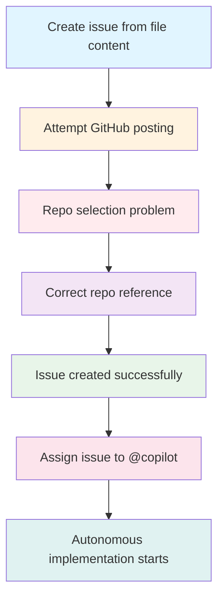
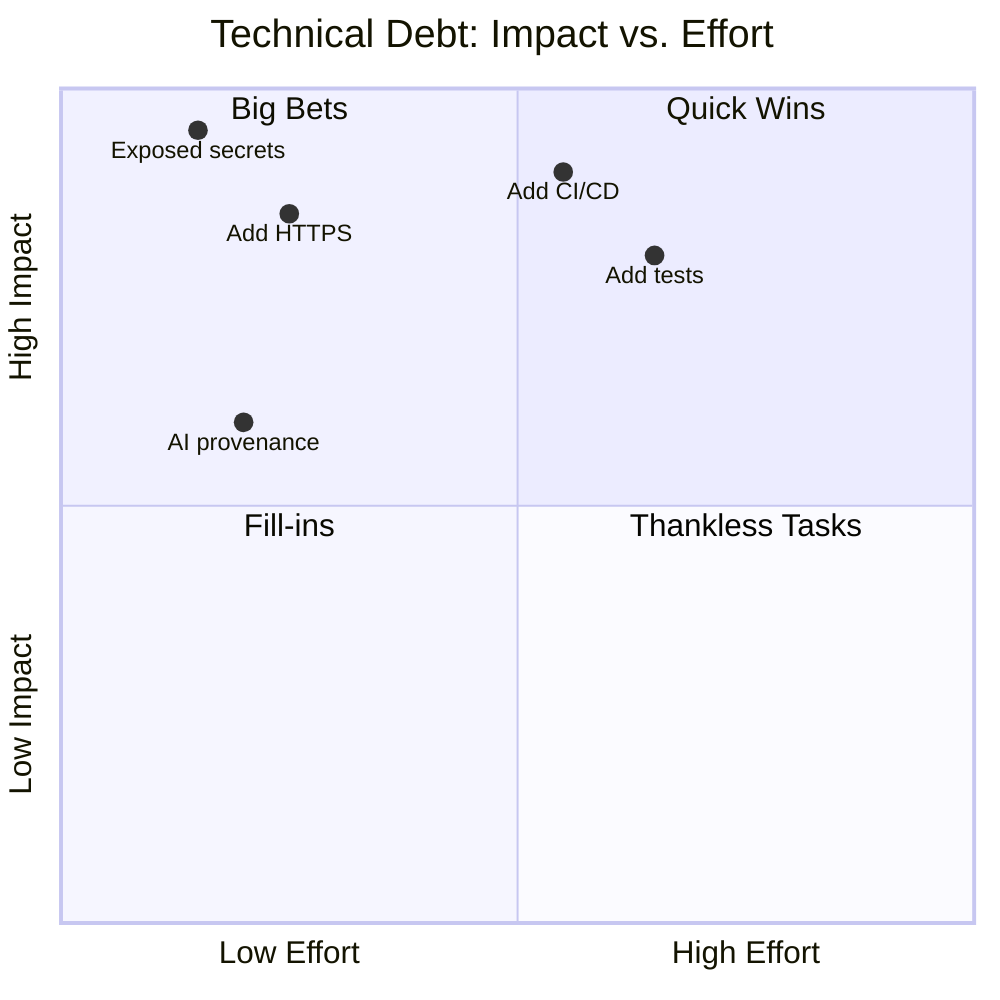
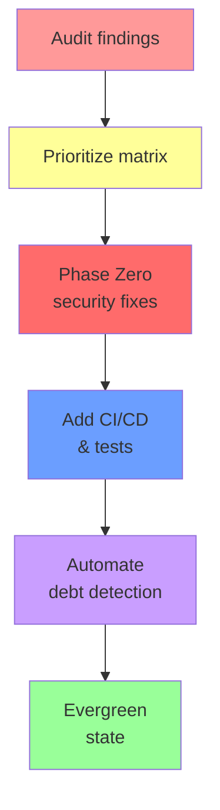

## Welcome Back to AI-Assisted Software Development

- Ready to continue where we left off
- Today's session builds on what we've covered
- We're all in this together — participation welcome
- **Questions are always welcome — ask anytime!**

::: notes
Duration ~00:02

Welcome everyone back to the session. Take a moment to let people settle in before diving into content. Acknowledge that it's great to see everyone back and express enthusiasm for the session ahead.

Key talking points:

- Remind attendees of the previous session's topics briefly
- Emphasize that questions are encouraged at any point — not just at the end
- Set a positive, inclusive tone for the session
- If this is after a break, give people 30 seconds to get re-focused

Transition: "Let's pick up right where we left off..."
:::

---

<!-- _class: lead -->

## Course Modules

- Intro
- **▶ AI Practitioner Resources**
- Brownfield Software Development
- AI Implementation Workflow
- Building a Backlog
- Addressing Technical Debt
- Multi-Implementation Comparison

---

## AI Practitioner Resources

AI Practitioner Resources
  - https://ai-resources.codemag.com
  - AI curated collection of resources for AI-assisted software development
  - AI-first
  - Prompt-first
  - Prompt-only

---

<!-- _class: lead -->

## Course Modules

- Intro
- AI Practitioner Resources
- **▶ Brownfield Software Development**
- AI Implementation Workflow
- Building a Backlog
- Addressing Technical Debt
- Multi-Implementation Comparison

---

## What is Legacy Code

- No universally accepted definition
- Easier to define what is _not_ legacy code

::: notes
Try this in quick chat:

- "what are three definitions of legacy code?"
- "what are 10 definitions of legacy code?"
- "what are 25 definitions of legacy code?"

Ask the audience: "Who recognizes these definitions in their work?"

Encourage discussion about their experiences with legacy code. This primes the audience to think critically about the term rather than accepting a single definition. The variety of answers from AI prompts demonstrates that the concept is genuinely contested. (~2 minutes)
:::

---

## What is Not Legacy Code

- All codebases start as greenfield
- Few codebases are evergreen

::: notes
Explain greenfield characteristics: new code, clear patterns, modern tooling, no accumulated debt. The key insight is that greenfield is the starting point, not a permanent state. Ask: how many in the room are working on a truly greenfield project right now? The answer is usually "very few." Evergreen is the rare exception — code that has been actively maintained to resist decay. Most production code falls somewhere on the spectrum between "recently greenfield" and "deeply legacy." (~1.5 minutes)
:::

---

## Codebases Degrade Over Time

Due to changes in:

- Technology
- Practices
- People
- Business rules
- Workflows
- Architecture

::: notes
Discuss each driver of decay with a brief example. Technology: the framework you chose in 2015 is now unmaintained. Practices: the team that wrote this used a different style guide. People: the original authors left and took context with them. Business rules: the logic was correct for the old pricing model, not the new one. Workflows: the CI/CD pipeline changed but the code assumptions didn't. Architecture: microservices replaced the monolith but some code was never migrated. The point: code doesn't degrade because developers did something wrong — it degrades because the world around it changed. (~2 minutes)
:::

---

## What is Evergreen Code

- Evergreen code actively resists technical debt
- Evergreen ≠ Legacy; everything else is
- Evergreen is the goal
  - _"If we were to write it all over again, it would turn out just like it is"_

::: notes
Describe evergreen goals: maintainability, minimal debt, and consistent patterns that still align with modern practices. The defining characteristic is that evergreen code is intentional — it doesn't happen by accident. Teams invest in keeping it current. The quote on the slide is the ultimate test: if you'd make the same decisions today, the code is evergreen. If you'd do it differently, it has started to decay. Use this as a reflective question for the audience: can they point to any part of their codebase that passes this test? (~2 minutes)
:::

---

## Safe Brownfield Coding

Using feature flags to minimize risk
As-Is and To-Be test suites
Testing in production
Retiring feature flags

::: notes
Introduce this module as a practical guide to modifying brownfield systems safely. Emphasize that the goal is not speed — it's controlled, observable, reversible change. Feature flags, test suites, and production-safe practices form the backbone of safe modernization.
:::

---

## Essential Safety Measures

- AI accelerates development, but it also accelerates mistakes
- Strong safety nets must be in place before introducing AI into a brownfield codebase

These practices reduce risk, increase confidence, and protect production systems

::: notes
This slide sets the stage: AI doesn't replace engineering discipline — it amplifies it.

Before we let AI touch a brownfield system, we need guardrails.

These safety measures aren't optional; they're what make AI-assisted development sustainable and safe.

Think of them as the foundation that keeps modernization from turning into accidental rewrites or regressions.
:::

---

## Backup & Rollback Strategies

- Use branching strategies that isolate AI-generated changes
- Commit early and often to create natural rollback points
- Archive snapshots of critical modules before modernization
- Ensure you can revert any AI-assisted change without drama
- Use feature flags to separate release from deployment

::: notes
AI can produce large changes quickly.

That's powerful — and dangerous without rollback.

Branches, frequent commits, and archives give you a safety net.

The goal is simple: no AI-generated change should ever put you in a position where you can't easily go back.

Rollback confidence is what enables experimentation
:::

---

## Confidence Frameworks

- Strong tests are the backbone of safe AI-assisted refactoring
  - Unit, integration, and behavioral tests validate AI output
  - Coverage matters less than signal quality
  - Tests should detect regressions, not just assert happy paths
  - If all of the test automation passes, how confident are you to deploy to production?

::: notes
AI can help generate tests, but you need a baseline first.

Without a reliable test suite, you're flying blind.

The goal isn't 100% coverage — it's meaningful coverage.

Tests should give you confidence that AI-generated changes behave the same as before unless intentionally modified.

This is what makes modernization safe instead of risky
:::

---

## Change Review Processes

- Use human-in-the-loop validation for correctness and intent
- Require architectural review for structural changes
- Enforce standards through linters, static analysis, and policy checks
- Leverage AI to reduce the review burden

::: notes
AI is fast, but it's not authoritative.

Every change needs review — not because AI is untrustworthy, but because context matters.

Humans validate intent, architecture, and alignment with business rules.

Automated checks enforce consistency.

Together, they create a multi-layered review process that keeps quality high.
:::

---

## Incremental Change Methodology

- Break modernization into small, safe, reversible steps
- Avoid “big bang” refactors – they're brittle and risky
- Use iterative loops: propose → validate → refine → commit
- Let AI assist with each step rather than entire subsystems at once

Working Effectively with Legacy Code | Hacker News Books

::: notes
Incrementalism is the antidote to brownfield fear.

AI makes it tempting to modernize huge sections at once, but that's where risk spikes.

Instead, treat modernization as a series of controlled, reversible steps.

Each step builds confidence.

Each step is testable.

Each step is safe.

This is how evergreen systems emerge.
:::

---

## Keeping Change Sets Small

- Small diffs are easier to review and validate
- Small changes reduce merge conflicts and regression risk
- AI should be instructed to limit scope intentionally
- Small changes accumulate into large improvements over time
- Beware: AI can produce huge amounts of code quickly

::: notes
AI tends to produce large outputs unless constrained.

Your job is to keep the scope tight.

Small change sets are easier to understand, easier to test, and easier to roll back.

They also reduce cognitive load for reviewers.

This is how you maintain control while still benefiting from AI's speed
:::

---

## Building Safety Nets

- Protecting brownfield codebases
- Leveraging AI code reviews
- Effective human code reviews
- The role of test automation

::: notes
Introduce this module as the backbone of safe AI-assisted development. Safety nets ensure that modernization efforts do not destabilize working systems. Emphasize that brownfield systems deserve respect, and safety nets are how we honor that reality.
:::

---

## Protecting Brownfield Codebases

Key Practices
  - Preserve existing behavior unless intentionally changed
  - Avoid large, risky refactors
  - Use incremental modernization
  - Maintain architectural boundaries
  - Document every AI-assisted change

Why it matters
  - Brownfield systems run the business
  - Stability is more important than novelty
  - Safety nets reduce fear and increase confidence

::: notes
Reinforce that brownfield systems are valuable assets, not liabilities. Protection means minimizing risk, maintaining continuity, and ensuring that modernization is deliberate rather than accidental.
:::

---

## Leveraging AI Code Reviews

AI can assist by:
  - Highlighting risky changes
  - Detecting missing tests
  - Identifying architectural violations
  - Suggesting safer alternatives
  - Surfacing potential regressions

Benefits
  - Faster feedback loops
  - More consistent review quality
  - Early detection of drift

::: notes
AI code reviews are not replacements for human reviews — they are accelerators. They help catch issues early and provide a second set of eyes that never gets tired.
:::

---

## Effective Human Code Reviews

Human reviewers focus on:
  - Intent and correctness
  - Architectural alignment
  - Business logic validation
  - Risk assessment
  - Ensuring changes are incremental and reversible
  - Best practices
  - Review small change sets
  - Ask for context when missing
  - Validate AI-generated code with skepticism and curiosity

::: notes
Humans bring judgment, domain knowledge, and intuition — things AI cannot replicate. The combination of AI and human review creates a multi-layered safety net.
:::

---

## The Role of Test Automation

Test automation provides:
  - Behavioral guarantees
  - Regression detection
  - Confidence for modernization
  - Guardrails for AI-assisted refactoring

Types of tests
  - Unit tests
  - Integration tests
  - End-to-end tests
  - Snapshot and contract tests

::: notes
Test automation is the ultimate safety net. Without tests, AI-assisted development becomes guesswork. With tests, it becomes a controlled, predictable process.
:::

---

## Exercise: Building the Safety Nets

**Objectives**

- Identify missing safety nets in a brownfield system
- Strengthen protection using AI and human review practices
- Apply test automation principles
- Produce actionable improvements

**Activities**

1. Select a brownfield module or file
2. Identify existing safety nets (tests, reviews, documentation)
3. Ask AI to identify missing or weak safety nets
4. Strengthen by adding tests, drafting review checklists, documenting architectural constraints
5. Share findings with a partner for validation

**Success Criteria**: missing nets identified, improvements are safe and incremental, coverage or clarity improved, review and documentation guardrails are strengthened

::: notes
Duration ~00:20

This exercise is the capstone of the combined module. Students apply all three sections simultaneously: they audit a real codebase, use AI to find gaps, and produce a concrete list of improvements. The partner validation step is important — it simulates the human-in-the-loop review process and often surfaces things one person missed. Debrief questions: what was missing that surprised you? How did AI's assessment of the safety nets compare to your own? What would you prioritize first? Encourage students to bring their findings back to their teams.
:::

---

<!-- _class: lead -->

## Course Modules

- Intro
- AI Practitioner Resources
- Brownfield Software Development
- **▶ AI Implementation Workflow**
- Building a Backlog
- Addressing Technical Debt
- Multi-Implementation Comparison

---

## AI Implementation Workflow

- Getting AI implementation proposals
- Verifying AI understanding of issues
- Starting implementation execution
- Implementation monitoring

::: notes
Duration ~00:01

Use this slide to orient the audience to the flow of the segment. Explain that the process starts before any code is written, because the first step is to see what the AI thinks the problem is and how it plans to solve it. Emphasize that the four topics form a natural sequence and that skipping the early review steps usually creates rework later.
:::

---

## Best Practice: Request a Proposal First

1. **Request Proposal First**
   - "Propose implementation to address issue"
   - Review what AI thinks it will do
   - Verify understanding before execution

2. **Review Proposed Fix**
   - AI reads issue description
   - AI proposes specific fix
   - Human reviews for completeness

::: notes
Duration ~00:02

Explain that the best first prompt is not "implement this now" but "propose implementation to address the issue." That gives you a chance to inspect the AI's understanding before it starts changing files, which is especially useful on brownfield systems. Point out that the human role here is not passive approval; it is active review for scope, assumptions, and missing details.
:::

---

## Identify Gaps Before Execution

3. **Identify Gaps**
   - Check for missing steps
   - Add requirements before proceeding

4. **Proceed with Implementation**
   - "Go ahead with the implementation"
   - Can reference conversation on different machine later
   - Save implementation plan as reference

::: notes
Duration ~00:02

Walk through the idea that a proposal can be directionally right and still incomplete. Use the JWT example to show how an AI may understand the main bug but miss adjacent work, such as removing a related GitHub integration or updating dependent configuration. Once the proposal is complete, you can explicitly authorize execution with something like "go ahead with the implementation" and preserve that plan for later reference, even from another machine.
:::

---

## Compare Multiple Implementations

- Evaluate pros and cons of different approaches
- Compare different solutions to the same problem
- Find and assess alternatives before choosing

::: notes
Duration ~00:01

Close by previewing the next teaching move: comparing multiple implementations instead of accepting the first reasonable answer. Explain that once students know how to get and approve one implementation, the next maturity step is evaluating alternatives for trade-offs like simplicity, safety, and maintainability. This sets up a useful bridge to the next topic while reinforcing that AI can generate options, but humans still choose among them.
:::

---

## Effective Prompts for Technical Debt

- Focus: prompts, issues, and Copilot workflow
- Goal: turn vague cleanup into executable work

::: notes
Duration ~00:09

Open by explaining that technical debt work often fails because requests are too vague. This section shows how to convert cleanup ideas into structured prompts that can be executed, tracked, and reviewed. Emphasize that the topic is not just prompt wording; it is also about how prompts connect to GitHub issues and Copilot workflows. Set expectations that the audience will leave with a repeatable pattern they can apply immediately. (~1 minute)
:::

---

## What a Strong Technical Debt Prompt Includes

Every prompt should define the work clearly

- **Debt description** - the concrete problem to fix
- **Constraints** - architecture, guardrails, and non-negotiables
- **Expected outcome** - what success looks like
- **Test updates** - how validation must change
- **Documentation updates** - what artifacts must be refreshed
- **Provenance requirements** - what must be logged beyond instructions

::: notes
Walk through each component as part of a checklist, not as optional advice. The key message is that a good prompt reduces ambiguity before implementation starts. Highlight that provenance and documentation are easy to forget when teams focus only on code, so they need to be called out explicitly in the request. Frame this slide as the minimum contract between the requester and the AI assistant. (~1.5 minutes)
:::

---

## Why Structured Prompts Matter

Better prompts create better remediation workflows

- Faster remediation because the target is explicit
- More consistent fixes across contributors and sessions
- Less manual follow-up after the first prompt
- A standardized approach for recurring debt categories

> Better prompt quality means less cleanup after the cleanup work

::: notes
This is the business-value slide. Explain that structured prompts reduce rework because they front-load clarity on tests, docs, and guardrails. Connect this to team scalability: if multiple people or multiple models work on similar debt items, consistent prompt structure produces more predictable outputs. Use the quote as the memorable takeaway for why investing in the prompt upfront saves time later. (~1 minute)
:::

---

## GitHub Integration - Direct Issue Creation

Copilot can help move prompt content into GitHub issues

- Example command: `"Post issue #6 to the GitHub owner/repository-name"`
- Copilot can create the issue directly in GitHub
- Labels, assignees, and metadata can be included

::: notes
Present this as the first automation step after prompt authoring. The audience should understand that Copilot can bridge from local artifact or prompt text into the GitHub issue system, but repository targeting must be explicit. Stress the practical lesson from the demo: natural language is often not enough when multiple repositories are in play. Encourage attendees to always state the full repository name to avoid misrouting work. (~1.25 minutes)
:::

---

## Assigning an Issue to @copilot

Paid plan workflow for autonomous implementation

1. Create the issue in GitHub
2. Assign the issue to `@copilot`
3. Copilot creates a work-in-progress branch
4. Copilot implements the requested solution
5. Notifications report ongoing progress
6. Copilot opens a pull request when complete

**Requirements**

- Enterprise license or Pro Plus subscription
- Enterprise workflow requires the repository in the correct org

::: notes
Describe this as the jump from assisted drafting to autonomous execution. The value is not just code generation; it is the full workflow of branch creation, progress updates, and PR delivery. Be clear that this is a paid capability and that organizational placement matters for enterprise scenarios. This helps the audience distinguish between what everyone can do and what requires higher-tier licensing. (~1.25 minutes)
:::

---

## Live Demo Workflow

What happened in the demonstration



::: notes
Use the flowchart to retell the demo as a sequence of decisions and corrections. The important teaching point is that failure was not the end of the workflow; it was a signal to improve context and retry with better specificity. Explain that this is exactly how teams should treat prompt failures in practice: inspect the ambiguity, refine the prompt, and rerun. This slide also helps students remember the workflow as a reusable playbook rather than a one-off demo. (~1 minute)
:::

---

## Reusable Prompt Template for Technical Debt

Use a structure like this for repeatable results

```text
Fix the following technical debt: [describe the problem].
Constraints: [architecture rules, guardrails, scope limits].
Expected outcome: [what should be true when done].
Tests to update: [unit, integration, regression, CI expectations].
Documentation to update: [README, docs, comments, diagrams].
Provenance required: [logs, metadata, linked artifacts].
```

- Treat this as a starting template, then specialize by debt type

::: notes
Give the audience a concrete artifact they can copy into their own workflow. Explain that the template is intentionally simple because its power comes from completeness, not clever phrasing. Encourage them to tailor the constraints and validation sections based on the type of debt item, such as refactoring, security cleanup, or test hardening. Close by connecting the template back to the earlier benefits: clarity, consistency, and reduced manual follow-up. (~1 minute)
:::

---

## Key Takeaways

- Strong prompts define the debt, constraints, outcomes, tests, docs, and provenance
- Assigning to `@copilot` can automate branch, progress, and PR creation
- Technical debt becomes easier to manage when prompts and issues work together

::: notes
Close by tying prompt quality to execution quality. The audience should leave with the idea that technical debt management is not just about identifying problems; it is about packaging them so AI and GitHub workflows can act on them reliably. Re-emphasize the two most practical habits: always include validation and always specify the exact repository. End with a suggested next step: take one existing debt item and rewrite it using the template from the previous slide. (~1 minute)
:::

---

<!-- _class: lead -->

## Course Modules

- Intro
- AI Practitioner Resources
- Brownfield Software Development
- AI Implementation Workflow
- **▶ Building a Backlog**
- Addressing Technical Debt
- Multi-Implementation Comparison

---

## Conformance & Gap Analysis

- Comparing implementations against instruction files
- Automated issue generation from conformance gaps
- Prioritizing technical debt remediation
- Creating actionable remediation plans
- Exercises for hands-on practice

::: notes
Introduce this module as the bridge between architectural intent and real code. Conformance analysis ensures that AI-assisted and human-written code stays aligned with the rules defined in instruction files. This is how teams maintain evergreen quality in brownfield systems.
:::

---

## Comparing Implementations Against Instruction Files

What to compare
- Coding standards
- Architectural boundaries
- Allowed/disallowed patterns
- Domain rules
- Documentation and provenance requirements

Why it matters
- Prevents drift
- Ensures consistency
- Enables safe modernization

::: notes
Instruction files define the “north star” for your codebase. Conformance checks ensure that every change — AI-generated or human — aligns with those rules. This is essential for maintaining predictability in brownfield systems.
:::

---

## Automated Issue Generation From Conformance Gaps

AI can generate:
- Issue titles
- Detailed descriptions
- Violated rules
- Suggested fixes
- Acceptance criteria
- Provenance metadata

Benefits
- Faster backlog creation
- Consistent issue structure
- Reduced manual review effort

::: notes
Automation accelerates the conformance workflow. Instead of manually writing issues, AI can draft them instantly, leaving humans to validate and prioritize.
:::

---

## Prioritizing Technical Debt Remediation

Prioritization factors
- Risk to stability
- Frequency of use
- Security implications
- Architectural importance
- Effort vs. impact

Approaches
- Impact/effort matrix
- Risk scoring
- Dependency analysis

::: notes
Not all technical debt is equal. Prioritization ensures that teams focus on the highest-value remediation work first, rather than chasing low-impact issues.
:::

---

## Creating Actionable Remediation Plans

A strong remediation plan includes:
- Clear problem definition
- Root cause analysis
- Proposed solution
- Step-by-step implementation plan
- Rollback strategy
- Test updates
- Provenance metadata

::: notes
Remediation plans turn issues into action. They provide clarity, reduce risk, and ensure that modernization work is incremental and reversible.
:::

---

<!-- layout: Two Content -->

## Exercise: Create Project Requirement

Objective:
  - Create project requirement instructions, some project-specific, some generic, using both manual and Copilot-assisted methods.

Activities:
  1. Create a project-requirements.md file that includes:
    - Business rules
    - Workflows
    - Purpose
    - Tech stack
    - Architecture

::: column

  2. Use Copilot to generate instruction files using the copilot-instructions.md and the codebase for context.

Success Criteria:
  - Instructions are clear and actionable
  - Both manual and AI-assisted methods are used
  - Instruction files are generated successfully

::: notes
Author requirement docs, then use Copilot to generate scaffolding and validate alignment.
:::

---

<!-- layout: Two Content -->

## Exercise: Create an Implementation Plan

Objectives
- Translate issues into a structured remediation plan
- Ensure changes are incremental and reversible
- Align modernization with evergreen principles
- Incorporate testing and rollback strategies
Activities
1. Select 2–3 issues from the previous exercise.
2. For each issue, create a remediation plan including:
  - Problem definition
  - Root cause
  - Proposed solution
  - Step-by-step implementation
  - Rollback plan
  - Required test updates
  - Documentation updates

::: column

3. Review plan.

Success Criteria
- Plans are incremental, safe, and reversible
- Include clear steps and rollback strategies
- Align with evergreen development principles
- Include test and documentation updates

::: notes
Duration ~00:20

This exercise helps participants move from analysis to execution. The goal is to build modernization plans that are safe, thoughtful, and aligned with evergreen principles.
:::

---

## Building a Backlog

- Identifying technical debt
- Automating the creation of GitHub issues
- Exercise: Building the backlog

::: notes
Introduce this module as the bridge between analysis and action. Once AI identifies risks, gaps, and modernization opportunities, teams need a structured backlog to manage the work. Emphasize that backlog creation is not just administrative — it is a core governance mechanism for safe AI-assisted modernization.
:::

---

## Identifying Technical Debt

AI can surface:
- Outdated patterns
- High-complexity functions
- Duplicate logic
- Missing tests
- Security vulnerabilities
- Architectural drift

Benefits
- Faster discovery
- More consistent classification
- Prioritized modernization roadmap

::: notes
Explain that AI excels at scanning large brownfield systems and surfacing hotspots. This reduces the manual effort required to understand legacy code and helps teams focus on the highest-impact areas first.
:::

---

## Automating the Creation of GitHub Issues

AI can help generate:
- Issue titles
- Detailed descriptions
- Acceptance criteria
- Labels and metadata
- Suggested remediation steps

Why automate?
- Ensures consistency
- Reduces manual backlog grooming
- Produces actionable, high-signal issues
- Accelerates modernization planning

::: notes
Highlight that automation doesn't replace human judgment — it accelerates it. Humans still validate, refine, and prioritize issues, but AI handles the heavy lifting of drafting them.
:::

---

<!-- layout: Two Content -->

## Exercise: Building the Backlog

Objectives
  - Practice identifying technical debt
  - Convert findings into actionable GitHub issues
  - Apply consistent structure
  - Prioritize issues based on risk and impact

Activities
  1. Select a brownfield module or file.
  2. Use AI to identify:
    - Technical debt
    - Risks
    - Test confidence
    - Architectural issues

::: column

  3. Convert each finding into a GitHub issue with:
    - Title
    - Description
    - Acceptance criteria
    - Labels
  4. Prioritize the issues using impact vs. effort.

Success Criteria
  - Issues are clear, actionable, and well-structured
  - Prioritization reflects real risk and effort
  - Backlog is ready for implementation

::: notes
Duration ~00:20

Encourage participants to treat this as a real backlog-building session. The goal is not volume — it's clarity and actionability. Reinforce that a well-structured backlog is the foundation for safe, incremental modernization.
:::

---

## Finding the Gaps: Common Security Findings

When AI audits a brownfield codebase, these issues surface first:

- **Exposed secrets** — credentials or tokens committed to source control
- **Missing HTTPS** — data in transit unencrypted
- **No test coverage** — changes cannot be validated safely
- **No CI/CD pipeline** — deployment is manual and inconsistent
- **Missing AI provenance metadata** — AI-generated changes are untracked

::: notes
Duration ~00:01

Open with the reality that most brownfield codebases have a mixture of these issues lurking beneath the surface, and they are often invisible until something breaks. The key insight is that these are not surprising findings — they are predictable. AI can surface them quickly through a structured audit, and once visible they can be prioritized and addressed systematically.
:::

---

## AI-Assisted Prioritization: Impact vs. Effort

Ask AI to analyze your backlog and position each item on an impact/effort matrix:



::: notes
Duration ~00:01

Explain that the impact/effort matrix is a practical tool for turning a long debt backlog into an ordered action plan. When you ask AI to populate this matrix it needs context about your system, team size, and risk appetite, so the quality of the prompt matters. The quadrant model helps teams stop arguing about priority and start acting on clear categories.
:::

---

## Making Technical Debt Visible

Visibility is the first step toward resolution:

- Ask AI to generate a prioritized issue list from the audit findings
- Represent priorities as GitHub Issues with labels (`P0`, `P1`, `P2`)
- Use Mermaid diagrams to visualize dependencies and sequencing
- Update issue descriptions with AI-proposed implementation steps
- Share the dashboard with the full team — debt is a shared problem

**Outcome**: debt moves from implicit knowledge to tracked, actionable work

::: notes
Duration ~00:01

Make the point that hidden debt is far more dangerous than visible debt. When the team can see what exists, estimate effort, and assign priorities, the problem feels solvable rather than overwhelming. AI accelerates this process dramatically because it can scan large codebases, generate issue descriptions, propose remediation steps, and even draft acceptance criteria in minutes.
:::

---

## Phase Zero: Security with Infinite ROI

Tackle the highest-impact, lowest-effort security items first:

| Item                         | Effort   | Risk Reduced |
| ---------------------------- | -------- | ------------ |
| Rotate exposed secrets       | Very Low | Critical     |
| Enforce HTTPS                | Low      | High         |
| Add secret scanning CI check | Low      | High         |
| Add AI provenance headers    | Very Low | Medium       |

**The "infinite ROI" principle**

> A security breach you prevent costs nothing to fix.
> A breach you miss can cost everything.

::: notes
Duration ~00:01

Introduce "Phase Zero" as a deliberate pre-sprint focused entirely on security hygiene before any feature work begins. The ROI calculation is asymmetric: the cost of rotating a secret is near zero, while the cost of a breach is unbounded. Teams that skip Phase Zero often pay for it later in incident response, customer trust damage, and regulatory consequences.
:::

---

## Reaching Evergreen: Quick Wins Compound

Low-effort, high-impact fixes accumulate into a significantly healthier codebase:



**Evergreen state** = debt is continuously detected, tracked, and paid down

::: notes
Duration ~00:01

Frame Evergreen not as a destination you reach once but as an operating mode where the system continuously improves. The compounding effect is real: once secrets are rotated, HTTPS is enforced, and CI is in place, subsequent changes are safer and faster to make. AI-assisted development accelerates the journey to Evergreen by making audit, prioritization, and remediation faster at every stage.
:::

---

<!-- _class: lead -->

## Course Modules

- Intro
- AI Practitioner Resources
- Brownfield Software Development
- AI Implementation Workflow
- Building a Backlog
- **▶ Addressing Technical Debt**
- Multi-Implementation Comparison

---

## Addressing Technical Debt

- Prompting Copilot to address debt
- Assigning issues to Copilot
- What Copilot does with assigned issues
- Exercises for hands-on practice

::: notes
Introduce this module as the moment where AI becomes an active contributor to modernization. Technical debt is inevitable in brownfield systems, but AI can help teams address it safely, incrementally, and with strong guardrails.
:::

---

## Prompting Copilot to Address Technical Debt

Effective prompts include:
  - Clear description of the debt
  - Constraints and architectural rules
  - Expected outcomes
  - Required tests and documentation updates
  - Provenance requirements
Benefits
  - Faster remediation
  - Consistent application of patterns
  - Reduced manual effort

::: notes
Explain that Copilot responds best to structured, high-signal prompts. The more explicit the constraints, the safer and more predictable the remediation.
:::

---

## Assigning Issues to Copilot

How assignment works
  - Convert technical debt into GitHub issues
  - Provide context, constraints, and acceptance criteria
  - Use Copilot to draft remediation steps
  - Let Copilot propose code changes in PRs

Why assign issues?
  - Creates a repeatable workflow
  - Keeps humans in the reviewer role
  - Ensures traceability and provenance

::: notes
Assigning issues to Copilot formalizes the workflow. It treats Copilot like a junior developer who receives tasks, produces drafts, and awaits review.
:::

---

## What Copilot Does With Assigned Issues

- Copilot reads the issue description and linked context
- Generates a proposed plan or implementation approach
- Creates or updates pull requests with code changes
- Adds explanations, tests, and documentation as needed
- Iterates based on review comments
- Maintains traceability between issue → PR → commits

::: notes
**Overview**  When you assign an issue to GitHub Copilot on GitHub.com, Copilot behaves like a managed junior developer. It doesn't magically “solve” the issue — it follows a structured workflow grounded in the issue description and repository context.
**Reads the Issue and Context**  Copilot parses the issue body, labels, linked discussions, and any referenced files. The quality and specificity of the issue strongly influence the quality of the output.
**Generates a Work Plan**  Copilot drafts an implementation plan. This may include steps, architectural notes, or a breakdown of required changes. It uses repository code, patterns, and conventions to stay consistent.
**Creates or Updates Pull Requests**  Copilot opens a PR with proposed changes. These changes often include code, tests, and documentation updates. It may also update an existing PR if the issue is already in progress.
**Responds to Feedback**  When maintainers leave comments, Copilot can revise the PR. It treats comments as instructions, similar to how a junior developer would respond to review notes.
**Maintains Traceability**  Copilot links the PR back to the issue, references commits properly, and ensures the work is tracked through GitHub's normal workflow. This supports auditability and provenance — something you and I both care about deeply.
**Key Takeaway**  Copilot doesn't replace engineering judgment. It accelerates the mechanical parts of implementation while relying on humans for direction, review, and acceptance.
:::

---

<!-- layout: Two Content -->

## Exercise: Generate Instruction Files

Objectives
  - Use meta prompts to scale instruction-file creation
  - Capture module-specific rules
  - Encode domain and architectural constraints

Activities
  1. Prompt Copilot to create instruction files for the standards and conventions of the tech stack
  2. Review instructions

::: column

Success Criteria
  - Instruction files reflect real system constraints
  - Meta prompts produce consistent structure
  - Files are ready for team use

::: notes
Duration ~00:20

Participants experience the leverage of meta prompts and see how AI can accelerate documentation.

Prompts:

Create instruction files for the backend technologies

Create instruction files for the front-end technologies

Create instruction files for the front-end technologies
:::

---

<!-- Layout: Two Content -->

## Exercise: Generate Issues to Make the Codebase Evergreen

Objectives
  - Identify conformance gaps
  - Convert gaps into actionable issues
  - Apply consistent structure and provenance
  - Prioritize issues based on risk and impact

Activities
  1. Select a brownfield module or file.
  2. Compare it against the project's instruction file.
  3. Ask AI to identify conformance gaps.

::: column

  4. Convert each gap into a GitHub issue with:
    - Title
    - Description
    - Violated rule
    - Suggested remediation
    - Acceptance criteria
    - Provenance metadata
  5. Prioritize the issues.

Success Criteria
- Issues are clear, actionable, and aligned with instruction files
- Provenance metadata is included
- Prioritization reflects real risk and effort
- Backlog is ready for team review

::: notes
Duration ~00:15

Encourage participants to treat this as a real backlog-building session. The goal is clarity and actionability, not volume.
:::

---

<!-- Layout: Two Content -->

## Exercise: Identifying Code Outside the Guardrails

Objectives
  - Detect code that violates architectural rules
  - Identify patterns that contradict instruction files
  - Practice safe analysis workflows
  - Make a plan for remediation

Activities
  1. Review the code
  2. Compare it against the instruction files
  3. Identify violations or risky patterns
  4. Propose safe remediation steps
  5. Document findings with provenance

Success Criteria
  - Deviations are correctly identified
  - Remediation steps are safe and incremental
  - Documentation includes provenance

::: notes
Duration ~00:10

This exercise reinforces the importance of guardrails and helps participants practice applying them to real code.
:::

---

## Exercise: Code Quality Analysis

Objectives
  - Use AI to detect non-evergreen code patterns in the workspace.
  - Distinguish temporary artifacts from long-lived maintainable assets.
  - Propose practical evergreen refactors with clear priority.

Activities
1. AI Baseline Scan
  - Run an AI prompt to identify files that look date-bound, draft-only, or placeholder-heavy.
  - Collect at least 8 candidate findings across docs, prompts, and slides.
2. Evidence and Classification
  - Classify each finding as one type: date-bound metadata, draft artifact, stale placeholder, duplicated policy, or legacy process text.
  - Validate each candidate with one concrete file location.
3. Evergreen Refactor Plan
  - Select top 3 high-impact findings.
  - Write a before/after recommendation focused on longevity, clarity, and reduced maintenance.
4. Share and Defend
  - Present one finding and explain why it is not evergreen.
  - Defend your proposed fix with expected impact.

Success Criteria
  - 8 or more non-evergreen findings identified with evidence.
  - Findings are correctly categorized by non-evergreen pattern.
  - Top 3 recommendations are specific, actionable, and evergreen-focused.
  - Team can explain why each proposed change improves long-term maintainability.

::: notes
Duration ~00:20

## Code Quality Analysis Exercise Instructions

**Prerequisites:** Access to the full workspace, AI chat enabled, and search tools available.

### Objectives

- Find and document non-evergreen code and content patterns.
- Use AI plus direct file evidence to avoid false positives.
- Convert findings into evergreen improvement actions.

### Suggested Prompt

Analyze the workspace for code or content that is not evergreen. Focus on date-coupled content, draft artifacts, placeholders like <auto> or <timestamp>, duplicated instructions, and unstable naming. Return findings as: file, reason, risk, and evergreen fix.

### Suggested Hunt Areas

- Slides with draft naming patterns and temporary outputs.
- Prompt and instruction files containing placeholder metadata.
- Repeated policy content that can drift over time.

### Activities

- Step 1: Run your AI scan and collect raw findings.
- Step 2: Verify each result against an actual file and exact snippet.
- Step 3: Prioritize top 3 findings by impact and effort.
- Step 4: Draft evergreen replacements and share with the group.

### Success Criteria

- At least 8 validated findings.
- At least 3 high-impact evergreen refactors proposed.
- Clear justification connecting each fix to maintainability and future reuse.
:::

---

<!-- Layout: Two Content -->

## Exercise: Prompt Copilot to Address Technical Debt

Objectives
  - Practice writing high-signal prompts
  - Apply architectural constraints
  - Produce safe, incremental remediation requests

Activities
  1. Select a small piece of technical debt.
  2. Write a prompt that includes:
    - Description of the debt
    - Constraints and rules
    - Expected behavior
    - Required tests and documentation

::: column

  3. Ask Copilot to propose a remediation.
  4. Review the output for correctness.

Success Criteria
  - Prompt is clear, scoped, and actionable
  - Copilot produces a safe, incremental change
  - Output aligns with architectural rules
  - Provenance metadata is included

::: notes
Duration ~00:10

Use this first exercise to make participants slow down and specify the work before they ask for code. Encourage them to choose a small but real technical debt item from their own system, because realistic context exposes whether the prompt includes enough architecture, testing, and documentation guidance to keep the change safe. During the review step, ask them to inspect whether Copilot stayed incremental, respected the stated constraints, and requested or updated tests instead of only proposing a code edit. Transition by explaining that a strong prompt is useful, but durable team workflows usually need the same clarity captured in a structured issue.
:::

---

## Exercise: Assigning an Issue to Copilot

Objectives

- Convert technical debt into a structured issue
- Provide Copilot with actionable context
- Practice writing acceptance criteria

Activities

1. Select a technical debt item.
2. Create a GitHub-style issue with:
   - Title
   - Description
   - Impact and risk
     ::: column
   - Acceptance criteria
   - Provenance metadata
3. Assign the issue to Copilot.
4. Review Copilot's proposed remediation.

Success Criteria

- Issue is clear and well-structured
- Acceptance criteria are testable
- Copilot produces a relevant draft
- Provenance metadata is present

::: notes
Duration ~00:10

Frame this exercise as the handoff from ad hoc prompting to a repeatable engineering process. Participants should write the issue as if they were briefing a junior developer: the title should be specific, the problem statement should identify impact and risk, and the acceptance criteria should make review straightforward and testable. When they evaluate Copilot's draft, focus on whether the output follows the issue rather than whether it merely looks polished, because a clean-looking response can still drift from the requested scope. Transition by noting that once the issue is strong, teams can delegate larger units of work with more confidence, as long as they keep the plan reviewable and reversible.
:::

---

<!-- Layout: Two Content -->

## Exercise: Delegating Work to Copilot

Objectives
  - Practice delegating multi-step tasks
  - Ensure Copilot follows architectural rules
  - Validate AI-generated remediation plans

Activities
  1. Select a multi-step technical debt item.
  2. Ask Copilot to:
    - Analyze the problem
    - Propose a remediation plan
    - Generate code changes

::: column

    - Update tests
    - Update documentation
  3. Review Copilot's output.
  4. Identify missing context or risks.

Success Criteria
  - Delegation prompt is complete and structured
  - Copilot produces a multi-step plan
  - Output is safe, incremental, and reversible
  - Human review identifies any gaps

::: notes
Duration ~00:15

This final exercise is about controlled delegation, not blind trust. Ask participants to evaluate the output in layers: first the analysis, then the proposed sequence of changes, then whether the generated edits remain small enough to review and roll back safely. If Copilot skips tests, documentation, or architecture rules, treat that as a signal that the delegation prompt still needs sharper boundaries or missing context. Close by reinforcing that Copilot can accelerate larger remediation efforts, but humans remain responsible for approving the plan, spotting risk, and deciding whether the generated work is actually ready to merge.
:::

---

<!-- _class: lead -->

## Course Modules

- Intro
- AI Practitioner Resources
- Brownfield Software Development
- AI Implementation Workflow
- Building a Backlog
- Addressing Technical Debt
- **▶ Multi-Implementation Comparison**

---

## Multi-Model Implementation Comparison

- Implementing changes with different AI models
- Comparing approaches and outcomes
- Risk assessment and quality evaluation
- Best practice synthesis
- Exercises for hands-on practice

::: notes
Introduce this module as a way to help teams understand how different AI models behave when given the same task. Emphasize that multi-model comparison is a powerful guardrail: it reduces hallucinations, improves quality, and helps teams choose the right model for the right job.
:::

---

## Implementing Changes With Different AI Models

Why use multiple models?
  - Different reasoning styles
  - Different strengths (refactoring, documentation, architecture)
  - Cross-validation reduces risk
  - Helps detect missing context or contradictions

Typical use cases
  - Refactoring comparisons
  - Documentation consistency checks
  - Architecture proposal validation

::: notes
Explain that no single model is perfect. Using multiple models gives teams a broader perspective and helps catch errors or blind spots that one model alone might miss.
:::

---

## Comparing Approaches & Outcomes

What to compare
  - Code structure and clarity
  - Architectural alignment
  - Test quality
  - Documentation completeness
  - Risk level of proposed changes

Benefits
  - Identifies the safest implementation
  - Surfaces hidden assumptions
  - Highlights model-specific biases

::: notes
Encourage participants to treat model outputs like multiple drafts from different engineers. The goal is not to pick a winner — it's to synthesize the best ideas.
:::

---

## Risk Assessment & Quality Evaluation

Risk indicators
  - Missing tests
  - Large or unnecessary refactors
  - Violations of instruction files
  - Unclear or undocumented behavior

Quality indicators
  - Small, incremental changes
  - Clear reasoning
  - Strong test coverage
  - Alignment with evergreen principles

::: notes
Reinforce that risk assessment is essential in brownfield systems. Even if a model produces elegant code, it may be too risky without proper guardrails.
:::

---

<!-- Layout: Two Content -->

## Exercise: Prompt Copilot to Address Technical Debt

Objectives
  - Practice writing high-signal prompts
  - Apply architectural constraints
  - Produce safe, incremental remediation requests

Activities
  1. Select a small piece of technical debt.
  2. Write a prompt that includes:
    - Description of the debt
    - Constraints and rules
    - Expected behavior
    - Required tests and documentation

::: column

  3. Ask Copilot to propose a remediation.
  4. Review the output for correctness.

Success Criteria
  - Prompt is clear, scoped, and actionable
  - Copilot produces a safe, incremental change
  - Output aligns with architectural rules
  - Provenance metadata is included

::: notes
Duration ~00:10

Encourage participants to choose a real example from their brownfield system. The goal is clarity and safety, not complexity.
:::

---

<!-- layout: Two Content -->

## Exercise: Prompt Multiple Models to Address Technical Debt

Objectives
  - Compare outputs from different models
  - Identify strengths and weaknesses
  - Evaluate risk and quality

Activities
  1. Select a small technical debt item.
  2. Prompt two or more models to propose a fix.

::: column

  3. Compare outputs for:
    - Safety
    - Clarity
    - Test coverage
    - Architectural alignment
  4. Synthesize the best elements into a final solution.

Success Criteria
  - Differences between models are clearly identified
  - Risks and strengths are evaluated
  - Final synthesized solution is safe and incremental
  - Provenance metadata is included

::: notes
Duration ~00:15

Encourage participants to think like reviewers comparing multiple PRs. The goal is to understand model behavior, not to pick a favorite.
:::
