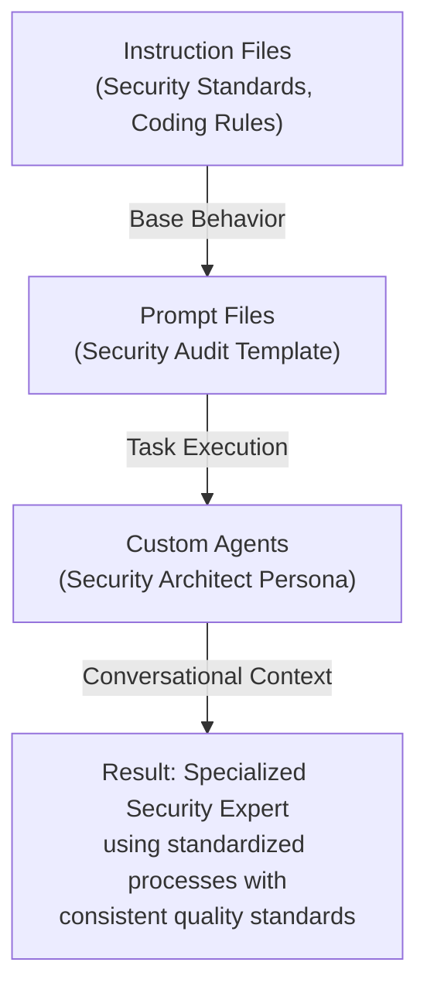
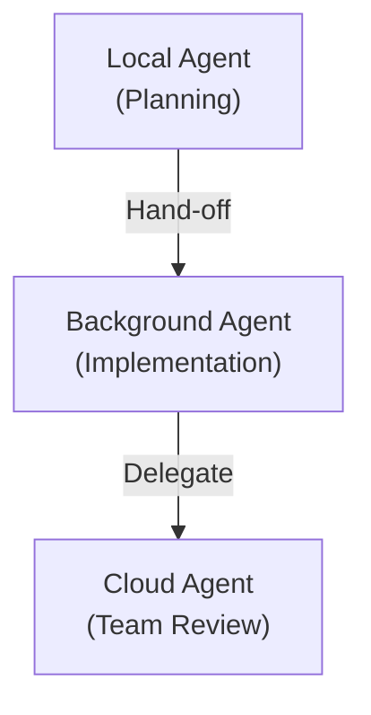
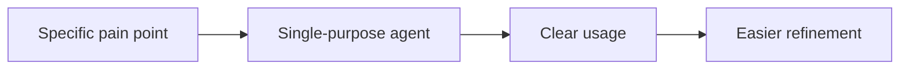
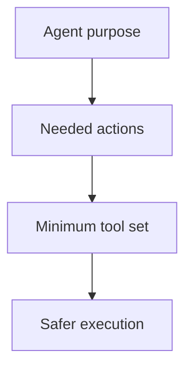
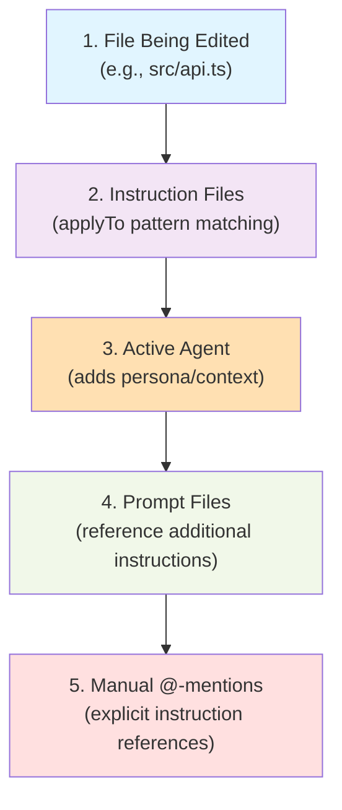
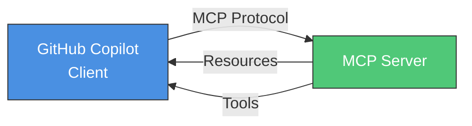
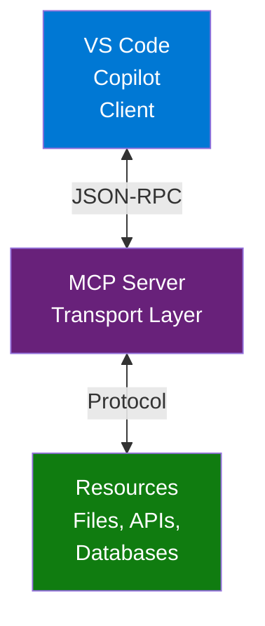
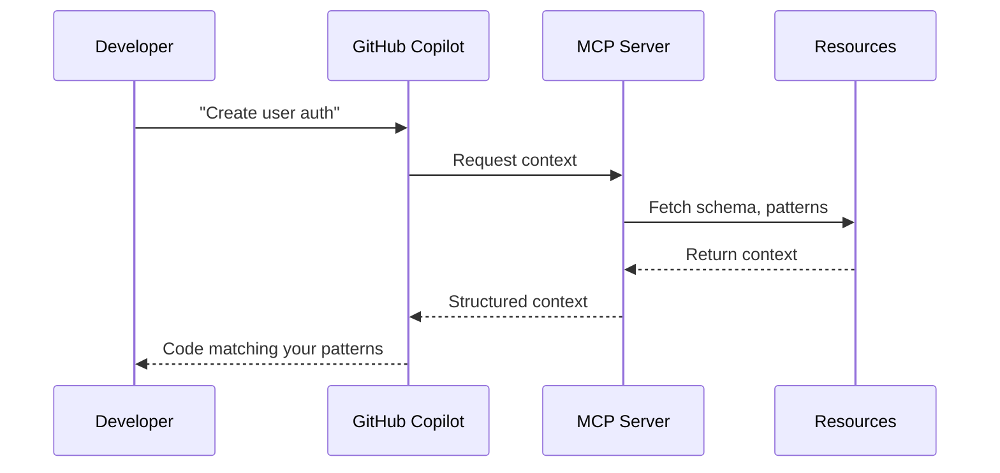

## Welcome Back to AI-Assisted Software Development

- Ready to continue where we left off
- Today's session builds on what we've covered
- We're all in this together — participation welcome
- **Questions are always welcome — ask anytime!**

::: notes
Duration ~00:02

Welcome everyone back to the session. Take a moment to let people settle in before diving into content. Acknowledge that it's great to see everyone back and express enthusiasm for the session ahead.

Key talking points:

- Remind attendees of the previous session's topics briefly
- Emphasize that questions are encouraged at any point — not just at the end
- Set a positive, inclusive tone for the session
- If this is after a break, give people 30 seconds to get re-focused

Transition: "Let's pick up right where we left off..."
:::

---

<!-- _class: lead -->

## Course Modules

- Intro
- **▶ Test Automation and Code Quality**
- Instructions vs Prompts vs Custom Agents
- Custom Agents
- Skills
- MCP

---

## Test Automation & Code Quality

- AI-assisted test generation (unit, integration, E2E)
- Intelligent linting beyond static analysis
- Coverage analysis and test adequacy assessment
- Automated quality gates

::: notes
Introduce this module as the foundation for safe, predictable modernization.

Test automation and quality gates are the mechanisms that allow teams to move quickly without breaking brownfield systems.

AI accelerates these workflows but must be guided by strong guardrails.
:::

---

## AI-Assisted Test Generation

AI can generate:
  - Unit tests for functions, classes, and utilities
  - Integration tests for module interactions
  - End-to-end tests for full workflows
  - Edge-case tests and regression scenarios
  - Contract tests for APIs and services

Benefits
  - Rapid coverage expansion
  - Consistent structure and naming
  - Reduced onboarding time

::: notes
Explain that AI dramatically accelerates test creation, but humans still validate correctness and intent.

Emphasize that tests are only valuable when they reflect real business behavior, not just code structure.
:::

---

## Intelligent Linting

AI-enhanced linting can detect:
  - Architectural violations
  - Anti-patterns
  - Unsafe refactors
  - Missing documentation
  - Inconsistent naming or domain terminology

Why it matters
  - Goes beyond syntax
  - Enforces architectural guardrails
  - Reduces long-term technical debt

::: notes
Static analysis tools catch syntax and style issues, but AI can reason about architecture, intent, and domain rules.

This creates a deeper layer of quality enforcement.
:::

---

## Coverage Analysis

AI can help evaluate:
  - Coverage gaps
  - Missing edge cases
  - Over-testing of implementation details
  - Under-testing of business logic
  - Redundant or brittle tests

Outcomes
  - More meaningful coverage
  - Better alignment with real behavior
  - Reduced maintenance burden

::: notes
Coverage numbers alone are misleading.

AI helps teams understand whether tests are adequate, not just numerous. Adequacy is the real measure of safety.
:::

---

## Automated Quality Gates

Quality gates can enforce:
  - Minimum test coverage
  - Linting and architectural checks
  - Provenance requirements
  - PR-level test generation
  - Risk scoring for changes

Benefits
  - Prevents regressions
  - Ensures consistent quality
  - Supports evergreen development

::: notes
Quality gates turn best practices into automated enforcement.

They ensure that every change – human or AI-generated – meets the team's standards before merging.
:::

---

<!-- layout: Two Content -->

## Exercise: Strengthening Test Automation & Code Quality

Objectives
  - Identify gaps in test automation
  - Use AI to generate missing tests
  - Apply intelligent linting and quality gates
  - Validate test adequacy and architectural alignment

Activities
  1. Select a brownfield module or function
  2. Review existing tests for:
    - Coverage gaps
    - Missing edge cases
    - Redundant or brittle tests

::: column

  3. Ask AI to generate missing tests
  4. Run linting and architectural checks
  5. Propose quality gates to enforce improvements
  6. Add provenance metadata to all new artifacts

Success Criteria
  - Coverage gaps are identified and addressed
  - AI-generated tests are validated and correct
  - Linting and architectural issues are resolved
  - Proposed quality gates are actionable and safe
  - Provenance metadata is included

::: notes
Duration ~00:20

## Strengthening Test Automation & Code Quality Exercise Instructions

**Prerequisites:** Access to a brownfield codebase with existing tests

### Objectives

- Identify gaps in test automation
- Use AI to generate missing tests
- Apply intelligent linting and quality gates
- Validate test adequacy and architectural alignment

### Activities

1. **Select a brownfield module or function** - Choose a component with existing but incomplete test coverage.
2. **Review existing tests** - Analyze for coverage gaps, missing edge cases, and brittle or redundant tests.
3. **Ask AI to generate missing tests** - Use targeted prompts to fill identified gaps.
4. **Run linting and architectural checks** - Execute automated quality tools to identify issues.
5. **Propose quality gates** - Define enforceable quality standards for continuous improvement.
6. **Add provenance metadata** - Document all AI-assisted artifacts with proper metadata.

### Success Criteria

- Coverage gaps are identified and addressed
- AI-generated tests are validated and correct
- Linting and architectural issues are resolved
- Proposed quality gates are actionable and safe
- Provenance metadata is included

### Key Teaching Point

Encourage participants to treat this as a real modernization task.

The goal is not to generate as many tests as possible – it's to improve the safety, clarity, and maintainability of the testing framework in a targeted, evergreen-aligned way.

Focus on quality over quantity, and ensure that any proposed quality gates are achievable and won't block legitimate work.
:::

---

## Generating Comprehensive Test Suites

AI can help generate:
  - Unit tests
  - Integration tests
  - End-to-end tests
  - Snapshot and contract tests
  - Edge-case and regression tests

Benefits
  - Faster coverage expansion
  - Consistent test structure
  - Reduced onboarding time

::: notes
Explain that AI accelerates test creation dramatically, but humans still validate correctness and intent. Comprehensive test suites give teams the confidence to refactor and modernize safely.
:::

---

## Managing Test Suites Over Time

Key Practices
  - Regularly prune obsolete tests
  - Update tests alongside code changes
  - Maintain clear naming and structure
  - Use coverage reports to guide improvements
  - Version-control test strategy documents

::: notes
Test suites age just like code. Without maintenance, they become brittle, noisy, or misleading. Encourage teams to treat test suites as living artifacts that evolve with the system.
:::

---

## Test Review & Validation Strategies

AI-assisted review can:
  - Detect missing assertions
  - Identify redundant tests
  - Suggest edge cases
  - Flag inconsistent patterns

Human reviewers focus on:
  - Intent correctness
  - Business logic validation
  - Architectural alignment

::: notes
AI is excellent at pattern detection and coverage suggestions, but humans validate whether tests reflect real business rules. Together, they create a multi-layered validation process.
:::

---

## Balancing Test Coverage with Maintainability

Principles
  - Aim for meaningful coverage, not maximal coverage
  - Prioritize high-risk and high-change areas
  - Avoid over-testing implementation details
  - Keep tests readable and maintainable

::: notes
High coverage numbers can be deceptive. The goal is not 100% coverage — it's meaningful coverage that protects behavior without creating maintenance burdens. Encourage teams to focus on value, not vanity metrics.
:::

---

<!-- layout: Two Content -->

## Exercise: Strengthening Your Testing Framework

Objectives
  - Identify gaps in an existing test suite
  - Use AI to generate missing tests
  - Improve maintainability and structure
  - Validate tests for correctness and intent

Activities
  1. Select a brownfield module or function.
  2. Review existing tests for:
    - Coverage gaps
    - Redundant or brittle tests
    - Missing edge cases

::: column

  3.  Ask AI to generate missing tests.
    - Validate AI-generated tests for correctness.
    - Refactor or reorganize tests for clarity.
    - Add provenance metadata to all new tests.

Success Criteria
    - Coverage gaps are identified and addressed
    - AI-generated tests are validated and correct
    - Test suite readability and structure improve
    - Provenance metadata is included

::: notes
Duration ~00:20

Encourage participants to treat this as a real modernization task. The goal is not to generate as many tests as possible — it's to improve the safety and clarity of the testing framework in a targeted, maintainable way.
:::

---

## Feature Flags & Test Suites

Safe deployment strategies for brownfield modernization
  - Feature flags for managing work-in-progress
  - As-Is vs. To-Be test suites
  - Retiring flags with AI assistance

::: notes
Introduce this section as a practical framework for deploying changes safely in existing codebases. The three pillars — feature flags, As-Is tests, and To-Be tests — work together to give teams confidence and control. Spend a moment framing the problem: production systems can't afford regressions, yet they must evolve. This is the solution. (~1 minute)
:::

---

## As-Is Test Suites — Purpose

Capture what your system does _right now_

- **Freeze current behavior** — tests describe production
- **Protect against regressions** — know when something breaks
- **Document expectations** — living spec of legacy behavior
- **Production gate** — go to production anytime As-Is tests pass

::: notes
As-Is tests are your safety net. Emphasize that their job is NOT to validate the ideal behavior — it's to describe what the system does today. If an As-Is test fails, something that used to work is now broken. That's a regression. The key insight: passing As-Is tests = safe to deploy. This reframes testing from "checking if new code is right" to "confirming nothing regressed." (~1.5 minutes)
:::

---

## As-Is Test Suites — Building Confidence

Grow coverage incrementally before making changes

- Add tests **before** modifying code
- Increase coverage as changes are identified
- Build trust in the suite over time
- New implementations hidden behind **feature flags**
- Compiled code + passing As-Is tests = high confidence

::: notes
The growth strategy matters: don't try to get 100% coverage before you start. Instead, write As-Is tests for the specific areas you're about to change. This creates a targeted safety net exactly where it's needed. Highlight the confidence formula — compiled code plus passing As-Is tests is a strong signal that you haven't broken anything. (~1.5 minutes)
:::

---

## As-Is Test Suites — Critical Rules

⚠️ These rules determine production safety

| Rule                        | Details                                    |
| --------------------------- | ------------------------------------------ |
| **Feature flag discipline** | All new code MUST be wrapped by flags      |
| **Watch for bleed**         | Unwrapped code goes straight to production |
| **As-Is tests as gate**     | These tests define production readiness    |

::: notes
This slide is about risk. The most dangerous mistake is writing new code that runs unconditionally — it bypasses the entire protection strategy. Emphasize the "bleed" concept: any code outside a feature flag is live code. As-Is tests only protect you if the flag discipline is maintained. Make this memorable: "if it's not behind a flag, it's in production." (~1.5 minutes)
:::

---

## To-Be Test Suites — Purpose

Define and track the future state

- **Define future behavior** — tests describe what you're building
- **Validate work-in-progress** — confidence during development
- **Track implementation progress** — know how far you've come
- Run only when feature flag is **ON**

::: notes
To-Be tests are forward-looking. They describe the system you're building, not the system you have. The critical difference from As-Is tests: To-Be tests are expected to fail until the feature is complete. They gate the feature flag, not production. Use the analogy of a construction blueprint — it shows what the building will look like, not what it looks like today. (~1.5 minutes)
:::

---

## To-Be Test Suites — Workflow

Step-by-step implementation pattern

1. Implement feature flag around code to modify
2. When flag **ON** → execute new behavior
3. Write tests that only run when flag is **ON**
4. Separate test execution strategy in CI/CD pipeline

```
if (featureFlag.IsEnabled("new-checkout")) {
    // new behavior — covered by To-Be tests
} else {
    // old behavior — covered by As-Is tests
}
```

::: notes
Walk through this workflow step by step. The flag is the pivot point: it controls both what code runs AND which tests are relevant. The CI/CD pipeline runs both phases. Stress that To-Be tests must be isolated — they should never interfere with As-Is test results. Show the code snippet and explain that the flag creates a clean separation. (~2 minutes)
:::

---

<!-- layout: Two Content -->

## Automation Strategy

Two-phase CI/CD pipeline

**Phase 1 — As-Is Tests**

- Set flags to match **production state**
- Run regression tests
- Block merge if failures detected

::: column

**Phase 2 — To-Be Tests**

- Turn on appropriate feature flags
- Execute To-Be test suite
- Assess progress toward completion

::: notes
The two-phase pipeline is the operational heart of this strategy. Phase 1 is the gate — it must pass for any merge. Phase 2 is informational during development but becomes a gate before the feature flag is turned on in production. Emphasize that phase 2 doesn't block today — it tracks progress. When all To-Be tests pass and the team is ready, they flip the flag in production. (~2 minutes)
:::

---

## Benefits of the Dual-Suite Approach

Why this strategy pays off

✅ Smaller To-Be suite keeps check-in procedures fast
✅ Guides modernization efforts with clear milestones
✅ Validates new practices and architectures incrementally
✅ Safe continuous deployment throughout the project
✅ Clear signal for when a feature is production-ready

::: notes
Summarize the business value. The dual-suite approach isn't just a testing pattern — it's a delivery strategy. Teams can keep shipping to production while a large refactor is in progress. Stakeholders can see progress via To-Be test pass rates. Engineers get fast feedback on regressions. And when the feature is done, the flag flip is low-risk because everything has been validated. (~1 minute)
:::

---

## Maintenance — After Production Release

**When a feature goes live:**

1. Move To-Be tests → **As-Is suite**
2. Tests become part of the regression suite
3. Maintain consistency with production state
4. **Retire the feature flag** (remove dead code paths)

> The To-Be suite of today becomes the As-Is suite of tomorrow

::: notes
This is often forgotten but critical. When a feature ships, its To-Be tests must graduate into the As-Is suite — they now describe production behavior. Failing to do this leaves the As-Is suite incomplete. And the feature flag must be retired to avoid dead code accumulation. The quote on the slide is a key takeaway — write it on a whiteboard if you can. (~1.5 minutes)
:::

---

<!-- layout: Two Content -->

## Feature Flag Retirement — AI-Assisted

AI dramatically simplifies flag removal

**Before AI:**

1. Create a pull request to implement the flag
2. Merge the changes
3. Schedule flag retirement for a later sprint
4. Manually trace all code paths

::: column

**With AI:**

- Prompt: _"Identify all changes needed to remove this feature flag"_
- AI traces every code path controlled by the flag
- AI generates the complete removal diff
- Retirement becomes a routine, low-effort task

::: notes
This is a great demonstration of AI as a force multiplier for brownfield work. Flag retirement used to be postponed because it was tedious — tracing every conditional, every test, every config reference. AI makes it fast. Encourage the audience to try this: pick an old flag in their codebase and ask Copilot to identify everything that needs to change to remove it. The results are often surprising in their completeness. (~2 minutes)
:::

---

## Testing in Production

- Safe production testing strategies
- Shadow traffic and canary releases
- Observability and automated rollback
- Beta testing groups

::: notes
Testing in production is not reckless—it's engineered risk management. Traditional staging environments can never fully replicate production conditions, traffic patterns, or edge cases. This module teaches you how to validate changes safely in the real environment where they'll ultimately run. We'll cover feature flags, shadow traffic, canary releases, error budgets, and beta testing strategies.
:::

---

<!-- layout: Two Content -->

## Why Test in Production?

**The Reality Gap**

- Staging can't replicate production scale
- Real user behavior is unpredictable
- Production data reveals edge cases
- Load patterns differ between environments

::: column

**The Risk Without It**

- Mass failures on release day
- No rollback strategy
- Customer-facing incidents
- Extended downtime

::: notes
The gap between staging and production is inevitable. No matter how sophisticated your pre-production environments are, they lack real users, real data volumes, and real integration complexity. Testing in production bridges this gap—but only if you do it safely. Without production testing, your first exposure to production conditions is a full rollout, when the blast radius is maximum. Ask the class: How many have experienced a "worked fine in staging" failure? What was the cost?
:::

---

<!-- layout: Two Content -->

## Core Principle

**Hide features behind flags until ready**

- Deploy code without activating behavior
- Control exposure programmatically
- Enable instant rollback
- Test incrementally with real infrastructure

::: column

**Test in real environment with real loads**

- Production data and integration points
- Actual traffic patterns and volumes
- Real-world latency and failure modes
- Genuine user behavior

::: notes
Feature flags are the foundation of safe production testing. They allow you to deploy new code without exposing users to it. This means you can validate functionality in production infrastructure before risking customer impact. Emphasize that "real loads" includes not just volume, but also the complexity of production integrations—third-party APIs, legacy systems, database constraints, and network conditions that staging can't replicate.
:::

---

<!-- layout: Two Content -->

## Technique 1: Shadow Traffic

**Concept**
  - Route a copy of production traffic to new code path
  - Original code serves the actual response
  - No user impact—shadow results are discarded

**Benefits**
  - Zero risk to users
  - Production-scale load testing
  - Compare old vs. new behavior
  - Identify performance regressions

::: column

**Implementation**

```
Incoming Request
  ├─> Old Code (serves response)
  └─> New Code (logged/monitored, discarded)
```

::: notes
Shadow traffic is the safest production testing technique. Every production request is duplicated: one copy goes to the existing code (which serves the user), and one copy goes to the new code (which is monitored but discarded). You get full production validation with zero customer risk. Shadow traffic is ideal for testing performance, correctness, and edge-case handling. It's especially valuable for AI-generated code because you can compare outputs between human-written and AI-generated implementations at production scale.
:::

---

<!-- layout: Two Content -->

## Technique 2: Canary Releases

**Concept**
  - Gradual rollout to increasing percentage of users
  - Monitor health metrics at each stage
  - Expand exposure only if metrics are healthy

**Rollout Stages**
  - **1%**: Internal employees, beta users
  - **5%**: Expand to low-risk segments
  - **25%**: Quarter of production traffic
  - **100%**: Full rollout after validation

::: column

**Health Checks**
  - Error rate within budget
  - Latency acceptable
  - No spike in support tickets

::: notes
Canary releases incrementally expand feature exposure. Start with 1% of users—often your internal team or a beta cohort—and monitor error rates, latency, and user reports. If metrics remain healthy, expand to 5%, then 25%, and finally 100%. If any stage shows degradation, halt the rollout and investigate. The key: define "healthy" before you start. What error rate is acceptable? What latency threshold? What volume of support tickets? Canary releases turn deployment into a data-driven decision rather than a leap of faith.
:::

---

<!-- layout: Two Content -->

## Technique 3: Observability Dashboards

**Real-time monitoring**
  - Feature-specific error rates
  - Latency percentiles such as p50, p95, p99
  - Resource utilization including CPU and memory
  - User impact metrics such as conversion and engagement

**Essential alerts**
  - Threshold violations
  - Anomaly detection
  - Baseline comparisons
  - Correlated multi-signal alerts

::: column

**Dashboard example**

```
Feature: Payment Processing v2
├─ Error Rate: 0.8% (baseline: 0.5%) ⚠️
├─ p95 Latency: 320ms (baseline: 280ms) ⚠️
├─ Canary Coverage: 5%
└─ Auto-rollback: ARMED
```

::: notes
Observability is your feedback loop. Without real-time dashboards, production testing is blind guessing. You need visibility into error rates, latency, resource consumption, and business metrics. Crucially, you need these metrics scoped to the feature under test—not just global application health. If your payment processing feature is in canary mode, you need a dashboard that shows error rates specifically for that feature across both the canary and control groups. Modern observability platforms support feature-flag-aware telemetry. This is non-negotiable for safe AI-assisted development.
:::

---

<!-- layout: Two Content -->

## Technique 4: Automated Rollback

**Automated response to failures**
  - Define error budgets per feature
  - Monitor continuously in real time
  - Auto-disable a feature if the budget is exceeded
  - Alert the team for investigation

**Why automation matters**
  - Humans are too slow
  - Response stays consistent
  - Blast radius stays smaller
  - MTTR drops quickly

::: column

**Rollback conditions**

```yaml
feature: payment_processing_v2
error_budget:
  threshold: 1.0% # max allowed error rate
  window: 5min # measurement period
  action: disable # auto-disable if exceeded
  notify: [oncall-team, slack-alerts]
```

::: notes
Automated rollback is the safety net. If error rates or latency exceed predefined thresholds, the system disables the feature automatically—no human in the loop. This is critical because production incidents escalate rapidly. The time between "something's wrong" and "customers are affected" is measured in seconds. Automated rollback limits the blast radius and ensures a consistent response. Define your thresholds ahead of time based on historical baselines and capacity planning. The example shows a YAML config: if payment processing v2 exceeds 1% error rate in any 5-minute window, disable it and alert the team. Ask: What's the cost of a two-minute delay in rollback?
:::

---

<!-- _class: lead -->

## Course Modules

- Intro
- Test Automation and Code Quality
- **▶ Instructions vs Prompts vs Custom Agents**
- Custom Agents
- Skills
- MCP

---

## What Are Custom Agents?

Definition
  - Preconfigured AI personalities for specific domains
  - Combine behavioral rules with specialized knowledge
  - Provide contextual expertise for particular scenarios

Key Characteristics
  - Scope: Domain or role-specific interactions
  - Context: Rich background knowledge and constraints
  - Purpose: Act as specialized “AI expert” for conversations

---

## DevOps Engineer Custom Agent

Role: "Senior DevOps Engineer"

Expertise:
  - CI/CD pipelines
  - Infrastructure as Code
  - Container orchestration
  - Monitoring and observability

Behavior:
  - Focus on scalability and reliability
  - Recommend industry best practices
  - Consider security implications
  - Suggest automation opportunities

---

## Custom Agents: Use Cases

Perfect For:
  - Domain Expertise → Get specialized knowledge
  - Role-Playing → AI acts as specific professional
  - Context Switching → Different perspectives on same problem
  - Learning → Educational conversations with expert personas

Examples:
  - Security Architect Mode → Focus on security concerns
  - Database Expert Mode → Optimize data architecture
  - UX Designer Mode → Human-centered design guidance

---

## Comparison Matrix

| Aspect      | Instruction Files      | Prompt Files           | Custom Agents             |
| ----------- | ---------------------- | ---------------------- | ----------------------------- |
| Purpose     | Define AI behavior     | Execute specific tasks | Provide specialized expertise |
| Scope       | Repository-wide        | Single task/workflow   | Conversational context        |
| Persistence | Always active          | On-demand execution    | Session-based                 |
| Reusability | High (across projects) | High (task templates)  | Medium (role-specific)        |
| Complexity  | Simple rules           | Detailed procedures    | Rich contextual knowledge     |

---

## Layered Integration Approach



::: column

- Instruction Files set the foundational rules and guardrails first.
- Prompt Files then apply those rules to execute a specific task in a structured way.
- Custom Agents add domain persona and context (like a Security Architect) during the interaction.
- The combined effect is a specialized expert-like result that stays consistent, standardized, and high quality.
---

## Real-World Integration Example

Scenario: Implementing User Authentication

Instruction Files provide:
  - Security coding standards
  - Testing requirements
  - Documentation standards

Prompt File executes:
  - “Implement OAuth2 Authentication System”
  - Step-by-step implementation guide

::: column

Custom Agents offers:
  - Security Architect expertise
  - Best practice recommendations
  - Threat modeling insights

---

## The Integration Advantage

When Used Together:

- Higher Quality: Consistent standards + structured execution + expert knowledge
- Greater Efficiency: Automated workflows with specialized guidance
- Better Outcomes: Comprehensive approach covers all development aspects
- Reduced Risk: Multiple layers of validation and expertise

Result: > AI becomes a true development partner, not just a code generator

---

<!-- _class: lead -->

## Course Modules

- Intro
- Test Automation and Code Quality
- Instructions vs Prompts vs Custom Agents
- **▶ Custom Agents**
- Skills
- MCP

---

::: notes
Welcome to this presentation on VS Code Copilot Agents. This session will introduce you to the revolutionary concept of autonomous AI agents that can handle complete coding tasks end-to-end.

**Key delivery points:**

- Emphasize this goes beyond simple code suggestions
- Set expectations for a comprehensive overview
- Time allocation: 2-3 minutes introduction
- Engage audience with question: "Who has used basic GitHub Copilot suggestions?"

**Transition:** "Let's start by understanding what makes agents different from traditional AI assistance..."
:::

---

## Four Types of Agents

| Type            | Environment           | Mode        | Collaboration |
| --------------- | --------------------- | ----------- | ------------- |
| **Local**       | Your machine          | Interactive | No            |
| **Background**  | Your machine (CLI)    | Autonomous  | No            |
| **Cloud**       | Remote infrastructure | Autonomous  | Yes (PRs)     |
| **Third-party** | Local or Cloud        | Varies      | Depends       |

::: notes
Duration ~00:05

This comparison table helps audience understand when to use each agent type.

**Key decision factors to explain:**

- **Interactive vs. Autonomous**: Do you need real-time feedback or can the agent work independently?
- **Collaboration**: Do team members need to be involved through PRs and issues?
- **Isolation**: How important is it to keep changes separate from your main workspace?
- **Task definition**: Is the task exploratory/ambiguous or well-defined?

**Visual aid reference:** Mention that VS Code documentation includes a helpful diagram showing these relationships.

**Transition:** "Let's dive deeper into each type, starting with local agents..."
:::

---

<!-- layout: Two Content -->

## Local Agents: Interactive & Immediate

✅ **Strengths:**

- Interactive chat interface
- Full workspace access
- All VS Code tools and extensions
- Custom agent personas (reviewer, tester, etc.)
- BYOK model support

::: column

❌ **Limitations:**

- No team collaboration
- Direct workspace modification
- Requires active interaction

::: notes
Duration ~00:04

Local agents are perfect for brainstorming and tasks requiring immediate feedback.

**Use case examples to share:**

- Planning new features with back-and-forth discussion
- Debugging complex issues with stack traces
- Code reviews with immediate explanations
- Exploring architectural decisions

**Technical details:**

- Operates within VS Code's chat interface
- Sessions remain active even when chat is closed
- Can access MCP servers and extension-provided tools
- Works with all models available in VS Code

**Best practices:**

- Use for tasks that are not fully defined
- Great for learning and exploration
- Ideal when you need VS Code context (linting errors, test results)
  :::

---

<!-- layout: Two Content -->

## Background Agents: Autonomous Execution

✅ **Strengths:**

- Non-interactive autonomous operation
- Git worktree isolation
- No workspace conflicts
- Custom agent personas

::: column

❌ **Limitations:**

- No real-time VS Code context
- Limited to CLI-provided models
- No MCP or extension tools
- No team collaboration

::: notes
Duration ~00:04

Background agents excel at implementing well-defined plans without interrupting your workflow.

**Ideal scenarios:**

- Implementing a detailed feature specification
- Refactoring code based on clear requirements
- Batch processing multiple similar changes
- Proof-of-concept development

**Technical implementation:**

- Uses Git worktrees for isolation
- CLI-based execution (Copilot CLI)
- Can reuse workspace custom agents for personas
- Runs on local machine but separated

**Workflow tips:**

- Start with local agent for planning
- Hand off to background agent for implementation
- Use isolation to experiment safely

**Common pitfall:** Don't use for tasks requiring VS Code runtime context unless manually provided.
:::

---

<!-- layout: Two Content -->

## Cloud Agents: Team Collaboration

✅ **Strengths:**

- GitHub integration
- Pull request collaboration
- Remote infrastructure scaling
- Partner agent options (Claude, Codex)
- MCP server access in cloud

::: column

❌ **Limitations:**

- No VS Code built-in tools
- No local runtime context
- Asynchronous only

::: notes
Duration ~00:05

Cloud agents bridge the gap between AI assistance and team collaboration workflows.

**Key collaboration features:**

- Copilot coding agent integrates with GitHub
- Can be assigned GitHub issues directly
- Creates pull requests for team review
- Supports @copilot mentions in issues/PRs

**Partner agents:**

- Alternative AI providers beyond GitHub Copilot
- Claude Agent with specialized commands
- OpenAI Codex integration
- Each brings unique capabilities

**Team workflow example:**

1. Local agent creates implementation plan
2. Background agent creates proof of concept
3. Cloud agent implements final version in PR
4. Team reviews and collaborates on the PR

**Transition:** "Let's see how these agents work together in practice..."
:::

---

## Agent Sessions Management

**Unified Chat View for all agent types**

- **Sessions List:** Recent activity, status, file changes
- **Hand-off Support:** Delegate between agent types
- **Organized View:** Compact or side-by-side modes
- **Status Indicators:** Unread messages, in-progress work
- **Archive/Delete:** Keep workspace organized

::: notes
Duration ~00:04

The sessions management is what makes the multi-agent workflow practical and organized.

**Key management features:**

- All sessions visible regardless of where they run
- Status indicators show unread messages and active work
- Can filter by status, type, or time period
- Archive completed sessions to reduce clutter

**Workflow demonstration:**

- Show how sessions persist when you close chat
- Explain filtering and search capabilities
- Mention workspace-scoped session lists

**Hand-off capabilities:**

- Critical feature for multi-stage workflows
- Full conversation history carries over
- Original session gets archived automatically
- Example: Local planning → Background implementation → Cloud team review

**UI modes:**

- Compact: Embedded in Chat view
- Side-by-side: Dedicated sessions panel
- Automatically adapts based on Chat view width
  :::

---

## Creating Agent Sessions

**Multiple ways to start working with agents**

1. **New Session Dropdown** in Chat view
2. **Command Palette** commands (Ctrl+Shift+P)
3. **Welcome Page** quick access
4. **Direct Assignment** from TODO comments
5. **GitHub Integration** via issues and mentions

**Pro Tip:** Multiple sessions can run in parallel!

::: notes
Duration ~00:04

This slide covers the practical aspects of getting started with agents.

**Step-by-step flow:**

1. Open Chat view
2. Select "New Session" dropdown (+)
3. Choose agent type from dropdown
4. Start your task description

**Command Palette options to mention:**

- "Chat: New Chat Editor/Window" for local agents
- "Chat: New Background Agent" for CLI agents
- "Chat: New Cloud Agent" for GitHub integration
- Each creates session in chat editor

**Advanced features:**

- TODO comment assignment requires GitHub PR extension
- Can mention @copilot in GitHub issues
- Welcome page provides quick access to recent sessions

**Parallel sessions workflow:**

- Each agent session focused on different task
- Previous sessions remain active
- Switch between tasks via sessions list
- Great for multitasking developers
  :::

---

## Review and Apply Changes

**Track and validate agent work**

- **File Change Statistics** in session details
- **Diff Editor** for individual files
- **Multi-file Diff** for complete review
- **Apply to Workspace** options
- **Branch Checkout** for cloud agents

::: notes
Duration ~00:04

This slide addresses a critical concern: how to safely review and integrate agent changes.

**Safety and control emphasis:**

- Agents don't automatically apply changes
- Full visibility into what was modified
- Granular control over which changes to accept
- Can review before applying to main workspace

**Review workflow:**

1. Session completes with change statistics
2. Select session to view details
3. Right-click files for individual diffs
4. Use "View All Changes" for comprehensive review
5. Apply selectively or all at once

**Different agent behaviors:**

- Local agents: Direct workspace integration
- Background agents: Worktree isolation, manual apply
- Cloud agents: Pull request workflow

**Best practices:**

- Always review before applying
- Test changes in isolation first
- Use PR workflow for team visibility
- Document significant changes
  :::

---

## Hand-off Workflows

**Leverage each agent type's strengths**



**Example:**
```
Planning → Proof of Concept → Production Implementation
```

::: notes
Duration ~00:05

This slide demonstrates the power of agent collaboration and specialization.

**Complete workflow example:**

1. **Local agent:** Interactive brainstorming and planning

- Define requirements
- Explore architecture options
- Create detailed implementation plan

2. **Background agent:** Autonomous implementation

- Create multiple proof-of-concept variants
- Test different approaches
- Implement core functionality

3. **Cloud agent:** Team collaboration

- Create production-ready implementation
- Submit pull request
- Enable team review and feedback

**Hand-off mechanics:**

- Full conversation history carries over
- Context preserved across agents
- Original session archived automatically
- New session inherits all context

**Strategic benefits:**

- Play to each agent type's strengths
- Maintain development velocity
- Include team collaboration when needed
- Scale complexity appropriately

**Transition:** "Let's wrap up with key takeaways and next steps..."
:::

---

## Key Takeaways & Next Steps

**Getting Started:**

- Enable agents in VS Code settings (`chat.agent.enabled`)
- Start with local agents for exploration
- Try background agents for focused tasks
- Use cloud agents for team collaboration

**Resources:**

- [Agents Tutorial](https://code.visualstudio.com/docs/copilot/agents/agents-tutorial)
- [Custom Agents](https://code.visualstudio.com/docs/copilot/customization/custom-agents)
- [Background Agents Guide](https://code.visualstudio.com/docs/copilot/agents/background-agents)

::: notes
Duration ~00:04

This closing slide provides clear next steps and resources for continued learning.

**Immediate action items:**

1. Check VS Code settings to enable agents
2. Try creating a simple local agent session
3. Experiment with a real coding task
4. Explore the sessions management interface

**Learning path recommendations:**

- Start with local agents to understand the interface
- Progress to background agents for autonomous work
- Implement cloud agents for team workflows
- Create custom agents for specialized tasks

**Common setup issues:**

- Organization policies may disable agents
- Need to contact admin if functionality unavailable
- Ensure GitHub Copilot subscription is active
- Check extension requirements for full functionality

**Engagement closing:**

- Ask audience about their biggest coding time-wasters
- Suggest which agent type might help most
- Encourage experimentation and gradual adoption
- Offer to answer questions about specific use cases

**Follow-up suggestions:**

- Share documentation links via chat/email
- Schedule follow-up sessions for advanced topics
- Create team guidelines for agent usage
  :::

---

## What Are Custom Agents?

Custom agents handle complete coding tasks end-to-end, not just suggestions

- **Understand** your project context
- **Make changes** across multiple files
- **Execute commands** and run tests
- **Adapt** based on results and feedback
- **Self-correct** when errors occur

::: notes
Duration ~00:04

This slide establishes the fundamental difference between custom agents and traditional AI assistance.

**Key talking points:**

- Traditional Copilot gives you code suggestions; custom agents perform complete workflows
- Example: Instead of suggesting a fix for a failing test, a custom agent will read the error, identify the root cause across files, update code, re-run tests, and commit changes
- Custom agents break down high-level tasks into actionable steps
- They use various tools autonomously to achieve objectives

**Audience engagement:** Ask "What's the most time-consuming coding task you do repeatedly?" to connect with real pain points.

:::

---

## Where to Create Custom Agents

GitHub.com
  - Navigate to github.com/copilot/agents
  - Available at repository, organization, or enterprise level
  - Template-based creation process

IDEs
  - VS Code: Configure Custom Agents menu
  - .github/agents/ directory for workspace agents

::: notes
Duration ~00:03

Delivery Instructions:

Show the GitHub.com interface if doing a live demo

Emphasize that agents created on GitHub can be used across all environments

IDE-based agents are more convenient for quick personal use

Key Decision Point: Help audience understand when to use each approach:

GitHub: For team-wide or shared agents

Organization/Enterprise: For standardized agents across multiple repos

IDE: For personal experimentation and workspace-specific agents

Technical Detail:

GitHub agents go in .github/agents/ directory

Organization/enterprise agents go in root agents/ directory of .github-private repo

IDE user profile agents are local to that machine

Common Question: “Can I use the same agent in both GitHub and my IDE?” Answer: Yes! Agents created on GitHub are automatically available in supported IDEs.

Transition: “Let's walk through creating an agent on GitHub, which is the most common workflow.”
:::

---

## Creating in VS Code

1. Open GitHub Copilot Chat
2. Agents dropdown → Configure Custom Agents…
3. Click Create new custom agent
4. Choose location:
  - Workspace: .github/agents/ (project-specific)
  - User profile: Personal agents (all workspaces)
5. Enter filename
6. Configure in .agent.md file
7. Use Configure Tools… button for tool selection
8. Set model: property for AI model preference

::: notes
Duration ~00:04

VS Code Advantages:

Integrated tool configuration UI

Immediate testing in the same environment

Better for rapid iteration and experimentation

User profile agents for personal productivity

Workspace vs User Profile Decision:

Workspace (.github/agents/):

Shared with team when committed

Project-specific context

Version controlled

Recommended for team agents

User Profile:

Available across all your projects

Not version controlled

Personal productivity tools

Examples: personal note-taking agent, time tracker

Configure Tools Button:

Opens visual dialog showing all available tools

Includes built-in tools (read, edit, search, etc.)

Shows MCP server tools if configured

Click OK to add selected tools to YAML

Model Property:

Override default model per agent

Useful for cost/performance tradeoffs

Example: Use faster model for simple tasks, advanced model for complex reasoning

Live Demo Suggestion: Show the Configure Tools dialog and model dropdown

Common Questions:

“Do I need to restart VS Code?” - No, agents are detected automatically

“Can I edit the YAML directly?” - Yes, the UI is just a helper

Transition: “The process is similar in JetBrains, Eclipse, and Xcode with slight UI variations. Now let's focus on what matters most: the agent configuration itself.”
:::

---

## Using Custom Agents

On GitHub.com
  - Agents panel/tab dropdown → Select your custom agent
  - Assign custom agent to issues
  - Noted in PR descriptions when used

In IDEs
  - Chat window dropdown → Select agent
  - Switch agents mid-conversation
  - Access specialized configurations per task

GitHub Copilot CLI
  - `/agent` command to select agent
  - Reference agent in prompts
  - Command-line argument support

::: notes
Duration ~00:05

GitHub.com Usage:

Agents Panel Workflow:

Open Copilot agents panel or tab

Click dropdown (currently shows “Coding Agent”)

Select your custom agent from list

Enter your prompt or task

Agent works within its configured scope

Issue Assignment:

Assign Copilot to an issue

Choose custom agent from dropdown

Agent follows its specialized instructions

Great for repetitive tasks (bug triage, documentation updates)

PR Tracking:

When Copilot creates a PR, it notes which agent was used

Helps with attribution and understanding the approach

Example: “This PR was created by @copilot using the test-specialist agent”

IDE Usage Benefits:

Mid-Conversation Switching:

Start with planning agent

Switch to implementation agent

Switch to review agent

Maintain conversation context

Task-Specific Workflows:

Use planning agent for architecture decisions

Use coding agent for implementation

Use test agent for test coverage

Use security agent for vulnerability review

Use doc agent for documentation

Example IDE Workflow:

User: "I need to add user authentication"
[Select implementation-planner agent]
Agent: Creates detailed plan with tasks

User: "Now implement the first task"
[Switch to coding agent]
Agent: Implements based on plan

User: "Add tests for this"
[Switch to test-specialist agent]
Agent: Creates comprehensive test suite

CLI Usage (Advanced):

Basic Agent Selection:

gh copilot /agent test-specialist "add tests for authentication"

In Prompts:

gh copilot "using security-reviewer, check this PR for vulnerabilities"

Via Arguments:

gh copilot --agent=doc-writer "document the API endpoints"

Best Practices:

Choose the Right Agent:

Match agent expertise to task

Don't use generic agent when specialized one exists

Provide Context:

Custom agents still need context

Reference files, requirements, constraints

Iterate:

Refine agent instructions based on results

Agents improve as you tune them

Document Usage:

Tell team which agents to use for which tasks

Include in CONTRIBUTING.md or team wiki

Common Scenarios:

Code Review: Use review agent on PRs

Legacy Refactoring: Use planning agent first, then coding agent

Documentation Sprint: Use doc agent across multiple files

Security Audit: Use security agent on entire codebase

Test Coverage Drive: Use test agent to fill coverage gaps

Transition: “Let's wrap up with some best practices and resources to help you get started.”
:::

---

## Exercise: Create and Use a Custom Agent

**Objectives**
  - Create a repository-scoped custom agent file in `.github/agents/`
  - Configure a clear agent role, description, and tool scope
  - Use the agent in Copilot Chat to complete a targeted task

**Activities**
  1. Create: Add `.github/agents/test-specialist.agent.md` with frontmatter (`name`, `description`, `tools`) and focused behavior instructions
  2. Refine: Tighten scope by clarifying what the agent should do and refuse, then save and re-open chat
  3. Use: Select the new custom agent in Copilot Chat and run a prompt such as “Review this feature and propose a test plan with unit and integration tests”

::: column

**Success Criteria**
  - Agent appears in Copilot Chat agent picker after file creation
  - Agent responses stay within the declared role and tool boundaries
  - Student receives a usable, structured output aligned to the prompt goal

::: notes
Duration ~00:25

Facilitate this as a role-scoping lab, not just a file-authoring task. Start by showing students that a custom agent is essentially a reusable behavioral contract: it combines role intent, tool limits, and execution style.

In Phase 1, have learners create `.github/agents/test-specialist.agent.md` with a concise description and explicit tools list. Encourage strong verbs and constraints, for example "analyze tests, propose coverage improvements, avoid production-code refactors unless asked".

In Phase 2, ask each student to improve one weak instruction in their agent definition. Typical improvements are adding refusal boundaries, output format requirements, or quality checks such as "include risks and assumptions".

In Phase 3, students activate the agent and run one practical prompt against current repo files. Debrief by comparing outputs from default mode versus custom agent mode, then discuss where the custom agent improved consistency and where additional refinement is needed.

Timing guidance: 8 minutes create, 7 minutes refine, 8 minutes run and compare, 2 minutes recap. Close by emphasizing iterative agent tuning and least-privilege tool access as core best practices.
:::

---

## Start Simple

- Create one agent for one specific pain point
- Avoid trying to solve every workflow with a single "super agent"
- Narrow scope makes behavior easier to predict and improve
- Simpler agents are easier to explain to teammates



::: notes
Duration ~00:01

Explain that simplicity is a force multiplier in agent design. When an agent has one clear job, users know when to use it, reviewers know how to evaluate it, and the team can improve it without destabilizing unrelated workflows.  Transition by showing how explicit boundaries reinforce that simplicity.
:::

---

## Define Clear Responsibilities

- State the agent's purpose explicitly
- Define what is in scope and what is out of scope
- Make responsibilities visible in the agent instructions
- Clear boundaries reduce surprising responses and misuse

**Good boundary question**

- "What should this agent refuse or defer?"

::: notes
Duration ~00:01

Frame this slide around predictability. An agent with clear responsibilities is easier for humans to trust because they know what kind of help it is supposed to give and what it should not attempt, which reduces accidental overreach and context drift.  Transition by moving to the related issue of tool access, because boundaries are not just instructional but operational.
:::

---

## Restrict Tools Appropriately

- Give the agent the minimum tools needed for its job
- Avoid broad tool access unless the workflow genuinely requires it
- Tool restrictions reduce accidental misuse and security exposure
- Least-privilege design keeps behavior aligned with agent intent



::: notes
Duration ~00:01

Explain that tool design is one of the strongest control surfaces available when building agents. If an agent only needs to read files and analyze code, then it should not also be able to perform broad write operations or run unrelated commands, because excess capability creates unnecessary risk.  Transition by showing that even good initial designs need improvement over time.
:::

---

## Refine Based on Usage

- Watch how people actually use the agent
- Look for recurring confusion, failure modes, or missing guidance
- Update instructions, examples, and tools based on real feedback
- Treat the first version as a starting point, not a final product

::: notes
Duration ~00:01

Make the point that real-world usage will reveal gaps that design-time reasoning will miss. Teams learn a lot from where users hesitate, where the agent responds too broadly, or where people keep asking for the same clarification, and those signals should drive iteration.  Transition by broadening from personal agents to team and organization sharing.
:::

---

## Share Common Work Through Org or Enterprise Agents

- Promote frequently used workflows into shared agents
- Use org or enterprise scope for common tasks across teams
- Shared agents improve consistency and reduce duplicated setup
- Team-wide agents should have stronger review and ownership

**Typical shared scenarios**
  - security review
  - documentation updates
  - testing guidance
  - implementation planning

::: notes
Duration ~00:01

Explain that some workflows are too common to reinvent team by team. When an organization sees repeated needs such as security review or testing guidance, a shared agent can provide a standardized starting point and reduce duplicated authoring effort across repositories.  Transition by showing how examples improve agent usability once an agent exists.
:::

---

## Include Examples and Validate Before Rollout

- Add example prompts or usage patterns to show what "good" looks like
- Test the agent in realistic production-like scenarios
- Validate both behavior and boundaries before broad adoption
- Roll out only after the team can predict how the agent responds

**Validation checklist**
  [ ] prompt examples work as expected
  [ ] tool access matches intended scope
  [ ] outputs are useful and consistent
  [ ] failure cases are acceptable

::: notes
Duration ~00:01

Close with the two practices that make rollout much safer: examples and validation. Examples help users invoke the agent correctly, while validation ensures the agent behaves well under realistic conditions, including edge cases and boundary conditions, before it is trusted more broadly.  Encourage the audience to treat agents like any other product capability that needs ownership, feedback, and quality checks.
:::

---

## Controlling GitHub Copilot Files

Understanding Context Submission in AI-Assisted Development

::: notes
Duration ~00:20

Welcome to this session on controlling GitHub Copilot instruction files. This is a critical topic for teams implementing AI-assisted development workflows, as understanding how instructions are submitted with every prompt is essential for maintaining consistency, reducing token costs, and ensuring the right context reaches your AI assistant.

Today we'll cover four key areas: how the automatic inclusion system works through the applyTo field, how prompt files interact with instructions, how agents affect instruction submission, and practical strategies for controlling your context.

This session assumes you're familiar with basic GitHub Copilot usage and have worked with instruction files before. If you haven't, we recommend reviewing the “Creating Instruction Files” session first.
:::

---

<!-- layout: Two Content -->

## Prompt Files: Reference, Don't Control

Prompt files execute tasks, but they do not control automatic instruction inclusion.

**CRITICAL**: All AI-generated artifacts MUST comply with `.github/instructions/ai-assisted-output.instructions.md`

::: column

**Key distinction**

- Can reference instruction requirements in prompt content
- Cannot decide which instructions auto-include
- The target file's `applyTo` matching still determines automatic inclusion

::: notes
This is a common source of confusion, so let's clarify: prompt files and instruction files serve different purposes and work in different ways.

Prompt files are executable tasks - they're like scripts you run to accomplish specific goals. They contain the prompt text, expected deliverables, and requirements. When you execute a prompt file, you're asking the AI to perform a specific task following specific guidelines.

However, prompt files don't control the automatic inclusion of instruction files. What happens instead is:

You execute a prompt file (say, create-api.prompt.md)

The prompt content itself can mention or reference instruction files

The AI reads those references as part of the prompt

But the automatic inclusion of instruction files is still controlled by the applyTo patterns matching the files being created or modified

Here's a practical scenario: You run a prompt to create a new TypeScript API file. The prompt mentions that security instructions must be followed. The security.instructions.md file has applyTo: “\*/.ts”. When the AI creates the new .ts file:

The prompt content enforces the requirement

The applyTo pattern causes automatic inclusion

Both work together, but through different mechanisms

Think of it this way: Prompt files are the “what to do”, instruction files are the “how to do it”, and applyTo patterns are the “when to apply the how”.

The prompt metadata can specify output paths, which helps the system know what file types to expect and therefore which instructions might become relevant, but it's still the applyTo matching that does the heavy lifting.
:::

---

<!-- layout: Two Content -->

## Agents: Persona, Not Pattern Control

Agents create specialized context, not instruction filters.

`.github/agents/security-analyzer.agent.md`

Focus: Code security, vulnerability detection

::: column

**Interaction model**

- File being edited determines `applyTo` matches
- Matching instructions are auto-included first
- Active agent then adds persona and workflow guidance
- Final response uses both the matched instructions and the agent persona

::: notes
Agents are often misunderstood as another way to control instruction inclusion, but they actually serve a different purpose. Let's clarify their role in the context submission system.

Agents create specialized AI personas with domain expertise. When you activate an agent, you're essentially telling the AI “act as a security expert” or “act as a documentation specialist”. The agent defines:

The role and mission of the AI

Core areas of expertise

Communication style and tone

Specialized commands or workflows

Response formatting preferences

But here's the key: agents don't override or control the applyTo pattern matching system. Instead, they layer on top of it. Let's walk through the flow:

You're editing a TypeScript file (src/auth.ts)

applyTo patterns are evaluated - security.instructions.md matches

The security instructions are auto-included in context

You have the “Security Analyzer” agent active

The agent persona is added to the context

The AI now has: the file, the security instructions, AND the security expert persona

The diagram shows this flow. The file type drives instruction inclusion through pattern matching, and the agent adds a specialized persona layer on top. They're complementary, not competitive.

A practical benefit: You could have security instructions that are very technical and rule-based, while the security analyzer agent adds conversational expertise and interactive commands. The instructions say “what to check”, the agent says “how to explain findings”.

One important note: If your agent references specific instruction files in its content, those references work like any other reference - they become part of the conversation, but they don't change the automatic inclusion patterns.
:::

---

## The Control Hierarchy

Understanding the complete context assembly



::: notes
Now let's bring it all together with the complete control hierarchy. This shows the order in which different elements contribute to the context that gets submitted with your Copilot prompts.

Level 1: The Foundation - The File Being Edited Everything starts with the actual file you're working on. This could be a file you have open, a file you're creating, or files you reference in conversation. This establishes the base context and triggers the pattern matching system.

Level 2: Automatic Layer - Instruction Files Based on the file from level 1, the system evaluates all applyTo patterns in your instruction files. Every instruction file whose pattern matches your current file is automatically included. This happens silently in the background - you don't see it, but it's there. This is the primary control mechanism we've been discussing.

Level 3: Persona Layer - Active agent If you have a agent active, its persona definition, methodology, and guidelines are added to the context. This doesn't replace the instructions from level 2, it augments them. Think of this as the “personality” that interprets and applies the technical instructions.

Level 4: Task Layer - Prompt Files When you execute a prompt file, its content becomes part of the conversation. Any references to instruction files in the prompt text are processed. The prompt often specifies what type of output to create, which can trigger additional applyTo matching for the target files.

Level 5: Explicit Layer - Manual @-mentions Finally, you can always manually reference specific instruction files using @-mentions in your chat. This overrides the automatic system - if an instruction file doesn't have an applyTo match but you @-mention it, it gets included anyway.

Understanding this hierarchy helps you:

Debug why certain instructions aren't being applied

Optimize token usage by avoiding redundant inclusion

Design better instruction file patterns

Structure your workflow for maximum efficiency

Pro tip: Use levels 1-2 for 90% of your work (file-driven automatic inclusion), level 3 for specialized domains (agents), and levels 4-5 for exceptional cases (specific tasks or overrides).
:::

---

## Practical Control Strategies

Four approaches to managing instruction context

Strategy | Use Case | Example
--- | --- | ---
Specific Patterns | Domain-specific guidance | src/**/\*.ts for backend TypeScript
No applyTo | Manual inclusion only | Docs that need explicit opt-in
Global with Overrides | Base + specialized | **/\* + specific overrides
Directory Isolation | Project sections | frontend/** vs backend/**

::: notes
Let's conclude with four practical strategies you can use to manage instruction context effectively. These are patterns we've seen work well in real development teams.

Strategy 1: Specific Patterns (Recommended for Most Cases) Use precise glob patterns that match only the files where instructions are relevant. For example, if you have vertical slice architecture instructions, apply them only to your backend code: “src/backend/\*/.{cs,ts,py}”. This keeps your context clean and focused. It also reduces token costs since irrelevant instructions aren't included.

When to use: This should be your default strategy. Be specific about where instructions apply. Think about the actual files developers will be editing and match those patterns.

Strategy 2: No applyTo Field (For Specialized Use) Some instruction files shouldn't automatically include anywhere. These are typically:

Very specialized instructions that rarely apply

Experimental guidelines you're testing

Documentation that needs explicit consent to follow

Instructions with high token costs that should be opt-in

When to use: For instructions that might cause confusion if automatically included, or that are so specialized that automatic inclusion would rarely be appropriate. Developers must @-mention these explicitly.

Strategy 3: Global with Overrides (Advanced) Start with global instructions that apply everywhere (like AI provenance requirements), then create more specific instruction files that override or extend them for particular domains. For example:

ai-assisted-output.instructions.md: applyTo: “\*/”

ai-assisted-code-output.instructions.md: applyTo: “\*/.{code}” The more specific file can provide additional requirements that layer on top of the global ones.

When to use: When you have a base set of universal requirements but need domain-specific extensions. Be careful not to create conflicting instructions.

Strategy 4: Directory Isolation (For Large Projects) In large monorepos or projects with distinct sections, isolate instructions by directory. Frontend, backend, mobile, docs, infrastructure - each gets its own instruction files with directory-specific patterns. This prevents cross-contamination of concerns.

When to use: Projects with clear architectural boundaries, multi-team codebases, or when different parts of your system have fundamentally different requirements.

Implementation tip: Document your strategy in your repository's README so the team understands the pattern matching approach you're using. Include examples of which files trigger which instructions.

Remember: You can see which instructions are active by checking the Copilot context window or by asking Copilot “which instruction files are currently active?”
:::

---

<!-- _class: lead -->

## Course Modules

- Intro
- Test Automation and Code Quality
- Instructions vs Prompts vs Custom Agents
- Custom Agents
- **▶ Skills**
- MCP

---

<!-- layout: Centered Two Titles -->

## GitHub Copilot Skills

- What They Are, How to Define Them, and How They Change Copilot's Behavior

::: notes
Introduce this deck as a practical orientation to Copilot Skills rather than a deep internal architecture lecture. Explain that skills are useful because they turn repeated workflow knowledge into reusable repository assets that Copilot can load when a task matches. Spend about one minute here setting expectations that the session will cover what skills are, how they are structured, and why they meaningfully change Copilot behavior. Transition by defining the concept clearly before getting into authoring details.
:::

---

## What Are Copilot Skills?

- Self-contained capability modules for specialized tasks
- Stored as folders with instructions, scripts, examples, and resources
- Loaded automatically when Copilot determines they are relevant
- Intended for repeatable, domain-specific workflows
- Can be used across Copilot-compatible environments

**Typical environments**

- GitHub Copilot in VS Code
- GitHub Copilot CLI
- GitHub Copilot coding agent
- other skills-compatible agents

::: notes
Explain that skills are best thought of as capability bundles rather than plain prompt snippets. Unlike generic instructions, they package the guidance, assets, and procedural knowledge needed for a repeatable class of work such as testing, migration, or auditing. Spend about one minute here and stress that automatic loading is the key feature because Copilot decides when the skill is relevant instead of requiring manual activation every time. Transition by showing why that matters operationally.
:::

---

## Why Skills Exist

- Reduce repeated explanation of domain workflows
- Store procedural knowledge in portable, version-controlled form
- Support multi-step, tool-assisted, or script-assisted tasks
- Encode team guardrails and best practices
- Allow multiple skills to contribute to complex workflows

::: notes
Frame this as a response to the institutional knowledge problem. Teams often repeat the same long background prompts over and over, and skills give them a way to store that knowledge once so Copilot can reuse it when needed. Spend about one minute here and point out that version control and reviewability make skills much safer and more maintainable than ad hoc copy-pasted prompt text. Transition by showing what the file and folder structure actually looks like.
:::

---

## Skill Folder Structure

A typical skill folder:

```
.github/
  skills/
    webapp-testing/
      SKILL.md
      scripts/
      examples/
      resources/
```

`SKILL.md` is the required entry point.

::: notes
Explain that the structure is intentionally simple so teams can add skills without introducing a new toolchain. The folder name becomes the skill name, while `SKILL.md` acts as the main definition file that tells Copilot what the skill is for and how to execute it. Spend about one minute here and mention that the extra folders are optional but powerful because they let teams attach automation, examples, and reusable references. Transition by opening up the contents of `SKILL.md`.
:::

---

## Anatomy of `SKILL.md`

Minimal example:

```yaml
---
name: webapp-testing
description: >
  Assists with web application test strategies and automated test creation.
  Use for topics related to testing, test, E2E.
---
```

```markdown
## Procedure

1. Analyze the target code and determine testing strategy
2. Create test files following the AAA pattern
3. Run tests and verify results
```

::: notes
Walk through the two main parts of the file: metadata and procedure. The metadata helps Copilot decide when the skill is relevant, while the procedure gives Copilot a step-by-step execution path once the skill has been loaded. Spend about one minute here and reinforce that the more concrete and deterministic the procedure is, the more reliable the resulting behavior becomes. Transition by explaining how Copilot decides to bring the skill into context in the first place.
:::

---

## How Copilot Loads Skills

Copilot loads a skill when:

- the prompt matches the skill name, keywords, or description
- the task aligns with the defined procedure
- the agent judges the skill to be relevant to the current goal

When loaded:

- the instructions are injected into context
- Copilot follows the procedure
- scripts or resources can be used as part of the workflow

::: notes
Clarify that skill loading is semantic rather than manual. If a prompt asks for end-to-end testing, a testing-related skill may be loaded automatically because its metadata and procedure align with that request, and multiple skills may be combined when more than one is relevant. Spend about one minute here and emphasize that this selective loading improves focus while avoiding the cost of always including every possible instruction. Transition by showing how that changes Copilot's actual behavior.
:::

---

<!-- layout: Two Content -->

## How Skills Change Copilot's Behavior

1. Procedural behavior

- Copilot follows the skill's steps to produce more consistent results.

2. Expanded capabilities

- Skills can bring in:
  - scripts
  - templates
  - examples
  - domain-specific rules

::: column

3. Context efficiency

- Only relevant skills load, keeping context smaller and more focused.

::: notes
Make the point that skills are operational playbooks, not style guides. They push Copilot away from open-ended reactive generation and toward more structured execution, especially when the task involves repeatable steps, tools, or examples. Spend about one minute here and explain that the context-efficiency angle matters because only the relevant capability modules are loaded instead of everything at once. Transition by comparing skills to other Copilot customization mechanisms.
:::

---

## Skills vs. Other Copilot Instruction Mechanisms

| Mechanism               | Purpose                               | Scope          | When to Use                                            |
| ----------------------- | ------------------------------------- | -------------- | ------------------------------------------------------ |
| **Custom Instructions** | General behavior & preferences        | Global         | Coding style, tone, conventions                        |
| **Promptfiles**         | Task-specific instructions            | Repo or folder | Reusable prompts for common tasks                      |
| **Chat Modes**          | Custom agents                         | Repo           | Role-based behavior (e.g., "Security Reviewer")        |
| **Skills**              | Procedural, domain-specific workflows | Repo           | Repeatable tasks requiring steps, scripts, or examples |

::: notes
Explain that skills complement the other instruction layers rather than replacing them. Custom instructions shape broad behavior, promptfiles package reusable requests, and chat modes define role-oriented interaction, while skills are the mechanism specifically designed for procedural workflows that need steps and attached resources. Spend about one minute here and transition by making the jump from concept to actual creation.
:::

---

## Best Practices for Skill Authoring

- Use **clear, imperative steps** ("Do X, then Y")
- Keep procedures **short and deterministic**
- Include **examples** for complex tasks
- Use **scripts** for repeatable automation
- Add **keywords** in the description for better relevance matching
- Test skills by prompting Copilot with expected triggers

::: notes
Think of skills as operational recipes. The more deterministic and unambiguous the steps, the more reliable Copilot becomes. Spend about one minute here and frame these as reliability practices rather than stylistic preferences so the audience understands that skill quality directly affects execution quality. Transition by grounding the idea in real-world categories of work.
:::

---

## Real-World Use Cases

- Test generation and automation
- Code migrations
- Security scanning workflows
- Documentation generation
- Data pipeline validation
- Infrastructure provisioning patterns
- Compliance checklists
- Onboarding workflows

::: notes
Explain that skills are most valuable when a task is procedural, repeatable, and specific to a team's domain. These examples all share the property that there is a known workflow, supporting material, and a need for consistent execution, which is exactly where skills outperform generic chat guidance. Spend about one minute here and transition by closing with the main takeaways the audience should remember.
:::

---

<!-- layout: Two Content -->

## Exercise: Create Your First Skill

Objective

- Author and commit a working Copilot skill to your repository.

Activities

1. Create the folder structure

```bash
mkdir -p .github/skills/my-skill
```

2. Create `SKILL.md` with required sections

- Add the following to `.github/skills/my-skill/SKILL.md`:
  - YAML metadata (name, description, keywords)
  - Clear description of the skill's purpose
  - Numbered procedure steps (imperative, deterministic)
  - Optional examples or attached scripts

::: column

3. Commit and test

```bash
git add .github/skills/my-skill/
git commit -m "Add my-skill"
```

Prompt Copilot with a task matching your skill's keywords. Verify it loads correctly.

Success Criteria

- Skill folder exists in `.github/skills/`
- `SKILL.md` contains all required sections
- Changes are committed to your branch
- Copilot recognizes and applies the skill in relevant conversations

::: notes
This is a hands-on exercise. Give participants 10–15 minutes to complete it. Walk around and help with questions. Emphasize that skills are version-controlled artifacts and should go through normal code review. The success criteria ensure they've met the baseline for a functional skill.
:::

---

## Exercise: Create and Use a Custom Skill

**Objectives**
  - Create a repository skill folder under `.github/skills/`
  - Author a `SKILL.md` file with a clear description and step-based procedure
  - Use Copilot with a matching prompt so the new skill can guide a real task

**Activities**
  1. Create: Add `.github/skills/slide-quality-check/SKILL.md` with metadata (`name`, `description`) and a short procedure for reviewing Marp slides for provenance and speaker notes
  2. Refine: Improve the skill by adding strong trigger words such as `Marp`, `slide`, `speaker notes`, and `provenance`, then tighten the procedure so the output is deterministic
  3. Use: Prompt Copilot with a task such as `Review slides/marp/exercise-create-and-use-custom-agent.deck.md for slide metadata and ::: notes compliance` and compare the output to a normal untuned chat response

::: column

**Success Criteria**
  - Skill folder and `SKILL.md` exist in `.github/skills/slide-quality-check/`
  - Copilot responds with a workflow aligned to the skill procedure instead of a generic answer
  - Student receives a structured review that checks metadata, notes coverage, and suggested fixes

::: notes
Duration ~00:25

Facilitate this as a procedural-workflow lab, not just a markdown-file exercise. Start by explaining that a skill is different from a custom agent: the agent shapes role behavior, while the skill packages a repeatable method Copilot can load when the prompt matches the description.

In Phase 1, have learners create `.github/skills/slide-quality-check/SKILL.md` with a simple but concrete purpose. Encourage them to write a description that contains likely trigger phrases and a procedure with explicit steps such as inspect front matter, verify every slide has `::: notes`, and report missing or weak sections.

In Phase 2, ask students to improve the skill after reading it once as if they were Copilot. Typical improvements are sharper trigger words, more deterministic steps, and output requirements such as `return findings as pass/fail bullets with suggested fixes`.

In Phase 3, students run a prompt against an existing slide file and see whether Copilot behaves like it has loaded the skill. If the response is too generic, coach them to adjust either the prompt wording or the skill description so the relevance match is stronger.

Timing guidance: 8 minutes create, 7 minutes refine, 8 minutes use and compare, 2 minutes recap. Close by emphasizing that strong skills are concise, keyword-aware, and procedural enough to produce repeatable results without bloating every chat.
:::

---

<!-- _class: lead -->

## Course Modules

- Intro
- Test Automation and Code Quality
- Instructions vs Prompts vs Custom Agents
- Custom Agents
- Skills
- **▶ MCP**

---

## MCP: Model Context Protocol Servers

- Connect Copilot to databases, APIs, infrastructure tools, and custom systems
- Built on a standardized protocol so any tool can speak to Copilot

::: notes
Duration ~00:15

Open by framing MCP as Copilot's extensibility layer beyond the repository. Copilot is already powerful for code in a repo, but many real workflows require reaching outside that boundary: querying a database, checking infrastructure state, or pulling from an internal API. MCP is the standard that makes all of those integrations possible.

Transition: "Let's start with what MCP actually is."
:::

---

## What Is MCP?

- **Model Context Protocol** is a standardized communication layer between Copilot and external services
- Adds capabilities and data sources that Copilot cannot access on its own
- Any tool or service that speaks MCP can be connected to Copilot
- A large and growing library of community-built servers already exists
- Key mindset: **configure and consume** — not build from scratch

::: column



::: notes
Duration ~00:02

Explain MCP as an open protocol rather than a proprietary plugin system. The key idea is standardization: any team can build a server that exposes data or capabilities to Copilot using the same protocol, which means the ecosystem grows without waiting for first-party integrations.

MCP servers are like npm packages — install and use. Configuration is simple JSON — no coding required.

Examples:

- GitHub MCP Server: Access repos and issues
- Postgres MCP Server: Query your database
- Filesystem MCP Server: Safe file access for Copilot
- Slack MCP Server: Read channels and messages

Transition: "Let's look at the architecture in detail."
:::

---

<!-- layout: Two Content -->

## Architecture: Five Components



::: column

**Components**
- **Client** — VS Code / GitHub Copilot sends requests
- **Server** — MCP server provides capabilities and data
- **Protocol** — standard message format between both sides
- **Resources** — data exposed to Copilot
- **Tools** — callable functions the server permits

::: notes
Duration ~00:03

Walk through each component methodically. The client is already familiar — VS Code with Copilot enabled. The server is what you install. The protocol is what makes them interoperable. Resources are data that can be read into context; tools are actions that Copilot can invoke on behalf of the user.

Consumer focus: think "install and configure" not "build and deploy" — like VS Code extensions from the marketplace.

Transition: "Let's see why you'd want MCP in your workflow."
:::

---

## Use Cases

**External Data Access**
  - Query live databases and include results in Copilot's context
  - Pull from internal APIs or documentation systems

**Tool Integration**
  - Control infrastructure tools like Terraform or Kubernetes directly from the editor
  - Interact with cloud provider APIs without leaving VS Code

**Custom Solutions**
  - Build a server for proprietary internal systems
  - Expose institutional data that no public server covers

::: notes
Duration ~00:01

Use this slide to show why MCP matters in practice. The most compelling cases are often ones where the developer needs real state that lives outside the repo: the current schema of a production database, the live status of a Kubernetes deployment, or data from an internal system.

Encourage the audience to think about what data sources or tools they access repeatedly that could be connected to Copilot through an MCP server.

Transition: "Let's look at what servers are available today."
:::

---

## Available Pre-Built Servers

- **GitHub Repos** — repository metadata, issues, pull requests
- **Database Systems** — Postgres, MySQL, SQLite, MongoDB
- **Terraform** — infrastructure state and plan output
- **Kubernetes** — cluster status and resource inspection
- **Cloud Provider APIs** — AWS, Azure, GCP integrations
- **Web & APIs** — REST, GraphQL, browser automation (Puppeteer)

> Community-maintained libraries add new servers regularly

::: notes
Duration ~00:01

Emphasize that you do not need to build a server to benefit from MCP. Most common integration points already have a server available.

Specific package names to mention:

- @modelcontextprotocol/server-github — Full GitHub integration
- @modelcontextprotocol/server-postgres — Direct database queries
- @modelcontextprotocol/server-filesystem — Workspace file access
- @modelcontextprotocol/server-brave-search — Web search integration
- @modelcontextprotocol/server-puppeteer — Browser automation

The infrastructure-focused servers — Terraform and Kubernetes — tend to generate the most interest in DevOps or platform engineering teams.

Transition: "Now let's find the right server for your needs."
:::

---

## Finding MCP Servers

**VS Code Extension Gallery**
  - Search `MCP` in the extensions panel
  - Read the description to confirm what resources and tools are exposed

**Model Context Protocol Website**
  - `modelcontextprotocol.io` — canonical registry and documentation

**GitHub Community Repository**
  - `github.com/modelcontextprotocol/servers` — community-maintained collection with usage examples

::: notes
Duration ~00:01

Make this actionable. The VS Code extension gallery is the fastest entry point because it is already open. The MCP website is the authoritative source for documentation and the full server registry.

Suggest that attendees check the extension gallery for the tool they care most about as a next-step exercise.

Transition: "Let's install your first MCP server."
:::

---

<!-- layout: Two Content -->

## Copilot + MCP Integration

Enhanced capabilities
  - **Context-aware completions** — access project-specific patterns
  - **Tool use** — Copilot can invoke server tools on your behalf
  - **Security boundaries** — controlled, audited resource access

::: column



::: notes
Duration ~00:04

Emphasize the "before and after" — without MCP, completions are based only on training data. With MCP, completions match YOUR codebase patterns.

Examples:

- Database connection: MCP provides your actual schema and connection pattern
- API calls: MCP shares your error handling approach
- Testing: MCP provides your test framework and fixture patterns

Security note: MCP servers can implement rate limiting. Audit logs track what context was provided. The permission model prevents unauthorized access.

Transition: "Let's talk about configuring these safely."
:::

---

<!-- layout: Two Content -->

## Configuring Servers Securely

**Security checklist**
  - Use environment variables for credentials
  - Grant minimum necessary permissions
  - Review server source before installing
  - Configure allowed paths and resources explicitly
  - Never use admin credentials when reader access is sufficient

::: column

**Best practices**
  - Start with read-only servers
  - Use scoped tokens such as `repo:read`
  - Enable only the capabilities you actually need
  - Test in non-production first
  - Keep servers updated

::: notes
Duration ~00:04

Security from the consumer perspective — this is all about what YOU control in configuration.

Good config examples:

// Good: Scoped GitHub token
"env": { "GITHUB_TOKEN": "${env:GH_READ_TOKEN}" }

// Good: Limited database access
"env": { "DATABASE_URL": "postgresql://readonly-user@host/db" }

// Bad: Full access token hardcoded
"env": { "TOKEN": "ghp_admintoken123456" }

Common mistakes:

- Using admin credentials when a reader role is sufficient
- Granting access to the entire filesystem instead of the workspace folder
- Not checking what data the server actually sends to AI

Transition: "Let's put this into practice."
:::

---

## Exercise: Create, Test, and Use a Local MCP Server

**Objectives**
  - Create a minimal PowerShell MCP server that supports `initialize`, `tools/list`, and `tools/call`
  - Validate protocol behavior with an end-to-end smoke test script
  - Connect the server to VS Code and use the `echo` tool from Copilot

**Activities**
  1. **Create**: Build `scripts/mcp/simple-mcp-server.ps1` with JSON-RPC framing and MCP method routing
  2. **Test**: Run `scripts/mcp/test-simple-mcp-server.ps1` and verify initialize/tools/list/tools/call responses
  3. **Use**: Confirm `.mcp.json` points to the local server, then prompt Copilot to call the `echo` tool

::: column

**Success Criteria**
  - Server starts without errors and responds with valid MCP JSON-RPC envelopes
  - Test output reports `MCP test passed.` and confirms all three checkpoints
  - Copilot can discover the `echo` tool and return the expected echoed text

::: notes
Duration ~00:30

Facilitate this as a lab where students progress from implementation to verification to real usage. Start by framing MCP as a local integration pattern: the server reads JSON-RPC over stdio, advertises tools, and returns structured results.

For Phase 1, have students create `scripts/mcp/simple-mcp-server.ps1` with helper functions for `Content-Length` framing, plus handlers for `initialize`, `tools/list`, and `tools/call`. Emphasize that `tools/list` should return the `echo` tool schema and `tools/call` should validate `name == "echo"` and required `arguments.text`.

For Phase 2, run `pwsh -NoLogo -NoProfile -File .\scripts\mcp\test-simple-mcp-server.ps1` from repo root. Students should verify three checks in output: initialize success, echo tool listing, and echo text round-trip. If test fails, inspect malformed headers, missing `id` correlation, or invalid response shape.

For Phase 3, confirm `.mcp.json` includes command `pwsh` and args `-NoProfile -File scripts/mcp/simple-mcp-server.ps1`. In Copilot Chat, ask for a tool call using text like: "Use the echo MCP tool and send the text 'MCP lab check'." Debrief by asking students where they would replace echo with a real internal API or automation tool.

Timing guidance: 10 minutes create, 10 minutes test/debug, 8 minutes use and discuss, 2 minutes recap. During recap, connect this lab to production hardening topics: auth, input validation, audit logs, and tool least-privilege design.
:::
