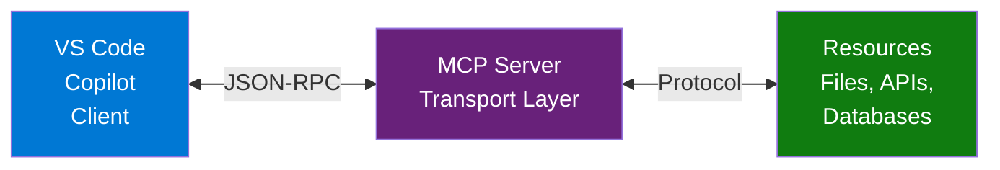
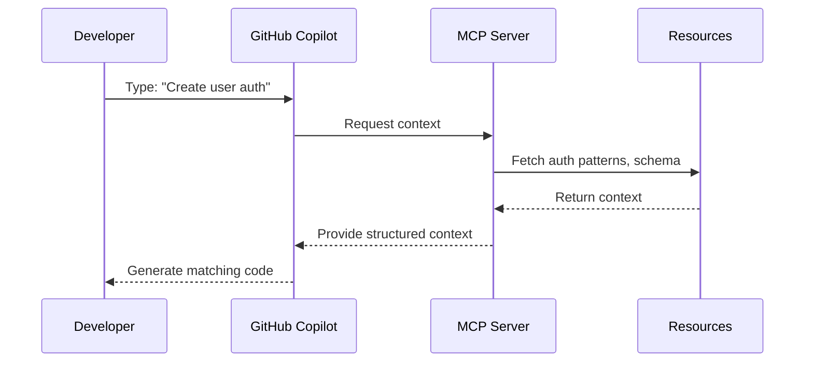
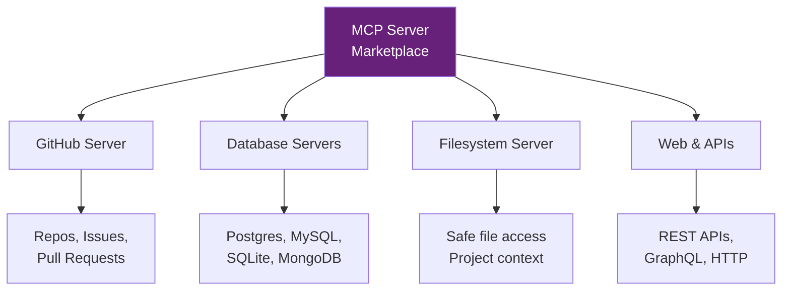

# Using MCP Servers with VS Code & Copilot

Leverage existing MCP servers to supercharge your AI development workflow

::: notes
Duration ~00:01

**Delivery**: Start with enthusiasm - focus on immediate productivity gains by using existing tools.

**Key Points**:

- MCP servers are ready-to-use tools that enhance Copilot
- No need to build from scratch - consume existing servers
- Dozens of community servers available today
- Simple configuration unlocks powerful capabilities

**Transition**: "Let's explore how to use MCP servers to enhance your development workflow"
:::

---

## What is MCP?

**Model Context Protocol (MCP)** is a standardized protocol that:

- Connects Copilot to external data sources via **MCP Servers**
- **Pre-built servers** provide ready-to-use capabilities
- You **configure and consume** servers, not build them
- Community servers available for common tasks

::: notes
Duration ~00:03

**Delivery**: Emphasize "consume not create" - developers use existing servers.

**Key Points**:

- MCP servers are like npm packages - install and use
- Large ecosystem of ready-to-use servers
- Community maintains servers for databases, APIs, file systems, etc.
- Configuration is simple JSON - no coding required

**Examples**:

- GitHub MCP Server: Access repos and issues
- Postgres MCP Server: Query your database
- Filesystem MCP Server: Safe file access for Copilot
- Slack MCP Server: Read channels and messages

**Transition**: "Let's see the architecture from a consumer's perspective"
:::

---

## MCP Architecture Overview



**Key Components**:

- **Client**: VS Code/Copilot (you configure this)
- **Server**: Pre-built tools (you install these)
- **Resources**: Data the server accesses (you configure permissions)

::: notes
Duration ~00:04

**Delivery**: Focus on what the developer controls - configuration, not code.

**Key Points**:

- You don't write server code - you configure existing servers
- Servers are distributed as npm packages, Python packages, or binaries
- Your job: Install server + configure what it can access
- Communication happens automatically once configured

**Examples**:

- Install `@modelcontextprotocol/server-github` via npm
- Configure with your GitHub token
- Copilot can now access your repos for better context

**Consumer Focus**:

- Think "install and configure" not "build and deploy"
- Like using VS Code extensions - install from marketplace

**Transition**: "Let's install your first MCP server"
:::

---

## Installing Your First MCP Server

**Example: GitHub MCP Server**

1. Install the server package:
   ```bash
   npm install -g @modelcontextprotocol/server-github
   ```
2. Configure in VS Code `settings.json`:
   ```json
   {
     "mcp.servers": {
       "github": {
         "command": "mcp-server-github",
         "env": { "GITHUB_TOKEN": "${env:GITHUB_TOKEN}" }
       }
     }
   }
   ```
3. Reload VS Code - MCP server starts automatically

::: notes
Duration ~00:05

**Delivery**: Walk through real example - emphasize it's just package installation.

**Key Points**:

- Install like any npm/pip package
- Configure with credentials and options
- Servers start automatically with VS Code
- Multiple servers can run together

**Available Servers** (mention these):

- `@modelcontextprotocol/server-github` - GitHub integration
- `@modelcontextprotocol/server-postgres` - Database access
- `@modelcontextprotocol/server-filesystem` - Safe file access
- `@modelcontextprotocol/server-sqlite` - SQLite queries

**Common Issues**:

- Missing credentials: Set environment variables
- Package not found: Check npm registry or install from GitHub
- Permission errors: Verify token scopes

**Transition**: "Now let's see Copilot use this context"
:::

---

## Copilot + MCP Integration

**Enhanced Capabilities**:

- **Context-Aware Completions**: Access to project-specific context
- **Tool Use**: Copilot can invoke tools via MCP
- **Custom Instructions**: Per-project guidance
- **Security Boundaries**: Controlled access to resources

**Example Flow**:



::: notes
Duration ~00:05

**Delivery**: Emphasize the "before and after" - how completions improve with MCP context.

**Key Points**:

- Without MCP: Generic completions based on training data
- With MCP: Completions that match YOUR codebase patterns
- Security: MCP enforces what Copilot can access
- Customization: Define project-specific rules and patterns

**Examples**:

- Database connection: MCP provides your connection pattern
- API calls: MCP shares your error handling approach
- Testing: MCP provides your test framework patterns

**Background Context**:

- MCP servers can implement rate limiting
- Audit logs track what context was provided
- Permission model prevents unauthorized access

**Transition**: "Let's look at some practical scenarios"
:::

---

## Popular MCP Servers to Use



**Ready-to-Use Servers**:

- **GitHub**: Access repos, issues, PRs for context
- **Databases**: Query schemas and data safely
- **Filesystem**: Give Copilot controlled file access
- **Web/APIs**: Integrate with REST and GraphQL services

::: notes
Duration ~00:05

**Delivery**: This is a "shopping list" - show what's available to install.

**Key Points**:

- All these servers exist today - just install and configure
- Community actively building more servers
- Official servers maintained by protocol creators
- Third-party servers for specialized needs

**Specific Examples**:

- `@modelcontextprotocol/server-github`: Full GitHub integration
- `@modelcontextprotocol/server-postgres`: Direct database queries
- `@modelcontextprotocol/server-filesystem`: Workspace file access
- `@modelcontextprotocol/server-brave-search`: Web search integration
- `@modelcontextprotocol/server-puppeteer`: Browser automation

**Real Usage**:

- GitHub server: "Show me similar issues" → searches your repos
- DB server: "Generate migration for this schema" → queries current schema
- Filesystem: "Refactor all files using pattern X" → scans project

**Where to Find**:

- Official: https://github.com/modelcontextprotocol/servers
- Community: npm/pip with "mcp-server" tag

**Transition**: "Let's talk about configuring these safely"
:::

---

## Configuring Servers Securely

**Security When Consuming Servers**:

- ✅ Use environment variables for credentials
- ✅ Grant minimum necessary permissions
- ✅ Review server source code before installing
- ✅ Configure allowed paths/resources explicitly
- ❌ Never hardcode tokens in settings

**Configuration Best Practices**:

- Start with read-only servers
- Use scoped tokens (not full access)
- Enable only needed capabilities
- Test in non-production first
- Keep servers updated

::: notes
Duration ~00:04

**Delivery**: Security from consumer perspective - what you control in config.

**Key Points**:

- You control what each server can access via configuration
- Servers can't bypass permissions you set
- Credentials stay in environment variables, never in code
- Official servers are audited and maintained

**Configuration Examples**:

```json
// Good: Scoped GitHub token
"env": { "GITHUB_TOKEN": "${env:GH_READ_TOKEN}" }

// Good: Limited database access
"env": { "DATABASE_URL": "readonly-connection-string" }

// Bad: Full access token
"env": { "TOKEN": "full-admin-token-hardcoded" }
```

**Best Practices**:

- GitHub: Use personal access token with repo:read only
- Database: Create read-only database user
- Filesystem: Specify exact directories in config
- Review: Check server code on GitHub before installing

**Common Mistakes**:

- Using admin credentials when reader role sufficient
- Granting access to entire filesystem
- Not reviewing what data server sends to AI

**Transition**: "Let's get you started with your first server"
:::

---

## Getting Started: Your First Hour

**Quick Start (30 minutes)**:

1. Install MCP extension for VS Code
2. Pick one server: GitHub OR Filesystem
3. Configure credentials in environment
4. Add server config to `settings.json`
5. Reload VS Code and test with Copilot

**Resources**:

- Server Directory: https://github.com/modelcontextprotocol/servers
- Official Servers: npm `@modelcontextprotocol/server-*`
- VS Code Extension: Search "MCP" in marketplace
- Community: Discord, GitHub Discussions

::: notes
Duration ~00:03

**Delivery**: Make it feel achievable - "you can do this today."

**Key Points**:

- Don't try to install all servers at once
- Pick ONE that solves a pain point
- Test thoroughly before adding more
- Active community helps with issues

**Recommended First Server**:

- **Filesystem** if you want Copilot to understand your project structure
- **GitHub** if you want context from issues and PRs
- **Postgres** if you want schema-aware SQL generation

**Step-by-Step**:

```bash
# 1. Install server
npm install -g @modelcontextprotocol/server-filesystem

# 2. Configure VS Code settings.json
{
"mcp.servers": {
"filesystem": {
"command": "mcp-server-filesystem",
"args": ["${workspaceFolder}"]
}
}
}

# 3. Reload VS Code
# 4. Ask Copilot: "What files are in this project?"
```

**Transition**: "Questions about getting started?"
:::

---

## Summary & Key Takeaways

**Using MCP Servers**:

- Install and configure ready-to-use servers
- No need to build - consume existing community servers
- Simple JSON configuration unlocks powerful features
- Enhanced Copilot with project-specific context

**Remember**:

- Start with one server (Filesystem or GitHub)
- Use environment variables for credentials
- Official servers at github.com/modelcontextprotocol/servers
- Active community for support

**Questions?**

::: notes
Duration ~00:10

**Delivery**: Pause for questions. Emphasize the "install and configure" message.

**Key Points to Reinforce**:

- MCP servers = ready-to-use packages
- Consumer mindset: install, configure, use
- No coding required - just configuration
- Practical benefits today, not future promises

**Common Questions to Expect**:

- "Do I need to write code?" (No, just configure existing servers)
- "What about performance?" (Minimal overhead, servers run locally)
- "Can I use multiple servers?" (Yes, configure as many as needed)
- "Is this free?" (Yes, open source protocol and servers)
- "Can we use this with internal models?" (Yes, any LLM that supports tools)
- "What's the learning curve?" (Start with samples, ramp up gradually)

**Follow-Up Actions**:

- Share links to resources in chat
- Offer to help with setup in office hours
- Schedule follow-up for advanced topics
- Collect feedback for next session

**Closing**: "Thank you! Feel free to reach out with questions as you implement MCP in your workflows."
:::
