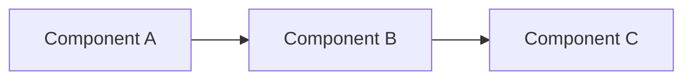

# AI Instructions: Create Marp Slides

Generate Marp slides in `slides/marp/` with required AI provenance metadata.

## File Location & Naming

- Path: `slides/marp/`
- Filename: lowercase kebab-case (e.g., `intro-to-aiasd.md`)

## Required YAML Front Matter

```yaml
---
ai_generated: true
model: "<provider>/<model-name>@<version>" # The model that created the slides
operator: "<github-username>"
chat_id: "<chat-id>"
prompt: |
  <exact prompt text>
started: "<ISO8601-timestamp>"
ended: "<ISO8601-timestamp>"
task_durations:
  - task: "draft"
    duration: "<hh:mm:ss>"
total_duration: "<hh:mm:ss>"
ai_log: "ai-logs/<yyyy>/<mm>/<dd>/<chat-id>/conversation.md"
source: "<source-identifier>"
---
```

## Marp Slide Template

```markdown
---
ai_generated: true
model: "model-provider/model-name@version" # The model that created the slides
operator: "username"
chat_id: "unique-id"
prompt: |
  Create 5-slide intro to topic
started: "2025-10-23T14:30:00Z"
ended: "2025-10-23T14:35:00Z"
task_durations:
  - task: "draft"
    duration: "00:05:00"
total_duration: "00:05:00"
ai_log: "ai-logs/2025/10/23/unique-id/conversation.md"
source: "username"
---

# Slide Title

Content here

::: notes
Speaker notes for this slide explaining key talking points, context, and delivery guidance. Include timing, emphasis, and audience interaction cues.
:::

---

## Slide 2

- Bullet points
- More content

::: notes
Detailed speaker notes for slide 2. Explain each bullet point, provide examples, and note any transitions to the next slide.
:::

---
```

## Speaker Notes Requirements

**MANDATORY**: Every slide MUST include comprehensive speaker notes using pandoc syntax.

**REQUIRED SYNTAX** (exact format):

```markdown
::: notes
Speaker notes content here
:::
```

**PROHIBITED FORMATS** (these will FAIL CI validation):

```markdown
❌ WRONG: Note:
❌ WRONG: Speaker notes:
❌ WRONG: <!-- Speaker: ... -->
❌ WRONG: Notes: ...
❌ WRONG: Any format other than ::: notes
```

**CORRECT vs INCORRECT Examples**:

```markdown
# Slide Title

Content here

❌ WRONG:
Note:
Speaker: Explain this concept

✅ CORRECT:
::: notes
Speaker: Explain this concept with timing and context
:::
```

**Speaker Notes Content Guidelines**:

- **Delivery Instructions**: How to present the content effectively
- **Timing Guidance**: Suggested time allocation for each slide
- **Key Points**: Essential messages to emphasize
- **Examples**: Real-world illustrations or case studies
- **Transitions**: How to connect to the next slide
- **Audience Interaction**: Questions, polls, or discussion points
- **Background Context**: Additional details not shown on slide

**Placement**: Speaker notes MUST be placed immediately after each slide's content, before the next slide separator (`---`).

## Diagram Requirements

**REQUIRED**: Use Mermaid for all diagrams and visualizations.

**Supported Mermaid Diagram Types**:

- `flowchart` / `graph` - Flow diagrams and architecture
- `sequenceDiagram` - Interaction flows
- `classDiagram` - Class structures
- `stateDiagram` - State machines
- `erDiagram` - Entity relationships
- `journey` - User journeys
- `gantt` - Project timelines

**Syntax**:

````markdown

````

````

**PROHIBITED**:
- ❌ ASCII art diagrams
- ❌ Embedded images without source
- ❌ Hand-drawn text diagrams

**Example**:
```markdown
## System Architecture

```mermaid
graph TB
    Client[Client Application]
    Server[API Server]
    DB[(Database)]

    Client --> Server
    Server --> DB
````

::: notes
Architecture explanation...
:::

````

## Exercise Slides

**REQUIRED**: All exercise slides MUST use the `Two Content` PowerPoint layout.

An exercise slide has a **left column** (setup/objectives) and a **right column** (activities and success criteria), separated by a `::: column` divider.

### Body Structure

```markdown
## Exercise: <Title>

**Setup and Objectives**

Prerequisites

- <prerequisite 1>
- <prerequisite 2>

Objectives

- <objective 1>
- <objective 2>

::: column

**Activities and Success Criteria**

Activities

1. <step 1>
2. <step 2>

```bash
# Example command
<command>
```

Success Criteria

- <criterion 1>
- <criterion 2>

::: notes
Duration ~00:XX

<Speaker delivery notes: context, timing, facilitation tips, transitions>
:::
```

### Rules

- Exercise slides do not need an explicit `<!-- layout: Two Content -->` directive when they use `::: column`; the slide pipeline infers the `Two Content` layout automatically.
- If you include `<!-- layout: Two Content -->`, the layout name is resolved against the PowerPoint template and must match the template layout name exactly.
- The `::: column` divider marks the boundary between left and right columns — everything **before** it is the left column, everything **after** (until `::: notes` or `---`) is the right column.
- Do NOT close the column block with `:::` — the `::: notes` block or the next slide separator (`---`) closes it implicitly.
- **Left column** content: heading, prerequisites, objectives.
- **Right column** content: activities (numbered steps, code blocks) and success criteria.
- Exercise slide filenames MUST follow the pattern `exercise-<kebab-case-description>.deck.md`.

### Checklist (Exercise Slides)

- [ ] Filename starts with `exercise-`
- [ ] Body uses `::: column` to split left/right columns
- [ ] Left column: prerequisites and objectives
- [ ] Right column: numbered activities, code blocks, and success criteria
- [ ] `::: notes` block present with duration and facilitation guidance

---

## Generation Rules

**Required**:

- Embed YAML front matter (no sidecar `.meta.md`)
- Use actual model name in format `provider/model@version`
- Create `ai-logs/<yyyy>/<mm>/<dd>/<chat-id>/conversation.md`
- Capture exact prompt verbatim
- Use ISO8601 timestamps
- **CRITICAL: Include comprehensive speaker notes for EVERY slide (no exceptions)**
- **CRITICAL: Use ONLY pandoc `:::notes` syntax for speaker notes**
- **CRITICAL: Speaker notes MUST provide delivery guidance, timing, key points, examples, and transitions**
- **CRITICAL: Speaker notes MUST be comprehensive (minimum 3-4 sentences per slide)**

**Prohibited**:

- Generic model names like "github/copilot"
- Creating slides without active chat context
- Omitting any required metadata fields
- **Creating ANY slide without comprehensive speaker notes**
- **Using ANY speaker note syntax other than pandoc `::: notes` blocks**
- Using "Note:", "Speaker:", "Notes:", or plain paragraph speaker notes
- HTML comments for speaker notes
- Any custom or non-standard note format
- **Minimal or placeholder speaker notes (e.g., "Speaker notes here")**

## Validation

**Automated CI Check**: Files will be validated for:

- Presence of `::: notes` blocks (at least one per file)
- Required YAML front matter fields
- No usage of prohibited note formats ("Note:", "Speaker:", etc.)

**Manual Validation Script**:

```bash
# Quick check before commit
grep -L '::: notes' slides/marp/*.deck.md && echo "ERROR: Missing pandoc notes" || echo "OK"
````

## Checklist

- [ ] File in `slides/marp/`
- [ ] All YAML fields present
- [ ] `ai_log` path exists with conversation.md
- [ ] `operator` is GitHub username
- [ ] Timestamps in ISO8601 format
- [ ] **Every slide has `::: notes` block (search file for "::: notes" to verify)**
- [ ] **NO plain "Note:" paragraphs used**
- [ ] **NO HTML comments used for speaker notes**
- [ ] **Speaker notes include delivery guidance, timing, and context**
- [ ] **Diagrams use Mermaid syntax (no ASCII art)**
- [ ] Run validation: `grep '::: notes' <filename>` returns matches
- [ ] Complete [Post-Creation Requirements (CANONICAL)](ai-assisted-output.instructions.md#post-creation-requirements-canonical)

## README Entry Template

```markdown
- **[Title]** (`slides/marp/[filename].deck.md`) — [Description]. Provenance: `ai-logs/[yyyy]/[mm]/[dd]/[chat-id]/`
```

## Common Mistakes to Avoid

### Mistake 1: Using Plain "Note:" Paragraphs

❌ **WRONG**:

```markdown
# My Slide

Content

Note:
Speaker: Explain this
```

✅ **CORRECT**:

```markdown
# My Slide

Content

::: notes
Speaker: Explain this with detailed delivery guidance
:::
```

### Mistake 2: Wrong Syntax Variations

❌ **WRONG**: `:::notes` (no space)
❌ **WRONG**: `:: notes` (only two colons)
❌ **WRONG**: `::: Notes` (capitalized)
✅ **CORRECT**: `::: notes` (three colons, space, lowercase)

### Mistake 3: Exercise Slide Without Column Split

❌ **WRONG** (exercise slide missing the required `::: column` divider):

```markdown
## Exercise: Setup GitHub Copilot

**Setup and Objectives**

Prerequisites

- GitHub account

Objectives

- Configure Copilot in VS Code

::: column

**Activities and Success Criteria**

Activities

1. Install the Copilot extension
2. Sign in with GitHub credentials

::: notes
...
:::
```

✅ **CORRECT** (exercise slide with inferred `Two Content` layout via column divider):

```markdown
## Exercise: Setup GitHub Copilot

**Setup and Objectives**

Prerequisites

- GitHub account

Objectives

- Configure Copilot in VS Code

::: column

**Activities and Success Criteria**

Activities

1. Install the Copilot extension
2. Sign in with GitHub credentials

Success Criteria

- Copilot suggestions appear in VS Code

::: notes
Duration ~00:10

...
:::
```

### Mistake 4: Placing Notes After Slide Separator

❌ **WRONG**:

```markdown
# Slide 1

Content

---

::: notes
Notes for slide 1
:::
```

✅ **CORRECT**:

```markdown
# Slide 1

Content

::: notes
Notes for slide 1
:::

---
```

## Reference

See `.github/instructions/ai-assisted-output.instructions.md` for complete provenance requirements.
