## Welcome Back to AI-Assisted Software Development

- Ready to continue where we left off
- Today's session builds on what we've covered
- We're all in this together — participation welcome
- **Questions are always welcome — ask anytime!**

::: notes
Welcome everyone back to the session. Take a moment to let people settle in before diving into content. Acknowledge that it's great to see everyone back and express enthusiasm for the session ahead.

Key talking points:

- Remind attendees of the previous session's topics briefly
- Emphasize that questions are encouraged at any point — not just at the end
- Set a positive, inclusive tone for the session
- If this is after a break, give people 30 seconds to get re-focused

Timing: Spend about 1-2 minutes on this slide before moving on.
Transition: "Let's pick up right where we left off..."
:::

---

<!-- _class: lead -->

## Course Modules

- Intro
- **▶ AI-First Development Methodology**
- Specification Driven Software Development
- Architecture Specification
- Technology Specification
- Implementation Specification
- Implementation Planning
- Implementation Prompts
- Vertical Slice Implementation
- Code Review with GitHub Copilot

---

<!-- _class: lead -->

# AI-First Development Methodology

---

## AI-First Development Methodology

- AI-First vs. Prompt-First Development

---

AI-First vs. Prompt-First Development

---

## AI-First vs. Prompt-First Development

::: notes
This deck introduces the distinction between AI-First and Prompt-First development. The goal is to clarify strategy vs. interface, and show how both fit into modern AI-assisted engineering.
:::

---

## Definitions

AI-First Development
A software engineering philosophy where AI is embedded across the entire SDLC—requirements, design, implementation, testing, documentation, compliance, and maintenance.
Prompt-First Development
A workflow pattern where prompts, instruction files, and chat modes are treated as first-class, version-controlled artifacts.

::: notes
AI-First is the broad philosophy. Prompt-First is the tactical layer that enables predictable AI behavior. You can do Prompt-First without being AI-First, but not the reverse.
:::

---

## What Each Optimizes For

Focus Area | AI-First | Prompt-First
--- | --- | ---
Scope | Entire SDLC | Interaction layer
Goal | Lifecycle integration | Deterministic AI behavior
Optimization | Velocity, governance | Prompt quality, reproducibility
Risk Controls | Human-in-loop, provenance | Versioned prompts, context control

::: notes
This table is the heart of the comparison. AI-First is about organizational and architectural change. Prompt-First is about artifact discipline and predictable outputs.
:::

---

## How They Treat Artifacts

AI-First
Requirements written with AI collaboration in mind
AI-generated scaffolds, tests, docs
Provenance enforced across all AI outputs
Architecture assumes AI participation
Prompt-First
Prompts and instruction files are version-controlled
Prompts define behavioral contracts
Reusable prompt modules
Chat modes define safe, predictable interactions

::: notes
AI-First changes what you build and how you build it. Prompt-First changes how you communicate intent to the AI.
:::

---

## Relationship Between the Two

Prompt-First is a subset of AI-First.
Prompt-First = mechanics
AI-First = philosophy + architecture + lifecycle integration

::: notes
This is the conceptual hierarchy. Prompt-First is necessary but not sufficient for AI-First maturity.
:::

---

## Concrete Examples

Prompt-First Example
Promptfile for generating unit tests
Instruction file for documentation
Chat mode for brownfield developers
AI-First Example
Requirements → AI-generated scaffolds
Code changes → AI-assisted reviews
Docs → continuously AI-generated
Modernization → AI-guided refactoring plans
Provenance → enforced everywhere

::: notes
Use these examples to help teams visualize the difference. Prompt-First is about interfaces; AI-First is about the entire workflow.
:::

---

## Shortest Summary

AI-First = philosophy + architecture + lifecycle integration
Prompt-First = structured, version-controlled interfaces for interacting with AI

::: notes
End with this summary to reinforce the distinction. It's the cleanest way to remember the relationship.
:::

---

<!-- _class: lead -->

## Course Modules

- Intro
- AI-First Development Methodology
- **▶ Specification Driven Software Development**
- Architecture Specification
- Technology Specification
- Implementation Specification
- Implementation Planning
- Implementation Prompts
- Vertical Slice Implementation
- Code Review with GitHub Copilot

---

<!-- _class: lead -->

# Specification Driven Software Development

---

## Specification Driven Software Development

- Starting with Project Requirements

---

## Starting with Project Requirements

::: notes
Shift to greenfield best practices: requirements, prompts, and verification workflows.
:::

---

## Business Rules as Requirements


---

## Conceptual Models

Technology Agnostic
  - Transformable into Logical Models
Clarity
Expressive
Formal
Conceptual Models are not a requirement

---

## Object Role Models

A type of conceptual model
Supported by a Visual Studio Extension (NORMA)
Object Role Models are textual and visual
  - Text can be visualized
  - Diagrams can be verbalized
Textual representation is in a formal natural language that can be validated by subject matter experts

---

## Zeus.Academia.3b

Based on a publicly available model of a commonly understood domain
  - https://orm.net/pdf/ORMwhitePaper.pdf
Allows us to quickly move from requirements to implementation
  - https://github.com/johnmillerATcodemag-com/zeus.academia.3b
Why 3b?
  - Third Iteration in progress
  - If something is hard, do it often

---

## Use Cases

Use cases are specific scenarios that guide data capture and processing in the application
  - Promote a Lecturer to Senior Lecturer
  - Promote a Senior Lecturer to Associate Professor
  - Promote an Associate Professor to Professor
  - Assign a Class to an Academic
  - Add a new Academic to the faculty capturing all required information and allowing the capture of optional information

---

## Exercise: Generate Business Requirements

Duration: 20 minutes
Objectives:
Use the Product Manager chat mode to create a requirements document for a calculator
Activities:
Activate the Product Manager chat mode
Prompt the AI to create a requirements document
Review the requirements
Add an implementation plan using vertical slices
Review the changes
Add a diagram showing the relationship between Phases, Slices, and User Stories
Success Criteria
The requirements document exists and passes review

::: notes
Author requirement docs, then use Copilot to generate scaffolding and validate alignment.

Prompt: create a requirements document for a simple calculator application
:::

---

## Exercise: Create Project Requirement

Objective: Create project requirement instructions, some project-specific, some generic, using both manual and Copilot-assisted methods.
Manually create a business requirements.md file and add:
  - Business rules
  - Workflows
  - Purpose
  - Tech stack
  - Architecture
Use Copilot to generate instruction files using the copilot-instructions.md and the codebase for context.
Bonus:
Review instruction files for errors and omissions.
Ask Copilot to suggest changes based on evolving tech and practices.

::: notes
Author requirement docs, then use Copilot to generate scaffolding and validate alignment.
:::

---

## Exercise: Generate Business Requirements

Duration: 20 minutes
Objectives:
Use the Product Manager chat mode to update the requirements document to implement using vertical slices
Activities:
Activate the Product Manager chat mode
Prompt the AI to add a vertical slices implementation plan
Review the changes
Add a diagram showing the relationship between Phases, Slices, and User Stories
Success Criteria
The implementation plan passes review

::: notes
Prompts:

using #file:business-rules-to-slices.instructions.md update the #file:calculator-app-requirements.md implementation plan to implement using vertical slices

what is the difference between the phases and vertical slices?

update the plan to make this distinction clear

add a diagram that shows the phases -> slices -> use cases

which of the slices can be implemented in parallel and which have a dependancy on another slice
:::

---

## Exercise: Business Requirements Generation

Duration: 17 minutes

Objectives

- Create a business requirements document for the calculator project
- Use the Product Manager agent with existing instruction files
- Apply the expected branch and repository workflow for Greenfield work
- Validate the requirements draft through review, clarification, and independent iteration

Activities

1. Create a personal branch from the Greenfield branch in the class repository.
2. Use the Product Manager agent to generate a calculator requirements document.
3. Apply the existing instruction files to improve scope, structure, and consistency.
4. Confirm repository choice, branching strategy, and how to handle any existing PRD content before continuing.
5. Work independently on the requirements document while the instructor provides check-ins and support.

Success Criteria

- A calculator business requirements document exists on the correct personal branch
- The Product Manager agent and instruction files are both used effectively
- Repository and branching decisions are applied correctly and consistently
- Participants can explain what changed after clarifications and independent refinement

::: notes

## Business Requirements Generation Exercise Instructions

**Duration:** 17 minutes
**Prerequisites:** Access to the Greenfield branch, ability to create a personal branch, and access to the Product Manager agent plus the repository instruction files

Use this exercise to establish the Greenfield workflow discipline early. Start by making participants branch from Greenfield before they do any prompting so the requirements artifact has a clean ownership path and can be reviewed independently later. In the first few minutes, emphasize that the goal is not to produce a perfect PRD in one pass, but to create a usable calculator requirements document using the Product Manager agent together with repository guidance. During the clarification window, call out the common confusion points explicitly: correct repository, personal branch strategy, what to do with any existing PRD material, and that tooling differences between Visual Studio and VS Code are secondary to getting the requirements quality right. For the working block, let students operate independently, but use periodic check-ins to see whether instruction files improved the output and whether anyone is stuck on scope, branching, or prompt quality. Transition from this exercise by connecting the completed requirements document to the next Greenfield planning steps, especially technology instructions, slice planning, and implementation prompts.
:::

---

<!-- _class: lead -->

## Course Modules

- Intro
- AI-First Development Methodology
- Specification Driven Software Development
- **▶ Architecture Specification**
- Technology Specification
- Implementation Specification
- Implementation Planning
- Implementation Prompts
- Vertical Slice Implementation
- Code Review with GitHub Copilot

---

<!-- _class: lead -->

# Architecture Specification

---

## Architecture Specification

- Command Query Responsibility Segregation

---

## Command Query Responsibility Segregation

*AI-Assisted Software Development*

::: notes
Welcome to the CQRS Architecture module. This session covers Command Query Responsibility Segregation — a pattern that separates read and write operations into distinct models to improve scalability and maintainability.

**Timing**: 1 minute for title slide

**Key Points**:
- CQRS separates write (command) operations from read (query) operations
- Enables independent scaling and optimization of each model
- Useful when read and write workloads have very different characteristics

**Delivery**: Begin by asking the audience about pain points with traditional CRUD APIs — high query complexity, slow writes due to query-optimized schemas, or contention between reads and writes.

**Transition**: "Let's start with when CQRS makes sense — and when it doesn't."
:::

---

## When to Use CQRS

**✅ Use CQRS when:**
- Read and write workloads scale differently
- Read models need denormalization, caching, or projections
- Write model needs strong invariants and task-focused workflows
- Auditing or event sourcing is required
- Query complexity slows transactional throughput

**❌ Avoid CQRS when:**
- Domain is small and reads/writes are balanced
- No clear boundary between commands and queries
- Operational overhead is not justified

::: notes
CQRS is a powerful pattern but it adds operational complexity. Use it only when the benefits outweigh the costs.

**Timing**: 3 minutes

**Key Points**:
- The classic CRUD pattern couples reads and writes to the same model — fine for simple domains
- CQRS shines when the query model needs to be radically different from the write model
- Event sourcing almost always pairs with CQRS
- Small teams or simple domains should avoid CQRS due to added complexity

**Real-World Example**: An e-commerce order system where writes go through strict business validation but reads need highly denormalized views for catalog search, order history dashboards, and analytics.

**Audience Question**: "Has anyone implemented something like CQRS without knowing it had a name?"

**Transition**: "Let's look at the core principles that underpin CQRS."
:::

---

## Core Principles

| Principle | Detail |
|-----------|--------|
| **Separation** | Commands change state; queries never change state |
| **Invariants** | Write model enforces all business rules |
| **Optimization** | Read model is shaped for query use cases |
| **Independence** | Models can evolve separately |
| **Consistency** | Eventual consistency between write and read |

> Commands can fail. Queries should not.

::: notes
These five principles guide every CQRS implementation decision.

**Timing**: 2 minutes

**Key Points**:
- The read/write separation is absolute — queries must be side-effect free
- Write model is where business logic lives — all invariants enforced here
- Read models are projections built from the write model's events
- Independence is key — you can evolve the read schema without touching write logic
- Eventual consistency is usually acceptable; design for it intentionally

**Common Misconception**: CQRS does not require separate databases. You can start with a single database and separate logical models before introducing physical separation.

**Transition**: "What are the actual architectural components we need to build?"
:::

---

## Architecture Components

```
┌─────────────┐    ┌──────────────────┐    ┌────────────┐
│  Command    │───▶│  Command Handler  │───▶│ Write Store│
│    API      │    │  (Domain Logic)   │    │  (OLTP)    │
└─────────────┘    └──────────────────┘    └─────┬──────┘
                                                 │ Events
                   ┌──────────────────┐          ▼
┌─────────────┐    │    Projection    │    ┌────────────┐
│  Query API  │◀───│    Updater       │◀───│  Publisher │
└─────────────┘    └──────────────────┘    └────────────┘
        │                                  ┌────────────┐
        └─────────────────────────────────▶│ Read Store │
                                           │  (OLAP)    │
                                           └────────────┘
```

::: notes
This diagram shows the minimum components for a CQRS implementation.

**Timing**: 3 minutes

**Walk Through the Diagram**:
1. Command API receives write requests and routes to handlers
2. Command Handler orchestrates domain logic and writes to the Write Store
3. Events are published after successful writes
4. Projection Updater subscribes to events and updates the Read Store
5. Query API serves the Read Store with fast, optimized queries

**Key Components**:
- **Command API**: Validates input, routes to appropriate handler
- **Command Handler**: Enforces invariants, orchestrates domain operations
- **Write Store**: OLTP database for aggregates and consistency
- **Event Publisher**: Reliable event emission (use outbox pattern)
- **Projection Updater**: Maintains read models from events
- **Query API**: Serves denormalized, query-optimized data
- **Read Store**: OLAP or document store optimized for reads

**Transition**: "Let's look at command model design in more detail."
:::

---

## Command Model Design

**Commands** — task-based, intention-revealing names:
- `CreateOrder` / `ApproveOrder` / `CancelOrder`
- `RegisterUser` / `UpdateShippingAddress`

**Rules**:
1. Validate at the command boundary — reject early
2. Use aggregates to enforce invariants and consistency
3. Keep handlers deterministic and side-effect controlled
4. Write to a single source of truth
5. One command targets one aggregate root

::: notes
Good command design is the foundation of a maintainable CQRS system.

**Timing**: 3 minutes

**Key Points**:
- Task-based command names reveal business intent — much better than `UpdateOrder`
- Aggregates are the consistency boundary — they decide if a command is valid
- Early validation prevents unnecessary database round-trips
- A single aggregate per command keeps transactions simple
- Side effects (email, events) should happen after the transaction commits

**Code Example**:
```csharp
public record ApproveOrderCommand(Guid OrderId, string ApprovedBy);

public class ApproveOrderHandler : ICommandHandler<ApproveOrderCommand>
{
    public async Task Handle(ApproveOrderCommand cmd)
    {
        var order = await _repo.GetAsync(cmd.OrderId);
        order.Approve(cmd.ApprovedBy);  // Aggregate enforces rules
        await _repo.SaveAsync(order);
        await _publisher.PublishAsync(new OrderApprovedEvent(order.Id));
    }
}
```

**Transition**: "Now for query model design."
:::

---

## Query Model Design

**Queries** — shaped for the consumer use case:
- Avoid joins and complex calculations at query time
- Use projections updated from events or change feeds
- Keep models versioned and rebuildable
- Optimize for latency and throughput

**Types**:
| Query Type | Example | Store |
|-----------|---------|-------|
| List/Search | Product catalog | Elasticsearch |
| Detail | Order details | Relational DB |
| Analytics | Revenue dashboards | OLAP / Data Warehouse |

::: notes
The query model is designed entirely around how data will be consumed.

**Timing**: 2 minutes

**Key Points**:
- Query models are "read-only databases" shaped for specific views
- Different query types may use different storage technologies
- Projections are pre-computed at write time, not at query time
- Rebuilding a projection means replaying events through the updater

**Design Tip**: Start by designing the query response first, then work backward to what the projection needs to store.

**Practical Consideration**: Version your projections. When you change a query model, you'll need to rebuild it from the event history.

**Transition**: "Let's talk about consistency — one of the most challenging aspects of CQRS."
:::

---

## Consistency Strategy

**Strong Consistency** — needed for:
- Payments and financial transactions
- Inventory management
- Security and access control

**Eventual Consistency** — acceptable for:
- Activity feeds and notifications
- Analytics dashboards
- Search indexes and recommendations

**Reliable Event Publication** — use the Outbox Pattern:
> Write event to database table atomically with domain change → background process publishes → idempotent consumers

::: notes
Consistency is often the most debated aspect of CQRS implementations.

**Timing**: 3 minutes

**Key Points**:
- Not all data requires strong consistency — choosing the right model reduces complexity
- The Outbox Pattern is the industry standard for reliable event publishing
- "Dual writes" (write to DB and publish in the same transaction) are dangerous — use the outbox
- Idempotent consumers handle duplicate event delivery gracefully

**The Outbox Pattern**:
1. Within the same database transaction: write the domain change AND an outbox event record
2. A background process reads unprocessed outbox events and publishes them to the message broker
3. Mark events as processed after successful publication
4. Consumers handle duplicates idempotently

**Transition**: "What common mistakes should we avoid?"
:::

---

## Anti-Patterns to Avoid

| Anti-Pattern | Problem | Solution |
|-------------|---------|----------|
| Mixed query in command handler | Breaks separation of concerns | Query read model separately |
| Shared ORM model for reads/writes | Couples both models | Use separate query DTOs |
| CQRS on simple CRUD | Unnecessary complexity | Use simple repository pattern |
| Dual writes without outbox | Risk of lost events | Implement outbox pattern |

::: notes
These anti-patterns are the most common mistakes in CQRS implementations.

**Timing**: 2 minutes

**Key Points**:
- The most common mistake is reading from the write store in a query context
- Sharing a single ORM model defeats the purpose of model separation
- Over-engineering is real — CQRS adds complexity that's only worth it in the right domains
- Dual writes (write to database AND directly to message broker) will eventually lose events

**Red Flag**: If your CQRS system has more infrastructure than business logic, you've likely over-applied the pattern.

**Transition**: "Let's look at how to migrate an existing system to CQRS incrementally."
:::

---

## Migration Strategy

**Start small, migrate incrementally:**

1. **Identify** one bounded context or high-value feature
2. **Split read model** first — keep write model intact
3. **Add projections** and read store incrementally  
4. **Introduce event publishing** after stable write flow
5. **Expand** to additional contexts over time

**Quality Checklist:**
- [ ] Command and query models are clearly separated
- [ ] Write model enforces all invariants
- [ ] Event publication is reliable (outbox or equivalent)
- [ ] Projection updates are idempotent and monitored

::: notes
Incremental migration reduces risk and allows the team to learn the pattern gradually.

**Timing**: 2 minutes

**Key Points**:
- Big-bang migrations almost always fail — start with one context
- Splitting the read model first gives immediate query performance wins without disrupting writes
- Monitoring projection lag is essential once you go to production
- The checklist should be part of every CQRS code review

**Success Story Pattern**: Start with the reporting/analytics use case — these almost always benefit from a separate read model and the risk is lower than transactional paths.

**Transition**: "Let's look at a concrete flow example to tie it all together."
:::

---

## Example: Order Approval Flow

**Command flow (write)**:
1. API receives `ApproveOrder` command
2. Command handler loads `Order` aggregate
3. Aggregate validates approval rules
4. Transaction commits to write store
5. `OrderApproved` event published via outbox

**Query flow (read)**:
1. UI requests order summary dashboard
2. Query API reads `OrderSummary` projection
3. Read store returns denormalized view
4. Response includes `lastUpdatedUtc` for freshness indicator

::: notes
Tying the concepts together with a concrete example makes the pattern tangible.

**Timing**: 2 minutes

**Key Points**:
- The command and query flows are completely independent paths
- The event bridges the write and read sides asynchronously
- `lastUpdatedUtc` in the query response lets the UI show freshness information
- The UI can display a "processing" indicator while the projection catches up after a command

**Discussion Question**: "What are the tradeoffs of showing the read model data vs. the command result directly after an approval?"

**Key Takeaway**: CQRS is not magic — it's a deliberate architectural choice that pays off when reads and writes truly have different requirements.
:::

---

## Key Takeaways

- **Separate** commands (writes) from queries (reads) at the architectural level
- **Use CQRS** when read/write workloads differ significantly
- **Outbox pattern** ensures reliable event publication
- **Eventual consistency** is the default — design for it intentionally  
- **Start small** — migrate one context at a time

### Further Reading
- Martin Fowler's CQRS article: `martinfowler.com/bliki/CQRS.html`
- Outbox Pattern: `microservices.io/patterns/data/transactional-outbox.html`
- Greg Young's CQRS Documents

::: notes
Summarize the key points and provide resources for deeper learning.

**Timing**: 2 minutes

**Summary**:
- CQRS separates write models (commands) from read models (queries)
- Use it when the complexity pays off — don't over-apply
- Reliable event publication requires the outbox pattern
- Eventual consistency is the norm — manage client expectations
- Incremental migration is the safe approach

**Call to Action**: Review the `cqrs-architecture.instructions.md` file in the repository for implementation checklists and code examples.

**Q&A**: Open the floor for architecture questions and real-world implementation challenges.
:::

---

<!-- _class: lead -->

## Course Modules

- Intro
- AI-First Development Methodology
- Specification Driven Software Development
- Architecture Specification
- **▶ Technology Specification**
- Implementation Specification
- Implementation Planning
- Implementation Prompts
- Vertical Slice Implementation
- Code Review with GitHub Copilot

---

<!-- _class: lead -->

# Technology Specification

---

## Technology Specification

- Technology Stack Instruction Files

---

<!-- _class: lead -->

## Technology Stack Instruction Files

- Section focus: turning requirements into tech-specific guidance
- Duration target: 17 minutes
- Outcome: show how teams generate, review, and improve instruction files for HTML5, CSS3, and JavaScript work

::: notes
Frame this section as part of the greenfield foundation work rather than a documentation side quest. Explain that instruction files help the AI and the team align on standards before implementation begins, which reduces drift and rework later. Spend about one minute here setting expectations that the flow is generate, review, compare, and refine. Transition by asking what should exist before anyone prompts for technology-specific instructions.
:::

---

## Start with the Requirements

- Review the requirements document before generating any instruction file
- Identify the front-end and implementation technologies explicitly in scope
- Decide whether the stack is HTML5, CSS3, vanilla JavaScript, or a TypeScript variant
- Use the requirements to anchor standards, constraints, accessibility, and security expectations

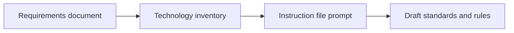

::: notes
Explain that instruction files are most valuable when they reflect the actual technology choices and constraints of the project. If the requirements are vague, the generated guidance will also be vague, so the stack definition has to come first. Spend about two minutes here and emphasize that this step prevents generic output that misses accessibility, security, or performance needs. Transition by showing the simple prompting pattern used to produce the first draft.
:::

---

## Generate the First Draft Quickly

- Use a direct prompt such as: **Create instruction files for the following technologies**
- Name the stack clearly: HTML5, CSS, vanilla JavaScript, or TypeScript
- Ask for guidance on:
  - semantic markup
  - accessibility
  - modern CSS practices
  - security
  - performance
- Treat the first output as a draft, not as final policy

::: notes
Make the point that the initial prompt does not need to be elaborate to be useful. What matters is that it clearly names the technologies and asks for standards that map to real development concerns like semantics, accessibility, and runtime performance. Spend about two minutes here and reinforce that the first draft is a starting point for review, not a blind copy-paste artifact. Transition by moving from prompt generation to what a good instruction file should contain.
:::

---

## What a Strong Instruction File Covers

**HTML5**

- semantic structure
- accessible forms and landmarks

**CSS3**

- maintainable selectors
- layout standards and responsive design

**JavaScript or TypeScript**

- safe DOM interaction
- modularity, validation, and performance guardrails

**Cross-cutting concerns**

- security considerations
- performance expectations
- links to related repository guidance

::: notes
Walk through the content categories rather than reading the bullets verbatim. The core idea is that each technology file should move beyond syntax tips and instead define operational expectations for how code should be written in this repository. Spend about two to three minutes here and note that related documentation references help connect one instruction file to broader standards. Transition by describing how the team reviews the generated file before relying on it.
:::

---

## Review the Generated File Critically

- Check the file structure, scope, and clarity
- Ensure a validation checklist is included
- Confirm the primary audience is **AI assistants** and the secondary audience is **developers**
- Verify security and performance guidance is concrete
- Confirm related documentation references are present and accurate

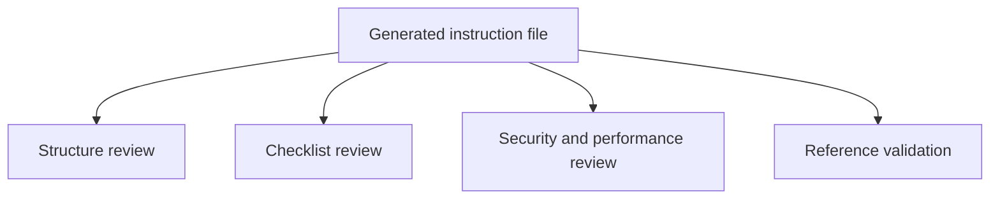

::: notes
Explain that review is what turns an acceptable draft into a dependable working standard. Teams should inspect whether the file is actionable for the AI, readable for humans, and explicit enough to guide consistent output across sessions. Spend about two minutes here and call out validation checklists as especially important because they turn abstract standards into something reviewers can enforce. Transition by introducing the role of multiple models in improving quality.
:::

---

## Use Multiple Models to Improve Quality

- Ask a second model to review the first model's output
- Compare tone, completeness, and specificity
- Pull strengths from more than one model into the final file
- Use differences to reveal gaps, ambiguity, or weak examples

| Model tendency | Practical takeaway |
| --- | --- |
| Claude Sonnet: more comprehensive | Good for broad first drafts |
| GPT-4: more variable | Good candidate for challenge and comparison |

::: notes
Position multi-model review as a quality-control tactic rather than a competition. Different models expose different blind spots, so having one model critique another often surfaces missing examples, incomplete checklists, or weakly stated rules. Spend about two minutes here and point out that the goal is synthesis, not loyalty to one output. Transition by tying this evaluation loop back to the broader foundation phase of a new project.
:::

---

## Why This Matters in the Foundation Phase

1. Establish technology standards early
2. Reduce inconsistency before implementation begins
3. Give AI assistants reusable, repo-specific guidance
4. Create artifacts the team can iterate on and version-control
5. Build a stronger base for later slice planning and implementation prompts

**Bottom line**: better instruction files lead to more reliable implementation output.

::: notes
Close by connecting technology instruction files to the larger greenfield workflow. These files are foundational because they shape the quality of later prompts, implementation plans, and generated code, especially when multiple people and multiple models are involved. Spend about two minutes here and encourage the audience to think of instruction files as living standards that improve over time. End by suggesting that every new stack choice should trigger the question, what instruction file do we need before we start building?
:::

---

<!-- _class: lead -->

## Course Modules

- Intro
- AI-First Development Methodology
- Specification Driven Software Development
- Architecture Specification
- Technology Specification
- **▶ Implementation Specification**
- Implementation Planning
- Implementation Prompts
- Vertical Slice Implementation
- Code Review with GitHub Copilot

---

<!-- _class: lead -->

# Implementation Specification

---

## Implementation Specification

- Organizing software around features instead of layers

---

## Organizing software around features instead of layers

*AI-Assisted Software Development*

::: notes
Welcome to the vertical slicing architecture introduction. This section explains why organizing code by feature can make complex systems easier to understand, extend, and maintain.

Spend about one minute on this slide. Open by asking how many people have had to change a feature by touching controllers, services, repositories, and models in four different folders.

Emphasize that vertical slicing is not just a folder rename. It changes how teams think about boundaries, ownership, and end-to-end feature delivery.

Transition with: "Let's define the pattern first, then compare it to the layered structure most teams already know."
:::

---

## What is a vertical slice?

**A vertical slice organizes code by business feature, not by technical layer.**

- Each feature spans UI, validation, logic, and data access
- Everything needed for the feature lives together
- Slices are self-contained and intentionally independent
- Features avoid direct references to other features
- Changes stay localized, which improves maintainability

> Think in complete user capabilities, not shared technical buckets.

::: notes
This is the core idea for the section, so spend roughly three minutes here. Explain that a slice is a full path through the system for one business capability, such as user registration or order checkout.

Point out that the goal is strong feature boundaries. A developer should be able to open one folder and understand most of what matters for that feature without navigating the whole solution.

Call out the independence rule explicitly: features should not directly reference each other. Shared abstractions can exist, but the feature itself should remain loosely coupled.

Transition with: "That definition becomes clearer when we compare the file structure side by side."
:::

---

## Layered folders vs. feature folders

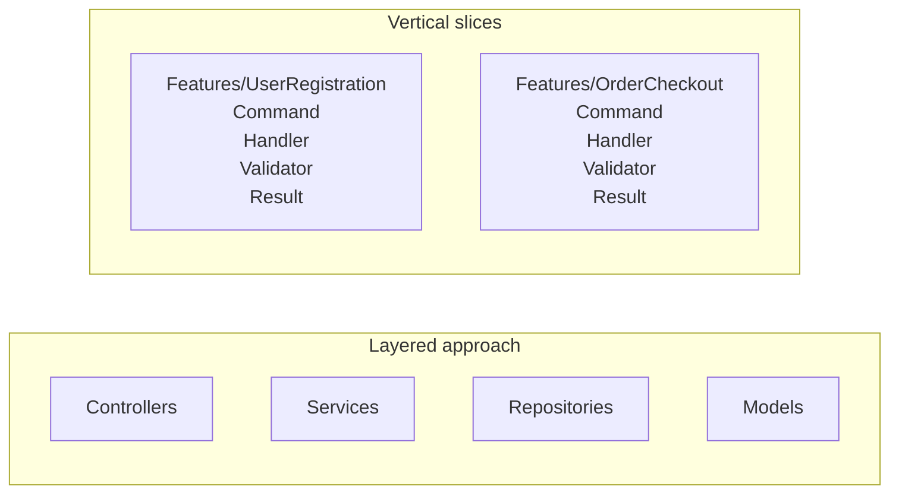

**Layered:** related code is separated by technical type.

**Vertical slices:** all code for a feature is kept in one place.

::: notes
Use about three minutes here and walk the audience through the diagram from left to right. In the layered view, explain that user registration logic is split across multiple folders, which creates navigation overhead and makes changes feel scattered.

Then move to the vertical slice view and show how each feature becomes a mini-application. The `Features/UserRegistration` folder contains the command, handler, validator, and any related response or data access pieces in one place.

This is a good moment to mention that enhancing one feature becomes easier because the impact area is much more visible. The file structure starts reflecting business capabilities instead of technical plumbing.

Transition with: "Once the structure changes, the day-to-day developer experience changes too."
:::

---

## Why developers like this approach

### Developer experience

- Faster feature development
- All related code in one location
- Less folder jumping during implementation
- New features are less likely to disturb existing ones

### Maintainability

- Localized changes
- Clear boundaries reduce accidental bugs
- Refactoring happens inside the feature more often than across the whole app

::: notes
Spend about three minutes here and make it practical. Describe the common experience of implementing a new feature in a layered system, where developers bounce between folders just to follow one request from start to finish.

Contrast that with a vertical slice where the work stays mostly inside one feature folder. That reduces cognitive load and makes it easier for a developer to reason about the full behavior before they edit anything.

For maintainability, stress that the architecture makes the blast radius of a change smaller. When the boundary is clear, debugging and refactoring become safer and faster.

Transition with: "Those same boundaries also help teams collaborate and test more effectively."
:::

---

## Collaboration and testing benefits

### Team collaboration

- Teams can build features in parallel
- Clear boundaries mean fewer merge conflicts
- Ownership and responsibility are easier to assign

### Testing approach

- Test complete features, not isolated layers
- Mock at feature boundaries
- Integration becomes more straightforward
- Independent development is easier with mocked dependencies

::: notes
Use about two to three minutes on this slide. Explain that feature folders create natural seams for parallel work, so two developers can often build different slices without changing the same files.

In testing, highlight that the unit of reasoning becomes the feature, not a service class in isolation. That leads to tests that better reflect user behavior and system outcomes.

You can also mention that mocking is still useful, but it tends to happen at boundaries instead of inside every technical layer. That usually produces simpler tests with clearer intent.

Transition with: "Vertical slices also pair naturally with another pattern many teams use: CQRS."
:::

---

## Why CQRS fits well with vertical slices

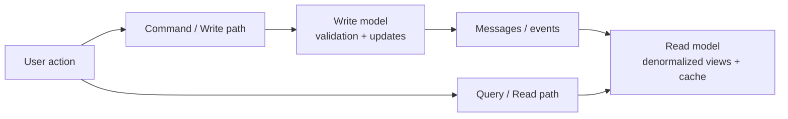

- CQRS separates reads from writes
- Read side can be optimized for display and performance
- Write side can be optimized for business rules and updates
- Messaging keeps the two stacks coordinated
- A feature slice can implement both read and write concerns together

::: notes
Spend about three minutes here and keep CQRS at an introductory level. Explain that Command Query Responsibility Segregation separates the write path from the read path because those two concerns often want different models and optimizations.

On the read side, teams may denormalize data, cache aggressively, or build projections for fast display. On the write side, the focus is enforcing rules, validating intent, and updating authoritative data correctly.

Now connect it back to vertical slices: each feature can own both its command side and its query side. That makes CQRS feel less abstract because the pattern is implemented within a feature boundary rather than as a separate architectural island.

Transition with: "Let's close with the main ideas you want people to remember after this section."
:::

---

## Key takeaways

- Organize by feature when you want stronger business boundaries
- Keep everything needed for a feature in one place
- Prefer independent slices over tightly coupled features
- Use localized changes to improve maintainability
- Consider CQRS when read and write paths have different needs

**Bottom line:** vertical slicing improves focus, flow, and long-term maintainability.

::: notes
Use about one minute to close. Recap that vertical slicing is primarily about improving feature ownership and reducing the cost of change.

Reinforce that the architecture helps both individuals and teams: developers move faster, changes are easier to contain, and the codebase better reflects how the business thinks about work.

If you want an audience prompt, ask which current feature in their codebase would be easiest to convert into a first slice. That question helps bridge the presentation into practical adoption.

End by signaling that the next step is usually implementation guidance, where teams define commands, handlers, validators, and feature-level tests.
:::

---

<!-- _class: lead -->

## Course Modules

- Intro
- AI-First Development Methodology
- Specification Driven Software Development
- Architecture Specification
- Technology Specification
- Implementation Specification
- **▶ Implementation Planning**
- Implementation Prompts
- Vertical Slice Implementation
- Code Review with GitHub Copilot

---

<!-- _class: lead -->

# Implementation Planning

---

## Implementation Planning

- Section 7 overview
- Dependency Analysis and Planning

---

## Section 7 overview

- 16-minute teaching segment
- Focus: how to plan before implementation
- Goal: turn requirements into executable slices

::: notes
Open by framing this section as the bridge between architecture guidance and actual delivery planning.

Explain that vertical slices are not just a coding pattern; they are also a planning tool. The point of the section is to help the audience see how to move from requirements to a buildable roadmap.

Spend a few seconds previewing the three parts of the talk: reviewing the planning instruction file, generating implementation plans with AI, and improving those plans through multi-model evaluation.
:::

---

## What this section covers

- Vertical slice planning instruction file
- Slice identification strategies
- Decomposition principles
- AI-assisted implementation planning
- Slice specifications and roadmaps

::: notes
Use this slide as a table of contents for the section. Keep the pace brisk and make it clear that each bullet corresponds to a practical planning step teams can repeat.

Emphasize that the section is intentionally operational. It is about making slices small enough to implement, complete enough to deliver value, and structured enough that AI can help generate plans instead of vague suggestions.

Transition by saying the first step is understanding the instruction file that defines the planning rules.
:::

---

## 7.1 Review the planning instructions

Reference point:

`.github/instructions/vertical-slice-planning.instructions.md`

What it provides:

- Strategy selection guidance
- Decomposition rules
- Dependency analysis prompts
- Slice definition templates

::: notes
Introduce the instruction file as the planning playbook. It tells both humans and AI how to reason about a feature before code is written.

Call out that a strong instruction file improves consistency. Instead of every plan starting from scratch, the team gets a repeatable way to identify slices, document dependencies, and define an implementation sequence.

Mention that the file is valuable even when AI is not involved because it clarifies how the team wants work decomposed.
:::

---

## Slice identification strategies

| Strategy | Best fit |
| --- | --- |
| User action decomposition | End-to-end user flows |
| Entity CRUD operations | Simple data management |
| Workflow stage decomposition | Multi-step processes |
| Business event decomposition | Event-driven behavior |
| CQRS-optimized slicing | Distinct read/write paths |

::: notes
Walk the audience through the five strategies and explain that no single strategy is always correct. The right one depends on the kind of behavior being modeled.

For user action decomposition, use an example like "submit order" or "reset password." For CRUD, use admin maintenance screens. For workflow stages, mention onboarding or approvals. For business events, use order placed or payment failed. For CQRS, explain separating queries from commands when reads and writes differ significantly.

Stress that the planning file helps choose a strategy rather than forcing one pattern onto every feature.
:::

---

## Decomposition principles

- **Single responsibility** per slice
- **Complete vertical stack** from UI/API to data
- **No horizontal sharing** as the unit of delivery
- **Minimize external dependencies**
- Size slices to be **valuable and manageable**

### Rule of thumb

Avoid slices that are too big to finish or too small to matter.

::: notes
This slide defines the quality bar for a slice. Explain that a slice should deliver one meaningful capability and contain everything needed to implement that capability end to end.

Clarify "no horizontal sharing" by contrasting a real slice with a layer-based task such as "build all repositories first." Horizontal work may still exist, but it should not become the primary planning unit.

Use the phrase "valuable and manageable" more than once. That is the balance teams often miss when they either create giant epics or tiny technical chores that produce no user value.
:::

---

## Analyze before you slice

Ask these questions first:

- What data does this slice read or change?
- What services or APIs does it depend on?
- Can it be deployed independently?
- Does a different strategy fit better?

Decision aid:

`flow -> dependencies -> size check -> sequence`

::: notes
Explain that slicing is not just naming features. It requires examining data dependencies and service dependencies before locking in the plan.

Walk through the decision aid from left to right. Start with the flow, then look at dependency boundaries, then check whether the proposed slice is too large or too fragmented, and finally place it into an execution sequence.

This is a good moment to remind the audience that planning errors often come from ignoring dependencies until implementation begins.
:::

---

## 7.2 Generate plans with AI

Example prompt:

> Using vertical slice planning instructions and web calculator requirements, create implementation plan using vertical slices.

AI can generate:

- Requirements summary
- Slice decomposition
- Dependency diagram
- Implementation order
- Sprint organization

::: notes
Explain that the prompt works because it combines two inputs: the planning instructions and the actual feature requirements. Without both, the output is usually too generic.

Point out that this is where AI becomes a planning accelerator. Instead of starting from a blank page, the team gets a draft plan containing slices, dependencies, sequencing, and potential sprint structure.

Also note that the prompt is intentionally simple. The quality comes from the instruction file and source requirements, not from a complicated prompt.
:::

---

## What a good AI plan should include

1. Clear summary of requirements
2. Identified slices with rationale
3. Dependency relationships
4. Proposed implementation sequence
5. Sprint or milestone grouping

### Watch for model differences

- More detail vs. more concise output
- Different naming and grouping choices
- Different sequencing assumptions

::: notes
Use this slide to define evaluation criteria for AI-generated plans. The audience should leave knowing what "good" looks like, not just that AI can produce something.

Explain that different models may emphasize different aspects. One might provide stronger rationale, another might produce cleaner sequencing, and another might be better at summarizing requirements.

Encourage the audience to compare outputs rather than assuming the first plan is correct. This leads naturally into the multi-model review exercise.
:::

---

## Example planning flow

### Web calculator example

1. Summarize calculator requirements
2. Identify slices such as input, operations, history, validation
3. Map data and service dependencies
4. Sequence foundational slices before enhancements
5. Group slices into sprints

::: notes
Translate the abstract process into a concrete example. Use the calculator scenario because it is simple enough to understand quickly while still showing real decomposition choices.

Mention that one model may group input and validation together, while another may separate them. One may treat history as a later slice because it depends on completed calculations. These are exactly the kinds of planning differences worth discussing.

Reinforce that the output is not just a list of tasks. It is a roadmap with ordering logic.
:::

---

## 7.3 Multi-model evaluation

Gemini 2.5 Pro reviewed Claude Sonnet's planning file and found six gaps:

1. Missing task duration metadata
2. Incomplete decomposition examples
3. Incomplete dependency strategy examples
4. Unfinished implementation sequencing examples
5. Incomplete roadmap template
6. Incomplete slice specification template

::: notes
Present this as a quality-improvement exercise, not a competition between models. The value comes from using one model to review the blind spots of another.

Walk through the six findings quickly and frame them as practical improvements. These are not cosmetic issues; they affect whether teams can actually use the planning artifact consistently.

Highlight that evaluation uncovered missing completeness in examples and templates, which matters because templates are what guide future AI generations.
:::

---

## Key takeaway

### Recommended workflow

`instructions -> AI draft -> review -> refine -> implement`

- Start with a strong planning instruction file
- Generate an initial vertical slice plan
- Compare outputs across models when useful
- Improve templates and examples over time

::: notes
Close with the repeatable workflow. This gives the audience a practical method they can adopt immediately.

Emphasize that the instruction file is the stable asset, AI provides the first draft, and multi-model review improves quality. Over time, the planning assets themselves get better, which improves every future plan.

End by connecting this section to execution: once the slices and roadmap are solid, implementation becomes faster, safer, and easier to parallelize.
:::

---

<!-- _class: lead -->

## Dependency Analysis and Planning

- Section focus: using dependency graphs to sequence vertical slice implementation
- Duration target: about 3.5 minutes
- Outcome: show how teams identify prerequisites, parallel work, and the critical path

::: notes
Introduce this section as the point where planning becomes executable rather than aspirational. Explain that dependency analysis helps the team decide what must be built first, what can safely wait, and what can happen in parallel without creating blockers. Spend about 30 to 40 seconds here framing the conversation around implementation flow instead of feature desirability alone. Transition by showing a simple dependency graph and explaining how to read it.
:::

---

## Read the Dependency Diagram

- Nodes represent slices, features, or enabling work
- Arrows show that one item depends on another being complete first
- Read from left to right or top to bottom to understand sequencing
- Look for root nodes with no prerequisites

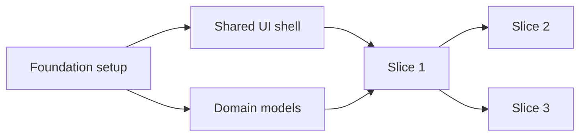

::: notes
Explain that a dependency graph is a visual map of implementation order, not just a picture of the system. Root nodes such as foundation setup are important because they unlock other work, while downstream nodes cannot start safely until their prerequisites exist. Spend about 40 seconds here walking through the arrows so the audience sees how to identify required sequencing quickly. Transition by asking which path through the graph will determine overall progress.
:::

---

## Find the Critical Path

- The **critical path** is the longest chain of dependent work
- Delays on that path delay the overall implementation plan
- Independent branches matter, but they do not all block delivery equally
- Focus coordination and risk management on the path that controls completion

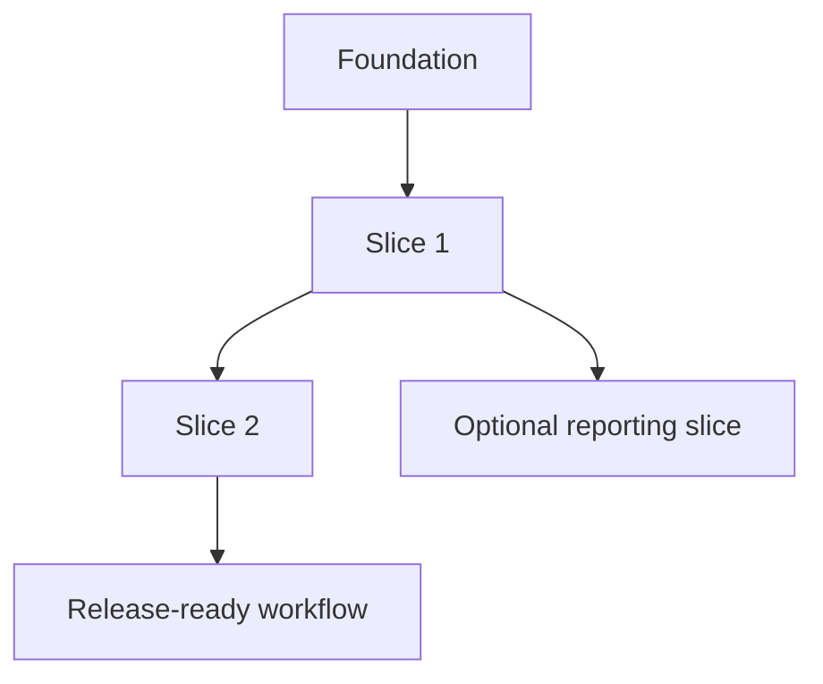

::: notes
Make the point that not every task has the same scheduling weight. The chain from foundation through Slice 1 and Slice 2 to release readiness is the critical path because a delay anywhere in that line affects the final delivery date. Spend about 40 seconds here helping the audience distinguish between essential dependency chains and helpful side work. Transition by showing that some branches can still be parallelized once the right prerequisites are in place.
:::

---

## Sequence First, Parallelize Second

- Some slices are strictly sequential because they share prerequisites
- Other slices can run in parallel after the same foundation is done
- Parallel work increases speed only when dependencies are already satisfied
- Planning should prevent teams from starting blocked work too early

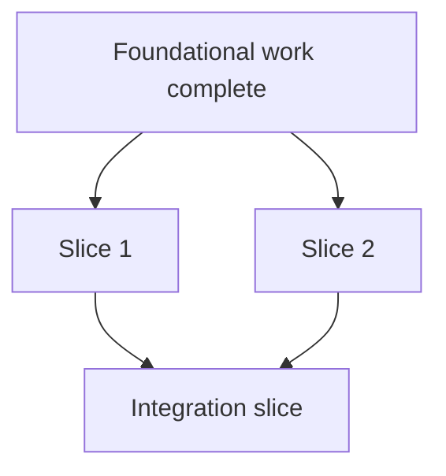

::: notes
Explain that parallelization is useful, but only after the common enabling work is complete. In this example, Slice 1 and Slice 2 can move at the same time, yet the integration slice must wait until both are finished, so sequencing still matters. Spend about 40 seconds here emphasizing that dependency graphs prevent false starts and wasted effort. Transition by separating foundational work from dependent features so the audience can see how to prioritize the backlog.
:::

---

## Distinguish Foundational and Dependent Features

**Foundational work**

- environments, shared components, core models, base services

**Dependent features**

- user-facing slices that rely on those shared capabilities

**Planning rule**

- finish enabling work first when many later slices depend on it

::: notes
Clarify that foundational work is valuable because it unlocks many downstream slices, not because it is glamorous. Dependent features usually deliver visible business value, but they become risky or inefficient if the core infrastructure they need is missing or unstable. Spend about 40 seconds here reinforcing the idea that the first work is not always the most visible work. Transition by summarizing a lightweight planning process the team can repeat for every implementation plan.
:::

---

## Use Dependency Analysis to Plan the Roadmap

1. List slices and enabling work
2. Draw the dependency relationships
3. Identify the critical path
4. Mark which branches can run in parallel
5. Schedule foundational work before dependent features

**Bottom line**: dependency graphs turn a feature list into a realistic implementation sequence.

::: notes
Close by turning the concept into a repeatable planning workflow. The audience should leave with the idea that dependency analysis is a small upfront investment that prevents scheduling confusion, blocked development, and unrealistic sequencing later. Spend about 30 to 40 seconds here summarizing that the graph reveals order, parallelism, and risk in one view. End by connecting this back to vertical slices, where smart sequencing makes incremental delivery much easier.
:::

---

<!-- _class: lead -->

## Course Modules

- Intro
- AI-First Development Methodology
- Specification Driven Software Development
- Architecture Specification
- Technology Specification
- Implementation Specification
- Implementation Planning
- **▶ Implementation Prompts**
- Vertical Slice Implementation
- Code Review with GitHub Copilot

---

<!-- _class: lead -->

# Implementation Prompts

---

## Implementation Prompts

- Implementation Prompts and Verification

---

<!-- _class: lead -->

## Implementation Prompts and Verification

- Section focus: turning slice plans into actionable build prompts
- Duration target: 22 minutes
- Outcome: show how to generate slice-specific prompts, verify behavior, and prepare stakeholder demos

::: notes
Introduce this section as the bridge between planning and actual implementation. The audience should understand that a slice plan becomes much more useful when it is converted into a precise prompt that tells the AI what to build, how to verify it, and how to demonstrate it. Spend about one minute here setting the expectation that the workflow is prompt, implement, verify, and showcase. Transition by asking what information a good implementation prompt must capture before any code is generated.
:::

---

## Start from a Single Slice

- Choose one slice from the implementation plan
- Example: **Slice 1 - Display Current Value**
- Use the slice instructions plus the implementation plan as source context
- Write one prompt file per slice so scope stays narrow and testable

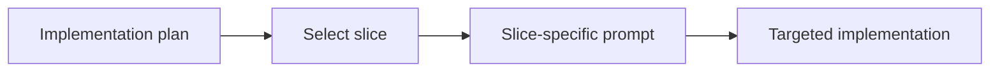

::: notes
Explain that the best implementation prompts are intentionally narrow. Rather than asking for an entire application, the team picks one slice from the plan and turns that into a focused request that can be reviewed and tested independently. Spend about two minutes here emphasizing that one-prompt-per-slice keeps scope manageable, reduces ambiguity, and supports incremental delivery. Transition by showing what the actual prompt needs to contain once the slice is chosen.
:::

---

## What the Implementation Prompt Should Say

- Reference the slice instructions and the implementation plan directly
- Ask the model to implement the selected slice
- Require **verification steps** in the output
- Require **showcase instructions** for stakeholder demonstration

**Prompt pattern**

> Using slice X instructions and implementation plan, create a prompt file that implements slice 1. Include verification steps and showcase instructions that demonstrate the functionality to stakeholders.

::: notes
Frame this slide around prompt construction, not just prompt wording. The important move is that the request names the slice, points to the governing instructions, and asks for more than code generation by explicitly requiring verification and demonstration guidance. Spend about three minutes here and make the point that this turns the prompt into a mini delivery package rather than a coding command. Transition by breaking down the expected deliverables inside the generated prompt file.
:::

---

## Expected Deliverables Inside the Prompt File

**Files to create**

- `index.html`
- `styles.css`
- `main.js`

**Specifications to include**

- HTML structure requirements
- CSS colors, fonts, spacing, and layout
- JavaScript behavior for current value, display object, and update function
- File structure and component organization

::: notes
Walk through the prompt output as if you are reviewing a generated file with the class. The goal is not merely to list filenames, but to show that the prompt should describe what each file is responsible for and how the pieces fit together. Spend about three minutes here emphasizing that precise HTML, CSS, and JavaScript expectations reduce drift and make reviews faster. Transition by moving from implementation detail to the checks that prove the slice actually works.
:::

---

## Build Verification into the Prompt

- **Initial state**: calculator displays `0` on page load
- **State update**: changing the value in the console updates the display
- **Accessibility**: contrast ratio >= 4.5:1 and font size >= `2rem`
- Include both automated testing guidance and manual verification steps

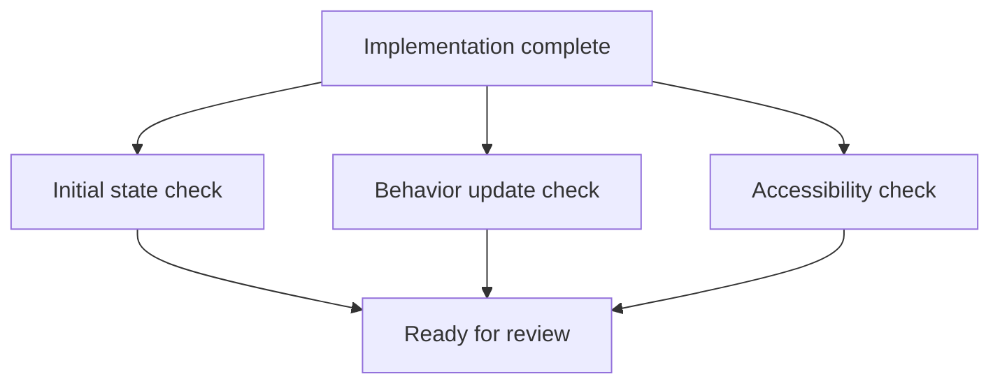

::: notes
Explain that verification should be authored before or alongside implementation, not after the fact. The checks on this slide are strong examples because they cover default state, observable behavior, and accessibility requirements in a way that reviewers and demonstrators can both understand. Spend about four minutes here and note that verification guidance should tell the team what to test automatically and what to inspect manually. Transition by showing how showcase instructions differ from verification even though the two are related.
:::

---

## Showcase Instructions Should Target Humans

- Do more than paste a code snippet
- Describe what users **see** and what they can **do**
- Call out the behavior the demonstrator should point to
- Provide an interactive demo path for stakeholders

**Good showcase guidance includes**

1. starting state on screen
2. action to take
3. visible result
4. why it matters to the audience

::: notes
Make the distinction between proving correctness and presenting value. Verification asks whether the slice works; showcase guidance tells a human demonstrator how to walk stakeholders through what appears on screen, what changes, and why they should care. Spend about three minutes here encouraging the audience to replace code-centric demo notes with behavior-centric instructions that support live explanation. Transition by expanding from one slice to the broader roadmap of multiple prompts.
:::

---

## Repeat the Pattern Across All Slices

- Create additional prompt files for Slice 2, Slice 3, and so on
- Version-control each prompt so changes stay traceable
- Reuse prompts later for revisions or follow-on work
- Execute slices sequentially and review each result before moving on
- Build a complete implementation roadmap with systematic verification

**Bottom line**: slice-specific prompts create a repeatable path from plan to implementation to review.

::: notes
Close by connecting the single-slice example to the full delivery workflow. Each prompt becomes a reusable unit of work that can be re-run, refined, and audited over time, which is especially useful when implementation spans multiple sessions or contributors. Spend about three minutes here reinforcing that sequential execution and review reduce risk while building confidence one slice at a time. End by encouraging the audience to treat prompt files as versioned implementation assets, not disposable chat text.
:::

---

<!-- _class: lead -->

## Course Modules

- Intro
- AI-First Development Methodology
- Specification Driven Software Development
- Architecture Specification
- Technology Specification
- Implementation Specification
- Implementation Planning
- Implementation Prompts
- **▶ Vertical Slice Implementation**
- Code Review with GitHub Copilot

---

<!-- _class: lead -->

# Vertical Slice Implementation

---

<!-- _class: lead -->

## Course Modules

- Intro
- AI-First Development Methodology
- Specification Driven Software Development
- Architecture Specification
- Technology Specification
- Implementation Specification
- Implementation Planning
- Implementation Prompts
- Vertical Slice Implementation
- **▶ Code Review with GitHub Copilot**

---

<!-- _class: lead -->

# Code Review with GitHub Copilot

---

## Code Review with GitHub Copilot

- Pull Request and Code Review
- GitHub Code Review with Copilot
- GitHub CLI and PR Management

---

<!-- _class: lead -->

## Pull Request and Code Review

- Section focus: moving from implementation into PR creation, review, and comment resolution
- Duration target: about 11.5 minutes
- Outcome: show how teams combine human and AI review to improve a slice before merge

::: notes
Introduce this section as the quality gate that turns implementation work into team-reviewed delivery. Explain that the goal is not only to open a pull request, but to create a workflow where human reviewers and AI reviewers can both contribute useful feedback before the slice is merged. Spend about one minute here framing the section around submission, review, and response. Transition by starting with the mechanics of creating the pull request itself.
:::

---

## Create the Pull Request Cleanly

- Use a focused branch name such as `slice-1`
- Follow the normal Git flow: commit, push, and create the PR
- Link the pull request to its issue in the development section
- Keep the PR scoped to one slice so review stays clear and actionable

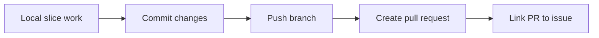

::: notes
Explain that a clean review starts with a clean pull request. Branch naming, a narrow slice-focused scope, and issue linkage all make it easier for both humans and AI to understand what the change is supposed to accomplish and what context it belongs to. Spend about two minutes here and reinforce that smaller, well-labeled PRs are easier to review thoroughly. Transition by showing what happens once the PR is open and reviewers are assigned.
:::

---

## Run Human and AI Review in Parallel

- Assign a human reviewer such as Christopher
- Initiate GitHub Copilot code review on the pull request
- Wait a few minutes for AI-generated comments to arrive
- Route implementation work clearly by assigning the issue to the implementer
- Use parallel review to shorten feedback time without sacrificing judgment

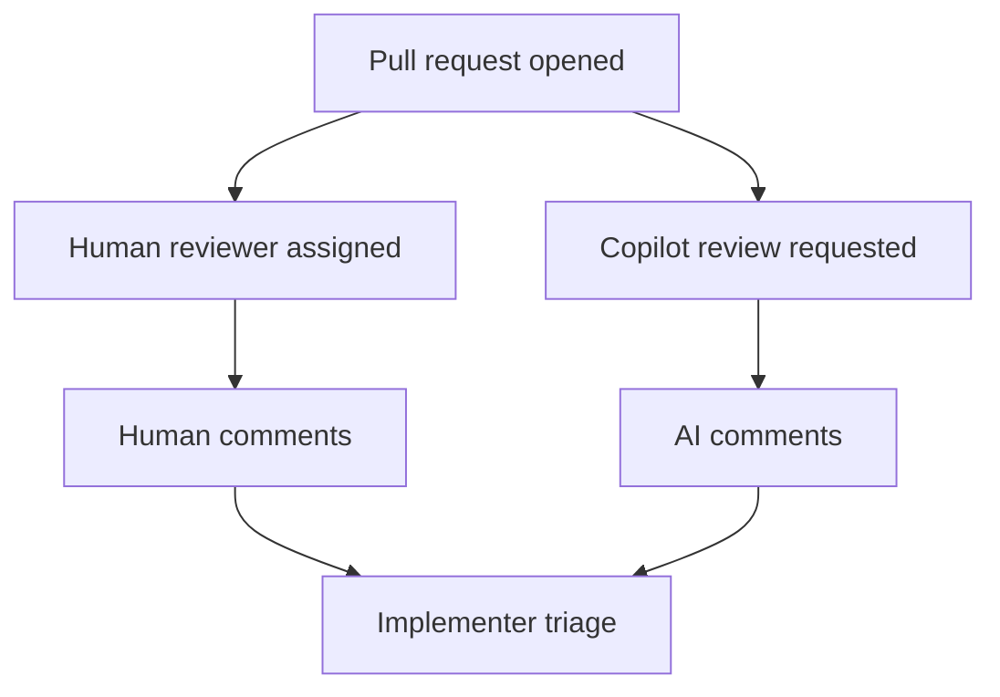

::: notes
Make the point that human review and AI review are complementary rather than competitive. The human reviewer brings context, intent, and domain judgment, while Copilot can scan for policy violations, code smells, and other issues that might be easy to miss in a first pass. Spend about two minutes here and emphasize that both feedback streams can happen at the same time, which improves review speed. Transition by looking at the kinds of issues the AI reviewer surfaced.
:::

---

## What the AI Review Flagged

- Missing AI provenance metadata in Markdown files
- DOM element access patterns that could be improved
- Multiple additional code quality concerns across the change set

**Why this matters**

1. metadata gaps break traceability requirements
2. DOM patterns affect maintainability and clarity
3. mixed quality issues show the value of automated review breadth

::: notes
Use this slide to summarize the review findings before going into comment-handling mechanics. The key takeaway is that the AI review did not focus on one narrow category of defects; it found documentation compliance issues, implementation-pattern concerns, and general quality problems in the same run. Spend about two minutes here and explain that this breadth is what makes AI review a valuable companion to human inspection. Transition by focusing on how the team should interpret and respond to the comments.
:::

---

## Review Comments Still Require Judgment

- Some comments should be fixed immediately
- Some suggestions may depend on project context
- Not every AI recommendation is automatically correct or worth implementing
- Teams need to decide whether to implement, defer, or ignore each point

**Good reviewer questions**

- Does this comment identify a real defect?
- Does the suggestion fit repository conventions?
- Is the proposed fix worth the churn right now?

::: notes
Stress that AI review produces input, not orders. Review comments can be helpful, but the team still has to evaluate whether a suggestion is accurate, relevant to the slice, and worth making before merge, especially when recommendations touch patterns or style rather than outright defects. Spend about two minutes here reminding the audience that judgment is the real bottleneck in good review, not comment volume. Transition by showing practical ways to handle comments once the team decides to act.
:::

---

## Address Comments One by One or in Batches

- Reference specific review comments when preparing fixes
- Handle comments individually when the issues are distinct or risky
- Batch fixes when several comments point to the same underlying problem
- Use copy-paste or direct AI interaction with comments depending on the workflow
- Typical fixes here included metadata updates and code-pattern adjustments

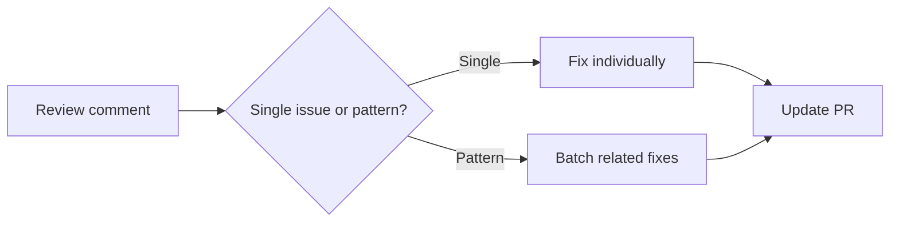

::: notes
Explain that comment resolution is partly a coordination problem. If comments are unrelated, it is safer to handle them one at a time so the reasoning stays clear, but if several comments all stem from the same root cause, batching them can reduce churn and speed up the next review pass. Spend about two minutes here and connect the examples back to the actual issues in this section, such as metadata fixes and DOM access improvements. Transition by ending with the broader workflow lessons the team should keep using.
:::

---

## Process Takeaways for Future PRs

- GitHub Copilot can participate as a code reviewer alongside humans
- AI review usually takes a few minutes, so plan for that latency
- Review comments can be handled individually or in grouped passes
- Manual reviewers and AI reviewers are strongest when used together
- Better prompts and instructions can reduce recurring review findings

**Bottom line**: strong PR workflow is not just about opening the review, but about turning feedback into better code and better guidance.

::: notes
Close by tying the mechanics back to team process. The audience should leave with the idea that a pull request is a collaborative checkpoint where both human judgment and AI-assisted review improve quality, and where recurring feedback should eventually drive updates to instructions, prompts, and testing standards. Spend about one to two minutes here summarizing the workflow and reinforcing that good review habits make later slices easier to deliver. End by suggesting that every repeated review comment is a candidate for strengthening the guidance upstream.
:::

---

<!-- _class: lead -->

## GitHub Code Review with Copilot

- Section focus: using Copilot review feedback to improve code, tests, and instructions
- Duration target: 18 minutes
- Outcome: show what Copilot found in PR `#4`, how humans resolved it, and how review findings feed better standards

::: notes
Introduce this section as a practical demonstration of Copilot acting as a review assistant rather than a code generator. Explain that the value is not just in the comments themselves, but in how the review surfaces patterns such as correctness issues, compliance gaps, and recurring quality risks. Spend about one minute here positioning the section as review, resolution, and process improvement. Transition by showing the review workflow from pull request to human action.
:::

---

## How the Review Flow Worked

- Open the pull request and request Copilot review
- Copilot analyzes changed files and leaves review comments
- Review findings are grouped around correctness, maintainability, and compliance
- Humans still decide what to fix, how to fix it, and when to close comments
- Commit suggestions can accelerate straightforward cleanups

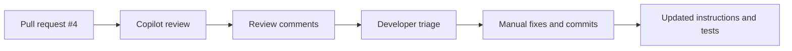

::: notes
Walk through the process as a collaboration loop rather than an automated approval gate. Copilot can inspect the diff quickly and highlight issues, but the team still has to evaluate the feedback, decide which comments are valid, and implement the actual fixes. Spend about two minutes here and call out the commit suggestion feature as useful for simple edits, though not a substitute for understanding the problem. Transition by summarizing the kinds of issues the review identified.
:::

---

## What Copilot Found in PR #4

| Finding area | Example issue | Why it matters |
| --- | --- | --- |
| Unicode usage | non-standard minus sign in comparisons | can cause subtle behavior or readability issues |
| State management | clearing errors leaves expression tokens behind | UI state becomes inconsistent |
| Compliance | AI provenance header missing | repository policy violation |
| Dead code | unused constants and functions | noise, confusion, and maintenance cost |
| Testing gaps | subtraction coverage called out | bugs can slip through |

- Total review volume: **8 comments/issues**

::: notes
Use this slide to give the audience a fast inventory of the feedback categories before you zoom in on individual examples. The important takeaway is that one review surfaced both code-level problems and process-level issues, which shows why review is valuable even when the code appears to work. Spend about two minutes here and emphasize that Copilot can flag a mix of correctness, hygiene, and governance concerns in one pass. Transition by taking the two most concrete implementation findings first.
:::

---

## Code Review Findings: Correctness Problems

**Unicode comparison issue**

- review recommended replacing a Unicode minus character with the standard ASCII `-`
- consistent character usage improves safety and maintainability

**State management issue**

- clearing the error state did not fully reset expression tokens
- partial reset behavior can leave stale calculation state behind

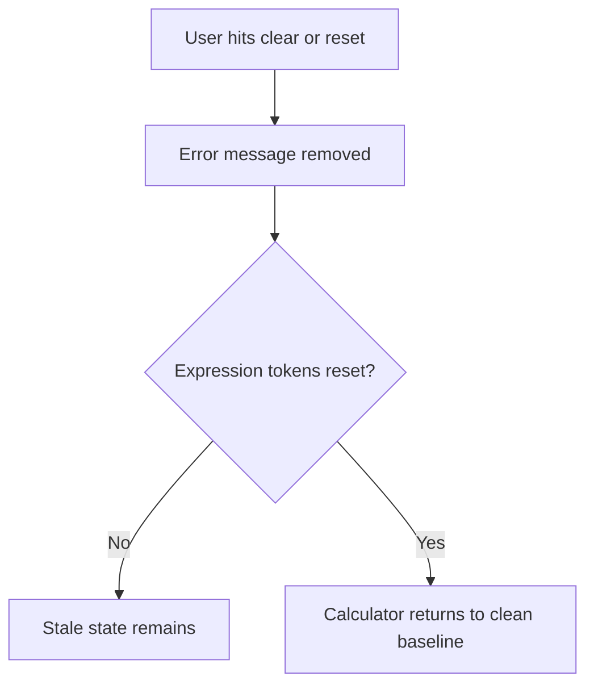

::: notes
Explain that these two findings are especially useful because they highlight different kinds of correctness risk. The Unicode issue is small but important because unusual characters can be hard to spot and may behave differently across tools, while the state-reset issue is a deeper logic problem because the UI looks reset even when internal state is not. Spend about three minutes here and make the point that review comments often range from superficial-looking fixes to structural behavior issues. Transition by moving from correctness to the policy and cleanup findings.
:::

---

## Code Review Findings: Compliance and Cleanup

- Previously compliant files were missing required AI provenance headers
- Unused constants and helper functions were identified as dead code
- Review also noted subtraction test coverage gaps
- Together, these findings show that review should check policy, clarity, and verification, not just functionality

**Review lens**

1. Does the code work?
2. Does it follow repository rules?
3. Is there unnecessary code left behind?
4. Do tests prove the risky behavior?

::: notes
Frame this slide as the broader quality story behind the pull request. Missing provenance metadata is not just a formatting issue in this repository, because it breaks traceability requirements, while dead code and testing gaps both increase the chance of future confusion or regressions. Spend about three minutes here reinforcing that good code review covers compliance and maintainability alongside logic. Transition by describing what the review experience looked like for the humans involved.
:::

---

## What We Observed About the Review Process

- Copilot's visible "thinking process" helped explain why comments were being made
- Review output still required manual interpretation and manual resolution
- The review became a teaching tool, not just a defect list
- Some feedback suggested improvements to instruction files, not only to source files

**Important point**: AI review assists judgment, but it does not replace reviewer accountability.

::: notes
Explain that part of the educational value came from seeing how the review reasoned about the diff. Even when the comments were useful, someone still had to verify the issue, choose the right fix, and decide whether the underlying instructions or prompts should change to prevent the same mistake next time. Spend about three minutes here stressing that Copilot improves reviewer leverage rather than eliminating reviewer responsibility. Transition by showing how the team can use those findings to strengthen the instruction layer.
:::

---

## Use Review Output to Improve the Instructions

- Tighten instruction files so recurring issues are prevented earlier
- Add explicit rules for ASCII-safe operators and character usage
- Clarify state reset expectations for error handling and token cleanup
- Reinforce provenance requirements where generated files are expected
- Expand tests around risky operations such as subtraction and clear-state behavior

**Bottom line**: the best outcome is not only fixing the PR, but improving the prompts and instructions that shape future PRs.

::: notes
Close by connecting review feedback to process improvement instead of treating comments as isolated repairs. If the same issues can recur, the right move is to update the instruction files, prompt guidance, or test expectations so future generated code starts from a stronger baseline. Spend about two to three minutes here and encourage the audience to think of review findings as input for evolving the system of guidance around AI-assisted development. End by summarizing that Copilot review is most valuable when it improves both the current change and the next one.
:::

---

<!-- _class: lead -->

## GitHub CLI and PR Management

- Section focus: managing pull requests with GitHub settings, IDE tooling, and the `gh` CLI
- Duration target: about 11 minutes
- Outcome: show how merge policy, review tools, and token permissions shape the day-to-day PR workflow

::: notes
Introduce this section as the operational layer around pull requests rather than a pure coding topic. Explain that teams need to understand not only how to create and review PRs, but also how repository settings, IDE integrations, and CLI permissions determine what they can do efficiently. Spend about one minute here setting up the theme of workflow control and tooling friction. Transition by starting with the merge strategy decision that affects every PR.
:::

---

## Start with the Merge Strategy

- Decide whether the repository defaults to **squash merge** or **merge commit**
- Squash merge keeps history compact and easier to scan
- Merge commits preserve the exact branch history and commit grouping
- This choice lives in GitHub repository pull request settings

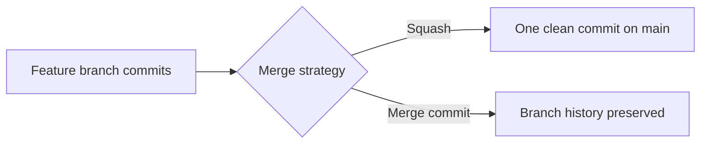

::: notes
Explain that merge strategy is a governance decision, not just a button choice at the end of a pull request. Squash merges can make the main branch easier to read, while merge commits retain more detail about how work evolved, so teams should choose based on their review and history preferences. Spend about two minutes here and point out that the default behavior should be deliberate because it shapes the whole repository's history. Transition by moving from repository settings into the tools people use to work with PRs day to day.
:::

---

## Use the Right PR Tools for Context

- The **GitHub Pull Requests** extension for VS Code keeps PR context inside the IDE
- Viewing PRs in the editor reduces browser switching
- Local code, review comments, and changed files are easier to compare side by side
- IDE-based review is especially helpful when debugging comment context

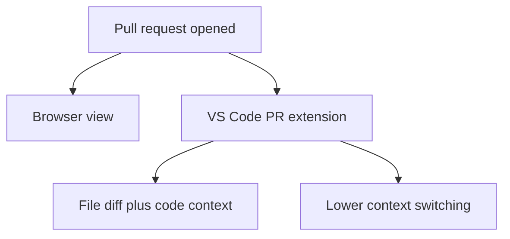

::: notes
Make the point that tooling choice affects reviewer efficiency. When developers can see the PR, the code, and their local workspace in one environment, they spend less time reconstructing context and more time evaluating the actual change. Spend about two minutes here and mention that the IDE becomes particularly useful when review comments refer to specific lines or patterns that need local verification. Transition by showing how the CLI fits into that same workflow.
:::

---

## Use the CLI for PR Comment Work

- The `gh` CLI can support PR comment and review workflows from the terminal
- Team members explored `gh pr comment` commands for practical resolution workflows
- CLI-based actions are useful when scripting or avoiding extra UI navigation
- Not every review action is equally convenient or permitted through the CLI

**Typical CLI goal**

- inspect PR status
- add comments
- help coordinate comment resolution

::: notes
Frame this slide around exploration and experimentation rather than a promise that every review action is frictionless. The CLI is powerful because it lets developers stay in terminal-first workflows and script repeated actions, but there are still limits depending on permissions, command support, and token setup. Spend about two minutes here and connect the examples to the hands-on investigation of `gh pr comment`. Transition by showing that Copilot review itself still often starts in the GitHub web interface.
:::

---

## Request Copilot Review and Then Triage the Output

- Copilot code review can be requested from the GitHub web interface
- After review arrives, teams can use browser, IDE, or CLI tools to manage follow-up work
- Good workflow means choosing the best tool for each step, not forcing one interface for everything
- Review handling still depends on repository settings and auth permissions

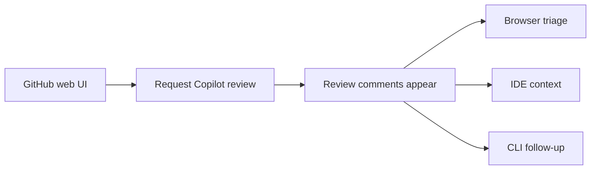

::: notes
Explain that PR management is often multi-surface by nature. A team may request the Copilot review in the web UI, inspect the comments in the IDE for better context, and then use the CLI for quick status checks or scripted follow-up actions, so the workflow is hybrid rather than exclusive. Spend about two minutes here and emphasize that effective teams choose the least-friction path per step. Transition by focusing on why permissions often become the limiting factor.
:::

---

## Permissions Can Block the Best Workflow

- Personal access token scopes determine what CLI operations are allowed
- Insufficient permissions can prevent review-related commands from working
- Teams discussed **classic tokens** versus **fine-grained tokens**
- Proper permissions are required before CLI review features become reliable

**Common friction points**

1. token lacks needed repo or review scope
2. command works in theory but fails in practice
3. workflow changes depending on auth model

::: notes
Stress that many workflow frustrations are really authentication problems in disguise. Developers may assume a CLI command is broken when the actual issue is that the token does not have permission to read, comment on, or manage the review workflow the way they expect. Spend about two minutes here and call out the classic-versus-fine-grained token discussion as a practical trade-off between convenience and tighter security. Transition by ending with the operational lessons teams should carry forward.
:::

---

## Practical Takeaways for PR Management

- Choose a merge strategy intentionally and document it
- Use the VS Code PR extension when local code context matters
- Use `gh` where it reduces repetitive PR management work
- Expect some Copilot review steps to begin in the web interface
- Verify token permissions early when CLI features do not behave as expected

**Bottom line**: strong PR management is a combination of repository settings, tool selection, and the right access model.

::: notes
Close by summarizing that effective PR management is never just about knowing commands. Teams need a clear merge policy, the right interface for the task at hand, and authentication that supports the workflow they want to use, or else the process becomes slower and more confusing than it needs to be. Spend about one to two minutes here reinforcing that the best workflow is the one that keeps context high and friction low. End by encouraging the audience to audit both their tools and their permissions before they need them under pressure.
:::