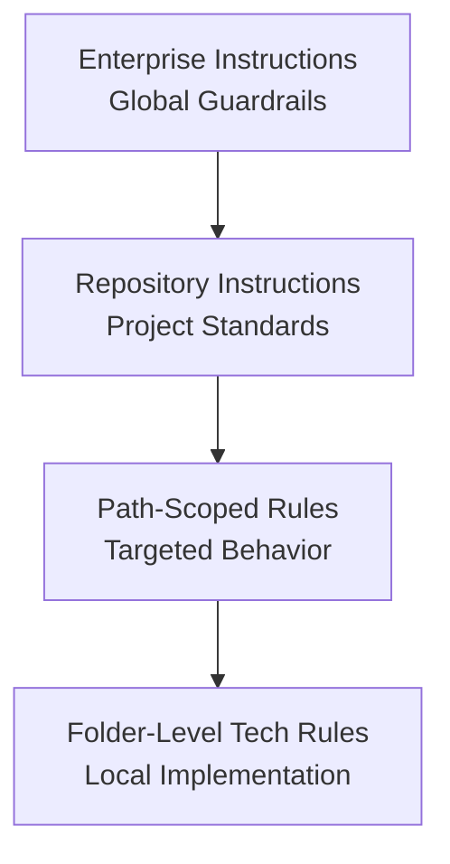
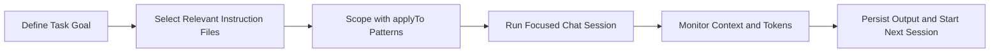

## Welcome to AI Assisted Software Development

From Code to Copilot

---

## John Michael Miller

**Principal Software Engineer at CODE**
Played roles of developer, architect, devops engineer, platform engineer, test architect, release manager
AI/ML Enthusiast and advocate for effectively using AI to write code

- LinkedIn: [www.linkedin.com/in/johnmichaelmiller](www.linkedin.com/in/johnmichaelmiller)
- Email: [john.miller@codemag.com](john.miller@codemag.com)
- Blog: [codemag.com/blog/AIPractitioner](codemag.com/blog/AIPractitioner)
- [AI Practitioner Resources](codemag.com/aipractitioner)

---

## Introductions

- Who you are
- Who do you work for
- What you do
- What you’ve done with AI tools
- What you want to learn

::: notes
Day One: Outline the day’s goals and emphasize participation and hands-on exercises.
:::

---

## About CODE

{width=100%}

::: notes
CODE is a custom software company, a staff augmentation company, CODE Magazine for software developers, and training like this webinar. We've been in business for 30 years and the magazine just hit its 25th anniversary. Visit the website at https://www.codemag.com/ for more details.
:::

---

## Daily Themes

| Day | Theme |
|-----|-------|
| Monday | AI Guardrails, Instructions |
| Tuesday | AI Guardrails, Prompts |
| Wednesday | AI Guardrails, Agents |
| Thursday | AI Assisted Brownfield Software Development |
| Friday | AI Assisted Greenfield Software Development |

---

<!-- _class: lead -->

## Course Modules

- Intro
- **▶ Module 1 - AIASD**
- Module 2 - Intro to Copilot
- Module 3 - Vibbing
- Module 4 - Adding AI Guardrails
- Module 5 - Managing Context

---

<!-- _class: lead -->

# Module 1 - AIASD

---

## Module 1 - AIASD

- WTBD - The Core Thesis
- The AI Revolution?

---

<!-- _class: lead -->

## WTBD - The Core Thesis

> "Programming hasn't changed, but how we go about it has changed, again."

- AI-assisted development is **evolutionary**, not revolutionary
- Programming has always been about **expressing human intent** to machines
- What changes is the **sophistication of our tools** for expressing intent
- The essence remains: bridging the gap between what we want and what machines can do

---

## A Brief History: Machine Code & Assembly (1940s)

- **Machine Code**: Raw binary language executed directly by hardware
- **Physical Programming**:
  - Flipping panel switches
  - Plugging cables
  - Feeding punched cards into IBM readers
  - Threading perforated paper tape

**Assembly Language**: Introduced symbolic mnemonics (MOV, ADD, JMP)

- **Enabling Technology**: Assemblers that translated mnemonics into machine code
- Still mainstream today in embedded systems and OS kernels

---

## High-Level Languages (1950s-1970s)

**The Abstraction Revolution**:

- Math-like and business-oriented syntax
- **Enabling Technologies**: Compilers and interpreters

**Key Languages**:

- **FORTRAN (1957)**: Pioneered scientific programming
- **COBOL (1959)**: Mainstream in business and government
- **C (1972)**: Spread with UNIX thanks to portable compilers

**Sensory Shift**: From mechanical card punches to typewriter-style terminals

---

## Structured & Object-Oriented Programming (1970s-1980s)

**Focus**: Modularity, reuse, and abstraction

**Key Developments**:

- **Pascal (1970)**: Structured paradigms with compiler innovations
- **C++ (1985)**: Object-oriented compilers supporting inheritance and polymorphism

**Enabling Technologies**:

- Advanced compiler innovations
- Support for inheritance and polymorphism

**Era Experience**: CRT monitors with green text, floppy disks

---

## IDEs & Libraries (1990s)

**The Integration Era**:

- **IDEs**: Combined compilers, debuggers, and editors in graphical interfaces
- **Visual Studio**: Enabled by faster processors and GUI toolkits
- **Java & JVM (1995)**: "Write once, run anywhere"
- **Reusable Libraries**: Abstracted common functionality

**Enabling Technologies**:

- Faster processors, GUI toolkits, extensible plug-in architectures
- Virtual machines

**Experience**: Mouse clicks, drag-and-drop, desktop computing

---

## Web & Scripting Languages (Late 1990s-2000s)

**The Dynamic Web Era**:

- **JavaScript (1995)**: Powered by Netscape, later V8 engine (2008)
- **Python**: Web development in 2000s, data science dominance
- **Ruby on Rails (2004)**: Abstracted web complexity

**Enabling Technologies**:

- Browser engines, dynamic interpreters, frameworks
- Eclipse IDE (2001)

**Experience**: Portable coding on laptops, coffee shop programming

---

## Cloud, APIs & Low-Code Platforms (2010s)

**The Orchestration Era**:

- **Cloud Computing**: Virtualization and containerization (Docker, Kubernetes)
- **APIs**: REST and GraphQL enabled modular integration
- **Low-Code Platforms**: Mendix, OutSystems, PowerApps with visual compilers

**Transformation**: Programming shifted from hardware-bound tasks to orchestration

**Experience**: Browser dashboards, swiping, clicking, dragging

---

## The Modern Mainstream Coding Experience

**Intent Interpretation**:

- Developers express intent in higher-level languages, frameworks, and APIs
- Compilers, interpreters, and VMs translate intent into executable code
- Libraries and cloud services provide ready-made building blocks
- Less about micromanaging hardware, more about shaping logic and workflows

**The Core**: Bridging human goals with machine execution through layers of abstraction

---

## AI-Assisted Coding (Present/Future)

**The Natural Language Era**:

**Enabling Technologies**:

- Large language models trained on vast code repositories
- Contextual intent recognition
- IDE integration

**The Paradigm Shift**: Programming becomes **dialogue**

- Express goals in plain language
- AI generates code, tests, and documentation
- Example: "Create a function that validates email addresses" → Complete implementation

---

## Natural Language Coding: The Game Changer

**Responsibility Shift**:

- Previously: Coder translates intent into executable code
- Now: Intent expressed in natural language, AI interprets and generates

**New Role of Programmer**:

- **Curator of context**
- **Validator of output**
- **Steward of alignment** between human goals and machine behavior

**Boundary Movement**: Between domain expertise and implementation

---

## AI Understands Intent—Not Just Commands

**Beyond Parsing**: AI understands what you mean

- "Make this faster" → Performance optimizations
- "Add error handling" → Proper exception management
- "Log the output" → Appropriate logging implementation

**New Interaction Modes**:

- Sketches and examples as expressions of intent
- Test cases and bug reports → Code generation
- Conversational iteration like human collaboration

---

## It's Just Another Tool

**Historical Perspective**:

- **IDEs**: Auto-complete and debugging
- **Libraries**: Reusable components
- **AI**: Intelligent scaffolding, pattern recognition, code generation

**Reality Check**:

- AI is not replacing developers
- It's helping them move faster and think bigger
- Following the same pattern as previous innovations

---

## Verification Still Matters

**Unchanged Responsibilities**:

- **Testing, review, and validation** still required
- **Architecture, correctness, security, ethics** remain developer duties
- Critical thinking is still essential

**What Changed**: How we express our goals
**What Didn't Change**: Whether we need to think critically

---

## The Future Is Still Intent-Driven Development

**Continuity**:

- Core goal remains: getting computers to do what we need
- Instead of writing/debugging code → creating prompts and refining context
- Same learning curve pattern as all previous improvements

**Essential Truth**: AI assistance is just another improvement in the long line of programming evolution

---

## Conclusion

**The Fundamental Truth**:

- Programming has **always** been about translating human intent into machine action
- From punch cards to Python to AI prompts—the core challenge remains unchanged
- What evolves is not the essence of programming, but the sophistication of our tools

**AI's Role**:

- Latest chapter in the ongoing story
- More intuitive ways to communicate with computers
- Preserves essential human responsibilities: design, validation, ethical oversight

**The Future**: Not abandoning programming, but refining it—making it more accessible and efficient while keeping human creativity and judgment at the center.

---

## The AI Revolution?

What hasn't changed and what has.

---

## Why AI Assisted Software Development

If used effectively, it will give you superpowers

- The courage to
  - Take on codebases that few would touch
  - Use technologies you should know but don’t
  - Write more high-quality code than you have ever written before
  - Take on the nice to haves

::: notes
Career Transformation: - Those who adapt: become 10x more productive, tackle bigger challenges, expand skill sets - Those who resist: may find themselves struggling with modern development expectations - New roles emerging: AI prompt engineers, AI code reviewers, AI-assisted architects

Superpowers Explained: - Legacy codebases: AI can quickly understand and explain complex, undocumented systems - New technologies: Learn frameworks/languages faster with AI as a coding partner - Code quality: AI suggests improvements, catches bugs, generates comprehensive tests - Nice to haves: Features that were “too time-consuming” become feasible

Examples to share: - Developer who used AI to modernize a 15-year-old PHP codebase in weeks instead of months - Team that adopted a new framework (React to Vue) with AI assistance in days - 80% reduction in boilerplate code writing time - Comprehensive test suites generated automatically

Key message: AI doesn’t replace developers—it amplifies their capabilities
:::

---

## AI‑First & Prompt‑First

AI‑First Development
A software engineering philosophy where AI is embedded across the entire SDLC–requirements, design, implementation, testing, documentation, compliance, and maintenance.
Prompt‑First Development
A workflow pattern where prompts, instruction files, and chat modes are treated as first‑class, version‑controlled artifacts.

::: notes
AI‑First is the broad philosophy. Prompt‑First is the tactical layer that enables predictable AI behavior. You can do Prompt‑First without being AI‑First, but not the reverse.
:::

---

## What Each Optimizes For

| Focus Area    | AI‑First                  | Prompt‑First                       |
| ------------- | ------------------------- | ---------------------------------- |
| Scope         | Entire SDLC               | Interaction layer                  |
| Goal          | Lifecycle integration     | Deterministic AI behavior          |
| Optimization  | Velocity, governance      | Prompt quality, reproducibility    |
| Risk Controls | Human‑in‑loop, provenance | Versioned prompts, context control |

::: notes
This table is the heart of the comparison. AI‑First is about organizational and architectural change. Prompt‑First is about artifact discipline and predictable outputs.
:::

---

## How They Treat Artifacts

AI‑First
Requirements written with AI collaboration in mind
AI‑generated scaffolds, tests, docs
Provenance enforced across all AI outputs
Architecture assumes AI participation
Prompt‑First
Prompts and instruction files are version‑controlled
Prompts define behavioral contracts
Reusable prompt modules
Chat modes define safe, predictable interactions

::: notes
AI‑First changes what you build and how you build it. Prompt‑First changes how you communicate intent to the AI.
:::

---

## Relationship Between the Two

Prompt‑First is a subset of AI‑First.
Prompt‑First = mechanics
AI‑First = philosophy + architecture + lifecycle integration

::: notes
This is the conceptual hierarchy. Prompt‑First is necessary but not sufficient for AI‑First maturity.
:::

---

## AI First Software Development

Building software where AI is a core capability, not an add‑on
Why AI‑First

- Software requirements increasingly expressed in natural language
- AI copilots accelerate architecture, coding, testing, and documentation
- Teams shift from “writing code” to “designing intent + validating outputs”
  Core Principles
- Prompt‑First Design: Requirements, architecture, and workflows expressed as structured prompts
- AI‑Native Architecture: Modular services, clear boundaries, deterministic interfaces for AI‑generated components
- Human‑in‑the‑Loop: Review, validation, and traceability baked into every stage
- Continuous Verification: Automated tests, static analysis, and guardrails to ensure safe outputs
- Lifecycle Governance: Versioning, provenance, and risk‑based controls for AI‑generated artifacts
  Outcomes
- Faster iteration cycles
- Higher coverage of documentation and tests
- Reduced cognitive load on developers
- More resilient, adaptable systems

::: notes
This slide frames what we mean by AI‑First development. The key idea is that AI isn’t an add‑on or a productivity booster—it becomes a core capability of the software lifecycle. When we design systems today, we assume AI will participate in requirements, architecture, coding, testing, and documentation.

Why AI‑First
“Teams increasingly express requirements in natural language. AI can interpret those requirements and generate scaffolding, code, tests, and documentation.”
“This shifts the developer’s role from writing every line of code to defining intent, constraints, and quality expectations.”
“The goal isn’t to replace engineering judgment—it’s to amplify it.”

Core Principles

Prompt‑First Design
“We start with structured prompts that capture behaviors, invariants, and interfaces. These become durable artifacts, just like design docs.”

AI‑Native Architecture
“We design modules with clear boundaries so AI‑generated components remain predictable and testable. Deterministic interfaces are essential.”

Human‑in‑the‑Loop
“AI accelerates creation, but humans validate correctness, safety, and alignment with business intent. Review is built into the workflow.”

Continuous Verification
“Every AI‑generated artifact—code, tests, docs—runs through automated checks. Static analysis, unit tests, and guardrails catch drift early.”

Lifecycle Governance
“We treat prompts, outputs, and revisions as versioned assets. Provenance and traceability matter for compliance, debugging, and long‑term maintainability.”

Outcomes
“Teams iterate faster because intent moves directly into working prototypes.”
“Documentation and test coverage improve because AI can generate them continuously.”
“Developers spend more time on architecture and correctness, less on boilerplate.”
“The result is software that’s more adaptable and resilient over time.”
:::

---

## Prompt‑First Software Development

Design the intent first — let AI generate the implementation
Why Prompt‑First

- Behaviors, and constraints expressed in structured natural language
- Prompts become the new “source of truth” artifacts
- Teams shift from writing functions to defining outcomes, invariants, and interfaces
  Core Practices
- Structured Prompts: Use templates for features, APIs, data models, tests, and refactors
- Instruction Files: Persistent, versioned artifacts guiding AI code generation
- Deterministic Boundaries: Clear module contracts so AI‑generated code stays predictable
- Validation Loops: Automated tests + human review ensure correctness and safety
- Prompt Versioning: Track evolution of intent just like code changes
  Benefits
- Faster iteration from idea → working software
- Higher consistency across generated components
- Reduced cognitive load on developers
- Better alignment between business intent and implementation

::: notes
“This slide introduces the core idea behind Prompt‑First development. Instead of starting with code, we start with intent. Prompts become the primary design artifact, and AI becomes the mechanism that turns intent into implementation.”

Why Prompt‑First
“Modern development increasingly begins with natural‑language descriptions of behavior. Prompt‑First formalizes that by treating prompts as first‑class inputs to the software lifecycle.”
“The developer’s role shifts from writing code line‑by‑line to defining outcomes, constraints, invariants, and interfaces.”
“This creates a tighter alignment between business intent and the resulting system.”

Core Practices

Structured Prompts
“We don’t rely on ad‑hoc prompting. We use templates for features, APIs, data models, tests, and refactors. This creates consistency and reduces ambiguity.”

Instruction Files
“These are durable, versioned prompt artifacts that guide AI generation. They act like living design documents that the AI reads every time it produces code.”

Deterministic Boundaries
“We design modules with clear contracts so AI‑generated code stays predictable. The AI can generate the internals, but the interfaces remain stable and human‑controlled.”

Validation Loops
“Every AI‑generated artifact goes through automated tests and human review. The goal is to catch drift early and ensure correctness.”

Prompt Versioning
“Prompts evolve just like code. Tracking changes helps with debugging, reproducibility, and compliance.”

Benefits
“Teams move from idea to working software much faster because intent flows directly into generation.”
“Generated components become more consistent because they’re driven by structured prompts, not one‑off instructions.”
“Developers spend more time on architecture and correctness, less on boilerplate.”
“The end result is a system that’s easier to maintain and adapt over time.”
:::

---

## **Concrete Examples**

**Prompt‑First Example**

- Promptfile for generating unit tests
- Instruction file for documentation
- Chat mode for brownfield developers

**AI‑First Example**

- Requirements → AI‑generated scaffolds
- Code changes → AI‑assisted reviews
- Docs → continuously AI‑generated
- Modernization → AI‑guided refactoring plans
- Provenance → enforced everywhere

::: notes
Use these examples to help teams visualize the difference.
Prompt‑First is about interfaces; AI‑First is about the entire workflow.
:::

---

## **Shortest Summary**

- **AI‑First = philosophy + architecture + lifecycle integration**
- **Prompt‑First = structured, version‑controlled interfaces for interacting with AI**

::: notes
End with this summary to reinforce the distinction.
It’s the cleanest way to remember the relationship.
:::

---

<!-- _class: lead -->

## Course Modules

- Intro
- Module 1 - AIASD
- **▶ Module 2 - Intro to Copilot**
- Module 3 - Vibbing
- Module 4 - Adding AI Guardrails
- Module 5 - Managing Context

---

<!-- _class: lead -->

# Module 2 - Intro to Copilot

---

## Module 2 - Intro to Copilot

- Repository and Tool Setup
- Hands-On with GitHub Copilot

---

## Repository and Tool Setup

Cloning course repository
GitHub authentication

---

## Lab: Clone the AI-Assisted-Software-Development Repository

Duration: 10 minutes
Prerequisites: Git, GitHub account
Objectives
Fork the AI-Assisted-Software-Development repo
Activities
Clone the git@github.com:johnmillerATcodemag-com/AI-Assisted-Software-Development.gitrepository
Switch to the brownfield branch
Success Criteria
Cloned repository exists locally

::: notes
Objective: Fork the course repos Tasks
Search GitHub for
AI-Assisted-Software-Development
Fork this repo
This will create a personal copy under your GitHub account
You can make changes without affecting the original repo
:::

---

## Exercise: Fork the AIASD-20260209-BF Repo

Duration: 20 minutes
Objectives: Explore an unfamiliar codebase
Activities
Fork this repo https://github.com/j0hnnymiller/AIASD-20260209-BF.git
Clone the forked repo
Create a GitHub PAT https://github.com/settings/tokens
Store the PAT in the GITHUB_TOKEN environment variable
Success Criteria
Repo is available locally

---

## Exercise: Fork the repos

Objective: Fork the course repos
Search GitHub for
- AI-Assisted-Software-Development
- zeus.academia.3b
Fork the repos
- This will create a personal copy under your GitHub account
- You can make changes without affecting the original repo

---

## Hands-On with GitHub Copilot

Installation and configuration
- Installing the extension
- Setting up authentication
- Configuring settings
Sharing configuration across an organization
- Shared configuration templates (e.g., .copilot/settings.json) can be distributed across projects to standardize behavior.
https://www.codemag.com/Blog/AI/AIASD-install-guide

::: notes
Walk through installation, auth, and a quick coding session; encourage participants to follow along.
:::

---

## Lab: Getting Started with GitHub Copilot

Duration: Follow along
Objectives
Install and configure GitHub Copilot
Verify authentication with GitHub account
Explore the Copilot UI components
Activities
Install GitHub Copilot extension from VS Code marketplace
Sign in with your GitHub account (verify Copilot subscription)
Locate and explore:
- Chat window and chat history
- New chat button
- Quick chat feature (keyboard shortcut)
- Settings menu
- Model selection dropdown
Check your premium token usage bar
Create a new chat and experiment with the interface
Success Criteria
- Copilot extension installed and authenticated
- Can open/close chat windows
- Understand difference between main chat and quick chat
- Know where to find chat history

::: notes
## **Lab 1: Getting Started with GitHub Copilot**


**Duration:** 20-30 minutes
**Prerequisites:** VS Code installed


### Objectives


- Install and configure GitHub Copilot
- Verify authentication with GitHub account
- Explore the Copilot UI components


### Activities


1. Install GitHub Copilot extension from VS Code marketplace
2. Sign in with your GitHub account (verify Copilot subscription)
3. Locate and explore:
- Chat window and chat history
- New chat button
- Quick chat feature (keyboard shortcut)
- Settings menu
- Model selection dropdown
4. Check your premium token usage bar
5. Create a new chat and experiment with the interface


### Success Criteria


- Copilot extension installed and authenticated
- Can open/close chat windows
- Understand difference between main chat and quick chat
- Know where to find chat history
:::

---

## Prompt Specificity

Add error handling to my code
- Result: Generic response asking what type of errors, what language, what code?
Add error handling to my JavaScript function that calls an external API. I want to handle network timeouts, 404 errors, and JSON parsing failures. Return user-friendly error messages.
- Result: Better, but still generic without seeing actual code structure
@file:api-client.js Add comprehensive error handling to the fetchUserData function. Handle network timeouts (>5s), HTTP errors (404, 500, etc.), and JSON parsing failures.   Return user-friendly error messages that match our existing error format in @file:error-types.js
- Result: Specific implementation that matches existing code patterns*

---

## Lab: Understanding Context Management

Duration: Follow along
Objectives
Learn to add context using @ symbols
Understand context window limitations
Practice writing effective prompts
Activities
1. Basic Context Addition:
Use `@workspace` to search across your codebase
Use `@file` to reference specific files
Use `@terminal` to include terminal output in chat
Use `@vscode` to ask VS Code-specific questions
2. Prompt Practice:
Write a vague prompt, observe results
Rewrite with specific context, compare results
Add file references to improve accuracy
3. Context Window Experiment:
Start a long conversation in one chat
Notice when Copilot starts "forgetting" earlier context
Practice starting new chats for new topics
Success Criteria
Can use all @ context types
Understand when to start fresh chat sessions
Notice quality difference between vague and specific prompts

---

## Lab: Chat Management & Workflow

Duration: Follow along
Objectives
- Organize chat sessions effectively
- Use chat history for reference
- Develop efficient workflow patterns
Activities
1. Chat Organization:
- Review your chat history
- Identify chats that should have been separate sessions
- Practice starting new chats at appropriate times
2. Context Preservation:
- Start a focused chat for one feature
- Add relevant context systematically
- Complete task without context overflow
3. Quick Chat Practice:
- Use main chat for primary task
- Use quick chat for side questions
- Return to main chat without losing context
4. Chat History Review:
- Find and reference previous solutions
- Learn from past prompts that worked well
- Identify patterns in effective conversations
Success Criteria
- Chat history is organized and meaningful
- Can find and reference previous solutions
- Efficient workflow developed for using multiple chat windows
Context Window Management
- Remember from the session:
  - Context is a **limited resource**
  - Start new chat when changing focus areas
  - Keep conversations targeted and specific
  - When Copilot "forgets" earlier context, it's time for a new session

---

## Using Copilot in different modes

Ask Mode
- Simple prompt completion and inline suggestions
Edit Mode
- Automatic file edits
Agent Mode
- Perform actions on your behalf
Custom Modes
- Execute specific workflows

::: notes
Explain Ask vs Edit modes and when each is most useful. Speak to Agent Mode and Custom Chat Modes briefly. We’ll work with those later.
:::

---

## Lab: Exploring Copilot Modes

Duration: Follow along
Objectives
Understand differences between Ask, Edit, and Agent modes
Know when to use each mode
Understand premium token implications
Activities
1. Ask Mode:
Ask Copilot to explain a code snippet (no changes made)
Request multiple implementation approaches
Try different models and observe response quality
Note: This doesn't consume premium tokens for advanced models
2. Edit Mode:
Select code in a file
Ask Copilot to refactor it
Observe inline suggestions and changes
Accept or reject proposed changes
3. Agent Mode:
Ask Copilot to create a new file and add content
Request changes across multiple files
Have Copilot run terminal commands
Check premium token usage after agent actions
Success Criteria
Can distinguish when to use each mode
Understand token consumption differences
Successfully use agent mode for multi-file operations

---

## IDE Support for AI Assistance

IDE / Editor | Built-In AI Features | Supported AI Assistants | Strengths | Limitations
--- | --- | --- | --- | ---
VS Code | Deep AI integration through extensions; increasingly AI-first workflows | GitHub Copilot, Cline, ChatGPT-based extensions, Gemini integrations | Extremely flexible; huge ecosystem; top-tier AI support; widely adopted | Requires extension management; quality varies by plugin
Visual Studio (Windows) | Native GitHub Copilot integration; AI-powered IntelliCode | GitHub Copilot, IntelliCode | Strong enterprise + .NET support; excellent refactoring and debugging | Less flexible than VS Code for non-Microsoft stacks
JetBrains IDEs | JetBrains AI Assistant; code completion, refactoring, doc generation | JetBrains AI Assistant, GitHub Copilot | Deep static analysis + AI; strong multi-language support | JetBrains AI Assistant is subscription-based; Copilot integration not as seamless
Cursor IDE | AI-first editor; conversational coding; multi-file reasoning | Built-in AI models (GPT-based, Claude-based), Copilot alternatives | Designed for AI pair-programming; strong repo-wide reasoning | Not a traditional IDE; still maturing for large enterprise workflows
Replit | AI-powered Ghostwriter for code generation, debugging, and explanations | Ghostwriter | Great for beginners and rapid prototyping; browser-based | Less powerful for large, multi-module projects
Builder.io / Builder Code Editor | AI-enhanced coding environment with integrated assistants | Multiple AI integrations depending on setup | Strong web-dev focus; modern AI-native UX | Not a general-purpose IDE
Code-B Editors | Predictive code generation, debugging, and review | Multiple AI models depending on configuration | Strong AI-centric workflows; optimized for speed | Less mainstream; smaller ecosystem
Claude Code | Terminal-first AI coding assistant; autonomous repo-wide reasoning | Latest models from Anthropic and other via configuration | Exceptional multi-file context handling; ideal for agentic workflows and automated patching | Not a GUI IDE; best suited for terminal-centric development and large codebases

---

<!-- _class: lead -->

## Course Modules

- Intro
- Module 1 - AIASD
- Module 2 - Intro to Copilot
- **▶ Module 3 - Vibbing**
- Module 4 - Adding AI Guardrails
- Module 5 - Managing Context

---

<!-- _class: lead -->

# Module 3 - Vibbing

---

## Module 3 - Vibbing

- Collaborating on a Solution
- AI-Assisted CI/CD Pipelines
- AI-Assisted GitHub Pull Requests
- Multi‑Model Implementation Comparison
- Evergreen Software Development - Core Principles

---

## Collaborating on a Solution

Project Setup
Adding Features
- Basic Arithmetic - Addition, subtraction, multiplication, division
- Clear / Reset Function - Quickly resets the current input or entire calculation
- Decimal Support - Allows entry and computation with decimal numbers
- Sign Toggle (+/–) - Switches values between positive and negative
- Percentage Function - Converts values to percentages for quick calculations
- Memory Functions (M+, M–, MR, MC) - Store, recall, add to, or clear memory values
- Error Handling - Displays errors such as division by zero
- Simple, Intuitive Interface - Numeric keypad, operation buttons, and display screen
Test Automation
- Code Coverage
Dependency Management
Comparing Implementations
Chat Management
Intro to Evergreen Software Development

::: notes
This slide outlines the collaborative development process we’ll follow for building our calculator application — and mob programming will be central to how we work together.

Except for Project Setup and Basic Arithmetic functions, the mob controls the direction of the implementation. The other labs are optional and can be used when the mob directs the development of that feature or as suggestions should the mob struggle for direction.

We begin with Project Setup, where the team configures the environment, aligns on goals, and prepares the repo. This is done as a mob — one keyboard, one screen, and everyone contributing ideas in real time. It ensures shared understanding from the start.

At the end of the day, we introduce Evergreen Software Development — a mindset of continuous improvement.

Random ideas:
Implementing Observability

Scaffold a new C# command line project using .NET. The project should include:
A Program.cs file with a simple "Hello, World!" example.
A .csproj file configured for a console application.
A README.md with build and run instructions.
The project should be ready to build and run from the command line.
:::

---

## Exercise: Calculator Project - Setup and Basic Implementation

Duration: 45-60 minutes

Objectives

- Use AI to generate starter code for arithmetic operations
- Understand how to validate AI-generated logic
- Integrate addition, subtraction, multiplication, and division functions

Activities

1. Project Initialization:

- Prompt AI to create a new project
- Review generated project structure
- Verify build configuration

2. Implement Basic Operations:

- Prompt AI to add methods for addition, subtraction, multiplication, and division

3. Review the Code:

- Check correctness and edge cases

4. Build and Run:

- Use Copilot to help with build commands
- Troubleshoot compilation errors with Copilot
- Run the application

Success Criteria

- Working calculator with 4 basic operations
- Application compiles and runs successfully
- Generated code is critically reviewed

::: notes

## Setup and Basic Implementation Exercise Instructions

**Duration:** 45-60 minutes
**Prerequisites:** Calculator project context available

### Objectives

- Scaffold core operations with AI assistance.
- Validate generated logic before accepting changes.
- Deliver a working baseline calculator.

### Activities

- Build project skeleton, implement 4 operations, and verify behavior.
- Emphasize manual review of AI output before merge.

### Success Criteria

- Four operations work end-to-end.
- Build is green.
- Team can explain logic and edge-case handling.
  :::

---

## Exercise: Calculator Project - Clear / Reset

Duration: 15 minutes

Objectives

- Use AI to scaffold state-management logic
- Implement CE (clear entry) and C (clear all) behaviors
- Understand UI state transitions

Activities

1. Ask AI to outline the difference between CE and C
2. Generate code for clearing current input vs full state
3. Integrate logic into calculator state object
4. Test transitions with sample input sequences

Success Criteria

- CE clears only the active entry
- C resets the entire calculator state

::: notes

## Clear / Reset Exercise Instructions

**Duration:** 15 minutes
**Prerequisites:** Basic calculator state model

### Objectives

- Separate entry-level clear from full reset behavior.
- Verify expected transitions from each action.

### Activities

- Use focused prompts and test state transitions quickly.

### Success Criteria

- CE and C behaviors are consistent and explainable.
  :::

---

## Exercise: Calculator Project - Decimal Input

Duration: 12 minutes

Objectives

- Use AI to generate input-validation logic
- Prevent multiple decimal points
- Ensure decimals flow through arithmetic operations

Activities

1. Ask AI for a decimal input strategy
2. Generate code to block duplicate decimals in one number
3. Integrate decimal support into input parser
4. Test decimal operations with AI-generated test cases

Success Criteria

- Decimal input works without duplication errors
- Arithmetic with decimals is correct
- Validation logic is explainable

::: notes

## Decimal Input Exercise Instructions

**Duration:** 12 minutes
**Prerequisites:** Input parser in place

### Objectives

- Implement robust decimal parsing and validation.

### Activities

- Target parser rules, then validate with focused tests.

### Success Criteria

- No duplicate decimal points accepted.
- Decimal math behaves correctly.
  :::

---

## Exercise: Calculator Project - Sign Toggle (+/-)

Duration: 8 minutes

Objectives

- Use AI to generate sign-toggle logic
- Understand effect on active input and stored value

Activities

1. Ask AI to generate toggle-sign function for active value
2. Integrate into input workflow
3. Test before and after digit entry

Success Criteria

- Sign toggle works for integers and decimals
- Learner can explain stored vs active value impact

::: notes

## Sign Toggle Exercise Instructions

**Duration:** 8 minutes
**Prerequisites:** Numeric input flow functioning

### Objectives

- Add predictable sign toggling.

### Activities

- Keep implementation minimal and test transitions.

### Success Criteria

- Toggle is stable across value states.
  :::

---

## Exercise: Calculator Project - Percentage

Duration: 15 minutes

Objectives

- Use AI to clarify percentage interpretation rules
- Implement percentage logic for common patterns
- Validate behavior with AI-generated examples

Activities

1. Ask AI how percentage should behave in a standard calculator
2. Generate code for:

- X x Y%
- Y + X%
- Y - X%

3. Test each pattern with AI-generated values

Success Criteria

- Percentage operations match standard calculator behavior
- Learner can articulate percentage interpretation rules

::: notes

## Percentage Exercise Instructions

**Duration:** 15 minutes
**Prerequisites:** Core arithmetic implemented

### Objectives

- Align percentage behavior with user expectations.

### Activities

- Compare generated logic with known calculator semantics.

### Success Criteria

- Three key percentage patterns operate correctly.
  :::

---

## Exercise: Calculator Project - Memory Functions (M+, M-, MR, MC)

Duration: 18 minutes

Objectives

- Use AI to design memory subsystem
- Implement memory add, subtract, recall, and clear
- Validate memory across multiple operations

Activities

1. Ask AI for memory-state structure
2. Generate functions for M+, M-, MR, MC
3. Integrate memory operations into calculator flow
4. Test memory persistence over sequences

Success Criteria

- Memory functions behave as expected
- Learner can explain memory state updates

::: notes

## Memory Functions Exercise Instructions

**Duration:** 18 minutes
**Prerequisites:** Calculator state architecture defined

### Objectives

- Add reliable memory operations.

### Activities

- Ensure memory state is explicit and testable.

### Success Criteria

- Memory operations are consistent and validated.
  :::

---

## Exercise: Calculator Project - Error Handling

Duration: 10 minutes

Objectives

- Use AI to identify common error conditions
- Implement error messages and recovery logic
- Ensure graceful reset after errors

Activities

1. Ask AI to list calculator errors (for example divide by zero)
2. Generate error detection and display logic
3. Implement reset path after an error
4. Test error scenarios with AI-generated tests

Success Criteria

- Errors are detected and displayed correctly
- Calculator recovers cleanly
- Learner can explain error-handling flow

::: notes

## Error Handling Exercise Instructions

**Duration:** 10 minutes
**Prerequisites:** Core operations implemented

### Objectives

- Build robust error paths without breaking user flow.

### Activities

- Validate both error detection and post-error recovery.

### Success Criteria

- Error handling is visible, predictable, and recoverable.
  :::

---

## Exercise: Calculator Project - Add Trigonometric Functions

Duration: 15 minutes

Objectives

- Integrate trigonometric operations
- Use AI for math wrappers and parsing logic
- Handle degrees vs radians correctly

Activities

1. Ask AI to generate sin, cos, tan functions using language math library
2. Ask AI for degree/radian mode strategy
3. Implement UI bindings or command triggers
4. Generate sample input/output table with AI and validate

Success Criteria

- Trig results are correct for selected angle mode
- Degree/radian switching works consistently
- UI or commands correctly call trig functions
- Learner can explain validation and refinement steps

::: notes

## Trigonometric Functions Exercise Instructions

**Duration:** 15 minutes
**Prerequisites:** Advanced operation framework available

### Objectives

- Add trig support with explicit angle-mode handling.

### Activities

- Implement and validate both behavior and mode switching.

### Success Criteria

- Trig pipeline works end-to-end with tested expectations.
  :::

---

## Exercise: Calculator Project - UI

Duration: 15 minutes

Objectives

- Use AI to scaffold UI event handlers
- Connect UI controls to logic functions
- Validate end-to-end workflow

Activities

1. Ask AI to generate event-binding code for numeric/operator controls
2. Integrate logic functions from prior exercises
3. Test full workflow:

- Enter decimal
- Toggle sign
- Apply percentage
- Store result in memory

Success Criteria

- UI triggers all calculator functions correctly
- End-to-end workflow completes without errors
- Learner can explain UI-to-logic mapping

::: notes

## UI Exercise Instructions

**Duration:** 15 minutes
**Prerequisites:** Core logic stable and testable

### Objectives

- Wire UI interactions cleanly to existing logic.

### Activities

- Prioritize event mapping clarity over visual polish.

### Success Criteria

- Workflow passes from input to output with no breaks.
  :::

---

## Exercise: Calculator Project - Testing

Duration: 45-60 minutes

Objectives

- Generate unit tests with AI assistance
- Identify quality issues in generated tests
- Understand why generated tests require review

Activities

1. Generate Initial Tests:

- Prompt: "Create unit tests for the calculator operations"
- Review generated test structure
- Verify tests call calculator code

2. Fix Test Issues:

- If tests are trivial (for example 1 + 1 only), identify issue
- Prompt: "Update tests to call Calculator class methods"
- Verify improved test quality

3. Run Tests:

- Execute test suite
- Review output
- Debug failing tests with Copilot

4. Add Edge Cases:

- Prompt: "Add tests for edge cases like division by zero"
- Verify exception handling tests

Success Criteria

- Minimum 8 test cases
- Tests call actual calculator methods
- Edge cases and error conditions included
- All tests pass

::: notes

## Testing Exercise Instructions

**Duration:** 45-60 minutes
**Prerequisites:** Calculator logic implemented

### Objectives

- Improve test quality, not just test count.

### Activities

- Review generated tests critically before accepting.

### Success Criteria

- Test suite is meaningful, comprehensive, and green.
  :::

---

## Exercise: Code Coverage

Duration: 30-40 minutes

Objectives

- Set up code coverage reporting
- Interpret coverage data
- Improve coverage based on identified gaps

Activities

1. Enable Coverage Collection:

- Prompt: "Add code coverage reporting to my test project"
- Review dependencies added
- Resolve NuGet/dependency issues with Copilot

2. Generate Coverage Report:

- Run tests with coverage
- Review percentage
- Identify uncovered paths

3. Improve Coverage:

- Add tests for uncovered methods
- Re-run coverage and verify improvement
- Discuss if 100% coverage is necessary

Success Criteria

- Coverage reporting configured successfully
- Coverage reports can be generated and interpreted
- Reasonable coverage achieved (>80% line coverage)
- Learner understands what coverage metrics mean

::: notes

## Code Coverage Exercise Instructions

**Duration:** 30-40 minutes
**Prerequisites:** Stable test suite

### Objectives

- Use coverage as a guide for targeted testing.

### Activities

- Treat uncovered code as investigation points, not automatic defects.

### Success Criteria

- Coverage setup works and leads to actionable improvements.
  :::

---

## Exercise: Dependency Management and Troubleshooting

Duration: 30-40 minutes

Objectives

- Use Copilot to resolve dependency issues
- Handle package restoration problems
- Practice iterative AI-assisted troubleshooting

Activities

1. Simulate or Identify a Dependency Issue:

- Introduce version conflict or use an existing issue
- Prompt: "I'm getting [specific error]. How do I fix it?"

2. Follow Copilot Guidance:

- Review suggested solutions
- Evaluate alternatives
- Select best option collaboratively

3. Iterative Resolution:

- Provide new error details when needed
- Continue until resolved

4. Practice common issues:

- NuGet package source configuration
- MSTest adapter version conflicts
- .NET SDK targeting issues
- Package restoration failures

Success Criteria

- At least one dependency issue resolved
- Learner can provide useful error context to Copilot
- Iterative problem-solving pattern demonstrated

::: notes

## Dependency Troubleshooting Exercise Instructions

**Duration:** 30-40 minutes
**Prerequisites:** Build/test environment configured

### Objectives

- Build confidence in diagnosing and fixing dependency failures.

### Activities

- Emphasize iterative debugging and evidence-based prompts.

### Success Criteria

- Issue resolution is repeatable and well-documented.
  :::

---

## Exercise: Best Practices Review and Code Quality

Duration: 30-40 minutes

Objectives

- Apply best practices from session
- Review code quality systematically
- Identify and implement meaningful improvements

Activities

1. Code Quality Check:

- Prompt: "Suggest improvements for code quality and maintainability"
- Evaluate suggestions critically
- Implement high-value improvements

Success Criteria

- Documentation and maintainability improved
- AI suggestions are critically evaluated before adoption

::: notes

## Best Practices Review Exercise Instructions

**Duration:** 30-40 minutes
**Prerequisites:** Working project baseline

### Objectives

- Turn AI suggestions into intentional quality improvements.

### Activities

- Keep only changes with clear maintainability value.

### Success Criteria

- Improvements are justified and validated.
  :::

---

## Exercise: Model Comparisons

Duration: 20-30 minutes

Objectives

- Compare outputs from different AI models
- Understand premium vs standard model trade-offs
- Monitor token usage impact

Activities

1. Same Prompt, Different Models:

- Use one coding task (for example implement bubble sort)
- Compare standard and premium model outputs

2. Token Usage Analysis:

- Check premium token bar before/after
- Estimate consumed tokens
- Discuss value vs cost

3. Best Use Cases:

- Identify tasks for standard vs premium models
- Create model selection guidelines

4. Ask Mode Advantage:

- Use Ask mode with premium model
- Compare with Agent mode token behavior

Success Criteria

- At least two models compared
- Token consumption trade-offs understood
- Learner can choose model by task type

::: notes

## Model Comparisons Exercise Instructions

**Duration:** 20-30 minutes
**Prerequisites:** Access to multiple model options

### Objectives

- Build practical model-selection judgment.

### Activities

- Compare quality, speed, and token cost for same prompt.

### Success Criteria

- Team can explain when premium models are worth it.
  :::

---

## Exercise: Calculator Project - Encapsulate Core Logic

Duration: 15 minutes

Objectives

- Separate UI concerns from computational logic
- Use AI to scaffold standalone core logic module/class
- Ensure UI communicates through a clean API
- Validate improved testability and maintainability

Activities

1. Ask AI to generate dedicated component (for example CalculatorEngine or CalculatorCore) containing:

- Arithmetic operations
- State management
- Trig/percentage/memory logic where implemented

2. Review and refine API surface (naming, inputs, outputs)
3. Replace UI-embedded logic with component calls

Success Criteria

- All features route through external logic component
- UI contains only event handling/display updates
- Learner can explain modularity and reuse benefits

::: notes

## Encapsulate Core Logic Exercise Instructions

**Duration:** 15 minutes
**Prerequisites:** UI and logic currently coupled

### Objectives

- Improve architecture through separation of concerns.

### Activities

- Create clear, testable boundaries between UI and engine.

### Success Criteria

- Core logic is isolated and reusable.
  :::

---

## Exercise: Security Review

Duration: 30-40 minutes

Objectives

- Systematically review code for security issues
- Address discovered vulnerabilities
- Strengthen input validation and safe patterns

Activities

1. Security Review:

- Prompt: "Review this code for security vulnerabilities"
- Address identified issues
- Add input validation where missing

Success Criteria

- No obvious security issues remain
- AI recommendations are critically evaluated and validated

::: notes

## Security Review Exercise Instructions

**Duration:** 30-40 minutes
**Prerequisites:** Functional calculator project

### Objectives

- Apply practical security checks to working code.

### Activities

- Validate fixes with tests and review, not assumptions.

### Success Criteria

- Security posture improves with documented rationale.
  :::

---

## Exercise: Documentation

Duration: 30-40 minutes

Objectives

- Add and improve project documentation
- Review AI-generated docs for accuracy and completeness

Activities

1. Documentation:

- Ask Copilot to generate XML/doc comments
- Review and refine for correctness
- Add README usage instructions
- Ask AI to update existing documentation sections

Success Criteria

- Documentation is comprehensive and accurate
- AI-generated content is critically reviewed before acceptance

::: notes

## Documentation Exercise Instructions

**Duration:** 30-40 minutes
**Prerequisites:** Stable code to document

### Objectives

- Produce maintainable, user-focused documentation.

### Activities

- Treat generated docs as drafts requiring technical review.

### Success Criteria

- Docs are complete, correct, and actionable.
  :::

---

## Exercise: Refactoring

Duration: 30-40 minutes

Objectives

- Apply refactoring best practices
- Compare alternative implementations
- Evaluate trade-offs before choosing changes

Activities

1. Refactoring Exercise:

- Ask Copilot for alternative implementations
- Compare readability, complexity, and maintainability
- Discuss trade-offs and select best approach

Success Criteria

- At least one refactoring improvement implemented
- Code quality and maintainability improved
- AI suggestions critically evaluated

::: notes

## Refactoring Exercise Instructions

**Duration:** 30-40 minutes
**Prerequisites:** Existing implementation with improvement opportunities

### Objectives

- Use AI for option generation, then apply engineering judgment.

### Activities

- Compare alternatives using explicit criteria.

### Success Criteria

- Selected refactor improves clarity without regressions.
  :::

---

## Exercise: Test Coverage Improvement

Duration: 30-45 minutes

Objectives
- Analyze code coverage reports
- Use Copilot to intelligently add tests
- Achieve target coverage percentage
- Balance quantity vs. quality of tests

Activities
1. Review Current Coverage:
  - Run tests with coverage reporting
  - Identify uncovered code paths
  - Analyze coverage percentage by file/class
2. Targeted Test Generation:
  - Prompt: "Add tests to increase code coverage to [X]%"
  - Observe how Copilot identifies gaps
  - Review generated tests for quality
3. Strategic Coverage Improvement:
  - Prompt: "Add tests for edge cases in division operation"
  - Prompt: "Add tests for corner cases like divide by zero"
  - Prompt: "Add integration tests for evaluate arithmetic method"
4. Verify Test Quality:
  - Confirm tests call real implementation code
  - Confirm tests verify expected behavior, not just execution
  - Confirm edge cases are properly handled
5. Re-run Coverage:
  - Execute test suite with coverage
  - Compare before/after percentages
  - Identify remaining gaps

Success Criteria
- Code coverage increased by at least 20 percentage points
- All new tests are meaningful and test actual implementation
- Tests include edge cases and error conditions
- Coverage report shows improved metrics
- Understanding of test quality vs. quantity trade-offs

::: notes
## Test Coverage Improvement Exercise Instructions

**Duration:** 30-45 minutes
**Prerequisites:** Lab 1 completed, existing test suite

### Objectives

- Analyze code coverage reports
- Use Copilot to intelligently add tests
- Achieve target coverage percentage
- Balance quantity vs. quality of tests

### Activities

1. Review current coverage metrics and identify weak areas by file/class.
2. Use Copilot prompts to generate targeted tests for uncovered code paths.
3. Improve strategically with edge-case and integration-focused prompts.
4. Validate test quality to ensure behavior is truly verified.
5. Re-run coverage and compare before/after outcomes.

### Success Criteria

- Coverage increases by at least 20 percentage points.
- New tests are meaningful and exercise actual implementation logic.
- Edge cases and error conditions are covered.
- Coverage reporting clearly shows improvement.
- Participants can explain quality vs. quantity trade-offs.

### Key Learning Point

As discovered in the session, asking Copilot to "increase coverage to 50%" can work because it can intelligently identify which code paths need testing. This can be more efficient than manually finding every gap, but quality checks are still required.
:::

---

## Exercise: Lab 3 - Test-Driven Development (TDD) with Copilot

Duration: 45-60 minutes

Objectives
- Practice TDD workflow with AI assistance
- Write failing tests before implementation
- Use tests to drive design decisions
- Understand red-green-refactor cycle

Activities
1. Define New Feature:
  - Choose a feature (for example, memory operations for calculator)
  - Store current result (ANS/answer functionality)
  - Recall previous result
  - Handle "ANS + 5" style operations
2. Write Failing Tests First:
  - Prompt: "Using TDD, create tests for a memory/answer feature in the calculator. DO NOT implement the feature yet."
  - Review generated tests
  - Verify tests reference methods that do not exist yet
3. Run Tests (Expect Failures):
  - Execute test suite
  - Observe compilation errors or test failures
  - Document what is missing
4. Implement Feature to Pass Tests:
  - Prompt: "Implement the memory/answer feature to make the tests pass"
  - Review generated implementation
  - Run tests again
  - Verify all tests now pass
5. Refactor:
  - With tests passing, ask for improvements
  - Prompt: "Refactor the answer implementation for better readability"
  - Verify tests still pass after refactoring

Success Criteria
- Tests written before implementation
- Initial test run shows failures (red phase)
- Implementation makes all tests pass (green phase)
- Code refactored while maintaining passing tests
- Understanding of TDD benefits and workflow

::: notes
## Lab 3 - Test-Driven Development (TDD) with Copilot Exercise Instructions

**Duration:** 45-60 minutes
**Prerequisites:** Understanding of TDD principles

### Objectives

- Practice TDD workflow with AI assistance
- Write failing tests before implementation
- Use tests to drive design decisions
- Understand red-green-refactor cycle

### Activities

1. Select a small feature and define expected behavior.
2. Ask Copilot for tests only, and confirm the implementation is still missing.
3. Run tests and capture failures to validate the red phase.
4. Implement the minimum code required to satisfy tests.
5. Refactor for readability and maintainability while keeping tests green.

### Success Criteria

- Tests are authored before implementation code.
- The first execution clearly fails (red).
- Feature implementation makes tests pass (green).
- Refactoring preserves passing tests.
- Participants can explain the value of TDD in AI-assisted development.

### TDD Cycle

1. **Red:** Write a failing test.
2. **Green:** Write minimal code to make it pass.
3. **Refactor:** Improve code while keeping tests green.
:::

---

## AI-Assisted CI/CD Pipelines

GitHub Actions YAML generation
Build automation with AI
Coverage thresholds
Pipeline maintenance and evolution
Exercise: Generate a pipeline from scratch

::: notes
Introduce this module as a practical guide to using AI — specifically GitHub Copilot — to design, generate, and maintain CI/CD pipelines on GitHub Actions. Emphasize that the goal is not to automate humans out of the loop but to reduce the friction between "intent" and "working YAML". Many teams struggle to get a pipeline right on the first try; AI dramatically shortens that feedback cycle.
:::

---

## Why Pipelines Are Hard

YAML syntax is unforgiving
Action versions change constantly
Environment variables, secrets, and caching rules interact unexpectedly
Coverage gates, linting, and deployment steps differ per project
Copy-paste drift between projects accumulates silently

::: notes
Open with empathy. Most developers have lost an afternoon to a mis-indented YAML block or an unexpected breaking change in a third-party action. These are not skill failures — they are complexity failures. AI closes the gap between "I know what I want" and "here is the correct YAML to achieve it."
:::

---

## What AI Brings to CI/CD

```text
You → intent           AI → working YAML
   "run tests on PR"        on: [pull_request]
                            jobs: test: ...
```

Generate pipelines from plain English
Explain unfamiliar pipeline syntax
Diagnose failing workflow runs from logs
Suggest caching, matrix, and concurrency improvements
Keep actions pinned and up to date

::: notes
Walk through the mental model: the developer provides intent, the AI provides syntactically correct, contextually appropriate YAML. This is not magic — the AI has seen thousands of pipelines. Stress that the developer still reviews and owns every line. AI accelerates the first draft and the debugging loop, not the decision-making.
:::

---

## GitHub Actions YAML Generation

Ask Copilot in chat or inline:

```text
Prompt: "Create a GitHub Actions workflow that runs
dotnet test on every pull request targeting main,
uploads a code coverage report, and fails if
coverage drops below 80%."
```

Copilot generates:

- Trigger block (`on:`)
- Job matrix
- Step sequence
- Coverage upload + threshold enforcement

::: notes
Live demo opportunity: open a blank `.github/workflows/ci.yml` and type the prompt as a comment. Show how Copilot completes the file. Point out that the model understands dotnet CLI, the Coverlet report format, and the `codecov/codecov-action` convention. Then ask it to explain each step — students can use this to build mental models, not just cargo-cult YAML.
:::

---

## Anatomy of an AI-Generated Workflow

```yaml
name: CI

on:
  pull_request:
    branches: [main]

jobs:
  build-and-test:
    runs-on: ubuntu-latest
    steps:
      - uses: actions/checkout@v4
      - uses: actions/setup-dotnet@v4
        with:
          dotnet-version: "8.x"
      - run: dotnet restore
      - run: dotnet build --no-restore
      - run: dotnet test --no-build
          --collect:"XPlat Code Coverage"
```

::: notes
Walk through each section: triggers, runner, checkout, SDK setup, restore, build, test. Point out `actions/checkout@v4` — a pinned major version. Ask students: what happens if you omit the `--no-restore` flag on build? What if `ubuntu-latest` changes? These are exactly the questions AI can help answer in context. Normalize asking the AI "why is this step here?" as a learning technique.
:::

---

## Coverage Thresholds

Coverage gates enforce quality — AI helps configure them correctly

```yaml
- name: Test with coverage
  run: |
    dotnet test --collect:"XPlat Code Coverage" \
      -- DataCollectionRunSettings.DataCollectors \
         .DataCollector.Configuration.Threshold=80

- name: Upload coverage
  uses: codecov/codecov-action@v4
  with:
    fail_ci_if_error: true
    threshold: 80
```

Ask Copilot: _"How do I fail the build if branch coverage drops below 80%?"_

::: notes
Coverage thresholds are one of the most common sources of confusion: where does the threshold live? In the test runner config? In the upload action? In a separate tool? AI answers this correctly for the specific framework in use. Demo: ask Copilot the same question for Jest, pytest, and dotnet — show that the answer differs and the AI knows the difference. Emphasize that a threshold without enforcement is just aspirational documentation.
:::

---

## Build Automation Patterns

AI can generate: matrix builds, dependency caching, artifact upload

```yaml
strategy:
  matrix:
    os: [ubuntu-latest, windows-latest]
    dotnet: ["7.x", "8.x"]

steps:
  - uses: actions/cache@v4
    with:
      path: ~/.nuget/packages
      key: ${{ runner.os }}-nuget-
        ${{ hashFiles('**/*.csproj') }}

  - uses: actions/upload-artifact@v4
    with:
      name: test-results
      path: TestResults/
```

::: notes
Matrix builds and caching are two patterns that dramatically improve pipeline performance but are tedious to hand-write. Show how asking Copilot "add a matrix build for Windows and Ubuntu across .NET 7 and 8" produces the correct strategy block. Ask it to explain the cache key hash — students often do not realize that changing a .csproj file correctly invalidates the cache. Artifact upload is another common gap; AI fills it without needing to hunt through documentation.
:::

---

## Maintaining Pipelines with AI

Pipelines rot — actions deprecate, runners change, dependencies drift

Ask Copilot to:

- Explain a failing run from pasted log output
- Upgrade pinned action versions safely
- Refactor a 300-line workflow into reusable workflows
- Add a deployment stage to an existing CI workflow

_"This workflow is failing with exit code 128 — here is the log. What is wrong?"_

::: notes
Maintenance is where AI pays long-term dividends. Demo: paste a failing workflow log into Copilot Chat and ask what is wrong. The model can identify common error patterns — missing permissions, wrong branch reference, deprecated node version warnings. Also show the refactoring use case: large workflows become hard to read; AI can extract shared steps into reusable workflows with `workflow_call` triggers without breaking existing runs.
:::

---

## Reusable Workflows

AI generates caller and callee in one prompt

```yaml
on:
  workflow_call:
    inputs:
      dotnet-version:
        required: true
        type: string

jobs:
  test:
    runs-on: ubuntu-latest
    steps:
      - uses: actions/checkout@v4
      - uses: actions/setup-dotnet@v4
        with:
          dotnet-version: ${{ inputs.dotnet-version }}
      - run: dotnet test
```

::: notes
Reusable workflows (`workflow_call`) are a powerful but often underused GitHub Actions feature. Teams that copy-paste CI logic across repos accumulate drift. AI can audit an existing set of workflows, identify duplicated patterns, and generate a reusable workflow plus updated callers in a single conversation. Show the prompt: "Here are our five workflow files. Extract the test steps into a reusable workflow and update each caller." This is a real time-saver in large organizations.
:::

---

## Secrets, Permissions, and Security

AI assists but YOU own security decisions

```yaml
permissions:
  contents: read
  checks: write # required for test reporters
  pull-requests: write # required for PR comments

env:
  SONAR_TOKEN: ${{ secrets.SONAR_TOKEN }}
```

Ask AI: _"What is the minimum permissions block for uploading coverage?"_
Review AI output — it cannot know your org's secret names
Never commit secrets; use `${{ secrets.NAME }}`

::: notes
Stress that AI can suggest correct permission scopes but cannot see your repository's secret store or org policies. The developer must verify secret names and confirm that the minimum-privilege principle is applied. This is a great moment to discuss GITHUB_TOKEN permissions — defaulting to read-all is a common mistake that AI will flag if prompted. The key habit: ask AI "what permissions does this step need?" rather than granting write-all and moving on.
:::

---

## From Zero to Pipeline: Live Workflow

```text
1. Describe your stack to Copilot
   "Node 20, Vitest, Playwright e2e, deploys to Azure"

2. Ask for a complete CI workflow
   → Copilot generates trigger, jobs, steps

3. Ask for coverage enforcement
   → Copilot adds threshold + upload steps

4. Ask "what caching should I add?"
   → Copilot adds node_modules cache with correct key

5. Paste a failure log and ask "why?"
   → Copilot diagnoses in seconds
```

::: notes
Walk through this five-step workflow live or in a recorded demo. The goal is to show the conversation as a dialogue, not a one-shot prompt. Each ask builds on the previous output. Encourage students to try this with their own stack immediately after the session. The pipeline does not need to be perfect on step 2 — that is the point. Iteration with AI is fast.
:::

---

## Hands-On Exercise

**Goal**: Generate a complete CI pipeline for a provided sample repo

1. Open GitHub Copilot Chat in VS Code
2. Ask: _"Create a GitHub Actions CI workflow for this project"_
3. Review and commit the generated YAML
4. Add a coverage threshold at 70%
5. Ask Copilot to explain one step you do not understand
6. **Bonus**: Add a matrix build for two Node versions

_Sample repo link provided by instructor_

::: notes
Allow 15–20 minutes. Circulate and watch for students who try to use Copilot as a black box without reading the output. Prompt them: "Can you explain line 12 to me?" That question forces engagement. Common issues: students forget to create the `.github/workflows/` directory, or they use the wrong indentation. AI usually catches these if students paste the file back and ask "is this correct YAML?" Debrief: what surprised you? What did the AI get wrong?
:::

---

## Key Takeaways

AI dramatically shortens the pipeline feedback loop
Generated YAML is a starting point — review every line
Coverage thresholds belong in both the test runner _and_ the upload action
Reusable workflows reduce drift across repositories
Maintenance conversations are as valuable as generation
You own the pipeline; AI is your co-pilot

::: notes
Close by reinforcing ownership. Students may be tempted to treat AI-generated pipelines as authoritative. Remind them that the AI has no knowledge of their org's compliance requirements, runner quotas, or secret naming conventions. The value is in speed and correctness of syntax — the developer still provides judgment. Leave time for questions; common ones are about self-hosted runners, environments and approval gates, and how to handle monorepos.
:::

---

## AI-Assisted GitHub Pull Requests

## Faster, Better PRs with GitHub Copilot

::: notes
Welcome to this session on using AI to improve the pull request workflow. GitHub Copilot and related AI tools can dramatically reduce the friction of creating, reviewing, and merging pull requests.

**Timing**: 1 minute for title slide

**Key Points**:

- PRs are a critical communication artifact in software development
- AI can help at every stage: drafting, describing, reviewing, and summarizing
- The goal is not to replace human judgment but to reduce toil

**Delivery**: Open by asking the audience how much time they spend writing PR descriptions or waiting for code review. Frame AI assistance as a way to reclaim that time.

**Transition**: "Let's look at where AI fits in the pull request lifecycle."
:::

---

## The Pull Request Lifecycle

```
Code Changes → PR Creation → Review → Merge
```

AI can assist at **every stage**:

| Stage               | AI Assistance                  |
| ------------------- | ------------------------------ |
| Writing code        | Copilot completions            |
| Drafting the PR     | Generated description          |
| Code review         | Inline suggestions & summaries |
| Addressing feedback | Guided fixes                   |
| Final merge         | Automated checks               |

::: notes
**Timing**: 2 minutes

**Key Points**:

1. The PR lifecycle is a feedback loop, not a one-way street
2. Most developers focus on the code-writing stage but spend significant time on communication tasks
3. AI assistance compresses the non-coding parts of the cycle

**Examples to Share**:

- A developer who writes great code but struggles with clear PR descriptions benefits from AI drafting
- A reviewer who is overwhelmed with large PRs benefits from AI summaries

**Audience Interaction**: "Which stage do you find most time-consuming or frustrating?"

**Transition**: "Let's start with where most of the AI value is—creating the PR itself."
:::

---

## AI-Generated PR Descriptions

GitHub Copilot can **draft your PR description** based on your diff:

- Summarizes **what changed** and **why**
- Suggests **testing instructions**
- Highlights **breaking changes**
- Links related **issues and tickets**

> 💡 Use `gh pr create` with Copilot in the CLI, or the **GitHub web editor** with AI suggestions

::: notes
**Timing**: 3 minutes

**Key Points**:

1. Copilot analyzes the diff and generates a structured description automatically
2. Good PR descriptions save reviewers time and reduce back-and-forth questions
3. The AI draft is a starting point—always review and personalize it

**Demo Tip**: If demoing live, show `gh pr create` in the terminal and trigger Copilot suggestions in the description field.

**Common Pitfall**: AI descriptions can be verbose. Encourage developers to trim and focus on the "why" rather than just the "what."

**Audience Interaction**: "How many of you write a detailed PR description every time? How many leave it mostly empty?"

**Transition**: "Once the PR is open, AI continues to help on the review side."
:::

---

## Writing Effective PR Prompts

Getting great AI output starts with **good context**:

```markdown

## What changed

- Brief bullet list of changes

## Why it changed

- Business context or issue reference

## How to test

- Step-by-step verification
```

Ask Copilot: _"Generate a PR description for these changes that explains the business impact"_

::: notes
**Timing**: 3 minutes

**Key Points**:

1. AI output quality is proportional to the context you provide
2. Referencing the issue number or user story helps Copilot add business context
3. Structuring the prompt mirrors the structure you want in the output

**Template to Share**:
Show the three-section template on screen. Encourage teams to add this as a PR template in `.github/pull_request_template.md` so Copilot has a consistent structure to fill.

**Pro Tip**: Commit messages also feed into the PR description. Good commit messages mean better AI-generated PRs.

**Transition**: "Let's look at how AI helps on the review side of the process."
:::

---

## AI-Powered Code Review

GitHub Copilot assists reviewers with:

- **Inline explanations** of complex code
- **Suggested improvements** with rationale
- **Security vulnerability** detection
- **Test coverage** gap identification
- **Style and convention** enforcement

> Use `@workspace` in Copilot Chat to ask questions across the entire PR diff

::: notes
**Timing**: 3 minutes

**Key Points**:

1. AI doesn't replace human reviewers—it reduces the cognitive load so reviewers can focus on design and logic
2. Copilot Chat in the PR view lets reviewers ask questions like "What does this function do?" without leaving the review
3. Security scanning tools (GitHub Advanced Security + Copilot Autofix) can suggest fixes for flagged issues

**Examples to Share**:

- Reviewer asks: "Is there a simpler way to write this?" → Copilot suggests a refactored version
- Reviewer asks: "Does this handle null input?" → Copilot analyzes and flags a potential null reference

**Audience Interaction**: "Have you used Copilot Chat during a code review? What kinds of questions did you ask?"

**Transition**: "Beyond individual comments, AI can also summarize entire PRs."
:::

---

## Copilot PR Summaries

GitHub Copilot can **summarize large PRs** automatically:

- Condenses hundreds of lines of diff into a **paragraph**
- Categorizes changes: _features, fixes, refactors_
- Flags **high-risk areas** that need closer review
- Generates a **changelog entry** from the summary

```
GitHub.com → Pull Request → Copilot Summary button
```

::: notes
**Timing**: 2 minutes

**Key Points**:

1. This feature is particularly valuable for large PRs with many files changed
2. Summaries help async teams where reviewers may not have full context
3. The summary can be copied directly into release notes or changelogs

**Demo Tip**: Show the Copilot summary button on GitHub.com if doing a live demo. Highlight how it categorizes changes.

**Pro Tip**: Teams can require a Copilot summary as part of their PR checklist to ensure all PRs are self-documenting.

**Transition**: "Now let's look at how Copilot helps you respond to review feedback."
:::

---

## Responding to Review Feedback

AI accelerates **addressing reviewer comments**:

1. Copilot suggests **code fixes** inline from review comments
2. Ask Copilot Chat: _"How do I fix this review comment?"_
3. Copilot **Autofix** resolves flagged security issues
4. Batch-address similar comments across files

> 🔁 The feedback loop closes faster when AI drafts the fix and the human approves it

::: notes
**Timing**: 3 minutes

**Key Points**:

1. The most time-consuming part of PR iteration is addressing multiple review comments
2. Copilot can read a review comment and suggest the corresponding code change
3. Autofix is especially powerful for security alerts—it not only flags the issue but provides the patched code

**Workflow to Describe**:

1. Reviewer leaves a comment: "This should use a parameterized query"
2. Developer clicks Copilot suggestion next to the comment
3. Copilot generates the parameterized version
4. Developer reviews and commits

**Audience Interaction**: "How many review cycles does a typical PR go through on your team? Could AI reduce that?"

**Transition**: "Let's talk about automating the checks that run on every PR."
:::

---

## Automated PR Checks with AI

Integrate AI into your **CI/CD pipeline**:

```yaml
- name: Copilot Code Review
  uses: github/copilot-code-review@v1

- name: AI Security Scan
  uses: github/advanced-security-action@v2
```

- Run AI review on **every PR automatically**
- Block merges on **critical AI-flagged issues**
- Post AI summary as a **PR comment**

::: notes
**Timing**: 3 minutes

**Key Points**:

1. Automating AI checks ensures consistency—every PR gets the same baseline review
2. This is not a replacement for human review but a first pass that catches common issues
3. Teams can configure severity thresholds to control which findings block merges

**Architecture Note**: These actions run in GitHub Actions and post results as PR check statuses, integrating with existing branch protection rules.

**Pro Tip**: Combine AI code review with conventional linting and testing so developers get a single, unified set of feedback.

**Caution**: Avoid too many automated checks that create noise. Focus on high-signal rules.

**Transition**: "Let's look at some real-world patterns teams are using today."
:::

---

## Real-World Patterns

### Teams using AI for PRs report:

- **40-60% reduction** in time-to-first-review
- **Clearer PR descriptions** leading to fewer questions
- **Faster onboarding** — new devs produce PR-ready code sooner
- **Higher review quality** — reviewers catch logic issues, not style issues

> Source: GitHub internal data, 2024–2025 Copilot usage studies

::: notes
**Timing**: 2 minutes

**Key Points**:

1. The biggest gains are in communication overhead, not code writing speed
2. New team members benefit most because AI helps them match team standards faster
3. Reviewers focus on what matters—architecture, correctness, maintainability—when AI handles style and common issues

**Story to Share**: A team at a large enterprise reduced PR cycle time from 3 days to less than 1 day by combining AI-generated descriptions, automated checks, and Copilot Autofix. The change was primarily in the communication and iteration loop, not the code itself.

**Transition**: "Before we wrap up, let's talk about best practices."
:::

---

## Best Practices

✅ **Do**

- Review and personalize AI-generated descriptions
- Use Copilot Chat to ask questions during review
- Enable Copilot Autofix for security alerts
- Add a PR template to guide AI output

❌ **Avoid**

- Merging AI-generated descriptions without reading them
- Treating AI review as a substitute for human judgment
- Over-automating to the point of alert fatigue

::: notes
**Timing**: 3 minutes

**Key Points**:

1. AI is a collaborator, not an autopilot. Human oversight remains essential.
2. The PR template acts as a contract between the author and the AI—providing structure improves output quality
3. Alert fatigue is real. Configure automated checks to surface only actionable findings.

**Common Mistakes**:

- Teams that enable every available check end up ignoring them all
- Developers who merge AI descriptions verbatim lose the "why" context that only they know
- Over-reliance on AI review can erode human review skills over time

**Audience Interaction**: "What guardrails does your team have around AI-generated content in PRs?"

**Transition**: "Let's summarize what we covered and talk about next steps."
:::

---

## Getting Started

### Start small, build habits:

1. **Today**: Use Copilot to draft your next PR description
2. **This week**: Try Copilot Chat during your next code review
3. **This sprint**: Add a PR template to guide AI descriptions
4. **This quarter**: Automate AI checks in your CI pipeline

> 📖 Resources:
>
> - [GitHub Copilot for PRs](https://docs.github.com/copilot)
> - [GitHub Advanced Security](https://docs.github.com/en/code-security)
> - [gh CLI](https://cli.github.com)

::: notes
**Timing**: 2 minutes

**Key Points**:

1. Gradual adoption works better than a big-bang rollout
2. Starting with PR descriptions has no risk and immediate value
3. As teams build confidence, they can layer in automated checks

**Call to Action**: Encourage each attendee to write their next PR description with Copilot's help and note the difference.

**Resources**: Point to the GitHub Copilot docs and the gh CLI documentation for hands-on exploration.

**Transition**: "Let's open it up for questions."
:::

---

## Summary

### AI transforms the PR workflow:

| Without AI             | With AI                                       |
| ---------------------- | --------------------------------------------- |
| Manual PR descriptions | Auto-generated, structured descriptions       |
| Line-by-line review    | AI-summarized highlights + human logic review |
| Slow feedback loops    | Inline fix suggestions from review comments   |
| Inconsistent standards | Automated checks on every PR                  |
| Slow onboarding        | New devs match team standards faster          |

**Pull requests become a collaboration between humans and AI**

::: notes
**Timing**: 2 minutes

**Key Points**:

1. The table reinforces the before/after contrast—anchor the value proposition
2. The key insight: PRs shift from a documentation burden to a collaborative artifact
3. The human role shifts from doing all the communication work to reviewing and approving AI-assisted communication

**Closing Message**: AI doesn't change what a good PR looks like—it reduces the effort required to create one. The standards, the review culture, and the human judgment remain essential.

**Final Question for Audience**: "What's one part of your PR workflow you'd like AI to help with first?"

**Thank the audience and open for Q&A.**
:::

---

## Multi‑Model Implementation Comparison

Implementing changes with different AI models
Comparing approaches and outcomes
Risk assessment and quality evaluation
Best practice synthesis
Exercises for hands‑on practice

::: notes
Introduce this module as a way to help teams understand how different AI models behave when given the same task. Emphasize that multi‑model comparison is a powerful guardrail: it reduces hallucinations, improves quality, and helps teams choose the right model for the right job.
:::

---

## Implementing Changes With Different AI Models

Why use multiple models?
Different reasoning styles
Different strengths (refactoring, documentation, architecture)
Cross‑validation reduces risk
Helps detect missing context or contradictions
Typical use cases
Refactoring comparisons
Documentation consistency checks
Architecture proposal validation

::: notes
Explain that no single model is perfect. Using multiple models gives teams a broader perspective and helps catch errors or blind spots that one model alone might miss.
:::

---

## Comparing Approaches & Outcomes

What to compare
Code structure and clarity
Architectural alignment
Test quality
Documentation completeness
Risk level of proposed changes
Benefits
Identifies the safest implementation
Surfaces hidden assumptions
Highlights model‑specific biases

::: notes
Encourage participants to treat model outputs like multiple drafts from different engineers. The goal is not to pick a winner — it’s to synthesize the best ideas.
:::

---

## Risk Assessment & Quality Evaluation

Risk indicators
Missing tests
Large or unnecessary refactors
Violations of instruction files
Unclear or undocumented behavior
Quality indicators
Small, incremental changes
Clear reasoning
Strong test coverage
Alignment with evergreen principles

::: notes
Reinforce that risk assessment is essential in brownfield systems. Even if a model produces elegant code, it may be too risky without proper guardrails.
:::

---

## Best Practice Synthesis

Combine the strengths of each model
Use one model for architecture
Another for implementation
Another for documentation
Cross‑validate tests and reasoning
Outcome
Higher quality
Lower risk
More predictable modernization

::: notes
Explain that synthesis is the real power of multi‑model workflows. Teams can build a composite solution that is better than any single model’s output.
:::

---

## Exercise: Prompt Multiple Models to Address Technical Debt

Duration
15 minutes
Objectives
Compare outputs from different models
Identify strengths and weaknesses
Evaluate risk and quality
Activities
Select a small technical debt item.
Prompt two or more models to propose a fix.
Compare outputs for:
- Safety
- Clarity
- Test coverage
- Architectural alignment
Synthesize the best elements into a final solution.
Success Criteria
Differences between models are clearly identified
Risks and strengths are evaluated
Final synthesized solution is safe and incremental
Provenance metadata is included

::: notes
Encourage participants to think like reviewers comparing multiple PRs. The goal is to understand model behavior, not to pick a favorite.
:::

---

## Exercise: Assigning an Issue to Multiple Models

Duration
10 minutes
Objectives
Practice delegating the same issue to different models
Evaluate how each model interprets constraints
Identify missing context
Activities
Create a GitHub‑style issue describing a technical debt item.
Assign the issue to two different models.
Compare their proposed remediation plans.
Identify missing context or contradictions.
Success Criteria
Issue is clear and well‑structured
Each model produces a distinct approach
Missing context is identified and documented
A preferred plan is selected based on safety and clarity

::: notes
This exercise helps participants see how different models interpret the same instructions — a key skill for multi‑model workflows.
:::

---

## Exercise: Delegating Work to Multiple Models

Duration
20 minutes
Objectives
Practice multi‑model delegation
Evaluate multi‑step reasoning
Synthesize best practices into a unified plan
Activities
Select a multi‑step modernization task.
Ask multiple models to:
- Analyze the problem
- Propose a remediation plan
- Suggest tests
- Suggest documentation updates
Compare the outputs.
Synthesize a final, safe, incremental plan.
Success Criteria
Multi‑model differences are clearly understood
Final plan is incremental, reversible, and well‑tested
Documentation and provenance are included
Risks are identified and mitigated

::: notes
This exercise builds confidence in orchestrating multiple models as collaborators. The goal is synthesis, not competition.
:::

---

## Evergreen Software Development - Core Principles

Intent‑First Design
  - Define the system’s purpose, invariants, and boundaries before writing code to ensure long‑term clarity.
Stable Interfaces, Evolving Internals
  - Keep contracts predictable while allowing implementations to improve continuously.
Continuous Regeneration with Guardrails
  - Use AI to rewrite or extend components safely, backed by tests, specs, and architectural constraints.
Modular, Replaceable Components
  - Structure the system so any part can be regenerated, swapped, or upgraded without cascading breakage.
Lifecycle Governance
  - Maintain quality through automated tests, versioning discipline, and human‑in‑the‑loop validation.

---

## Why Software Fails to Be Evergreen

Intent Rot
  - The original purpose, constraints, and invariants are undocumented or lost, making safe regeneration impossible.
Unstable or Leaky Interfaces
  - APIs, data contracts, and boundaries change unpredictably, causing cascading breakage when internals evolve.
Tightly Coupled Architecture
  - Components depend on each other’s internal details, preventing isolated regeneration or replacement.
Insufficient Guardrails
  - Missing tests, specs, or validation layers mean AI‑assisted regeneration can’t be trusted to preserve behavior.
One‑Off Patches and Drift
  - Ad‑hoc fixes accumulate, diverging the system from its intended design and making regeneration unsafe.

---

<!-- _class: lead -->

## Course Modules

- Intro
- Module 1 - AIASD
- Module 2 - Intro to Copilot
- Module 3 - Vibbing
- **▶ Module 4 - Adding AI Guardrails**
- Module 5 - Managing Context

---

<!-- _class: lead -->

# Module 4 - Adding AI Guardrails

---

## Module 4 - Adding AI Guardrails

- Adding AI Guardrails
- Instruction Files
- 🎯 Instruction File `applyTo` Patterns
- Core Instructions
- Organizational vs. Repository Instruction Files

---

## Adding AI Guardrails

What are instructions, prompts, and Agents
Creating instruction, prompt, and Agent files
Meta prompts that generate these files
Instructions for generating artifacts
Enforcing provenance for AI‑assisted artifacts

::: notes
Introduce this module as the foundation for safe, predictable AI‑assisted development.

Guardrails ensure that AI output is intentional, reviewable, and aligned with architectural and organizational standards.

These practices turn AI from a novelty into a disciplined engineering tool.
:::

---

## Instructions, Prompts & Agents

Definitions
Instructions – Persistent rules that guide the model’s behavior
Prompts – Task‑specific requests defining intent and constraints
Agents – Pre‑configured personas optimized for workflows

::: notes
Clarify the distinctions: instructions are stable, prompts are ephemeral, and Agents define how the model behaves in a particular role.

Together, they form a layered control system that shapes AI behavior and reduces drift.
:::

---

## Creating Instruction, Prompt & Agent Files

Why create files?
Ensures repeatability
Reduces token usage
Provides version‑controlled guardrails
Enables team‑wide consistency
File types
.github/instructions/myinstructions.instructions.md
.github/prompts/myprompt.prompt.md
.github/chatmodes/mychatmode.chatmode.md

::: notes
Explain that storing these artifacts as files allows teams to version them, review them, and reuse them.

This is essential for brownfield modernization, where consistency and traceability matter.
:::

---

## Meta Prompts

Meta prompts guide:
Creation of instruction files
Generation of reusable prompts
Construction of Agents
Provide consistent formatting, structure, content

::: notes
Meta prompts are prompts about prompts.

They let the AI generate structured artifacts on demand.

This reduces manual effort and ensures that all artifacts follow a consistent pattern.
:::

---

## Instructions for Generating Artifacts

Best practices
Define the artifact type
Specify required sections
Provide examples or templates
Include acceptance criteria
Require the model to restate constraints

::: notes
When asking AI to generate an artifact, be explicit about structure and constraints.

This prevents drift and ensures the output is usable without heavy editing.
:::

---

## Enforcing Provenance for AI Artifacts

Provenance requirements
Declare:
- AI involvement
- Model used
- Date generated
- Human reviewer
Store provenance in headers, footers, or side cars
Track revisions in version control

::: notes
Provenance is essential for conformance, auditability, and long‑term maintainability.

It ensures teams know which artifacts were AI‑generated, which were human‑generated, and which were hybrid.
:::

---

## Exercise: Copy the Core Instructions

Duration: 10 minutes
Objectives:
Understand file organization for AI-assisted output policies
Practice copying files between repositories
Ensure compliance with output metadata requirements
Activities:
1. Locate .github/instructions/ai-assisted-output.instructions.md in the AI-Assisted-Software-Development repository
2. Copy the file into the .github/instructions folder of the current repository
3. Copy these files as well:
chatmode-file.instructions.md
instruction-files.instructions.md
instruction-prompt-files.instructions.md
prompt-file.instructions.md
4. Verify the copied files matches the original
5. Review the instructions
Success Criteria:
The files are present in the current repo
The content matches the source file
No metadata or formatting is lost

::: notes
This exercise reinforces the importance of maintaining consistent AI-assisted output policies across repositories. By copying the instructions file, participants learn to manage compliance and provenance requirements for AI-generated artifacts. Ensure the copied file is identical and properly placed to support future AI work.
:::

---

## Instructions for AI Generated Artifacts

The one instruction file that rules them all

::: notes
Provenance is essential for conformance, auditability, and long‑term maintainability.

It ensures teams know which artifacts were AI‑generated, which were human‑generated, and which were hybrid.
:::

---

## AI-Assisted Output Instructions

Ensures provenance and logging for all AI-assisted outputs
Defines required metadata, logging workflow, and quality gates
Protects code quality and enables audits

::: notes
This slide introduces the purpose of the AI-Assisted Output Instructions file: to enforce traceability, quality, and compliance for all AI-generated artifacts in the repository.
:::

---

## Required Provenance Metadata

Every AI-assisted artifact must include:
- ai_generated: true
- model: provider/model@version
- operator: username
- chat_id: unique chat identifier
- prompt: exact prompt text
- started/ended: timestamps
- task_durations & total_duration
- ai_log: path to conversation log
- source: who/what created the file

::: notes
This slide lists the mandatory metadata fields that must be embedded in every AI-generated file.

These fields ensure each artifact can be traced back to its origin, model, and operator.
:::

---

## Metadata Placement Policy

Use YAML front matter for Markdown and similar formats
For binaries/images, use a sidecar <artifact>.meta.md
Never use sidecars for Markdown

::: notes
This slide explains where and how to place provenance metadata.

Markdown files must use embedded YAML front matter; only non-embeddable formats use sidecar files.

Note: Instructions files have limited support for metadata and must use sidecar files
:::

---

## AI Chat Logging Workflow

Each chat creates a unique log folder: ai-logs/yyyy/mm/dd/<chat-id>/
Required files:
- conversation.md (full transcript)
- summary.md (objectives, decisions, outcomes)
- artifacts/ (optional)
Never reuse chat logs between sessions

::: notes
This slide describes the logging structure for AI chats.

Each session gets its own folder, transcript, and summary, ensuring clear separation and traceability.
:::

---

## Quality & PR Checklist

Metadata complete and correct
Conversation and summary logs exist
README.md updated for notable artifacts
No sensitive data in outputs
All AI-generated content traces to a chat log

::: notes
This slide summarizes the quality gates and PR requirements.

Artifacts must be fully documented, logs must exist, and sensitive data must be avoided.
:::

---

## Copilot Integration Requirements

Copilot must auto-manage chat IDs and logs
Metadata injected automatically
Block artifact creation if chat context is missing
Enforce provenance before file creation

::: notes
This slide highlights the requirements for GitHub Copilot integration.

Copilot should automate chat management, metadata injection, and enforce compliance before generating files.
:::

---

## Enforcement & Remediation

PRs blocked if provenance is incomplete
Missing logs or metadata must be added before merge
Orphaned artifacts require reconstruction of logs and metadata

::: notes
This slide explains enforcement:

PRs are blocked if requirements are not met.

Any missing provenance must be remediated before merging.
:::

---

## Summary: Why This Matters

Enables auditability and trust in AI outputs
Protects against orphaned or unverifiable artifacts
Supports team collaboration and compliance

::: notes
This slide reinforces the value of these instructions: they ensure every AI-assisted artifact is trustworthy, auditable, and compliant with team and industry standards.
:::

---

## Core Instruction files

chatmode-file.instructions.md
- Defines the structure and contents of agents
instruction-files.instructions.md
- Defines the structure and contents of instruction files
prompt-file.instructions.md
- Defines the structure and contents of prompts
instruction-prompt-files.instructions.md
- Defines the structure and contents of prompts the create instruction files

---

## Exercise: Create a Prompt File

Duration
10 minutes
Objectives
Understand prompt structure
Practice defining task intent
Apply constraints and success criteria
Activities
Prompt Copilot to create a prompt file that creates an instruction file for evergreen software development
Review the prompt
Success Criteria
Prompt is clear, scoped, and reusable
Includes constraints and success criteria
Avoids unnecessary context

::: notes
This exercise builds foundational prompt‑writing skills. Encourage participants to choose a real task to make the exercise concrete.

Prompt: Create a prompt file that creates an instruction file for evergreen software development
:::

---

## Exercise: Create an Instruction File for Evergreen Development

Duration
15 minutes
Objectives
Capture evergreen principles
Define architectural boundaries
Specify modernization rules
Activities
Submit the Evergreen Instructions prompt
Review the instructions
Success Criteria
Instruction file is stable and reusable
Reflects evergreen development values
Provides clear guardrails

::: notes
This reinforces the evergreen mindset and produces a reusable artifact for future AI‑assisted work.

Prompt: Submit the prompt #file:create-evergreen-software-instructions.prompt.md
:::

---

## Exercise: Create an Agent

Duration
10 minutes
Objectives
Define a persona optimized for brownfield work
Emphasize safety and incrementalism
Encode risk‑aware behaviors
Activities
Draft a Agent that:
- Respects working systems
- Avoids risky rewrites
- Surfaces context gaps
- Encourages incremental changes
Add tone and behavioral guidelines
Add provenance metadata
Success Criteria
Agent behaves like a cautious senior engineer
Encourages safe modernization
Includes clear behavioral rules

::: notes
This helps participants shape AI behavior to match brownfield realities.
:::

---

## Exercise: Generate Instruction Files

Duration
20 minutes
Objectives
Use meta prompts to scale instruction‑file creation
Capture module‑specific rules
Encode domain and architectural constraints
Activities
Prompt Copilot to create instruction files for the standards and conventions of the tech stack
Review instructions
Success Criteria
Instruction files reflect real system constraints
Meta prompts produce consistent structure
Files are ready for team use

::: notes
Participants experience the leverage of meta prompts and see how AI can accelerate documentation.

Prompts:

Create instruction files for the backend technologies

Create instruction files for the front-end technologies

Create instruction files for the front-end technologies
:::

---

## Exercise: Context‑Related Issues

Duration
10 minutes
Objectives
Identify missing context
Detect token overflow risks
Improve prompt scoping
Activities
Copy the check-context.prompt.md file from the AIASD repository
Review the prompt
Submit the prompt
Review the output
Success Criteria
Correctly identified context gaps

::: notes
This exercise builds intuition for context management—one of the most important AI‑era engineering skills.
:::

---

## Instruction Files

---

## Persistent AI Behavioral Guidelines

---

## What Are Instruction Files?

Definition
Persistent configuration files that define AI behavior patterns
Applied automatically across multiple interactions
Establish consistent working standards and constraints
Key Characteristics
Scope: Repository-wide or context-specific
Persistence: Active across all relevant AI interactions
Purpose: Define “how” AI should work, not “what” to do

---

## Instruction File Structure

```markdown
---
description: Azure best practices for AI development
applyTo: "**" # File pattern scope
---

## Core Instructions

- Use Azure Tools when handling Azure requests
- Follow security best practices
- Implement proper error handling
- Generate comprehensive documentation

## Code Generation Rules

- Write tests before implementation
- Use dependency injection patterns
- Follow naming conventions
- Include proper logging
```

---

## Instruction Files: Use Cases

Perfect For:
Coding Standards → Consistent style across projects
Security Policies → Enforce security practices
Quality Gates → Define testing and review requirements
Technology Constraints → Specify approved frameworks/tools
Examples:
azure-development.instructions.md
testing-standards.instructions.md
security-requirements.instructions.md

---

## Instruction Files Best Practices

✅ Do This:
Keep instructions clear and actionable
Use file patterns (applyTo: '\*\*') for broad scope
Version control and document changes
Test instruction effectiveness regularly
❌ Avoid This:
Overly complex or contradictory rules
Too many instructions (cognitive overload)
Instructions that conflict with prompt files
Hardcoded values instead of parameters

---

## 🎯 Instruction File `applyTo` Patterns

**Understanding Glob Pattern Matching**

Controlling When Instructions Apply to Your Code

::: notes
Welcome to this presentation on instruction file applyTo patterns. This is a critical concept for managing GitHub Copilot's behavior across your codebase. By the end of this session, you'll understand how to precisely control which files your instruction files apply to using glob patterns.

**Timing**: 30 seconds for title slide
**Key Point**: This is about precision - getting Copilot to apply the right rules to the right files
**Transition**: "Let's start by understanding what the applyTo field actually does"
:::

---

## Where `appliesTo` Fits

The filtering mechanism for instruction files

`appliesTo` is a **selector** that determines _when_ an instruction file
is included in the stack.

Common selectors include:

- **repositories** -- include only for specific repos
- **languages** -- include only for certain languages
- **filePatterns** -- include only when editing certain files
- **tools** -- include only when using specific Copilot features
- **scopes** -- include only in chat, only in editor, etc.

**Speaker Notes:** `appliesTo` is not a guardrail itself. It's a routing
rule. It prevents irrelevant instructions from polluting the stack and
keeps the assistant focused.

---

## How `appliesTo` Interacts with the Stack

Filtering happens _before_ merging

1.  Copilot discovers all instruction files in scope
2.  Copilot filters them using `appliesTo`
3.  Copilot merges the remaining files into the stack

**Speaker Notes:** This means you can have many instruction files in
`.github/instructions/`, but only the ones whose `appliesTo` match the
current context will be included.

---

## 📋 What is `applyTo`?

The `applyTo` field in instruction file front matter controls **which files** the instructions apply to.

```yaml
---
applyTo: "**/*.md" # Applies to all Markdown files
---
```

**Why It Matters:**

- ✅ Apply architecture patterns only to code files
- ✅ Apply documentation standards only to docs
- ✅ Avoid conflicting instructions
- ✅ Improve Copilot performance by reducing context

::: notes
The applyTo field is part of the YAML front matter in instruction files. It uses glob patterns to match file paths. When you open a file in VS Code, Copilot checks all instruction files and loads only those whose applyTo pattern matches the current file.

**Why this matters**: Without proper applyTo patterns, you might have documentation standards trying to apply to code files, or architecture patterns trying to apply to configuration files. This creates confusion and can lead to poor AI suggestions.

**Example to share**: "Imagine having CQRS architecture instructions applying to your README files - that would be nonsensical. The applyTo field prevents this."

**Timing**: 1-1.5 minutes
**Transition**: "Now let's look at the most common pattern types you'll use"
:::

---

## 🌐 Universal Application

Apply instructions to **all files** in the repository:

```yaml
applyTo: "**"        # All files
applyTo: "**/*"      # All files (explicit)
```

**Use Cases:**

- AI-assisted output policies
- General code quality standards
- Repository-wide conventions
- Copilot behavior guidelines

**⚠️ Caution:** Use sparingly - can create conflicts with more specific instructions

::: notes
The double asterisk wildcard is the universal matcher. Use this for repository-wide policies that should apply everywhere - things like your AI-assisted output instructions, general quality standards, or compliance requirements.

**Important warning**: Overusing universal patterns is a common mistake. Every universal instruction adds to the context Copilot needs to process for every file. If you have 10 instruction files all using "\*\*", Copilot has to load all 10 for every single file you open.

**Best practice**: Reserve universal patterns for truly universal policies. Most instructions should be more specific.

**Real example from the repo**: The ai-assisted-output.instructions.md uses "\*_/_" because AI provenance metadata requirements apply to all AI-generated content regardless of file type.

**Timing**: 1.5 minutes
**Ask audience**: "How many instruction files do you think should realistically use universal patterns? Usually no more than 2-3."
:::

---

## 📝 File Extension Matching

Target specific file types using extension patterns:

```yaml
## Single extension
applyTo: "**/*.md"

## Multiple extensions (brace expansion)
applyTo: "**/*.{cs,ts,js}"

## Specific file naming pattern
applyTo: "**/*.instructions.md"
```

**Most Common:**

- `**/*.md` - All Markdown files
- `**/*.{cs,ts,js,py}` - Multiple programming languages
- `**/*.test.js` - Test files
- `**/*.instructions.md` - Instruction files

::: notes
File extension matching is probably the most common pattern you'll use. The key syntax here is the brace expansion - that's the curly braces with comma-separated extensions.

**Walking through the examples**:

1. "\*_/_.md" - Double star means any directory depth, forward slash, star means any filename, dot md means must end with .md
2. The brace expansion lets you list multiple extensions without repeating the pattern
3. You can be even more specific with compound extensions like .instructions.md

**Pro tip**: When you need to apply instructions to code files across multiple languages, use the brace expansion. In this repo, vertical slice architecture instructions use "\*_/_.{cs,ts,js,py,java,go,rb}" to cover all supported languages.

**Common mistake**: Forgetting the **/ at the start means only files in the root directory match
**Correct**: "**/_.md" matches all markdown files recursively
**Incorrect**: "_.md" only matches markdown files in root directory

**Timing**: 2 minutes
**Demonstrate**: Show how the pattern breaks down visually
:::

---

## 📁 Directory-Specific Patterns

Limit instructions to specific directories:

```yaml
## All files in a directory
applyTo: "Slides/individual-slides/**"

## Specific file type in directory
applyTo: "src/Features/**/*.cs"

## Multiple directory levels
applyTo: ".github/instructions/**/*.md"
```

**Benefits:**

- Isolate concerns (slides vs code vs docs)
- Different rules for different project areas
- Clearer instruction purpose

::: notes
Directory-specific patterns are crucial for organizing large codebases. They let you say "these architecture rules only apply to source code" or "these formatting rules only apply to slides."

**Breaking down the syntax**:

- "Slides/individual-slides/**" - Note there's no leading slash or asterisks. This matches the specific directory path, then /** means everything underneath it
- "src/Features/\*_/_.cs" - Combines directory path with file extension filter
- The pattern is always relative to the repository root

**Real-world example from this repo**: The marp-slides.instructions.md uses "Slides/individual-slides/\*\*" because those formatting rules should only apply to presentation slides, not to other markdown files like README.md or documentation.

**Another example**: You might have vertical-slice.instructions.md with "src/Features/\*_/_.cs" so those architectural patterns only apply to feature code, not to infrastructure or configuration code.

**Timing**: 2 minutes
**Visual aid**: If possible, show the repository structure and how the pattern matches
**Transition**: "Let's dive deeper into the glob syntax itself"
:::

---

## 🔤 Glob Pattern Syntax

Understanding the building blocks:

| Pattern | Meaning                  | Example                     |
| ------- | ------------------------ | --------------------------- |
| `*`     | Any characters (not `/`) | `*.md` → `README.md`        |
| `**`    | Zero or more directories | `**/*.md` → `docs/guide.md` |
| `?`     | Single character         | `file?.md` → `file1.md`     |
| `[abc]` | Character set            | `[abc].md` → `a.md`         |
| `[a-z]` | Character range          | `[a-z].md` → `x.md`         |
| `{a,b}` | Alternatives             | `*.{js,ts}` → `app.ts`      |

::: notes
This slide is your reference guide for glob pattern syntax. Let's walk through each one with careful attention to the distinctions:

**Single asterisk (\*)**:

- Matches any characters EXCEPT forward slash
- "\*.md" matches "README.md" in the current directory
- Does NOT match "docs/README.md" - the slash breaks the match
- Think of it as "wildcard within one directory level"

**Double asterisk (**)\*\*:

- This is the recursive directory matcher
- Can match zero or more directory levels
- "\*_/_.md" matches files at any depth
- Critical: It must be its own path segment - "**/" not "**/file.md"

**Question mark (?)**:

- Exactly one character (useful for versioned files)
- "config?.json" matches "config1.json" and "configA.json"
- Does NOT match "config10.json" (that's two characters)

**Brackets [abc] and [a-z]**:

- Character classes - match one character from the set
- Useful for version numbers or variant files
- "file[123].md" matches file1.md, file2.md, file3.md

**Braces {a,b}**:

- This is alternation - match any of the alternatives
- Most commonly used for file extensions
- "\*.{js,ts,jsx,tsx}" matches all JavaScript/TypeScript files
- Each alternative can itself be a pattern

**Timing**: 3 minutes - this is detailed, go slow
**Demonstrate**: Show 2-3 concrete examples with actual files
**Transition**: "Now let's see these patterns in action with real examples from this repository"
:::

---

## 💼 Real-World Examples

From this repository's instruction files:

```yaml
## 1. AI Output Standards (Universal)
applyTo: "**/*"

## 2. Vertical Slice Architecture (Code)
applyTo: "**/*.{cs,ts,js,py,java,go,rb}"

## 3. Business Rules Documentation
applyTo: "**/*.{md,txt}"

## 4. Marp Slide Formatting
applyTo: "Slides/individual-slides/**"

## 5. Prompt File Authoring
applyTo: "**/*.prompt.md"
```

::: notes
These are actual examples from the AI-Assisted-Software-Development-Course repository. Let's analyze why each pattern was chosen:

**Example 1 - AI Output Standards**:

- Uses "\*_/_" because AI provenance requirements apply to ALL artifacts
- This includes code, docs, config files, images (via sidecar metadata)
- Appropriate use of universal pattern because it's a universal policy

**Example 2 - Vertical Slice Architecture**:

- Targets only programming language source files
- Notice it includes 7 different languages
- Does NOT apply to config files (JSON, YAML) or documentation
- This prevents architecture patterns from being suggested in README files

**Example 3 - Business Rules Documentation**:

- Only Markdown and text files
- Instructions about translating business rules to documentation
- Deliberately excludes code files

**Example 4 - Marp Slide Formatting**:

- Highly specific - only the slides directory
- Even though slides are .md files, they have different formatting rules than regular docs
- This specificity prevents slide formatting rules from applying to README.md

**Example 5 - Prompt File Authoring**:

- Targets the specialized .prompt.md file extension
- These files have specific structure requirements
- Using the exact extension prevents these rules from applying to regular markdown

**Key lesson**: Notice how each pattern precisely targets its intended scope. There's no overlap or ambiguity.

**Timing**: 2-3 minutes
**Ask**: "Can anyone think of what would happen if example 4 used '\*_/_.md' instead? Right - slide formatting rules would apply to all markdown, including README files, causing conflicts."
:::

---

## 🎯 Best Practices

**1. Be Specific When Possible**

```yaml
✅ applyTo: "**/*.instructions.md"
❌ applyTo: "**"
```

**2. Use Brace Expansion for Multiple Extensions**

```yaml
✅ applyTo: "**/*.{cs,ts,js}"
❌ Three separate instruction files
```

**3. Match Scope to Purpose**

```yaml
## Architecture → Code files
applyTo: "src/**/*.{cs,ts,js}"

## Formatting → Specific directory
applyTo: "Slides/individual-slides/**"
```

::: notes
Let's establish three core best practices that will guide your applyTo pattern decisions:

**Best Practice 1: Be Specific When Possible**

The more specific your pattern, the better. Why?

- Reduces Copilot context size (faster responses)
- Prevents instruction conflicts
- Makes intent clear to other developers
- Easier to debug when instructions aren't applying as expected

Counter-example: If you use "\*\*" for styling instructions that really only apply to frontend components, Copilot will load those instructions even when editing backend API code or database migrations. That's wasteful and confusing.

**Best Practice 2: Use Brace Expansion**

When instructions apply to multiple file types, use brace expansion rather than creating multiple instruction files:

- Maintains single source of truth
- Easier to update (one file instead of many)
- Consistent rules across languages

But be careful: Only group file types that truly need the same instructions. Don't group Python and JavaScript just because they're both "code" if the instructions differ.

**Best Practice 3: Match Scope to Purpose**

This is about semantic clarity:

- Architecture patterns → Source code directories
- Documentation standards → Docs directories
- Testing guidelines → Test directories
- Deployment instructions → CI/CD configs

The pattern should make the instruction's purpose obvious at a glance.

**Example of bad scope**: Having security scanning instructions with "\*_/_.md" - security scans don't apply to markdown files.

**Example of good scope**: Having security scanning with "src/\*_/_.{cs,js,py}" - clearly applies to source code only.

**Timing**: 2.5 minutes
**Emphasize**: "Specificity is not just a performance optimization - it's about clarity and maintainability"
:::

---

## ⚠️ Common Pitfalls

**Pitfall 1: Too Broad**

```yaml
❌ applyTo: "**" # For slide formatting
✅ applyTo: "Slides/**"
```

**Pitfall 2: Too Narrow**

```yaml
❌ applyTo: "src/Features/UserManagement/**/*.cs"
✅ applyTo: "src/Features/**/*.cs"
```

**Pitfall 3: Overlapping Instructions**

```yaml
## File 1
applyTo: "**/*.cs"  # All C# files

## File 2
applyTo: "src/**/*.cs"  # C# files in src

## Result: Both apply to src/**/*.cs → potential conflicts
```

::: notes
Let's look at three common mistakes and how to avoid them:

**Pitfall 1: Too Broad**

This happens when you use a universal pattern for something specific. The example shows slide formatting instructions using "\*\*" - this would apply formatting rules designed for Marp presentations to every file in your repository, including C# code, JSON configs, and shell scripts. That's confusing for both developers and Copilot.

**How to identify**: If your instruction file has a specific purpose that doesn't apply to ALL files, don't use "\*\*"

**Fix**: Narrow to the specific directory or file types

**Pitfall 2: Too Narrow**

This is the opposite problem - being so specific that the instructions become brittle and hard to maintain. In the example, targeting only the UserManagement feature means:

- You need separate instruction files for each feature
- Adding a new feature requires a new instruction file
- The same architectural patterns can't be shared across features

**How to identify**: If you find yourself creating many nearly-identical instruction files, your patterns are too narrow

**Fix**: Identify the common scope (like "src/Features/\*\*") and use that

**Pitfall 3: Overlapping Instructions**

This is the trickiest pitfall. When multiple instruction files match the same file path, Copilot loads all of them. Sometimes that's intentional (general coding standards + language-specific patterns), but often it's accidental and creates conflicts.

**Concrete example**:

- vertical-slice.instructions.md has "\*_/_.cs"
- cqrs-architecture.instructions.md also has "\*_/_.cs"
- Both get loaded for every C# file
- If they have conflicting guidance (which architectural style to use), Copilot gets confused

**How to identify**: List all your instruction files and their patterns side-by-side. Look for overlaps.

**Fix strategies**:

1. Make patterns mutually exclusive (one uses "src/Domain/**", the other uses "src/Infrastructure/**")
2. Use more specific file naming patterns (one targets "_.Commands.cs", the other "_.Queries.cs")
3. If overlap is intentional, ensure instructions are complementary, not contradictory

**Timing**: 3 minutes - this is important, take time for questions
**Interactive element**: "Has anyone experienced unexpected Copilot behavior? It might be due to overlapping instructions."
:::

---

## 🔍 Testing Your Patterns

**How to verify patterns work correctly:**

1. **Use file search to preview matches:**

```powershell
## PowerShell
Get-ChildItem -Path . -Filter "*.md" -Recurse

## Bash/Zsh
find . -name "*.md"
```

2. **Online glob testers:**

- [globster.xyz](https://globster.xyz/)
- Test patterns before committing

3. **Check Copilot behavior:**

- Open a file that should match
- Verify instructions are being followed
- Check for unexpected behavior (might indicate wrong pattern)

::: notes
Testing your applyTo patterns before committing is crucial. Here are three methods, in order of sophistication:

**Method 1: File System Commands**

Use your shell's file finding capabilities to preview what matches:

PowerShell (Windows):

- Get-ChildItem with -Filter and -Recurse shows what files match
- Can pipe to Where-Object for complex filtering
- Example: Get-ChildItem -Path ".\src" -Filter "\*.cs" -Recurse | Select-Object FullName

Bash/Zsh (Linux/Mac):

- find command with -name flag
- Can combine with grep for more complex patterns
- Example: find ./src -name "\*.cs" -type f

**Why this matters**: If your pattern matches more or fewer files than expected, you'll catch it before Copilot does.

**Method 2: Online Glob Testers**

Tools like globster.xyz let you:

- Enter a glob pattern
- Paste a list of file paths
- See visually which paths match

This is especially useful for complex patterns with brace expansion or character classes. You can experiment with patterns and see results immediately without touching your repository.

**Pro tip**: Keep a browser tab with globster open when writing complex patterns

**Method 3: Behavioral Testing**

The ultimate test - does Copilot actually behave as expected?

Steps:

1. Add your instruction file with applyTo pattern
2. Open a file that SHOULD match
3. Ask Copilot to do something covered by the instruction
4. Verify it follows the rules
5. Open a file that SHOULD NOT match
6. Verify Copilot doesn't apply those rules

**Example**: After adding a vertical-slice.instructions.md with "src/\*_/_.cs", open a C# file in src/ and ask Copilot to create a new feature. It should use vertical slice architecture. Then open a C# file in tests/ and verify it doesn't try to apply feature architecture to test code.

**Timing**: 2 minutes
**Practical tip**: "I recommend testing every new instruction file pattern with method 1 or 2 before pushing to your team"
**Transition**: "Let's wrap up with key takeaways"
:::

---

## 📚 Pattern Matching Rules

**Key Points to Remember:**

- Patterns are evaluated when files are opened
- Multiple instruction files can match the same file
- More specific patterns take precedence (in terms of clarity, not override)
- Patterns are relative to repository root
- Case sensitivity depends on file system (Windows: no, Linux: yes)

**When Copilot Evaluates Patterns:**

1. File opened in editor → Check all instruction files
2. Load matching instructions into context
3. Apply rules during code generation

::: notes
Let's consolidate the technical details about how pattern matching actually works in practice:

**Evaluation Timing**:
Pattern matching happens dynamically. When you open a file, VS Code/Copilot:

1. Scans all instruction files in the workspace
2. Evaluates each applyTo pattern against the current file path
3. Loads matching instructions into Copilot's context window
4. This context is then used for all Copilot operations in that file

This is important because it means pattern matching is NOT a one-time operation at startup - it happens constantly as you switch between files.

**Multiple Matches**:
It's perfectly valid for multiple instruction files to match the same file. Copilot will try to follow all applicable instructions. This is why avoiding conflicts is so important - if two instructions contradict each other, Copilot will struggle.

**Example of intentional multiple matches**:

- general-coding-standards.instructions.md with "\*_/_.cs"
- vertical-slice-architecture.instructions.md with "src/Features/\*_/_.cs"
- A file at "src/Features/Users/CreateUser.cs" matches both
- Both instruction sets apply (general standards + architecture patterns)
- This works if the instructions are complementary

**Specificity and Precedence**:
Unlike CSS, there's no formal "specificity" calculation where more specific patterns override less specific ones. Instead, ALL matching instructions are loaded. The idea of "precedence" is more about human clarity - more specific patterns make intent clearer, but don't technically override anything.

**Repository Root**:
All patterns are relative to the workspace root (where .git directory is located). There's no way to use absolute paths, which is good for portability.

**Case Sensitivity**:
Critical detail - this depends on the underlying file system:

- Windows: case-insensitive ("\*.MD" matches "file.md")
- Linux: case-sensitive ("\*.MD" matches "file.MD" but not "file.md")
- macOS: depends on file system format (usually case-insensitive)

Best practice: Always use lowercase in patterns and standardize file naming to lowercase to avoid cross-platform issues.

**Timing**: 2-3 minutes
**Important**: "The dynamic evaluation means you can test instruction changes immediately - just close and reopen a file"
:::

---

## 🎓 Summary & Best Practices

**Essential Patterns:**

- `**/*` or `**` - Universal (use sparingly)
- `**/*.{ext1,ext2}` - Multiple file types
- `directory/**` - Specific directory scope
- `**/*.specific.extension.md` - Specialized files

**Decision Tree:**

1. Does this apply to ALL files? → Use `**/*`
2. Does this apply to specific file types? → Use `**/*.{extensions}`
3. Does this apply to a specific directory? → Use `directory/**`
4. Does this apply to specific naming pattern? → Use `**/*.pattern.ext`

**Remember:**

- ✅ Be as specific as necessary, no more, no less
- ✅ Test patterns before committing
- ✅ Document why each pattern was chosen
- ✅ Review patterns when instructions aren't working

::: notes
Let's wrap up with a practical decision-making framework:

**The Four Essential Pattern Categories**:

These four patterns cover 95% of real-world use cases. Let me give you concrete examples of when to use each:

1. **Universal `**/\*`\*\*:
   - AI provenance policies
   - Security compliance requirements
   - Legal/licensing standards
   - Organization-wide conventions
   - Should be max 2-3 instruction files in your entire repo

2. **Multi-extension `**/\*.{ext1,ext2}`\*\*:
   - Language-agnostic code quality patterns
   - Cross-language architecture styles
   - Multi-language testing strategies
   - Example: Vertical slice could apply to C#, TypeScript, Python features

3. **Directory scope `directory/**`\*\*:
   - Slide formatting (Slides/\*)
   - API documentation (docs/api/\*\*)
   - Feature isolation (src/Features/\*\*)
   - Test organization (tests/\*\*)

4. **Specialized naming `**/\*.pattern.ext`\*\*:
   - Instruction files themselves (\*.instructions.md)
   - Prompt files (\*.prompt.md)
   - Test files (_.test.js, _.spec.ts)
   - Generated files (\*.generated.cs)

**Using the Decision Tree**:

Work through the questions in order. The first "yes" answer tells you which pattern category to use. Then refine within that category.

Example walkthrough:

- "I'm creating architecture guidelines for CQRS"
- Q1: All files? No (config files don't need CQRS patterns)
- Q2: Specific file types? Yes - code files
- → Use `**/*.{cs,ts,js,py}`
- Refinement: Maybe only src directory: `src/**/*.{cs,ts,js,py}`

**Documentation is Critical**:

In your instruction file, add a comment in the front matter explaining the pattern choice:

```yaml
applyTo: "src/Features/**/*.cs"
## Rationale: Apply vertical slice architecture to feature code only,
## excluding infrastructure, shared utilities, and tests
```

This helps future developers (including yourself) understand the reasoning.

**Review and Iterate**:

Patterns aren't set in stone. If you notice:

- Instructions not being applied when expected
- Instructions being applied to wrong files
- Need to refactor directory structure

Then review and update your patterns. This is normal maintenance.

**Final thought**: "Good applyTo patterns make Copilot predictable and reliable. Take the time to get them right."

**Timing**: 3 minutes for comprehensive wrap-up
**End with**: "Questions about applyTo patterns or glob syntax?"
:::

---

## 💡 Resources & Next Steps

**Documentation:**

- [Glob Pattern Syntax Reference](https://globster.xyz/)
- GitHub Copilot Instruction Files Documentation
- AI-Assisted Output Instructions

**Practice Exercise:**
Create instruction files for:

1. CQRS architecture patterns (code only)
2. Mermaid diagram standards (markdown only)
3. Test naming conventions (test files only)

**Questions?**

::: notes
This is the closing slide - keep it brief and actionable.

**Resources to Share**:

Point attendees to:

1. The globster.xyz website - they should bookmark this
2. Official GitHub documentation on instruction files (if available)
3. This repository's .github/instructions/ directory as examples

**Practice Exercise**:

These three exercises cover the main pattern categories:

Exercise 1 - CQRS Architecture:

- Should apply to: C#, TypeScript, Python code files
- Suggested pattern: `src/**/*.{cs,ts,py}`
- Excludes: tests, config files, documentation
- Learning goal: Multi-extension file type targeting

Exercise 2 - Mermaid Diagram Standards:

- Should apply to: All markdown files with diagrams
- Suggested pattern: `**/*.md` or `docs/**/*.md` if narrower
- Excludes: Non-markdown files
- Learning goal: Extension-based filtering

Exercise 3 - Test Naming Conventions:

- Should apply to: Test files only
- Suggested pattern: `**/*.{test,spec}.{js,ts}` or `tests/**/*`
- Excludes: Source code
- Learning goal: Specialized naming patterns or directory scoping

Have them create these instruction files with proper applyTo patterns and test whether they match the expected files using the methods from slide 9.

**Timing for Q&A**: Budget at least 5 minutes
**Common questions to expect**:

- "Can I use regex in applyTo?" (No, only glob patterns)
- "What if I need NOT patterns?" (Use specific inclusion instead)
- "Can patterns match directories themselves?" (Patterns match files, but `dir/**` matches all files in dir)
- "How do I debug when patterns don't work?" (Use the testing methods from slide 9)

**Closing statement**: "Remember, good applyTo patterns are the key to making Copilot instruction files reliable and maintainable. Start with these patterns, test them thoroughly, and iterate based on real-world usage."
:::

---

## 📧 Thank You!

**Questions? Feedback?**

Connect with the AI-Assisted Software Development team

GitHub: [johnmillerATcodemag-com/AI-Assisted-Software-Development](https://github.com/johnmillerATcodemag-com/AI-Assisted-Software-Development-Course)

::: notes
**Closing Remarks**:

Thank you all for your attention. The applyTo pattern system might seem simple on the surface, but as we've seen, there's real depth to using it effectively.

**Key messages to leave with**:

1. Specificity prevents conflicts
2. Test your patterns before committing
3. Document your pattern choices
4. Review and refine based on real usage

**Engagement**:

- "Please reach out with questions as you implement these patterns in your projects"
- "Share your experiences - both successes and challenges - with the team"
- "The GitHub repository has many examples in the .github/instructions/ directory"

**Next Steps**:

- Review the instruction files in this repository
- Try the practice exercises
- Start applying these patterns to your own projects
- Share learnings with your team

**Call to Action**:
"I'd encourage everyone to audit one of your existing projects this week - look at your instruction files and their applyTo patterns. Are they as specific as they could be? Are there conflicts? Use the testing methods we discussed to verify them."

**Timing**: 1 minute
**Tone**: Encouraging and supportive - this is about continuous improvement
:::

---

## Core Instructions

Instruction File | Purpose
--- | ---
ai-assisted-output.instructions.md | Guidance for AI generated artifacts
chatmode-file.instructions.md | Guidance for generating chat modes
instruction-files.instructions.md | Guidance for generating instruction files
prompt-file.instructions.md | Guidance for generating prompt files
instruction-prompt-files.instructions.md | Guidance for generating prompts that generate instruction files

---

<!-- _class: lead -->

## Organizational vs. Repository Instruction Files

- Business/Enterprise tier capabilities
- Path-scoped instruction files
- Folder-level technology-specific rules

::: notes
Frame this as a layering strategy, not an either-or choice. The audience should leave with a practical model for deciding what belongs at enterprise scope versus repository scope. Keep this opening to about 60-90 seconds.
:::

---

## Why Two Instruction Layers Exist

- Enterprise instructions enforce baseline policy and governance
- Repository instructions optimize for project context and implementation detail
- Together they balance consistency and local autonomy

### Key Idea

Define global guardrails once, then narrow behavior where code lives.

::: notes
Explain that teams usually fail by over-centralizing or over-fragmenting. Centralize non-negotiables, decentralize implementation guidance. Emphasize this prevents policy drift while keeping day-to-day delivery fast.
:::

---

## Business/Enterprise Tier Capabilities

- Organization-wide safety and compliance standards
- Approved model and tool usage policy
- Mandatory provenance and audit requirements
- Security and legal baselines (secret handling, license constraints)
- Shared quality gates for CI/CD

### Typical Scope

All repositories, all teams, all environments.

::: notes
Call out that enterprise-tier files should be stable and short. They should define constraints, not feature behavior. Give examples: required metadata fields, approved hosts, restricted operations, and mandatory security checks.
:::

---

## Path-Scoped Instruction Files

Path-scoped instructions apply behavior only where it is needed.

```yaml
applyTo: "Slides/individual-slides/**"
```

```yaml
applyTo: "**/*.{cs,ts,js,py,java,go,rb}"
```

```yaml
applyTo: "**/*.instructions.md"
```

### Benefit

Granular control without forcing unrelated files to follow irrelevant rules.

::: notes
Explain that path scoping is the precision tool. Show that slide-authoring rules should not apply to backend code, and coding constraints should not apply to markdown content. Mention that good glob design reduces noisy or conflicting behavior.
:::

---

## Folder-Level Technology-Specific Rules

Use folder-level rules to match local stack and workflow.

- `Slides/` for Marp formatting and speaker-note conventions
- `Labs/lab1-3-python/` for Python lint/test guidance
- `Labs/lab1-3-typescript/` for TypeScript build/test patterns
- `Course/course.github/` for docs automation and publishing rules

### Pattern

Place rules near code ownership boundaries.

::: notes
Reinforce proximity: put guidance where teams actually work. This improves discoverability and lowers onboarding time. Mention that folder-level rules should refine enterprise policy, not duplicate it.
:::

---

## Layering Model and Precedence



### Resolution Rule

Prefer the most specific matching instruction when guidance overlaps.

::: notes
Walk the stack top-to-bottom. Describe how specificity should increase as scope narrows. If conflicts appear, resolve by specificity first, then by explicit policy precedence defined by your organization.
:::

---

## Practical Governance Checklist

- Keep enterprise files policy-focused and durable
- Keep repository files implementation-focused and current
- Use explicit `applyTo` patterns for every specialized rule file
- Review instruction overlap quarterly to reduce conflicts
- Validate behavior with small representative prompts per folder

::: notes
End with action items. Suggest teams pilot this in one repo before scaling. Encourage adding quick validation prompts in CI or review checklists so instruction drift is detected early.
:::

---

## Exercise: Technology Inventory & Instruction Generation

Duration: 25-30 minutes

Objectives

- Create a clear inventory of project technologies across the repository
- Use background sessions to run concurrent analysis and drafting work
- Generate multiple instruction files simultaneously from the inventory results
- Practice session management interface workflows for parallel task control

Activities

1. Technology Inventory Build:

- Scan the repository and list languages, frameworks, build tools, and test stacks
- Group technologies by folder ownership and lifecycle criticality
- Identify missing or outdated instruction coverage per technology area

2. Background Session Orchestration:

- Start parallel background sessions for discovery, drafting, and validation
- Assign one focused outcome per session (inventory, file generation, review)
- Capture each session's outputs and merge findings into one working backlog

3. Simultaneous Instruction Generation:

- Generate multiple instruction files for high-priority technology folders
- Apply path-scoped patterns to each generated instruction file
- Validate that each file is targeted, non-overlapping, and implementation-ready

4. Session Management Interface Review:

- Track session state, ownership, and completion status
- Resolve collisions between concurrently generated instruction outputs
- Close sessions with a summarized decision log and next-step actions

Success Criteria

- Technology inventory includes stack, location, and risk/priority attributes
- At least three instruction files are generated concurrently and scoped correctly
- Background sessions are documented with clear responsibilities and outcomes
- Session management process is repeatable for future multi-stream work

::: notes

## Technology Inventory & Instruction Generation Exercise Instructions

**Duration:** 25-30 minutes
**Prerequisites:** Access to repository tree, instruction conventions, and team roles for parallel work

### Objectives

- Build a practical technology inventory that informs instruction planning.
- Execute concurrent work safely with background sessions.
- Produce multiple scoped instruction files in one coordinated workflow.
- Use the session management interface to maintain control and traceability.

### Activities

1. Build a structured inventory first; avoid writing instruction files until the landscape is clear.
2. Split participants into concurrent roles: inventory lead, instruction generator, and session coordinator.
3. Generate scoped instruction files in parallel, then run a conflict review before acceptance.
4. Finalize with a short session-management retrospective: what scaled, what collided, what to improve.

### Success Criteria

- Inventory coverage is complete enough to drive instruction priorities.
- Parallel sessions finish with non-conflicting outputs.
- Generated instruction files include clear scoping and ownership boundaries.
- Team can reproduce the same workflow on another repository without redesigning the process.

### Facilitation Tip

Use a visible board (status: active, blocked, complete) for each session stream so the team can rebalance quickly when one stream stalls.
:::

---

<!-- _class: lead -->

## Course Modules

- Intro
- Module 1 - AIASD
- Module 2 - Intro to Copilot
- Module 3 - Vibbing
- Module 4 - Adding AI Guardrails
- **▶ Module 5 - Managing Context**

---

<!-- _class: lead -->

# Module 5 - Managing Context

---

## Module 5 - Managing Context

- Managing GitHub Copilot Effectively
- Managing Instruction Files & Context Windows

---

## Managing GitHub Copilot Effectively

Copilot is powerful, but not entirely autonomous
Effective use requires structure, guardrails, and clear intent
Treat Copilot as a developer whose output improves with guidance
Your process determines the quality of its contributions

::: notes
This slide frames Copilot as a tool that amplifies engineering discipline rather than replacing it.

The message is: Copilot is not magic.

It’s a reasoning engine that responds to structure, clarity, and context.

When managed well, it becomes a force multiplier.

When unmanaged, it becomes unpredictable.
:::

---

## A Managed Junior Developer

Copilot is fast, eager, and sometimes confidently wrong
Provide clear instructions, constraints, and examples
Review everything – trust its speed, not its judgment
Use iterative loops: instruct → generate → review → refine
Give Copilot ownership of tasks, not architecture

::: notes
This analogy resonates with engineering teams.

Copilot behaves like a junior developer: capable, but lacking context and judgment.

It thrives when you give it structure and feedback.

It struggles when you ask it to “just figure it out.”

The more intentional your guidance, the more reliable its output becomes.
:::

---

## Understanding Context & Tokens

Copilot can only “see” a limited amount of text at once
Large files, long conversations, or complex repos can exceed context
Important details may fall out of the window without you realizing
Use these techniques to keep context focused:
- Summaries
- Instruction files
- Modular prompts
- Smaller working sets

::: notes
Context windows are invisible but critical.

When Copilot misses requirements or contradicts earlier decisions, it’s often because the relevant information fell outside its context window.

The solution is not to “prompt harder” – it’s to structure the environment so the model always has the right information in view.
:::

---

## Prompt Engineering Best Practices

Be explicit about goals, constraints, and success criteria
Provide examples of the desired pattern or style
Break large tasks into smaller, testable steps
Use instruction files for stable rules and architectural boundaries
Ask Copilot to explain its reasoning when correctness matters

::: notes
Prompting is not about clever phrasing – it’s about clarity.

Copilot performs best when you define intent, boundaries, and examples.

Instruction files are especially powerful because they give Copilot a persistent “north star” for your codebase.

Think of prompts as design briefs, not commands.
:::

---

## Model Selection Strategies

Different models excel at different tasks
High‑end models (e.g., GPT‑4o, Claude Sonnet) are best for:
- Architecture
- Refactoring
- Complex reasoning
- Multi‑file changes
Lightweight models are ideal for:
- Boilerplate
- Repetitive tasks
- Quick iterations
Match the model to the task, not the other way around

::: notes
Model selection is a strategic decision.

High‑end models are great for deep reasoning but can be slower or more expensive.

Smaller models are fast and efficient but less capable.

The key is to choose based on task complexity.

For example: use a reasoning‑heavy model for designing a module, then switch to a lighter model for generating tests or scaffolding
:::

---

<!-- _class: lead -->

## Managing Instruction Files & Context Windows

- Instruction sharing strategies
- Instruction file scope and application
- Context window monitoring tools
- Token consumption tracking

::: notes
Set expectations for a practical session focused on repeatable team workflows. Emphasize that instruction quality and context discipline are the two biggest multipliers for reliable AI-assisted development.
:::

---

## Instruction Sharing Strategies

- Establish a central baseline in organization-level instructions
- Keep repository-level instructions close to implementation details
- Use reusable templates for recurring instruction patterns
- Share proven prompts and instruction snippets through version control

### Team Pattern

Centralize policy, decentralize implementation guidance.

::: notes
Explain that teams should avoid copy-paste drift by maintaining canonical files and linking to them. Encourage pull-request reviews specifically for instruction changes, not just code changes.
:::

---

## Instruction File Scope and Application

Use scope to target behavior precisely with `applyTo` patterns.

```yaml
applyTo: "**/*"
```

```yaml
applyTo: "Slides/individual-slides/**"
```

```yaml
applyTo: "**/*.{cs,ts,js,py,java,go,rb}"
```

### Rule of Thumb

The narrower the scope, the lower the risk of unintended instruction collisions.

::: notes
Walk through broad-to-narrow scoping. Clarify that broad scopes are for policy and compliance, while narrow scopes are for stack-specific implementation rules.
:::

---

## Context Window Monitoring Tools

- Use chat/session history panels to detect topic drift
- Track context attachments (`@workspace`, `@file`, `@terminal`) intentionally
- Start fresh chats when switching goals or bounded contexts
- Use lightweight check-ins: "What context are we currently using?"

### Signals of Context Saturation

- Repeated clarifying questions
- Loss of earlier constraints
- Increasingly generic responses

::: notes
Teach participants to recognize degradation early rather than trying to salvage overloaded context. A clean new chat is usually cheaper than continued correction loops.
:::

---

## Token Consumption Tracking

- Monitor token usage indicators in the chat interface
- Prefer concise prompts with explicit file targets
- Split large tasks into smaller, well-bounded sessions
- Archive outcomes in files instead of keeping all context in-chat

### Cost-Control Tactics

- Reduce redundant restatement
- Reuse instruction files over repeated long prompts
- Move stable constraints into persistent instruction artifacts

::: notes
Stress that token efficiency is not only cost control; it improves response quality by reducing noise. Show that structured prompts plus instruction files usually outperform long conversational buildup.
:::

---

## Workflow Blueprint



### Outcome

Predictable outputs, lower token waste, and better team-level reuse.

::: notes
Use this as the operational model teams can adopt immediately. Recommend adding this flow to onboarding docs so new contributors learn instruction and context discipline from day one.
:::

---

## Practical Checklist

- Define where instructions live: org, repo, folder, or file scope
- Validate `applyTo` patterns before broad adoption
- Monitor context quality every major prompt turn
- Track token trends for long-running work streams
- Capture reusable instruction improvements in versioned files

::: notes
End with execution guidance. Suggest running a short retrospective after one sprint to measure improvements in output quality, rework rate, and token efficiency.
:::