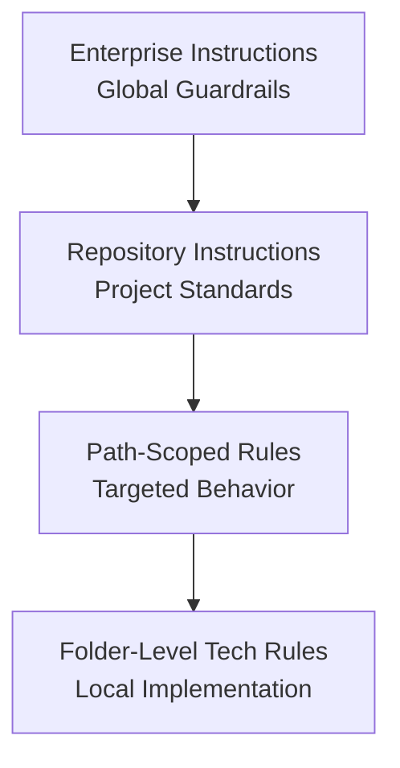
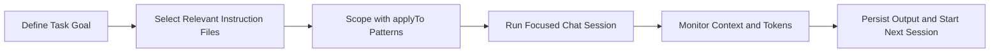

## Welcome to AI Assisted Software Development

From Code to Copilot

---

## John Michael Miller

**Principal Software Engineer at CODE**
Played roles of developer, architect, devops engineer, platform engineer, test architect, release manager
AI/ML Enthusiast and advocate for effectively using AI to write code

- LinkedIn: [www.linkedin.com/in/johnmichaelmiller](www.linkedin.com/in/johnmichaelmiller)
- Email: [john.miller@codemag.com](john.miller@codemag.com)

---

## Introductions

- Who you are
- Who do you work for
- What you do
- What you've done with AI tools
- What you want to learn

::: notes
Day One: Outline the day's goals and emphasize participation and hands-on exercises.
:::

---

## About CODE


::: notes

---

## Daily Themes

| Day     | Theme                       |
| ------- | --------------------------- |
| Monday  | AI Guardrails, Instructions |
| Tuesday | AI Guardrails, Prompts      |

---

<!-- _class: lead -->

## Course Modules

- **▶ Intro**
- Module 1 - AIASD
- Module 2 - Intro to Copilot
- Module 3 - Vibbing
- Module 4 - Adding AI Guardrails
- Module 5 - Managing Context

---

<!-- _class: lead -->

# Module 1 - AIASD

---

## Module 1 - AIASD

- WTBD - The Core Thesis
- The AI Revolution?

---

## WTBD - The Core Thesis

> "Programming hasn't changed, but how we go about it has changed, again."

- AI-assisted development is **evolutionary**, not revolutionary
- Programming has always been about **expressing human intent** to machines
- What changes is the **sophistication of our tools** for expressing intent
- The essence remains: bridging the gap between what we want and what machines can do

---

## A Brief History: Machine Code & Assembly (1940s)

- **Machine Code**: Raw binary language executed directly by hardware
- **Physical Programming**:
  - Flipping panel switches
  - Plugging cables
  - Feeding punched cards into IBM readers
  - Threading perforated paper tape

**Assembly Language**: Introduced symbolic mnemonics (MOV, ADD, JMP)

- **Enabling Technology**: Assemblers that translated mnemonics into machine code
- Still mainstream today in embedded systems and OS kernels

---

## High-Level Languages (1950s-1970s)

**The Abstraction Revolution**:

- Math-like and business-oriented syntax
- **Enabling Technologies**: Compilers and interpreters

**Key Languages**:

- **FORTRAN (1957)**: Pioneered scientific programming
- **COBOL (1959)**: Mainstream in business and government
- **C (1972)**: Spread with UNIX thanks to portable compilers

**Sensory Shift**: From mechanical card punches to typewriter-style terminals

---

## Structured & Object-Oriented Programming (1970s-1980s)

**Focus**: Modularity, reuse, and abstraction

**Key Developments**:

- **Pascal (1970)**: Structured paradigms with compiler innovations
- **C++ (1985)**: Object-oriented compilers supporting inheritance and polymorphism

**Enabling Technologies**:

- Advanced compiler innovations
- Support for inheritance and polymorphism

**Era Experience**: CRT monitors with green text, floppy disks

---

## IDEs & Libraries (1990s)

**The Integration Era**:

- **IDEs**: Combined compilers, debuggers, and editors in graphical interfaces
- **Visual Studio**: Enabled by faster processors and GUI toolkits
- **Java & JVM (1995)**: "Write once, run anywhere"
- **Reusable Libraries**: Abstracted common functionality

**Enabling Technologies**:

- Faster processors, GUI toolkits, extensible plug-in architectures
- Virtual machines

**Experience**: Mouse clicks, drag-and-drop, desktop computing

---

## Web & Scripting Languages (Late 1990s-2000s)

**The Dynamic Web Era**:

- **JavaScript (1995)**: Powered by Netscape, later V8 engine (2008)
- **Python**: Web development in 2000s, data science dominance
- **Ruby on Rails (2004)**: Abstracted web complexity

**Enabling Technologies**:

- Browser engines, dynamic interpreters, frameworks
- Eclipse IDE (2001)

**Experience**: Portable coding on laptops, coffee shop programming

---

## Cloud, APIs & Low-Code Platforms (2010s)

**The Orchestration Era**:

- **Cloud Computing**: Virtualization and containerization (Docker, Kubernetes)
- **APIs**: REST and GraphQL enabled modular integration
- **Low-Code Platforms**: Mendix, OutSystems, PowerApps with visual compilers

**Transformation**: Programming shifted from hardware-bound tasks to orchestration

**Experience**: Browser dashboards, swiping, clicking, dragging

---

## The Modern Mainstream Coding Experience

**Intent Interpretation**:

- Developers express intent in higher-level languages, frameworks, and APIs
- Compilers, interpreters, and VMs translate intent into executable code
- Libraries and cloud services provide ready-made building blocks
- Less about micromanaging hardware, more about shaping logic and workflows

**The Core**: Bridging human goals with machine execution through layers of abstraction

---

## AI-Assisted Coding (Present/Future)

**The Natural Language Era**:

**Enabling Technologies**:

- Large language models trained on vast code repositories
- Contextual intent recognition
- IDE integration

**The Paradigm Shift**: Programming becomes **dialogue**

- Express goals in plain language
- AI generates code, tests, and documentation
- Example: "Create a function that validates email addresses" → Complete implementation

---

## Natural Language Coding: The Game Changer

---

## The AI Revolution?

What hasn't changed and what has.

---

## Why AI Assisted Software Development

If used effectively, it will give you superpowers

- The courage to
  - Take on codebases that few would touch
  - Use technologies you should know but don't
  - Write more high-quality code than you have ever written before
  - Take on the nice to haves

::: notes
Career Transformation: - Those who adapt: become 10x more productive, tackle bigger challenges, expand skill sets - Those who resist: may find themselves struggling with modern development expectations - New roles emerging: AI prompt engineers, AI code reviewers, AI-assisted architects

Superpowers Explained: - Legacy codebases: AI can quickly understand and explain complex, undocumented systems - New technologies: Learn frameworks/languages faster with AI as a coding partner - Code quality: AI suggests improvements, catches bugs, generates comprehensive tests - Nice to haves: Features that were "too time-consuming" become feasible

Examples to share: - Developer who used AI to modernize a 15-year-old PHP codebase in weeks instead of months - Team that adopted a new framework (React to Vue) with AI assistance in days - 80% reduction in boilerplate code writing time - Comprehensive test suites generated automatically

Key message: AI doesn't replace developers—it amplifies their capabilities
:::

---

## AI‑First & Prompt‑First

AI‑First Development
A software engineering philosophy where AI is embedded across the entire SDLC–requirements, design, implementation, testing, documentation, compliance, and maintenance.
Prompt‑First Development
A workflow pattern where prompts, instruction files, and chat modes are treated as first‑class, version‑controlled artifacts.

::: notes
AI‑First is the broad philosophy. Prompt‑First is the tactical layer that enables predictable AI behavior. You can do Prompt‑First without being AI‑First, but not the reverse.
:::

---

## What Each Optimizes For

| Focus Area    | AI‑First                  | Prompt‑First                       |
| ------------- | ------------------------- | ---------------------------------- |
| Scope         | Entire SDLC               | Interaction layer                  |
| Goal          | Lifecycle integration     | Deterministic AI behavior          |
| Optimization  | Velocity, governance      | Prompt quality, reproducibility    |
| Risk Controls | Human‑in‑loop, provenance | Versioned prompts, context control |

::: notes
This table is the heart of the comparison. AI‑First is about organizational and architectural change. Prompt‑First is about artifact discipline and predictable outputs.
:::

---

## How They Treat Artifacts

AI‑First
Requirements written with AI collaboration in mind
AI‑generated scaffolds, tests, docs
Provenance enforced across all AI outputs
Architecture assumes AI participation
Prompt‑First
Prompts and instruction files are version‑controlled
Prompts define behavioral contracts
Reusable prompt modules
Chat modes define safe, predictable interactions

::: notes
AI‑First changes what you build and how you build it. Prompt‑First changes how you communicate intent to the AI.
:::

---

## Relationship Between the Two

Prompt‑First is a subset of AI‑First.
Prompt‑First = mechanics
AI‑First = philosophy + architecture + lifecycle integration

::: notes
This is the conceptual hierarchy. Prompt‑First is necessary but not sufficient for AI‑First maturity.
:::

---

## AI First Software Development

Building software where AI is a core capability, not an add‑on
Why AI‑First

- Software requirements increasingly expressed in natural language
- AI copilots accelerate architecture, coding, testing, and documentation
- Teams shift from "writing code" to "designing intent + validating outputs"
  Core Principles
- Prompt‑First Design: Requirements, architecture, and workflows expressed as structured prompts
- AI‑Native Architecture: Modular services, clear boundaries, deterministic interfaces for AI‑generated components
- Human‑in‑the‑Loop: Review, validation, and traceability baked into every stage
- Continuous Verification: Automated tests, static analysis, and guardrails to ensure safe outputs
- Lifecycle Governance: Versioning, provenance, and risk‑based controls for AI‑generated artifacts
  Outcomes
- Faster iteration cycles
- Higher coverage of documentation and tests
- Reduced cognitive load on developers
- More resilient, adaptable systems

::: notes
This slide frames what we mean by AI‑First development. The key idea is that AI isn't an add‑on or a productivity booster—it becomes a core capability of the software lifecycle. When we design systems today, we assume AI will participate in requirements, architecture, coding, testing, and documentation.

Why AI‑First
"Teams increasingly express requirements in natural language. AI can interpret those requirements and generate scaffolding, code, tests, and documentation."
"This shifts the developer's role from writing every line of code to defining intent, constraints, and quality expectations."
"The goal isn't to replace engineering judgment—it's to amplify it."

Core Principles

Prompt‑First Design
"We start with structured prompts that capture behaviors, invariants, and interfaces. These become durable artifacts, just like design docs."

AI‑Native Architecture
"We design modules with clear boundaries so AI‑generated components remain predictable and testable. Deterministic interfaces are essential."

Human‑in‑the‑Loop
"AI accelerates creation, but humans validate correctness, safety, and alignment with business intent. Review is built into the workflow."

Continuous Verification
"Every AI‑generated artifact—code, tests, docs—runs through automated checks. Static analysis, unit tests, and guardrails catch drift early."

Lifecycle Governance
"We treat prompts, outputs, and revisions as versioned assets. Provenance and traceability matter for compliance, debugging, and long‑term maintainability."

Outcomes
"Teams iterate faster because intent moves directly into working prototypes."
"Documentation and test coverage improve because AI can generate them continuously."
"Developers spend more time on architecture and correctness, less on boilerplate."
"The result is software that's more adaptable and resilient over time."
:::

---

## Prompt‑First Software Development

Design the intent first — let AI generate the implementation
Why Prompt‑First

- Behaviors, and constraints expressed in structured natural language
- Prompts become the new "source of truth" artifacts
- Teams shift from writing functions to defining outcomes, invariants, and interfaces
  Core Practices
- Structured Prompts: Use templates for features, APIs, data models, tests, and refactors
- Instruction Files: Persistent, versioned artifacts guiding AI code generation
- Deterministic Boundaries: Clear module contracts so AI‑generated code stays predictable
- Validation Loops: Automated tests + human review ensure correctness and safety
- Prompt Versioning: Track evolution of intent just like code changes
  Benefits
- Faster iteration from idea → working software
- Higher consistency across generated components
- Reduced cognitive load on developers
- Better alignment between business intent and implementation

::: notes
"This slide introduces the core idea behind Prompt‑First development. Instead of starting with code, we start with intent. Prompts become the primary design artifact, and AI becomes the mechanism that turns intent into implementation."

Why Prompt‑First
"Modern development increasingly begins with natural‑language descriptions of behavior. Prompt‑First formalizes that by treating prompts as first‑class inputs to the software lifecycle."
"The developer's role shifts from writing code line‑by‑line to defining outcomes, constraints, invariants, and interfaces."
"This creates a tighter alignment between business intent and the resulting system."

Core Practices

Structured Prompts
"We don't rely on ad‑hoc prompting. We use templates for features, APIs, data models, tests, and refactors. This creates consistency and reduces ambiguity."

Instruction Files
"These are durable, versioned prompt artifacts that guide AI generation. They act like living design documents that the AI reads every time it produces code."

Deterministic Boundaries
"We design modules with clear contracts so AI‑generated code stays predictable. The AI can generate the internals, but the interfaces remain stable and human‑controlled."

Validation Loops
"Every AI‑generated artifact goes through automated tests and human review. The goal is to catch drift early and ensure correctness."

Prompt Versioning
"Prompts evolve just like code. Tracking changes helps with debugging, reproducibility, and compliance."

Benefits
"Teams move from idea to working software much faster because intent flows directly into generation."
"Generated components become more consistent because they're driven by structured prompts, not one‑off instructions."
"Developers spend more time on architecture and correctness, less on boilerplate."
"The end result is a system that's easier to maintain and adapt over time."
:::

---

## **Concrete Examples**

**Prompt‑First Example**

- Promptfile for generating unit tests
- Instruction file for documentation
- Chat mode for brownfield developers

**AI‑First Example**

- Requirements → AI‑generated scaffolds
- Code changes → AI‑assisted reviews
- Docs → continuously AI‑generated
- Modernization → AI‑guided refactoring plans
- Provenance → enforced everywhere

::: notes
Use these examples to help teams visualize the difference.
Prompt‑First is about interfaces; AI‑First is about the entire workflow.
:::

---

## **Shortest Summary**

- **AI‑First = philosophy + architecture + lifecycle integration**
- **Prompt‑First = structured, version‑controlled interfaces for interacting with AI**

::: notes
End with this summary to reinforce the distinction.
It's the cleanest way to remember the relationship.
:::

---

<!-- _class: lead -->

## Course Modules

- Intro
- **▶ Module 1 - AIASD**
- Module 2 - Intro to Copilot
- Module 3 - Vibbing
- Module 4 - Adding AI Guardrails
- Module 5 - Managing Context

---

<!-- _class: lead -->

# Module 2 - Intro to Copilot

---

## Module 2 - Intro to Copilot

- Repository and Tool Setup
- Hands-On with GitHub Copilot

---

## Repository and Tool Setup

Cloning course repository
GitHub authentication

---

## Lab: Clone the AI-Assisted-Software-Development Repository

Duration: 10 minutes
Prerequisites: Git, GitHub account
Objectives
Fork the AI-Assisted-Software-Development repo
Activities
Clone the git@github.com:johnmillerATcodemag-com/AI-Assisted-Software-Development.gitrepository
Switch to the brownfield branch
Success Criteria
Cloned repository exists locally

::: notes
Objective: Fork the course repos Tasks
Search GitHub for
AI-Assisted-Software-Development
Fork this repo
This will create a personal copy under your GitHub account
You can make changes without affecting the original repo
:::

---

## Exercise: Fork the AIASD-20260209-BF Repo

Duration: 20 minutes
Objectives: Explore an unfamiliar codebase
Activities
Fork this repo https://github.com/j0hnnymiller/AIASD-20260209-BF.git
Clone the forked repo
Create a GitHub PAT https://github.com/settings/tokens
Store the PAT in the GITHUB_TOKEN environment variable
Success Criteria
Repo is available locally

---

## Exercise: Fork the repos

Objective: Fork the course repos
Search GitHub for

- AI-Assisted-Software-Development
- zeus.academia.3b
  Fork the repos
- This will create a personal copy under your GitHub account
- You can make changes without affecting the original repo

---

## Hands-On with GitHub Copilot

Installation and configuration

- Installing the extension
- Setting up authentication
- Configuring settings
  Sharing configuration across an organization
- Shared configuration templates (e.g., .copilot/settings.json) can be distributed across projects to standardize behavior.
  https://www.codemag.com/Blog/AI/AIASD-install-guide

::: notes
Walk through installation, auth, and a quick coding session; encourage participants to follow along.
:::

---

## Lab: Getting Started with GitHub Copilot

Duration: Follow along
Objectives
Install and configure GitHub Copilot
Verify authentication with GitHub account
Explore the Copilot UI components
Activities
Install GitHub Copilot extension from VS Code marketplace
Sign in with your GitHub account (verify Copilot subscription)
Locate and explore:

- Chat window and chat history
- New chat button
- Quick chat feature (keyboard shortcut)
- Settings menu
- Model selection dropdown
  Check your premium token usage bar
  Create a new chat and experiment with the interface
  Success Criteria
- Copilot extension installed and authenticated
- Can open/close chat windows
- Understand difference between main chat and quick chat
- Know where to find chat history

::: notes

## **Lab 1: Getting Started with GitHub Copilot**

**Duration:** 20-30 minutes
**Prerequisites:** VS Code installed

### Objectives

- Install and configure GitHub Copilot
- Verify authentication with GitHub account
- Explore the Copilot UI components

### Activities

1. Install GitHub Copilot extension from VS Code marketplace
2. Sign in with your GitHub account (verify Copilot subscription)
3. Locate and explore:

- Chat window and chat history
- New chat button
- Quick chat feature (keyboard shortcut)
- Settings menu
- Model selection dropdown

4. Check your premium token usage bar
5. Create a new chat and experiment with the interface

### Success Criteria

- Copilot extension installed and authenticated
- Can open/close chat windows
- Understand difference between main chat and quick chat
- Know where to find chat history
  :::

---

## Prompt Specificity

Add error handling to my code

- Result: Generic response asking what type of errors, what language, what code?
  Add error handling to my JavaScript function that calls an external API. I want to handle network timeouts, 404 errors, and JSON parsing failures. Return user-friendly error messages.
- Result: Better, but still generic without seeing actual code structure
  @file:api-client.js Add comprehensive error handling to the fetchUserData function. Handle network timeouts (>5s), HTTP errors (404, 500, etc.), and JSON parsing failures. Return user-friendly error messages that match our existing error format in @file:error-types.js
- Result: Specific implementation that matches existing code patterns

---

## Lab: Understanding Context Management

Duration: Follow along
Objectives
Learn to add context using @ symbols
Understand context window limitations
Practice writing effective prompts
Activities

1. Basic Context Addition:
   Use `@workspace` to search across your codebase
   Use `@file` to reference specific files
   Use `@terminal` to include terminal output in chat
   Use `@vscode` to ask VS Code-specific questions
2. Prompt Practice:
   Write a vague prompt, observe results
   Rewrite with specific context, compare results
   Add file references to improve accuracy
3. Context Window Experiment:
   Start a long conversation in one chat
   Notice when Copilot starts "forgetting" earlier context
   Practice starting new chats for new topics
   Success Criteria
   Can use all @ context types
   Understand when to start fresh chat sessions
   Notice quality difference between vague and specific prompts

---

## Lab: Chat Management & Workflow

Duration: Follow along
Objectives

- Organize chat sessions effectively
- Use chat history for reference
- Develop efficient workflow patterns
  Activities

1. Chat Organization:

- Review your chat history
- Identify chats that should have been separate sessions
- Practice starting new chats at appropriate times

2. Context Preservation:

- Start a focused chat for one feature
- Add relevant context systematically
- Complete task without context overflow

3. Quick Chat Practice:

- Use main chat for primary task
- Use quick chat for side questions
- Return to main chat without losing context

4. Chat History Review:

- Find and reference previous solutions
- Learn from past prompts that worked well
- Identify patterns in effective conversations
  Success Criteria
- Chat history is organized and meaningful
- Can find and reference previous solutions
- Efficient workflow developed for using multiple chat windows
  Context Window Management
- Remember from the session:
  - Context is a **limited resource**
  - Start new chat when changing focus areas
  - Keep conversations targeted and specific
  - When Copilot "forgets" earlier context, it's time for a new session

---

## Using Copilot in different modes

Ask Mode

- Simple prompt completion and inline suggestions
  Edit Mode
- Automatic file edits
  Agent Mode
- Perform actions on your behalf
  Custom Modes
- Execute specific workflows

::: notes
Explain Ask vs Edit modes and when each is most useful. Speak to Agent Mode and Custom Chat Modes briefly. We'll work with those later.
:::

---

## Lab: Exploring Copilot Modes

Duration: Follow along
Objectives
Understand differences between Ask, Edit, and Agent modes
Know when to use each mode
Understand premium token implications
Activities

1. Ask Mode:
   Ask Copilot to explain a code snippet (no changes made)
   Request multiple implementation approaches
   Try different models and observe response quality
   Note: This doesn't consume premium tokens for advanced models
2. Edit Mode:
   Select code in a file
   Ask Copilot to refactor it
   Observe inline suggestions and changes
   Accept or reject proposed changes
3. Agent Mode:
   Ask Copilot to create a new file and add content
   Request changes across multiple files
   Have Copilot run terminal commands
   Check premium token usage after agent actions
   Success Criteria

---

<!-- _class: lead -->

## Course Modules

- Intro
- Module 1 - AIASD
- **▶ Module 2 - Intro to Copilot**
- Module 3 - Vibbing
- Module 4 - Adding AI Guardrails
- Module 5 - Managing Context

---

<!-- _class: lead -->

# Module 3 - Vibbing

---

## Module 3 - Vibbing

- Collaborating on a Solution
- Exercise: Calculator Project - Setup and Basic Implementation
- Exercise: Test Coverage Improvement
- Exercise: Lab 3 - Test-Driven Development (TDD) with Copilot
- AI-Assisted CI/CD Pipelines
- AI-Assisted GitHub Pull Requests
- Evergreen Software Development - Core Principles

---

## Collaborating on a Solution

Project Setup
Adding Features

- Basic Arithmetic - Addition, subtraction, multiplication, division
- Clear / Reset Function - Quickly resets the current input or entire calculation
- Decimal Support - Allows entry and computation with decimal numbers
- Sign Toggle (+/–) - Switches values between positive and negative
- Percentage Function - Converts values to percentages for quick calculations
- Memory Functions (M+, M–, MR, MC) - Store, recall, add to, or clear memory values
- Error Handling - Displays errors such as division by zero
- Simple, Intuitive Interface - Numeric keypad, operation buttons, and display screen
  Test Automation
- Code Coverage
  Dependency Management
  Comparing Implementations
  Chat Management
  Intro to Evergreen Software Development

::: notes
This slide outlines the collaborative development process we'll follow for building our calculator application — and mob programming will be central to how we work together.

Except for Project Setup and Basic Arithmetic functions, the mob controls the direction of the implementation. The other labs are optional and can be used when the mob directs the development of that feature or as suggestions should the mob struggle for direction.

We begin with Project Setup, where the team configures the environment, aligns on goals, and prepares the repo. This is done as a mob — one keyboard, one screen, and everyone contributing ideas in real time. It ensures shared understanding from the start.

At the end of the day, we introduce Evergreen Software Development — a mindset of continuous improvement.

Random ideas:
Implementing Observability

Scaffold a new C# command line project using .NET. The project should include:
A Program.cs file with a simple "Hello, World!" example.
A .csproj file configured for a console application.
A README.md with build and run instructions.
The project should be ready to build and run from the command line.
:::

---

## Exercise: Calculator Project - Setup and Basic Implementation

Duration: 45-60 minutes

Objectives

- Use AI to generate starter code for arithmetic operations
- Understand how to validate AI-generated logic
- Integrate addition, subtraction, multiplication, and division functions

Activities

1. Project Initialization:

- Prompt AI to create a new project
- Review generated project structure
- Verify build configuration

2. Implement Basic Operations:

- Prompt AI to add methods for addition, subtraction, multiplication, and division

3. Review the Code:

- Check correctness and edge cases

4. Build and Run:

- Use Copilot to help with build commands
- Troubleshoot compilation errors with Copilot
- Run the application

Success Criteria

- Working calculator with 4 basic operations
- Application compiles and runs successfully
- Generated code is critically reviewed

::: notes

## Setup and Basic Implementation Exercise Instructions

**Duration:** 45-60 minutes
**Prerequisites:** Calculator project context available

### Objectives

- Scaffold core operations with AI assistance.
- Validate generated logic before accepting changes.
- Deliver a working baseline calculator.

### Activities

- Build project skeleton, implement 4 operations, and verify behavior.
- Emphasize manual review of AI output before merge.

### Success Criteria

- Four operations work end-to-end.
- Build is green.
- Team can explain logic and edge-case handling.
  :::

---

## Exercise: Calculator Project - Clear / Reset

Duration: 15 minutes

Objectives

- Use AI to scaffold state-management logic
- Implement CE (clear entry) and C (clear all) behaviors
- Understand UI state transitions

Activities

1. Ask AI to outline the difference between CE and C
2. Generate code for clearing current input vs full state
3. Integrate logic into calculator state object
4. Test transitions with sample input sequences

Success Criteria

- CE clears only the active entry
- C resets the entire calculator state

::: notes

## Clear / Reset Exercise Instructions

**Duration:** 15 minutes
**Prerequisites:** Basic calculator state model

### Objectives

- Separate entry-level clear from full reset behavior.
- Verify expected transitions from each action.

### Activities

- Use focused prompts and test state transitions quickly.

### Success Criteria

- CE and C behaviors are consistent and explainable.
  :::

---

## Exercise: Calculator Project - Decimal Input

Duration: 12 minutes

Objectives

- Use AI to generate input-validation logic
- Prevent multiple decimal points
- Ensure decimals flow through arithmetic operations

Activities

1. Ask AI for a decimal input strategy
2. Generate code to block duplicate decimals in one number
3. Integrate decimal support into input parser
4. Test decimal operations with AI-generated test cases

Success Criteria

- Decimal input works without duplication errors
- Arithmetic with decimals is correct
- Validation logic is explainable

::: notes

## Decimal Input Exercise Instructions

**Duration:** 12 minutes
**Prerequisites:** Input parser in place

### Objectives

---

## Exercise: Test Coverage Improvement

Duration: 30-45 minutes

Objectives

- Analyze code coverage reports
- Use Copilot to intelligently add tests
- Achieve target coverage percentage
- Balance quantity vs. quality of tests

Activities

1. Review Current Coverage:

- Run tests with coverage reporting
- Identify uncovered code paths
- Analyze coverage percentage by file/class

2. Targeted Test Generation:

- Prompt: "Add tests to increase code coverage to [X]%"
- Observe how Copilot identifies gaps
- Review generated tests for quality

3. Strategic Coverage Improvement:

- Prompt: "Add tests for edge cases in division operation"
- Prompt: "Add tests for corner cases like divide by zero"
- Prompt: "Add integration tests for evaluate arithmetic method"

4. Verify Test Quality:

- Confirm tests call real implementation code
- Confirm tests verify expected behavior, not just execution
- Confirm edge cases are properly handled

5. Re-run Coverage:

- Execute test suite with coverage
- Compare before/after percentages
- Identify remaining gaps

Success Criteria

- Code coverage increased by at least 20 percentage points
- All new tests are meaningful and test actual implementation
- Tests include edge cases and error conditions
- Coverage report shows improved metrics
- Understanding of test quality vs. quantity trade-offs

::: notes

## Test Coverage Improvement Exercise Instructions

**Duration:** 30-45 minutes
**Prerequisites:** Lab 1 completed, existing test suite

### Objectives

- Analyze code coverage reports
- Use Copilot to intelligently add tests
- Achieve target coverage percentage
- Balance quantity vs. quality of tests

### Activities

1. Review current coverage metrics and identify weak areas by file/class.
2. Use Copilot prompts to generate targeted tests for uncovered code paths.
3. Improve strategically with edge-case and integration-focused prompts.
4. Validate test quality to ensure behavior is truly verified.
5. Re-run coverage and compare before/after outcomes.

### Success Criteria

- Coverage increases by at least 20 percentage points.
- New tests are meaningful and exercise actual implementation logic.
- Edge cases and error conditions are covered.
- Coverage reporting clearly shows improvement.
- Participants can explain quality vs. quantity trade-offs.

### Key Learning Point

As discovered in the session, asking Copilot to "increase coverage to 50%" can work because it can intelligently identify which code paths need testing. This can be more efficient than manually finding every gap, but quality checks are still required.

---

## Exercise: Lab 3 - Test-Driven Development (TDD) with Copilot

Duration: 45-60 minutes

Objectives

- Practice TDD workflow with AI assistance
- Write failing tests before implementation
- Use tests to drive design decisions
- Understand red-green-refactor cycle

Activities

1. Define New Feature:

- Choose a feature (for example, memory operations for calculator)
- Store current result (ANS/answer functionality)
- Recall previous result
- Handle "ANS + 5" style operations

2. Write Failing Tests First:

- Prompt: "Using TDD, create tests for a memory/answer feature in the calculator. DO NOT implement the feature yet."
- Review generated tests
- Verify tests reference methods that do not exist yet

3. Run Tests (Expect Failures):

- Execute test suite
- Observe compilation errors or test failures
- Document what is missing

4. Implement Feature to Pass Tests:

- Prompt: "Implement the memory/answer feature to make the tests pass"
- Review generated implementation
- Run tests again
- Verify all tests now pass

5. Refactor:

- With tests passing, ask for improvements
- Prompt: "Refactor the answer implementation for better readability"
- Verify tests still pass after refactoring

Success Criteria

- Tests written before implementation
- Initial test run shows failures (red phase)
- Implementation makes all tests pass (green phase)
- Code refactored while maintaining passing tests
- Understanding of TDD benefits and workflow

::: notes

## Lab 3 - Test-Driven Development (TDD) with Copilot Exercise Instructions

**Duration:** 45-60 minutes
**Prerequisites:** Understanding of TDD principles

### Objectives

- Practice TDD workflow with AI assistance
- Write failing tests before implementation
- Use tests to drive design decisions
- Understand red-green-refactor cycle

### Activities

1. Select a small feature and define expected behavior.
2. Ask Copilot for tests only, and confirm the implementation is still missing.
3. Run tests and capture failures to validate the red phase.
4. Implement the minimum code required to satisfy tests.
5. Refactor for readability and maintainability while keeping tests green.

### Success Criteria

- Tests are authored before implementation code.
- The first execution clearly fails (red).
- Feature implementation makes tests pass (green).
- Refactoring preserves passing tests.
- Participants can explain the value of TDD in AI-assisted development.

### TDD Cycle

1. **Red:** Write a failing test.
2. **Green:** Write minimal code to make it pass.
3. **Refactor:** Improve code while keeping tests green.
   :::

---

## AI-Assisted CI/CD Pipelines

GitHub Actions YAML generation
Build automation with AI
Coverage thresholds
Pipeline maintenance and evolution
Exercise: Generate a pipeline from scratch

::: notes
Introduce this module as a practical guide to using AI — specifically GitHub Copilot — to design, generate, and maintain CI/CD pipelines on GitHub Actions. Emphasize that the goal is not to automate humans out of the loop but to reduce the friction between "intent" and "working YAML". Many teams struggle to get a pipeline right on the first try; AI dramatically shortens that feedback cycle.
:::

---

## Why Pipelines Are Hard

YAML syntax is unforgiving
Action versions change constantly
Environment variables, secrets, and caching rules interact unexpectedly
Coverage gates, linting, and deployment steps differ per project
Copy-paste drift between projects accumulates silently

::: notes
Open with empathy. Most developers have lost an afternoon to a mis-indented YAML block or an unexpected breaking change in a third-party action. These are not skill failures — they are complexity failures. AI closes the gap between "I know what I want" and "here is the correct YAML to achieve it."
:::

---

## What AI Brings to CI/CD

```text
You → intent           AI → working YAML
   "run tests on PR"        on: [pull_request]
                            jobs: test: ...
```

Generate pipelines from plain English
Explain unfamiliar pipeline syntax
Diagnose failing workflow runs from logs
Suggest caching, matrix, and concurrency improvements
Keep actions pinned and up to date

::: notes
Walk through the mental model: the developer provides intent, the AI provides syntactically correct, contextually appropriate YAML. This is not magic — the AI has seen thousands of pipelines. Stress that the developer still reviews and owns every line. AI accelerates the first draft and the debugging loop, not the decision-making.
:::

---

## GitHub Actions YAML Generation

Ask Copilot in chat or inline:

```text
Prompt: "Create a GitHub Actions workflow that runs
dotnet test on every pull request targeting main,
uploads a code coverage report, and fails if
coverage drops below 80%."
```

Copilot generates:

- Trigger block (`on:`)
- Job matrix
- Step sequence
- Coverage upload + threshold enforcement

::: notes
Live demo opportunity: open a blank `.github/workflows/ci.yml` and type the prompt as a comment. Show how Copilot completes the file. Point out that the model understands dotnet CLI, the Coverlet report format, and the `codecov/codecov-action` convention. Then ask it to explain each step — students can use this to build mental models, not just cargo-cult YAML.
:::

---

## Anatomy of an AI-Generated Workflow

```yaml
name: CI

on:
  pull_request:
    branches: [main]

jobs:
  build-and-test:
    runs-on: ubuntu-latest
    steps:
      - uses: actions/checkout@v4
      - uses: actions/setup-dotnet@v4
        with:
          dotnet-version: "8.x"
      - run: dotnet restore
      - run: dotnet build --no-restore
      - run: dotnet test --no-build
          --collect:"XPlat Code Coverage"
```

::: notes
Walk through each section: triggers, runner, checkout, SDK setup, restore, build, test. Point out `actions/checkout@v4` — a pinned major version. Ask students: what happens if you omit the `--no-restore` flag on build? What if `ubuntu-latest` changes? These are exactly the questions AI can help answer in context. Normalize asking the AI "why is this step here?" as a learning technique.
:::

---

## Coverage Thresholds

Coverage gates enforce quality — AI helps configure them correctly

```yaml
- name: Test with coverage
  run: |
    dotnet test --collect:"XPlat Code Coverage" \
      -- DataCollectionRunSettings.DataCollectors \
         .DataCollector.Configuration.Threshold=80

- name: Upload coverage
  uses: codecov/codecov-action@v4
  with:
    fail_ci_if_error: true
    threshold: 80
```

Ask Copilot: _"How do I fail the build if branch coverage drops below 80%?"_

::: notes
Coverage thresholds are one of the most common sources of confusion: where does the threshold live? In the test runner config? In the upload action? In a separate tool? AI answers this correctly for the specific framework in use. Demo: ask Copilot the same question for Jest, pytest, and dotnet — show that the answer differs and the AI knows the difference. Emphasize that a threshold without enforcement is just aspirational documentation.
:::

---

## Build Automation Patterns

AI can generate: matrix builds, dependency caching, artifact upload

```yaml
strategy:
  matrix:
    os: [ubuntu-latest, windows-latest]
    dotnet: ["7.x", "8.x"]

steps:
  - uses: actions/cache@v4
    with:
      path: ~/.nuget/packages
      key: ${{ runner.os }}-nuget-
        ${{ hashFiles('**/*.csproj') }}

  - uses: actions/upload-artifact@v4
    with:
      name: test-results
      path: TestResults/
```

::: notes
Matrix builds and caching are two patterns that dramatically improve pipeline performance but are tedious to hand-write. Show how asking Copilot "add a matrix build for Windows and Ubuntu across .NET 7 and 8" produces the correct strategy block. Ask it to explain the cache key hash — students often do not realize that changing a .csproj file correctly invalidates the cache. Artifact upload is another common gap; AI fills it without needing to hunt through documentation.
:::

---

## Maintaining Pipelines with AI

Pipelines rot — actions deprecate, runners change, dependencies drift

Ask Copilot to:

- Explain a failing run from pasted log output
- Upgrade pinned action versions safely
- Refactor a 300-line workflow into reusable workflows
- Add a deployment stage to an existing CI workflow

_"This workflow is failing with exit code 128 — here is the log. What is wrong?"_

::: notes
Maintenance is where AI pays long-term dividends. Demo: paste a failing workflow log into Copilot Chat and ask what is wrong. The model can identify common error patterns — missing permissions, wrong branch reference, deprecated node version warnings. Also show the refactoring use case: large workflows become hard to read; AI can extract shared steps into reusable workflows with `workflow_call` triggers without breaking existing runs.
:::

---

## Reusable Workflows

AI generates caller and callee in one prompt

```yaml
# .github/workflows/reusable-test.yml
on:
  workflow_call:
    inputs:
      dotnet-version:
        required: true
        type: string

jobs:
  test:
    runs-on: ubuntu-latest
    steps:
      - uses: actions/checkout@v4
      - uses: actions/setup-dotnet@v4
        with:
          dotnet-version: ${{ inputs.dotnet-version }}
      - run: dotnet test
```

::: notes
Reusable workflows (`workflow_call`) are a powerful but often underused GitHub Actions feature. Teams that copy-paste CI logic across repos accumulate drift. AI can audit an existing set of workflows, identify duplicated patterns, and generate a reusable workflow plus updated callers in a single conversation. Show the prompt: "Here are our five workflow files. Extract the test steps into a reusable workflow and update each caller." This is a real time-saver in large organizations.
:::

---

## Secrets, Permissions, and Security

AI assists but YOU own security decisions

```yaml
permissions:
  contents: read
  checks: write # required for test reporters
  pull-requests: write # required for PR comments

env:
  SONAR_TOKEN: ${{ secrets.SONAR_TOKEN }}
```

Ask AI: _"What is the minimum permissions block for uploading coverage?"_
Review AI output — it cannot know your org's secret names
Never commit secrets; use `${{ secrets.NAME }}`

::: notes
Stress that AI can suggest correct permission scopes but cannot see your repository's secret store or org policies. The developer must verify secret names and confirm that the minimum-privilege principle is applied. This is a great moment to discuss GITHUB_TOKEN permissions — defaulting to read-all is a common mistake that AI will flag if prompted. The key habit: ask AI "what permissions does this step need?" rather than granting write-all and moving on.
:::

---

## From Zero to Pipeline: Live Workflow

```text
1. Describe your stack to Copilot
   "Node 20, Vitest, Playwright e2e, deploys to Azure"

2. Ask for a complete CI workflow
   → Copilot generates trigger, jobs, steps

3. Ask for coverage enforcement
   → Copilot adds threshold + upload steps

4. Ask "what caching should I add?"
   → Copilot adds node_modules cache with correct key

5. Paste a failure log and ask "why?"
   → Copilot diagnoses in seconds
```

---

## AI-Assisted GitHub Pull Requests

## Faster, Better PRs with GitHub Copilot

::: notes
Welcome to this session on using AI to improve the pull request workflow. GitHub Copilot and related AI tools can dramatically reduce the friction of creating, reviewing, and merging pull requests.

**Timing**: 1 minute for title slide

**Key Points**:

- PRs are a critical communication artifact in software development
- AI can help at every stage: drafting, describing, reviewing, and summarizing
- The goal is not to replace human judgment but to reduce toil

**Delivery**: Open by asking the audience how much time they spend writing PR descriptions or waiting for code review. Frame AI assistance as a way to reclaim that time.

**Transition**: "Let's look at where AI fits in the pull request lifecycle."
:::

---

## The Pull Request Lifecycle

```
Code Changes → PR Creation → Review → Merge
```

AI can assist at **every stage**:

| Stage               | AI Assistance                  |
| ------------------- | ------------------------------ |
| Writing code        | Copilot completions            |
| Drafting the PR     | Generated description          |
| Code review         | Inline suggestions & summaries |
| Addressing feedback | Guided fixes                   |
| Final merge         | Automated checks               |

::: notes
**Timing**: 2 minutes

**Key Points**:

1. The PR lifecycle is a feedback loop, not a one-way street
2. Most developers focus on the code-writing stage but spend significant time on communication tasks
3. AI assistance compresses the non-coding parts of the cycle

**Examples to Share**:

- A developer who writes great code but struggles with clear PR descriptions benefits from AI drafting
- A reviewer who is overwhelmed with large PRs benefits from AI summaries

**Audience Interaction**: "Which stage do you find most time-consuming or frustrating?"

**Transition**: "Let's start with where most of the AI value is—creating the PR itself."
:::

---

## AI-Generated PR Descriptions

GitHub Copilot can **draft your PR description** based on your diff:

- Summarizes **what changed** and **why**
- Suggests **testing instructions**
- Highlights **breaking changes**
- Links related **issues and tickets**

> 💡 Use `gh pr create` with Copilot in the CLI, or the **GitHub web editor** with AI suggestions

::: notes
**Timing**: 3 minutes

**Key Points**:

1. Copilot analyzes the diff and generates a structured description automatically
2. Good PR descriptions save reviewers time and reduce back-and-forth questions
3. The AI draft is a starting point—always review and personalize it

**Demo Tip**: If demoing live, show `gh pr create` in the terminal and trigger Copilot suggestions in the description field.

**Common Pitfall**: AI descriptions can be verbose. Encourage developers to trim and focus on the "why" rather than just the "what."

**Audience Interaction**: "How many of you write a detailed PR description every time? How many leave it mostly empty?"

**Transition**: "Once the PR is open, AI continues to help on the review side."
:::

---

## Writing Effective PR Prompts

Getting great AI output starts with **good context**:

```markdown
# Good PR Description Prompt Pattern

## What changed

- Brief bullet list of changes

## Why it changed

- Business context or issue reference

## How to test

- Step-by-step verification
```

Ask Copilot: _"Generate a PR description for these changes that explains the business impact"_

::: notes
**Timing**: 3 minutes

**Key Points**:

1. AI output quality is proportional to the context you provide
2. Referencing the issue number or user story helps Copilot add business context
3. Structuring the prompt mirrors the structure you want in the output

**Template to Share**:
Show the three-section template on screen. Encourage teams to add this as a PR template in `.github/pull_request_template.md` so Copilot has a consistent structure to fill.

**Pro Tip**: Commit messages also feed into the PR description. Good commit messages mean better AI-generated PRs.

**Transition**: "Let's look at how AI helps on the review side of the process."
:::

---

## AI-Powered Code Review

GitHub Copilot assists reviewers with:

- **Inline explanations** of complex code
- **Suggested improvements** with rationale
- **Security vulnerability** detection
- **Test coverage** gap identification
- **Style and convention** enforcement

> Use `@workspace` in Copilot Chat to ask questions across the entire PR diff

---

## Evergreen Software Development - Core Principles

Intent‑First Design

- Define the system's purpose, invariants, and boundaries before writing code to ensure long‑term clarity.
  Stable Interfaces, Evolving Internals
- Keep contracts predictable while allowing implementations to improve continuously.
  Continuous Regeneration with Guardrails
- Use AI to rewrite or extend components safely, backed by tests, specs, and architectural constraints.
  Modular, Replaceable Components
- Structure the system so any part can be regenerated, swapped, or upgraded without cascading breakage.
  Lifecycle Governance
- Maintain quality through automated tests, versioning discipline, and human‑in‑the‑loop validation.

---

## Why Software Fails to Be Evergreen

Intent Rot

- The original purpose, constraints, and invariants are undocumented or lost, making safe regeneration impossible.
  Unstable or Leaky Interfaces
- APIs, data contracts, and boundaries change unpredictably, causing cascading breakage when internals evolve.
  Tightly Coupled Architecture
- Components depend on each other's internal details, preventing isolated regeneration or replacement.
  Insufficient Guardrails
- Missing tests, specs, or validation layers mean AI‑assisted regeneration can't be trusted to preserve behavior.
  One‑Off Patches and Drift
- Ad‑hoc fixes accumulate, diverging the system from its intended design and making regeneration unsafe.

---

<!-- _class: lead -->

## Course Modules

- Intro
- Module 1 - AIASD
- Module 2 - Intro to Copilot
- **▶ Module 3 - Vibbing**
- Module 4 - Adding AI Guardrails
- Module 5 - Managing Context

---

<!-- _class: lead -->

# Module 4 - Adding AI Guardrails

---

## Module 4 - Adding AI Guardrails

- Adding AI Guardrails
- Instruction Files
- 🎯 Instruction File `applyTo` Patterns
- Core Instructions
- Organizational vs. Repository Instruction Files
- Exercise: Technology Inventory & Instruction Generation

---

## Adding AI Guardrails

What are instructions, prompts, and Agents
Creating instruction, prompt, and Agent files
Meta prompts that generate these files
Instructions for generating artifacts
Enforcing provenance for AI‑assisted artifacts

::: notes
Introduce this module as the foundation for safe, predictable AI‑assisted development.

Guardrails ensure that AI output is intentional, reviewable, and aligned with architectural and organizational standards.

These practices turn AI from a novelty into a disciplined engineering tool.
:::

---

## Instructions, Prompts & Agents

Definitions
Instructions – Persistent rules that guide the model's behavior
Prompts – Task‑specific requests defining intent and constraints
Agents – Pre‑configured personas optimized for workflows

::: notes
Clarify the distinctions: instructions are stable, prompts are ephemeral, and Agents define how the model behaves in a particular role.

Together, they form a layered control system that shapes AI behavior and reduces drift.
:::

---

## Creating Instruction, Prompt & Agent Files

Why create files?
Ensures repeatability
Reduces token usage
Provides version‑controlled guardrails
Enables team‑wide consistency
File types
.github/instructions/myinstructions.instructions.md
.github/copilot/Promptfiles/myprompt.prompt.md
.github/chatmodes/mychatmode.chatmode.md

::: notes
Explain that storing these artifacts as files allows teams to version them, review them, and reuse them.

This is essential for brownfield modernization, where consistency and traceability matter.
:::

---

## Meta Prompts

Meta prompts guide:
Creation of instruction files
Generation of reusable prompts
Construction of Agents
Provide consistent formatting, structure, content

::: notes
Meta prompts are prompts about prompts.

They let the AI generate structured artifacts on demand.

This reduces manual effort and ensures that all artifacts follow a consistent pattern.
:::

---

## Instructions for Generating Artifacts

Best practices
Define the artifact type
Specify required sections
Provide examples or templates
Include acceptance criteria
Require the model to restate constraints

::: notes
When asking AI to generate an artifact, be explicit about structure and constraints.

This prevents drift and ensures the output is usable without heavy editing.
:::

---

## Enforcing Provenance for AI Artifacts

Provenance requirements
Declare:

- AI involvement
- Model used
- Date generated
- Human reviewer
  Store provenance in headers, footers, or side cars
  Track revisions in version control

::: notes
Provenance is essential for conformance, auditability, and long‑term maintainability.

It ensures teams know which artifacts were AI‑generated, which were human‑generated, and which were hybrid.
:::

---

## Exercise: Copy the Core Instructions

Duration: 10 minutes
Objectives:
Understand file organization for AI-assisted output policies
Practice copying files between repositories
Ensure compliance with output metadata requirements
Activities:

1. Locate .github/instructions/ai-assisted-output.instructions.md in the AI-Assisted-Software-Development repository
2. Copy the file into the .github/instructions folder of the current repository
3. Copy these files as well:
   chatmode-file.instructions.md
   instruction-files.instructions.md
   instruction-prompt-files.instructions.md
   prompt-file.instructions.md
4. Verify the copied files matches the original
5. Review the instructions
   Success Criteria:
   The files are present in the current repo
   The content matches the source file
   No metadata or formatting is lost

::: notes
This exercise reinforces the importance of maintaining consistent AI-assisted output policies across repositories. By copying the instructions file, participants learn to manage compliance and provenance requirements for AI-generated artifacts. Ensure the copied file is identical and properly placed to support future AI work.
:::

---

## Instructions for AI Generated Artifacts

The one instruction file that rules them all

::: notes
Provenance is essential for conformance, auditability, and long‑term maintainability.

It ensures teams know which artifacts were AI‑generated, which were human‑generated, and which were hybrid.
:::

---

## AI-Assisted Output Instructions

Ensures provenance and logging for all AI-assisted outputs
Defines required metadata, logging workflow, and quality gates
Protects code quality and enables audits

::: notes
This slide introduces the purpose of the AI-Assisted Output Instructions file: to enforce traceability, quality, and compliance for all AI-generated artifacts in the repository.
:::

---

## Required Provenance Metadata

Every AI-assisted artifact must include:

- ai_generated: true
- model: provider/model@version
- operator: username
- chat_id: unique chat identifier
- prompt: exact prompt text
- started/ended: timestamps
- task_durations & total_duration
- ai_log: path to conversation log
- source: who/what created the file

---

## Instruction Files

---

## Persistent AI Behavioral Guidelines

---

## What Are Instruction Files?

Definition
Persistent configuration files that define AI behavior patterns
Applied automatically across multiple interactions
Establish consistent working standards and constraints
Key Characteristics
Scope: Repository-wide or context-specific
Persistence: Active across all relevant AI interactions
Purpose: Define "how" AI should work, not "what" to do

---

## Instruction File Structure

```markdown
---
description: Azure best practices for AI development
applyTo: "**" # File pattern scope
---

## Core Instructions

- Use Azure Tools when handling Azure requests
- Follow security best practices
- Implement proper error handling
- Generate comprehensive documentation

## Code Generation Rules

- Write tests before implementation
- Use dependency injection patterns
- Follow naming conventions
- Include proper logging
```

---

## Instruction Files: Use Cases

Perfect For:
Coding Standards → Consistent style across projects
Security Policies → Enforce security practices
Quality Gates → Define testing and review requirements
Technology Constraints → Specify approved frameworks/tools
Examples:
azure-development.instructions.md
testing-standards.instructions.md
security-requirements.instructions.md

---

## Instruction Files Best Practices

✅ Do This:
Keep instructions clear and actionable
Use file patterns (applyTo: '\*\*') for broad scope
Version control and document changes
Test instruction effectiveness regularly
❌ Avoid This:

---

## 🎯 Instruction File `applyTo` Patterns

**Understanding Glob Pattern Matching**

Controlling When Instructions Apply to Your Code

::: notes
Welcome to this presentation on instruction file applyTo patterns. This is a critical concept for managing GitHub Copilot's behavior across your codebase. By the end of this session, you'll understand how to precisely control which files your instruction files apply to using glob patterns.

**Timing**: 30 seconds for title slide
**Key Point**: This is about precision - getting Copilot to apply the right rules to the right files
**Transition**: "Let's start by understanding what the applyTo field actually does"
:::

---

## Where `appliesTo` Fits

The filtering mechanism for instruction files

`appliesTo` is a **selector** that determines _when_ an instruction file
is included in the stack.

Common selectors include:

- **repositories** -- include only for specific repos
- **languages** -- include only for certain languages
- **filePatterns** -- include only when editing certain files
- **tools** -- include only when using specific Copilot features
- **scopes** -- include only in chat, only in editor, etc.

**Speaker Notes:** `appliesTo` is not a guardrail itself. It's a routing
rule. It prevents irrelevant instructions from polluting the stack and
keeps the assistant focused.

---

## How `appliesTo` Interacts with the Stack

Filtering happens _before_ merging

1.  Copilot discovers all instruction files in scope
2.  Copilot filters them using `appliesTo`
3.  Copilot merges the remaining files into the stack

**Speaker Notes:** This means you can have many instruction files in
`.github/instructions/`, but only the ones whose `appliesTo` match the
current context will be included.

---

## 📋 What is `applyTo`?

The `applyTo` field in instruction file front matter controls **which files** the instructions apply to.

```yaml
---
applyTo: "**/*.md" # Applies to all Markdown files
---
```

**Why It Matters:**

- ✅ Apply architecture patterns only to code files
- ✅ Apply documentation standards only to docs
- ✅ Avoid conflicting instructions
- ✅ Improve Copilot performance by reducing context

::: notes
The applyTo field is part of the YAML front matter in instruction files. It uses glob patterns to match file paths. When you open a file in VS Code, Copilot checks all instruction files and loads only those whose applyTo pattern matches the current file.

**Why this matters**: Without proper applyTo patterns, you might have documentation standards trying to apply to code files, or architecture patterns trying to apply to configuration files. This creates confusion and can lead to poor AI suggestions.

**Example to share**: "Imagine having CQRS architecture instructions applying to your README files - that would be nonsensical. The applyTo field prevents this."

**Timing**: 1-1.5 minutes
**Transition**: "Now let's look at the most common pattern types you'll use"
:::

---

## 🌐 Universal Application

Apply instructions to **all files** in the repository:

```yaml
applyTo: "**"        # All files
applyTo: "**/*"      # All files (explicit)
```

**Use Cases:**

- AI-assisted output policies
- General code quality standards
- Repository-wide conventions
- Copilot behavior guidelines

**⚠️ Caution:** Use sparingly - can create conflicts with more specific instructions

::: notes
The double asterisk wildcard is the universal matcher. Use this for repository-wide policies that should apply everywhere - things like your AI-assisted output instructions, general quality standards, or compliance requirements.

---

## Core Instructions

| Instruction File                   | Purpose                                   |
| ---------------------------------- | ----------------------------------------- |
| ai-assisted-output.instructions.md | Guidance for AI generated artifacts       |
| chatmode-file.instructions.md      | Guidance for generating chat modes        |
| instruction-files.instructions.md  | Guidance for generating instruction files |
| prompt-file.instructions.md        | Guidance for generating prompt files      |

---

<!-- _class: lead -->

## Organizational vs. Repository Instruction Files

- Business/Enterprise tier capabilities
- Path-scoped instruction files
- Folder-level technology-specific rules

::: notes
Frame this as a layering strategy, not an either-or choice. The audience should leave with a practical model for deciding what belongs at enterprise scope versus repository scope. Keep this opening to about 60-90 seconds.
:::

---

## Why Two Instruction Layers Exist

- Enterprise instructions enforce baseline policy and governance
- Repository instructions optimize for project context and implementation detail
- Together they balance consistency and local autonomy

### Key Idea

Define global guardrails once, then narrow behavior where code lives.

::: notes
Explain that teams usually fail by over-centralizing or over-fragmenting. Centralize non-negotiables, decentralize implementation guidance. Emphasize this prevents policy drift while keeping day-to-day delivery fast.
:::

---

## Business/Enterprise Tier Capabilities

- Organization-wide safety and compliance standards
- Approved model and tool usage policy
- Mandatory provenance and audit requirements
- Security and legal baselines (secret handling, license constraints)
- Shared quality gates for CI/CD

### Typical Scope

All repositories, all teams, all environments.

::: notes
Call out that enterprise-tier files should be stable and short. They should define constraints, not feature behavior. Give examples: required metadata fields, approved hosts, restricted operations, and mandatory security checks.
:::

---

## Path-Scoped Instruction Files

Path-scoped instructions apply behavior only where it is needed.

```yaml
applyTo: "Slides/individual-slides/**"
```

```yaml
applyTo: "**/*.{cs,ts,js,py,java,go,rb}"
```

```yaml
applyTo: "**/*.instructions.md"
```

### Benefit

Granular control without forcing unrelated files to follow irrelevant rules.

::: notes
Explain that path scoping is the precision tool. Show that slide-authoring rules should not apply to backend code, and coding constraints should not apply to markdown content. Mention that good glob design reduces noisy or conflicting behavior.
:::

---

## Folder-Level Technology-Specific Rules

Use folder-level rules to match local stack and workflow.

- `Slides/` for Marp formatting and speaker-note conventions
- `Labs/lab1-3-python/` for Python lint/test guidance
- `Labs/lab1-3-typescript/` for TypeScript build/test patterns
- `Course/course.github/` for docs automation and publishing rules

### Pattern

Place rules near code ownership boundaries.

::: notes
Reinforce proximity: put guidance where teams actually work. This improves discoverability and lowers onboarding time. Mention that folder-level rules should refine enterprise policy, not duplicate it.
:::

---

## Layering Model and Precedence



### Resolution Rule

Prefer the most specific matching instruction when guidance overlaps.

::: notes
Walk the stack top-to-bottom. Describe how specificity should increase as scope narrows. If conflicts appear, resolve by specificity first, then by explicit policy precedence defined by your organization.
:::

---

## Exercise: Technology Inventory & Instruction Generation

Duration: 25-30 minutes

Objectives

- Create a clear inventory of project technologies across the repository
- Use background sessions to run concurrent analysis and drafting work
- Generate multiple instruction files simultaneously from the inventory results
- Practice session management interface workflows for parallel task control

Activities

1. Technology Inventory Build:

- Scan the repository and list languages, frameworks, build tools, and test stacks
- Group technologies by folder ownership and lifecycle criticality
- Identify missing or outdated instruction coverage per technology area

2. Background Session Orchestration:

- Start parallel background sessions for discovery, drafting, and validation
- Assign one focused outcome per session (inventory, file generation, review)
- Capture each session's outputs and merge findings into one working backlog

3. Simultaneous Instruction Generation:

- Generate multiple instruction files for high-priority technology folders
- Apply path-scoped patterns to each generated instruction file
- Validate that each file is targeted, non-overlapping, and implementation-ready

4. Session Management Interface Review:

- Track session state, ownership, and completion status
- Resolve collisions between concurrently generated instruction outputs
- Close sessions with a summarized decision log and next-step actions

Success Criteria

- Technology inventory includes stack, location, and risk/priority attributes
- At least three instruction files are generated concurrently and scoped correctly
- Background sessions are documented with clear responsibilities and outcomes
- Session management process is repeatable for future multi-stream work

::: notes

## Technology Inventory & Instruction Generation Exercise Instructions

**Duration:** 25-30 minutes
**Prerequisites:** Access to repository tree, instruction conventions, and team roles for parallel work

### Objectives

- Build a practical technology inventory that informs instruction planning.
- Execute concurrent work safely with background sessions.
- Produce multiple scoped instruction files in one coordinated workflow.
- Use the session management interface to maintain control and traceability.

### Activities

1. Build a structured inventory first; avoid writing instruction files until the landscape is clear.
2. Split participants into concurrent roles: inventory lead, instruction generator, and session coordinator.
3. Generate scoped instruction files in parallel, then run a conflict review before acceptance.
4. Finalize with a short session-management retrospective: what scaled, what collided, what to improve.

### Success Criteria

- Inventory coverage is complete enough to drive instruction priorities.
- Parallel sessions finish with non-conflicting outputs.
- Generated instruction files include clear scoping and ownership boundaries.
- Team can reproduce the same workflow on another repository without redesigning the process.

### Facilitation Tip

Use a visible board (status: active, blocked, complete) for each session stream so the team can rebalance quickly when one stream stalls.
:::

---

<!-- _class: lead -->

## Course Modules

- Intro
- Module 1 - AIASD
- Module 2 - Intro to Copilot
- Module 3 - Vibbing
- **▶ Module 4 - Adding AI Guardrails**
- Module 5 - Managing Context

---

<!-- _class: lead -->

# Module 5 - Managing Context

---

## Module 5 - Managing Context

- Managing GitHub Copilot Effectively
- Managing Instruction Files & Context Windows

---

## Managing GitHub Copilot Effectively

Copilot is powerful, but not entirely autonomous
Effective use requires structure, guardrails, and clear intent
Treat Copilot as a developer whose output improves with guidance
Your process determines the quality of its contributions

::: notes
This slide frames Copilot as a tool that amplifies engineering discipline rather than replacing it.

The message is: Copilot is not magic.

It's a reasoning engine that responds to structure, clarity, and context.

When managed well, it becomes a force multiplier.

When unmanaged, it becomes unpredictable.
:::

---

## A Managed Junior Developer

Copilot is fast, eager, and sometimes confidently wrong
Provide clear instructions, constraints, and examples
Review everything – trust its speed, not its judgment
Use iterative loops: instruct → generate → review → refine
Give Copilot ownership of tasks, not architecture

::: notes
This analogy resonates with engineering teams.

Copilot behaves like a junior developer: capable, but lacking context and judgment.

It thrives when you give it structure and feedback.

It struggles when you ask it to "just figure it out."

The more intentional your guidance, the more reliable its output becomes.
:::

---

## Understanding Context & Tokens

Copilot can only "see" a limited amount of text at once
Large files, long conversations, or complex repos can exceed context
Important details may fall out of the window without you realizing
Use these techniques to keep context focused:

- Summaries
- Instruction files
- Modular prompts
- Smaller working sets

::: notes
Context windows are invisible but critical.

When Copilot misses requirements or contradicts earlier decisions, it's often because the relevant information fell outside its context window.

The solution is not to "prompt harder" – it's to structure the environment so the model always has the right information in view.
:::

---

## Prompt Engineering Best Practices

Be explicit about goals, constraints, and success criteria
Provide examples of the desired pattern or style
Break large tasks into smaller, testable steps
Use instruction files for stable rules and architectural boundaries
Ask Copilot to explain its reasoning when correctness matters

::: notes
Prompting is not about clever phrasing – it's about clarity.

Copilot performs best when you define intent, boundaries, and examples.

Instruction files are especially powerful because they give Copilot a persistent "north star" for your codebase.

---

<!-- _class: lead -->

## Managing Instruction Files & Context Windows

- Instruction sharing strategies
- Instruction file scope and application
- Context window monitoring tools
- Token consumption tracking

::: notes
Set expectations for a practical session focused on repeatable team workflows. Emphasize that instruction quality and context discipline are the two biggest multipliers for reliable AI-assisted development.
:::

---

## Instruction Sharing Strategies

- Establish a central baseline in organization-level instructions
- Keep repository-level instructions close to implementation details
- Use reusable templates for recurring instruction patterns
- Share proven prompts and instruction snippets through version control

### Team Pattern

Centralize policy, decentralize implementation guidance.

::: notes
Explain that teams should avoid copy-paste drift by maintaining canonical files and linking to them. Encourage pull-request reviews specifically for instruction changes, not just code changes.
:::

---

## Instruction File Scope and Application

Use scope to target behavior precisely with `applyTo` patterns.

```yaml
applyTo: "**/*"
```

```yaml
applyTo: "Slides/individual-slides/**"
```

```yaml
applyTo: "**/*.{cs,ts,js,py,java,go,rb}"
```

### Rule of Thumb

The narrower the scope, the lower the risk of unintended instruction collisions.

::: notes
Walk through broad-to-narrow scoping. Clarify that broad scopes are for policy and compliance, while narrow scopes are for stack-specific implementation rules.
:::

---

## Context Window Monitoring Tools

- Use chat/session history panels to detect topic drift
- Track context attachments (`@workspace`, `@file`, `@terminal`) intentionally
- Start fresh chats when switching goals or bounded contexts
- Use lightweight check-ins: "What context are we currently using?"

### Signals of Context Saturation

- Repeated clarifying questions
- Loss of earlier constraints
- Increasingly generic responses

::: notes
Teach participants to recognize degradation early rather than trying to salvage overloaded context. A clean new chat is usually cheaper than continued correction loops.
:::

---

## Token Consumption Tracking

- Monitor token usage indicators in the chat interface
- Prefer concise prompts with explicit file targets
- Split large tasks into smaller, well-bounded sessions
- Archive outcomes in files instead of keeping all context in-chat

### Cost-Control Tactics

- Reduce redundant restatement
- Reuse instruction files over repeated long prompts
- Move stable constraints into persistent instruction artifacts

::: notes
Stress that token efficiency is not only cost control; it improves response quality by reducing noise. Show that structured prompts plus instruction files usually outperform long conversational buildup.
:::

---

## Workflow Blueprint



### Outcome

Predictable outputs, lower token waste, and better team-level reuse.
