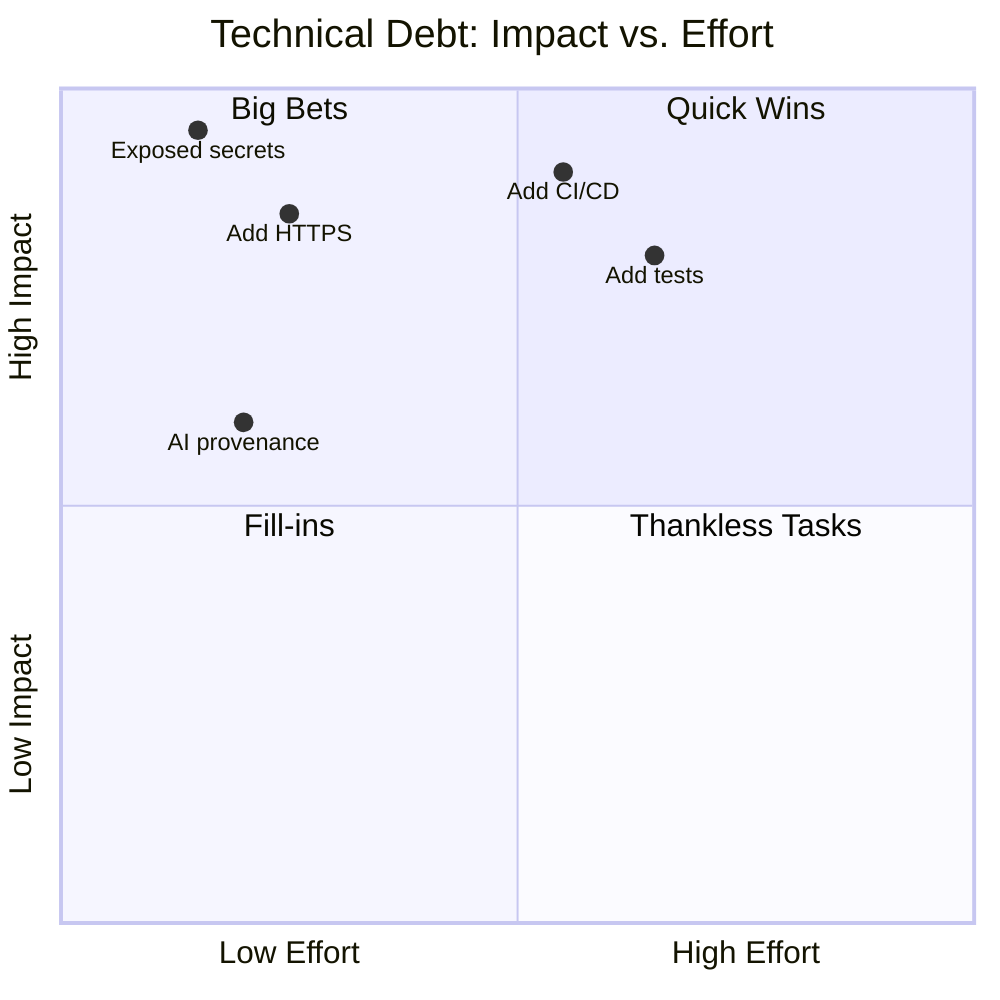
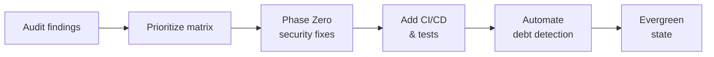

## Welcome Back to AI-Assisted Software Development

- Ready to continue where we left off
- Today's session builds on what we've covered
- We're all in this together — participation welcome
- **Questions are always welcome — ask anytime!**

::: notes
Welcome everyone back to the session. Take a moment to let people settle in before diving into content. Acknowledge that it's great to see everyone back and express enthusiasm for the session ahead.

Key talking points:

- Remind attendees of the previous session's topics briefly
- Emphasize that questions are encouraged at any point — not just at the end
- Set a positive, inclusive tone for the session
- If this is after a break, give people 30 seconds to get re-focused

Timing: Spend about 1-2 minutes on this slide before moving on.
Transition: "Let's pick up right where we left off..."
:::

---

<!-- _class: lead -->

## Course Modules

- Intro
- **▶ AI Practitioner Resources Overview**
- Brownfield Software Development
- AI Implementation Workflow
- Building a Backlog
- Addressing Technical Debt
- Multi-Implementation Comparison

---

<!-- _class: lead -->

# AI Practitioner Resources Overview

---

## AI Practitioner Resources Overview

- AI Practitioner Resources

---

## AI Practitioner Resources

AI Practitioner Resources
  - https://ai-resources.codemag.com
Prompt review
Implementing Slices
Wrap up

---

<!-- _class: lead -->

## Course Modules

- Intro
- AI Practitioner Resources Overview
- **▶ Brownfield Software Development**
- AI Implementation Workflow
- Building a Backlog
- Addressing Technical Debt
- Multi-Implementation Comparison

---

<!-- _class: lead -->

# Brownfield Software Development

---

## Brownfield Software Development

- Safe Brownfield Coding

---

## Safe Brownfield Coding

Using feature flags to minimize risk
As-Is and To-Be test suites
Testing in production
Retiring feature flags
Exercise: Implementing a feature flag

::: notes
Introduce this module as a practical guide to modifying brownfield systems safely. Emphasize that the goal is not speed — it's controlled, observable, reversible change. Feature flags, test suites, and production-safe practices form the backbone of safe modernization.
:::

---

## Using Feature Flags

Why feature flags matter
Enable incremental rollout
Allow instant rollback
Reduce blast radius
Support A/B testing and shadow traffic
Decouple deployment from release
Best practices
Keep flags short-lived
Name flags clearly
Document intent and retirement criteria

::: notes
Feature flags are one of the most powerful tools for brownfield modernization. They allow teams to introduce changes gradually, observe behavior, and roll back instantly if needed. Stress that flags must be managed intentionally to avoid long-term complexity.
:::

---

## Retiring Feature Flags

Why retirement matters
Prevents flag bloat
Reduces cognitive load
Simplifies code paths
Ensures long-term maintainability
Retirement workflow
Validate stability
Remove old code paths
Update documentation
Add provenance to the change

::: notes
Feature flags are temporary scaffolding. If not retired, they become technical debt. Encourage teams to treat flag retirement as a first-class engineering task.
:::

---

## As-Is and To-Be Test Suites

As-Is tests
Capture current behavior
Protect against regressions
Document legacy expectations
To-Be tests
Define desired future behavior
Guide modernization
Validate new patterns and architecture

::: notes
Explain that As-Is tests freeze the current system's behavior, while To-Be tests define the target state. This dual-suite approach allows teams to modernize safely without losing critical legacy behavior.
:::

---

## Testing in Production

Safe production testing techniques
Feature-flag-controlled exposure
Shadow traffic
Canary releases
Observability dashboards
Error-budget-based rollout
Benefits
Real-world validation
Early detection of edge cases
Reduced risk of full-scale failures

::: notes
Testing in production is not reckless when done correctly. With feature flags, observability, and controlled exposure, teams can validate changes under real conditions while minimizing risk.
:::

---

## Exercise: Implementing a Feature Flag

Duration
20 minutes
Objectives
Learn how to introduce a safe, reversible change
Practice designing a feature flag workflow
Understand As-Is and To-Be test implications
Document rollout and retirement criteria
Activities
Select a small brownfield function or module.
Identify a safe, incremental change to introduce.
Design a feature flag with:

- Name
- Description
- Rollout plan
- Rollback plan
- Retirement criteria
  Write As-Is and To-Be test cases.
  Document the change with provenance metadata.
  Success Criteria
  Feature flag is clearly defined and scoped
  Rollout and rollback plans are explicit
  As-Is and To-Be tests are correct and meaningful
  Retirement criteria are documented

::: notes
Encourage participants to choose a real module from their brownfield system. The goal is to practice safe, reversible change — not to implement a large feature. Reinforce that feature flags are scaffolding, not permanent architecture.
:::

---

## Essential Safety Measures

AI accelerates development, but it also accelerates mistakes
Strong safety nets must be in place before introducing AI into a brownfield codebase
These practices reduce risk, increase confidence, and protect production systems

::: notes
This slide sets the stage: AI doesn't replace engineering discipline — it amplifies it.

Before we let AI touch a brownfield system, we need guardrails.

These safety measures aren't optional; they're what make AI-assisted development sustainable and safe.

Think of them as the foundation that keeps modernization from turning into accidental rewrites or regressions.
:::

---

## Backup & Rollback Strategies

Use branching strategies that isolate AI-generated changes
Commit early and often to create natural rollback points
Archive snapshots of critical modules before modernization
Ensure you can revert any AI-assisted change without drama
Use feature flags to separate release from deployment

::: notes
AI can produce large changes quickly.

That's powerful — and dangerous without rollback.

Branches, frequent commits, and archives give you a safety net.

The goal is simple: no AI-generated change should ever put you in a position where you can't easily go back.

Rollback confidence is what enables experimentation
:::

---

## Confidence Frameworks

Strong tests are the backbone of safe AI-assisted refactoring
Unit, integration, and behavioral tests validate AI output
Coverage matters less than signal quality
Tests should detect regressions, not just assert happy paths
If all of the test automation passes, how confident are you to deploy to production?

::: notes
AI can help generate tests, but you need a baseline first.

Without a reliable test suite, you're flying blind.

The goal isn't 100% coverage — it's meaningful coverage.

Tests should give you confidence that AI-generated changes behave the same as before unless intentionally modified.

This is what makes modernization safe instead of risky
:::

---

## Change Review Processes

Treat AI as a junior developer: everything gets reviewed
Use human-in-the-loop validation for correctness and intent
Require architectural review for structural changes
Enforce standards through linters, static analysis, and policy checks
Leverage AI to reduce the review burden

::: notes
AI is fast, but it's not authoritative.

Every change needs review — not because AI is untrustworthy, but because context matters.

Humans validate intent, architecture, and alignment with business rules.

Automated checks enforce consistency.

Together, they create a multi-layered review process that keeps quality high.
:::

---

## Incremental Change Methodology

Break modernization into small, safe, reversible steps
Avoid “big bang” refactors – they're brittle and risky
Use iterative loops: propose → validate → refine → commit
Let AI assist with each step rather than entire subsystems at once
Working Effectively with Legacy Code | Hacker News Books

::: notes
Incrementalism is the antidote to brownfield fear.

AI makes it tempting to modernize huge sections at once, but that's where risk spikes.

Instead, treat modernization as a series of controlled, reversible steps.

Each step builds confidence.

Each step is testable.

Each step is safe.

This is how evergreen systems emerge.
:::

---

## Keeping Change Sets Small

Small diffs are easier to review and validate
Small changes reduce merge conflicts and regression risk
AI should be instructed to limit scope intentionally
Small changes accumulate into large improvements over time
Beware: AI can produce huge amounts of code quickly

::: notes
AI tends to produce large outputs unless constrained.

Your job is to keep the scope tight.

Small change sets are easier to understand, easier to test, and easier to roll back.

They also reduce cognitive load for reviewers.

This is how you maintain control while still benefiting from AI's speed
:::

---

## Respecting Brownfield Code

Brownfield systems are valuable – they run the business
Avoid assumptions that “old” means “wrong”
Understand the constraints that shaped the existing design
Modernize with empathy, not aggression

::: notes
Respect is a core principle.

Brownfield systems have survived real-world conditions.

They contain institutional knowledge and business logic that may not be documented anywhere else.

AI can help modernize them, but only if we approach them with humility.

The goal is not to erase the past – it's to evolve it safely.
:::

---

## Building Safety Nets

Protecting brownfield codebases
Leveraging AI code reviews
Effective human code reviews
The role of test automation
Exercise: Building safety nets in practice

::: notes
Introduce this module as the backbone of safe AI-assisted development. Safety nets ensure that modernization efforts do not destabilize working systems. Emphasize that brownfield systems deserve respect, and safety nets are how we honor that reality.
:::

---

## Protecting Brownfield Codebases

Key Practices
Preserve existing behavior unless intentionally changed
Avoid large, risky refactors
Use incremental modernization
Maintain architectural boundaries
Document every AI-assisted change
Why it matters
Brownfield systems run the business
Stability is more important than novelty
Safety nets reduce fear and increase confidence

::: notes
Reinforce that brownfield systems are valuable assets, not liabilities. Protection means minimizing risk, maintaining continuity, and ensuring that modernization is deliberate rather than accidental.
:::

---

## Leveraging AI Code Reviews

AI can assist by:
Highlighting risky changes
Detecting missing tests
Identifying architectural violations
Suggesting safer alternatives
Surfacing potential regressions
Benefits
Faster feedback loops
More consistent review quality
Early detection of drift

::: notes
AI code reviews are not replacements for human reviews — they are accelerators. They help catch issues early and provide a second set of eyes that never gets tired.
:::

---

## Effective Human Code Reviews

Human reviewers focus on:
Intent and correctness
Architectural alignment
Business logic validation
Risk assessment
Ensuring changes are incremental and reversible
Best practices
Review small change sets
Ask for context when missing
Validate AI-generated code with skepticism and curiosity

::: notes
Humans bring judgment, domain knowledge, and intuition — things AI cannot replicate. The combination of AI and human review creates a multi-layered safety net.
:::

---

## The Role of Test Automation

Test automation provides:
Behavioral guarantees
Regression detection
Confidence for modernization
Guardrails for AI-assisted refactoring
Types of tests
Unit tests
Integration tests
End-to-end tests
Snapshot and contract tests

::: notes
Test automation is the ultimate safety net. Without tests, AI-assisted development becomes guesswork. With tests, it becomes a controlled, predictable process.
:::

---

## Exercise: Building the Safety Nets

Duration
20 minutes
Objectives
Identify missing safety nets in a brownfield system
Strengthen protection using AI and human review practices
Apply test automation principles
Produce actionable improvements
Activities
Select a brownfield module or file.
Identify existing safety nets (tests, reviews, documentation).
Ask AI to identify missing or weak safety nets.
Strengthen the safety nets by:

- Adding or updating tests
- Drafting review checklists
- Documenting architectural constraints
  Share findings with a partner for validation.
  Success Criteria
  Missing safety nets are clearly identified
  Proposed improvements are safe and incremental
  Test coverage or clarity is improved
  Review and documentation guardrails are strengthened

::: notes
Encourage participants to treat this as a real modernization planning session. The goal is not to fix everything — it's to identify gaps and build a roadmap for safer development.
:::

---

<!-- _class: lead -->

## Course Modules

- Intro
- AI Practitioner Resources Overview
- Brownfield Software Development
- **▶ AI Implementation Workflow**
- Building a Backlog
- Addressing Technical Debt
- Multi-Implementation Comparison

---

<!-- _class: lead -->

# AI Implementation Workflow

---

<!-- _class: lead -->

## Course Modules

- Intro
- AI Practitioner Resources Overview
- Brownfield Software Development
- AI Implementation Workflow
- **▶ Building a Backlog**
- Addressing Technical Debt
- Multi-Implementation Comparison

---

<!-- _class: lead -->

# Building a Backlog

---

## Building a Backlog

- Conformance & Gap Analysis
- Building a Backlog
- Finding the Gaps: Common Security Findings

---

## Conformance & Gap Analysis

Comparing implementations against instruction files
Automated issue generation from conformance gaps
Prioritizing technical debt remediation
Creating actionable remediation plans
Exercises for hands-on practice

::: notes
Introduce this module as the bridge between architectural intent and real code. Conformance analysis ensures that AI-assisted and human-written code stays aligned with the rules defined in instruction files. This is how teams maintain evergreen quality in brownfield systems.
:::

---

## Comparing Implementations Against Instruction Files

What to compare
Coding standards
Architectural boundaries
Allowed/disallowed patterns
Domain rules
Documentation and provenance requirements
Why it matters
Prevents drift
Ensures consistency
Enables safe modernization

::: notes
Instruction files define the “north star” for your codebase. Conformance checks ensure that every change — AI-generated or human — aligns with those rules. This is essential for maintaining predictability in brownfield systems.
:::

---

## Automated Issue Generation From Conformance Gaps

AI can generate:
Issue titles
Detailed descriptions
Violated rules
Suggested fixes
Acceptance criteria
Provenance metadata
Benefits
Faster backlog creation
Consistent issue structure
Reduced manual review effort

::: notes
Automation accelerates the conformance workflow. Instead of manually writing issues, AI can draft them instantly, leaving humans to validate and prioritize.
:::

---

## Prioritizing Technical Debt Remediation

Prioritization factors
Risk to stability
Frequency of use
Security implications
Architectural importance
Effort vs. impact
Approaches
Impact/effort matrix
Risk scoring
Dependency analysis

::: notes
Not all technical debt is equal. Prioritization ensures that teams focus on the highest-value remediation work first, rather than chasing low-impact issues.
:::

---

## Creating Actionable Remediation Plans

A strong remediation plan includes:
Clear problem definition
Root cause analysis
Proposed solution
Step-by-step implementation plan
Rollback strategy
Test updates
Provenance metadata

::: notes
Remediation plans turn issues into action. They provide clarity, reduce risk, and ensure that modernization work is incremental and reversible.
:::

---

## Exercise: Generate Issues to Make the Codebase Evergreen

Duration
15 minutes
Objectives
Identify conformance gaps
Convert gaps into actionable issues
Apply consistent structure and provenance
Prioritize issues based on risk and impact
Activities
Select a brownfield module or file.
Compare it against the project's instruction file.
Ask AI to identify conformance gaps.
Convert each gap into a GitHub issue with:
  - Title
  - Description
  - Violated rule
  - Suggested remediation
  - Acceptance criteria
  - Provenance metadata
Prioritize the issues.
Success Criteria
Issues are clear, actionable, and aligned with instruction files
Provenance metadata is included
Prioritization reflects real risk and effort
Backlog is ready for team review

::: notes
Encourage participants to treat this as a real backlog-building session. The goal is clarity and actionability, not volume.
:::

---

## Exercise: Create an Implementation Plan

Duration
20 minutes
Objectives
Translate issues into a structured remediation plan
Ensure changes are incremental and reversible
Align modernization with evergreen principles
Incorporate testing and rollback strategies
Activities
Select 2–3 issues from the previous exercise.
For each issue, create a remediation plan including:
  - Problem definition
  - Root cause
  - Proposed solution
  - Step-by-step implementation
  - Rollback plan
  - Required test updates
  - Documentation updates
  - Provenance metadata
Review plans with a partner.
Success Criteria
Plans are incremental, safe, and reversible
Include clear steps and rollback strategies
Align with evergreen development principles
Include test and documentation updates
Provenance metadata is present

::: notes
This exercise helps participants move from analysis to execution. The goal is to build modernization plans that are safe, thoughtful, and aligned with evergreen principles.
:::

---

## Building a Backlog

Identifying technical debt
Automating the creation of GitHub issues
Exercise: Building the backlog

::: notes
Introduce this module as the bridge between analysis and action. Once AI identifies risks, gaps, and modernization opportunities, teams need a structured backlog to manage the work. Emphasize that backlog creation is not just administrative — it is a core governance mechanism for safe AI-assisted modernization.
:::

---

## Identifying Technical Debt

AI can surface:
Outdated patterns
High-complexity functions
Duplicate logic
Missing tests
Security vulnerabilities
Architectural drift
Benefits
Faster discovery
More consistent classification
Prioritized modernization roadmap

::: notes
Explain that AI excels at scanning large brownfield systems and surfacing hotspots. This reduces the manual effort required to understand legacy code and helps teams focus on the highest-impact areas first.
:::

---

## Automating the Creation of GitHub Issues

AI can help generate:
Issue titles
Detailed descriptions
Acceptance criteria
Labels and metadata
Suggested remediation steps
Why automate?
Ensures consistency
Reduces manual backlog grooming
Produces actionable, high-signal issues
Accelerates modernization planning

::: notes
Highlight that automation doesn't replace human judgment — it accelerates it. Humans still validate, refine, and prioritize issues, but AI handles the heavy lifting of drafting them.
:::

---

## Exercise: Building the Backlog

Duration
20 minutes
Objectives
Practice identifying technical debt
Convert findings into actionable GitHub issues
Apply consistent structure
Prioritize issues based on risk and impact
Activities
Select a brownfield module or file.
Use AI to identify:
  - Technical debt
  - Risks
  - Test confidence
  - Architectural issues
Convert each finding into a GitHub issue with:
  - Title
  - Description
  - Acceptance criteria
  - Labels
Prioritize the issues using impact vs. effort.
Success Criteria
Issues are clear, actionable, and well-structured
Prioritization reflects real risk and effort
Backlog is ready for implementation

::: notes
Encourage participants to treat this as a real backlog-building session. The goal is not volume — it's clarity and actionability. Reinforce that a well-structured backlog is the foundation for safe, incremental modernization.
:::

---

## Finding the Gaps: Common Security Findings

When AI audits a brownfield codebase, these issues surface first:

- 🔑 **Exposed secrets** — credentials or tokens committed to source control
- 🔒 **Missing HTTPS** — data in transit unencrypted
- 📋 **No test coverage** — changes cannot be validated safely
- 🚫 **No CI/CD pipeline** — deployment is manual and inconsistent
- 📝 **Missing AI provenance metadata** — AI-generated changes are untracked

::: notes
Open with the reality that most brownfield codebases have a mixture of these issues lurking beneath the surface, and they are often invisible until something breaks. The key insight is that these are not surprising findings — they are predictable. AI can surface them quickly through a structured audit, and once visible they can be prioritized and addressed systematically. Spend about 45 seconds here and emphasize that naming the problems is the first step toward fixing them safely.
:::

---

## AI-Assisted Prioritization: Impact vs. Effort

Ask AI to analyze your backlog and position each item on an impact/effort matrix:

::: notes
Explain that the impact/effort matrix is a practical tool for turning a long debt backlog into an ordered action plan. When you ask AI to populate this matrix it needs context about your system, team size, and risk appetite, so the quality of the prompt matters. The quadrant model helps teams stop arguing about priority and start acting on clear categories. Spend about one minute here and make the point that the visual format is also useful for communicating debt status to non-technical stakeholders like managers or product owners.
:::

---

## Making Technical Debt Visible

Visibility is the first step toward resolution:

- Ask AI to generate a prioritized issue list from the audit findings
- Represent priorities as GitHub Issues with labels (`P0`, `P1`, `P2`)
- Use Mermaid diagrams to visualize dependencies and sequencing
- Update issue descriptions with AI-proposed implementation steps
- Share the dashboard with the full team — debt is a shared problem

**Outcome**: debt moves from implicit knowledge to tracked, actionable work

::: notes
Make the point that hidden debt is far more dangerous than visible debt. When the team can see what exists, estimate effort, and assign priorities, the problem feels solvable rather than overwhelming. AI accelerates this process dramatically because it can scan large codebases, generate issue descriptions, propose remediation steps, and even draft acceptance criteria in minutes. Spend about 45 seconds here and encourage teams to treat the resulting GitHub issue list as a living document that improves with each sprint.
:::

---

## Phase Zero: Security with Infinite ROI

Tackle the highest-impact, lowest-effort security items first:

| Item                         | Effort   | Risk Reduced |
| ---------------------------- | -------- | ------------ |
| Rotate exposed secrets       | Very Low | Critical     |
| Enforce HTTPS                | Low      | High         |
| Add secret scanning CI check | Low      | High         |
| Add AI provenance headers    | Very Low | Medium       |

**The "infinite ROI" principle**

> A security breach you prevent costs nothing to fix.
> A breach you miss can cost everything.

::: notes
Introduce "Phase Zero" as a deliberate pre-sprint focused entirely on security hygiene before any feature work begins. The ROI calculation is asymmetric: the cost of rotating a secret is near zero, while the cost of a breach is unbounded. Teams that skip Phase Zero often pay for it later in incident response, customer trust damage, and regulatory consequences. Spend about one minute here and encourage teams to treat Phase Zero items as non-negotiable blockers rather than backlog items that compete with features.
:::

---

## Reaching Evergreen: Quick Wins Compound

Low-effort, high-impact fixes accumulate into a significantly healthier codebase:

**Evergreen state** = debt is continuously detected, tracked, and paid down

::: notes
Frame Evergreen not as a destination you reach once but as an operating mode where the system continuously improves. The compounding effect is real: once secrets are rotated, HTTPS is enforced, and CI is in place, subsequent changes are safer and faster to make. AI-assisted development accelerates the journey to Evergreen by making audit, prioritization, and remediation faster at every stage. Spend about 45 seconds here and position this as the motivating goal that makes all the earlier prioritization work worth doing.
:::

---

<!-- _class: lead -->

## Course Modules

- Intro
- AI Practitioner Resources Overview
- Brownfield Software Development
- AI Implementation Workflow
- Building a Backlog
- **▶ Addressing Technical Debt**
- Multi-Implementation Comparison

---

<!-- _class: lead -->

# Addressing Technical Debt

---

## Addressing Technical Debt

- Addressing Technical Debt

---

## Addressing Technical Debt

Prompting Copilot to address debt
Assigning issues to Copilot
What Copilot does with assigned issues
Exercises for hands-on practice

::: notes
Introduce this module as the moment where AI becomes an active contributor to modernization. Technical debt is inevitable in brownfield systems, but AI can help teams address it safely, incrementally, and with strong guardrails.
:::

---

## Prompting Copilot to Address Technical Debt

Effective prompts include:
Clear description of the debt
Constraints and architectural rules
Expected outcomes
Required tests and documentation updates
Provenance requirements
Benefits
Faster remediation
Consistent application of patterns
Reduced manual effort

::: notes
Explain that Copilot responds best to structured, high-signal prompts. The more explicit the constraints, the safer and more predictable the remediation.
:::

---

## Assigning Issues to Copilot

How assignment works
Convert technical debt into GitHub issues
Provide context, constraints, and acceptance criteria
Use Copilot to draft remediation steps
Let Copilot propose code changes in PRs
Why assign issues?
Creates a repeatable workflow
Keeps humans in the reviewer role
Ensures traceability and provenance

::: notes
Assigning issues to Copilot formalizes the workflow. It treats Copilot like a junior developer who receives tasks, produces drafts, and awaits review.
:::

---

## What Copilot Does With Assigned Issues

Copilot reads the issue description and linked context
Generates a proposed plan or implementation approach
Creates or updates pull requests with code changes
Adds explanations, tests, and documentation as needed
Iterates based on review comments
Maintains traceability between issue → PR → commits

::: notes
::: notes**Overview**  When you assign an issue to GitHub Copilot on GitHub.com, Copilot behaves like a managed junior developer. It doesn't magically “solve” the issue — it follows a structured workflow grounded in the issue description and repository context.**Reads the Issue and Context**  Copilot parses the issue body, labels, linked discussions, and any referenced files. The quality and specificity of the issue strongly influence the quality of the output.**Generates a Work Plan**  Copilot drafts an implementation plan. This may include steps, architectural notes, or a breakdown of required changes. It uses repository code, patterns, and conventions to stay consistent.**Creates or Updates Pull Requests**  Copilot opens a PR with proposed changes. These changes often include code, tests, and documentation updates. It may also update an existing PR if the issue is already in progress.**Responds to Feedback**  When maintainers leave comments, Copilot can revise the PR. It treats comments as instructions, similar to how a junior developer would respond to review notes.**Maintains Traceability**  Copilot links the PR back to the issue, references commits properly, and ensures the work is tracked through GitHub's normal workflow. This supports auditability and provenance — something you and I both care about deeply.**Key Takeaway**  Copilot doesn't replace engineering judgment. It accelerates the mechanical parts of implementation while relying on humans for direction, review, and acceptance.:::
:::

---

## Exercise: Prompt Copilot to Address Technical Debt

Duration
10 minutes
Objectives
Practice writing high-signal prompts
Apply architectural constraints
Produce safe, incremental remediation requests
Activities
Select a small piece of technical debt.
Write a prompt that includes:
  - Description of the debt
  - Constraints and rules
  - Expected behavior
  - Required tests and documentation
Ask Copilot to propose a remediation.
Review the output for correctness.
Success Criteria
Prompt is clear, scoped, and actionable
Copilot produces a safe, incremental change
Output aligns with architectural rules
Provenance metadata is included

::: notes
Encourage participants to choose a real example from their brownfield system. The goal is clarity and safety, not complexity.
:::

---

## Exercise: Assigning an Issue to Copilot

Duration
10 minutes
Objectives
Convert technical debt into a structured issue
Provide Copilot with actionable context
Practice writing acceptance criteria
Activities
Select a technical debt item.
Create a GitHub-style issue with:
  - Title
  - Description
  - Impact and risk
  - Acceptance criteria
  - Provenance metadata
Assign the issue to Copilot.
Review Copilot's proposed remediation.
Success Criteria
Issue is clear and well-structured
Acceptance criteria are testable
Copilot produces a relevant draft
Provenance metadata is present

::: notes
This exercise reinforces the workflow of treating Copilot as a junior developer who receives tasks and produces drafts.
:::

---

## Exercise: Delegating Work to Copilot

Duration
15 minutes
Objectives
Practice delegating multi-step tasks
Ensure Copilot follows architectural rules
Validate AI-generated remediation plans
Activities
Select a multi-step technical debt item.
Ask Copilot to:
  - Analyze the problem
  - Propose a remediation plan
  - Generate code changes
  - Update tests
  - Update documentation
Review Copilot's output.
Identify missing context or risks.
Success Criteria
Delegation prompt is complete and structured
Copilot produces a multi-step plan
Output is safe, incremental, and reversible
Human review identifies any gaps

::: notes
This exercise builds confidence in delegating larger tasks while maintaining safety and architectural alignment. Emphasize that humans remain the final reviewers.
:::

---

<!-- _class: lead -->

## Course Modules

- Intro
- AI Practitioner Resources Overview
- Brownfield Software Development
- AI Implementation Workflow
- Building a Backlog
- Addressing Technical Debt
- **▶ Multi-Implementation Comparison**

---

<!-- _class: lead -->

# Multi-Implementation Comparison