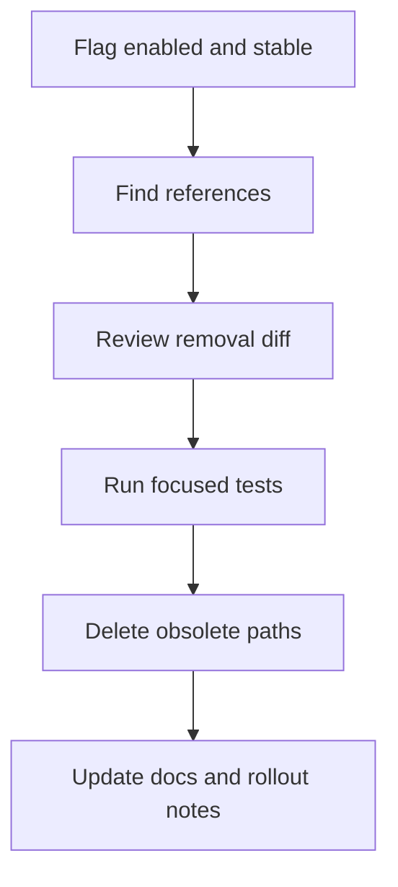
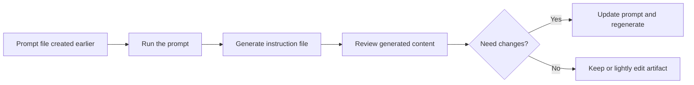
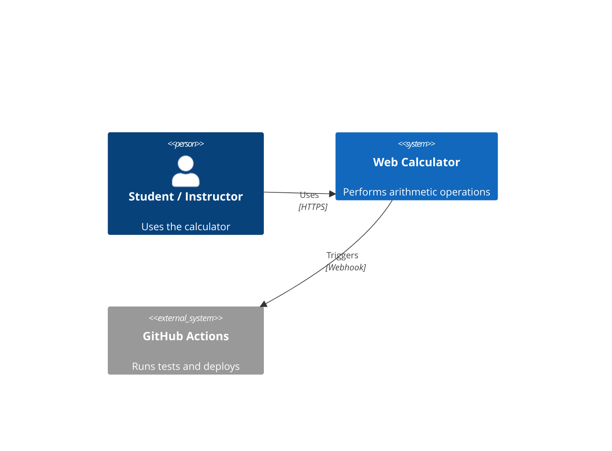

## Welcome Back to AI-Assisted Software Development

- Ready to continue where we left off
- Today's session builds on what we've covered
- We're all in this together — participation welcome
- **Questions are always welcome — ask anytime!**

::: notes
Duration ~00:02

Welcome everyone back to the session. Take a moment to let people settle in before diving into content. Acknowledge that it's great to see everyone back and express enthusiasm for the session ahead.

Key talking points:

- Remind attendees of the previous session's topics briefly
- Emphasize that questions are encouraged at any point — not just at the end
- Set a positive, inclusive tone for the session
- If this is after a break, give people 30 seconds to get re-focused

Transition: "Let's pick up right where we left off..."
:::

---

### What you need to know for your organization

::: notes
Duration ~00:01

Introduce the topic by framing it as a decision teams need to make. Most developers have heard of Copilot, but licensing details are often misunderstood. This session clarifies the tiers and what each unlocks.

Transition: "Let's start with an overview of what's available."
:::

---

## Copilot Plan Overview

| Feature               | **Individual** | **Business**    | **Enterprise** |
| --------------------- | -------------- | --------------- | -------------- |
| Price                 | $10/mo         | **$19/user/mo** | $39/user/mo    |
| Code completions      | ✅             | ✅              | ✅             |
| Copilot Chat          | ✅             | ✅              | ✅             |
| Policy management     | ❌             | ✅              | ✅             |
| Org instruction files | ❌             | ✅              | ✅             |
| Enterprise features   | ❌             | ❌              | ✅             |

::: notes
Duration ~00:02

Walk through the table column by column, not row by row — it helps the audience track each tier's value proposition.

Key talking points:

- Individual is for solo developers; no organizational control
- Business at $19/user/month is the sweet spot for most teams
- Enterprise adds Copilot Knowledge Bases, fine-tuning, and advanced audit logs
- All paid plans include unlimited completions and chat

Emphasize: Business tier is where most organizations should start. Enterprise is for large orgs with compliance or custom knowledge needs.
:::

---

## Business License — $19/user/month

- 🏢 **Centralized management** via GitHub organization settings
- 🔒 **Policy controls** — enable/disable features per org or team
- 📋 **Audit logs** — track Copilot usage across the organization
- 🚫 **Content exclusions** — block Copilot from specific files or repos
- 🌐 **Works with GitHub.com** and GitHub Enterprise Server
- ✅ No seat minimum — pay only for active users

::: notes
Duration ~00:02

This is the most common license tier for companies. Focus on the operational benefits for managers and security teams, not just developers.

Key talking points:

- $19/user/month billed monthly, or discounted annually
- Admins can assign/unassign seats at any time
- Content exclusions are critical for IP-sensitive codebases (e.g., exclude `/src/proprietary/`)
- Audit logs satisfy many compliance requirements without needing Enterprise

Common question: "What counts as an active user?" — A user who has Copilot enabled in their IDE at least once in the billing cycle.

Transition: "Now let's look at what Business adds that Individual doesn't..."
:::

---

## Business vs. Enterprise

### Business ($19/user/mo)

- Organization-wide policy management
- Org-level instruction files (`.github/instructions/`)
- Content exclusions & audit logs
- Standard model access

### Enterprise ($39/user/mo) — adds:

- 🧠 **Copilot Knowledge Bases** — index your internal docs & repos
- 🎯 **Fine-tuned models** on your private codebase
- 📊 **Advanced audit & usage analytics**
- 💬 **Copilot in GitHub.com** (PR summaries, issue chat)
- 🔐 Enhanced compliance & data residency options

::: notes
Duration ~00:03

Frame this as "Business is the foundation; Enterprise is the multiplier."

Key talking points:

- Most teams won't need Knowledge Bases until they have significant internal documentation
- Fine-tuned models are a game-changer for teams with large proprietary codebases
- PR summaries (Enterprise) save meaningful time in code review workflows
- Data residency matters for EU/regulated industries

Help the audience self-select: "If you have a team under 500 and no compliance requirements, Business is probably right for you today."
:::

---

## Organization-Level Instruction Files

### Business & Enterprise unlock `.github/instructions/`

```
your-org/
└── .github/
    └── instructions/
        ├── coding-standards.instructions.md   ← all repos
        ├── security-policy.instructions.md    ← all repos
        └── api-guidelines.instructions.md     ← all repos
```

- 📌 Instructions apply **automatically** to all org repositories
- 🤖 Copilot follows them in every chat and code suggestion
- ✍️ Teams can still add **repo-level** instructions that extend org rules
- 🔄 Changes propagate instantly — no developer action needed

::: notes
Duration ~00:03

This feature is one of the biggest unlocks of the Business tier and often underappreciated.

Key talking points:

- Org-level instructions are like a style guide that Copilot reads before every suggestion
- Examples: "Always use our internal logger, never console.log", "Follow OWASP guidelines", "Use our DTO pattern"
- Repo-level instructions inherit from org-level; they don't replace them
- This is how you scale coding standards without code reviews catching every deviation

Demo opportunity: Show a `.github/instructions/` file with a coding standard rule, then show Copilot following it in the IDE.

Transition: "Let's talk about how to get started..."
:::

---

## Getting Started

1. **Assign seats** in GitHub Org Settings → Copilot → Access
2. **Set policies** — choose which features to enable org-wide
3. **Add content exclusions** for sensitive paths
4. **Create org instruction files** in `.github/instructions/`
5. **Developers install** the Copilot extension in their IDE
6. **Monitor usage** via Audit Log or Copilot usage dashboard

> 💡 **Tip**: Start with a pilot group, gather feedback, then roll out broadly.

::: notes
Duration ~00:02

Give attendees a concrete action plan to leave with.

Key talking points:

- Seat assignment is instant; developers can start using Copilot within minutes
- Recommend starting with 5-10 power users as a pilot cohort
- The usage dashboard (Enterprise) or audit log (Business) helps justify ROI
- Instruction files should be a collaborative effort — involve senior devs and architects

Common concern: "What about IP and training data?" — Reassure that Business/Enterprise plans opt out of using your code to train GitHub's models by default.

Transition: "Any questions on licensing, pricing, or rollout?"
:::

---

## Key Takeaways

- 💰 **Business** = $19/user/month — right for most organizations
- 🏢 **Enterprise** = $39/user/month — adds Knowledge Bases & fine-tuning
- 📋 **Org instruction files** available on Business & above
- 🔒 Both plans offer policy controls and content exclusions
- 🚀 You can start small and scale — no minimum seat count

### ❓ Questions?

::: notes
Summarize the session and open the floor for questions.

Key points to reinforce:

- Business tier is the most common starting point
- Org instruction files are a high-value, low-effort win on day one
- Enterprise is worth evaluating once the team is comfortable with Business features

For questions, be ready to address:

- Billing and seat management specifics
- How instruction files interact with repo-level settings
- Data privacy and training opt-out policies
- GitHub Enterprise Server (on-prem) compatibility

Use the remaining session time for Q&A. Don't rush this slide.
:::

---

## Why Customize VS Code?

- Default shortcuts cover **common tasks** — not YOUR workflow
- Every repeated action you automate = less context switching
- Shortcuts + extensions compound over time into **significant productivity gains**
- Marp authors especially benefit: build, preview, export all from the keyboard

::: notes
Duration ~00:01

Set the "why" before diving into the "how." Emphasize that configuration investment pays dividends every single day.

Key talking points:

- Most developers use VS Code for years without ever opening keybindings.json
- Even one well-chosen shortcut can
- For Marp workflows specifically, running pandoc or opening side-by-side preview are prime candidates

Ask the audience: "How many of you have a custom keyboard shortcut right now?" — gauge the room.

Transition: "Let's look at how VS Code's shortcut system actually works."
:::

---

## How VS Code Keyboard Shortcuts Work

- **GUI**: `File → Preferences → Keyboard Shortcuts` (`Ctrl+K Ctrl+S`)
- **JSON**: `keybindings.json` — full control, version-controllable
- Each binding has three fields:
  - `key` — the chord or combination
  - `command` — VS Code command ID
  - `when` — optional context condition

```json
{
  "key": "ctrl+shift+b",
  "command": "workbench.action.tasks.runTask",
  "args": "Build Slides",
  "when": "editorLangId == markdown"
}
```

::: notes
Duration ~00:02

Walk through the three-field structure of a keybinding entry. The `when` clause is the most powerful and least-used feature — it scopes shortcuts to contexts like "only when a Markdown file is open."

Demo tip: Open the Keyboard Shortcuts editor live, search for a command, and show how clicking the pencil icon edits keybindings.json directly.

Transition: "Now let's see how to discover command IDs — the key to writing your own shortcuts."
:::

---

## Discovering Command IDs

- Open the **Command Palette** (`Ctrl+Shift+P`)
- Right-click any command → **Copy Command ID**
- Or check **Keyboard Shortcuts** list (right-click → Copy Command ID)
- Built-in commands: `workbench.*`, `editor.*`, `terminal.*`
- Extension commands: shown in the same list after install

```
workbench.action.terminal.new
editor.action.formatDocument
markdown.showPreviewToSide
```

::: notes
Duration ~00:02

This is the practical "lookup" step developers skip, then wonder why they can't write shortcuts. Stress that every command in the palette has an ID — including extension commands.

Demo: Open the command palette, type "Marp", right-click "Open Preview", and copy its ID. Then show adding it to keybindings.json.

Transition: "Let's look at some concrete shortcut recipes for Marp authors."
:::

---

## Useful Shortcuts for Marp Authors

| Shortcut       | Command                                       | Purpose                   |
| -------------- | --------------------------------------------- | ------------------------- |
| `Ctrl+Shift+V` | `markdown.showPreviewToSide`                  | Side-by-side Marp preview |
| `Ctrl+Shift+E` | `workbench.view.explorer`                     | Toggle file explorer      |
| `Ctrl+\``      | `workbench.action.terminal.toggleTerminal`    | Toggle terminal           |
| `Ctrl+K P`     | `workbench.action.files.copyPathOfActiveFile` | Copy file path            |
| Custom         | `tasks.runTask` → `Export PDF`                | One-key PDF export        |

::: notes
Duration ~00:02

Go through each shortcut and explain the Marp use case:

- Side-by-side preview is essential when authoring slides — you want to see layout changes immediately
- File explorer toggle helps when switching between slide files and assets
- Terminal toggle is needed to run pandoc or Marp CLI commands
- Copy path is handy when referencing images or linking between files
- The custom task shortcut is a preview of what we'll build with Multi-command

Transition: "Now let's explore the Multi-command extension, which lets us chain commands together."
:::

---

## Introducing the Multi-command Extension

- **Extension ID**: `ryuta46.multi-command`
- Lets you **bind a single key to a sequence of commands**
- Configured in `settings.json` under `multiCommand.commands`
- Each sequence can include:
  - Built-in VS Code commands
  - Extension commands
  - Terminal commands (via tasks)
  - Delays between steps

::: notes
Duration ~00:02

Introduce the extension and explain the core problem it solves: VS Code shortcuts fire exactly one command. Multi-command lets you chain many into a single keystroke — like a macro system.

Install tip: Show `Ctrl+Shift+X`, search "multi-command", install ryuta46.multi-command.

Transition: "Let's see what the configuration looks like."
:::

---

## Multi-command: Configuration Structure

`settings.json`:

```json
"multiCommand.commands": [
  {
    "command": "multiCommand.marpBuildAndPreview",
    "label": "Marp: Build & Open Preview",
    "sequence": [
      "workbench.action.files.save",
      "markdown.showPreviewToSide",
      {
        "command": "workbench.action.tasks.runTask",
        "args": "Marp Export PDF"
      }
    ]
  }
]
```

Then bind it in `keybindings.json`:

```json
{
  "key": "ctrl+shift+m",
  "command": "multiCommand.marpBuildAndPreview"
}
```

::: notes
Duration ~00:03

Walk through the structure carefully:

1. `command` — a unique ID you choose; must start with `multiCommand.`
2. `label` — shown in the command palette
3. `sequence` — array of commands fired in order; can be strings (command IDs) or objects with args

Point out the "save first" pattern — always save before building so the exported file reflects current edits.

Demo: Paste this into settings.json and fire the shortcut live.

Transition: "Let's look at a complete Marp workflow using Multi-command."
:::

---

## Marp Slide Workflow with Multi-command

**One shortcut does all of this:**

1. 💾 Save the current file
2. 🔍 Open Marp preview side-by-side
3. 📄 Run `marp --pdf` via VS Code task
4. 📂 Reveal output file in Explorer

```json
"sequence": [
  "workbench.action.files.save",
  "markdown.showPreviewToSide",
  { "command": "workbench.action.tasks.runTask", "args": "Marp Export PDF" },
  "revealFileInOS"
]
```

::: notes
Duration ~00:02

Paint the before/after picture:

- BEFORE: Save manually → open terminal → type marp command → switch to Finder/Explorer → open PDF
- AFTER: Press `Ctrl+Shift+M`, everything happens in sequence

This is the kind of workflow automation that pays for the time you spent configuring it within the first session.

Transition: "Let's also set up the VS Code task that runs Marp CLI."
:::

---

## VS Code Task: Marp Export PDF

`.vscode/tasks.json`:

```json
{
  "version": "2.0.0",
  "tasks": [
    {
      "label": "Marp Export PDF",
      "type": "shell",
      "command": "marp",
      "args": [
        "${file}",
        "--pdf",
        "--output",
        "${fileDirname}/${fileBasenameNoExtension}.pdf"
      ],
      "group": "build",
      "presentation": { "reveal": "silent" }
    }
  ]
}
```

::: notes
Duration ~00:02

Walk through the task definition:

- `${file}` — the currently open file (your active .md slide deck)
- `--pdf` — export to PDF format; can swap for `--pptx` for PowerPoint
- `${fileDirname}/${fileBasenameNoExtension}.pdf` — output file next to source with same name
- `"reveal": "silent"` — terminal doesn't pop up visually, keeps focus on slides

Prerequisite: Marp CLI must be installed (`npm install -g @marp-team/marp-cli`).

Transition: "Before we wrap up, let me share a few more power-user tips."
:::

---

## Power-User Tips

**Keyboard shortcut tips:**

- Use `when: "editorLangId == markdown"` to scope Marp shortcuts
- Chain `Ctrl+K` as a leader key for shortcut groups
- View all active shortcuts: `Ctrl+K Ctrl+S`

**Multi-command tips:**

- Add `{ "command": "vscode.delay", "args": 500 }` between steps if a command is async
- Use `label` to find your macros in the Command Palette
- Keep sequences short — 3–5 steps is the sweet spot

**Sync your config:**

- Enable **Settings Sync** (`Ctrl+Shift+P` → "Settings Sync: Turn On")
- Keybindings and settings sync automatically across machines

::: notes
Duration ~00:02

These are the tips that separate power users from casual users. Call out the `when` clause again — it's underused but prevents shortcut conflicts across file types.

The delay tip is important for Multi-command: if a task launches a process, subsequent commands may fire before it finishes. A small delay solves this.

Settings Sync is a quality-of-life tip that resonates well — many developers maintain multiple machines or reinstall VS Code periodically.

Transition: "Let's look at where to find these settings in your own VS Code."
:::

---

## Where to Find These Files

| File                        | Location                | How to Open                              |
| --------------------------- | ----------------------- | ---------------------------------------- |
| `keybindings.json`          | `~/.config/Code/User/`  | `Ctrl+K Ctrl+S` → icon top-right         |
| `settings.json` (user)      | `~/.config/Code/User/`  | `Ctrl+,` → icon top-right                |
| `settings.json` (workspace) | `.vscode/settings.json` | Create manually                          |
| `tasks.json`                | `.vscode/tasks.json`    | `Ctrl+Shift+P` → "Tasks: Configure Task" |

> 💡 Workspace `.vscode/` settings are **version-controllable** — commit them with your slides repo!

::: notes
Duration ~00:02

Clarify the difference between user-level and workspace-level settings:

- User settings apply globally across all projects
- Workspace settings apply only to the current folder and can be shared with teammates via Git

For slide authors, storing tasks.json and workspace settings.json in the slides repository is best practice — anyone who clones the repo gets the same Marp build workflow instantly.

Windows paths: `%APPDATA%\Code\User\` instead of the Linux/Mac paths shown.

Transition: "Let's wrap up with a quick summary."
:::

---

## Summary

✅ **Custom shortcuts** = less mouse, more flow

- Use `keybindings.json` for full control
- Scope with `when` to avoid conflicts

✅ **Multi-command** = keyboard macros for VS Code

- Chain save → preview → export in one keystroke
- Define sequences in `settings.json`, bind in `keybindings.json`

✅ **VS Code tasks** = repeatable Marp CLI builds

- Store in `.vscode/tasks.json` and commit with your repo

> Start with **one shortcut** you use every day. Build from there.

::: notes
Duration ~00:01

Reinforce the three takeaways clearly. The closing advice — "start with one shortcut" — combats the paralysis of trying to configure everything at once.

Call to action ideas:

- "Open keybindings.json right now and add one shortcut before you leave"
- "Install Multi-command and try the Marp build sequence this week"
- "Commit your .vscode/ folder to your next slide repo"

Thank the audience and open for questions.
:::

---

<!-- _class: lead -->

## Course Modules

- Intro
- **▶ LLM**
- Copilot for Teams
- Safety Measures and Best Practices
- Models and Context
- Guardrails and Prompt Files
- AI Assisted Documentation
- Test Automation and Code Quality

---

## What Is a Large Language Model?

> A statistical model trained to **predict the next token** given all preceding tokens.

- Trained on **trillions of tokens** of text (code, books, web pages)
- Learns **patterns, relationships, and structure** in language
- Not a database — it doesn't store facts, it learns **weights**
- Generates output one token at a time, probabilistically

### Key insight

**LLMs don't "know" things — they learn what text tends to follow other text.**

::: notes
Duration ~00:02

This is the most important conceptual slide. Many developers expect LLMs to behave like search engines or databases — they don't.

Key talking points:

- "Next token prediction" sounds simple but at scale it forces the model to learn grammar, logic, context, and even reasoning
- "Weights" are just numbers — billions of floating point values that encode everything the model learned
- Probabilistic output means the same prompt can produce different answers — this is by design, controlled by "temperature"
- Analogy: autocomplete on your phone, but trained on all of human writing

Common misconception to address: "Does Copilot look up my code in a database?" — No. It generates completions based on learned patterns.
:::

---

## Tokenization — Breaking Text Apart

### Text → Numbers (before the model sees anything)

```
Input:  "Hello, world!"
Tokens: ["Hello", ",", " world", "!"]
IDs:    [15496, 11, 995, 0]
```

```
Input:  "def calculate_tax(income):"
Tokens: ["def", " calculate", "_tax", "(", "income", "):"]
```

- A **token** ≈ ~4 characters or ¾ of a word on average
- The model only ever sees **token IDs**, never raw text
- Tokenization affects **cost**, **context limits**, and **model behavior**
- Rare words split into multiple tokens → less efficient

::: notes
Duration ~00:03

Tokenization is often overlooked but explains many "weird" LLM behaviors.

Key talking points:

- GPT-4 uses ~100,000 tokens in its vocabulary (tiktoken)
- Context window limits (e.g., "128k tokens") are token limits, not character limits
- Why does Copilot sometimes mishandle unusual variable names? Tokenization — rare strings get split awkwardly
- Code tokenization differs from prose — identifiers often split at underscores, camelCase boundaries

Practical implication for developers:

- Long variable names consume more tokens than short ones
- Copy-pasting large files into chat uses tokens fast
- Understanding tokens helps estimate cost when using API

Interactive moment: Ask "How many tokens do you think this slide is?" — good engagement exercise.
:::

---

## The Transformer Architecture

### The breakthrough that made modern LLMs possible (2017)

```
Input Tokens
     ↓
[Embedding Layer]      ← tokens → vectors
     ↓
[Attention Layers] ×N  ← "what matters given what came before?"
     ↓
[Feed-Forward Layers]  ← learn patterns and transformations
     ↓
[Output Layer]         ← probability over next token
```

- **Self-attention** lets every token "look at" every other token
- Processes the **entire context window at once** (not word-by-word)
- Stacked in **layers** — deeper = richer understanding

::: notes
Duration ~00:03

You don't need to explain the math — focus on the intuition of attention.

Key talking points:

- Before Transformers: RNNs processed text sequentially (slow, forgot early context)
- Transformers process everything in parallel — that's why they scale so well on GPUs
- Self-attention intuition: "When I see the word 'it' in a sentence, which earlier word does 'it' refer to?" Attention figures this out
- Layers build up from syntax → semantics → reasoning as you go deeper

Analogy for attention: Imagine reading a legal contract. When you hit a pronoun like "the aforementioned party," your brain jumps back to find who that is. That's attention.

Why this matters for developers: Larger context windows (more tokens processed at once) = Copilot can see more of your codebase at once = better suggestions.
:::

---

## Self-Attention — The Core Idea

### How the model decides what to focus on

> **"The trophy didn't fit in the suitcase because it was too big."**
> What does "it" refer to?

- Each token computes **Query**, **Key**, and **Value** vectors
- Attention score = how much each token should influence the current one
- Model learns which relationships matter during training
- Multiple **attention heads** capture different relationship types simultaneously

### In code:

```
"def process(data):"  →  model attends to "def" when predicting
                          what comes after "(data):"
```

::: notes
Duration ~00:03

Use the trophy/suitcase example — it's a classic from the research literature and immediately intuitive.

Key talking points:

- Q/K/V is just a learned lookup mechanism — don't get lost in the math
- Multiple heads: one head might learn syntax relationships, another semantic, another positional
- This is why LLMs understand that a closing brace `}` should match an opening one several lines earlier
- Attention is also why very long prompts can "distract" the model — it has finite attention capacity

Practical tip: When using Copilot, relevant context near your cursor gets higher attention weight. Keep related code nearby when you want better completions.
:::

---

## The Training Process

### Phase 1: Pre-training

```
Raw text (internet, books, code, papers)
          ↓
    Tokenize everything
          ↓
    For each token: predict next token
          ↓
    Compare prediction to actual → compute loss
          ↓
    Backpropagation → update billions of weights
          ↓
    Repeat trillions of times on thousands of GPUs
```

- Months of training, millions of dollars in compute
- Produces a **base model** that completes text — but isn't yet "helpful"

::: notes
Duration ~00:03

Pre-training is where the model learns language, code, and world knowledge.

Key talking points:

- The objective is deceptively simple: predict the next token. But at scale it forces the model to learn everything
- Training data quality matters enormously — garbage in, garbage out
- GitHub Copilot's base model was trained on public GitHub repos (billions of lines of code)
- A "base model" after pre-training will complete text but may write offensive content, refuse nothing, and ramble — it needs the next phase

Scale reference: GPT-3 used 45TB of text data. Training ran on ~10,000 A100 GPUs.

Why developers care: The pre-training corpus determines what languages, frameworks, and patterns the model knows well. Copilot knows React better than a niche internal framework.
:::

---

## The Training Process

### Phase 2: Fine-tuning & Alignment

**Supervised Fine-Tuning (SFT)**

- Train on curated prompt → ideal response pairs
- Teaches the model to be helpful and follow instructions

**Reinforcement Learning from Human Feedback (RLHF)**

- Human raters rank model outputs
- A reward model learns human preferences
- The LLM is optimized to maximize reward score

**Result**: A model that is helpful, harmless, and honest

```
Base model: "The capital of France is Paris. The capital of Spain is..."
Aligned model: "The capital of France is Paris."  ← stops when done
```

::: notes
Duration ~00:03

This phase is what separates "a model that generates text" from "an assistant you can actually use."

Key talking points:

- SFT teaches format and helpfulness; RLHF teaches judgment
- "Hallucinations" happen when the model optimizes for sounding helpful over being accurate
- Safety guardrails (content filters) are also applied at this stage
- GitHub Copilot has additional fine-tuning on high-quality code and developer feedback

Why alignment matters for developers: It's why Copilot suggests reasonable code instead of technically-valid-but-insane solutions. It's also why it refuses to help with malicious code.

Common question: "Can I fine-tune Copilot on my codebase?" — GitHub Enterprise Copilot offers custom fine-tuning on private repos.
:::

---

## Context Window — The Model's Working Memory

| Model             | Context Window               |
| ----------------- | ---------------------------- |
| GPT-3.5           | 16k tokens (~12,000 words)   |
| GPT-4o            | 128k tokens (~96,000 words)  |
| Claude 3.5 Sonnet | 200k tokens (~150,000 words) |
| Gemini 1.5 Pro    | 1M tokens (~750,000 words)   |

- Everything the model "knows" during a conversation fits here
- Once exceeded, **earlier content is forgotten**
- GitHub Copilot uses the context window for: open files, cursor position, recent edits, instruction files
- Larger context = can see more code, but also slower & more expensive

::: notes
Duration ~00:02

Context window is one of the most practically important LLM concepts for developers using Copilot.

Key talking points:

- The context window is not persistent memory — every new conversation starts fresh
- Copilot automatically fills the context window with relevant code from open tabs and recent edits
- This is why opening related files improves Copilot suggestions — they get included in context
- Instruction files (`.github/instructions/`) consume some of the context window — keep them concise

Practical tip: If Copilot seems to "forget" something you told it, it likely scrolled out of the context window. Repeat the key constraints.
:::

---

## Temperature & Sampling

### How the model chooses its next token

```
Token probabilities after "def calculate_":
  "tax"      → 35%
  "total"    → 28%
  "price"    → 18%
  "discount" → 12%
  other...   → 7%
```

| Temperature | Behavior                         | Use case           |
| ----------- | -------------------------------- | ------------------ |
| 0.0         | Always picks highest probability | Deterministic code |
| 0.3–0.5     | Mostly top tokens, some variety  | Code completion    |
| 0.7–1.0     | More creative, less predictable  | Brainstorming      |
| > 1.0       | Random / incoherent              | Rarely useful      |

::: notes
Duration ~00:02

Temperature demystifies why LLMs give different answers to the same question.

Key talking points:

- Temperature = how "flat" or "peaked" the probability distribution is before sampling
- Copilot uses a low temperature (~0.2-0.4) for code — you want predictable, correct completions
- ChatGPT uses higher temperature for conversational responses — feels more natural
- When Copilot gives you alternates (Alt+] to cycle), it's sampling different tokens

Developer implication: If you're using the Copilot API or OpenAI API directly, lower temperature for code generation tasks, higher for creative tasks like writing test descriptions.
:::

---

## Key Takeaways

- 🔤 **Tokenization** — text is broken into tokens; everything is numbers
- 🔍 **Transformers** — attention lets every token relate to every other
- 🎓 **Pre-training** — learns from trillions of tokens of text & code
- 🎯 **Fine-tuning** — makes the model helpful, safe, and task-specific
- 📏 **Context window** — the model's working memory; bigger = better
- 🌡️ **Temperature** — controls creativity vs. determinism

### The bottom line for developers:

> LLMs are powerful pattern matchers. Give them **clear context**, **good examples**, and **specific instructions** — and they'll surprise you.

::: notes
Wrap up by connecting the technical concepts back to practical developer behavior.

Key points to reinforce:

- You don't need to understand the math to use LLMs effectively
- Understanding tokens helps you write better prompts and manage costs
- Understanding context helps you structure your workspace for better Copilot suggestions
- Understanding temperature explains why results vary

For Q&A, be prepared for:

- "How does Copilot know about my private code?" — It doesn't unless you're using Enterprise Knowledge Bases
- "Why does it make things up?" — Hallucination: the model is optimized to produce plausible-sounding text, not verified facts
- "What's the difference between Copilot and ChatGPT?" — Same underlying technology; different fine-tuning, context, and integration

Use the remaining session time for Q&A.
:::

---

<!-- _class: lead -->

## Course Modules

- Intro
- LLM
- **▶ Copilot for Teams**
- Safety Measures and Best Practices
- Models and Context
- Guardrails and Prompt Files
- AI Assisted Documentation
- Test Automation and Code Quality

---

## GitHub Copilot for Teams

Key Considerations for Adoption

Empowering developers with AI while protecting your codebase

::: notes
Outline governance, admin controls, and adoption factors (training, policy, developer onboarding).
:::

---

## Benefits for Organizations

Accelerated Development

- Faster prototyping, fewer boilerplate tasks
  Improved Documentation
- Auto-generates comments and README content
  Enhanced Testing
- Suggests unit tests and edge cases
  Team Productivity
- Reduces cognitive load, supports onboarding

::: notes
Highlight productivity, documentation, test generation, and onboarding benefits with brief examples.
:::

---

## Risks to Consider

IP Leakage Concerns

- Copilot may suggest code similar to public repositories
- Risk of inadvertently using copyrighted or licensed code
- Mitigation: Enable public code filters and review suggestions carefully
  Code Quality and Accuracy
- AI-generated code may contain bugs, inefficiencies, or security flaws
- Always validate and test before deployment
- Treat Copilot as a drafting tool, not a source of truth
  Developer Overreliance
- Risk of reduced understanding or critical thinking
- Encourage code reviews and pair programming to maintain rigor

::: notes
Cover IP leakage, code quality risks, and developer overreliance; suggest mitigations for each.
:::

---

## Governance and Compliance Risks

Regulatory Compliance

- Generated code may not meet industry-specific standards (e.g., HIPAA, PCI-DSS)
- Organizations must enforce coding policies and audits
  Data Privacy and Security
- Sensitive data should never be typed into prompts
- Use Copilot in secure environments with clear usage guidelines
  Licensing Ambiguity
- Copilot suggestions may resemble code under restrictive licenses
- Legal teams should define acceptable use policies and monitor compliance

::: notes
Discuss regulatory impacts, auditability, and how to enforce coding policies with automated checks.
:::

---

## IP and Data Protection

Your code is not used to retrain the model (with Copilot for Business/Enterprise)
Suggestions are generated locally — no code is shared unless feedback is submitted
No leakage between users: your private code is not exposed to others
Admins can disable suggestions matching public code for added safety

::: notes
Clarify data flows, model retraining policy for enterprise plans, and recommended org controls to protect IP.
:::

---

## Licensing and Legal Considerations

Copilot may suggest code similar to public repositories
GitHub provides a filter to block matching public code
Organizations should review Copilot's Terms of Service and Privacy Statement

::: notes
Explain risks of suggested code resembling public repos and recommend legal review and filter settings.
:::

---

## Deployment Options

| Plan                           | Key Features                       | IP Protection |
| ------------------------------ | ---------------------------------- | ------------- |
| Copilot Individual (Pro, Pro+) | Personal use, no admin controls    | Limited       |
| Copilot for Business           | Admin controls, policy enforcement | Strong        |
| Copilot for Enterprise         | Org-wide policy, audit tools       | Strongest     |

::: notes
Summarize plan differences and pick considerations (control, audit, scale) for each offering.
:::

---

## Best Practices for Safe Use

Enable public code filters
Establish a review process
Educate teams on responsible use and licensing awareness

::: notes
Practical checklist: avoid secrets in prompts, enable public-code filters, and establish review processes.
:::

---

## Resources

Copilot Documentation:

- https://docs.github.com/en/copilot
  Copilot for Business Overview
- https://github.com/features/copilot-for-business
  Security and Privacy FAQ
- https://docs.github.com/en/copilot/security

::: notes
Point attendees to official docs and FAQs; recommend follow-up reading links on the slide.
:::

---

<!-- _class: lead -->

## Course Modules

- Intro
- LLM
- Copilot for Teams
- **▶ Safety Measures and Best Practices**
- Models and Context
- Guardrails and Prompt Files
- AI Assisted Documentation
- Test Automation and Code Quality

---

## Safety Measures & Best Practices

- Safety nets make AI acceleration safer
- Test quality matters more than raw coverage
- AI output must be reviewed like junior developer work
- Small, focused diffs are easier to trust
- Automation helps reviewers scale

::: notes
Duration ~00:01

Open this module by framing safety as the price of speed in AI-assisted development. The point is not to slow teams down, but to make sure faster code generation does not also mean faster mistakes reaching production. Transition by introducing the mindset shift: AI is helpful, but it is never self-approving.
:::

---

## Treat AI Like an Eager Knowledgeable Junior Developer

- AI can produce useful first drafts quickly
- It can also misunderstand requirements or context
- Humans remain accountable for correctness and intent
- Review every generated change before commit or merge
- Use AI for acceleration, not delegated judgment


::: notes
Duration ~00:03

Use the "eager knowledgeable junior developer" analogy because it is memorable and accurate. AI often produces plausible work at high speed, but plausibility is not the same thing as correctness, so every change still needs human review for domain fit, architectural consistency, and unintended side effects. Transition by explaining that tests are one of the main ways we convert suspicion into confidence.
:::

---

## Coverage Is a Floor, Not the Goal

- Coverage tells you **how much** code was executed
- Signal quality tells you **whether failures would matter**
- Prefer tests that detect regressions in behavior
- Include edge cases, negative paths, and business rules
- Do not confuse green dashboards with real confidence

**High-signal tests usually check**

- outcomes users care about
- meaningful failure conditions
- integration boundaries and contracts

::: notes
Duration ~00:04

Make it clear that code coverage is useful, but incomplete. A suite can report high coverage while still missing the exact regression that users will experience, especially if tests only exercise happy paths or assert implementation details instead of behavior. Transition by showing that one concrete place where high-signal validation matters is feature-flag retirement.
:::

---

## Safe Feature Flag Removal

- Confirm the new path is stable before cleanup
- Ask AI to locate all flag references and stale branches
- Review generated deletions carefully for hidden dependencies
- Update tests to match the post-flag reality
- Remove dead code, config, and documentation together



::: notes
Duration ~00:03

Explain that feature flags are valuable only if teams are disciplined about retiring them. AI is especially helpful here because it can search for scattered references, conditional branches, test toggles, and documentation mentions faster than a human can, but the human reviewer must still confirm that nothing still depends on the old path. Transition by noting that this workflow is safest when the diff is narrow enough for someone to reason about quickly.
:::

---

## Keep Change Sets Small and Reviewable

- Smaller diffs are easier to understand
- Reviewers spot risk faster in focused changes
- Rollback is simpler when scope is narrow
- Incremental delivery reduces blast radius
- Large AI-generated diffs hide subtle mistakes

**Good small-change patterns**

1. separate refactor from behavior change
2. ship one concern per pull request
3. keep cleanup close to the related feature

::: notes
Duration ~00:03

Position small change sets as a safety mechanism, not just a style preference. When AI can generate large amounts of code quickly, the danger is not only bad code but unreviewable code, because reviewers cannot build enough understanding to catch mistakes hidden inside a massive diff. Transition by showing how automation can support review without replacing human judgment.
:::

---

## Human Review + Automated Review Workflow

- Use automation to surface risky files, missing tests, and policy gaps
- Use humans to judge correctness, intent, and business impact
- Azure DevOps MCP tools can help automate PR review workflows
- Automated comments are triage aids, not merge authority
- The best workflow combines speed, consistency, and accountability

**Suggested review split**

- **Automation**: lint, tests, policy checks, review hints
- **Human reviewers**: architecture, behavior, domain correctness

::: notes
Duration ~00:04

Explain that automation is most valuable when it reduces reviewer fatigue and helps humans spend attention where judgment matters most. Mention Azure DevOps MCP here as an example of tooling that can support pull-request workflows by pulling context, surfacing work-item links, and assisting review automation around the PR, while still leaving final approval to accountable humans. Transition to a closing checklist that teams can apply immediately.
:::

---

## Practical Safety Checklist for AI-Assisted Changes

- Review every AI-generated diff before commit
- Require tests, but evaluate their **signal**, not just count
- Keep pull requests focused and incremental
- Use automation to pre-screen issues for reviewers
- Clean up obsolete flags and dead paths intentionally
- Merge only when humans understand the change

**Bottom line:** fast AI-assisted delivery still needs disciplined engineering.

::: notes
Duration ~00:03

Close with an operational checklist the audience can adopt the same day. Reiterate that the most important habits are review discipline, meaningful tests, small diffs, and intentional use of automation to make humans more effective rather than less necessary. End by connecting this section back to the larger course theme: safe acceleration beats reckless acceleration every time.
:::

---

<!-- _class: lead -->

## Course Modules

- Intro
- LLM
- Copilot for Teams
- Safety Measures and Best Practices
- **▶ Models and Context**
- Guardrails and Prompt Files
- AI Assisted Documentation
- Test Automation and Code Quality

---

## Model Selection & Comparison

Available models vary over time (Jan 18, 2026)
Multipliers vary with Copilot Subscription level
Name | Input Context Size | Output Context Size | Capabilities | Multiplier
--- | --- | --- | --- | ---
Claude Haiku 4.5 | 128K | 16K | Tools, Vision | 0.33x
Claude Opus 4.1 | 68K | 16K | Vision | 10x
Claude Opus 4.5 | 128K | 16K | Tools, Vision | 3x
Claude Sonnet 4 | 128K | 16K | Tools, Vision | 1x
Claude Sonnet 4.5 | 128K | 16K | Tools, Vision | 1x
Gemini 2.5 P Gemini 3 Flash (Preview) | 109K | 64K | Tools, Vision | 1x
Gemini 3 Flash (Preview) | 109K | 64K | Tools, Vision | 0.33x
Gemini 3 Pro (Preview) | 109K | 64K | Tools, Vision | 1x
GPT-4.1 | 111K | 16K | Tools, Vision | 0x
GPT-4o | 64K | 4K | Tools, Vision | 0x
GPT-5 | 128K | 128K | Tools, Vision | 1x
GPT-5 mini | 128K | 64K | Tools, Vision | 0x
GPT-5-Codex (Preview) | 128K | 128K | Tools, Vision | 1x
GPT-5.1 | 128K | 64K | Tools, Vision | 1x
GPT-5.1-Codex | 128K | 128K | Tools, Vision | 1x
GPT-5.1-Codex-Max | 128K | 128K | Tools, Vision | 1x
GPT-5.1-Codex-Mini (Preview) | 128K | 128K | Tools, Vision | 0.33x
GPT-5.2 | 128K | 64K | Tools, Vision | 1x
GPT-5.2-Codex | 272K | 128K | Tools, Vision | 1x
Grok Code Fast 1 | 109K | 64K | Tools | 0x
Raptor mini (Preview) | 200K | 64K | Tools, Vision | 0x

---

## Public Leaderboards

- Where to See Model-to-Model Comparisons
- LLM-Stats Coding Leaderboard
  - Aggregates 20+ coding benchmarks
  - Shows top performers across HumanEval, LiveCodeBench, etc.
- TechRadar's Coding LLM Guide
  - Editorial comparison of strengths (debugging, test generation, etc.)
- Zencoder's 2026 Model Comparison
  - Breaks down accuracy, reasoning, and context window-

---

## Core Benchmarks

- What Models Are Actually Tested On
- HumanEval
  - Classic functional-correctness benchmark for Python
- LiveCodeBench
  - Contamination-free, holistic benchmark for modern LLMs
- MBPP (Mostly Basic Programming Problems)
  - Simple algorithmic tasks across languages
- SWE-Bench
  - Real-world GitHub issue resolution
- DevQualityEval
  - Evaluates test generation for Java and Go

---

## Surveys & Deep-Dive Research

Understanding the Landscape
Academic Surveys (arXiv)

- Comprehensive overviews of techniques, benchmarks, and model families
  Benchmark Explainers (Vellum, Analytics Vidhya)
- Strengths and weaknesses of each benchmark
- How to interpret results
  Specialized Benchmarks
- SwiftEval, domain-specific coding evaluations, etc

---

## Evaluation Frameworks

- Tools for Running Your Own Tests
  - Symflower DevQualityEval
    - Open-source framework for code and test generation evaluation
  - CodeArena (HuggingFace)
    - Collective evaluation platform for coding tasks
  - Automatic Benchmark Generation Tools
    - Research into LLM-generated benchmarks and judge reliability

---

## Selecting Models

Select benchmarks aligned with your workflow
Combine leaderboards + hands-on evaluation
Build a repeatable internal benchmark suite
Track contamination-free benchmarks for reliability

::: notes
Contamination-Free Benchmarks
Why They Matter — and How They Work
Contamination-free benchmarks exist because modern LLMs are trained on massive, scraped corpora that often include the very benchmarks used to evaluate them. If a model has already seen the test set during training, its score is inflated — sometimes dramatically — and no longer reflects real reasoning or coding ability
A contamination-free benchmark is designed to eliminate that inflation and give you a score you can actually trust.
:::

---

## Advanced Context Techniques

Modern AI tools rely heavily on context quality
Developers can shape context intentionally
Reduces hallucinations, drift, and rework
Strong context discipline is a core AI-era skill

::: notes
This slide frames the idea that AI quality is directly tied to context quality.

Models don't “understand” your repo – they interpret whatever you give them.

Advanced context techniques let you control what the model sees and how reliably it stays aligned with your architecture.
:::

---

## File & Folder Mentions (# Syntax)

How it helps
Explicitly pull files into context
Ensures the model references real code, not guesses
Supports cross-file refactoring and API consistency
Reduces drift in large repos
Examples
#src/utils/date.ts
#services/

::: notes
The # syntax is one of the most powerful ways to anchor Copilot.

It forces the model to load specific files or directories into its working memory.

This is essential when you want the model to follow existing patterns or avoid hallucinating APIs.
:::

---

## Spaces & Knowledge Bases Integration

Why they matter
Persistent, structured context containers
Store architectural rules, domain models, coding standards
Provide long-term memory beyond a single prompt
Ideal for instruction files and evergreen boundaries
Use cases
Architecture constraints
Domain terminology
API contracts
Coding conventions

::: notes
Spaces and knowledge bases give you a stable context layer that doesn't depend on prompt length.

Instead of repeating instructions every session, you store them once and let Copilot reference them automatically.

This is especially valuable for brownfield systems with scattered tribal knowledge.
:::

---

## Premium Usage Monitoring

High-end models = high reasoning cost
Monitor usage patterns to avoid unnecessary calls
Use a tiered strategy:

- Premium for architecture & refactoring
- Mid-tier for implementation
- Lightweight for boilerplate
  Optimize prompts to reduce token consumption

::: notes
Premium models are incredible, but they're not free.

Monitoring usage helps teams understand where they're over-relying on heavyweight models.

A tiered strategy ensures the right model is used for the right task, keeping costs predictable and output quality high.
:::

---

## Token Estimation & Overflow Detection

Models have strict token limits
Overflow causes silent failures:

- Missing requirements
- Contradictions
- Forgotten rules
  Techniques to stay within limits:
- Summaries
- Chunking
- Scoped prompts
- Instruction files

::: notes
Open by explaining that token limits are one of the most important but least visible constraints in AI-assisted development.

When a model exceeds its context window, it silently drops earlier content.

This leads to missing requirements, contradictions, or forgotten rules.

The goal of this section is to help developers recognize overflow symptoms and apply techniques to prevent them.
:::

---

## Why Token Limits Matter

Every model has a maximum context window
Prompts, code, examples, and instructions all consume tokens
Exceeding the limit forces the model to discard earlier content
The model never alerts you when this happens

::: notes
Token limits are a hard boundary.

Everything the model reads – your prompt, code snippets, examples, and even its own reasoning – counts toward the limit.

When the limit is exceeded, the model truncates the earliest content, which often contains critical instructions or architectural rules.
:::

---

## Silent Failure Modes

What Overflow Looks Like
Missing requirements
Contradictions
Forgotten rules
Inconsistent reasoning
Loss of architectural constraints

::: notes
Overflow is subtle.

The model behaves as if you never gave it the missing information.

Developers often misinterpret this as stubbornness or randomness, but it's simply the model losing context due to token pressure.

These symptoms are your early warning signs.
:::

---

## Technique: Summaries

How Summaries Help
Compress large files into short, high-signal descriptions
Preserve intent without overwhelming the context window
Reuse summaries across prompts
Reduce noise and improve model alignment

::: notes
Summaries are your first line of defense.

Instead of pasting entire files, summarize their purpose, interfaces, and constraints.

Summaries dramatically reduce token usage while keeping the model aligned with the system's intent.

They also become reusable context anchors for future prompts.
:::

---

## Technique: Chunking

How Chunking Works
Break large tasks into smaller, self-contained steps
Provide only the relevant portion of the code
Validate each chunk before moving on
Prevents the model from being overloaded

::: notes
Chunking keeps prompts small and manageable.

Instead of asking the model to refactor a huge file, break the task into sections.

This keeps each prompt within safe token limits and makes the output easier to review, test, and roll back if needed.
:::

---

## Technique: Scoped Prompts

Benefits
Limit the model's focus to a single module or function
Reduce irrelevant context
Improve accuracy and reduce hallucinations
Keep token usage predictable

::: notes
Scoped prompts are about intentionality.

Tell the model exactly what part of the system to focus on.

This reduces token usage and improves reliability because the model isn't trying to reason about the entire codebase at once.

It also reduces hallucinations by narrowing the reasoning space.
:::

---

## Technique: Instruction Files

Why They Matter
Move stable rules out of the active prompt
Provide persistent architectural and style guidance
Reduce repeated tokens across sessions
Keep prompts short and high-signal

::: notes
Instruction files are a powerful way to reduce token load.

Instead of repeating architectural rules or coding standards in every prompt, store them in a persistent instruction file.

This frees up space for task-specific context and keeps the model aligned with your evergreen architecture.
:::

---

<!-- _class: lead -->

## Course Modules

- Intro
- LLM
- Copilot for Teams
- Safety Measures and Best Practices
- Models and Context
- **▶ Guardrails and Prompt Files**
- AI Assisted Documentation
- Test Automation and Code Quality

---

## Prompt Files

::: notes
Duration ~00:01

Introduce prompt files as a key guardrail mechanism for AI-assisted development. This slide sets the stage for understanding how prompt files differ from instruction files and chat modes.

Key points:

- Prompt files are task-specific templates
- They're executable and reusable
- Different from instruction files (which provide continuous guidance)
- Part of the "prompt-first" development approach

Transition: "Let's define what we mean by executable task templates..."
:::

---

## Executable Task Templates

::: notes
Duration ~00:02

Define prompt files as "executable task templates." This framing helps participants understand their purpose and usage.

Key concept: Prompt files are like functions—they take inputs (context, requirements) and produce outputs (code, docs, artifacts).

Draw parallels to:

- Shell scripts (automation)
- GitHub Actions workflows (CI/CD)
- Makefiles (build automation)

Prompt files bring the same benefits: repeatability, standardization, knowledge capture.

Transition: "So what exactly makes a prompt file?"
:::

---

## What Are Prompt Files?

Definition
Structured templates for specific, repeatable tasks
Contain detailed instructions for particular objectives
Designed for execution in AI chat interfaces
Key Characteristics
Scope: Single, focused task or workflow
Execution: Run on-demand when needed
Purpose: Define “what” to accomplish with specific steps

::: notes
Duration ~00:03

Provide a formal definition and key characteristics of prompt files.

Definition breakdown:

- Structured templates: Follow a consistent format with metadata
- Specific, repeatable tasks: Not general guidance—concrete objectives
- Designed for execution: Meant to be run, not just read

Key characteristics:

1. Scope: Single task focus (generate tests, create docs, refactor module)
2. Execution: On-demand—you invoke them when needed
3. Purpose: Define deliverables clearly

Contrast with instruction files:

- Instruction files: Continuous guidance (always active)
- Prompt files: One-time execution (run and done)

Transition: "Let's look at the structure..."
:::

---


## Prompt File Structure

- -- mode: agent model: "anthropic/claude-3.5-sonnet@2024-10-22" tools: ["create", "edit", "read"] description: Generate comprehensive API documentation prompt_metadata: id: generate-api-docs title: API Documentation Generator category: documentation output_format: markdown --- # Generate API Documentation ## Context Create comprehensive API documentation from code analysis... ## Requirements 1. Analyze existing API endpoints 2. Generate OpenAPI specifications 3. Create developer-friendly guides 4. Include example requests/responses ## Deliverable Generate `docs/api/` folder with complete documentation...

---


## Prompt Files: Use Cases

Perfect For:
Code Generation → Create specific components/features
Documentation → Generate standardized docs
Analysis Tasks → Code reviews, security audits
Refactoring → Structured code improvements
Examples:
implement-user-authentication.prompt.md
generate-test-suite.prompt.md
create-deployment-pipeline.prompt.md

---


## Prompt Files Best Practices

✅ Do This:
Include comprehensive metadata
Provide clear context and requirements
Specify expected deliverables
Include verification steps
❌ Avoid This:
Vague or ambiguous instructions
Missing prerequisite information
No success criteria defined
Overly complex single prompts (break them down)

---

marp: true
theme: default
paginate: true

---

## Exercise: Creating Prompt Files

**Objectives**

- Understand prompt structure and best practices for AI instruction file generation
- Practice prompt engineering by creating reusable prompt files
- Observe measurable impact of instruction files on AI output quality
- Compare outputs with and without instruction file guidance

**Activities**

- **Phase 1 - Baseline**: Create prompt to generate Evergreen instruction file without repository instruction files; save output for comparison
- **Phase 2 - Enhanced**: Pull repository updates with instruction files; clear chat context; re-run identical prompt with new guidance
- **Phase 3 - Analysis**: Compare both outputs using AI-assisted analysis; quantify differences in structure, metadata completeness, and quality
- **Discussion & Review**: Analyze findings on reproducibility, token optimization, non-determinism, and real participant results

**Success Criteria**

- Generated complete instruction file for Evergreen software development in both phases
- Completed comparison analysis identifying 3+ significant structural/metadata differences
- Understand how instruction files reduce output variance from ±40% to ±10%
- Recognize token optimization strategies achieving 60-70% reduction in context usage
- Explain reproducibility benefits and non-determinism management strategies

::: notes

## Creating Prompt Files Exercise Instructions

Duration ~00:22

**Prerequisites:** Git access to repository, GitHub Copilot enabled, ability to open multiple chat windows

**Goal**: Experience the difference instruction files make in AI output quality through a three-phase controlled experiment measuring consistency, completeness, and reproducibility.

### Objectives

1. **Understand prompt structure**: Learn to recognize components of effective prompts, identify required vs. optional elements, and apply best practices for clarity and specificity when generating instruction files.

2. **Practice prompt engineering**: Write a prompt that generates a complete instruction file for Evergreen software development, iterate on quality based on output, and refine prompts to achieve desired results.

3. **Observe instruction file impact**: Compare outputs generated with and without instruction files, quantify measurable quality improvements in structure and metadata, and understand how instruction files enable reproducibility across team members and time.

---

### Phase 1: Baseline (Without Instructions)

**Objective**: Establish baseline AI behavior without instruction file guidance

**Background**: At this point in the workshop, instruction files have NOT been added to the repository yet. The AI will generate output based solely on its training knowledge and the prompt you provide. This establishes our baseline for comparison.

**Steps**:

1. Open GitHub Copilot chat in VS Code
2. Use this sample prompt (or create your own):

   ```
   Create an instruction file for Evergreen software development
   that explains best practices for maintaining modern,
   continuously updated codebases.

   Include:
   - Core principles of Evergreen development
   - Technical practices for continuous updates
   - Quality standards and testing requirements
   - Documentation and maintenance guidelines
   ```

3. Review the generated output carefully
4. **CRITICAL**: Save this output to a file or document - you will need it for Phase 3 comparison
5. Observe these aspects:
   - Does it include AI provenance metadata (ai_generated, model, operator, chat_id, etc.)?
   - Is the structure consistent with professional documentation standards?
   - Are all required fields present in YAML front matter?
   - How complete and actionable is the guidance?

**Expected Behavior**:

- **High variability** across different participants (each person gets different structure)
- **Incomplete metadata** in most cases (missing 3-5 of the 11 required fields)
- **Inconsistent structure** (different heading hierarchies, organization patterns)
- **Different interpretations** of requirements (generic vs. specific guidance)

**Key Point**: This variance is NOT a failure - it's the baseline we're measuring improvement against. High variance without guidance is normal and expected with AI systems.

---

### Phase 2: Enhanced (With Instructions)

**Objective**: Measure improvement when instruction files provide explicit guidance to AI

**Background**: Between Phase 1 and Phase 2, instruction files will be added to the repository. These files tell the AI exactly what structure, metadata, and quality standards to follow.

**Setup Steps**:

1. **Pull latest repository changes**:

   ```bash
   git pull origin main
   ```

   This adds instruction files to `.github/instructions/` including:
   - `ai-assisted-output.instructions.md` (11 required metadata fields)
   - `copilot-instructions.md` (model identification, operator naming)
   - `prompt-file.instructions.md` (prompt structure standards)
   - `instruction-files.instructions.md` (instruction file creation rules)

2. **Clear chat context** (CRITICAL STEP):
   - **Why**: Phase 1 conversation remains in context otherwise. AI might reference previous output, making comparison invalid.
   - **How**:
     - Close current Copilot chat window completely
     - Open NEW Copilot chat window
     - Verify context reset by asking "Do you see our previous conversation about Evergreen?"
     - AI should respond "No" - if it remembers Phase 1, you haven't cleared successfully

3. **Re-run identical prompt**:
   - Use EXACT same prompt text from Phase 1
   - Do NOT modify wording, structure, or add clarifications
   - Let instruction files do the work
   - **SAVE THIS SECOND OUTPUT** - you need both for Phase 3

**What's Different Now**:

The AI now has access to instruction files that specify:

- **Metadata structure**: All 11 required fields (ai_generated, model, operator, chat_id, prompt, started, ended, task_durations, total_duration, ai_log, source)
- **YAML front matter format**: Exact syntax for embedded metadata
- **Conversation log requirements**: Where and how to create ai-logs
- **File naming conventions**: Lowercase, hyphenated, descriptive names
- **Validation checklists**: What to verify before considering output complete
- **Token optimization goals**: Minimize tokens while maintaining completeness

**Expected Behavior**:

- **High consistency** across participants (80% structural similarity)
- **Complete metadata** (all 11 fields present in 95%+ of outputs)
- **Standard structure** (follows repository patterns automatically)
- **Actionable guidance** (specific instructions, not generic advice)

---

### Phase 3: Comparison Analysis

**Objective**: Quantify the measurable difference instruction files make in output quality

**Comparison Task**:

Ask AI to analyze both outputs using this prompt:

```markdown
Compare these two instruction files I generated:

**File 1 (without instructions - Phase 1 baseline)**:
[paste your Phase 1 output here]

**File 2 (with instructions - Phase 2 enhanced)**:
[paste your Phase 2 output here]

Identify significant differences in:

1. Structure and organization (heading hierarchy, sections, flow)
2. Metadata completeness (count of fields, provenance tracking)
3. Content quality and detail (specificity, actionability, examples)
4. Adherence to standards (consistency with professional patterns)
5. Clarity and actionability (how easy to use and follow)

Provide specific examples for each difference category.
```

**Comparison Criteria Checklist**:

Use this to guide your analysis and identify key improvements:

**Structural Differences**:

- [ ] Is YAML front matter present and complete?
- [ ] How does file organization differ (sections, headings)?
- [ ] Is heading hierarchy (H1, H2, H3) consistent and logical?
- [ ] Are templates and examples included?

**Metadata Differences** (11 required fields):

- [ ] `ai_generated` (boolean): Present? Correct format?
- [ ] `model` (string): Present? Uses provider/model@version format?
- [ ] `operator` (string): Present? Uses GitHub username?
- [ ] `chat_id` (string): Present? Unique identifier?
- [ ] `prompt` (multiline string): Present? Exact prompt captured?
- [ ] `started` (ISO8601 timestamp): Present? Correct format?
- [ ] `ended` (ISO8601 timestamp): Present? Correct format?
- [ ] `task_durations` (array): Present? Shows breakdown?
- [ ] `total_duration` (string): Present? Calculated correctly?
- [ ] `ai_log` (string): Present? References conversation log path?
- [ ] `source` (string): Present? Identifies creator?

**Quality Differences**:

- [ ] Clarity: Generic advice vs. specific actionable steps?
- [ ] Specificity: Vague guidelines vs. concrete requirements?
- [ ] Examples: Present or absent? Useful or token filler?
- [ ] Validation: Checklists provided?
- [ ] Actionability: Can someone immediately use this without clarification?

**Expected Quantified Results** (based on workshop participant data):

- **Metadata completeness improvement**: 40% → 95% (55 percentage point increase)
- **Structural consistency improvement**: 50% → 90% (40 percentage point increase)
- **Output variance reduction**: ±40% structural difference → ±10% structural difference
- **Review time reduction**: 30-45 minutes → 10-15 minutes (60-70% time savings)

---

## Creating Instruction Files from Prompts

- Run the prompt files from the prior exercise
- Generate instruction files from those prompts
- Review what the model inferred and why it matters
- Decide how to refine the result for long-term reuse

::: notes
Duration ~00:01

Frame this as the payoff to the earlier prompt-authoring exercise. The class is no longer discussing prompts in the abstract; they are now executing them and examining the generated instruction files as real artifacts. Emphasize that the goal is not just to get output, but to understand why the output is surprisingly rich and how to improve it without losing reproducibility.
:::

---

## Prompt to Instruction Workflow



- The prompt is the reusable source
- The instruction file is the generated artifact
- Review happens after generation, not instead of it

::: notes
Duration ~00:01

Walk through the workflow from left to right and make the source-versus-artifact distinction explicit. The prompt file captures intent, structure, and constraints in a reusable form, while the generated instruction file is the output that gets inspected and possibly refined. Highlight that review still matters because inference is powerful but not infallible. Use about one minute here and transition by asking what exactly the model is contributing beyond the literal text of the prompt.
:::

---

## Inference Is Your Friend

- AI fills in architectural context, expected sections, and familiar conventions
- Minimal guidance can still produce surprisingly detailed instruction files
- Rich output is useful when the model understands the domain patterns already
- Review trims, sharpens, and aligns the inferred detail to your actual standards

> "Amazed at what it created. Architectural context. It's crazy."
>
> Peter Goostree

::: notes
Duration ~00:01

This slide is about using the model's built-in knowledge deliberately instead of fighting it. Explain that a strong prompt does not need to spell out every sentence if the model already knows common structures like metadata blocks, validation sections, architecture guidance, and examples. The opportunity is speed: the model drafts broadly, and the human constrains the result to the team's true requirements.
:::

---

## Why Start with a Prompt-First Approach?

- Easier to delete surplus detail than author every section from scratch
- Start with comprehensive AI-generated content, then edit down
- Reduces blank-page friction and initial authoring burden
- Encourages a repeatable workflow instead of one-off handcrafted artifacts

**Core idea**: generate broadly first, then narrow precisely.

::: notes
Duration ~00:01

Explain why this approach feels faster in practice. Many teams stall at the beginning because writing a complete instruction file from zero requires structure, terminology, examples, and compliance details all at once. The prompt-first approach shifts the hard part from creation to refinement, which is usually easier and faster.
:::

---

## Two Ways to Refine the Result

1. **Edit the generated instruction file directly**
2. **Modify the prompt file and regenerate**

**Preferred for version control**: update the prompt, then rerun it.

Why the second path usually wins:

- Prompt evolution is preserved in source control
- Future regeneration stays aligned with the revised intent
- Teams can reproduce the artifact instead of reverse-engineering it

::: notes
Duration ~00:01

Make the tradeoff concrete. Direct edits are sometimes fine for quick cleanup, but they create drift between the reusable source and the artifact. Updating the prompt file keeps the real logic of the artifact in version control, which matters for auditability, reuse, and future regeneration. Use about one minute here and emphasize that this is the operational discipline behind reproducible AI-assisted work.
:::

---

## Why Prompt Files Beat Simple Directives

Simple directive:

- "Create instruction file for Evergreen development"

Prompt-file approach:

- Objective
- Structure
- Requirements
- Constraints
- Expected deliverable

Benefits:

- Changes preserved in source control
- Prompt evolution tracked over time
- Reproducible instruction-file generation
- Better provenance than a short, vague command

::: notes
Duration ~00:02

Contrast a one-line directive with a prompt file that captures the real contract for the work. A simple request may work once, but it does not explain what sections are required, what metadata must exist, or which constraints the model must honor. A detailed prompt becomes documentation of intent as well as an execution mechanism.
:::

---

<!-- _class: lead -->

## Course Modules

- Intro
- LLM
- Copilot for Teams
- Safety Measures and Best Practices
- Models and Context
- Guardrails and Prompt Files
- **▶ AI Assisted Documentation**
- Test Automation and Code Quality

---

## Documentation Generation & Code Analysis

Automated README and documentation updates
Architecture diagram generation
Complex code explanation and mapping
Identifying technical debt hotspots
Exercises for hands-on practice

::: notes
Introduce this module as a practical demonstration of how AI can accelerate documentation, analysis, and modernization in brownfield systems. Emphasize that documentation is not a side activity — it is a core guardrail for safe AI-assisted development.
:::

---


## Automated README & Documentation Updates

Capabilities
Generate or update README files
Create module-level documentation
Produce API references and usage examples
Keep documentation aligned with code changes

- Create a documentation instruction file

::: notes
Explain that AI can maintain documentation continuously, reducing drift between code and docs.

This is especially valuable in brownfield systems where documentation is often outdated or missing.

Prompts:

Update the README file with the current state of the project

Update the documentation for CalculatorService.cs

Create a README for the Services component web-calculator\Services

Create a prompt file that creates an instruction file for documenting the project
:::

---


## Architecture Diagram Generation

What AI can generate
High-level system diagrams
Module dependency graphs
Data flow diagrams
Deployment topologies

::: notes
AI can infer architecture from code structure, configuration files, and naming conventions.

These diagrams help teams understand legacy systems quickly and safely.

Prompts:

Create mermaid C4 diagrams for the project
:::

---


## Complex Code Explanation & Mapping

AI can help with:
Explaining unfamiliar or legacy code
Mapping call chains and dependencies
Identifying hidden coupling
Translating code into human-readable narratives

::: notes
This is one of the most powerful uses of AI in brownfield modernization.

It reduces onboarding time and helps engineers understand risky areas before making changes.
:::

---


## Identifying Technical Debt Hotspots

AI can detect:
Outdated patterns
Duplicate logic
Missing tests
High-complexity functions
Security risks

::: notes
AI can scan large codebases and surface hotspots that deserve attention.

This helps teams prioritize modernization work and avoid guesswork.
:::

---

## Exercise: Brownfield Code Documentation

Objectives
Practice generating documentation for legacy code
Identify missing or unclear areas
Produce high-signal summaries
Activities
Select a brownfield module or file
Ask AI to generate:

- A summary
- Key responsibilities
- Inputs/outputs
- Known risks
  Add provenance metadata
  Review with a partner
  Success Criteria
  Documentation is accurate and concise
  Risks and gaps are clearly identified
  Provenance is included

::: notes
Duration ~00:15

This exercise helps participants build confidence in using AI to document unfamiliar code safely and quickly.
:::

---


## Generate Development & Deployment Guides

AI can produce:
Setup instructions
Local development workflows
CI/CD pipeline explanations
Deployment steps and rollback procedures

::: notes
These guides reduce onboarding time and ensure consistent workflows across teams.

They also help prevent tribal knowledge loss.
:::

---


## Create Architecture Diagrams

AI-generated diagrams include:
System boundaries
Module interactions
Data flows
Deployment environments

::: notes
Encourage participants to treat diagrams as drafts – AI can generate the structure, but humans refine accuracy.
:::

---


## Update Project Documentation

AI can update:
CHANGELOGs
CONTRIBUTING guides
API references
Module-level docs

::: notes
AI helps keep documentation evergreen by updating it alongside code changes.

This reduces drift and improves maintainability.
:::

---


## Cross-Validate With Multiple AI Models

Why cross-validate?
Reduce hallucinations
Catch inconsistencies
Improve accuracy
Validate architectural assumptions

::: notes
Different models have different strengths.

Cross-validation is a powerful guardrail for correctness, especially in brownfield systems.
:::

---

## Exercise: Identifying Code Outside the Guardrails

Objectives
Detect code that violates architectural rules
Identify patterns that contradict instruction files
Practice safe analysis workflows
Make a
Activities
Review the code
Compare it against the instruction files
Identify violations or risky patterns
Propose safe remediation steps
Document findings with provenance
Success Criteria
Deviations are correctly identified
Remediation steps are safe and incremental
Documentation includes provenance

::: notes
Duration ~00:10

This exercise reinforces the importance of guardrails and helps participants practice applying them to real code.
:::

---

## Exercise: Generating C4 Diagrams from Code

Objectives

- Generate System Context, Container, and Component C4 diagrams using AI from existing code
- Practice additional diagram types: dependency graphs, data flow, and deployment topologies
- Validate Mermaid syntax renders correctly in VS Code and GitHub
- Understand when to use each diagram type for maximum clarity

Activities

1. System Context Diagram:

- Open the calculator project (or another brownfield codebase)
- Prompt: "Analyze this codebase and generate a C4 System Context diagram in Mermaid showing the system boundary, its users, and external dependencies"
- Render the output and confirm the diagram displays correctly

2. Container Diagram:

- Prompt: "Generate a C4 Container diagram in Mermaid for this project showing major runtime units (APIs, databases, front ends) and their interactions"
- Identify any containers the AI missed or misrepresented

3. Component Diagram:

- Choose one container (e.g., the Services layer)
- Prompt: "Generate a C4 Component diagram for the Services component showing internal classes, their responsibilities, and dependencies"

4. Additional Diagram Types:

- Dependency graph: "Generate a Mermaid dependency graph showing module import relationships"
- Data flow: "Generate a Mermaid data flow diagram tracing user input through the system to the response"
- Deployment topology: "Generate a Mermaid deployment diagram showing runtime environments and where each container runs"

5. Mermaid Rendering Check:

- Paste each diagram into the VS Code Mermaid preview or GitHub markdown preview
- Fix any syntax errors flagged by the renderer
- Ensure all node labels and arrows are readable and accurate

Success Criteria

- At least one each of: System Context, Container, and Component diagrams generated and rendered
- At least one additional diagram type produced (dependency, data flow, or deployment)
- All diagrams render without Mermaid syntax errors
- Diagrams accurately reflect the actual code structure, not generic placeholders
- Can articulate the purpose and audience for each C4 diagram level

::: notes

## Generating C4 Diagrams from Code Exercise Instructions

Duration ~00:25

**Prerequisites:** Access to a codebase (calculator project or any brownfield system), GitHub Copilot or equivalent AI assistant, Mermaid preview capability in VS Code or GitHub markdown

**Goal**: Use AI to generate accurate, renderable C4 architecture diagrams at multiple levels of detail, plus supplementary diagram types, directly from an existing codebase.

### Objectives

1. **Generate C4 diagrams at three levels**: Prompt AI to produce System Context (who uses the system and what it depends on), Container (major deployable units and their relationships), and Component (internal structure of a single container) diagrams, building from the outside in.

2. **Practice additional diagram types**: Apply AI to generate dependency graphs showing module/import chains, data flow diagrams tracing request-response paths, and deployment topology diagrams showing where runtime components live and how they communicate.

3. **Validate Mermaid rendering**: Confirm that AI-generated Mermaid syntax is syntactically correct and renders properly in both VS Code preview and GitHub markdown. Identify and fix common rendering issues such as unsupported keywords, unquoted labels with special characters, and overly complex subgraph nesting.

4. **Apply judgment to AI output**: Evaluate whether diagrams accurately reflect the codebase by comparing against the actual source files. Annotate or correct diagrams where the AI made incorrect inferences about structure or dependencies.

---

### Activity Detail

**Activity 1 – System Context Diagram**

The System Context diagram is the highest level of C4. It shows the system as a black box, its human users, and external systems it communicates with. It is the best starting point because it requires the least code knowledge to verify.

Suggested prompt:

```
Analyze this codebase and generate a C4 System Context diagram using Mermaid C4Context syntax.
Show the system boundary, the primary user persona, and any external services or APIs.
Label all relationships with the protocol or data exchanged.
```

Expected Mermaid block structure:



Verify: Does the diagram show the correct users and external systems? Are any missing?

---

**Activity 2 – Container Diagram**

The Container diagram zooms inside the system boundary to show major runnable/deployable units such as a web front end, API server, and database. Each container is independently deployable.

Suggested prompt:

```
Generate a C4 Container diagram using Mermaid C4Container syntax.
Show each major runtime component (front end, back end, database, etc.),
technology labels, and how they communicate.
```

Verify: Are all major runtime units shown? Are the communication protocols correct?

---

**Activity 3 – Component Diagram**

The Component diagram zooms inside one container to show the key building blocks (classes, services, handlers). Choose the container with the most business logic.

Suggested prompt:

```
Generate a C4 Component diagram using Mermaid C4Component syntax
for the Services layer of the calculator project.
Show each class or module, its responsibility, and its dependencies on other components.
```

Verify: Does the diagram match what you see in the source files? Note any hallucinated components.

---

**Activity 4 – Additional Diagram Types**

Dependency graph prompt:

```
Generate a Mermaid flowchart showing all import/dependency relationships
between modules in this project. Use LR direction.
```

Data flow diagram prompt:

```
Generate a Mermaid sequenceDiagram showing the full data flow
from user input in the UI through the calculation logic to the displayed result.
```

Deployment topology prompt:

```
Generate a Mermaid C4Deployment or graph diagram showing
the deployment environments (local, CI, production) and which containers run where.
```

---

**Activity 5 – Mermaid Rendering Considerations**

Common issues to watch for and fix:

- **Unsupported syntax**: GitHub renders a subset of Mermaid. Avoid `C4Dynamic` and some advanced features; prefer `C4Context`, `C4Container`, `C4Component`.
- **Special characters in labels**: Wrap labels containing `(`, `)`, `/`, or `:` in double quotes.
- **Too many nodes**: Diagrams with 20+ nodes become unreadable. Ask AI to group or simplify.
- **Circular dependencies**: Flag these explicitly — they often indicate architectural issues.
- **Subgraph depth**: GitHub does not render deeply nested subgraphs reliably; flatten where possible.

Validation checklist:

- [ ] Paste each diagram block into VS Code Mermaid preview (Ctrl+Shift+V or Mermaid Preview extension)
- [ ] Paste into a GitHub markdown file or gist to verify GitHub rendering
- [ ] Fix any red error indicators before treating the diagram as complete

---

### Success Criteria Detail

- **Accuracy**: Compare generated diagrams against the actual source files. The AI should identify real components, not generic placeholders like "Service" or "Handler".
- **Renderability**: All Mermaid blocks render without errors in both VS Code and GitHub.
- **Coverage**: At least three diagram types (System Context, Container, Component) plus one supplementary type are produced.
- **Insight**: Participants can explain which diagram level is most useful for onboarding a new team member vs. debugging a production issue.

---

### Instructor Notes

- Encourage participants to compare their diagrams with each other — differences often reveal which parts of the codebase are genuinely ambiguous.
- If the AI generates a diagram that is "technically correct but useless" (too high-level or too low-level), discuss what additional context in the prompt would improve it.
- The Mermaid rendering step is intentionally included to surface the gap between "AI can write Mermaid" and "Mermaid that actually renders" — this is a practical and common real-world friction point.
- Timing guidance: Activities 1-3 should take about 5 minutes each; Activity 4 is 3 minutes; Activity 5 is 4 minutes with discussion.
  :::

---

## Understanding Unfamiliar Code with GitHub Copilot

Section 10 · AI-Assisted Software Development

::: notes
Duration ~00:01

Welcome to Section 10: Code Explanation and Analysis. This section covers approximately 9 minutes of content from the AI-Assisted Software Development course.

**Key Points**:

- This section focuses on two practical workflows: explaining unfamiliar code and analyzing test coverage gaps
- GitHub Copilot acts as an on-demand code reviewer and documentation expert
- These techniques are especially valuable when onboarding to an existing codebase

**Delivery**: Open with a relatable scenario — "Have you ever inherited a codebase with no documentation and had to figure out what it does?" This frames the value of AI-assisted code explanation.

**Transition**: "Let's look at what we'll cover in this section."
:::

---

## Section Overview

### What You'll Learn

- 🔍 **Explaining unfamiliar code** using inline chat
- 🔗 **Mapping call chains** and tracing dependencies
- 🔒 **Identifying hidden coupling** between components
- 📊 **Analyzing test coverage** to find gaps

| Subsection | Topic | Time |
|---|---|---|
| 10.1 | Code Explanation | 01:28:20 – 01:30:05 |
| 10.2 | Coverage Gap Analysis | 01:30:05 – 01:36:00 |

::: notes
Duration ~00:02

**Key Points to Emphasize**:

1. These four skills are used daily in professional development — they're not academic exercises
2. GitHub Copilot dramatically reduces the time needed to understand foreign code
3. Coverage gap analysis is a systematic approach, not guesswork

**Audience Context**: Ask "How many of you regularly work with code you didn't write?" — most hands should go up. This establishes immediate relevance.

**Transition**: "Let's start with the most immediate need — understanding code you've never seen before."
:::

---

## 10.1: Code Explanation with Copilot

### Two Ways to Explain Code

**Option 1: Inline Chat (Control+I)**

1. Select the code you want explained
2. Press **Ctrl+I** (Windows/Linux) or **⌘+I** (Mac)
3. Type `explain` or ask a specific question
4. Copilot explains the selection in context

**Option 2: Right-Click Menu**

1. Select the code you want explained
2. Right-click → **Copilot** → **Explain**
3. Explanation appears in the Chat panel

::: notes
Duration ~00:04

**Demo Instructions**:

- Open a moderately complex function (e.g., one with multiple conditionals or loops)
- Demonstrate both methods — keyboard shortcut first, then right-click
- Show how the explanation appears in different panels for each method

**Key Teaching Points**:

1. **Inline Chat (Ctrl+I)**: Results appear inline, great for quick questions. Can ask follow-up questions immediately.
2. **Right-Click Explain**: Opens the Chat panel with a full explanation. Better for complex code that needs a longer response.

**When to Use Each**:
- Use Ctrl+I for quick, targeted questions ("What does this regex do?")
- Use Right-click Explain for comprehensive understanding ("What is this entire function doing?")

**Common Student Question**: "Does it explain external library calls?"
**Answer**: Yes! Copilot knows common libraries and can explain what third-party methods do.

**Transition**: "Now let's look at a specific use case where code explanation is extremely valuable — understanding test code."
:::

---

## Understanding Test Code

### Why Test Code Is Hard to Read

- Tests use **mocking**, **stubs**, and **spy patterns**
- Setup and teardown logic can obscure intent
- Assertion libraries have their own DSLs
- Tests often reveal **implicit requirements** not in docs

### Copilot Explains Tests Effectively

```plaintext
Select test → Ctrl+I → "Explain what this test is verifying
and what edge cases it covers"
```

### What You Learn From Test Explanations

- ✅ What behavior is being tested
- ✅ What inputs trigger the test
- ✅ What the expected output is
- ✅ Where the gaps might be

::: notes
Duration ~00:03

**Core Insight to Deliver**: Test code is often more complex than production code. Developers new to a codebase frequently skip reading tests because they're hard to understand — but tests are the best documentation of intended behavior.

**Real-World Scenario**: "Imagine you're asked to add a feature. The first thing you should do is read the existing tests to understand what behavior is expected. Copilot can explain those tests in plain English."

**Live Demo Suggestion**:
- Open a test file with mocking/stubbing
- Select a complex test setup and use Ctrl+I
- Ask: "What is this test verifying? What would cause it to fail?"
- Show how the explanation reveals the implicit contract of the code

**Key Benefit**: "Understanding test code helps you identify coverage gaps before you write a single line of code."

**Audience Interaction**: "Has anyone ever broken a test they didn't understand? This is how you prevent that."

**Transition**: "Understanding what IS tested naturally leads us to finding what ISN'T tested — which brings us to coverage gap analysis."
:::

---

## 10.2: Coverage Gap Analysis

### The Problem

Most projects have **incomplete test coverage** that is hard to spot manually:

- Some code paths never exercised
- Edge cases and error conditions skipped
- Integration between components untested
- New features added without corresponding tests

### The Solution: Copilot-Assisted Analysis

Ask Copilot to analyze your test suite:

```plaintext
"Analyze this test file and explain its structure.
What scenarios are covered? What's missing?"
```

::: notes
Duration ~00:02

**Why This Matters**: Code coverage tools tell you *what percentage* is covered, but they don't tell you *whether the right things* are covered. A line can be executed by a test without that test actually verifying the behavior.

**Two Types of Coverage Gaps**:
1. **Quantity gaps**: Code paths not reached by any test
2. **Quality gaps**: Code paths reached but not meaningfully verified

**Copilot's Advantage**: It understands the *intent* of the code and can identify gaps that line-coverage metrics would miss.

**Example**: "You might have 95% line coverage but still be missing all error-path tests, all boundary conditions, and all integration scenarios."

**Transition**: "Let's see this in action with a real example — a calculator service."
:::

---

## Generating a Coverage Report

### Example: Calculator Service Analysis

**Prompt to Copilot**:

```plaintext
"Analyze the calculator service test file. Explain the test suite
structure, what operations are covered, and generate a coverage
report showing what's tested vs. what's missing."
```

**Copilot's Response Includes**:

- 📋 Test suite structure overview
- ✅ Covered scenarios (e.g., basic operations: add, subtract, multiply, divide)
- 📊 Coverage estimate: **95% for calculator service**
- ❌ Missing coverage areas

::: notes
Duration ~00:03

**Live Demo Instructions**:
1. Open a calculator service with its test file
2. Select the entire test file
3. Run the prompt shown on slide
4. Walk through the generated report

**Expected Output to Highlight**:
- Copilot will categorize tests by operation/feature
- Will note if error conditions are tested (e.g., division by zero)
- Will identify if edge cases like floating point, negative numbers, or overflow are tested
- Will give a qualitative coverage assessment

**The 95% Example**: This is a realistic scenario — a service appears well-tested but is missing critical edge cases. The remaining 5% often contains the most important behavior (error handling, boundary conditions).

**Key Teaching Point**: "Copilot doesn't just count lines — it understands the domain. It knows that a calculator should handle division by zero, and it will flag that as a gap even if the coverage tools show 95%."

**Transition**: "Let's look at what those missing coverage areas typically look like."
:::

---

## Identifying Missing Coverage Areas

### Common Coverage Gaps Copilot Finds

| Category | Examples |
|---|---|
| **Error conditions** | Division by zero, null inputs, overflow |
| **Boundary values** | Min/max values, empty collections |
| **Integration paths** | Multi-step operations, state transitions |
| **Edge cases** | Floating point precision, negative numbers |
| **Concurrency** | Race conditions, async operations |

### Copilot Output Example

```plaintext
❌ Missing: Division by zero handling
❌ Missing: Negative number operations
❌ Missing: Floating point precision tests
❌ Missing: Chained operation sequences
⚠️  Partial: Error message validation
```

::: notes
Duration ~00:02

**Why These Categories Matter**:

1. **Error conditions**: Most production bugs occur on the error path, not the happy path
2. **Boundary values**: Classic source of off-by-one errors and overflow bugs
3. **Integration paths**: Individual unit tests pass but composition fails
4. **Edge cases**: Domain-specific scenarios that business logic must handle

**Delivery Tip**: Ask "Which of these categories do you think is most commonly skipped in your codebase?" — this sparks discussion and makes the content personally relevant.

**Common Excuse**: "We have 90%+ coverage!" Counter: "Code coverage measures whether code was executed, not whether it was verified. Copilot goes deeper."

**Important Nuance**: Copilot identifies *semantic* gaps, not just syntactic ones. It knows that a `divide` function without a zero-divisor test is semantically incomplete.

**Transition**: "Identifying gaps is only half the job. Copilot can also help you close them."
:::

---

## Recommended Test Implementation Plan

### Copilot Generates an Actionable Plan

After identifying gaps, ask:

```plaintext
"Create a test implementation plan for the missing coverage areas.
Prioritize by risk and provide implementation order."
```

**Example Plan Output**:

1. 🔴 **High Priority**: Add `divide_by_zero_throws_exception` test
2. 🔴 **High Priority**: Add `negative_number_operations` tests
3. 🟡 **Medium Priority**: Add boundary value tests for max/min inputs
4. 🟡 **Medium Priority**: Add floating point precision tests
5. 🟢 **Low Priority**: Add chained operation integration tests

::: notes
Duration ~00:03

**Why Prioritization Matters**: Teams can't add all missing tests at once. Copilot helps prioritize by:
- Risk: What's most likely to cause a production incident?
- Value: What behavior is most critical to the business?
- Effort: What tests are quickest to write and maintain?

**How to Read the Priority Levels**:
- 🔴 Red: Production risk — these should be done in the current sprint
- 🟡 Yellow: Technical debt — schedule for next sprint
- 🟢 Green: Nice to have — add when time permits

**Audience Engagement**: "How does your team currently prioritize which tests to write? Do you have a systematic approach?" — This positions Copilot as an improvement over gut-feeling prioritization.

**Key Differentiator**: "This isn't just a list of things to do. Copilot explains *why* each test is important, giving you the context to defend the work to stakeholders."

**Transition**: "And here's where it gets really powerful — Copilot doesn't just plan, it can implement the tests for you."
:::

---

## Implementing Tests from Recommendations

### Copilot Writes the Tests

After reviewing the plan, ask Copilot to implement:

```plaintext
"Implement the high-priority tests from the coverage gap analysis.
Follow the existing test patterns in the file."
```

**What Copilot Generates**:

- Tests using the **same framework** as existing tests
- **Consistent naming conventions** matching the codebase
- **Appropriate assertions** for each scenario
- **Comments** explaining what each test verifies

### The Full Workflow

```
Explain → Analyze → Identify Gaps → Plan → Implement → Review
```

::: notes
Duration ~00:03

**Live Demo Instructions**:
1. With the coverage plan from the previous step visible
2. Ask Copilot to implement the top 2-3 high-priority tests
3. Show how it picks up on the existing test style (naming, assertion patterns, setup/teardown)
4. Run the tests to show they pass (or fail for the right reasons)

**Important Teaching Point**: "Copilot doesn't create tests in a vacuum — it learns from your existing test patterns. If you use `describe`/`it` blocks, it will too. If you use `[Test]` attributes, it matches that."

**Quality Review**: Emphasize that AI-generated tests should always be reviewed:
- Does the assertion actually verify the behavior?
- Is the test isolated (no shared state)?
- Will the test fail for the right reason if the code breaks?

**Common Issue**: Students sometimes accept generated tests without running them. Stress: "Always run the tests. A test that doesn't fail when it should is worse than no test."

**Time Savings**: "Writing these tests manually would take 30-60 minutes. With Copilot, 5 minutes. That time savings compounds across every feature in your codebase."

**Transition**: "Let's wrap up with a summary of what we've covered and the key takeaways."
:::

---

## Key Takeaways

### Code Explanation (10.1)

- ✅ **Ctrl+I inline chat** for quick explanations
- ✅ **Right-click → Explain** for comprehensive analysis
- ✅ **Test code understanding** reveals implicit requirements
- ✅ Works for **any language or framework**

### Coverage Gap Analysis (10.2)

- ✅ Copilot finds **semantic gaps**, not just line coverage
- ✅ Generates **structured coverage reports**
- ✅ Provides **prioritized implementation plans**
- ✅ Can **implement** the missing tests automatically

### The Bottom Line

> GitHub Copilot transforms code understanding from a time-consuming manual process into a fast, systematic workflow.

::: notes
Duration ~00:02

**Consolidation Message**: These two capabilities — explanation and coverage analysis — work together. Explanation builds the understanding needed to evaluate whether your tests are actually verifying the right things.

**Key Habits to Reinforce**:
1. When you encounter unfamiliar code: immediately use Ctrl+I
2. When starting work on a feature: analyze existing test coverage first
3. Before submitting a PR: ask Copilot to review test completeness
4. After writing new code: generate a coverage gap analysis

**Connection to Broader Course**: "Everything we've learned about GitHub Copilot — code generation, refactoring, documentation — applies here too. Copilot is not just a code writer; it's a thinking partner for every aspect of software development."

**Q&A Prompt**: "What questions do you have about using Copilot for code explanation or test coverage analysis?"

**What's Next**: Point to the next section in the course.

**Closing**: "The goal isn't to replace your judgment — it's to give you better information faster so your judgment is based on understanding, not guesswork."
:::

---

## Practice Exercise

### Try It Yourself

**Exercise 10.1**: Code Explanation

1. Open any unfamiliar file in your project
2. Select a complex function (10+ lines)
3. Press **Ctrl+I** and type `explain this function`
4. Ask a follow-up: `What edge cases should this handle?`

**Exercise 10.2**: Coverage Gap Analysis

1. Open a test file in your project
2. Select all test content
3. Ask Copilot: `Analyze this test suite. What scenarios are covered and what's missing?`
4. Request a prioritized plan for the gaps

### Discussion

> What surprised you about Copilot's analysis? Did it find gaps you knew about? Any you didn't?

::: notes
Duration ~00:15

**Facilitation Tips**:

**Exercise Setup**:
- Have participants open their own projects or provide a sample project
- Suggest using the calculator service example if available
- Encourage participants to use code they actually work with — real context produces better results

**During the Exercise**:
- Walk the room (or virtual breakout rooms) to observe responses
- Note interesting findings to share with the group
- Help participants who get generic or unhelpful responses rephrase their prompts

**After the Exercise — Discussion Points**:
1. "What was the most surprising gap Copilot identified?"
2. "Did Copilot's explanation match your understanding of the code?"
3. "How long would this analysis have taken manually?"
4. "What would you do differently in your next PR based on this?"

**Common Findings**:
- Most projects are missing error-path tests
- Test naming is often inconsistent (Copilot will note this)
- Many tests verify behavior but not error messages

**Instructor Note**:  The discussion often surfaces insights that stick better than the lecture content.
:::

---

<!-- _class: lead -->

## Course Modules

- Intro
- LLM
- Copilot for Teams
- Safety Measures and Best Practices
- Models and Context
- Guardrails and Prompt Files
- AI Assisted Documentation
- **▶ Test Automation and Code Quality**

---

## Test Automation & Code Quality

AI-assisted test generation (unit, integration, E2E)
Intelligent linting beyond static analysis
Coverage analysis and test adequacy assessment
Automated quality gates

::: notes
Introduce this module as the foundation for safe, predictable modernization.

Test automation and quality gates are the mechanisms that allow teams to move quickly without breaking brownfield systems.

AI accelerates these workflows but must be guided by strong guardrails.
:::

---

## AI-Assisted Test Generation

AI can generate:
Unit tests for functions, classes, and utilities
Integration tests for module interactions
End-to-end tests for full workflows
Edge-case tests and regression scenarios
Contract tests for APIs and services
Benefits
Rapid coverage expansion
Consistent structure and naming
Reduced onboarding time

::: notes
Explain that AI dramatically accelerates test creation, but humans still validate correctness and intent.

Emphasize that tests are only valuable when they reflect real business behavior, not just code structure.
:::

---

## Intelligent Linting

AI-enhanced linting can detect:
Architectural violations
Anti-patterns
Unsafe refactors
Missing documentation
Inconsistent naming or domain terminology
Why it matters
Goes beyond syntax
Enforces architectural guardrails
Reduces long-term technical debt

::: notes
Static analysis tools catch syntax and style issues, but AI can reason about architecture, intent, and domain rules.

This creates a deeper layer of quality enforcement.
:::

---

## Coverage Analysis

AI can help evaluate:
Coverage gaps
Missing edge cases
Over-testing of implementation details
Under-testing of business logic
Redundant or brittle tests
Outcomes
More meaningful coverage
Better alignment with real behavior
Reduced maintenance burden

::: notes
Coverage numbers alone are misleading.

AI helps teams understand whether tests are adequate, not just numerous. Adequacy is the real measure of safety.
:::

---

## Automated Quality Gates

Quality gates can enforce:
Minimum test coverage
Linting and architectural checks
Provenance requirements
PR-level test generation
Risk scoring for changes
Benefits
Prevents regressions
Ensures consistent quality
Supports evergreen development

::: notes
Quality gates turn best practices into automated enforcement.

They ensure that every change – human or AI-generated – meets the team's standards before merging.
:::

---

## Exercise: Strengthening Test Automation & Code Quality

Objectives

- Identify gaps in test automation
- Use AI to generate missing tests
- Apply intelligent linting and quality gates
- Validate test adequacy and architectural alignment

Activities

1. Select a brownfield module or function
2. Review existing tests for:
   - Coverage gaps
   - Missing edge cases
   - Redundant or brittle tests
3. Ask AI to generate missing tests
4. Run linting and architectural checks
5. Propose quality gates to enforce improvements
6. Add provenance metadata to all new artifacts

Success Criteria

- Coverage gaps are identified and addressed
- AI-generated tests are validated and correct
- Linting and architectural issues are resolved
- Proposed quality gates are actionable and safe
- Provenance metadata is included

::: notes
Duration ~00:20

## Strengthening Test Automation & Code Quality Exercise Instructions

**Prerequisites:** Access to a brownfield codebase with existing tests

### Objectives

- Identify gaps in test automation
- Use AI to generate missing tests
- Apply intelligent linting and quality gates
- Validate test adequacy and architectural alignment

### Activities

1. **Select a brownfield module or function** - Choose a component with existing but incomplete test coverage.
2. **Review existing tests** - Analyze for coverage gaps, missing edge cases, and brittle or redundant tests.
3. **Ask AI to generate missing tests** - Use targeted prompts to fill identified gaps.
4. **Run linting and architectural checks** - Execute automated quality tools to identify issues.
5. **Propose quality gates** - Define enforceable quality standards for continuous improvement.
6. **Add provenance metadata** - Document all AI-assisted artifacts with proper metadata.

### Success Criteria

- Coverage gaps are identified and addressed
- AI-generated tests are validated and correct
- Linting and architectural issues are resolved
- Proposed quality gates are actionable and safe
- Provenance metadata is included

### Key Teaching Point

Encourage participants to treat this as a real modernization task.

The goal is not to generate as many tests as possible – it's to improve the safety, clarity, and maintainability of the testing framework in a targeted, evergreen-aligned way.

Focus on quality over quantity, and ensure that any proposed quality gates are achievable and won't block legitimate work.
:::

---

## Creating Robust Testing Frameworks

Generating comprehensive test suites
Managing test suites over time
Test review and validation strategies
Balancing test coverage with maintainability
Exercise: Strengthening your testing framework

::: notes
Introduce this module as the backbone of safe AI-assisted development. Testing frameworks are the ultimate guardrail — they allow teams to modernize brownfield systems confidently and incrementally. Emphasize that robust tests are not optional; they are the foundation of evergreen code.
:::

---


## Generating Comprehensive Test Suites

AI can help generate:
Unit tests
Integration tests
End-to-end tests
Snapshot and contract tests
Edge-case and regression tests
Benefits
Faster coverage expansion
Consistent test structure
Reduced onboarding time

::: notes
Explain that AI accelerates test creation dramatically, but humans still validate correctness and intent. Comprehensive test suites give teams the confidence to refactor and modernize safely.
:::

---


## Managing Test Suites Over Time

Key Practices
Regularly prune obsolete tests
Update tests alongside code changes
Maintain clear naming and structure
Use coverage reports to guide improvements
Version-control test strategy documents

::: notes
Test suites age just like code. Without maintenance, they become brittle, noisy, or misleading. Encourage teams to treat test suites as living artifacts that evolve with the system.
:::

---


## Test Review & Validation Strategies

AI-assisted review can:
Detect missing assertions
Identify redundant tests
Suggest edge cases
Flag inconsistent patterns
Human reviewers focus on:
Intent correctness
Business logic validation
Architectural alignment

::: notes
AI is excellent at pattern detection and coverage suggestions, but humans validate whether tests reflect real business rules. Together, they create a multi-layered validation process.
:::

---


## Balancing Test Coverage with Maintainability

Principles
Aim for meaningful coverage, not maximal coverage
Prioritize high-risk and high-change areas
Avoid over-testing implementation details
Keep tests readable and maintainable

::: notes
High coverage numbers can be deceptive. The goal is not 100% coverage — it's meaningful coverage that protects behavior without creating maintenance burdens. Encourage teams to focus on value, not vanity metrics.
:::

---

## Exercise: Strengthening Your Testing Framework

Objectives
Identify gaps in an existing test suite
Use AI to generate missing tests
Improve maintainability and structure
Validate tests for correctness and intent
Activities
Select a brownfield module or function.
Review existing tests for:

- Coverage gaps
- Redundant or brittle tests
- Missing edge cases
  Ask AI to generate missing tests.
  Validate AI-generated tests for correctness.
  Refactor or reorganize tests for clarity.
  Add provenance metadata to all new tests.
  Success Criteria
  Coverage gaps are identified and addressed
  AI-generated tests are validated and correct
  Test suite readability and structure improve
  Provenance metadata is included

::: notes
Duration ~00:20

Encourage participants to treat this as a real modernization task. The goal is not to generate as many tests as possible — it's to improve the safety and clarity of the testing framework in a targeted, maintainable way.
:::

---

## Feature Flags & Test Suites

Safe deployment strategies for brownfield modernization

- Feature flags for managing work-in-progress
- As-Is vs. To-Be test suites
- Retiring flags with AI assistance

::: notes
Introduce this section as a practical framework for deploying changes safely in existing codebases. The three pillars — feature flags, As-Is tests, and To-Be tests — work together to give teams confidence and control. Spend a moment framing the problem: production systems can't afford regressions, yet they must evolve. This is the solution. (~1 minute)
:::

---

## As-Is Test Suites — Purpose

Capture what your system does _right now_

- **Freeze current behavior** — tests describe production
- **Protect against regressions** — know when something breaks
- **Document expectations** — living spec of legacy behavior
- **Production gate** — go to production anytime As-Is tests pass

::: notes
As-Is tests are your safety net. Emphasize that their job is NOT to validate the ideal behavior — it's to describe what the system does today. If an As-Is test fails, something that used to work is now broken. That's a regression. The key insight: passing As-Is tests = safe to deploy. This reframes testing from "checking if new code is right" to "confirming nothing regressed." (~1.5 minutes)
:::

---

## As-Is Test Suites — Building Confidence

Grow coverage incrementally before making changes

- Add tests **before** modifying code
- Increase coverage as changes are identified
- Build trust in the suite over time
- New implementations hidden behind **feature flags**
- Compiled code + passing As-Is tests = high confidence

::: notes
The growth strategy matters: don't try to get 100% coverage before you start. Instead, write As-Is tests for the specific areas you're about to change. This creates a targeted safety net exactly where it's needed. Highlight the confidence formula — compiled code plus passing As-Is tests is a strong signal that you haven't broken anything. (~1.5 minutes)
:::

---

## As-Is Test Suites — Critical Rules

⚠️ These rules determine production safety

| Rule                        | Details                                    |
| --------------------------- | ------------------------------------------ |
| **Feature flag discipline** | All new code MUST be wrapped by flags      |
| **Watch for bleed**         | Unwrapped code goes straight to production |
| **As-Is tests as gate**     | These tests define production readiness    |

::: notes
This slide is about risk. The most dangerous mistake is writing new code that runs unconditionally — it bypasses the entire protection strategy. Emphasize the "bleed" concept: any code outside a feature flag is live code. As-Is tests only protect you if the flag discipline is maintained. Make this memorable: "if it's not behind a flag, it's in production." (~1.5 minutes)
:::

---

## To-Be Test Suites — Purpose

Define and track the future state

- **Define future behavior** — tests describe what you're building
- **Validate work-in-progress** — confidence during development
- **Track implementation progress** — know how far you've come
- Run only when feature flag is **ON**

::: notes
To-Be tests are forward-looking. They describe the system you're building, not the system you have. The critical difference from As-Is tests: To-Be tests are expected to fail until the feature is complete. They gate the feature flag, not production. Use the analogy of a construction blueprint — it shows what the building will look like, not what it looks like today. (~1.5 minutes)
:::

---

## To-Be Test Suites — Workflow

Step-by-step implementation pattern

1. Implement feature flag around code to modify
2. When flag **ON** → execute new behavior
3. Write tests that only run when flag is **ON**
4. Separate test execution strategy in CI/CD pipeline

```
if (featureFlag.IsEnabled("new-checkout")) {
    // new behavior — covered by To-Be tests
} else {
    // old behavior — covered by As-Is tests
}
```

::: notes
Walk through this workflow step by step. The flag is the pivot point: it controls both what code runs AND which tests are relevant. The CI/CD pipeline runs both phases. Stress that To-Be tests must be isolated — they should never interfere with As-Is test results. Show the code snippet and explain that the flag creates a clean separation. (~2 minutes)
:::

---

## Automation Strategy

Two-phase CI/CD pipeline

**Phase 1 — As-Is Tests**

- Set flags to match **production state**
- Run regression tests
- Block merge if failures detected

**Phase 2 — To-Be Tests**

- Turn on appropriate feature flags
- Execute To-Be test suite
- Assess progress toward completion

::: notes
The two-phase pipeline is the operational heart of this strategy. Phase 1 is the gate — it must pass for any merge. Phase 2 is informational during development but becomes a gate before the feature flag is turned on in production. Emphasize that phase 2 doesn't block today — it tracks progress. When all To-Be tests pass and the team is ready, they flip the flag in production. (~2 minutes)
:::

---

## Benefits of the Dual-Suite Approach

Why this strategy pays off

- ✅ Smaller To-Be suite keeps check-in procedures fast
- ✅ Guides modernization efforts with clear milestones
- ✅ Validates new practices and architectures incrementally
- ✅ Safe continuous deployment throughout the project
- ✅ Clear signal for when a feature is production-ready

::: notes
Summarize the business value. The dual-suite approach isn't just a testing pattern — it's a delivery strategy. Teams can keep shipping to production while a large refactor is in progress. Stakeholders can see progress via To-Be test pass rates. Engineers get fast feedback on regressions. And when the feature is done, the flag flip is low-risk because everything has been validated. (~1 minute)
:::

---

## Maintenance — After Production Release

Completing the lifecycle

**When a feature goes live:**

1. Move To-Be tests → **As-Is suite**
2. Tests become part of the regression suite
3. Maintain consistency with production state
4. **Retire the feature flag** (remove dead code paths)

> The To-Be suite of today becomes the As-Is suite of tomorrow

::: notes
This is often forgotten but critical. When a feature ships, its To-Be tests must graduate into the As-Is suite — they now describe production behavior. Failing to do this leaves the As-Is suite incomplete. And the feature flag must be retired to avoid dead code accumulation. The quote on the slide is a key takeaway — write it on a whiteboard if you can. (~1.5 minutes)
:::

---

## Feature Flag Retirement — AI-Assisted

AI dramatically simplifies flag removal

**Before AI:**

1. Create a pull request to implement the flag
2. Merge the changes
3. Schedule flag retirement for a later sprint
4. Manually trace all code paths

**With AI:**

- Prompt: _"Identify all changes needed to remove this feature flag"_
- AI traces every code path controlled by the flag
- AI generates the complete removal diff
- Retirement becomes a routine, low-effort task

::: notes
This is a great demonstration of AI as a force multiplier for brownfield work. Flag retirement used to be postponed because it was tedious — tracing every conditional, every test, every config reference. AI makes it fast. Encourage the audience to try this: pick an old flag in their codebase and ask Copilot to identify everything that needs to change to remove it. The results are often surprising in their completeness. (~2 minutes)
:::

---

## Key Takeaways

The production-safe modernization playbook

| Practice                      | Benefit                          |
| ----------------------------- | -------------------------------- |
| As-Is tests before changes    | Regression safety net            |
| Feature flags for new code    | Zero bleed to production         |
| To-Be tests with flags        | Track progress safely            |
| Two-phase CI/CD               | Continuous deployment confidence |
| Retire flags + graduate tests | Clean, maintainable codebase     |
| AI-assisted flag retirement   | Low-effort, thorough removal     |

::: notes
Wrap up by connecting all the pieces. This isn't a collection of independent techniques — it's a system. Each element reinforces the others. As-Is tests make flag discipline meaningful. Flags make To-Be tests possible. The two-phase pipeline makes both visible. And AI makes the cleanup at the end practical. Leave the audience with a clear first step: pick one area of your codebase, write As-Is tests for it, and wrap your next change in a feature flag. (~1.5 minutes)
:::

---

## Testing in Production

Safe production testing strategies
Shadow traffic and canary releases
Observability and automated rollback
Beta testing groups

::: notes
Testing in production is not reckless—it's engineered risk management. Traditional staging environments can never fully replicate production conditions, traffic patterns, or edge cases. This module teaches you how to validate changes safely in the real environment where they'll ultimately run. We'll cover feature flags, shadow traffic, canary releases, error budgets, and beta testing strategies.
:::

---

## Why Test in Production?

**The Reality Gap**

- Staging can't replicate production scale
- Real user behavior is unpredictable
- Production data reveals edge cases
- Load patterns differ between environments

**The Risk Without It**

- Mass failures on release day
- No rollback strategy
- Customer-facing incidents
- Extended downtime

::: notes
The gap between staging and production is inevitable. No matter how sophisticated your pre-production environments are, they lack real users, real data volumes, and real integration complexity. Testing in production bridges this gap—but only if you do it safely. Without production testing, your first exposure to production conditions is a full rollout, when the blast radius is maximum. Ask the class: How many have experienced a "worked fine in staging" failure? What was the cost?
:::

---

## Subsection 5.1: Engineered Production Testing

Core principles and safe techniques

::: notes
This section introduces the fundamental techniques for safe production testing. Everything here is built on one core idea: separate deployment from exposure. You can ship code to production without turning it on for users. This decoupling is what makes production testing safe.
:::

---

## Core Principle

**Hide features behind flags until ready**

- Deploy code without activating behavior
- Control exposure programmatically
- Enable instant rollback
- Test incrementally with real infrastructure

**Test in real environment with real loads**

- Production data and integration points
- Actual traffic patterns and volumes
- Real-world latency and failure modes
- Genuine user behavior

::: notes
Feature flags are the foundation of safe production testing. They allow you to deploy new code without exposing users to it. This means you can validate functionality in production infrastructure before risking customer impact. Emphasize that "real loads" includes not just volume, but also the complexity of production integrations—third-party APIs, legacy systems, database constraints, and network conditions that staging can't replicate.
:::

---

## Technique 1: Shadow Traffic

**Concept**

Route a copy of production traffic to new code path
Original code serves the actual response
No user impact—shadow results are discarded

**Benefits**

- Zero risk to users
- Production-scale load testing
- Compare old vs. new behavior
- Identify performance regressions

**Implementation**

```
Incoming Request
  ├─> Old Code (serves response)
  └─> New Code (logged/monitored, discarded)
```

::: notes
Shadow traffic is the safest production testing technique. Every production request is duplicated: one copy goes to the existing code (which serves the user), and one copy goes to the new code (which is monitored but discarded). You get full production validation with zero customer risk. Shadow traffic is ideal for testing performance, correctness, and edge-case handling. It's especially valuable for AI-generated code because you can compare outputs between human-written and AI-generated implementations at production scale.
:::

---

## Technique 2: Canary Releases

**Concept**

Gradual rollout to increasing percentage of users
Monitor health metrics at each stage
Expand exposure only if metrics are healthy

**Rollout Stages**

- **1%**: Internal employees, beta users
- **5%**: Expand to low-risk segments
- **25%**: Quarter of production traffic
- **100%**: Full rollout after validation

**Health Checks**

- Error rate within budget
- Latency acceptable
- No spike in support tickets

::: notes
Canary releases incrementally expand feature exposure. Start with 1% of users—often your internal team or a beta cohort—and monitor error rates, latency, and user reports. If metrics remain healthy, expand to 5%, then 25%, and finally 100%. If any stage shows degradation, halt the rollout and investigate. The key: define "healthy" before you start. What error rate is acceptable? What latency threshold? What volume of support tickets? Canary releases turn deployment into a data-driven decision rather than a leap of faith.
:::

---

## Technique 3: Observability Dashboards

**Real-Time Monitoring**

- Feature-specific error rates
- Latency percentiles (p50, p95, p99)
- Resource utilization (CPU, memory)
- User impact metrics (conversion, engagement)

**Essential Alerts**

- Threshold violations
- Anomaly detection
- Comparison against baseline
- Correlated metrics (multi-signal alerts)

**Dashboard Example**

```
Feature: Payment Processing v2
├─ Error Rate: 0.8% (baseline: 0.5%) ⚠️
├─ p95 Latency: 320ms (baseline: 280ms) ⚠️
├─ Canary Coverage: 5%
└─ Auto-rollback: ARMED
```

::: notes
Observability is your feedback loop. Without real-time dashboards, production testing is blind guessing. You need visibility into error rates, latency, resource consumption, and business metrics. Crucially, you need these metrics scoped to the feature under test—not just global application health. If your payment processing feature is in canary mode, you need a dashboard that shows error rates specifically for that feature across both the canary and control groups. Modern observability platforms support feature-flag-aware telemetry. This is non-negotiable for safe AI-assisted development.
:::

---

## Technique 4: Automated Rollback

**Automated Response to Failures**

- Define error budgets per feature
- Monitor continuously in real-time
- Auto-disable feature if budget exceeded
- Alert team for investigation

**Rollback Conditions**

```yaml
feature: payment_processing_v2
error_budget:
  threshold: 1.0% # max allowed error rate
  window: 5min # measurement period
  action: disable # auto-disable if exceeded
  notify: [oncall-team, slack-alerts]
```

**Why Automation?**

- Humans are too slow
- Consistent response
- Limits blast radius
- Reduces MTTR (Mean Time To Recovery)

::: notes
Automated rollback is the safety net. If error rates or latency exceed predefined thresholds, the system disables the feature automatically—no human in the loop. This is critical because production incidents escalate rapidly. The time between "something's wrong" and "customers are affected" is measured in seconds. Automated rollback limits the blast radius and ensures a consistent response. Define your thresholds ahead of time based on historical baselines and capacity planning. The example shows a YAML config: if payment processing v2 exceeds 1% error rate in any 5-minute window, disable it and alert the team. Ask: What's the cost of a two-minute delay in rollback?
:::

---

## Subsection 5.2: Error Budget Management

Automatic feature disabling based on thresholds

::: notes
Error budgets formalize reliability targets. Instead of saying "minimize errors," you say "this feature can tolerate X errors per Y minutes." This makes reliability measurable and enforceable through automation.
:::

---

## Error Budget Fundamentals

**Defining the Budget**

- **Threshold**: Maximum allowable error rate or count
- **Window**: Time period for measurement (e.g., 5 min, 1 hour)
- **Action**: What happens when exceeded (disable, alert, throttle)
- **Notify**: Who gets alerted and how

**Example**

> "If more than 10 errors occur in 5 minutes for the 'checkout redesign' feature, automatically disable it and alert the on-call engineer."

::: notes
An error budget is a contract between reliability and velocity. It says: we can afford this many errors before the feature becomes unacceptable. Budgets are set based on historical data, business impact, and user tolerance. A critical payment flow has a tighter budget than an experimental dashboard widget. The example is prescriptive: 10 errors in 5 minutes triggers automatic disabling. This specificity is essential—vague thresholds lead to delayed responses or false positives. Set budgets collaboratively with product, engineering, and SRE.
:::

---

## Automatic Feature Disabling

**Workflow**

1. **Monitor**: Track errors by feature flag
2. **Evaluate**: Check against budget every N seconds
3. **Trigger**: Budget exceeded? Execute action
4. **Disable**: Turn off feature flag
5. **Notify**: Alert team via PagerDuty, Slack, email
6. **Investigate**: Team analyzes root cause

**Implementation Pseudocode**

```python
if feature_errors(window=5min) > 10:
    disable_feature_flag("checkout_redesign")
    alert(oncall_team, "Error budget exceeded")
    log_incident(feature="checkout_redesign",
                 errors=feature_errors(window=5min))
```

::: notes
The workflow is simple: continuous monitoring feeds into a real-time evaluation loop. If the feature's error count exceeds the budget, the system disables the feature and notifies the team. The pseudocode shows the logic: count errors in a rolling window, compare against threshold, disable if exceeded, and log the incident for post-mortem. This automation reduces Mean Time To Detection (MTTD) and Mean Time To Recovery (MTTR). Without it, you rely on humans checking dashboards or responding to customer complaints—both are too slow for modern production systems.
:::

---

## Setting the Right Budget

**Factors to Consider**

- **Business Criticality**: Payment > Analytics > Cosmetic UI
- **User Tolerance**: Users tolerate less error in checkout than search
- **Historical Baseline**: What's your current error rate?
- **Feature Maturity**: New features get tighter budgets

**Budgeting Table Example**

| Feature               | Criticality | Budget (errors/5min) | Baseline | Justification              |
| --------------------- | ----------- | -------------------- | -------- | -------------------------- |
| Payment Processing    | Critical    | 5                    | 2        | Zero tolerance for revenue |
| Search Results        | High        | 50                   | 30       | Affects UX, not revenue    |
| Recommendation Widget | Medium      | 200                  | 150      | Non-blocking, experimental |

::: notes
Not all features deserve the same budget. Payment processing is revenue-critical, so its budget is tight: 5 errors in 5 minutes is the limit. Search is important but not as critical, so it gets a higher budget. Recommendations are experimental and non-blocking, so their budget is loose. The "Baseline" column shows current production error rates; budgets are set relative to baseline with some safety margin. The "Justification" column documents why the budget is what it is—this is crucial for audit trails and future adjustments. Ask the class: What features in your system are truly critical? How would you set their budgets?
:::

---

## Subsection 5.3: Beta Testing Strategy

Testing in production with real users, limited exposure

::: notes
Beta testing is production testing with a human feedback loop. You enable features for a curated group of users—internal employees, power users, or external beta testers—and solicit feedback before wider rollout. This combines the realism of production with the safety of controlled exposure.
:::

---

## Beta Testing Implementation

**Building the Beta Pool**

- **Internal Users**: Employees, QA team, product managers
- **External Beta Testers**: Volunteers from customer base
- **Power Users**: High-engagement users willing to tolerate risk
- **Segmentation**: Group by role, region, or usage pattern

**Enabling Features**

```python
if user.in_beta_pool("checkout_redesign"):
    show_new_checkout()
else:
    show_old_checkout()
```

**Instrumentation**

- Track feature usage
- Log errors and edge cases
- Collect user feedback (surveys, support tickets)

::: notes
Beta testing requires a curated pool of users who are willing to experience new features before general availability. Internal users are the safest starting point—they understand the risks and can report issues effectively. External beta testers add diversity and real-world use cases. The code snippet shows feature-flag logic: if a user is in the beta pool for "checkout_redesign," they see the new version; otherwise, they see the old version. Instrumentation is critical: log everything that happens in the beta path so you can diagnose issues and understand user behavior.
:::

---

## Benefits of Beta Testing

**Real-World Validation**

- Actual users, actual data, actual workflows
- Validates assumptions under production conditions
- Exposes edge cases missed in testing

**Early Detection of Issues**

- Catch bugs before wide release
- Identify UX problems from real feedback
- Discover integration failures at scale

**User Behavior Often Unexpected**

- Users interact in ways you didn't anticipate
- Workflows span multiple sessions or devices
- Real usage patterns differ from test scenarios

**Reduces Risk of Full-Scale Failure**

- Limit blast radius to beta pool
- Iterate and fix before expanding exposure
- Build confidence incrementally

::: notes
Beta testing is insurance. You get real-world validation with limited blast radius. Users behave unpredictably—they'll click things you didn't expect, enter data in formats you didn't anticipate, and combine features in novel ways. Beta testing surfaces these edge cases before they affect your entire user base. It's also a feedback mechanism: beta users can tell you if the feature makes sense, if the UX is confusing, or if it solves their problem. This qualitative feedback is as valuable as the quantitative metrics from observability. The goal: by the time you release to 100% of users, the feature is proven in production and you have high confidence it will work.
:::

---

## Beta Testing Workflow

**Phase 1: Internal Beta (1-3 days)**

- 10-50 internal users
- High-touch feedback (Slack, stand-ups)
- Rapid iteration on critical bugs

**Phase 2: External Beta (1-2 weeks)**

- 100-1,000 external testers
- Survey-based feedback
- Monitor error rates and support tickets

**Phase 3: Gradual Rollout (2-4 weeks)**

- 5% → 25% → 50% → 100%
- Each tier validated before expansion
- Continuous monitoring throughout

::: notes
The workflow is staged. Start with internal users for rapid feedback and iteration—these are your friendliest critics. Expand to external beta testers for scale and diversity. Finally, roll out incrementally to the full user base using canary releases. Each phase has different goals: internal beta catches critical bugs, external beta validates UX and edge cases, gradual rollout ensures production stability at scale. Specify durations and cohort sizes ahead of time so the team knows what success looks like. Document the criteria for moving between phases (e.g., "proceed to external beta if error rate < 0.5% in internal beta").
:::

---

## Testing in Production: Key Takeaways

**Core Techniques**

- Shadow traffic: Zero-risk production validation
- Canary releases: Incremental exposure with health checks
- Observability: Real-time monitoring and alerting
- Automated rollback: Fast response to failures
- Error budgets: Formal reliability contracts
- Beta testing: Real users, limited blast radius

**Mindset Shift**

- Production is not a danger zone—it's the ultimate test environment
- Risk is managed, not eliminated
- Deploy != Release
- Automation and observability are non-negotiable

::: notes
Testing in production is a disciplined practice, not a gamble. The techniques we've covered—shadow traffic, canaries, observability, automated rollback, error budgets, and beta testing—work together as a system. Feature flags decouple deployment from release. Observability tells you when something goes wrong. Automated rollback limits damage. Error budgets encode acceptable risk. Beta testing gives you qualitative feedback. The mindset shift: production is not scary if you have the right tools and processes. In fact, production is the only environment that truly matters. Everything else is a rehearsal. AI accelerates development velocity, and these techniques ensure you can accelerate safely.
:::

---

## Questions & Discussion

**Discussion Prompts**

- What production testing techniques does your organization currently use?
- What are the biggest barriers to testing in production in your environment?
- How would automated rollback reduce MTTR in your last production incident?
- What error budgets would you set for your most critical features?

::: notes
Open the floor for questions and discussion. Encourage students to share their experiences with production testing (or the lack thereof). Ask about their most painful production incidents and how these techniques could have reduced the impact. The goal is to make production testing feel achievable, not aspirational. If the organization lacks feature flags or observability, that's a conversation starter: What would it take to implement these? What's the ROI? Production testing is a cultural shift as much as a technical one.
:::
