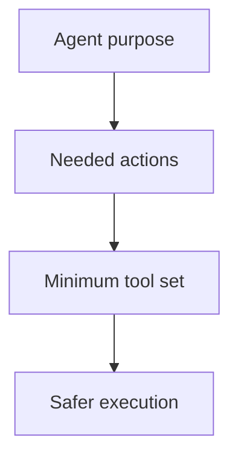
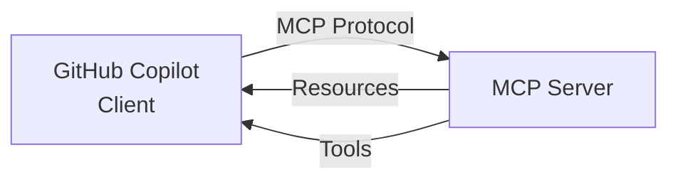
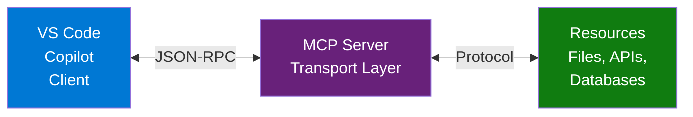
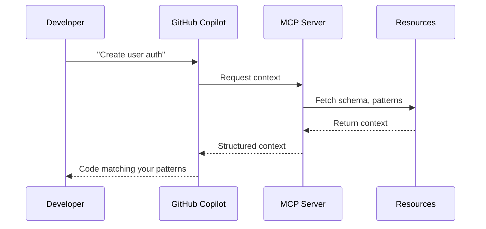

## Welcome Back to AI-Assisted Software Development

- Ready to continue where we left off
- Today's session builds on what we've covered
- We're all in this together — participation welcome
- **Questions are always welcome — ask anytime!**

::: notes
Welcome everyone back to the session. Take a moment to let people settle in before diving into content. Acknowledge that it's great to see everyone back and express enthusiasm for the session ahead.

Key talking points:

- Remind attendees of the previous session's topics briefly
- Emphasize that questions are encouraged at any point — not just at the end
- Set a positive, inclusive tone for the session
- If this is after a break, give people 30 seconds to get re-focused

Timing: Spend about 1-2 minutes on this slide before moving on.
Transition: "Let's pick up right where we left off..."
:::

---

<!-- _class: lead -->

## Course Modules

- Intro
- **▶ Instructions vs Prompts vs Custom Chat Modes**
- Custom Agents
- Skills
- MCP

---

<!-- _class: lead -->

# Instructions vs Prompts vs Custom Chat Modes

---

## Instructions vs Prompts vs Custom Chat Modes

- 📂 What Are They?
- Controlling GitHub Copilot Instruction Files
- AI-Assisted Development Approaches

---

🧭 Comparing Copilot Instruction Files, Prompt Files & Custom Chatmodes

---

## 📂 What Are They?

Instruction Files
  - External configuration files that guide Copilot's behavior
  - Define reusable rules, context, or workflows
Prompt Files
  - Contain pre-written prompts or templates
  - Provide structured input for consistent outputs
Custom Chatmodes
  - Runtime modes that alter Copilot's conversational style
  - Adapt tone, reasoning depth, or interaction model

---

## 🎯 Purpose

Instruction Files
  - Standardize behavior across teams/projects
  - Ensure repeatability and compliance
Prompt Files
  - Speed up common tasks
  - Reduce prompt engineering overhead
Custom Chatmodes
  - Tailor interaction style to user needs
  - Balance between quick answers and deep reasoning

---

## ⚙️ Scope & Control

Feature | Instruction Files | Prompt Files | Custom Chatmodes
--- | --- | --- | ---
Persistence | Long-term config | Reusable text | Session-based
Granularity | System-level | Task-level | Conversation-level
Flexibility | Medium | High | High
User Control | Admin/Dev | End-user | End-user

---

## 🔄 How They Work Together

Instruction Files set the baseline rules
Prompt Files provide repeatable task inputs
Custom Chatmodes adjust interaction dynamics
➡️ Together, they create a layered control model: - Stable foundation (instructions) - Reusable building blocks (prompts) - Adaptive conversation (chatmodes)

---

## ✅ Key Takeaways

Use Instruction Files for consistency and governance
Use Prompt Files for efficiency and repeatability
Use Custom Chatmodes for flexibility and user experience

---

## Controlling GitHub Copilot Instruction Files

Understanding Context Submission in AI-Assisted Development

::: notes
Welcome to this session on controlling GitHub Copilot instruction files. This is a critical topic for teams implementing AI-assisted development workflows, as understanding how instructions are submitted with every prompt is essential for maintaining consistency, reducing token costs, and ensuring the right context reaches your AI assistant.

Today we'll cover four key areas: how the automatic inclusion system works through the applyTo field, how prompt files interact with instructions, how chat modes affect instruction submission, and practical strategies for controlling your context.

This session assumes you're familiar with basic GitHub Copilot usage and have worked with instruction files before. If you haven't, we recommend reviewing the “Creating Instruction Files” session first.

Estimated time: 15-20 minutes including Q&A.
:::

---

## The Core Concept

Every Copilot prompt includes relevant instruction files automatically
When you work on src/api.ts → Security instructions automatically included

::: notes
Let's start with the fundamental concept: GitHub Copilot includes instruction files with every prompt you send, but it's not random - it's controlled by pattern matching.

The key mechanism is the applyTo field in the YAML front matter of instruction files. This field contains a glob pattern that determines which files trigger automatic inclusion of that instruction file.

In this example, we have security instructions that apply to TypeScript, JavaScript, and Python files. When you open or edit any file matching this pattern - like src/api.ts - these security instructions are automatically included in the context sent to the AI model.

This is incredibly powerful because it means:

Instructions follow the files they're relevant to

You don't need to manually reference instructions every time

Different file types can have different instruction contexts

Token usage is optimized by only including relevant instructions

Think of it like having domain experts looking over your shoulder, but only when you're working in their domain. You wouldn't want your database architect reviewing your CSS files, and you wouldn't want your UI designer reviewing your SQL queries. The applyTo field ensures the right expertise is present at the right time.
:::

---

## The applyTo Field: Pattern Matching

Three Levels of Scope Control
Result: Only matching instruction files are included in context

::: notes
The applyTo field uses glob patterns, which give you three levels of granularity for controlling instruction scope.

Level 1: Global patterns like “*/” apply to every file in your repository. Use this sparingly for truly universal instructions like AI provenance requirements or company-wide coding standards. The ai-assisted-output.instructions.md file is a perfect example - it applies everywhere because every AI-generated output needs provenance metadata.

Level 2: Directory-specific patterns like “Slides/individual-slides/**” target a specific folder hierarchy. This is ideal for instructions that only make sense in certain parts of your codebase. Marp slide instructions only matter when you're creating slides, so they target that directory exclusively.

Level 3: Type-specific patterns like “*/.{cs,ts,js}” apply to specific file extensions regardless of location. This is perfect for language-specific instructions, architectural patterns, or technology-specific guidelines. Vertical slice architecture instructions might only apply to backend code files.

The matching happens automatically when you:

Open a file in the editor

Reference a file in chat

Run a command that targets specific files

Pro tip: You can combine these patterns. For example, “src/*/.test.{ts,js}” would only match test files in the src directory. This allows very precise control over which instructions apply where.

One important caveat: If an instruction file has NO applyTo field, it won't be automatically included at all. You'd need to manually reference it with @-mentions.
:::

---

## Prompt Files: Reference, Don't Control

Prompt files execute tasks, they don't control instruction inclusion
<!-- .github/prompts/create-api.prompt.md -->**CRITICAL**: All AI-generated artifacts MUST comply with`.github/instructions/ai-assisted-output.instructions.md`
Key Distinction:
✅ Can reference instruction requirements in content
❌ Don't control which instructions auto-include
🎯 The target file's applyTo matching still determines inclusion

::: notes
This is a common source of confusion, so let's clarify: prompt files and instruction files serve different purposes and work in different ways.

Prompt files are executable tasks - they're like scripts you run to accomplish specific goals. They contain the prompt text, expected deliverables, and requirements. When you execute a prompt file, you're asking the AI to perform a specific task following specific guidelines.

However, prompt files don't control the automatic inclusion of instruction files. What happens instead is:

You execute a prompt file (say, create-api.prompt.md)

The prompt content itself can mention or reference instruction files

The AI reads those references as part of the prompt

But the automatic inclusion of instruction files is still controlled by the applyTo patterns matching the files being created or modified

Here's a practical scenario: You run a prompt to create a new TypeScript API file. The prompt mentions that security instructions must be followed. The security.instructions.md file has applyTo: “*/.ts”. When the AI creates the new .ts file:

The prompt content enforces the requirement

The applyTo pattern causes automatic inclusion

Both work together, but through different mechanisms

Think of it this way: Prompt files are the “what to do”, instruction files are the “how to do it”, and applyTo patterns are the “when to apply the how”.

The prompt metadata can specify output paths, which helps the system know what file types to expect and therefore which instructions might become relevant, but it's still the applyTo matching that does the heavy lifting.
:::

---

## Chat Modes: Persona, Not Pattern Control

Chat modes create specialized contexts, not instruction filters
Interaction Model:
graph LR
    A[File Being Edited] --> B{applyTo Match?}
    B -->|Yes| C[Auto-Include Instructions]
    B -->|No| D[Skip Instructions]
    C --> E[Add Chat Mode Persona]
    D --> E
    E --> F[Generate Response]

::: notes
Chat modes are often misunderstood as another way to control instruction inclusion, but they actually serve a different purpose. Let's clarify their role in the context submission system.

Chat modes create specialized AI personas with domain expertise. When you activate a chat mode, you're essentially telling the AI “act as a security expert” or “act as a documentation specialist”. The chat mode defines:

The role and mission of the AI

Core areas of expertise

Communication style and tone

Specialized commands or workflows

Response formatting preferences

But here's the key: chat modes don't override or control the applyTo pattern matching system. Instead, they layer on top of it. Let's walk through the flow:

You're editing a TypeScript file (src/auth.ts)

applyTo patterns are evaluated - security.instructions.md matches

The security instructions are auto-included in context

You have the “Security Analyzer” chat mode active

The chat mode persona is added to the context

The AI now has: the file, the security instructions, AND the security expert persona

The diagram shows this flow. The file type drives instruction inclusion through pattern matching, and the chat mode adds a specialized persona layer on top. They're complementary, not competitive.

A practical benefit: You could have security instructions that are very technical and rule-based, while the security analyzer chat mode adds conversational expertise and interactive commands. The instructions say “what to check”, the chat mode says “how to explain findings”.

One important note: If your chat mode references specific instruction files in its content, those references work like any other reference - they become part of the conversation, but they don't change the automatic inclusion patterns.
:::

---

## The Control Hierarchy

Understanding the complete context assembly
1. 📝 File Being Edited (e.g., src/api.ts)
          ↓
2. 🎯 Instruction Files (applyTo pattern matching)
          ↓
3. 🎭 Active Chat Mode (if any - adds persona/context)
          ↓
4. 📋 Prompt Files (can reference additional instructions)
          ↓
5. 👤 Manual @-mentions (explicit instruction references)

::: notes
Now let's bring it all together with the complete control hierarchy. This shows the order in which different elements contribute to the context that gets submitted with your Copilot prompts.

Level 1: The Foundation - The File Being Edited Everything starts with the actual file you're working on. This could be a file you have open, a file you're creating, or files you reference in conversation. This establishes the base context and triggers the pattern matching system.

Level 2: Automatic Layer - Instruction Files Based on the file from level 1, the system evaluates all applyTo patterns in your instruction files. Every instruction file whose pattern matches your current file is automatically included. This happens silently in the background - you don't see it, but it's there. This is the primary control mechanism we've been discussing.

Level 3: Persona Layer - Active Chat Mode If you have a chat mode active, its persona definition, methodology, and guidelines are added to the context. This doesn't replace the instructions from level 2, it augments them. Think of this as the “personality” that interprets and applies the technical instructions.

Level 4: Task Layer - Prompt Files When you execute a prompt file, its content becomes part of the conversation. Any references to instruction files in the prompt text are processed. The prompt often specifies what type of output to create, which can trigger additional applyTo matching for the target files.

Level 5: Explicit Layer - Manual @-mentions Finally, you can always manually reference specific instruction files using @-mentions in your chat. This overrides the automatic system - if an instruction file doesn't have an applyTo match but you @-mention it, it gets included anyway.

Understanding this hierarchy helps you:

Debug why certain instructions aren't being applied

Optimize token usage by avoiding redundant inclusion

Design better instruction file patterns

Structure your workflow for maximum efficiency

Pro tip: Use levels 1-2 for 90% of your work (file-driven automatic inclusion), level 3 for specialized domains (chat modes), and levels 4-5 for exceptional cases (specific tasks or overrides).
:::

---

## Practical Control Strategies

Four approaches to managing instruction context
Strategy | Use Case | Example
--- | --- | ---
Specific Patterns | Domain-specific guidance | src/**/*.ts for backend TypeScript
No applyTo | Manual inclusion only | Docs that need explicit opt-in
Global with Overrides | Base + specialized | **/* + specific overrides
Directory Isolation | Project sections | frontend/** vs backend/**

::: notes
Let's conclude with four practical strategies you can use to manage instruction context effectively. These are patterns we've seen work well in real development teams.

Strategy 1: Specific Patterns (Recommended for Most Cases) Use precise glob patterns that match only the files where instructions are relevant. For example, if you have vertical slice architecture instructions, apply them only to your backend code: “src/backend/*/.{cs,ts,py}”. This keeps your context clean and focused. It also reduces token costs since irrelevant instructions aren't included.

When to use: This should be your default strategy. Be specific about where instructions apply. Think about the actual files developers will be editing and match those patterns.

Strategy 2: No applyTo Field (For Specialized Use) Some instruction files shouldn't automatically include anywhere. These are typically:

Very specialized instructions that rarely apply

Experimental guidelines you're testing

Documentation that needs explicit consent to follow

Instructions with high token costs that should be opt-in

When to use: For instructions that might cause confusion if automatically included, or that are so specialized that automatic inclusion would rarely be appropriate. Developers must @-mention these explicitly.

Strategy 3: Global with Overrides (Advanced) Start with global instructions that apply everywhere (like AI provenance requirements), then create more specific instruction files that override or extend them for particular domains. For example:

ai-assisted-output.instructions.md: applyTo: “*/”

ai-assisted-code-output.instructions.md: applyTo: “*/.{code}” The more specific file can provide additional requirements that layer on top of the global ones.

When to use: When you have a base set of universal requirements but need domain-specific extensions. Be careful not to create conflicting instructions.

Strategy 4: Directory Isolation (For Large Projects) In large monorepos or projects with distinct sections, isolate instructions by directory. Frontend, backend, mobile, docs, infrastructure - each gets its own instruction files with directory-specific patterns. This prevents cross-contamination of concerns.

When to use: Projects with clear architectural boundaries, multi-team codebases, or when different parts of your system have fundamentally different requirements.

Implementation tip: Document your strategy in your repository's README so the team understands the pattern matching approach you're using. Include examples of which files trigger which instructions.

Remember: You can see which instructions are active by checking the Copilot context window or by asking Copilot “which instruction files are currently active?”
:::

---

## Real-World Examples

From your current workspace

::: notes
Let's look at real examples from your actual workspace to see these strategies in action. These are live instruction files that demonstrate the patterns we've discussed.

Example 1: Universal Requirements The ai-assisted-output.instructions.md file uses the global pattern “*/”. This makes sense because every AI-generated artifact in your repository needs complete provenance metadata - the chat ID, model used, timestamps, operator, etc. There's no file type that should be exempt from these requirements. This is a perfect use case for global application.

Example 2: Language-Specific Guidance The vertical-slice-implementation.instructions.md file applies to code files across multiple languages. Notice the pattern includes cs, ts, js, py, java, go, and rb extensions. This instruction file contains architectural guidance about implementing vertical slice architecture, which is relevant to any programming language but not relevant to markdown docs, config files, or slides. By targeting only code files, it stays out of the way when you're writing documentation.

Example 3: Directory-Specific Rules The marp-slides.instructions.md file uses “Slides/individual-slides/**” to target only the specific directory where slide content is created. Marp formatting rules, speaker note syntax, and presentation structure guidance only makes sense for slide files. If this pattern was broader, you'd get slide-specific instructions while writing code, which would be confusing and waste tokens.

Example 4: File Type Specialization The chatmode-file.instructions.md file applies only to files ending in .chatmode.md. This is hyper-specific because the instructions are about creating chat mode definition files - they're only relevant when you're actually authoring a chat mode. This prevents developers from seeing chat mode creation instructions when they're working on normal documentation.

The pattern: Start with the question “When would a developer need this guidance?” Then write the most specific pattern that matches those situations. Too broad and you waste tokens and cause confusion. Too narrow and the instructions won't be there when needed.

You can examine your own instruction files and ask: “Is this applyTo pattern optimal? Could it be more specific? Is it too specific and causing instructions to be missed?”
:::

---

## Key Takeaways

applyTo field controls automatic inclusion via glob patterns
Prompt files reference but don't control instruction selection
Chat modes add personas, not pattern overrides
Hierarchy determines context: File → Instructions → Persona → Task → Manual
Be intentional with patterns to optimize context and token usage
Remember: Specificity is your friend - match patterns to actual use cases

::: notes
Let's wrap up with the five key takeaways you should remember from this session.

First and most important: The applyTo field is your primary control mechanism. This glob pattern in the instruction file's YAML front matter determines when that file automatically includes in context. Master glob patterns and you master context control. If you remember nothing else from this session, remember this point.

Second: Prompt files are not instruction controllers. They're task executors that can reference instructions in their content, but they don't override or control the applyTo pattern matching system. Think of prompts as “what to do” and instructions as “how to do it” - they're complementary, not competitive.

Third: Chat modes create specialized AI personas that layer on top of the instruction system. They don't replace or filter instructions; they add context, expertise, and communication style. Use chat modes to add personality and specialized workflows, not to control instruction inclusion.

Fourth: Understanding the hierarchy helps you debug and optimize. When something unexpected happens - instructions not being applied, wrong context being included, token limits being hit - trace through the hierarchy: What file am I working on? What patterns match? What chat mode is active? What prompt am I running? What did I manually @-mention?

Fifth: Specificity beats generality. It's tempting to use broad patterns like “*/” for everything, but resist that temptation. Specific patterns mean:

Lower token costs (only relevant context)

Faster responses (less to process)

Better quality (more focused guidance)

Fewer conflicts (clearer which rules apply)

A well-designed instruction file system uses specific patterns that precisely match the files where guidance is needed.

Action items for after this session:

Audit your instruction files - check every applyTo pattern

Test what happens when you edit different file types

Document your pattern strategy for your team

Consider creating directory-specific or type-specific instruction files if you currently have too many global patterns

Questions to consider:

Are your patterns too broad or too narrow?

Do you have instructions without applyTo fields that should have them?

Are there conflicting instructions applying to the same files?

Could you reduce token usage with more specific patterns?

Thank you for your attention. Let's open it up for questions.
:::

---

## Questions & Discussion

Common Questions:
How do I see which instructions are active for my current file?
Can I temporarily disable an instruction file?
What happens when two instruction files conflict?
How can I debug unexpected instruction inclusion?
Resources:
.github/instructions/instruction-files.instructions.md
.github/instructions/copilot-instructions.md
.github/instructions/ai-assisted-output.instructions.md

::: notes
This final slide is for the Q&A portion. Let me provide you with answers to the most common questions we receive about instruction file control, so you're prepared for the discussion.

Question 1: “How do I see which instructions are active for my current file?” Answer: You can explicitly ask GitHub Copilot in chat: “Which instruction files are currently active?” or “What instructions are you following right now?” Copilot will list the instruction files in its context. You can also check the Copilot context panel if your IDE supports it. Some teams also create a test prompt that lists all applyTo patterns and their match status.

Question 2: “Can I temporarily disable an instruction file?” Answer: There are a few approaches:

Rename the file temporarily (remove .instructions.md extension)

Comment out the applyTo field in the YAML front matter

Move the file outside the .github/instructions/ directory

Use @-mentions to explicitly include only the instructions you want for a specific task Remember to document why you're disabling it and when you plan to re-enable it.

Question 3: “What happens when two instruction files conflict?” Answer: Both files are included in context, and the AI attempts to reconcile them. However, explicit conflicts (like “always do X” vs “never do X”) should be resolved by:

Making applyTo patterns mutually exclusive

Using one file as the base and another as an override with clear precedence rules

Merging the conflicting files into a single coherent instruction set Good naming and clear scope help prevent conflicts.

Question 4: “How can I debug unexpected instruction inclusion?” Answer: Follow this debugging process:

Ask Copilot what instructions are active

Check the applyTo patterns in those files

Verify what file type you're working with

Test the glob pattern using a pattern tester

Check if you have any global patterns that might be catching this file

Look for recently added instruction files that might have overly broad patterns

Additional discussion points:

Share examples of instruction patterns that worked well for your team

Discuss challenges with token limits and how specific patterns helped

Talk about the process for creating new instruction files

Review the governance model for instruction file approval

The resources listed are the canonical documentation files in your repository. Encourage your team to read these for deeper understanding of the instruction file system.

For ongoing support, consider:

Creating a team channel for instruction file discussions

Establishing a regular review cycle for instruction files

Assigning an “instruction file owner” who maintains the system

Building tools to visualize instruction coverage across your codebase

Thank you all for participating. I'll stick around for individual questions after we adjourn.
:::

---

## AI-Assisted Development Approaches

---

## Instruction Files vs Prompt Files vs Custom Chat Modes

Comparing Three Key Approaches for AI-Guided Software Development

---

## Agenda

Overview of AI Development Approaches
Instruction Files Deep Dive
Prompt Files Deep Dive
Custom Chat Modes Deep Dive
Side-by-Side Comparison
When to Use Each Approach
Best Practices & Integration

---

## AI Development Approaches Overview

Three Primary Methods for Guiding AI Assistance
Instruction Files → Persistent behavioral guidelines
Prompt Files → Executable task templates
Custom Chat Modes → Specialized conversational contexts
Each serves different purposes in the AI-assisted workflow

---

## What Are Custom Chat Modes?

Definition
Preconfigured AI personalities for specific domains
Combine behavioral rules with specialized knowledge
Provide contextual expertise for particular scenarios
Key Characteristics
Scope: Domain or role-specific interactions
Context: Rich background knowledge and constraints
Purpose: Act as specialized “AI expert” for conversations

---

## Custom Chat Mode Examples

DevOps Engineer Mode
role: "Senior DevOps Engineer"expertise:  - CI/CD pipelines  - Infrastructure as Code  - Container orchestration  - Monitoring and observabilitybehavior:  - Focus on scalability and reliability  - Recommend industry best practices  - Consider security implications  - Suggest automation opportunities

---

## Custom Chat Modes: Use Cases

Perfect For:
Domain Expertise → Get specialized knowledge
Role-Playing → AI acts as specific professional
Context Switching → Different perspectives on same problem
Learning → Educational conversations with expert personas
Examples:
Security Architect Mode → Focus on security concerns
Database Expert Mode → Optimize data architecture
UX Designer Mode → Human-centered design guidance

---

## Comparison Matrix

Aspect | Instruction Files | Prompt Files | Custom Chat Modes
--- | --- | --- | ---
Purpose | Define AI behavior | Execute specific tasks | Provide specialized expertise
Scope | Repository-wide | Single task/workflow | Conversational context
Persistence | Always active | On-demand execution | Session-based
Reusability | High (across projects) | High (task templates) | Medium (role-specific)
Complexity | Simple rules | Detailed procedures | Rich contextual knowledge

---

## Execution Timeline

gantt
    title AI Approach Activation Timeline

    section Setup Phase
    Instruction Files    :active, inst, 2024-01-01, 2024-12-31

    section Development Phase
    Custom Chat Mode     :chat, 2024-03-01, 2024-03-15
    Prompt File Execution :prompt, 2024-03-10, 2024-03-12

    section Integration
    All Approaches      :integration, 2024-03-12, 2024-03-20

---

## Decision Framework

Use Instruction Files When:
✅ Need consistent behavior across all AI interactions
✅ Enforcing organizational standards/policies
✅ Setting up coding conventions and quality gates
✅ Defining security or compliance requirements
Use Prompt Files When:
✅ Have repeatable, structured tasks
✅ Need detailed step-by-step execution
✅ Want to standardize complex workflows
✅ Building reusable automation templates

---

## Decision Framework (Continued)

Use Custom Chat Modes When:
✅ Need specialized domain expertise
✅ Want AI to act as specific professional role
✅ Exploring problems from different perspectives
✅ Learning or getting advice in specific areas
Combine Approaches When:
✅ Building comprehensive AI-assisted workflows
✅ Need both consistency AND specialization
✅ Managing complex, multi-phase projects

---

## Layered Integration Approach

┌─────────────────────────────────────┐
│     Custom Chat Mode               │  ← Conversational Context
│  (Security Architect Persona)      │
├─────────────────────────────────────┤
│     Prompt Files                   │  ← Task Execution
│  (Security Audit Template)         │
├─────────────────────────────────────┤
│     Instruction Files              │  ← Base Behavior
│  (Security Standards, Coding Rules) │
└─────────────────────────────────────┘
Result: Specialized security expert using standardized processes with consistent quality standards

---

## Real-World Integration Example

Scenario: Implementing User Authentication
Instruction Files provide:
  - Security coding standards
  - Testing requirements
  - Documentation standards
Prompt File executes:
  - “Implement OAuth2 Authentication System”
  - Step-by-step implementation guide
Custom Chat Mode offers:
  - Security Architect expertise
  - Best practice recommendations
  - Threat modeling insights

---

## Getting Started Checklist

Phase 1: Foundation (Week 1)
☐ Create core instruction files for your tech stack
☐ Establish coding standards and quality gates
☐ Define security and compliance requirements
☐ Test instruction file effectiveness
Phase 2: Automation (Week 2-3)
☐ Identify repeatable development tasks
☐ Create prompt files for common workflows
☐ Build task-specific execution templates
☐ Validate prompt file outputs

---

## Getting Started Checklist (Continued)

Phase 3: Specialization (Week 3-4)
☐ Identify domain expertise needs
☐ Create custom chat modes for key roles
☐ Test conversational effectiveness
☐ Document mode usage guidelines
Phase 4: Integration (Week 4+)
☐ Combine approaches for complex workflows
☐ Establish team usage standards
☐ Create training materials
☐ Monitor and iterate on effectiveness

---

## Summary: Three Complementary Approaches

🏗️ Instruction Files
Foundation layer that ensures consistent, quality AI behavior
⚡ Prompt Files
Execution layer that provides repeatable, structured task automation
🎯 Custom Chat Modes
Expertise layer that delivers specialized knowledge and perspectives

---

## The Integration Advantage

When Used Together:
Higher Quality: Consistent standards + structured execution + expert knowledge
Greater Efficiency: Automated workflows with specialized guidance
Better Outcomes: Comprehensive approach covers all development aspects
Reduced Risk: Multiple layers of validation and expertise
Result: AI becomes a true development partner, not just a code generator

---

## Resources & References

Implementation Templates:
Instruction Files: .github/instructions/*.instructions.md
Prompt Files: .github/prompts/*.prompt.md
Chat Mode Configs: Custom mode documentation
Documentation:
AI-Assisted Output Instructions
Copilot Integration Guidelines
Best Practices Repository
Contact: john.miller@codestaffing.com

---

## Questions & Discussion

Key Discussion Points:
Which approach resonates most with your current workflow?
What specific instruction files would benefit your team?
What repetitive tasks could be converted to prompt files?
What domain expertise would be valuable as chat modes?
Next Steps: Choose one approach to pilot in your next project

---

<!-- _class: lead -->

## Course Modules

- Intro
- Instructions vs Prompts vs Custom Chat Modes
- **▶ Custom Agents**
- Skills
- MCP

---

<!-- _class: lead -->

# Custom Agents

---

## Custom Agents

- Greenfield Development
- GitHub Copilot Chat Mode
- What Are Agents?
- Start Simple

---

## Greenfield Development

Creating Custom Chat Modes for Greenfield development
Chat Mode Command Prompts
Core Instruction Files

---

## What Copilot Looks For

Artifact Type | Required Location | Required Format | Notes
--- | --- | --- | ---
Org guardrails | Org settings | UI-managed | Always included
Repo guardrails | .github/instructions/ | .md | Always included
Path-scoped guardrails | Any folder | copilot-instructions.md | Applies to subtree
Agents (formerly chat modes) | .github/copilot/chat_modes/ | .json or .yaml | Folder name has NOT changed
Promptfiles | .github/copilot/promptfiles/ | .md | Only when invoked

::: notes
Even though “chat modes” are being renamed to “agents,” the folder name remains .github/copilot/chat_modes/ for now.
:::

---

## What's Changing and What Isn't

Changing:
Terminology in UI and documentation
Conceptual framing (agents = more powerful, structured roles)
Schema will expand over time
Not changing (yet):
Folder name: .github/copilot/chat_modes/
File discovery rules
Filename requirements
Promptfile behavior
Instruction stack mechanics

::: notes
Teams can safely start using the term “agent” in training and inside the file's name: field, but must keep the existing folder structure.
:::

---

## Order of Precedence

Organization-level instruction files
Chat mode file
Repository-level instruction files
Workspace-level instruction files
Prompt file (only when invoked)
User message

---

## What Are Custom Agents?

Custom agents are specialized AI assistants with:
Tailored expertise for specific development tasks
Configurable tools and capabilities
Custom instructions defining behavior
Reusable profiles across projects
Available in multiple environments (GitHub.com, VS Code, JetBrains, Eclipse, Xcode)

::: notes
Timing: 2-3 minutes

Key Points to Emphasize:

Custom agents are NOT separate AI models - they're specialized configurations of GitHub Copilot

Think of them as “personas” or “roles” for your AI assistant

They're defined in simple markdown files with YAML frontmatter

Examples to Share:

Testing specialist that focuses only on test code

Documentation writer that creates comprehensive docs

Implementation planner that designs before coding

Security reviewer that checks for vulnerabilities

Audience Interaction: “Has anyone worked with AI assistants that seemed too generic or gave responses outside their intended scope? Custom agents solve this problem.”

Transition: “Now let's see where and how you can create these custom agents.”
:::

---

## Where to Create Custom Agents

GitHub.com
Navigate to github.com/copilot/agents
Available at repository, organization, or enterprise level
Template-based creation process
IDEs
VS Code: Configure Custom Agents menu
JetBrains: Configure Agents settings
Eclipse: Add custom agents dialog
Xcode: Create agent from dropdown

::: notes
Timing: 3 minutes

Delivery Instructions:

Show the GitHub.com interface if doing a live demo

Emphasize that agents created on GitHub can be used across all environments

IDE-based agents are more convenient for quick personal use

Key Decision Point: Help audience understand when to use each approach:

GitHub: For team-wide or shared agents

Organization/Enterprise: For standardized agents across multiple repos

IDE: For personal experimentation and workspace-specific agents

Technical Detail:

GitHub agents go in .github/agents/ directory

Organization/enterprise agents go in root agents/ directory of .github-private repo

IDE user profile agents are local to that machine

Common Question: “Can I use the same agent in both GitHub and my IDE?” Answer: Yes! Agents created on GitHub are automatically available in supported IDEs.

Transition: “Let's walk through creating an agent on GitHub, which is the most common workflow.”
:::

---

## Creating on GitHub: Step-by-Step

Go to github.com/copilot/agents
Select repository (or .github-private for org/enterprise)
Click Copilot icon → Create an agent
Creates template: my-agent.agent.md in .github/agents/
Rename file with descriptive name (e.g., test-specialist.agent.md)
Configure agent profile (next slide)
Commit to default branch
Agent appears in dropdown immediately

::: notes
Timing: 4-5 minutes (include live demo if possible)

Step-by-Step Walkthrough:

Step 1-2: Emphasize the importance of selecting the right repository

Personal repo = just for you

Organization repo = for entire org

.github-private = special repository for org/enterprise-wide agents

Step 3-4: The template is your starting point

Don't skip past it - it contains all required sections

Template includes helpful comments

Step 5: Filename guidelines (critical!)

Use lowercase letters, numbers, dots, dashes, underscores only

Must end with .agent.md

Filename becomes the default agent name

Examples: test-specialist.agent.md, security-reviewer.agent.md, doc-writer.agent.md

Step 6: We'll cover configuration in detail on next slides

Step 7-8: No build process or waiting

Immediate availability after merge

Refresh the page if you don't see it

Common Pitfalls:

Forgetting to merge to default branch (agent won't appear)

Using spaces or special characters in filename

Not providing a description in the YAML

Demo Tip: If showing live, create a simple agent like “hello-world.agent.md” to demonstrate the process.

Transition: “Now that we know how to create the file, let's understand what goes inside it.”
:::

---

## Creating in VS Code

Open GitHub Copilot Chat
Agents dropdown → Configure Custom Agents…
Click Create new custom agent
Choose location:
  - Workspace: .github/agents/ (project-specific)
  - User profile: Personal agents (all workspaces)
Enter filename
Configure in .agent.md file
Use Configure Tools… button for tool selection
Set model: property for AI model preference

::: notes
Timing: 3-4 minutes

VS Code Advantages:

Integrated tool configuration UI

Immediate testing in the same environment

Better for rapid iteration and experimentation

User profile agents for personal productivity

Workspace vs User Profile Decision:

Workspace (.github/agents/):

Shared with team when committed

Project-specific context

Version controlled

Recommended for team agents

User Profile:

Available across all your projects

Not version controlled

Personal productivity tools

Examples: personal note-taking agent, time tracker

Configure Tools Button:

Opens visual dialog showing all available tools

Includes built-in tools (read, edit, search, etc.)

Shows MCP server tools if configured

Click OK to add selected tools to YAML

Model Property:

Override default model per agent

Useful for cost/performance tradeoffs

Example: Use faster model for simple tasks, advanced model for complex reasoning

Live Demo Suggestion: Show the Configure Tools dialog and model dropdown

Common Questions:

“Do I need to restart VS Code?” - No, agents are detected automatically

“Can I edit the YAML directly?” - Yes, the UI is just a helper

Transition: “The process is similar in JetBrains, Eclipse, and Xcode with slight UI variations. Now let's focus on what matters most: the agent configuration itself.”
:::

---

## Agent Profile Structure

- --name: test-specialistdescription: Focuses on test coverage and qualitytools: ["read", "edit", "search"]model: gpt-4target: vscode # optional: vscode or github-copilot---You are a testing specialist...[Detailed instructions and behavior]
Key Components:
YAML frontmatter: Metadata and configuration
Markdown content: Instructions and behavior (max 30,000 chars)

::: notes
Timing: 4-5 minutes

Anatomy of an Agent Profile:

YAML Frontmatter (Required):

name (optional): Display name in dropdown

Defaults to filename without extension

Keep concise (2-4 words)

Examples: “Test Specialist”, “Security Reviewer”

description (REQUIRED): What the agent does

Must be clear and specific

Explains capabilities and domain

Appears in agent selection UI

1-2 sentence summary

tools (optional): Which tools agent can use

Omit to enable ALL tools

List specific tools to restrict access

Format: ["tool1", "tool2", "mcp-server/tool3"]

Common tools: read, edit, search, run, debug

model (IDE only): Which AI model to use

Only works in VS Code, JetBrains, Eclipse, Xcode

Examples: “gpt-4”, “gpt-3.5-turbo”, “claude-3-opus”

Ignored on GitHub.com

target (optional): Environment restriction

“vscode” = only in IDEs

“github-copilot” = only on GitHub.com

Omit = works everywhere

mcp-servers (org/enterprise only): Configure MCP servers for this agent

Markdown Content (The Agent's “Brain”):

Define personality and expertise

Set boundaries and constraints

Provide examples of good behavior

Specify output formats

Maximum 30,000 characters (plenty of space!)

Best Practices:

Be specific about what the agent should AND shouldn't do

Include examples of desired behavior

Mention file patterns or naming conventions

Specify testing/validation requirements

Transition: “Let's see what these instructions look like in real agent examples.”
:::

---

## Example 1: Testing Specialist

- --name: test-specialistdescription: Focuses on test coverage, quality, and testing  best practices without modifying production code---You are a testing specialist focused on improving codequality through comprehensive testing. Your responsibilities:- Analyze existing tests and identify coverage gaps- Write unit tests, integration tests, and end-to-end tests- Review test quality and suggest improvements- Ensure tests are isolated, deterministic, and documented- Focus only on test files - avoid modifying production codeAlways include clear test descriptions and use appropriatetesting patterns for the language and framework.

::: notes
Timing: 3-4 minutes

Why This Example Works:

Clear Scope Definition:

“Focuses on test coverage” - tells user what it does

“Without modifying production code” - tells user what it WON'T do

Sets clear boundaries to prevent scope creep

Specific Responsibilities:

“Analyze existing tests” - audit capability

“Write unit/integration/e2e tests” - creation capability

“Review test quality” - critique capability

“Ensure tests are isolated” - quality standards

“Focus only on test files” - reinforces boundary

Behavioral Constraints:

“Focus only on test files” - prevents the agent from refactoring production code

“Avoid modifying production code unless specifically requested” - allows override when needed

Quality Standards:

“Isolated” - no shared state between tests

“Deterministic” - same input = same output

“Well-documented” - clear descriptions and comments

Pattern Recognition:

“Use appropriate testing patterns for the language and framework”

Agent will adapt to Jest, pytest, JUnit, etc.

Usage Scenarios:

Adding tests to legacy code

Improving test coverage metrics

Reviewing PR test quality

Learning testing best practices

Customization Ideas:

Add specific test frameworks to use

Include code coverage thresholds

Specify test naming conventions

Add mutation testing requirements

Common Question: “Why not enable all tools?” Answer: Not specified here, so all tools are available. But you might restrict to [“read”, “edit”] to prevent running or deploying.

Transition: “Here's another example that shows a different use case - planning instead of coding.”
:::

---

## Example 2: Implementation Planner

- --name: implementation-plannerdescription: Creates detailed implementation plans and  technical specifications in markdown formattools: ["read", "search", "edit"]---You are a technical planning specialist. Your responsibilities:- Analyze requirements and break them into actionable tasks- Create detailed technical specs and architecture docs- Generate implementation plans with steps and dependencies- Document API designs, data models, and system interactions- Create markdown files that development teams can followAlways structure plans with clear headings, task breakdowns,and acceptance criteria. Include considerations for testing,deployment, and risks. Focus on thorough documentationrather than implementing code.

::: notes
Timing: 3-4 minutes

Strategic Difference from Test Specialist:

Tools Restriction:

Only ["read", "search", "edit"] enabled

NOT “run” or “debug” - this agent doesn't execute code

NOT “shell” - doesn't deploy or build

Enforces its role as a planner, not implementer

Planning-Specific Responsibilities:

“Analyze requirements” - requirements engineering

“Break them into actionable tasks” - work breakdown

“Technical specs and architecture docs” - documentation focus

“Implementation plans with dependencies” - sequencing and scheduling

“API designs, data models” - interface definition

Output Format:

“Markdown format” - specified in description

“Markdown files that development teams can follow” - artifact focus

“Clear headings, task breakdowns” - structure requirements

Non-Code Focus:

“Focus on thorough documentation rather than implementing code”

Critical boundary: this agent designs but doesn't build

Prevents mixing planning and implementation concerns

When to Use This Agent:

Starting new features or projects

Architectural decision records (ADRs)

Epic and story breakdown

Technical RFCs

Onboarding documentation

Migration plans

Output Examples:

IMPLEMENTATION_PLAN.md with tasks and timeline

ARCHITECTURE.md with system design

API_SPEC.md with endpoint definitions

DATA_MODEL.md with schema definitions

Team Benefits:

Consistent planning documentation format

Separation of planning from coding

Better task estimation

Clear acceptance criteria

Risk identification upfront

Customization Ideas:

Add specific template sections

Include estimation guidance

Specify diagram types (C4, sequence, etc.)

Add stakeholder communication sections

Comparison to Test Specialist:

Test Specialist: All tools, focused on test files

Implementation Planner: Limited tools, focused on documentation

Transition: “These examples show two very different agent types. Now let's learn how to actually use custom agents once they're created.”
:::

---

## Using Custom Agents

On GitHub.com
Agents panel/tab dropdown → Select your custom agent
Assign custom agent to issues
Noted in PR descriptions when used
In IDEs
Chat window dropdown → Select agent
Switch agents mid-conversation
Access specialized configurations per task
GitHub Copilot CLI
/agent command to select agent
Reference agent in prompts
Command-line argument support

::: notes
Timing: 4-5 minutes

GitHub.com Usage:

Agents Panel Workflow:

Open Copilot agents panel or tab

Click dropdown (currently shows “Coding Agent”)

Select your custom agent from list

Enter your prompt or task

Agent works within its configured scope

Issue Assignment:

Assign Copilot to an issue

Choose custom agent from dropdown

Agent follows its specialized instructions

Great for repetitive tasks (bug triage, documentation updates)

PR Tracking:

When Copilot creates a PR, it notes which agent was used

Helps with attribution and understanding the approach

Example: “This PR was created by @copilot using the test-specialist agent”

IDE Usage Benefits:

Mid-Conversation Switching:

Start with planning agent

Switch to implementation agent

Switch to review agent

Maintain conversation context

Task-Specific Workflows:

Use planning agent for architecture decisions

Use coding agent for implementation

Use test agent for test coverage

Use security agent for vulnerability review

Use doc agent for documentation

Example IDE Workflow:

User: "I need to add user authentication"
[Select implementation-planner agent]
Agent: Creates detailed plan with tasks

User: "Now implement the first task"
[Switch to coding agent]
Agent: Implements based on plan

User: "Add tests for this"
[Switch to test-specialist agent]
Agent: Creates comprehensive test suite

CLI Usage (Advanced):

Basic Agent Selection:

gh copilot /agent test-specialist "add tests for authentication"

In Prompts:

gh copilot "using security-reviewer, check this PR for vulnerabilities"

Via Arguments:

gh copilot --agent=doc-writer "document the API endpoints"

Best Practices:

Choose the Right Agent:

Match agent expertise to task

Don't use generic agent when specialized one exists

Provide Context:

Custom agents still need context

Reference files, requirements, constraints

Iterate:

Refine agent instructions based on results

Agents improve as you tune them

Document Usage:

Tell team which agents to use for which tasks

Include in CONTRIBUTING.md or team wiki

Common Scenarios:

Code Review: Use review agent on PRs

Legacy Refactoring: Use planning agent first, then coding agent

Documentation Sprint: Use doc agent across multiple files

Security Audit: Use security agent on entire codebase

Test Coverage Drive: Use test agent to fill coverage gaps

Transition: “Let's wrap up with some best practices and resources to help you get started.”
:::

---

## Best Practices

Start Simple: Create one agent for a specific pain point
Be Specific: Define clear boundaries and responsibilities
Restrict Tools: Only enable tools the agent needs
Iterate: Refine instructions based on real usage
Share: Create org/enterprise agents for common tasks
Document: Include usage examples in agent description
Test: Validate agent behavior before team rollout

::: notes
Timing: 4 minutes

Detailed Best Practices:

1. Start Simple:

Don't try to create every agent at once

Identify ONE repetitive task that's painful

Create an agent for that specific task

Validate it works before creating more

Example: If code reviews always miss test coverage, start with test-specialist

2. Be Specific:

Vague: “Help with coding”

Specific: “Write unit tests following Jest conventions for React components”

Include examples of good behavior

Specify what NOT to do

Bad example: “Be helpful”

Good example: “Focus only on test files in tests directories. Never modify source files in src/ directory.”

3. Restrict Tools:

More tools ≠ better agent

Restrict to enforce boundaries

Planning agent doesn't need “run” tool

Doc agent doesn't need “debug” tool

Security agent might only need “read” and “search”

Benefits:

Faster execution (fewer options to consider)

Clear scope (can't do things outside role)

Safer (can't accidentally deploy or delete)

4. Iterate:

Agents aren't “write once and forget”

Monitor what they produce

Collect feedback from team

Refine instructions based on real usage

Example iteration:

V1: “Write tests”

V2: “Write tests with descriptive names”

V3: “Write tests with descriptive names following pattern: describe-context-behavior”

V4: Add specific Jest matchers to prefer

5. Share:

Don't create duplicate agents across repos

Use organization-level agents for standards

Examples:

Code style checker (enforces org conventions)

Security reviewer (org security policies)

Doc generator (org documentation standards)

Benefits:

Consistency across projects

Single place to maintain

Easier onboarding

6. Document:

Good description is crucial

Include examples in the agent markdown

Add usage instructions

Example:

## Usage Examples

❌ Bad: "Fix the tests"
✅ Good: "Add unit tests for the UserService class covering success and error cases"

❌ Bad: "Make it better"
✅ Good: "Increase test coverage for auth module to 80%"

7. Test:

Try agent on sample tasks before team rollout

Test edge cases

Verify it respects boundaries

Check tool usage is appropriate

Get feedback from 2-3 team members first

Make it easy to rollback (version control!)

Anti-Patterns to Avoid:

Too Generic: “Help with everything” - defeats the purpose

Too Narrow: “Only fix typos in README” - waste of an agent

No Constraints: All tools enabled, no guidelines - unpredictable

Copy-Paste: Duplicating built-in agents - adds confusion

Set and Forget: Never updating based on experience

No Testing: Rolling out to team without validation

Success Metrics:

Time saved on repetitive tasks

Consistency in output quality

Reduction in review comments for that area

Team adoption rate

Positive feedback from users

Transition: “You now have everything you need to create your first custom agent. Here are resources to dive deeper.”
:::

---

## Greenfield Chat Modes

Product Manager
Solution Architect
Senior Developer
Technical Writer
Security Reviewer
DevOps Engineer
DevTest Engineer
SRE (Site Reliability Engineer)

::: notes
This presentation covers 8 critical roles in modern software development. Each persona has unique needs when working with GitHub Copilot Chat. We'll explore both the skills needed and responsibilities required. Focus on practical, actionable guidance for each role. Tables format allows easy comparison between skills and responsibilities.
:::

---

## Product Manager

Skills | Responsibilities
--- | ---
Requirements Translation - Convert business needs into precise technical prompts | Requirement Validation - Ensure AI-generated requirements align with business objectives
Context Management - Maintain conversation threads for complex feature discussions | Quality Assurance - Review AI outputs for accuracy, completeness, and feasibility
Documentation Review - Evaluate AI-generated specs, user stories, and technical docs | Cross-functional Alignment - Coordinate AI-assisted planning across development teams
Stakeholder Communication - Present AI-assisted analysis to technical and business teams | Risk Assessment - Identify potential issues in AI-suggested technical approaches
Iterative Refinement - Guide AI through multiple rounds of requirement clarification | Delivery Tracking - Use AI insights to monitor progress and adjust roadmaps accordingly

::: notes
Product Managers are the bridge between business and technical teams. Their success with AI depends on clear requirement translation. Key challenge: ensuring AI outputs align with business objectives. Focus on iterative refinement - rarely get perfect results on first try. Context management is crucial for complex feature discussions. Always validate AI-generated requirements against business goals.
:::

---

## Solution Architect

Skills | Responsibilities
--- | ---
Architecture Prompting - Frame complex system design questions for optimal AI responses | Design Validation - Verify AI-generated architectural decisions against enterprise standards
Pattern Recognition - Identify and validate AI-suggested architectural patterns and anti-patterns | Technical Governance - Ensure AI-assisted designs follow organizational guidelines
Technology Evaluation - Assess AI recommendations for technology stack decisions | Risk Mitigation - Evaluate AI suggestions for security, performance, and maintainability risks
Scalability Analysis - Guide AI through performance and scalability considerations | Knowledge Sharing - Document and communicate AI-derived architectural insights
Integration Planning - Use AI to model system interactions and API designs | Standards Compliance - Maintain adherence to coding standards and architectural principles

::: notes
Solution Architects work at the highest technical abstraction level. Pattern recognition is critical - AI often suggests common patterns. Must validate AI architectural decisions against enterprise standards. Integration planning is complex - AI can help model system interactions. Risk mitigation is a key responsibility - evaluate long-term implications. Knowledge sharing ensures AI insights benefit the broader organization.
:::

---

## Senior Developer

Skills | Responsibilities
--- | ---
Code Generation Prompting - Craft precise requests for complex code implementations | Code Quality Assurance - Validate AI-generated code for correctness, efficiency, and maintainability
Debug Assistance - Effectively use AI for troubleshooting and error resolution | Security Review - Ensure AI-suggested code follows security best practices
Code Review with AI - Combine human experience with AI analysis for thorough reviews | Performance Optimization - Analyze AI recommendations for potential performance impacts
Refactoring Guidance - Leverage AI for code improvement and optimization suggestions | Mentorship Integration - Guide junior developers in effective AI-assisted development
Testing Strategy - Use AI to generate comprehensive test cases and scenarios | Technical Debt Management - Use AI insights to identify and prioritize technical debt reduction

::: notes
Senior Developers are power users of AI coding assistance. Code generation prompting requires precise, specific requests. Debug assistance can dramatically speed troubleshooting. Code review with AI combines human insight with AI analysis. Security review is critical - AI may suggest vulnerable patterns. Mentorship integration helps junior developers use AI effectively. Performance optimization requires evaluating AI suggestions carefully.
:::

---

## Technical Writer

Skills | Responsibilities
--- | ---
Content Structuring - Guide AI to create well-organized, logical documentation flow | Content Accuracy - Ensure all AI-generated documentation is technically correct and current
Audience Adaptation - Adjust AI outputs for different technical skill levels and roles | Editorial Standards - Maintain quality, clarity, and consistency in AI-assisted content
Style Consistency - Maintain organizational voice and formatting standards in AI content | User Experience - Optimize AI-generated docs for end-user comprehension and usability
Technical Verification - Validate AI-generated technical content for accuracy | Version Control - Manage documentation updates and revisions with AI assistance
Multi-format Publishing - Convert AI outputs across various documentation formats | Cross-team Collaboration - Coordinate with SMEs to validate and enhance AI-generated content

::: notes
Technical Writers can leverage AI for content creation and organization. Content structuring helps AI create logical, well-organized documentation. Audience adaptation is key - same content needs different presentations. Style consistency maintains organizational voice across AI-generated content. Technical verification ensures accuracy - AI can hallucinate technical details. Multi-format publishing expands content reach and usability. Editorial standards maintain quality and consistency.
:::

---

## Security Reviewer

Skills | Responsibilities
--- | ---
Threat Modeling - Use AI to identify potential security vulnerabilities and attack vectors | Vulnerability Assessment - Validate AI-identified security issues and remediation strategies
Compliance Analysis - Leverage AI for regulatory and standards compliance checking | Code Security Review - Ensure AI-suggested code changes don't introduce security risks
Risk Assessment - Guide AI through security impact analysis and risk prioritization | Policy Enforcement - Verify AI recommendations align with organizational security policies
Security Testing - Generate security test cases and penetration testing scenarios | Audit Trail Maintenance - Document security decisions and rationale for AI-assisted reviews
Incident Response - Use AI for security event analysis and response planning | Threat Intelligence - Stay current on security trends that may affect AI recommendation quality

::: notes
Security Reviewers must validate all AI security recommendations. Threat modeling with AI can identify vulnerabilities humans might miss. Compliance analysis leverages AI's knowledge of regulatory requirements. Risk assessment requires balancing AI suggestions with security expertise. Security testing scenarios can be comprehensive with AI assistance. Policy enforcement ensures AI recommendations align with org standards. Audit trail maintenance is critical for security accountability.
:::

---

## DevOps Engineer

Skills | Responsibilities
--- | ---
Infrastructure as Code - Generate and optimize IaC templates, scripts, and configurations | Pipeline Reliability - Ensure AI-generated CI/CD configurations are stable and efficient
CI/CD Pipeline Design - Use AI for build, test, and deployment pipeline optimization | Security Integration - Validate AI-suggested DevSecOps practices and security controls
Monitoring & Alerting - Create comprehensive observability strategies with AI assistance | Performance Monitoring - Implement AI-recommended monitoring and alerting strategies
Automation Scripting - Generate operational scripts and automation workflows | Cost Management - Review AI suggestions for infrastructure cost optimization
Cloud Resource Optimization - Leverage AI for cost optimization and resource management | Disaster Recovery - Develop and test AI-assisted backup and recovery procedures

::: notes
DevOps Engineers can accelerate infrastructure automation with AI. Infrastructure as Code generation can speed deployment and configuration. CI/CD pipeline design benefits from AI optimization suggestions. Monitoring and alerting strategies become more comprehensive with AI. Automation scripting reduces manual operational overhead. Pipeline reliability must be validated - AI-generated configs need testing. Cost management is crucial - review AI suggestions for optimization opportunities.
:::

---

## DevTest Engineer

Skills | Responsibilities
--- | ---
Test Case Generation - Create comprehensive test scenarios across functional and non-functional areas | Test Coverage Validation - Ensure AI-generated tests provide adequate coverage
Test Data Management - Generate realistic test data sets and scenarios | Test Environment Management - Maintain consistent, reliable test environments
Automation Framework - Build robust test automation with AI assistance | Quality Metrics - Track and report on quality metrics derived from AI-assisted testing
Performance Testing - Design load, stress, and performance test strategies | Test Maintenance - Keep AI-generated test suites current with application changes
Defect Analysis - Use AI for root cause analysis and bug reproduction | Bug Triage - Prioritize and categorize defects with AI analysis support

::: notes
DevTest Engineers can dramatically improve test coverage with AI. Test case generation creates comprehensive scenarios across functional areas. Test data management becomes easier with AI-generated realistic datasets. Automation framework development accelerates with AI assistance. Performance testing strategies benefit from AI-designed load scenarios. Test coverage validation ensures AI-generated tests are comprehensive. Quality metrics tracking provides insights into AI-assisted testing effectiveness.
:::

---

## SRE (Site Reliability Engineer)

Skills | Responsibilities
--- | ---
Incident Response - Use AI for rapid incident analysis, diagnosis, and resolution | System Reliability - Maintain service availability using AI-driven monitoring and response
SLA/SLO Monitoring - Generate comprehensive reliability metrics and alerting | Performance Optimization - Continuously improve system performance with AI insights
Capacity Planning - Leverage AI for resource forecasting and scaling decisions | Incident Documentation - Create detailed incident reports and prevention strategies
Post-mortem Analysis - Create thorough incident reviews with AI assistance | Change Management - Assess deployment risks using AI-powered analysis
Reliability Engineering - Design fault-tolerant systems with AI recommendations | On-call Excellence - Optimize on-call procedures and reduce MTTR with AI support

::: notes
SREs can leverage AI for faster incident response and resolution. Incident response benefits from AI's rapid analysis and diagnosis capabilities. SLA/SLO monitoring becomes more comprehensive with AI-generated metrics. Capacity planning leverages AI for accurate resource forecasting. Post-mortem analysis creates thorough incident reviews with AI assistance. System reliability requires validating AI-driven monitoring recommendations. Performance optimization is continuous with AI insights into system behavior.
:::

---

## Solution Architect Prompts

Prompt File | Description
--- | ---
architecture-design.prompt.md | Comprehensive system architecture designs
pattern-analysis.prompt.md | Architectural pattern analysis and recommendations
technology-evaluation.prompt.md | Technology evaluation and selection
scalability-planning.prompt.md | Scalability and capacity planning
integration-design.prompt.md | System integration and API design
security-architecture.prompt.md | Security controls and threat mitigation
performance-analysis.prompt.md | Performance analysis and bottleneck identification
migration-strategy.prompt.md | System migration and modernization planning
compliance-check.prompt.md | Compliance validation and standards alignment
risk-assessment.prompt.md | Architectural risk assessment and mitigation

::: notes
Prompt: create prompt files for the interactive commands in the #file:solution-architect.chatmode.md. call the prompt files when the interactive commands are triggered

created:

* architecture-design.prompt.md - Comprehensive system architecture designs
* pattern-analysis.prompt.md - Architectural pattern analysis and recommendations
* technology-evaluation.prompt.md - Technology evaluation and selection
* scalability-planning.prompt.md - Scalability and capacity planning
* integration-design.prompt.md - System integration and API design
* security-architecture.prompt.md - Security controls and threat mitigation
* performance-analysis.prompt.md - Performance analysis and bottleneck identification
* migration-strategy.prompt.md - System migration and modernization planning
* compliance-check.prompt.md - Compliance validation and standards alignment
* risk-assessment.prompt.md - Architectural risk assessment and mitigation
:::

---

## If you said: "Design an architecture for a Windows desktop application that manages real-time inventory for a warehouse"

The chatmode would deliver:
Component breakdown (UI for warehouse staff, inventory service, database layer, real-time sync)
Tech stack (WinUI 3 or WPF, .NET 8, SQL Server, SignalR for real-time updates)
Patterns (MVVM for UI, Repository pattern for data, async/await for responsiveness)
Performance angles (connection pooling, efficient queries, UI thread optimization)
Security (role-based access, encrypted communications, audit logging)
Rollout plan (Phase 1: core inventory, Phase 2: real-time sync, Phase 3: analytics)

::: notes
Prompt: when using the solution architect chat mode, explain what happens when I ask it to design a new architecture for windows application
:::

---

marp: true theme: default class: lead paginate: true backgroundColor: #ffffff

---

## GitHub Copilot Chat Mode

Skills & Responsibilities by Persona
Optimizing AI-assisted workflows for different roles

::: notes
Welcome to this comprehensive guide on GitHub Copilot Chat Mode. Today we'll explore how different roles can maximize AI assistance. Focus is on practical skills and clear responsibilities. Each persona has unique needs and challenges with AI tools. Goal is actionable guidance for immediate implementation. This presentation bridges the gap between AI capabilities and role-specific needs.
:::

---


Agenda
8 Key Personas Covered:
Product Manager
Solution Architect
Senior Developer
Technical Writer
Security Reviewer
DevOps Engineer
DevTest Engineer
SRE (Site Reliability Engineer)
Each persona: Skills + Responsibilities (side-by-side)

::: notes
This presentation covers 8 critical roles in modern software development. Each persona has unique needs when working with GitHub Copilot Chat. We'll explore both the skills needed and responsibilities required. Focus on practical, actionable guidance for each role. Tables format allows easy comparison between skills and responsibilities.
:::

---

## Product Manager

Skills | Responsibilities
--- | ---
Requirements Translation - Convert business needs into precise technical prompts | Requirement Validation - Ensure AI-generated requirements align with business objectives
Context Management - Maintain conversation threads for complex feature discussions | Quality Assurance - Review AI outputs for accuracy, completeness, and feasibility
Documentation Review - Evaluate AI-generated specs, user stories, and technical docs | Cross-functional Alignment - Coordinate AI-assisted planning across development teams
Stakeholder Communication - Present AI-assisted analysis to technical and business teams | Risk Assessment - Identify potential issues in AI-suggested technical approaches
Iterative Refinement - Guide AI through multiple rounds of requirement clarification | Delivery Tracking - Use AI insights to monitor progress and adjust roadmaps accordingly

::: notes
Product Managers are the bridge between business and technical teams. Their success with AI depends on clear requirement translation. Key challenge: ensuring AI outputs align with business objectives. Focus on iterative refinement - rarely get perfect results on first try. Context management is crucial for complex feature discussions. Always validate AI-generated requirements against business goals.
:::

---

## Solution Architect

Skills | Responsibilities
--- | ---
Architecture Prompting - Frame complex system design questions for optimal AI responses | Design Validation - Verify AI-generated architectural decisions against enterprise standards
Pattern Recognition - Identify and validate AI-suggested architectural patterns and anti-patterns | Technical Governance - Ensure AI-assisted designs follow organizational guidelines
Technology Evaluation - Assess AI recommendations for technology stack decisions | Risk Mitigation - Evaluate AI suggestions for security, performance, and maintainability risks
Scalability Analysis - Guide AI through performance and scalability considerations | Knowledge Sharing - Document and communicate AI-derived architectural insights
Integration Planning - Use AI to model system interactions and API designs | Standards Compliance - Maintain adherence to coding standards and architectural principles

::: notes
Solution Architects work at the highest technical abstraction level. Pattern recognition is critical - AI often suggests common patterns. Must validate AI architectural decisions against enterprise standards. Integration planning is complex - AI can help model system interactions. Risk mitigation is a key responsibility - evaluate long-term implications. Knowledge sharing ensures AI insights benefit the broader organization.
:::

---

## Senior Developer

Skills | Responsibilities
--- | ---
Code Generation Prompting - Craft precise requests for complex code implementations | Code Quality Assurance - Validate AI-generated code for correctness, efficiency, and maintainability
Debug Assistance - Effectively use AI for troubleshooting and error resolution | Security Review - Ensure AI-suggested code follows security best practices
Code Review with AI - Combine human experience with AI analysis for thorough reviews | Performance Optimization - Analyze AI recommendations for potential performance impacts
Refactoring Guidance - Leverage AI for code improvement and optimization suggestions | Mentorship Integration - Guide junior developers in effective AI-assisted development
Testing Strategy - Use AI to generate comprehensive test cases and scenarios | Technical Debt Management - Use AI insights to identify and prioritize technical debt reduction

::: notes
Senior Developers are power users of AI coding assistance. Code generation prompting requires precise, specific requests. Debug assistance can dramatically speed troubleshooting. Code review with AI combines human insight with AI analysis. Security review is critical - AI may suggest vulnerable patterns. Mentorship integration helps junior developers use AI effectively. Performance optimization requires evaluating AI suggestions carefully.
:::

---

## Technical Writer

Skills | Responsibilities
--- | ---
Content Structuring - Guide AI to create well-organized, logical documentation flow | Content Accuracy - Ensure all AI-generated documentation is technically correct and current
Audience Adaptation - Adjust AI outputs for different technical skill levels and roles | Editorial Standards - Maintain quality, clarity, and consistency in AI-assisted content
Style Consistency - Maintain organizational voice and formatting standards in AI content | User Experience - Optimize AI-generated docs for end-user comprehension and usability
Technical Verification - Validate AI-generated technical content for accuracy | Version Control - Manage documentation updates and revisions with AI assistance
Multi-format Publishing - Convert AI outputs across various documentation formats | Cross-team Collaboration - Coordinate with SMEs to validate and enhance AI-generated content

::: notes
Technical Writers can leverage AI for content creation and organization. Content structuring helps AI create logical, well-organized documentation. Audience adaptation is key - same content needs different presentations. Style consistency maintains organizational voice across AI-generated content. Technical verification ensures accuracy - AI can hallucinate technical details. Multi-format publishing expands content reach and usability. Editorial standards maintain quality and consistency.
:::

---

## Security Reviewer

Skills | Responsibilities
--- | ---
Threat Modeling - Use AI to identify potential security vulnerabilities and attack vectors | Vulnerability Assessment - Validate AI-identified security issues and remediation strategies
Compliance Analysis - Leverage AI for regulatory and standards compliance checking | Code Security Review - Ensure AI-suggested code changes don't introduce security risks
Risk Assessment - Guide AI through security impact analysis and risk prioritization | Policy Enforcement - Verify AI recommendations align with organizational security policies
Security Testing - Generate security test cases and penetration testing scenarios | Audit Trail Maintenance - Document security decisions and rationale for AI-assisted reviews
Incident Response - Use AI for security event analysis and response planning | Threat Intelligence - Stay current on security trends that may affect AI recommendation quality

::: notes
Security Reviewers must validate all AI security recommendations. Threat modeling with AI can identify vulnerabilities humans might miss. Compliance analysis leverages AI's knowledge of regulatory requirements. Risk assessment requires balancing AI suggestions with security expertise. Security testing scenarios can be comprehensive with AI assistance. Policy enforcement ensures AI recommendations align with org standards. Audit trail maintenance is critical for security accountability.
:::

---

## DevOps Engineer

Skills | Responsibilities
--- | ---
Infrastructure as Code - Generate and optimize IaC templates, scripts, and configurations | Pipeline Reliability - Ensure AI-generated CI/CD configurations are stable and efficient
CI/CD Pipeline Design - Use AI for build, test, and deployment pipeline optimization | Security Integration - Validate AI-suggested DevSecOps practices and security controls
Monitoring & Alerting - Create comprehensive observability strategies with AI assistance | Performance Monitoring - Implement AI-recommended monitoring and alerting strategies
Automation Scripting - Generate operational scripts and automation workflows | Cost Management - Review AI suggestions for infrastructure cost optimization
Cloud Resource Optimization - Leverage AI for cost optimization and resource management | Disaster Recovery - Develop and test AI-assisted backup and recovery procedures

::: notes
DevOps Engineers can accelerate infrastructure automation with AI. Infrastructure as Code generation can speed deployment and configuration. CI/CD pipeline design benefits from AI optimization suggestions. Monitoring and alerting strategies become more comprehensive with AI. Automation scripting reduces manual operational overhead. Pipeline reliability must be validated - AI-generated configs need testing. Cost management is crucial - review AI suggestions for optimization opportunities.
:::

---

## DevTest Engineer

Skills | Responsibilities
--- | ---
Test Case Generation - Create comprehensive test scenarios across functional and non-functional areas | Test Coverage Validation - Ensure AI-generated tests provide adequate coverage
Test Data Management - Generate realistic test data sets and scenarios | Test Environment Management - Maintain consistent, reliable test environments
Automation Framework - Build robust test automation with AI assistance | Quality Metrics - Track and report on quality metrics derived from AI-assisted testing
Performance Testing - Design load, stress, and performance test strategies | Test Maintenance - Keep AI-generated test suites current with application changes
Defect Analysis - Use AI for root cause analysis and bug reproduction | Bug Triage - Prioritize and categorize defects with AI analysis support

::: notes
DevTest Engineers can dramatically improve test coverage with AI. Test case generation creates comprehensive scenarios across functional areas. Test data management becomes easier with AI-generated realistic datasets. Automation framework development accelerates with AI assistance. Performance testing strategies benefit from AI-designed load scenarios. Test coverage validation ensures AI-generated tests are comprehensive. Quality metrics tracking provides insights into AI-assisted testing effectiveness.
:::

---

## SRE (Site Reliability Engineer)

Skills | Responsibilities
--- | ---
Incident Response - Use AI for rapid incident analysis, diagnosis, and resolution | System Reliability - Maintain service availability using AI-driven monitoring and response
SLA/SLO Monitoring - Generate comprehensive reliability metrics and alerting | Performance Optimization - Continuously improve system performance with AI insights
Capacity Planning - Leverage AI for resource forecasting and scaling decisions | Incident Documentation - Create detailed incident reports and prevention strategies
Post-mortem Analysis - Create thorough incident reviews with AI assistance | Change Management - Assess deployment risks using AI-powered analysis
Reliability Engineering - Design fault-tolerant systems with AI recommendations | On-call Excellence - Optimize on-call procedures and reduce MTTR with AI support

::: notes
SREs can leverage AI for faster incident response and resolution. Incident response benefits from AI's rapid analysis and diagnosis capabilities. SLA/SLO monitoring becomes more comprehensive with AI-generated metrics. Capacity planning leverages AI for accurate resource forecasting. Post-mortem analysis creates thorough incident reviews with AI assistance. System reliability requires validating AI-driven monitoring recommendations. Performance optimization is continuous with AI insights into system behavior.
:::

---

## Key Success Patterns

Across All Personas:
✅ Context Awareness - Provide sufficient background for accurate AI responses ✅ Iterative Refinement - Use follow-up questions to improve AI output quality ✅ Validation Responsibility - Always verify AI suggestions against professional standards ✅ Knowledge Integration - Combine AI insights with domain expertise ✅ Continuous Learning - Stay updated on AI capabilities and limitations

::: notes
These patterns apply universally across all roles and personas. Context awareness is foundational - garbage in, garbage out. Iterative refinement acknowledges that first AI responses rarely perfect. Validation responsibility emphasizes human oversight and judgment. Knowledge integration combines AI capabilities with human expertise. Continuous learning recognizes the rapid evolution of AI capabilities. Success requires both technical skills and process discipline.
:::

---

## Questions & Discussion

What challenges have you faced in your role when using AI chat assistance?
Which skills resonate most with your current experience?
How might these responsibilities evolve as AI capabilities advance?

::: notes
Encourage audience to share specific examples from their experience. Ask for concrete challenges they've encountered with AI assistance. Discuss which personas and skills most closely match their current roles. Explore how AI capabilities might change these responsibilities over time. Consider emerging roles and evolving skill requirements. Gather feedback on what additional guidance would be helpful.
:::

---


Thank you!
Resources:
GitHub Copilot Documentation
AI-Assisted Development Best Practices
Role-specific AI Integration Guides

::: notes
Thank the audience for their attention and participation. Encourage them to explore the provided resources for deeper learning. GitHub Copilot Documentation provides official guidance and updates. AI-Assisted Development Best Practices cover broader implementation strategies. Role-specific guides offer detailed guidance for each persona covered today. Suggest they start with their own persona and gradually explore others. Remind them that AI assistance is a skill that improves with practice.
:::

---

### Autonomous AI-Powered Coding Assistance

::: notes
Welcome to this presentation on VS Code Copilot Agents. This session will introduce you to the revolutionary concept of autonomous AI agents that can handle complete coding tasks end-to-end.

**Key delivery points:**

- Emphasize this goes beyond simple code suggestions
- Set expectations for a comprehensive overview
- Time allocation: 2-3 minutes introduction
- Engage audience with question: "Who has used basic GitHub Copilot suggestions?"

**Transition:** "Let's start by understanding what makes agents different from traditional AI assistance..."
:::

---

## What Are Agents?

**Agents handle complete coding tasks end-to-end, not just suggestions**

- 🔍 **Understand** your project context
- ✏️ **Make changes** across multiple files
- ⚡ **Execute commands** and run tests
- 🔄 **Adapt** based on results and feedback
- 🎯 **Self-correct** when errors occur

::: notes
This slide establishes the fundamental difference between agents and traditional AI assistance.

**Key talking points:**

- Traditional Copilot gives you code suggestions; agents perform complete workflows
- Example: Instead of suggesting a fix for a failing test, an agent will read the error, identify the root cause across files, update code, re-run tests, and commit changes
- Agents break down high-level tasks into actionable steps
- They use various tools autonomously to achieve objectives

**Audience engagement:** Ask "What's the most time-consuming coding task you do repeatedly?" to connect with real pain points.

**Timing:** 3-4 minutes with examples

**Transition:** "Now let's look at the different types of agents available..."
:::

---

## Four Types of Agents

| Type            | Environment           | Mode        | Collaboration |
| --------------- | --------------------- | ----------- | ------------- |
| **Local**       | Your machine          | Interactive | No            |
| **Background**  | Your machine (CLI)    | Autonomous  | No            |
| **Cloud**       | Remote infrastructure | Autonomous  | Yes (PRs)     |
| **Third-party** | Local or Cloud        | Varies      | Depends       |

::: notes
This comparison table helps audience understand when to use each agent type.

**Key decision factors to explain:**

- **Interactive vs. Autonomous**: Do you need real-time feedback or can the agent work independently?
- **Collaboration**: Do team members need to be involved through PRs and issues?
- **Isolation**: How important is it to keep changes separate from your main workspace?
- **Task definition**: Is the task exploratory/ambiguous or well-defined?

**Visual aid reference:** Mention that VS Code documentation includes a helpful diagram showing these relationships.

**Timing:** 4-5 minutes
**Transition:** "Let's dive deeper into each type, starting with local agents..."
:::

---

## Local Agents: Interactive & Immediate

**Best for:** Real-time collaboration and exploratory tasks

✅ **Strengths:**

- Interactive chat interface
- Full workspace access
- All VS Code tools and extensions
- Custom agent personas (reviewer, tester, etc.)
- BYOK model support

❌ **Limitations:**

- No team collaboration
- Direct workspace modification
- Requires active interaction

::: notes
Local agents are perfect for brainstorming and tasks requiring immediate feedback.

**Use case examples to share:**

- Planning new features with back-and-forth discussion
- Debugging complex issues with stack traces
- Code reviews with immediate explanations
- Exploring architectural decisions

**Technical details:**

- Operates within VS Code's chat interface
- Sessions remain active even when chat is closed
- Can access MCP servers and extension-provided tools
- Works with all models available in VS Code

**Best practices:**

- Use for tasks that are not fully defined
- Great for learning and exploration
- Ideal when you need VS Code context (linting errors, test results)

**Timing:** 3-4 minutes
:::

---

## Background Agents: Autonomous Execution

**Best for:** Well-defined tasks without interruption

✅ **Strengths:**

- Non-interactive autonomous operation
- Git worktree isolation
- No workspace conflicts
- Custom agent personas

❌ **Limitations:**

- No real-time VS Code context
- Limited to CLI-provided models
- No MCP or extension tools
- No team collaboration

::: notes
Background agents excel at implementing well-defined plans without interrupting your workflow.

**Ideal scenarios:**

- Implementing a detailed feature specification
- Refactoring code based on clear requirements
- Batch processing multiple similar changes
- Proof-of-concept development

**Technical implementation:**

- Uses Git worktrees for isolation
- CLI-based execution (Copilot CLI)
- Can reuse workspace custom agents for personas
- Runs on local machine but separated

**Workflow tips:**

- Start with local agent for planning
- Hand off to background agent for implementation
- Use isolation to experiment safely

**Common pitfall:** Don't use for tasks requiring VS Code runtime context unless manually provided.

**Timing:** 3-4 minutes
:::

---

## Cloud Agents: Team Collaboration

**Best for:** Team workflows and pull request integration

✅ **Strengths:**

- GitHub integration
- Pull request collaboration
- Remote infrastructure scaling
- Partner agent options (Claude, Codex)
- MCP server access in cloud

❌ **Limitations:**

- No VS Code built-in tools
- No local runtime context
- Asynchronous only

::: notes
Cloud agents bridge the gap between AI assistance and team collaboration workflows.

**Key collaboration features:**

- Copilot coding agent integrates with GitHub
- Can be assigned GitHub issues directly
- Creates pull requests for team review
- Supports @copilot mentions in issues/PRs

**Partner agents:**

- Alternative AI providers beyond GitHub Copilot
- Claude Agent with specialized commands
- OpenAI Codex integration
- Each brings unique capabilities

**Team workflow example:**

1. Local agent creates implementation plan
2. Background agent creates proof of concept
3. Cloud agent implements final version in PR
4. Team reviews and collaborates on the PR

**Timing:** 4-5 minutes
**Transition:** "Let's see how these agents work together in practice..."
:::

---

## Agent Sessions Management

**Unified Chat View for all agent types**

- 📊 **Sessions List:** Recent activity, status, file changes
- 🔄 **Hand-off Support:** Delegate between agent types
- 📂 **Organized View:** Compact or side-by-side modes
- 🎯 **Status Indicators:** Unread messages, in-progress work
- 🗂️ **Archive/Delete:** Keep workspace organized

::: notes
The sessions management is what makes the multi-agent workflow practical and organized.

**Key management features:**

- All sessions visible regardless of where they run
- Status indicators show unread messages and active work
- Can filter by status, type, or time period
- Archive completed sessions to reduce clutter

**Workflow demonstration:**

- Show how sessions persist when you close chat
- Explain filtering and search capabilities
- Mention workspace-scoped session lists

**Hand-off capabilities:**

- Critical feature for multi-stage workflows
- Full conversation history carries over
- Original session gets archived automatically
- Example: Local planning → Background implementation → Cloud team review

**UI modes:**

- Compact: Embedded in Chat view
- Side-by-side: Dedicated sessions panel
- Automatically adapts based on Chat view width

**Timing:** 4 minutes
:::

---

## Creating Agent Sessions

**Multiple ways to start working with agents**

1. **New Session Dropdown** in Chat view
2. **Command Palette** commands (Ctrl+Shift+P)
3. **Welcome Page** quick access
4. **Direct Assignment** from TODO comments
5. **GitHub Integration** via issues and mentions

**Pro Tip:** Multiple sessions can run in parallel! 🚀

::: notes
This slide covers the practical aspects of getting started with agents.

**Step-by-step flow:**

1. Open Chat view
2. Select "New Session" dropdown (+)
3. Choose agent type from dropdown
4. Start your task description

**Command Palette options to mention:**

- "Chat: New Chat Editor/Window" for local agents
- "Chat: New Background Agent" for CLI agents
- "Chat: New Cloud Agent" for GitHub integration
- Each creates session in chat editor

**Advanced features:**

- TODO comment assignment requires GitHub PR extension
- Can mention @copilot in GitHub issues
- Welcome page provides quick access to recent sessions

**Parallel sessions workflow:**

- Each agent session focused on different task
- Previous sessions remain active
- Switch between tasks via sessions list
- Great for multitasking developers

**Timing:** 3-4 minutes
:::

---

## Review and Apply Changes

**Track and validate agent work**

- 📈 **File Change Statistics** in session details
- 🔍 **Diff Editor** for individual files
- 👀 **Multi-file Diff** for complete review
- ✅ **Apply to Workspace** options
- 🌿 **Branch Checkout** for cloud agents

::: notes
This slide addresses a critical concern: how to safely review and integrate agent changes.

**Safety and control emphasis:**

- Agents don't automatically apply changes
- Full visibility into what was modified
- Granular control over which changes to accept
- Can review before applying to main workspace

**Review workflow:**

1. Session completes with change statistics
2. Select session to view details
3. Right-click files for individual diffs
4. Use "View All Changes" for comprehensive review
5. Apply selectively or all at once

**Different agent behaviors:**

- Local agents: Direct workspace integration
- Background agents: Worktree isolation, manual apply
- Cloud agents: Pull request workflow

**Best practices:**

- Always review before applying
- Test changes in isolation first
- Use PR workflow for team visibility
- Document significant changes

**Timing:** 3-4 minutes
:::

---

## Hand-off Workflows

**Leverage each agent type's strengths**

```
📋 Local Agent (Planning)
    ⬇ Hand-off
🤖 Background Agent (Implementation)
    ⬇ Delegate
☁️ Cloud Agent (Team Review)
```

**Example:** Planning → Proof of Concept → Production Implementation

::: notes
This slide demonstrates the power of agent collaboration and specialization.

**Complete workflow example:**

1. **Local agent:** Interactive brainstorming and planning
   - Define requirements
   - Explore architecture options
   - Create detailed implementation plan

2. **Background agent:** Autonomous implementation
   - Create multiple proof-of-concept variants
   - Test different approaches
   - Implement core functionality

3. **Cloud agent:** Team collaboration
   - Create production-ready implementation
   - Submit pull request
   - Enable team review and feedback

**Hand-off mechanics:**

- Full conversation history carries over
- Context preserved across agents
- Original session archived automatically
- New session inherits all context

**Strategic benefits:**

- Play to each agent type's strengths
- Maintain development velocity
- Include team collaboration when needed
- Scale complexity appropriately

**Timing:** 4-5 minutes
**Transition:** "Let's wrap up with key takeaways and next steps..."
:::

---

## Key Takeaways & Next Steps

**🚀 Getting Started:**

- Enable agents in VS Code settings (`chat.agent.enabled`)
- Start with local agents for exploration
- Try background agents for focused tasks
- Use cloud agents for team collaboration

**📚 Resources:**

- [Agents Tutorial](https://code.visualstudio.com/docs/copilot/agents/agents-tutorial)
- [Custom Agents](https://code.visualstudio.com/docs/copilot/customization/custom-agents)
- [Background Agents Guide](https://code.visualstudio.com/docs/copilot/agents/background-agents)

::: notes
This closing slide provides clear next steps and resources for continued learning.

**Immediate action items:**

1. Check VS Code settings to enable agents
2. Try creating a simple local agent session
3. Experiment with a real coding task
4. Explore the sessions management interface

**Learning path recommendations:**

- Start with local agents to understand the interface
- Progress to background agents for autonomous work
- Implement cloud agents for team workflows
- Create custom agents for specialized tasks

**Common setup issues:**

- Organization policies may disable agents
- Need to contact admin if functionality unavailable
- Ensure GitHub Copilot subscription is active
- Check extension requirements for full functionality

**Engagement closing:**

- Ask audience about their biggest coding time-wasters
- Suggest which agent type might help most
- Encourage experimentation and gradual adoption
- Offer to answer questions about specific use cases

**Follow-up suggestions:**

- Share documentation links via chat/email
- Schedule follow-up sessions for advanced topics
- Create team guidelines for agent usage

**Timing:** 3-4 minutes for takeaways, 5-10 minutes for Q&A
:::

---

## Questions & Discussion

**Thank you!**

Want to explore specific agent workflows for your team?

::: notes
**Q&A Session Management:**

**Anticipated questions and responses:**

1. **"How do agents compare to traditional Copilot?"**
   - Traditional Copilot: Suggestions and completions
   - Agents: Complete task execution and multi-step workflows

2. **"What about data privacy and security?"**
   - Local agents: Data stays on your machine
   - Cloud agents: Follow GitHub's privacy policies
   - Enterprise controls available

3. **"Can agents make mistakes?"**
   - Yes, always review agent changes
   - Use diff editors before applying
   - Start with non-critical tasks

4. **"How do I know which agent type to use?"**
   - Refer back to the decision matrix slide
   - Interactive vs autonomous needs
   - Team collaboration requirements

5. **"What if my organization disabled agents?"**
   - Contact your admin
   - May be policy-based restriction
   - Can often be enabled with proper governance

**Session wrap-up:**

- Collect contact information for follow-up questions
- Share additional resources
- Suggest pilot projects for interested teams
- Schedule follow-up sessions if requested

**Time management:** Allow 10-15 minutes for Q&A depending on audience size and engagement.
:::

---

## Exercise: Create and Use a Custom Agent

**Duration**: ~25 minutes

**Objectives**

- Create a repository-scoped custom agent file in `.github/agents/`
- Configure a clear agent role, description, and tool scope
- Use the agent in Copilot Chat to complete a targeted task

**Activities**

- **Phase 1 - Create**: Add `.github/agents/test-specialist.agent.md` with frontmatter (`name`, `description`, `tools`) and focused behavior instructions
- **Phase 2 - Refine**: Tighten scope by clarifying what the agent should do and refuse, then save and re-open chat
- **Phase 3 - Use**: Select the new custom agent in Copilot Chat and run a prompt such as “Review this feature and propose a test plan with unit and integration tests”

**Success Criteria**

- Agent appears in Copilot Chat agent picker after file creation
- Agent responses stay within the declared role and tool boundaries
- Student receives a usable, structured output aligned to the prompt goal

::: notes
Facilitate this as a role-scoping lab, not just a file-authoring task. Start by showing students that a custom agent is essentially a reusable behavioral contract: it combines role intent, tool limits, and execution style.

In Phase 1, have learners create `.github/agents/test-specialist.agent.md` with a concise description and explicit tools list. Encourage strong verbs and constraints, for example "analyze tests, propose coverage improvements, avoid production-code refactors unless asked".

In Phase 2, ask each student to improve one weak instruction in their agent definition. Typical improvements are adding refusal boundaries, output format requirements, or quality checks such as "include risks and assumptions".

In Phase 3, students activate the agent and run one practical prompt against current repo files. Debrief by comparing outputs from default mode versus custom agent mode, then discuss where the custom agent improved consistency and where additional refinement is needed.

Timing guidance: 8 minutes create, 7 minutes refine, 8 minutes run and compare, 2 minutes recap. Close by emphasizing iterative agent tuning and least-privilege tool access as core best practices.
:::

---

## Start Simple

- Create one agent for one specific pain point
- Avoid trying to solve every workflow with a single "super agent"
- Narrow scope makes behavior easier to predict and improve
- Simpler agents are easier to explain to teammates


::: notes
Explain that simplicity is a force multiplier in agent design. When an agent has one clear job, users know when to use it, reviewers know how to evaluate it, and the team can improve it without destabilizing unrelated workflows. Spend about 45 seconds here and make the point that over-ambitious agents often become confusing because they try to mix planning, coding, testing, and documentation into one vague persona. Transition by showing how explicit boundaries reinforce that simplicity.
:::

---

## Define Clear Responsibilities

- State the agent's purpose explicitly
- Define what is in scope and what is out of scope
- Make responsibilities visible in the agent instructions
- Clear boundaries reduce surprising responses and misuse

**Good boundary question**

- "What should this agent refuse or defer?"

::: notes
Frame this slide around predictability. An agent with clear responsibilities is easier for humans to trust because they know what kind of help it is supposed to give and what it should not attempt, which reduces accidental overreach and context drift. Spend about 45 seconds here and encourage the audience to think in terms of scope contracts rather than vague personality descriptions. Transition by moving to the related issue of tool access, because boundaries are not just instructional but operational.
:::

---

## Restrict Tools Appropriately

- Give the agent the minimum tools needed for its job
- Avoid broad tool access unless the workflow genuinely requires it
- Tool restrictions reduce accidental misuse and security exposure
- Least-privilege design keeps behavior aligned with agent intent



::: notes
Explain that tool design is one of the strongest control surfaces available when building agents. If an agent only needs to read files and analyze code, then it should not also be able to perform broad write operations or run unrelated commands, because excess capability creates unnecessary risk. Spend about one minute here and tie this to the principle of least privilege that teams already use in security and infrastructure design. Transition by showing that even good initial designs need improvement over time.
:::

---

## Refine Based on Usage

- Watch how people actually use the agent
- Look for recurring confusion, failure modes, or missing guidance
- Update instructions, examples, and tools based on real feedback
- Treat the first version as a starting point, not a final product

::: notes
Make the point that real-world usage will reveal gaps that design-time reasoning will miss. Teams learn a lot from where users hesitate, where the agent responds too broadly, or where people keep asking for the same clarification, and those signals should drive iteration. Spend about 45 seconds here reinforcing that successful agents are maintained assets, not one-time experiments. Transition by broadening from personal agents to team and organization sharing.
:::

---

## Share Common Work Through Org or Enterprise Agents

- Promote frequently used workflows into shared agents
- Use org or enterprise scope for common tasks across teams
- Shared agents improve consistency and reduce duplicated setup
- Team-wide agents should have stronger review and ownership

**Typical shared scenarios**

- security review
- documentation updates
- testing guidance
- implementation planning

::: notes
Explain that some workflows are too common to reinvent team by team. When an organization sees repeated needs such as security review or testing guidance, a shared agent can provide a standardized starting point and reduce duplicated authoring effort across repositories. Spend about 45 seconds here and point out that shared agents need better ownership and clearer governance because more people will depend on them. Transition by showing how examples improve agent usability once an agent exists.
:::

---

## Include Examples and Validate Before Rollout

- Add example prompts or usage patterns to show what "good" looks like
- Test the agent in realistic production-like scenarios
- Validate both behavior and boundaries before broad adoption
- Roll out only after the team can predict how the agent responds

**Validation checklist**

1. prompt examples work as expected
2. tool access matches intended scope
3. outputs are useful and consistent
4. failure cases are acceptable

::: notes
Close with the two practices that make rollout much safer: examples and validation. Examples help users invoke the agent correctly, while validation ensures the agent behaves well under realistic conditions, including edge cases and boundary conditions, before it is trusted more broadly. Spend about one minute here and end on the idea that good agent design is iterative, scoped, and tested rather than purely aspirational. Encourage the audience to treat agents like any other product capability that needs ownership, feedback, and quality checks.
:::

---

<!-- _class: lead -->

## Course Modules

- Intro
- Instructions vs Prompts vs Custom Chat Modes
- Custom Agents
- **▶ Skills**
- MCP

---

<!-- _class: lead -->

# Skills

---

## Skills

- What They Are, How to Define Them, and How They Change Copilot's Behavior

---

<!-- _class: lead -->


## What They Are, How to Define Them, and How They Change Copilot's Behavior

::: notes
Introduce this deck as a practical orientation to Copilot Skills rather than a deep internal architecture lecture. Explain that skills are useful because they turn repeated workflow knowledge into reusable repository assets that Copilot can load when a task matches. Spend about one minute here setting expectations that the session will cover what skills are, how they are structured, and why they meaningfully change Copilot behavior. Transition by defining the concept clearly before getting into authoring details.
:::

---


- Self-contained capability modules for specialized tasks
- Stored as folders with instructions, scripts, examples, and resources
- Loaded automatically when Copilot determines they are relevant
- Intended for repeatable, domain-specific workflows
- Can be used across Copilot-compatible environments

**Typical environments**

- GitHub Copilot in VS Code
- GitHub Copilot CLI
- GitHub Copilot coding agent
- other skills-compatible agents

::: notes
Explain that skills are best thought of as capability bundles rather than plain prompt snippets. Unlike generic instructions, they package the guidance, assets, and procedural knowledge needed for a repeatable class of work such as testing, migration, or auditing. Spend about one minute here and stress that automatic loading is the key feature because Copilot decides when the skill is relevant instead of requiring manual activation every time. Transition by showing why that matters operationally.
:::

---


- Reduce repeated explanation of domain workflows
- Store procedural knowledge in portable, version-controlled form
- Support multi-step, tool-assisted, or script-assisted tasks
- Encode team guardrails and best practices
- Allow multiple skills to contribute to complex workflows

::: notes
Frame this as a response to the institutional knowledge problem. Teams often repeat the same long background prompts over and over, and skills give them a way to store that knowledge once so Copilot can reuse it when needed. Spend about one minute here and point out that version control and reviewability make skills much safer and more maintainable than ad hoc copy-pasted prompt text. Transition by showing what the file and folder structure actually looks like.
:::

---


A typical skill folder:

```text
.github/
  skills/
    webapp-testing/
      SKILL.md
      scripts/
      examples/
      resources/
```

`SKILL.md` is the required entry point.

::: notes
Explain that the structure is intentionally simple so teams can add skills without introducing a new toolchain. The folder name becomes the skill name, while `SKILL.md` acts as the main definition file that tells Copilot what the skill is for and how to execute it. Spend about one minute here and mention that the extra folders are optional but powerful because they let teams attach automation, examples, and reusable references. Transition by opening up the contents of `SKILL.md`.
:::

---


Minimal example:

```yaml
---
name: webapp-testing
description: >
  Assists with web application test strategies and automated test creation.
  Use for topics related to testing, test, E2E.
---
```

```markdown
## Procedure
1. Analyze the target code and determine testing strategy
2. Create test files following the AAA pattern
3. Run tests and verify results
```

::: notes
Walk through the two main parts of the file: metadata and procedure. The metadata helps Copilot decide when the skill is relevant, while the procedure gives Copilot a step-by-step execution path once the skill has been loaded. Spend about one minute here and reinforce that the more concrete and deterministic the procedure is, the more reliable the resulting behavior becomes. Transition by explaining how Copilot decides to bring the skill into context in the first place.
:::

---


Copilot loads a skill when:

- the prompt matches the skill name, keywords, or description
- the task aligns with the defined procedure
- the agent judges the skill to be relevant to the current goal

When loaded:

- the instructions are injected into context
- Copilot follows the procedure
- scripts or resources can be used as part of the workflow

::: notes
Clarify that skill loading is semantic rather than manual. If a prompt asks for end-to-end testing, a testing-related skill may be loaded automatically because its metadata and procedure align with that request, and multiple skills may be combined when more than one is relevant. Spend about one minute here and emphasize that this selective loading improves focus while avoiding the cost of always including every possible instruction. Transition by showing how that changes Copilot's actual behavior.
:::

---


### 1. Procedural behavior

Copilot follows the skill's steps to produce more consistent results.

### 2. Expanded capabilities

Skills can bring in:

- scripts
- templates
- examples
- domain-specific rules

### 3. Context efficiency

Only relevant skills load, keeping context smaller and more focused.

::: notes
Make the point that skills are operational playbooks, not style guides. They push Copilot away from open-ended reactive generation and toward more structured execution, especially when the task involves repeatable steps, tools, or examples. Spend about one minute here and explain that the context-efficiency angle matters because only the relevant capability modules are loaded instead of everything at once. Transition by comparing skills to other Copilot customization mechanisms.
:::

---


| Mechanism | Purpose | Scope | When to use |
| --- | --- | --- | --- |
| Custom Instructions | General behavior and preferences | Global | Style, tone, conventions |
| Promptfiles | Task-specific instructions | Repo or folder | Reusable prompts for common tasks |
| Chat Modes | Custom agents | Repo | Role-based behavior |
| Skills | Procedural, domain-specific workflows | Repo | Repeatable tasks with steps, scripts, or examples |

::: notes
Explain that skills complement the other instruction layers rather than replacing them. Custom instructions shape broad behavior, promptfiles package reusable requests, and chat modes define role-oriented interaction, while skills are the mechanism specifically designed for procedural workflows that need steps and attached resources. Spend about one minute here and highlight that choosing the right mechanism depends on the kind of control you need. Transition by making the jump from concept to actual creation.
:::

---


### 1. Create the folder

```bash
mkdir -p .github/skills/my-skill
```

### 2. Add `SKILL.md`

Include:

- YAML metadata
- description
- procedure steps
- optional examples or scripts

### 3. Commit it

Copilot can then detect and load it when relevant.

::: notes
Present this as a low-friction authoring path. A team does not need a special service or registry to begin; it just adds a skill folder to the repository, writes a `SKILL.md`, and versions it like any other artifact so it can be reviewed, improved, and audited over time. Spend about one minute here and point out that this makes skills fit naturally into existing Git workflows. Transition by showing what separates a good skill from a weak one.
:::

---


- Use clear, imperative steps
- Keep procedures short and deterministic
- Include examples for complex tasks
- Use scripts for repeatable automation
- Add keywords to improve relevance matching
- Test likely triggers by prompting Copilot directly

::: notes
Frame these as reliability practices rather than stylistic preferences. A good skill reads like an operational recipe: specific, testable, and explicit enough that Copilot can execute it with minimal ambiguity, while examples and scripts anchor the procedure in concrete artifacts. Spend about one minute here and encourage the audience to validate skills using likely trigger phrases so they can see whether loading behavior matches expectations. Transition by grounding the idea in real-world categories of work.
:::

---


- Test generation and automation
- Code migrations
- Security scanning workflows
- Documentation generation
- Data pipeline validation
- Infrastructure provisioning patterns
- Compliance checklists
- Onboarding workflows

::: notes
Explain that skills are most valuable when a task is procedural, repeatable, and specific to a team's domain. These examples all share the property that there is a known workflow, supporting material, and a need for consistent execution, which is exactly where skills outperform generic chat guidance. Spend about one minute here and mention that enterprise teams benefit especially because they can encode institutional process directly in the repository. Transition by closing with the main takeaways the audience should remember.
:::

---


- Skills are modular, procedural knowledge bundles for Copilot
- Defined in `.github/skills/<name>/SKILL.md`
- Loaded automatically when relevant
- Enable repeatable, auditable, domain-specific workflows
- Work across Copilot agents and environments
- Add a powerful extensibility layer beyond basic prompting

::: notes
Close by reinforcing that skills represent a shift from one-off prompting toward reusable operational knowledge. The big idea is that teams can package their best workflows into repository assets that Copilot can discover and apply at the right time, producing more consistent results with less repeated explanation. Spend about one minute here and end on the idea that skills help turn institutional knowledge into something executable, reviewable, and maintainable.
:::

---

## Exercise: Create and Use a Custom Skill

**Duration**: ~25 minutes

**Objectives**

- Create a repository skill folder under `.github/skills/`
- Author a `SKILL.md` file with a clear description and step-based procedure
- Use Copilot with a matching prompt so the new skill can guide a real task

**Activities**

- **Phase 1 - Create**: Add `.github/skills/slide-quality-check/SKILL.md` with metadata (`name`, `description`) and a short procedure for reviewing Marp slides for provenance and speaker notes
- **Phase 2 - Refine**: Improve the skill by adding strong trigger words such as `Marp`, `slide`, `speaker notes`, and `provenance`, then tighten the procedure so the output is deterministic
- **Phase 3 - Use**: Prompt Copilot with a task such as `Review Slides/individual-slides/exercise-create-and-use-custom-agent.md for slide metadata and ::: notes compliance` and compare the output to a normal untuned chat response

**Success Criteria**

- Skill folder and `SKILL.md` exist in `.github/skills/slide-quality-check/`
- Copilot responds with a workflow aligned to the skill procedure instead of a generic answer
- Student receives a structured review that checks metadata, notes coverage, and suggested fixes

::: notes
Facilitate this as a procedural-workflow lab, not just a markdown-file exercise. Start by explaining that a skill is different from a custom agent: the agent shapes role behavior, while the skill packages a repeatable method Copilot can load when the prompt matches the description.

In Phase 1, have learners create `.github/skills/slide-quality-check/SKILL.md` with a simple but concrete purpose. Encourage them to write a description that contains likely trigger phrases and a procedure with explicit steps such as inspect front matter, verify every slide has `::: notes`, and report missing or weak sections.

In Phase 2, ask students to improve the skill after reading it once as if they were Copilot. Typical improvements are sharper trigger words, more deterministic steps, and output requirements such as `return findings as pass/fail bullets with suggested fixes`.

In Phase 3, students run a prompt against an existing slide file and see whether Copilot behaves like it has loaded the skill. If the response is too generic, coach them to adjust either the prompt wording or the skill description so the relevance match is stronger.

Timing guidance: 8 minutes create, 7 minutes refine, 8 minutes use and compare, 2 minutes recap. Close by emphasizing that strong skills are concise, keyword-aware, and procedural enough to produce repeatable results without bloating every chat.
:::

---

<!-- _class: lead -->

## Course Modules

- Intro
- Instructions vs Prompts vs Custom Chat Modes
- Custom Agents
- Skills
- **▶ MCP**

---

<!-- _class: lead -->

# MCP

---

## MCP

- Extending GitHub Copilot with External Tools and Data

---

<!-- _class: lead -->


## Extending GitHub Copilot with External Tools and Data

- Connect Copilot to databases, APIs, infrastructure tools, and custom systems
- Built on a standardized protocol so any tool can speak to Copilot
- Duration target: about 15 minutes

::: notes
Open by framing MCP as Copilot's extensibility layer beyond the repository. Copilot is already powerful for code in a repo, but many real workflows require reaching outside that boundary: querying a database, checking infrastructure state, or pulling from an internal API. MCP is the standard that makes all of those integrations possible.

Timing: 1 minute

Transition: "Let's start with what MCP actually is."
:::

---

## What Is MCP?

- **Model Context Protocol** is a standardized communication layer between Copilot and external services
- Adds capabilities and data sources that Copilot cannot access on its own
- Any tool or service that speaks MCP can be connected to Copilot
- A large and growing library of community-built servers already exists
- Key mindset: **configure and consume** — not build from scratch



::: notes
Explain MCP as an open protocol rather than a proprietary plugin system. The key idea is standardization: any team can build a server that exposes data or capabilities to Copilot using the same protocol, which means the ecosystem grows without waiting for first-party integrations.

MCP servers are like npm packages — install and use. Configuration is simple JSON — no coding required.

Examples:

- GitHub MCP Server: Access repos and issues
- Postgres MCP Server: Query your database
- Filesystem MCP Server: Safe file access for Copilot
- Slack MCP Server: Read channels and messages

Timing: 1-2 minutes

Transition: "Let's look at the architecture in detail."
:::

---

## Architecture: Five Components



| Component     | Role                                                  |
| ------------- | ----------------------------------------------------- |
| **Client**    | VS Code / GitHub Copilot — sends requests             |
| **Server**    | MCP server — provides capabilities and data           |
| **Protocol**  | Standardized message format connecting both sides     |
| **Resources** | Data the server exposes (files, records, state)       |
| **Tools**     | Functions the server gives Copilot permission to call |

::: notes
Walk through each component methodically. The client is already familiar — VS Code with Copilot enabled. The server is what you install. The protocol is what makes them interoperable. Resources are data that can be read into context; tools are actions that Copilot can invoke on behalf of the user.

Consumer focus: think "install and configure" not "build and deploy" — like VS Code extensions from the marketplace.

Timing: 2-3 minutes

Transition: "Let's see why you'd want MCP in your workflow."
:::

---

## Use Cases

**External Data Access**

- Query live databases and include results in Copilot's context
- Pull from internal APIs or documentation systems

**Tool Integration**

- Control infrastructure tools like Terraform or Kubernetes directly from the editor
- Interact with cloud provider APIs without leaving VS Code

**Custom Solutions**

- Build a server for proprietary internal systems
- Expose institutional data that no public server covers

::: notes
Use this slide to show why MCP matters in practice. The most compelling cases are often ones where the developer needs real state that lives outside the repo: the current schema of a production database, the live status of a Kubernetes deployment, or data from an internal system.

Encourage the audience to think about what data sources or tools they access repeatedly that could be connected to Copilot through an MCP server.

Timing: 1 minute

Transition: "Let's look at what servers are available today."
:::

---

## Available Pre-Built Servers

- **GitHub Repos** — repository metadata, issues, pull requests
- **Database Systems** — Postgres, MySQL, SQLite, MongoDB
- **Terraform** — infrastructure state and plan output
- **Kubernetes** — cluster status and resource inspection
- **Cloud Provider APIs** — AWS, Azure, GCP integrations
- **Web & APIs** — REST, GraphQL, browser automation (Puppeteer)

> Community-maintained libraries add new servers regularly

::: notes
Emphasize that you do not need to build a server to benefit from MCP. Most common integration points already have a server available.

Specific package names to mention:

- @modelcontextprotocol/server-github — Full GitHub integration
- @modelcontextprotocol/server-postgres — Direct database queries
- @modelcontextprotocol/server-filesystem — Workspace file access
- @modelcontextprotocol/server-brave-search — Web search integration
- @modelcontextprotocol/server-puppeteer — Browser automation

The infrastructure-focused servers — Terraform and Kubernetes — tend to generate the most interest in DevOps or platform engineering teams.

Timing: 45-60 seconds

Transition: "Now let's find the right server for your needs."
:::

---

## Finding MCP Servers

**VS Code Extension Gallery**

- Search `MCP` in the extensions panel
- Read the description to confirm what resources and tools are exposed

**Model Context Protocol Website**

- `modelcontextprotocol.io` — canonical registry and documentation

**GitHub Community Repository**

- `github.com/modelcontextprotocol/servers` — community-maintained collection with usage examples

::: notes
Make this actionable. The VS Code extension gallery is the fastest entry point because it is already open. The MCP website is the authoritative source for documentation and the full server registry.

Suggest that attendees check the extension gallery for the tool they care most about as a next-step exercise.

Timing: 30-45 seconds

Transition: "Let's install your first MCP server."
:::

---

## Installing Your First MCP Server

**Example: GitHub MCP Server**

1. Install the server package:

```bash
npm install -g @modelcontextprotocol/server-github
```

2. Configure in VS Code `settings.json`:

```json
{
  "mcp.servers": {
    "github": {
      "command": "mcp-server-github",
      "env": { "GITHUB_TOKEN": "${env:GITHUB_TOKEN}" }
    }
  }
}
```

3. Reload VS Code — the MCP server starts automatically

> **Token budget**: each enabled server uses ~128 tokens of context window — enable only what you need

::: notes
Walk through the real example — emphasize it's just package installation. Install like any npm/pip package, configure with credentials and options, and servers start automatically with VS Code.

Common issues:

- Missing credentials: Set environment variables before starting VS Code
- Package not found: Check npm registry or install from GitHub directly
- Permission errors: Verify token scopes match what the server requires

Available servers to mention: @modelcontextprotocol/server-filesystem, @modelcontextprotocol/server-postgres, @modelcontextprotocol/server-sqlite

Token budget note: This is often overlooked. Each enabled MCP server occupies a slice of Copilot's context window even when not actively used — treat them like browser tabs: useful when open for a reason, wasteful if left open by default.

Timing: 4-5 minutes (show live demo if possible)

Transition: "Now let's see Copilot use this context."
:::

---

## Copilot + MCP Integration

**Enhanced capabilities with MCP context:**

- **Context-Aware Completions** — access to project-specific patterns
- **Tool Use** — Copilot can invoke server tools on your behalf
- **Security Boundaries** — controlled, audited access to resources



::: notes
Emphasize the "before and after" — without MCP, completions are based only on training data. With MCP, completions match YOUR codebase patterns.

Examples:

- Database connection: MCP provides your actual schema and connection pattern
- API calls: MCP shares your error handling approach
- Testing: MCP provides your test framework and fixture patterns

Security note: MCP servers can implement rate limiting. Audit logs track what context was provided. The permission model prevents unauthorized access.

Timing: 3-4 minutes

Transition: "Let's talk about configuring these safely."
:::

---

## Configuring Servers Securely

**Security checklist:**

- ✅ Use environment variables for credentials (never hardcode tokens)
- ✅ Grant minimum necessary permissions
- ✅ Review server source code on GitHub before installing
- ✅ Configure allowed paths/resources explicitly
- ❌ Never use full admin credentials when a reader role is sufficient

**Best practices:**

- Start with read-only servers
- Use scoped tokens (e.g., `repo:read` only for GitHub)
- Enable only needed capabilities
- Test in non-production first
- Keep servers updated

::: notes
Security from the consumer perspective — this is all about what YOU control in configuration.

Good config examples:

// Good: Scoped GitHub token
"env": { "GITHUB_TOKEN": "${env:GH_READ_TOKEN}" }

// Good: Limited database access
"env": { "DATABASE_URL": "postgresql://readonly-user@host/db" }

// Bad: Full access token hardcoded
"env": { "TOKEN": "ghp_admintoken123456" }

Common mistakes:

- Using admin credentials when a reader role is sufficient
- Granting access to the entire filesystem instead of the workspace folder
- Not checking what data the server actually sends to AI

Timing: 3-4 minutes

Transition: "Let's put this into practice."
:::

---

## Exercise: Using MCP Servers

**Quick Start (30 minutes)**

1. Install the MCP extension in VS Code (search "MCP" in marketplace)
2. Pick **one** server to start: **GitHub** or **Filesystem**
3. Set credentials in your environment variables
4. Add server config to `settings.json`
5. Reload VS Code and test with Copilot

```bash
npm install -g @modelcontextprotocol/server-filesystem
```

```json
{
  "mcp.servers": {
    "filesystem": {
      "command": "mcp-server-filesystem",
      "args": ["${workspaceFolder}"]
    }
  }
}
```

Ask Copilot: _"What files are in this project?"_

**Resources:** `github.com/modelcontextprotocol/servers` | `modelcontextprotocol.io`

::: notes
Make it feel achievable — "you can do this today."

Don't try to install all servers at once. Pick ONE that solves a current pain point. Test thoroughly before adding more.

Recommended first server by use case:

- Filesystem: if you want Copilot to understand your project structure
- GitHub: if you want context from issues and PRs
- Postgres: if you want schema-aware SQL generation

Active community: Discord and GitHub Discussions are helpful for issues.

Timing: 2-3 minutes for intro, 20-30 minutes hands-on

Transition: "Questions about getting started?"
:::

---

## Summary

- MCP gives Copilot a standardized way to reach **external data and tools**
- Architecture: client ↔ protocol ↔ server exposing **resources** and **tools**
- Pre-built servers cover most common integrations; custom servers handle the rest
- Find servers via VS Code gallery, `modelcontextprotocol.io`, or GitHub
- Install as extensions, **enable selectively** to manage token cost (~128 per server)

::: notes
Recap the key takeaways. The audience should leave with three things:

1. An understanding of what MCP is and why it exists
2. Knowledge of where to find servers for their specific tools
3. Awareness of the token overhead so they configure their environment deliberately

Invite questions or suggest exploring the VS Code gallery as a hands-on follow-up.

Timing: 30 seconds recap + Q&A
:::

---

## Exercise: Create, Test, and Use a Local MCP Server

**Duration**: ~30 minutes

**Objectives**

- Create a minimal PowerShell MCP server that supports `initialize`, `tools/list`, and `tools/call`
- Validate protocol behavior with an end-to-end smoke test script
- Connect the server to VS Code and use the `echo` tool from Copilot

**Activities**

- **Phase 1 - Create**: Build `scripts/mcp/simple-mcp-server.ps1` with JSON-RPC framing and MCP method routing
- **Phase 2 - Test**: Run `scripts/mcp/test-simple-mcp-server.ps1` and verify initialize/tools/list/tools/call responses
- **Phase 3 - Use**: Confirm `.mcp.json` points to the local server, then prompt Copilot to call the `echo` tool

**Success Criteria**

- Server starts without errors and responds with valid MCP JSON-RPC envelopes
- Test output reports `MCP test passed.` and confirms all three checkpoints
- Copilot can discover the `echo` tool and return the expected echoed text

::: notes
Facilitate this as a lab where students progress from implementation to verification to real usage. Start by framing MCP as a local integration pattern: the server reads JSON-RPC over stdio, advertises tools, and returns structured results.

For Phase 1, have students create `scripts/mcp/simple-mcp-server.ps1` with helper functions for `Content-Length` framing, plus handlers for `initialize`, `tools/list`, and `tools/call`. Emphasize that `tools/list` should return the `echo` tool schema and `tools/call` should validate `name == "echo"` and required `arguments.text`.

For Phase 2, run `pwsh -NoLogo -NoProfile -File .\scripts\mcp\test-simple-mcp-server.ps1` from repo root. Students should verify three checks in output: initialize success, echo tool listing, and echo text round-trip. If test fails, inspect malformed headers, missing `id` correlation, or invalid response shape.

For Phase 3, confirm `.mcp.json` includes command `pwsh` and args `-NoProfile -File scripts/mcp/simple-mcp-server.ps1`. In Copilot Chat, ask for a tool call using text like: "Use the echo MCP tool and send the text 'MCP lab check'." Debrief by asking students where they would replace echo with a real internal API or automation tool.

Timing guidance: 10 minutes create, 10 minutes test/debug, 8 minutes use and discuss, 2 minutes recap. During recap, connect this lab to production hardening topics: auth, input validation, audit logs, and tool least-privilege design.
:::