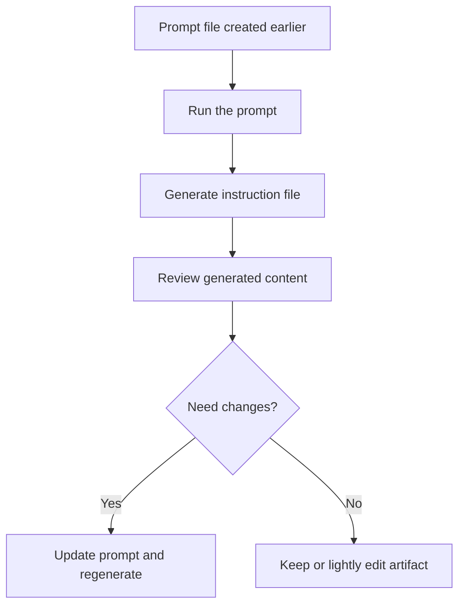

## Creating Instruction Files from Prompts

- Run the prompt files from the prior exercise
- Generate instruction files from those prompts
- Review what the model inferred and why it matters
- Decide how to refine the result for long-term reuse

::: notes
Duration ~00:01

Frame this as the payoff to the earlier prompt-authoring exercise. The class is no longer discussing prompts in the abstract; they are now executing them and examining the generated instruction files as real artifacts. Emphasize that the goal is not just to get output, but to understand why the output is surprisingly rich and how to improve it without losing reproducibility.
:::

---

## Prompt to Instruction Workflow

- The prompt is the reusable source
- The instruction file is the generated artifact
- Review happens after generation, not instead of it

::: notes
Duration ~00:01

Walk through the workflow from left to right and make the source-versus-artifact distinction explicit. The prompt file captures intent, structure, and constraints in a reusable form, while the generated instruction file is the output that gets inspected and possibly refined. Highlight that review still matters because inference is powerful but not infallible. Use about one minute here and transition by asking what exactly the model is contributing beyond the literal text of the prompt.
:::

---

## Inference Is Your Friend

- AI fills in architectural context, expected sections, and familiar conventions
- Minimal guidance can still produce surprisingly detailed instruction files
- Rich output is useful when the model understands the domain patterns already
- Review trims, sharpens, and aligns the inferred detail to your actual standards

> "Amazed at what it created. Architectural context. It's crazy."
>
> Peter Goostree

::: notes
Duration ~00:01

This slide is about using the model's built-in knowledge deliberately instead of fighting it. Explain that a strong prompt does not need to spell out every sentence if the model already knows common structures like metadata blocks, validation sections, architecture guidance, and examples. The opportunity is speed: the model drafts broadly, and the human constrains the result to the team's true requirements.
:::

---

## Why Start with a Prompt-First Approach?

- Easier to delete surplus detail than author every section from scratch
- Start with comprehensive AI-generated content, then edit down
- Reduces blank-page friction and initial authoring burden
- Encourages a repeatable workflow instead of one-off handcrafted artifacts

**Core idea**: generate broadly first, then narrow precisely.

::: notes
Duration ~00:01

Explain why this approach feels faster in practice. Many teams stall at the beginning because writing a complete instruction file from zero requires structure, terminology, examples, and compliance details all at once. The prompt-first approach shifts the hard part from creation to refinement, which is usually easier and faster.
:::

---

## Two Ways to Refine the Result

1. **Edit the generated instruction file directly**
2. **Modify the prompt file and regenerate**

**Preferred for version control**: update the prompt, then rerun it.

Why the second path usually wins:

- Prompt evolution is preserved in source control
- Future regeneration stays aligned with the revised intent
- Teams can reproduce the artifact instead of reverse-engineering it

::: notes
Duration ~00:01

Make the tradeoff concrete. Direct edits are sometimes fine for quick cleanup, but they create drift between the reusable source and the artifact. Updating the prompt file keeps the real logic of the artifact in version control, which matters for auditability, reuse, and future regeneration. Use about one minute here and emphasize that this is the operational discipline behind reproducible AI-assisted work.
:::

---

## Why Prompt Files Beat Simple Directives

Simple directive:

- "Create instruction file for Evergreen development"

Prompt-file approach:

- Objective
- Structure
- Requirements
- Constraints
- Expected deliverable

Benefits:

- Changes preserved in source control
- Prompt evolution tracked over time
- Reproducible instruction-file generation
- Better provenance than a short, vague command

::: notes
Duration ~00:02

Contrast a one-line directive with a prompt file that captures the real contract for the work. A simple request may work once, but it does not explain what sections are required, what metadata must exist, or which constraints the model must honor. A detailed prompt becomes documentation of intent as well as an execution mechanism.
:::
