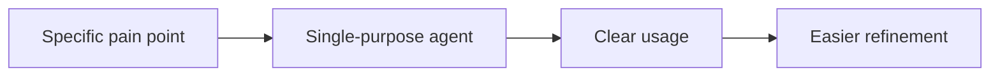
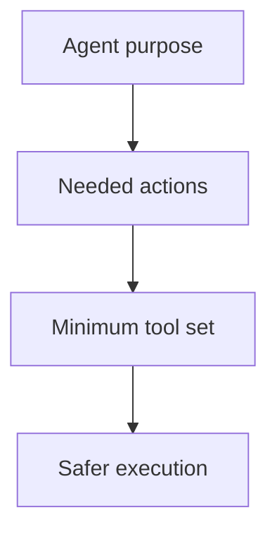

## Start Simple

- Create one agent for one specific pain point
- Avoid trying to solve every workflow with a single "super agent"
- Narrow scope makes behavior easier to predict and improve
- Simpler agents are easier to explain to teammates

::: notes
Explain that simplicity is a force multiplier in agent design. When an agent has one clear job, users know when to use it, reviewers know how to evaluate it, and the team can improve it without destabilizing unrelated workflows. Spend about 45 seconds here and make the point that over-ambitious agents often become confusing because they try to mix planning, coding, testing, and documentation into one vague persona. Transition by showing how explicit boundaries reinforce that simplicity.
:::

---

## Define Clear Responsibilities

- State the agent's purpose explicitly
- Define what is in scope and what is out of scope
- Make responsibilities visible in the agent instructions
- Clear boundaries reduce surprising responses and misuse

**Good boundary question**

- "What should this agent refuse or defer?"

::: notes
Frame this slide around predictability. An agent with clear responsibilities is easier for humans to trust because they know what kind of help it is supposed to give and what it should not attempt, which reduces accidental overreach and context drift. Spend about 45 seconds here and encourage the audience to think in terms of scope contracts rather than vague personality descriptions. Transition by moving to the related issue of tool access, because boundaries are not just instructional but operational.
:::

---

## Restrict Tools Appropriately

- Give the agent the minimum tools needed for its job
- Avoid broad tool access unless the workflow genuinely requires it
- Tool restrictions reduce accidental misuse and security exposure
- Least-privilege design keeps behavior aligned with agent intent

::: notes
Explain that tool design is one of the strongest control surfaces available when building agents. If an agent only needs to read files and analyze code, then it should not also be able to perform broad write operations or run unrelated commands, because excess capability creates unnecessary risk. Spend about one minute here and tie this to the principle of least privilege that teams already use in security and infrastructure design. Transition by showing that even good initial designs need improvement over time.
:::

---

## Refine Based on Usage

- Watch how people actually use the agent
- Look for recurring confusion, failure modes, or missing guidance
- Update instructions, examples, and tools based on real feedback
- Treat the first version as a starting point, not a final product

::: notes
Make the point that real-world usage will reveal gaps that design-time reasoning will miss. Teams learn a lot from where users hesitate, where the agent responds too broadly, or where people keep asking for the same clarification, and those signals should drive iteration. Spend about 45 seconds here reinforcing that successful agents are maintained assets, not one-time experiments. Transition by broadening from personal agents to team and organization sharing.
:::

---

## Share Common Work Through Org or Enterprise Agents

- Promote frequently used workflows into shared agents
- Use org or enterprise scope for common tasks across teams
- Shared agents improve consistency and reduce duplicated setup
- Team-wide agents should have stronger review and ownership

**Typical shared scenarios**

- security review
- documentation updates
- testing guidance
- implementation planning

::: notes
Explain that some workflows are too common to reinvent team by team. When an organization sees repeated needs such as security review or testing guidance, a shared agent can provide a standardized starting point and reduce duplicated authoring effort across repositories. Spend about 45 seconds here and point out that shared agents need better ownership and clearer governance because more people will depend on them. Transition by showing how examples improve agent usability once an agent exists.
:::

---

## Include Examples and Validate Before Rollout

- Add example prompts or usage patterns to show what "good" looks like
- Test the agent in realistic production-like scenarios
- Validate both behavior and boundaries before broad adoption
- Roll out only after the team can predict how the agent responds

**Validation checklist**

1. prompt examples work as expected
2. tool access matches intended scope
3. outputs are useful and consistent
4. failure cases are acceptable

::: notes
Close with the two practices that make rollout much safer: examples and validation. Examples help users invoke the agent correctly, while validation ensures the agent behaves well under realistic conditions, including edge cases and boundary conditions, before it is trusted more broadly. Spend about one minute here and end on the idea that good agent design is iterative, scoped, and tested rather than purely aspirational. Encourage the audience to treat agents like any other product capability that needs ownership, feedback, and quality checks.
:::
