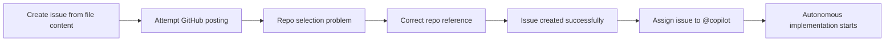

## Effective Prompts for Technical Debt

Section 9 overview

- Focus: prompts, issues, and Copilot workflow
- Goal: turn vague cleanup into executable work

::: notes
Duration ~00:09

Open by explaining that technical debt work often fails because requests are too vague. This section shows how to convert cleanup ideas into structured prompts that can be executed, tracked, and reviewed. Emphasize that the topic is not just prompt wording; it is also about how prompts connect to GitHub issues and Copilot workflows. Set expectations that the audience will leave with a repeatable pattern they can apply immediately. (~1 minute)
:::

---


## What a Strong Technical Debt Prompt Includes

Every prompt should define the work clearly

- **Debt description** - the concrete problem to fix
- **Constraints** - architecture, guardrails, and non-negotiables
- **Expected outcome** - what success looks like
- **Test updates** - how validation must change
- **Documentation updates** - what artifacts must be refreshed
- **Provenance requirements** - what must be logged beyond instructions

::: notes
Walk through each component as part of a checklist, not as optional advice. The key message is that a good prompt reduces ambiguity before implementation starts. Highlight that provenance and documentation are easy to forget when teams focus only on code, so they need to be called out explicitly in the request. Frame this slide as the minimum contract between the requester and the AI assistant. (~1.5 minutes)
:::

---


## Why Structured Prompts Matter

Better prompts create better remediation workflows

- Faster remediation because the target is explicit
- More consistent fixes across contributors and sessions
- Less manual follow-up after the first prompt
- A standardized approach for recurring debt categories

> Better prompt quality means less cleanup after the cleanup work

::: notes
This is the business-value slide. Explain that structured prompts reduce rework because they front-load clarity on tests, docs, and guardrails. Connect this to team scalability: if multiple people or multiple models work on similar debt items, consistent prompt structure produces more predictable outputs. Use the quote as the memorable takeaway for why investing in the prompt upfront saves time later. (~1 minute)
:::

---


## GitHub Integration - Direct Issue Creation

Copilot can help move prompt content into GitHub issues

- Example command: `"Post issue #6 to the GitHub owner/repository-name"`
- Copilot can create the issue directly in GitHub
- Labels, assignees, and metadata can be included

**Common pitfalls**

- Wrong repository selected
- Missing full `owner/repository` format
- Issues disabled in repo settings

::: notes
Present this as the first automation step after prompt authoring. The audience should understand that Copilot can bridge from local artifact or prompt text into the GitHub issue system, but repository targeting must be explicit. Stress the practical lesson from the demo: natural language is often not enough when multiple repositories are in play. Encourage attendees to always state the full repository name to avoid misrouting work. (~1.25 minutes)
:::

---


## Resolving Repository Targeting Problems

Use explicit repository context to avoid failed issue creation

1. Provide the full repository path
2. Verify issues are enabled in repository settings
3. Use the exact format: `owner/repository-name`

```text
Good: Post issue #6 to johnmillerATcodemag-com/AI-Assisted-Software-Development
Weak: Post issue #6 to the GitHub repo
```

::: notes
This slide turns the earlier problem into an operational rule. Show the contrast between a strong repository reference and an ambiguous one so the audience sees how small wording changes affect outcome quality. Mention that this is especially important in enterprise environments, where users often have access to many repositories and organizations. Transition by noting that once the issue exists, the next step is assigning the work to Copilot. (~1 minute)
:::

---


## Assigning an Issue to @copilot

Paid plan workflow for autonomous implementation

1. Create the issue in GitHub
2. Assign the issue to `@copilot`
3. Copilot creates a work-in-progress branch
4. Copilot implements the requested solution
5. Notifications report ongoing progress
6. Copilot opens a pull request when complete

**Requirements**

- Enterprise license or Pro Plus subscription
- Enterprise workflow requires the repository in the correct org

::: notes
Describe this as the jump from assisted drafting to autonomous execution. The value is not just code generation; it is the full workflow of branch creation, progress updates, and PR delivery. Be clear that this is a paid capability and that organizational placement matters for enterprise scenarios. This helps the audience distinguish between what everyone can do and what requires higher-tier licensing. (~1.25 minutes)
:::

---


## Live Demo Workflow

What happened in the demonstration



::: notes
Use the flowchart to retell the demo as a sequence of decisions and corrections. The important teaching point is that failure was not the end of the workflow; it was a signal to improve context and retry with better specificity. Explain that this is exactly how teams should treat prompt failures in practice: inspect the ambiguity, refine the prompt, and rerun. This slide also helps students remember the workflow as a reusable playbook rather than a one-off demo. (~1 minute)
:::

---


## Operational Observations from the Demo

What the audience saw in real time

- Another issue implementation was running in parallel
- Notifications arrived as work progressed
- A WIP branch was created automatically
- Copilot behaved like a tracked background teammate

**Student takeaway**

- Track work in GitHub, not just in chat
- Let automation handle branch and PR scaffolding

::: notes
This slide helps the audience move from feature awareness to workflow intuition. Explain that the visible notifications and parallel work demonstrate why GitHub-backed flows are more scalable than copy-paste prompt execution alone. The WIP branch is important because it gives teams traceability and a concrete artifact to review. Emphasize that GitHub becomes the control surface for AI work, while prompts become the specification language. (~1 minute)
:::

---


## Reusable Prompt Template for Technical Debt

Use a structure like this for repeatable results

```text
Fix the following technical debt: [describe the problem].
Constraints: [architecture rules, guardrails, scope limits].
Expected outcome: [what should be true when done].
Tests to update: [unit, integration, regression, CI expectations].
Documentation to update: [README, docs, comments, diagrams].
Provenance required: [logs, metadata, linked artifacts].
```

- Treat this as a starting template, then specialize by debt type

::: notes
Give the audience a concrete artifact they can copy into their own workflow. Explain that the template is intentionally simple because its power comes from completeness, not clever phrasing. Encourage them to tailor the constraints and validation sections based on the type of debt item, such as refactoring, security cleanup, or test hardening. Close by connecting the template back to the earlier benefits: clarity, consistency, and reduced manual follow-up. (~1 minute)
:::

---


## Key Takeaways

- Strong prompts define the debt, constraints, outcomes, tests, docs, and provenance
- GitHub issue creation works best with explicit repository targeting
- Assigning to `@copilot` can automate branch, progress, and PR creation
- Demo failures showed how prompt specificity improves execution
- Technical debt becomes easier to manage when prompts and issues work together

::: notes
Close by tying prompt quality to execution quality. The audience should leave with the idea that technical debt management is not just about identifying problems; it is about packaging them so AI and GitHub workflows can act on them reliably. Re-emphasize the two most practical habits: always include validation and always specify the exact repository. End with a suggested next step: take one existing debt item and rewrite it using the template from the previous slide. (~1 minute)
:::
