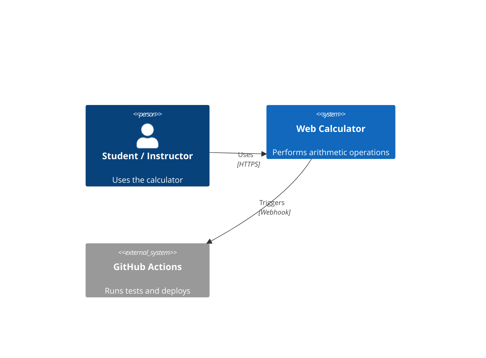

## Exercise: Generating C4 Diagrams from Code

Duration: 20-25 minutes

Objectives

- Generate System Context, Container, and Component C4 diagrams using AI from existing code
- Practice additional diagram types: dependency graphs, data flow, and deployment topologies
- Validate Mermaid syntax renders correctly in VS Code and GitHub
- Understand when to use each diagram type for maximum clarity

Activities

1. System Context Diagram:

- Open the calculator project (or another brownfield codebase)
- Prompt: "Analyze this codebase and generate a C4 System Context diagram in Mermaid showing the system boundary, its users, and external dependencies"
- Render the output and confirm the diagram displays correctly

2. Container Diagram:

- Prompt: "Generate a C4 Container diagram in Mermaid for this project showing major runtime units (APIs, databases, front ends) and their interactions"
- Identify any containers the AI missed or misrepresented

3. Component Diagram:

- Choose one container (e.g., the Services layer)
- Prompt: "Generate a C4 Component diagram for the Services component showing internal classes, their responsibilities, and dependencies"

4. Additional Diagram Types:

- Dependency graph: "Generate a Mermaid dependency graph showing module import relationships"
- Data flow: "Generate a Mermaid data flow diagram tracing user input through the system to the response"
- Deployment topology: "Generate a Mermaid deployment diagram showing runtime environments and where each container runs"

5. Mermaid Rendering Check:

- Paste each diagram into the VS Code Mermaid preview or GitHub markdown preview
- Fix any syntax errors flagged by the renderer
- Ensure all node labels and arrows are readable and accurate

Success Criteria

- At least one each of: System Context, Container, and Component diagrams generated and rendered
- At least one additional diagram type produced (dependency, data flow, or deployment)
- All diagrams render without Mermaid syntax errors
- Diagrams accurately reflect the actual code structure, not generic placeholders
- Can articulate the purpose and audience for each C4 diagram level

::: notes

## Generating C4 Diagrams from Code Exercise Instructions

**Duration:** 20-25 minutes
**Prerequisites:** Access to a codebase (calculator project or any brownfield system), GitHub Copilot or equivalent AI assistant, Mermaid preview capability in VS Code or GitHub markdown

**Goal**: Use AI to generate accurate, renderable C4 architecture diagrams at multiple levels of detail, plus supplementary diagram types, directly from an existing codebase.

### Objectives

1. **Generate C4 diagrams at three levels**: Prompt AI to produce System Context (who uses the system and what it depends on), Container (major deployable units and their relationships), and Component (internal structure of a single container) diagrams, building from the outside in.

2. **Practice additional diagram types**: Apply AI to generate dependency graphs showing module/import chains, data flow diagrams tracing request-response paths, and deployment topology diagrams showing where runtime components live and how they communicate.

3. **Validate Mermaid rendering**: Confirm that AI-generated Mermaid syntax is syntactically correct and renders properly in both VS Code preview and GitHub markdown. Identify and fix common rendering issues such as unsupported keywords, unquoted labels with special characters, and overly complex subgraph nesting.

4. **Apply judgment to AI output**: Evaluate whether diagrams accurately reflect the codebase by comparing against the actual source files. Annotate or correct diagrams where the AI made incorrect inferences about structure or dependencies.

---

### Activity Detail

**Activity 1 – System Context Diagram**

The System Context diagram is the highest level of C4. It shows the system as a black box, its human users, and external systems it communicates with. It is the best starting point because it requires the least code knowledge to verify.

Suggested prompt:

```
Analyze this codebase and generate a C4 System Context diagram using Mermaid C4Context syntax.
Show the system boundary, the primary user persona, and any external services or APIs.
Label all relationships with the protocol or data exchanged.
```

Expected Mermaid block structure:



Verify: Does the diagram show the correct users and external systems? Are any missing?

---

**Activity 2 – Container Diagram**

The Container diagram zooms inside the system boundary to show major runnable/deployable units such as a web front end, API server, and database. Each container is independently deployable.

Suggested prompt:

```
Generate a C4 Container diagram using Mermaid C4Container syntax.
Show each major runtime component (front end, back end, database, etc.),
technology labels, and how they communicate.
```

Verify: Are all major runtime units shown? Are the communication protocols correct?

---

**Activity 3 – Component Diagram**

The Component diagram zooms inside one container to show the key building blocks (classes, services, handlers). Choose the container with the most business logic.

Suggested prompt:

```
Generate a C4 Component diagram using Mermaid C4Component syntax
for the Services layer of the calculator project.
Show each class or module, its responsibility, and its dependencies on other components.
```

Verify: Does the diagram match what you see in the source files? Note any hallucinated components.

---

**Activity 4 – Additional Diagram Types**

Dependency graph prompt:

```
Generate a Mermaid flowchart showing all import/dependency relationships
between modules in this project. Use LR direction.
```

Data flow diagram prompt:

```
Generate a Mermaid sequenceDiagram showing the full data flow
from user input in the UI through the calculation logic to the displayed result.
```

Deployment topology prompt:

```
Generate a Mermaid C4Deployment or graph diagram showing
the deployment environments (local, CI, production) and which containers run where.
```

---

**Activity 5 – Mermaid Rendering Considerations**

Common issues to watch for and fix:

- **Unsupported syntax**: GitHub renders a subset of Mermaid. Avoid `C4Dynamic` and some advanced features; prefer `C4Context`, `C4Container`, `C4Component`.
- **Special characters in labels**: Wrap labels containing `(`, `)`, `/`, or `:` in double quotes.
- **Too many nodes**: Diagrams with 20+ nodes become unreadable. Ask AI to group or simplify.
- **Circular dependencies**: Flag these explicitly — they often indicate architectural issues.
- **Subgraph depth**: GitHub does not render deeply nested subgraphs reliably; flatten where possible.

Validation checklist:

- [ ] Paste each diagram block into VS Code Mermaid preview (Ctrl+Shift+V or Mermaid Preview extension)
- [ ] Paste into a GitHub markdown file or gist to verify GitHub rendering
- [ ] Fix any red error indicators before treating the diagram as complete

---

### Success Criteria Detail

- **Accuracy**: Compare generated diagrams against the actual source files. The AI should identify real components, not generic placeholders like "Service" or "Handler".
- **Renderability**: All Mermaid blocks render without errors in both VS Code and GitHub.
- **Coverage**: At least three diagram types (System Context, Container, Component) plus one supplementary type are produced.
- **Insight**: Participants can explain which diagram level is most useful for onboarding a new team member vs. debugging a production issue.

---

### Instructor Notes

- Encourage participants to compare their diagrams with each other — differences often reveal which parts of the codebase are genuinely ambiguous.
- If the AI generates a diagram that is "technically correct but useless" (too high-level or too low-level), discuss what additional context in the prompt would improve it.
- The Mermaid rendering step is intentionally included to surface the gap between "AI can write Mermaid" and "Mermaid that actually renders" — this is a practical and common real-world friction point.
- Timing guidance: Activities 1-3 should take about 5 minutes each; Activity 4 is 3 minutes; Activity 5 is 4 minutes with discussion.
  :::
