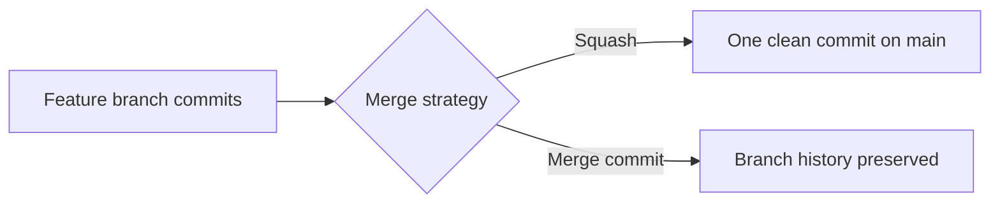
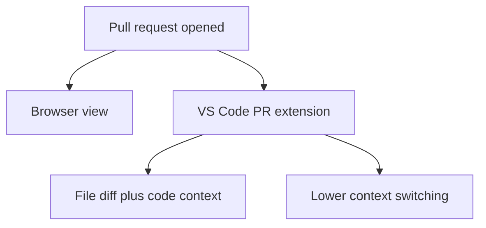
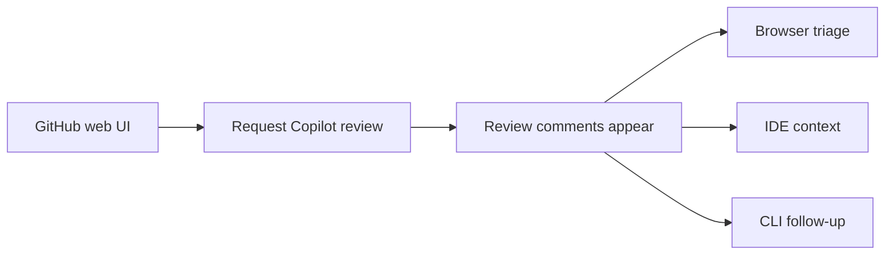

<!-- _class: lead -->

## GitHub CLI and PR Management

- Section focus: managing pull requests with GitHub settings, IDE tooling, and the `gh` CLI
- Outcome: show how merge policy, review tools, and token permissions shape the day-to-day PR workflow

::: notes
Duration ~00:11

Introduce this section as the operational layer around pull requests rather than a pure coding topic. Explain that teams need to understand not only how to create and review PRs, but also how repository settings, IDE integrations, and CLI permissions determine what they can do efficiently.  Transition by starting with the merge strategy decision that affects every PR.
:::

---

## Start with the Merge Strategy

- Decide whether the repository defaults to **squash merge** or **merge commit**
- Squash merge keeps history compact and easier to scan
- Merge commits preserve the exact branch history and commit grouping
- This choice lives in GitHub repository pull request settings

::: notes
Duration ~00:02

Explain that merge strategy is a governance decision, not just a button choice at the end of a pull request. Squash merges can make the main branch easier to read, while merge commits retain more detail about how work evolved, so teams should choose based on their review and history preferences.  Transition by moving from repository settings into the tools people use to work with PRs day to day.
:::

---

## Use the Right PR Tools for Context

- The **GitHub Pull Requests** extension for VS Code keeps PR context inside the IDE
- Viewing PRs in the editor reduces browser switching
- Local code, review comments, and changed files are easier to compare side by side
- IDE-based review is especially helpful when debugging comment context

::: notes
Duration ~00:02

Make the point that tooling choice affects reviewer efficiency. When developers can see the PR, the code, and their local workspace in one environment, they spend less time reconstructing context and more time evaluating the actual change.  Transition by showing how the CLI fits into that same workflow.
:::

---

## Use the CLI for PR Comment Work

- The `gh` CLI can support PR comment and review workflows from the terminal
- Team members explored `gh pr comment` commands for practical resolution workflows
- CLI-based actions are useful when scripting or avoiding extra UI navigation
- Not every review action is equally convenient or permitted through the CLI

**Typical CLI goal**

- inspect PR status
- add comments
- help coordinate comment resolution

::: notes
Duration ~00:02

Frame this slide around exploration and experimentation rather than a promise that every review action is frictionless. The CLI is powerful because it lets developers stay in terminal-first workflows and script repeated actions, but there are still limits depending on permissions, command support, and token setup.  Transition by showing that Copilot review itself still often starts in the GitHub web interface.
:::

---

## Request Copilot Review and Then Triage the Output

- Copilot code review can be requested from the GitHub web interface
- After review arrives, teams can use browser, IDE, or CLI tools to manage follow-up work
- Good workflow means choosing the best tool for each step, not forcing one interface for everything
- Review handling still depends on repository settings and auth permissions

::: notes
Duration ~00:02

Explain that PR management is often multi-surface by nature. A team may request the Copilot review in the web UI, inspect the comments in the IDE for better context, and then use the CLI for quick status checks or scripted follow-up actions, so the workflow is hybrid rather than exclusive.  Transition by focusing on why permissions often become the limiting factor.
:::

---

## Permissions Can Block the Best Workflow

- Personal access token scopes determine what CLI operations are allowed
- Insufficient permissions can prevent review-related commands from working
- Teams discussed **classic tokens** versus **fine-grained tokens**
- Proper permissions are required before CLI review features become reliable

**Common friction points**

1. token lacks needed repo or review scope
2. command works in theory but fails in practice
3. workflow changes depending on auth model

::: notes
Duration ~00:02

Stress that many workflow frustrations are really authentication problems in disguise. Developers may assume a CLI command is broken when the actual issue is that the token does not have permission to read, comment on, or manage the review workflow the way they expect.  Transition by ending with the operational lessons teams should carry forward.
:::

---

## Practical Takeaways for PR Management

- Choose a merge strategy intentionally and document it
- Use the VS Code PR extension when local code context matters
- Use `gh` where it reduces repetitive PR management work
- Expect some Copilot review steps to begin in the web interface
- Verify token permissions early when CLI features do not behave as expected

**Bottom line**: strong PR management is a combination of repository settings, tool selection, and the right access model.

::: notes
Duration ~00:02

Close by summarizing that effective PR management is never just about knowing commands. Teams need a clear merge policy, the right interface for the task at hand, and authentication that supports the workflow they want to use, or else the process becomes slower and more confusing than it needs to be.  End by encouraging the audience to audit both their tools and their permissions before they need them under pressure.
:::
