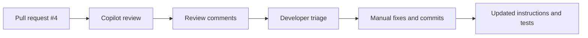
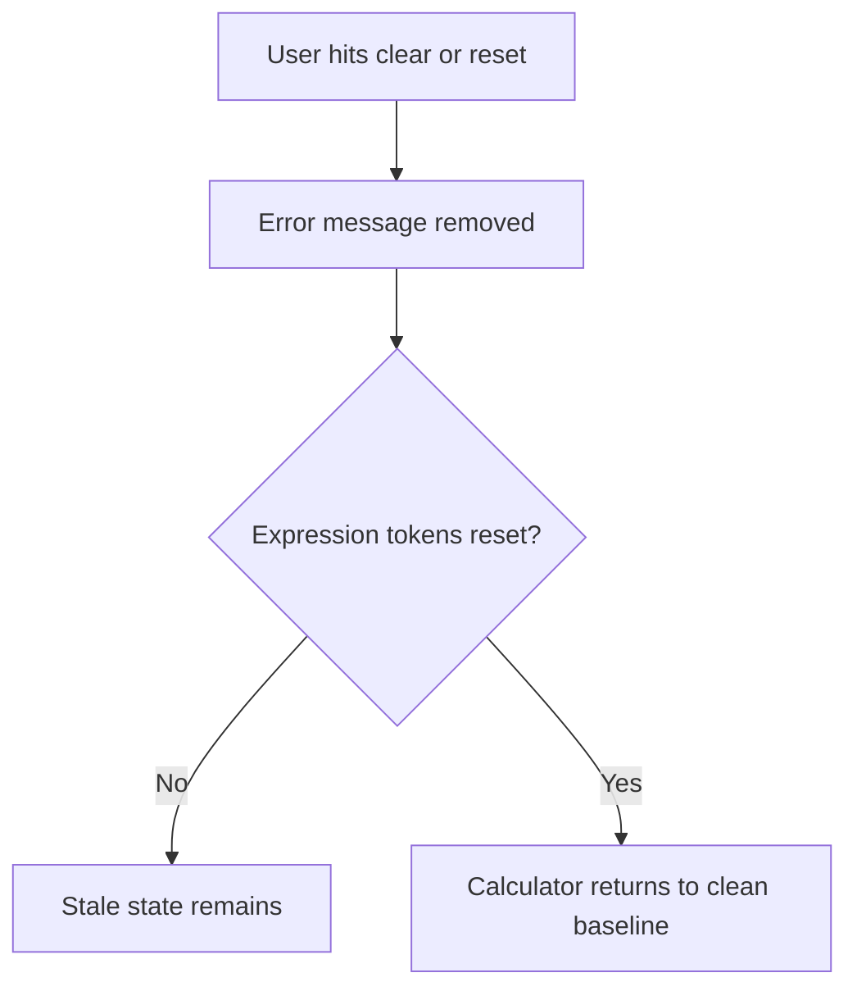

<!-- _class: lead -->

## GitHub Code Review with Copilot

- Section focus: using Copilot review feedback to improve code, tests, and instructions
- Duration target: 18 minutes
- Outcome: show what Copilot found in PR `#4`, how humans resolved it, and how review findings feed better standards

::: notes
Introduce this section as a practical demonstration of Copilot acting as a review assistant rather than a code generator. Explain that the value is not just in the comments themselves, but in how the review surfaces patterns such as correctness issues, compliance gaps, and recurring quality risks. Spend about one minute here positioning the section as review, resolution, and process improvement. Transition by showing the review workflow from pull request to human action.
:::

---

## How the Review Flow Worked

- Open the pull request and request Copilot review
- Copilot analyzes changed files and leaves review comments
- Review findings are grouped around correctness, maintainability, and compliance
- Humans still decide what to fix, how to fix it, and when to close comments
- Commit suggestions can accelerate straightforward cleanups

::: notes
Walk through the process as a collaboration loop rather than an automated approval gate. Copilot can inspect the diff quickly and highlight issues, but the team still has to evaluate the feedback, decide which comments are valid, and implement the actual fixes. Spend about two minutes here and call out the commit suggestion feature as useful for simple edits, though not a substitute for understanding the problem. Transition by summarizing the kinds of issues the review identified.
:::

---

## What Copilot Found in PR #4

| Finding area | Example issue | Why it matters |
| --- | --- | --- |
| Unicode usage | non-standard minus sign in comparisons | can cause subtle behavior or readability issues |
| State management | clearing errors leaves expression tokens behind | UI state becomes inconsistent |
| Compliance | AI provenance header missing | repository policy violation |
| Dead code | unused constants and functions | noise, confusion, and maintenance cost |
| Testing gaps | subtraction coverage called out | bugs can slip through |

- Total review volume: **8 comments/issues**

::: notes
Use this slide to give the audience a fast inventory of the feedback categories before you zoom in on individual examples. The important takeaway is that one review surfaced both code-level problems and process-level issues, which shows why review is valuable even when the code appears to work. Spend about two minutes here and emphasize that Copilot can flag a mix of correctness, hygiene, and governance concerns in one pass. Transition by taking the two most concrete implementation findings first.
:::

---

## Code Review Findings: Correctness Problems

**Unicode comparison issue**

- review recommended replacing a Unicode minus character with the standard ASCII `-`
- consistent character usage improves safety and maintainability

**State management issue**

- clearing the error state did not fully reset expression tokens
- partial reset behavior can leave stale calculation state behind

::: notes
Explain that these two findings are especially useful because they highlight different kinds of correctness risk. The Unicode issue is small but important because unusual characters can be hard to spot and may behave differently across tools, while the state-reset issue is a deeper logic problem because the UI looks reset even when internal state is not. Spend about three minutes here and make the point that review comments often range from superficial-looking fixes to structural behavior issues. Transition by moving from correctness to the policy and cleanup findings.
:::

---

## Code Review Findings: Compliance and Cleanup

- Previously compliant files were missing required AI provenance headers
- Unused constants and helper functions were identified as dead code
- Review also noted subtraction test coverage gaps
- Together, these findings show that review should check policy, clarity, and verification, not just functionality

**Review lens**

1. Does the code work?
2. Does it follow repository rules?
3. Is there unnecessary code left behind?
4. Do tests prove the risky behavior?

::: notes
Frame this slide as the broader quality story behind the pull request. Missing provenance metadata is not just a formatting issue in this repository, because it breaks traceability requirements, while dead code and testing gaps both increase the chance of future confusion or regressions. Spend about three minutes here reinforcing that good code review covers compliance and maintainability alongside logic. Transition by describing what the review experience looked like for the humans involved.
:::

---

## What We Observed About the Review Process

- Copilot's visible "thinking process" helped explain why comments were being made
- Review output still required manual interpretation and manual resolution
- The review became a teaching tool, not just a defect list
- Some feedback suggested improvements to instruction files, not only to source files

**Important point**: AI review assists judgment, but it does not replace reviewer accountability.

::: notes
Explain that part of the educational value came from seeing how the review reasoned about the diff. Even when the comments were useful, someone still had to verify the issue, choose the right fix, and decide whether the underlying instructions or prompts should change to prevent the same mistake next time. Spend about three minutes here stressing that Copilot improves reviewer leverage rather than eliminating reviewer responsibility. Transition by showing how the team can use those findings to strengthen the instruction layer.
:::

---

## Use Review Output to Improve the Instructions

- Tighten instruction files so recurring issues are prevented earlier
- Add explicit rules for ASCII-safe operators and character usage
- Clarify state reset expectations for error handling and token cleanup
- Reinforce provenance requirements where generated files are expected
- Expand tests around risky operations such as subtraction and clear-state behavior

**Bottom line**: the best outcome is not only fixing the PR, but improving the prompts and instructions that shape future PRs.

::: notes
Close by connecting review feedback to process improvement instead of treating comments as isolated repairs. If the same issues can recur, the right move is to update the instruction files, prompt guidance, or test expectations so future generated code starts from a stronger baseline. Spend about two to three minutes here and encourage the audience to think of review findings as input for evolving the system of guidance around AI-assisted development. End by summarizing that Copilot review is most valuable when it improves both the current change and the next one.
:::
