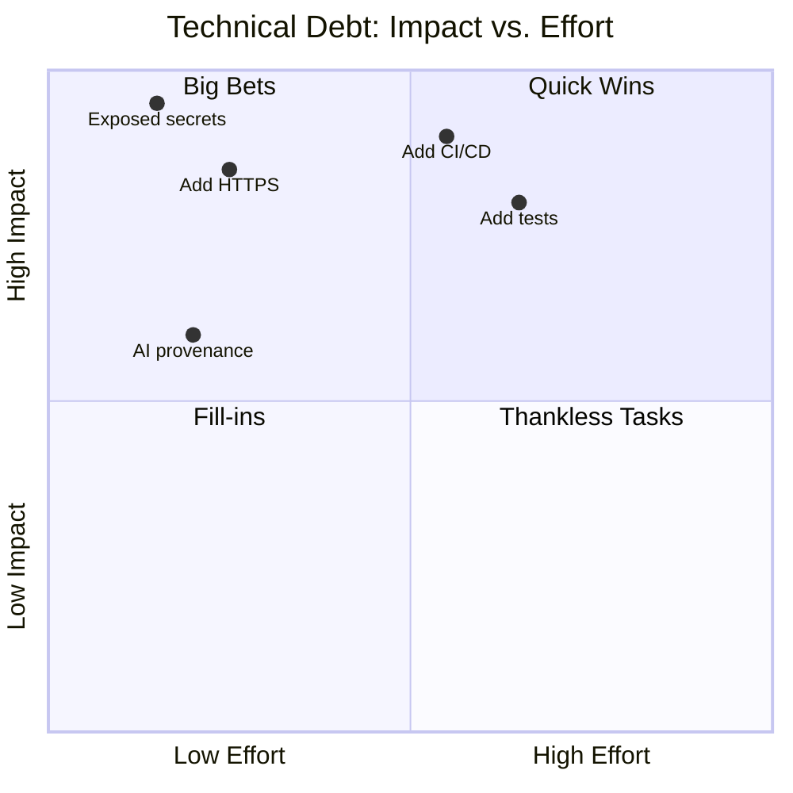
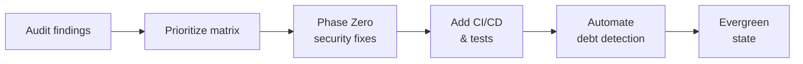

## Finding the Gaps: Common Security Findings

When AI audits a brownfield codebase, these issues surface first:

- 🔑 **Exposed secrets** — credentials or tokens committed to source control
- 🔒 **Missing HTTPS** — data in transit unencrypted
- 📋 **No test coverage** — changes cannot be validated safely
- 🚫 **No CI/CD pipeline** — deployment is manual and inconsistent
- 📝 **Missing AI provenance metadata** — AI-generated changes are untracked

::: notes
Open with the reality that most brownfield codebases have a mixture of these issues lurking beneath the surface, and they are often invisible until something breaks. The key insight is that these are not surprising findings — they are predictable. AI can surface them quickly through a structured audit, and once visible they can be prioritized and addressed systematically. Spend about 45 seconds here and emphasize that naming the problems is the first step toward fixing them safely.
:::

---

## AI-Assisted Prioritization: Impact vs. Effort

Ask AI to analyze your backlog and position each item on an impact/effort matrix:

::: notes
Explain that the impact/effort matrix is a practical tool for turning a long debt backlog into an ordered action plan. When you ask AI to populate this matrix it needs context about your system, team size, and risk appetite, so the quality of the prompt matters. The quadrant model helps teams stop arguing about priority and start acting on clear categories. Spend about one minute here and make the point that the visual format is also useful for communicating debt status to non-technical stakeholders like managers or product owners.
:::

---

## Making Technical Debt Visible

Visibility is the first step toward resolution:

- Ask AI to generate a prioritized issue list from the audit findings
- Represent priorities as GitHub Issues with labels (`P0`, `P1`, `P2`)
- Use Mermaid diagrams to visualize dependencies and sequencing
- Update issue descriptions with AI-proposed implementation steps
- Share the dashboard with the full team — debt is a shared problem

**Outcome**: debt moves from implicit knowledge to tracked, actionable work

::: notes
Make the point that hidden debt is far more dangerous than visible debt. When the team can see what exists, estimate effort, and assign priorities, the problem feels solvable rather than overwhelming. AI accelerates this process dramatically because it can scan large codebases, generate issue descriptions, propose remediation steps, and even draft acceptance criteria in minutes. Spend about 45 seconds here and encourage teams to treat the resulting GitHub issue list as a living document that improves with each sprint.
:::

---

## Phase Zero: Security with Infinite ROI

Tackle the highest-impact, lowest-effort security items first:

| Item                         | Effort   | Risk Reduced |
| ---------------------------- | -------- | ------------ |
| Rotate exposed secrets       | Very Low | Critical     |
| Enforce HTTPS                | Low      | High         |
| Add secret scanning CI check | Low      | High         |
| Add AI provenance headers    | Very Low | Medium       |

**The "infinite ROI" principle**

> A security breach you prevent costs nothing to fix.
> A breach you miss can cost everything.

::: notes
Introduce "Phase Zero" as a deliberate pre-sprint focused entirely on security hygiene before any feature work begins. The ROI calculation is asymmetric: the cost of rotating a secret is near zero, while the cost of a breach is unbounded. Teams that skip Phase Zero often pay for it later in incident response, customer trust damage, and regulatory consequences. Spend about one minute here and encourage teams to treat Phase Zero items as non-negotiable blockers rather than backlog items that compete with features.
:::

---

## Reaching Evergreen: Quick Wins Compound

Low-effort, high-impact fixes accumulate into a significantly healthier codebase:

**Evergreen state** = debt is continuously detected, tracked, and paid down

::: notes
Frame Evergreen not as a destination you reach once but as an operating mode where the system continuously improves. The compounding effect is real: once secrets are rotated, HTTPS is enforced, and CI is in place, subsequent changes are safer and faster to make. AI-assisted development accelerates the journey to Evergreen by making audit, prioritization, and remediation faster at every stage. Spend about 45 seconds here and position this as the motivating goal that makes all the earlier prioritization work worth doing.
:::
