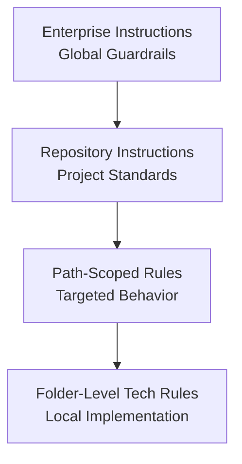

<!-- _class: lead -->

## Organizational vs. Repository Instruction Files

- Business/Enterprise tier capabilities
- Path-scoped instruction files
- Folder-level technology-specific rules

::: notes
Frame this as a layering strategy, not an either-or choice. The audience should leave with a practical model for deciding what belongs at enterprise scope versus repository scope. Keep this opening to about 60-90 seconds.
:::

---

## Why Two Instruction Layers Exist

- Enterprise instructions enforce baseline policy and governance
- Repository instructions optimize for project context and implementation detail
- Together they balance consistency and local autonomy

### Key Idea

Define global guardrails once, then narrow behavior where code lives.

::: notes
Explain that teams usually fail by over-centralizing or over-fragmenting. Centralize non-negotiables, decentralize implementation guidance. Emphasize this prevents policy drift while keeping day-to-day delivery fast.
:::

---

## Business/Enterprise Tier Capabilities

- Organization-wide safety and compliance standards
- Approved model and tool usage policy
- Mandatory provenance and audit requirements
- Security and legal baselines (secret handling, license constraints)
- Shared quality gates for CI/CD

### Typical Scope

All repositories, all teams, all environments.

::: notes
Call out that enterprise-tier files should be stable and short. They should define constraints, not feature behavior. Give examples: required metadata fields, approved hosts, restricted operations, and mandatory security checks.
:::

---

## Path-Scoped Instruction Files

Path-scoped instructions apply behavior only where it is needed.

```yaml
applyTo: "Slides/individual-slides/**"
```

```yaml
applyTo: "**/*.{cs,ts,js,py,java,go,rb}"
```

```yaml
applyTo: "**/*.instructions.md"
```

### Benefit

Granular control without forcing unrelated files to follow irrelevant rules.

::: notes
Explain that path scoping is the precision tool. Show that slide-authoring rules should not apply to backend code, and coding constraints should not apply to markdown content. Mention that good glob design reduces noisy or conflicting behavior.
:::

---

## Folder-Level Technology-Specific Rules

Use folder-level rules to match local stack and workflow.

- `Slides/` for Marp formatting and speaker-note conventions
- `Labs/lab1-3-python/` for Python lint/test guidance
- `Labs/lab1-3-typescript/` for TypeScript build/test patterns
- `Course/course.github/` for docs automation and publishing rules

### Pattern

Place rules near code ownership boundaries.

::: notes
Reinforce proximity: put guidance where teams actually work. This improves discoverability and lowers onboarding time. Mention that folder-level rules should refine enterprise policy, not duplicate it.
:::

---

## Layering Model and Precedence



### Resolution Rule

Prefer the most specific matching instruction when guidance overlaps.

::: notes
Walk the stack top-to-bottom. Describe how specificity should increase as scope narrows. If conflicts appear, resolve by specificity first, then by explicit policy precedence defined by your organization.
:::

---

## Practical Governance Checklist

- Keep enterprise files policy-focused and durable
- Keep repository files implementation-focused and current
- Use explicit `applyTo` patterns for every specialized rule file
- Review instruction overlap quarterly to reduce conflicts
- Validate behavior with small representative prompts per folder

::: notes
End with action items. Suggest teams pilot this in one repo before scaling. Encourage adding quick validation prompts in CI or review checklists so instruction drift is detected early.
:::
