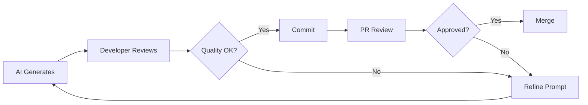

marp: true
theme: default
paginate: true
backgroundColor: #ffffff

---

## Safety Measures & Best Practices

**Safety measures are critical when using AI assistance**

Topics covered:

- **Feature Flag Management** - Safe deployment strategies
- **Testing Philosophy** - Coverage vs. signal quality
- **Code Review Approach** - Working with AI outputs
- **Change Review Workflows** - Systematic validation
- **Change Set Size** - Why smaller is better

::: notes
Introduce the safety measures module. Emphasize that AI assistance amplifies both productivity AND risk—guardrails are essential.

Key message: Safety measures aren't optional when using AI. They're the difference between velocity with confidence and velocity toward disaster.

Topics overview:

1. Feature flags: Deploy safely, remove deliberately
2. Testing philosophy: Quality over quantity
3. Code review: Treat AI as junior dev (trust but verify)
4. Change workflows: Systematic validation
5. Change set size: Small batches reduce risk

Set expectations: This module is practical, not theoretical. We'll cover specific strategies you can use immediately.

Timing: 2 minutes.
Transition: "Let's start with feature flags..."
:::

---

## Why Feature Flags Matter

**Feature flags enable safe AI-assisted development**

### Benefits

- Deploy incomplete features safely
- Test in production with limited exposure
- Quick rollback without code changes
- A/B testing and gradual rollouts

### The Problem

- **Feature flags become technical debt**
- Complexity increases with flag count
- Dead code paths accumulate
- Testing burden multiplies

---

## Feature Flag Lifecycle

**Every flag should have a retirement plan**

### Phase 1: Introduction

- Flag added with new feature code
- Default to OFF in production
- ON in development/staging

### Phase 2: Validation

- Gradual rollout to users
- Monitor metrics and errors
- Collect feedback

### Phase 3: Stabilization

- Feature proven stable
- Flag set to ON for all users
- **Retirement scheduled**

---

## Removal Strategy: The Right Way

**AI can help automate flag removal**

### Step 1: Audit

```bash
# Find all references to the flag
grep -r "FEATURE_NEW_CHECKOUT" .
```

### Step 2: As-Is Tests

- Capture current behavior with flag ON
- Ensure tests pass before removal

### Step 3: Remove Flag

- AI prompt: "Remove FEATURE_NEW_CHECKOUT flag and dead code"
- Delete flag-OFF code paths
- Simplify logic

### Step 4: Validate

- Run full test suite
- Deploy to staging
- Monitor production rollout

---

## Common Pitfalls

**Avoid these feature flag anti-patterns**

❌ **Never Remove Flags Without Tests**

- Risk: Unknown behavior changes
- Solution: Capture as-is behavior first

❌ **Don't Let Flags Live Forever**

- Risk: Exponential complexity (2^n code paths)
- Solution: Set expiration dates

❌ **Avoid Nested Flags**

- Risk: Combinatorial explosion
- Solution: Linear dependencies only

✅ **Best Practice**: Flags last weeks, not months

---

<!-- _class: lead -->

## Testing: Coverage vs. Signal Quality

**High coverage ≠ Good tests**

### Common Misconception

```
80% code coverage = 80% quality ❌
```

### Reality

- **Coverage measures lines executed, not quality**
- Tests can run code without asserting behavior
- False sense of security

### Example: Bad High-Coverage Test

```javascript
it("calculates total", () => {
  calculator.add(2, 2);
  // No assertion! ❌
});
```

**Coverage: 100% | Value: 0%**

---

## Signal Quality: What to Look For

**Good tests catch real problems**

### High Signal Tests

✅ **Assert Expected Behavior**

```javascript
expect(calculator.add(2, 2)).toBe(4);
```

✅ **Test Edge Cases**

```javascript
expect(calculator.divide(10, 0)).toThrow("Division by zero");
```

✅ **Validate Business Rules**

```javascript
expect(order.total()).toBe(subtotal + tax - discounts);
```

---

## AI-Generated Test Quality

**Treat AI tests with appropriate skepticism**

### The Problem

- AI generates tests that look right
- May not test actual requirements
- Can miss critical edge cases
- **Coverage looks great, signal is weak**

### Solution: Review for Intent

1. **Does it test the requirement?**
2. **Does it assert the right behavior?**
3. **Does it cover edge cases?**
4. **Would it catch real bugs?**

**AI Tip**: Use different models to review each other's tests

---

## Building Signal-Rich Test Suites

**Focus on meaningful validation**

### Strategy 1: Test Behaviors, Not Implementation

```javascript
// Bad: Tests implementation ❌
expect(user.passwordHash).toBeDefined();

// Good: Tests behavior ✅
expect(user.authenticate("password123")).toBe(true);
```

### Strategy 2: Prune Redundant Tests

- Remove tests that don't add signal
- Consolidate overlapping tests
- AI can help identify redundancy

### Strategy 3: Test Critical Paths First

- Security: Authentication, authorization
- Money: Payments, calculations
- Data integrity: Persistence, validation

---

## The 80/20 Rule for Tests

**Strategic test distribution**

### Focus Areas

- **20% of code causes 80% of bugs**
- Identify critical paths with AI analysis
- Concentrate test effort there

### Test Categories

1. **Critical**: Security, money, data loss (100% coverage + signal)
2. **Important**: Core features (high signal tests)
3. **Nice to Have**: Edge features (smoke tests)
4. **Low Value**: Simple getters/setters (skip or minimal)

✅ **Better**: 60% coverage with high signal
❌ **Worse**: 90% coverage with low signal

---

<!-- _class: lead -->

## The Right Mental Model

**Treat AI like an eager, knowledgeable junior developer**

### Characteristics

✅ **Eager**: Produces code quickly and confidently
✅ **Knowledgeable**: Knows syntax, patterns, APIs
✅ **Consistent**: Follows patterns it's seen

⚠️ **But Also**:

- Doesn't understand business context deeply
- Can't judge if code solves the right problem
- Misses subtle edge cases
- Makes confident mistakes

**Your role: Senior developer reviewing junior's work**

---

## What to Review Carefully

**AI-generated code review checklist**

### 1. Business Logic Correctness

- Does it solve the actual requirement?
- Are business rules implemented correctly?
- Edge cases handled appropriately?

### 2. Security Implications

- Input validation present?
- Authentication/authorization correct?
- Secrets exposed? SQL injection risks?

### 3. Error Handling

- All error paths covered?
- User-friendly error messages?
- Logging for diagnostics?

---

## Common AI Code Mistakes

**Patterns to watch for**

### Over-Confidence in Edge Cases

```typescript
// AI might generate:
function divide(a: number, b: number) {
  return a / b; // ❌ No zero check!
}

// You should add:
function divide(a: number, b: number) {
  if (b === 0) throw new Error("Division by zero");
  return a / b;
}
```

### Missing Business Context

```typescript
// AI generates:
user.balance -= amount;

// But business rule requires:
if (user.balance < amount) {
  throw new InsufficientFundsError();
}
user.balance -= amount;
```

---

## The Review Process

**Systematic approach to AI code review**

### Step 1: Understand the Intent (30 seconds)

- What was the prompt?
- What problem is this solving?

### Step 2: Quick Scan (1-2 minutes)

- Does structure make sense?
- Are patterns appropriate?
- Any obvious red flags?

### Step 3: Deep Review (5-10 minutes)

- Test coverage adequate?
- Security implications?
- Edge cases handled?
- Business logic correct?

### Step 4: Run and Verify (2-5 minutes)

- Does it actually work?
- Manual testing of key paths

---

## Trust, But Verify

**Building appropriate trust levels**

### Low Trust (Always Review)

- Security-sensitive code
- Financial calculations
- Data persistence logic
- Authentication/authorization

### Medium Trust (Spot Check)

- Standard CRUD operations
- UI components
- Utility functions

### Higher Trust (Quick Scan)

- Boilerplate code
- Test stubs
- Documentation
- Configuration files

**Remember**: Even simple code can hide critical bugs

---

## The Three-Level Review

**Progressive validation strategy**

### Level 1: Immediate Review (AI Output)

- Review prompt and AI response
- Check if it understood the request
- Identify obvious gaps
- **Decision point**: Accept, refine prompt, or reject

### Level 2: Implementation Review (Code)

- Standard code review process
- Check correctness, quality, tests
- Validate against requirements
- **Decision point**: Merge, request changes, or reject

### Level 3: Post-Deployment Review (Production)

- Monitor metrics and errors
- User feedback
- Performance impact
- **Decision point**: Keep, iterate, or rollback

---

## The "Keep/Undo" Decision

**GitHub Copilot's three acceptance levels**

### Level 1: Keep Character by Character

- Accept each character/token as typed
- Highest control, slowest

### Level 2: Keep Line by Line

- Accept each line individually
- Balance of control and speed

### Level 3: Accept Entire Suggestion

- Full block acceptance
- Fastest, but highest risk

**Best Practice for Safety**:

- **Critical code**: Line-by-line or character review
- **Boilerplate**: Full block acceptance OK
- **When uncertain**: Reject and refine prompt

---

## Change Approval Workflow

**Formalized review process**

### For Individual Changes



### For Team Changes

- **Peer review required** for all AI code
- **Senior review** for security/critical paths
- **Architecture review** for design changes

---

## Automated Quality Gates

**Let CI/CD catch issues**

### Pre-Merge Checks

- ✅ All tests pass
- ✅ Linting passes
- ✅ Security scan clean
- ✅ Coverage maintained or improved
- ✅ AI provenance metadata present

### AI-Specific Checks

```yaml
# GitHub Action example
- name: Validate AI Metadata
  run: python scripts/validate-ai-metadata.py

- name: Check Test Coverage
  run: npm run test:coverage

- name: Security Scan
  run: npm audit
```

**Benefit**: Automated safety net for AI code

---

## The Safety Net Pyramid

**Layered validation approach**

```
       ┌─────────────┐
       │  Manual     │  Human intuition
       │  Review     │  Business context
       └─────────────┘
      ┌───────────────┐
      │   Peer        │  Code quality
      │   Review      │  Best practices
      └───────────────┘
    ┌─────────────────┐
    │   Automated     │  Tests, linting
    │   Testing       │  Security scans
    └─────────────────┘
  ┌───────────────────────┐
  │  Static Analysis      │  Type checking
  │  & Linting           │  Style rules
  └───────────────────────┘
```

**Each layer catches different types of issues**

---

## Why Size Matters

**Smaller changes = Safer changes**

### Cognitive Load

- **Large changes**: Hard to review thoroughly
- **Small changes**: Easy to understand completely

### Risk Profile

- **Large changes**: Many potential failure points
- **Small changes**: Isolated impact

### Debugging

- **Large changes**: Hard to identify problem
- **Small changes**: Obvious what broke

### Rollback

- **Large changes**: May need to keep some parts
- **Small changes**: Clean rollback

---

## The Data

**Research supports small changes**

### Industry Statistics

- **Changes <50 lines**: 5% failure rate
- **Changes 50-200 lines**: 15% failure rate
- **Changes >200 lines**: 35% failure rate

### Review Effectiveness

- **<100 lines**: Reviewers catch ~80% of bugs
- **100-400 lines**: Reviewers catch ~50% of bugs
- **>400 lines**: Reviewers catch ~30% of bugs

**Source: Google Engineering Practices, Microsoft Research**

✅ **Optimal PR size: 50-150 lines of meaningful change**

---

## How Small is Small Enough?

**Practical guidelines**

### Ideal Change Sizes

**For Bug Fixes**:

- Single issue fix: **10-50 lines**
- Complex bug: **50-150 lines**

**For Features**:

- Vertical slice: **100-200 lines**
- Component: **50-150 lines**
- Refactoring: **<200 lines per PR**

**For AI-Generated Code**:

- Start with **one file or function**
- Add tests in **same PR** (preferred) or **immediate follow-up**
- Split large features into **multiple PRs**

---

## Breaking Down Large Changes

**Strategies for splitting AI work**

### Strategy 1: Vertical Slicing

```
Feature: User Registration

❌ One Large PR (500 lines):
- Database model
- API endpoint
- Validation
- Tests
- UI form

✅ Four Small PRs:
1. Database model + migration (50 lines)
2. API endpoint + basic tests (100 lines)
3. Validation rules + tests (80 lines)
4. UI form + integration tests (120 lines)
```

---

## Prompting for Small Changes

**Guide AI to produce smaller outputs**

### Effective Prompts

❌ **Too Broad**:

> "Implement the user registration feature"

✅ **Appropriately Scoped**:

> "Create the User model with email, password fields. Include validation for email format and password minimum length."

✅ **Even Better - Specify Scope**:

> "Create the User model class only. Include: email (string), passwordHash (string), createdAt (datetime). Add methods: validateEmail(), hashPassword(). Maximum 50 lines."

**AI Tip**: Request implementations one vertical slice at a time

---

## The "One Thing" Rule

**Each PR should do exactly one thing**

### Good Examples ✅

- "Add email validation to User model"
- "Implement password hashing"
- "Create registration API endpoint"
- "Add user registration form"

### Bad Examples ❌

- "Implement authentication" (too broad)
- "Fix bugs and add features" (multiple purposes)
- "Update user system" (vague scope)

### AI Workflow

```
Large Feature Request
      ↓
AI: Generate Implementation Plan
      ↓
Break into Small Tasks
      ↓
AI: Implement One Task at a Time
      ↓
Review & Merge Each Separately
```

---

## Handling Large AI Outputs

**What to do when AI generates too much**

### Option 1: Cherry-Pick

- Review AI output
- Accept only one logical piece
- Save rest for separate PRs

### Option 2: Split Retroactively

```bash
# Create feature branch
git checkout -b feature/user-registration

# AI generates lots of code
# Split into multiple commits
git add models/User.cs
git commit -m "Add User model"

git add controllers/UserController.cs
git commit -m "Add registration endpoint"

# Create separate PRs from each commit
```

### Option 3: Re-prompt

> "That's too much. Just implement the User model first, without the controller or UI."

---

## Benefits of Small Changes

**Cumulative advantages**

### Faster Reviews

- **Large PR**: Days to review
- **Small PR**: Minutes to review
- **Result**: Faster feedback cycle

### Higher Quality

- **More thorough review** = catch more bugs upfront
- **Clearer intent** = better feedback
- **Easier testing** = better validation

### Better Collaboration

- **Lower merge conflicts** with small, frequent PRs
- **Parallel work** easier
- **Continuous integration** = always shippable

### Psychological Benefits

- **Sense of progress** from frequent merges
- **Lower stress** from manageable reviews
- **Better focus** on one thing at a time

---

## The Small Change Workflow

**Putting it all together**

### Daily Routine

```
08:00 - Pick one small task
08:05 - Prompt AI for focused implementation
08:15 - Review AI output
08:30 - Create PR (50-150 lines)
08:45 - Respond to review feedback
09:00 - Merge
09:15 - Next small task
```

**vs.**

```
08:00 - Pick large feature
08:05 - Prompt AI for everything
10:00 - Review massive output
12:00 - Create huge PR (800 lines)
13:00 - Wait days for review
Days later - Address review comments
Days later - Finally merge (maybe)
```

**Which would you prefer?**

---

<!-- _class: lead -->

## The Safety Checklist

**Before merging any AI-generated code**

### ✅ Feature Flags

- [ ] Incomplete features behind flags?
- [ ] Retirement plan documented?
- [ ] As-Is tests for flag removal?

### ✅ Testing

- [ ] Tests assert real behavior?
- [ ] Edge cases covered?
- [ ] Signal quality > Coverage metrics?

### ✅ Code Review

- [ ] Treated AI as "junior developer"?
- [ ] Business logic validated?
- [ ] Security implications checked?

---

## The Safety Checklist (Continued)

### ✅ Change Review

- [ ] Three-level review completed?
- [ ] Prompt and output verified?
- [ ] Quality gates passed?

### ✅ Change Size

- [ ] PR under 200 lines?
- [ ] One logical change only?
- [ ] Can be reviewed thoroughly?

### ✅ Provenance

- [ ] AI metadata present?
- [ ] Conversation logged?
- [ ] Source documented?

---

## Safety Culture

**Building team practices around AI safety**

### Team Agreements

- **Maximum PR size**: 200 lines for features
- **Review response time**: 24 hours for small PRs
- **Test requirements**: Signal > Coverage
- **Security checklist**: For all auth/payment changes

### Education

- **Onboarding**: Cover AI safety in new hire training
- **Training**: Regular sessions on prompt engineering
- **Retrospectives**: Learn from AI-related incidents

### Continuous Improvement

- **Metrics**: Track PR size, defect rates, review time
- **Iterate**: Refine practices based on data
- **Share**: Document learnings in instruction files

---

## Common Failure Patterns

**Learn from these mistakes**

### 🚨 **Blind Trust**

- Merging AI code without review
- **Result**: Security vulnerabilities, bugs in production
- **Solution**: Always review, especially security/critical paths

### 🚨 **Too Much, Too Fast**

- Accepting large AI-generated changes wholesale
- **Result**: Technical debt, hard-to-debug issues
- **Solution**: Break into small, reviewable pieces

### 🚨 **Coverage Theater**

- Focusing on coverage numbers, not test quality
- **Result**: False confidence, bugs slip through
- **Solution**: Review every test for signal quality

---

## Success Patterns

**What works in practice**

### ✨ **Incremental Adoption**

- Start with small, non-critical features
- Build confidence gradually
- **Result**: Team learns AI strengths/weaknesses safely

### ✨ **Prompt Refinement**

- Invest time in better prompts
- Version control prompt files
- **Result**: Consistent, higher quality AI outputs

### ✨ **Pairing Review**

- Pair program during AI code review
- **Result**: Knowledge sharing, better catch rate

### ✨ **Fast Feedback Loops**

- Small PRs → Fast reviews → Rapid merges
- **Result**: High velocity, high quality

---

## Measuring Safety

**Key metrics to track**

### Lead Indicators (Prevention)

- **Average PR size**: Target <150 lines
- **Review time**: Target <24 hours
- **Test signal quality**: Manual assessment
- **Feature flag count**: Trend downward

### Lag Indicators (Detection)

- **Production incidents**: From AI code
- **Bug escape rate**: Defects found in production
- **Rollback frequency**: How often do we revert?
- **Time to resolution**: How fast do we fix?

### Process Metrics

- **Review thoroughness**: % PRs with comments
- **Coverage trends**: Is signal improving?
- **AI acceptance rate**: % AI suggestions accepted

---

## Tools and Automation

**Leverage tooling for consistent safety**

### Static Analysis

```yaml
# .github/workflows/safety-checks.yml
- name: Check PR Size
  run: |
    if [ $(git diff --stat | tail -1 | awk '{print $4}') -gt 200 ]; then
      echo "PR too large! Please split into smaller changes."
      exit 1
    fi
```

### Custom Linting

- AI metadata validation
- Test quality checks
- Security pattern detection

### Dashboard

- PR size trends
- Review time metrics
- Defect rates
- Coverage vs. signal ratio

---

<!-- _class: lead -->

## The Five Safety Pillars

### 1. 🚩 **Feature Flags**

Retire flags quickly, test before removal

### 2. 🎯 **Test Signal**

Quality over coverage, assert behavior

### 3. 👥 **Code Review**

Treat AI as eager junior dev, verify thoroughly

### 4. ✅ **Change Review**

Three-level validation, automated gates

### 5. 📏 **Small Changes**

<200 lines per PR, one logical change

**Master these, and AI becomes a force multiplier**
