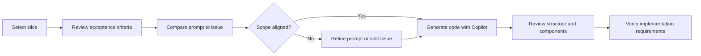

# Vertical Slice Implementation

## Hands-on delivery with AI assistance

- Time: `00:48:30 - 01:30:00`
- Duration: ~41.5 minutes
- First slice: **Implement Foundational WebCat**
- Format: pair programming plus Copilot-assisted implementation

::: notes
Open by framing this section as the moment where planning turns into execution. The audience has already seen requirements and slice planning, so now the emphasis is on how a first slice is actually built with AI in the loop. Call out that this was a hands-on segment rather than a theory lecture, which makes the workflow decisions and prompt refinements especially valuable. Let learners know the deck will follow the same sequence as the live session: setup, scope check, coding, and verification. 
:::

---

## What this section covers

- Selecting the first slice to implement
- Reviewing acceptance criteria before coding
- Checking issue scope against the original prompt
- Using Copilot to generate and refine code
- Verifying outcomes with an emphasis on automation

::: notes
Use this slide as the roadmap for the rest of the section. The audience should see that implementation is more than code generation; it is a chain of preparation, scope alignment, execution, and validation. Emphasize that skipping any one of these steps can create rework, even when the AI-generated code looks good. Transition by saying the first practical task was deciding exactly what slice to build first. 
:::

---

## 1. Set up the implementation workspace

The first ten minutes focused on getting ready to build

- Select the first slice to implement
- Re-read acceptance criteria
- Set up Git branches and working directory
- Confirm the team is aligned before coding starts

**Goal:** start with a slice that is small, clear, and testable

::: notes
Explain that setup work is part of the implementation discipline, not overhead. Choosing the first slice determines the complexity of the entire session, so the safest move is to pick something foundational but still bounded. Reinforce that acceptance criteria are the anchor; they define what done means before anyone asks Copilot to generate code. Mention that clean branch and workspace setup supports easier review, rollback, and collaboration throughout the implementation session. 
:::

---

## 2. Review the issue against the prompt

Scope verification happened before deeper coding

- Compare the implementation prompt with the generated issue
- Identify scope mismatches early
- Decide whether to rescope or split the issue
- Consider prompt refinements before more code is produced

> If the issue and the prompt disagree, the team must reconcile them before implementation continues.

::: notes
This is an important governance slide. Explain that issue generation is helpful, but it can introduce subtle drift from the original implementation intent. The team used the comparison between prompt and issue to find mismatches before they turned into wasted code. Stress that AI speed makes scope verification more important, not less, because incorrect work can be produced quickly. The takeaway is that issues are implementation artifacts, but prompts and acceptance criteria remain the source of truth. 
:::

---

## Rescoping and split decisions

When scope drift appears, make it explicit

| Question | Why it matters |
| --- | --- |
| Is the issue larger than the selected slice? | Prevents overbuilding |
| Are unrelated tasks bundled together? | Keeps the slice coherent |
| Should work be split into multiple issues? | Improves parallelism and clarity |
| Should the implementation plan be updated? | Maintains planning accuracy |

**Discussion point:** update the plan when issue boundaries change

::: notes
Walk through the table as a decision aid rather than a report. The key lesson is that issue splitting is not merely an administrative change; it can affect planning, sequencing, and traceability. Call out the specific discussion from the session about whether the implementation plan should be updated when issues split, and explain that the safe answer is yes when the execution path meaningfully changes. This keeps the plan aligned with reality instead of becoming stale documentation. 
:::

---

## 3. Live coding with GitHub Copilot

The coding phase combined generation with active review

- Use Copilot to draft implementation code
- Read and critique the generated output
- Adjust structure and details through pair discussion
- Build foundational web components, not just scaffolding

**Key principle:** AI generates quickly, but the team still owns correctness

::: notes
Position Copilot here as a force multiplier, not a replacement for engineering judgment. The session demonstrated that code generation is only one part of the workflow; the more important skill is reviewing what was generated and deciding what to keep, change, or reject. Emphasize that pair programming helps surface assumptions in AI output and turns code review into a live learning exercise. This is a good moment to remind the audience that speed without review simply creates faster mistakes. 
:::

---

## File organization in `webcat-frontend`

Structure matters during the first slice

- Discuss folder layout for foundational components
- Keep component organization understandable from the start
- Let slice boundaries influence file placement
- Use structure that supports incremental growth

```text
webcat-frontend/
  components/
  features/
  shared/
```

::: notes
Explain that file organization decisions made during the first slice often become patterns for the rest of the application. The discussion around `webcat-frontend` was not just about tidiness; it was about keeping the emerging structure aligned with vertical-slice thinking. Mention that teams should avoid defaulting into layer-heavy folder schemes if the goal is feature-centric delivery. The simple directory example is there to illustrate the conversation, not to prescribe an exact architecture for every project. 
:::

---

## Live workflow summary



::: notes
Use the diagram to show that implementation is an iterative loop, not a straight line from prompt to code. The decision point in the middle is the critical teaching device: if scope is wrong, the team corrects it before pressing ahead. Explain that this workflow reduces the chance of spending twenty minutes polishing code for the wrong task. End by connecting the diagram to the final part of the session, where verification strategy became the main concern. 
:::

---

## 4. Verification strategy became the real lesson

The AI-generated implementation included manual verification steps

- Manual verification checklist was present in the output
- Team discussed when manual checks are acceptable
- The stronger preference was **automated testing**
- Prompt quality should push validation toward repeatable tests

**Best practice:** ask for automated tests before accepting manual-only validation

::: notes
This slide captures one of the most practical lessons from the session. Manual verification can be useful for exploratory checks, but it does not scale well and does not protect future changes. Explain that the team used the presence of a manual checklist as a signal that the prompt could be improved to request more automation up front. Make the point that testability is part of implementation quality, not a follow-up concern to be handled later. 
:::

---

## From manual checks to automated confidence

Improve the implementation prompt when verification is weak

1. Ask for unit and integration tests explicitly
2. Require updated acceptance-test coverage when relevant
3. Treat manual checks as supplemental, not primary
4. Review verification requirements before merging

```text
Prompt improvement:
"Favor automated tests over manual verification steps and include any test updates required for this slice."
```

::: notes
Turn this into actionable guidance the audience can reuse immediately. The main lesson is that verification quality often reflects prompt quality, so if the output leans too heavily on manual testing, the prompt probably under-specified validation expectations. Encourage learners to embed testing requirements directly in the implementation request so that code and verification evolve together. Transition to the final summary by noting that the section taught both a coding workflow and a prompt-writing improvement loop. 
:::

---

## Key takeaways

- Start implementation with a clearly chosen slice and explicit acceptance criteria
- Compare generated issues to the original prompt before trusting scope
- Split or rescope issues when the work no longer fits the slice
- Use Copilot for acceleration, but review every generated artifact
- Prefer automated testing over manual verification whenever possible

::: notes
Close by tying together the session as an implementation discipline rather than a tool demo. The audience should leave understanding that vertical-slice delivery works best when planning, scope control, code generation, and verification are all aligned. Re-emphasize the two most transferable lessons: keep the slice small and keep the tests automated. Suggest a concrete next step for the audience: take one planned slice in their own backlog and add explicit issue-scope and test-automation review checkpoints before coding begins. 
:::
