## Welcome Back to AI-Assisted Software Development

- Ready to continue where we left off
- Today's session builds on what we've covered
- We're all in this together — participation welcome
- **Questions are always welcome — ask anytime!**

::: notes
Welcome everyone back to the session. Take a moment to let people settle in before diving into content. Acknowledge that it's great to see everyone back and express enthusiasm for the session ahead.

Key talking points:

- Remind attendees of the previous session's topics briefly
- Emphasize that questions are encouraged at any point — not just at the end
- Set a positive, inclusive tone for the session
- If this is after a break, give people 30 seconds to get re-focused

Timing: Spend about 1-2 minutes on this slide before moving on.
Transition: "Let's pick up right where we left off..."
:::

---

<!-- _class: lead -->

## Course Modules

- Intro
- **▶ AI-First Development Methodology**
- Specification Driven Software Development
- Architecture Specification
- Technology Specification
- Implementation Specification
- Implementation Planning
- Implementation Prompts
- Vertical Slice Implementation
- Code Review with GitHub Copilot

---

AI-First vs. Prompt-First Development

---

## AI-First vs. Prompt-First Development

::: notes
This deck introduces the distinction between AI-First and Prompt-First development. The goal is to clarify strategy vs. interface, and show how both fit into modern AI-assisted engineering.
:::

---

## Definitions

AI-First Development
A software engineering philosophy where AI is embedded across the entire SDLC-requirements, design, implementation, testing, documentation, compliance, and maintenance.
Prompt-First Development
A workflow pattern where prompts, instruction files, and chat modes are treated as first-class, version-controlled artifacts.

::: notes
AI-First is the broad philosophy. Prompt-First is the tactical layer that enables predictable AI behavior. You can do Prompt-First without being AI-First, but not the reverse.
:::

---

## What Each Optimizes For

| Focus Area    | AI-First                  | Prompt-First                       |
| ------------- | ------------------------- | ---------------------------------- |
| Scope         | Entire SDLC               | Interaction layer                  |
| Goal          | Lifecycle integration     | Deterministic AI behavior          |
| Optimization  | Velocity, governance      | Prompt quality, reproducibility    |
| Risk Controls | Human-in-loop, provenance | Versioned prompts, context control |

::: notes
This table is the heart of the comparison. AI-First is about organizational and architectural change. Prompt-First is about artifact discipline and predictable outputs.
:::

---

## How They Treat Artifacts

AI-First
Requirements written with AI collaboration in mind
AI-generated scaffolds, tests, docs
Provenance enforced across all AI outputs
Architecture assumes AI participation
Prompt-First
Prompts and instruction files are version-controlled
Prompts define behavioral contracts
Reusable prompt modules
Chat modes define safe, predictable interactions

::: notes
AI-First changes what you build and how you build it. Prompt-First changes how you communicate intent to the AI.
:::

---

## Relationship Between the Two

Prompt-First is a subset of AI-First.
Prompt-First = mechanics
AI-First = philosophy + architecture + lifecycle integration

::: notes
This is the conceptual hierarchy. Prompt-First is necessary but not sufficient for AI-First maturity.
:::

---

## Concrete Examples

Prompt-First Example
Promptfile for generating unit tests
Instruction file for documentation
Chat mode for brownfield developers
AI-First Example
Requirements -> AI-generated scaffolds
Code changes -> AI-assisted reviews
Docs -> continuously AI-generated
Modernization -> AI-guided refactoring plans
Provenance -> enforced everywhere

::: notes
Use these examples to help teams visualize the difference. Prompt-First is about interfaces; AI-First is about the entire workflow.
:::

---

## Shortest Summary

AI-First = philosophy + architecture + lifecycle integration
Prompt-First = structured, version-controlled interfaces for interacting with AI

::: notes
End with this summary to reinforce the distinction. It's the cleanest way to remember the relationship.
:::

---

## High Level AI Assisted Workflow

### From Requirements to a Solution

Stakeholders such as SMEs, architects, SREs, and DBAs define the requirements with AI assistance.

AI transforms the requirements into implementation instruction files that guide the work.

- Stakeholders review, improve, and approve the instruction files.

AI uses those instruction files to create prompts that implement the business requirements.

- Implementation prompts explain how the feature should be built and how acceptance criteria should be verified.
- Stakeholders review, improve, and approve the implementation prompts.

Submitting the implementation prompts produces an implementation that conforms to the instruction files and meets the acceptance criteria.

- Stakeholders review and approve the resulting implementation.


::: notes
Walk the audience through the lifecycle from left to right and keep the focus on the review gates between each AI-generated artifact. Stress that requirements are not handed directly to code generation; instead, they are refined into instruction files and then into implementation prompts, with stakeholder approval at each stage. Use the diagram to reinforce that this is a controlled pipeline where AI accelerates each step but humans still own correctness, safety, and acceptance. End by linking this workflow back to the checklist on the previous slides: foundation, automation, specialization, and integration all support this end-to-end model.
:::

---

<!-- _class: lead -->

## Course Modules

- Intro
- AI-First Development Methodology
- **▶ Specification Driven Software Development**
- Architecture Specification
- Technology Specification
- Implementation Specification
- Implementation Planning
- Implementation Prompts
- Vertical Slice Implementation
- Code Review with GitHub Copilot

---

## Starting with Project Requirements

::: notes
Shift to greenfield best practices: requirements, prompts, and verification workflows.
:::

---

## Business Rules as Requirements


---

## Conceptual Models

Technology Agnostic

- Transformable into Logical Models
  Clarity
  Expressive
  Formal
  Conceptual Models are not a requirement

---

## Object Role Models

A type of conceptual model
Supported by a Visual Studio Extension (NORMA)
Object Role Models are textual and visual

- Text can be visualized
- Diagrams can be verbalized
  Textual representation is in a formal natural language that can be validated by subject matter experts

---

## Zeus.Academia.3b

Based on a publicly available model of a commonly understood domain

- https://orm.net/pdf/ORMwhitePaper.pdf
  Allows us to quickly move from requirements to implementation
- https://github.com/johnmillerATcodemag-com/zeus.academia.3b
  Why 3b?
- Third Iteration in progress
- If something is hard, do it often

---

## Use Cases

Use cases are specific scenarios that guide data capture and processing in the application

- Promote a Lecturer to Senior Lecturer
- Promote a Senior Lecturer to Associate Professor
- Promote an Associate Professor to Professor
- Assign a Class to an Academic
- Add a new Academic to the faculty capturing all required information and allowing the capture of optional information

---

## Exercise: Generate Business Requirements

Objectives:
Use the Product Manager chat mode to create a requirements document for a calculator
Activities:
Activate the Product Manager chat mode
Prompt the AI to create a requirements document
Review the requirements
Add an implementation plan using vertical slices
Review the changes
Add a diagram showing the relationship between Phases, Slices, and User Stories
Success Criteria
The requirements document exists and passes review

::: notes
Duration ~00:20

Author requirement docs, then use Copilot to generate scaffolding and validate alignment.

Prompt: create a requirements document for a simple calculator application
:::

---

## Exercise: Create Project Requirement

Objective: Create project requirement instructions, some project-specific, some generic, using both manual and Copilot-assisted methods.
Manually create a business requirements.md file and add:

- Business rules
- Workflows
- Purpose
- Tech stack
- Architecture
  Use Copilot to generate instruction files using the copilot-instructions.md and the codebase for context.
  Bonus:
  Review instruction files for errors and omissions.
  Ask Copilot to suggest changes based on evolving tech and practices.

::: notes
Author requirement docs, then use Copilot to generate scaffolding and validate alignment.
:::

---

## Exercise: Generate Business Requirements

Objectives:
Use the Product Manager chat mode to update the requirements document to implement using vertical slices
Activities:
Activate the Product Manager chat mode
Prompt the AI to add a vertical slices implementation plan
Review the changes
Add a diagram showing the relationship between Phases, Slices, and User Stories
Success Criteria
The implementation plan passes review

::: notes
Duration ~00:20

Prompts:

using #file:business-rules-to-slices.instructions.md update the #file:calculator-app-requirements.md implementation plan to implement using vertical slices

what is the difference between the phases and vertical slices?

update the plan to make this distinction clear

add a diagram that shows the phases -> slices -> use cases

which of the slices can be implemented in parallel and which have a dependancy on another slice
:::

---

## Exercise: Business Requirements Generation

Objectives

- Create a business requirements document for the calculator project
- Use the Product Manager agent with existing instruction files
- Apply the expected branch and repository workflow for Greenfield work
- Validate the requirements draft through review, clarification, and independent iteration

Activities

1. Create a personal branch from the Greenfield branch in the class repository.
2. Use the Product Manager agent to generate a calculator requirements document.
3. Apply the existing instruction files to improve scope, structure, and consistency.
4. Confirm repository choice, branching strategy, and how to handle any existing PRD content before continuing.
5. Work independently on the requirements document while the instructor provides check-ins and support.

Success Criteria

- A calculator business requirements document exists on the correct personal branch
- The Product Manager agent and instruction files are both used effectively
- Repository and branching decisions are applied correctly and consistently
- Participants can explain what changed after clarifications and independent refinement

::: notes
Duration ~00:17

## Business Requirements Generation Exercise Instructions

**Prerequisites:** Access to the Greenfield branch, ability to create a personal branch, and access to the Product Manager agent plus the repository instruction files

Use this exercise to establish the Greenfield workflow discipline early. Start by making participants branch from Greenfield before they do any prompting so the requirements artifact has a clean ownership path and can be reviewed independently later. In the first few minutes, emphasize that the goal is not to produce a perfect PRD in one pass, but to create a usable calculator requirements document using the Product Manager agent together with repository guidance. During the clarification window, call out the common confusion points explicitly: correct repository, personal branch strategy, what to do with any existing PRD material, and that tooling differences between Visual Studio and VS Code are secondary to getting the requirements quality right. For the working block, let students operate independently, but use periodic check-ins to see whether instruction files improved the output and whether anyone is stuck on scope, branching, or prompt quality. Transition from this exercise by connecting the completed requirements document to the next Greenfield planning steps, especially technology instructions, slice planning, and implementation prompts.
:::

---

<!-- _class: lead -->

## Course Modules

- Intro
- AI-First Development Methodology
- Specification Driven Software Development
- **▶ Architecture Specification**
- Technology Specification
- Implementation Specification
- Implementation Planning
- Implementation Prompts
- Vertical Slice Implementation
- Code Review with GitHub Copilot

---

## Command Query Responsibility Segregation Architecture

_AI-Assisted Software Development_

::: notes
Duration ~00:01

Welcome to the CQRS Architecture module. This session covers Command Query Responsibility Segregation - a pattern that separates read and write operations into distinct models to improve scalability and maintainability.

**Key Points**:

- CQRS separates write (command) operations from read (query) operations
- Enables independent scaling and optimization of each model
- Useful when read and write workloads have very different characteristics

**Delivery**: Begin by asking the audience about pain points with traditional CRUD APIs - high query complexity, slow writes due to query-optimized schemas, or contention between reads and writes.

**Transition**: "Let's start with when CQRS makes sense - and when it doesn't."
:::

---

## When to Use CQRS

**✅ Use CQRS when:**

- Read and write workloads scale differently
- Read models need denormalization, caching, or projections
- Write model needs strong invariants and task-focused workflows
- Auditing or event sourcing is required
- Query complexity slows transactional throughput

**❌ Avoid CQRS when:**

- Domain is small and reads/writes are balanced
- No clear boundary between commands and queries
- Operational overhead is not justified

::: notes
Duration ~00:03

CQRS is a powerful pattern but it adds operational complexity. Use it only when the benefits outweigh the costs.
:::

---

## Core Principles

| Principle        | Detail                                            |
| ---------------- | ------------------------------------------------- |
| **Separation**   | Commands change state; queries never change state |
| **Invariants**   | Write model enforces all business rules           |
| **Optimization** | Read model is shaped for query use cases          |
| **Independence** | Models can evolve separately                      |
| **Consistency**  | Eventual consistency between write and read       |

> Commands can fail. Queries should not.

::: notes
Duration ~00:02

These five principles guide every CQRS implementation decision.
:::

---

<!-- layout: Two Content -->

## Architecture Components

```
┌─────────────┐    ┌──────────────────┐    ┌────────────┐
│  Command    │───▶│  Command Handler  │───▶│ Write Store│
│    API      │    │  (Domain Logic)   │    │  (OLTP)    │
└─────────────┘    └──────────────────┘    └─────┬──────┘
             │ Events
       ┌──────────────────┐          ▼
┌─────────────┐    │    Projection    │    ┌────────────┐
│  Query API  │◀───│    Updater       │◀───│  Publisher │
└─────────────┘    └──────────────────┘    └────────────┘
  │                                  ┌────────────┐
  └─────────────────────────────────▶│ Read Store │
             │  (OLAP)    │
             └────────────┘
```

::: column

**Minimum components**

- **Command API** — receives write requests
- **Command Handler** — enforces domain rules
- **Write Store** — authoritative OLTP system
- **Publisher** — emits events reliably
- **Projection Updater** — rebuilds read models
- **Query API** — serves optimized reads
- **Read Store** — denormalized query model

::: notes
Duration ~00:03

This diagram shows the minimum components for a CQRS implementation.
:::

---

## Command Model Design

**Commands** — task-based, intention-revealing names:

- `CreateOrder` / `ApproveOrder` / `CancelOrder`
- `RegisterUser` / `UpdateShippingAddress`

**Rules**:

1. Validate at the command boundary — reject early
2. Use aggregates to enforce invariants and consistency
3. Keep handlers deterministic and side-effect controlled
4. Write to a single source of truth
5. One command targets one aggregate root

::: notes
Duration ~00:03

Good command design is the foundation of a maintainable CQRS system.
:::

---

## Query Model Design

**Queries** — shaped for the consumer use case:

- Avoid joins and complex calculations at query time
- Use projections updated from events or change feeds
- Keep models versioned and rebuildable
- Optimize for latency and throughput

**Types**:
| Query Type | Example | Store |
|-----------|---------|-------|
| List/Search | Product catalog | Elasticsearch |
| Detail | Order details | Relational DB |
| Analytics | Revenue dashboards | OLAP / Data Warehouse |

::: notes
Duration ~00:02

The query model is designed entirely around how data will be consumed.
:::

---

## Consistency Strategy

**Strong Consistency** — needed for:

- Payments and financial transactions
- Inventory management
- Security and access control

**Eventual Consistency** — acceptable for:

- Activity feeds and notifications
- Analytics dashboards
- Search indexes and recommendations

**Reliable Event Publication** — use the Outbox Pattern:

> Write event to database table atomically with domain change -> background process publishes -> idempotent consumers

::: notes
Duration ~00:03

Consistency is often the most debated aspect of CQRS implementations.
:::

---

## Anti-Patterns to Avoid

| Anti-Pattern                      | Problem                       | Solution                      |
| --------------------------------- | ----------------------------- | ----------------------------- |
| Mixed query in command handler    | Breaks separation of concerns | Query read model separately   |
| Shared ORM model for reads/writes | Couples both models           | Use separate query DTOs       |
| CQRS on simple CRUD               | Unnecessary complexity        | Use simple repository pattern |
| Dual writes without outbox        | Risk of lost events           | Implement outbox pattern      |

::: notes
Duration ~00:02

These anti-patterns are the most common mistakes in CQRS implementations.
:::

---

<!-- layout: Two Content -->

## Migration Strategy

**Start small, migrate incrementally**

1. **Identify** one bounded context or high-value feature
2. **Split read model** first while keeping the write model intact
3. **Add projections** and the read store incrementally
4. **Introduce event publishing** after the write flow is stable
5. **Expand** to additional contexts over time

::: column

**Quality checklist**

- Command and query models are clearly separated
- Write model enforces all invariants
- Event publication is reliable through outbox or equivalent
- Projection updates are idempotent and monitored

::: notes
Duration ~00:02

Incremental migration reduces risk and allows the team to learn the pattern gradually.
:::

---

## Example: Order Approval Flow

**Command flow (write)**:

1. API receives `ApproveOrder` command
2. Command handler loads `Order` aggregate
3. Aggregate validates approval rules
4. Transaction commits to write store
5. `OrderApproved` event published via outbox

**Query flow (read)**:

1. UI requests order summary dashboard
2. Query API reads `OrderSummary` projection
3. Read store returns denormalized view
4. Response includes `lastUpdatedUtc` for freshness indicator

::: notes
Duration ~00:02

Tying the concepts together with a concrete example makes the pattern tangible.
:::

---

<!-- layout: Two Content -->

## Key Takeaways

**Core reminders**

- Separate commands from queries at the architectural level
- Use CQRS when read and write workloads differ materially
- Use the outbox pattern for reliable event publication
- Design for eventual consistency intentionally
- Start small and migrate one context at a time

::: column

**Further reading**

- Martin Fowler: `martinfowler.com/bliki/CQRS.html`
- Transactional outbox: `microservices.io/patterns/data/transactional-outbox.html`
- Greg Young's CQRS documents

::: notes
Duration ~00:02

Summarize the key points and provide resources for deeper learning.
:::

---

<!-- _class: lead -->

## Course Modules

- Intro
- AI-First Development Methodology
- Specification Driven Software Development
- Architecture Specification
- **▶ Technology Specification**
- Implementation Specification
- Implementation Planning
- Implementation Prompts
- Vertical Slice Implementation
- Code Review with GitHub Copilot

---

<!-- _class: lead -->

## Technology Stack Instruction Files

- Section focus: turning requirements into tech-specific guidance
- Outcome: show how teams generate, review, and improve instruction files for HTML5, CSS3, and JavaScript work

::: notes
Duration ~00:17

Frame this section as part of the greenfield foundation work rather than a documentation side quest.
:::

---

## Start with the Requirements

- Review the requirements document before generating any instruction file
- Identify the front-end and implementation technologies explicitly in scope
- Decide whether the stack is HTML5, CSS3, vanilla JavaScript, or a TypeScript variant
- Use the requirements to anchor standards, constraints, accessibility, and security expectations


::: notes
Duration ~00:02

Explain that instruction files are most valuable when they reflect the actual technology choices and constraints of the project.
:::

---

## Generate the First Draft Quickly

- Use a direct prompt such as: **Create instruction files for the following technologies**
- Name the stack clearly: HTML5, CSS, vanilla JavaScript, or TypeScript
- Ask for guidance on:
  - semantic markup
  - accessibility
  - modern CSS practices
  - security
  - performance
- Treat the first output as a draft, not as final policy

::: notes
Duration ~00:02

Make the point that the initial prompt does not need to be elaborate to be useful.
:::

---

## What a Strong Instruction File Covers

**HTML5**

- semantic structure
- accessible forms and landmarks

**CSS3**

- maintainable selectors
- layout standards and responsive design

**JavaScript or TypeScript**

- safe DOM interaction
- modularity, validation, and performance guardrails

**Cross-cutting concerns**

- security considerations
- performance expectations
- links to related repository guidance

::: notes
Duration ~00:03

Walk through the content categories rather than reading the bullets verbatim.
:::

---

## Review the Generated File Critically

- Check the file structure, scope, and clarity
- Ensure a validation checklist is included
- Confirm the primary audience is **AI assistants** and the secondary audience is **developers**
- Verify security and performance guidance is concrete
- Confirm related documentation references are present and accurate

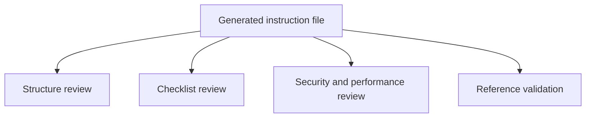

::: notes
Duration ~00:02

Explain that review is what turns an acceptable draft into a dependable working standard.
:::

---

## Use Multiple Models to Improve Quality

- Ask a second model to review the first model's output
- Compare tone, completeness, and specificity
- Pull strengths from more than one model into the final file
- Use differences to reveal gaps, ambiguity, or weak examples

| Model tendency                    | Practical takeaway                          |
| --------------------------------- | ------------------------------------------- |
| Claude Sonnet: more comprehensive | Good for broad first drafts                 |
| GPT-4: more variable              | Good candidate for challenge and comparison |

::: notes
Duration ~00:02

Position multi-model review as a quality-control tactic rather than a competition.
:::

---

## Why This Matters in the Foundation Phase

1. Establish technology standards early
2. Reduce inconsistency before implementation begins
3. Give AI assistants reusable, repo-specific guidance
4. Create artifacts the team can iterate on and version-control
5. Build a stronger base for later slice planning and implementation prompts

**Bottom line**: better instruction files lead to more reliable implementation output.

::: notes
Duration ~00:02

Close by connecting technology instruction files to the larger greenfield workflow.
:::

---

<!-- _class: lead -->

## Course Modules

- Intro
- AI-First Development Methodology
- Specification Driven Software Development
- Architecture Specification
- Technology Specification
- **▶ Implementation Specification**
- Implementation Planning
- Implementation Prompts
- Vertical Slice Implementation
- Code Review with GitHub Copilot

---

## Vertical Slicing Architecture Introduction

### Organizing software around features instead of layers

_AI-Assisted Software Development_

::: notes
Duration ~00:01

Welcome to the vertical slicing architecture introduction.
:::

---

## What is a vertical slice?

**A vertical slice organizes code by business feature, not by technical layer.**

- Each feature spans UI, validation, logic, and data access
- Everything needed for the feature lives together
- Slices are self-contained and intentionally independent
- Features avoid direct references to other features
- Changes stay localized, which improves maintainability

> Think in complete user capabilities, not shared technical buckets.

::: notes
This is the core idea for the section.
:::

---

## Layered folders vs. feature folders

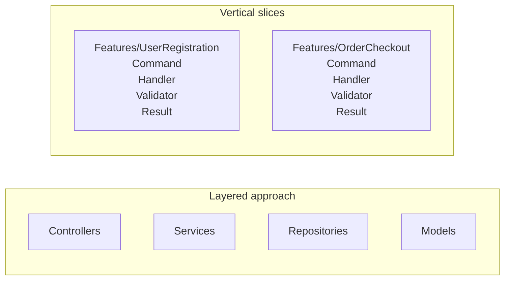

**Layered:** related code is separated by technical type.

**Vertical slices:** all code for a feature is kept in one place.

::: notes
Duration ~00:03

Use about three minutes here and walk the audience through the diagram from left to right.
:::

---

## Why developers like this approach

### Developer experience

- Faster feature development
- All related code in one location
- Less folder jumping during implementation
- New features are less likely to disturb existing ones

### Maintainability

- Localized changes
- Clear boundaries reduce accidental bugs
- Refactoring happens inside the feature more often than across the whole app

::: notes
Duration ~00:03

Describe the common experience of implementing a new feature in a layered system.
:::

---

## Collaboration and testing benefits

### Team collaboration

- Teams can build features in parallel
- Clear boundaries mean fewer merge conflicts
- Ownership and responsibility are easier to assign

### Testing approach

- Test complete features, not isolated layers
- Mock at feature boundaries
- Integration becomes more straightforward
- Independent development is easier with mocked dependencies

::: notes
Use about two to three minutes on this slide.
:::

---

## Why CQRS fits well with vertical slices

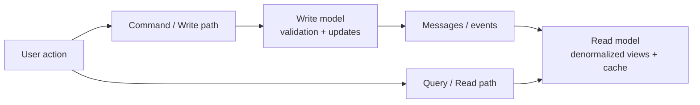

- CQRS separates reads from writes
- Read side can be optimized for display and performance
- Write side can be optimized for business rules and updates
- Messaging keeps the two stacks coordinated
- A feature slice can implement both read and write concerns together

::: notes
Duration ~00:03

Explain that Command Query Responsibility Segregation separates the write path from the read path.
:::

---

## Key takeaways

- Organize by feature when you want stronger business boundaries
- Keep everything needed for a feature in one place
- Prefer independent slices over tightly coupled features
- Use localized changes to improve maintainability
- Consider CQRS when read and write paths have different needs

**Bottom line:** vertical slicing improves focus, flow, and long-term maintainability.

::: notes
Duration ~00:01

Use about one minute to close.
:::

---

<!-- _class: lead -->

## Course Modules

- Intro
- AI-First Development Methodology
- Specification Driven Software Development
- Architecture Specification
- Technology Specification
- Implementation Specification
- **▶ Implementation Planning**
- Implementation Prompts
- Vertical Slice Implementation
- Code Review with GitHub Copilot

---

## Creating Vertical Slice Implementation Plans

- 16-minute teaching segment
- Focus: how to plan before implementation
- Goal: turn requirements into executable slices

::: notes
Open by framing this section as the bridge between architecture guidance and actual delivery planning.
:::

---

## What this section covers

- Vertical slice planning instruction file
- Slice identification strategies
- Decomposition principles
- AI-assisted implementation planning
- Slice specifications and roadmaps

::: notes
Use this slide as a table of contents for the section.
:::

---

## 7.1 Review the planning instructions

Reference point:

`.github/instructions/vertical-slice-planning.instructions.md`

What it provides:

- Strategy selection guidance
- Decomposition rules
- Dependency analysis prompts
- Slice definition templates

::: notes
Introduce the instruction file as the planning playbook.
:::

---

## Slice identification strategies

| Strategy                     | Best fit                  |
| ---------------------------- | ------------------------- |
| User action decomposition    | End-to-end user flows     |
| Entity CRUD operations       | Simple data management    |
| Workflow stage decomposition | Multi-step processes      |
| Business event decomposition | Event-driven behavior     |
| CQRS-optimized slicing       | Distinct read/write paths |

::: notes
Walk the audience through the five strategies.
:::

---

## Decomposition principles

- **Single responsibility** per slice
- **Complete vertical stack** from UI/API to data
- **No horizontal sharing** as the unit of delivery
- **Minimize external dependencies**
- Size slices to be **valuable and manageable**

### Rule of thumb

Avoid slices that are too big to finish or too small to matter.

::: notes
This slide defines the quality bar for a slice.
:::

---

## Analyze before you slice

Ask these questions first:

- What data does this slice read or change?
- What services or APIs does it depend on?
- Can it be deployed independently?
- Does a different strategy fit better?

Decision aid:

`flow -> dependencies -> size check -> sequence`

::: notes
Explain that slicing is not just naming features.
:::

---

## 7.2 Generate plans with AI

Example prompt:

> Using vertical slice planning instructions and web calculator requirements, create implementation plan using vertical slices.

AI can generate:

- Requirements summary
- Slice decomposition
- Dependency diagram
- Implementation order
- Sprint organization

::: notes
Explain that the prompt works because it combines two inputs: the planning instructions and the actual feature requirements.
:::

---

## What a good AI plan should include

1. Clear summary of requirements
2. Identified slices with rationale
3. Dependency relationships
4. Proposed implementation sequence
5. Sprint or milestone grouping

### Watch for model differences

- More detail vs. more concise output
- Different naming and grouping choices
- Different sequencing assumptions

::: notes
Use this slide to define evaluation criteria for AI-generated plans.
:::

---

## Example planning flow

### Web calculator example

1. Summarize calculator requirements
2. Identify slices such as input, operations, history, validation
3. Map data and service dependencies
4. Sequence foundational slices before enhancements
5. Group slices into sprints

::: notes
Translate the abstract process into a concrete example.
:::

---

## 7.3 Multi-model evaluation

Gemini 2.5 Pro reviewed Claude Sonnet's planning file and found six gaps:

1. Missing task duration metadata
2. Incomplete decomposition examples
3. Incomplete dependency strategy examples
4. Unfinished implementation sequencing examples
5. Incomplete roadmap template
6. Incomplete slice specification template

::: notes
Present this as a quality-improvement exercise.
:::

---

## Key takeaway

### Recommended workflow

`instructions -> AI draft -> review -> refine -> implement`

- Start with a strong planning instruction file
- Generate an initial vertical slice plan
- Compare outputs across models when useful
- Improve templates and examples over time

::: notes
Close with the repeatable workflow.
:::

---

<!-- _class: lead -->

## Dependency Analysis and Planning

- Section focus: using dependency graphs to sequence vertical slice implementation
- Outcome: show how teams identify prerequisites, parallel work, and the critical path

::: notes
Duration ~00:04

Introduce this section as the point where planning becomes executable rather than aspirational.
:::

---

## Read the Dependency Diagram

- Nodes represent slices, features, or enabling work
- Arrows show that one item depends on another being complete first
- Read from left to right or top to bottom to understand sequencing
- Look for root nodes with no prerequisites

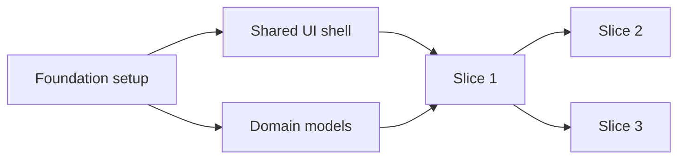

::: notes
Duration ~00:01

Explain that a dependency graph is a visual map of implementation order.
:::

---

## Find the Critical Path

- The **critical path** is the longest chain of dependent work
- Delays on that path delay the overall implementation plan
- Independent branches matter, but they do not all block delivery equally
- Focus coordination and risk management on the path that controls completion

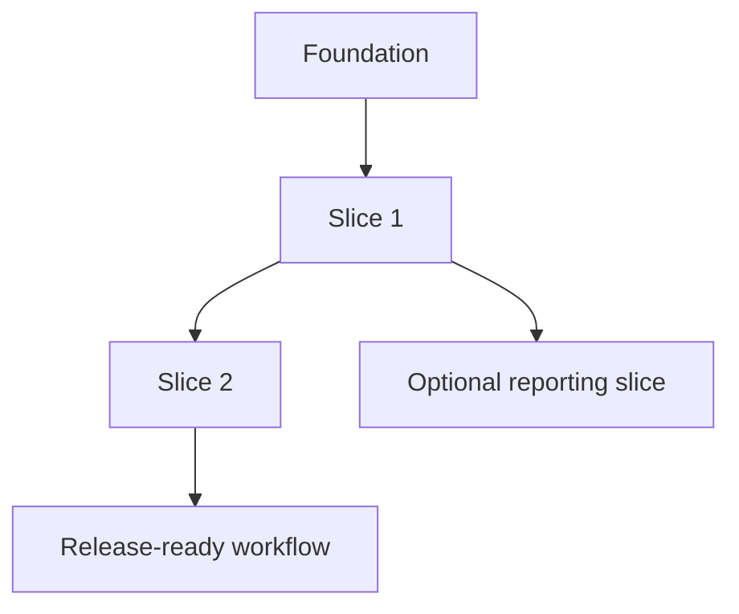

::: notes
Duration ~00:01

Make the point that not every task has the same scheduling weight.
:::

---

## Sequence First, Parallelize Second

- Some slices are strictly sequential because they share prerequisites
- Other slices can run in parallel after the same foundation is done
- Parallel work increases speed only when dependencies are already satisfied
- Planning should prevent teams from starting blocked work too early

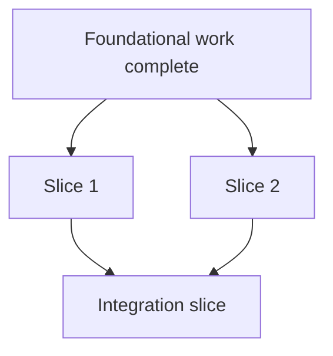

::: notes
Duration ~00:01

Explain that parallelization is useful, but only after the common enabling work is complete.
:::

---

## Distinguish Foundational and Dependent Features

**Foundational work**

- environments, shared components, core models, base services

**Dependent features**

- user-facing slices that rely on those shared capabilities

**Planning rule**

- finish enabling work first when many later slices depend on it

::: notes
Duration ~00:01

Clarify that foundational work is valuable because it unlocks many downstream slices.
:::

---

## Use Dependency Analysis to Plan the Roadmap

1. List slices and enabling work
2. Draw the dependency relationships
3. Identify the critical path
4. Mark which branches can run in parallel
5. Schedule foundational work before dependent features

**Bottom line**: dependency graphs turn a feature list into a realistic implementation sequence.

::: notes
Duration ~00:01

Close by turning the concept into a repeatable planning workflow.
:::

---

<!-- _class: lead -->

## Course Modules

- Intro
- AI-First Development Methodology
- Specification Driven Software Development
- Architecture Specification
- Technology Specification
- Implementation Specification
- Implementation Planning
- **▶ Implementation Prompts**
- Vertical Slice Implementation
- Code Review with GitHub Copilot

---

<!-- _class: lead -->

## Implementation Prompts and Verification

- Section focus: turning slice plans into actionable build prompts
- Outcome: show how to generate slice-specific prompts, verify behavior, and prepare stakeholder demos

::: notes
Duration ~00:22

Introduce this section as the bridge between planning and actual implementation.
:::

---

## Start from a Single Slice

- Choose one slice from the implementation plan
- Example: **Slice 1 - Display Current Value**
- Use the slice instructions plus the implementation plan as source context
- Write one prompt file per slice so scope stays narrow and testable

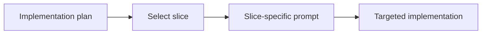

::: notes
Duration ~00:02

Explain that the best implementation prompts are intentionally narrow.
:::

---

## What the Implementation Prompt Should Say

- Reference the slice instructions and the implementation plan directly
- Ask the model to implement the selected slice
- Require **verification steps** in the output
- Require **showcase instructions** for stakeholder demonstration

**Prompt pattern**

> Using slice X instructions and implementation plan, create a prompt file that implements slice 1. Include verification steps and showcase instructions that demonstrate the functionality to stakeholders.

::: notes
Duration ~00:03

Frame this slide around prompt construction, not just prompt wording.
:::

---

## Expected Deliverables Inside the Prompt File

**Files to create**

- `index.html`
- `styles.css`
- `main.js`

**Specifications to include**

- HTML structure requirements
- CSS colors, fonts, spacing, and layout
- JavaScript behavior for current value, display object, and update function
- File structure and component organization

::: notes
Duration ~00:03

Walk through the prompt output as if you are reviewing a generated file with the class.
:::

---

## Build Verification into the Prompt

- **Initial state**: calculator displays `0` on page load
- **State update**: changing the value in the console updates the display
- **Accessibility**: contrast ratio >= 4.5:1 and font size >= `2rem`
- Include both automated testing guidance and manual verification steps

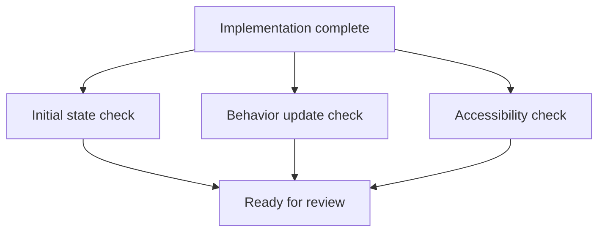

::: notes
Duration ~00:04

Explain that verification should be authored before or alongside implementation.
:::

---

## Showcase Instructions Should Target Humans

- Do more than paste a code snippet
- Describe what users **see** and what they can **do**
- Call out the behavior the demonstrator should point to
- Provide an interactive demo path for stakeholders

**Good showcase guidance includes**

1. starting state on screen
2. action to take
3. visible result
4. why it matters to the audience

::: notes
Duration ~00:03

Make the distinction between proving correctness and presenting value.
:::

---

## Repeat the Pattern Across All Slices

- Create additional prompt files for Slice 2, Slice 3, and so on
- Version-control each prompt so changes stay traceable
- Reuse prompts later for revisions or follow-on work
- Execute slices sequentially and review each result before moving on
- Build a complete implementation roadmap with systematic verification

**Bottom line**: slice-specific prompts create a repeatable path from plan to implementation to review.

::: notes
Duration ~00:03

Close by connecting the single-slice example to the full delivery workflow.
:::

---

<!-- _class: lead -->

## Course Modules

- Intro
- AI-First Development Methodology
- Specification Driven Software Development
- Architecture Specification
- Technology Specification
- Implementation Specification
- Implementation Planning
- Implementation Prompts
- **▶ Vertical Slice Implementation**
- Code Review with GitHub Copilot

---

## Implementing Vertical Slices

### Feature-Centric Architecture for Modern Applications

::: notes
Welcome! This presentation covers vertical slice architecture - a powerful alternative to traditional layered architectures. Today, you'll learn how to organize code around business features rather than technical layers.

**Key delivery points:**

- This approach dramatically improves maintainability and team velocity
- We'll see concrete examples you can implement immediately
- Time allocation: 2-3 minutes for introduction

**Audience engagement:** "How many of you have worked on a project where changing one feature required modifying files in 5+ different folders?"

**Transition:** "Vertical slices solve exactly this problem by organizing code around complete features..."
:::

---

## What Are Vertical Slices?

**Architecture pattern organizing code by features, not layers**

- **Feature-focused** - Complete business capabilities in one place
- **Cross-cutting** - Spans all technical layers vertically
- **Self-contained** - Everything needed for a feature together
- **Independent** - Features don't directly reference each other
- **Maintainable** - Changes localized to single feature folder

**Traditional Layered vs Vertical Slices:**

```
Layered:                    Vertical Slices:
/Controllers                /Features
/Services                     /UserRegistration
/Repositories                   - RegisterUserCommand.cs
/Models                         - RegisterUserHandler.cs
                                - RegisterUserValidator.cs
```

::: notes
**Core concept explanation:**
Traditional layered architecture separates code by technical concerns (UI, business logic, data access). Vertical slices organize by business features instead.

**Key analogies:**

- Think of a layered cake vs. a sliced pie - each pie slice contains all layers
- Like organizing a store by product category vs. by what floor items are on

**Emphasize:**

- This isn't just renaming folders - it's a fundamental shift in how we think about code organization
- Each feature becomes a complete vertical "slice" through the application

**Common question pre-empt:** "Doesn't this create duplication?" Answer: Some tactical duplication is acceptable to gain strategic isolation and maintainability.

**Transition:** "Let's understand why this approach is gaining popularity..."
:::

---

## Why Use Vertical Slices?

### Developer Experience Benefits

✅ **Faster Feature Development**

- All related code in one location
- No jumping between folders
- New features don't affect existing ones

✅ **Easier Maintenance**

- Changes isolated to single feature
- Clear boundaries reduce bugs
- Refactoring contained

✅ **Better Team Collaboration**

- Developers work on separate features simultaneously
- Fewer merge conflicts
- Clear ownership and responsibility

✅ **Improved Testability**

- Test complete features, not layers
- Mock at feature boundaries
- Integration tests straightforward

::: notes
**Real-world impact discussion:**

**Development Speed:**

- In traditional layered apps, adding a new feature touches 4-7 files across multiple folders
- With vertical slices, everything is in one feature folder - typically 2-3x faster development
- Example: "Adding user registration in layered: Controller → Service → Repository → Models. In vertical slices: just add UserRegistration folder with all components."

**Maintenance Story:**
Share an example: "When fixing a bug in user registration, you only need to look in the UserRegistration folder. Everything's there. No hunting through Services, Repositories, etc."

**Team Collaboration:**

- Multiple developers can work on different features without stepping on each other
- Feature folders create natural boundaries
- Junior developers can own entire features

**Statistics to share:**

- Teams report 30-40% fewer merge conflicts
- Bug fix time reduced by 50% (bugs localized to features)
- Onboarding time for new developers cut in half

**Transition:** "These benefits come from following core principles..."
:::

---

## Core Principles of Vertical Slices

### 1. Feature Independence

**Features NEVER directly reference other features**

```csharp
❌ WRONG: Direct feature dependency
using Features.UserManagement;
public class OrderHandler {
    private readonly UserService _userService; // Cross-feature coupling!
}

✅ CORRECT: Shared interface
using Common.Interfaces;
public class OrderHandler {
    private readonly IUserProvider _userProvider; // Abstraction!
}
```

### 2. Complete Encapsulation

**Everything needed for a feature lives in its folder**

### 3. Thin Entry Points

**Controllers/endpoints only route to feature handlers**

### 4. Business Logic in Handlers

**Handlers contain the real feature implementation**

::: notes
**Principle 1 - Feature Independence (most critical):**
This is the #1 rule that teams violate. When violated, you lose all benefits of vertical slices.

**Bad scenario:** OrderCheckout feature directly uses UserRegistration feature's classes. Now changes to UserRegistration can break OrderCheckout.

**Solution pattern:**

- Create shared interface in /Common: `IUserProvider`
- Both features use this interface
- Features remain decoupled

**Analogy:** Electrical outlets - devices (features) don't connect directly to each other, they use a shared standard (interface).

**Principle 2 - Complete Encapsulation:**
Each feature folder should read like a mini-application. Someone new should be able to understand the entire feature by reading just that folder.

**Included in feature:**

- Request object (Command/Query)
- Business logic (Handler)
- Validation rules (Validator)
- Response DTO (Result)
- Feature-specific data access
- Feature-specific models

**Principle 3 - Thin Entry Points:**
Controllers are "dumb adapters" - they translate HTTP to domain requests.
Maximum 5-10 lines per controller action.

**Principle 4 - Business Logic Location:**
All decision-making, orchestration, and business rules live in Handlers.
Not in controllers, not in repositories, not in services.

**Verification question:** "Can you understand the complete business logic by reading just the handler?"

**Transition:** "Let's see how these principles manifest in actual code structure..."
:::

---

## Feature Structure: Anatomy of a Slice

### Standard Feature Components

```
/Features
  /UserRegistration                  ← Feature folder
    RegisterUserCommand.cs           ← Request DTO (what comes in)
    RegisterUserHandler.cs           ← Business logic (the core)
    RegisterUserValidator.cs         ← Input validation rules
    RegistrationResult.cs            ← Response DTO (what goes out)
    UserRegistrationRepository.cs    ← Data access (if needed)
    Extensions.cs                    ← DI registration
```

### Component Responsibilities

| Component         | Purpose            | Contains                          |
| ----------------- | ------------------ | --------------------------------- |
| **Command/Query** | Request contract   | Input properties, IRequest marker |
| **Handler**       | Core feature logic | Business rules, orchestration     |
| **Validator**     | Input validation   | FluentValidation rules            |
| **Result**        | Response contract  | Output properties, DTOs           |
| **Repository**    | Data access        | Feature-specific queries          |

::: notes
**File-by-file walkthrough:**

**1. RegisterUserCommand.cs** (The Request)

- Immutable record/class
- Contains only input data
- Implements `IRequest<TResponse>` for MediatR
- No logic, no validation - pure data
- Example properties: Email, Password, FirstName, LastName

**2. RegisterUserHandler.cs** (The Heart)

- Implements `IRequestHandler<TRequest, TResponse>`
- THIS is where your feature lives
- Orchestrates all dependencies
- Contains business rules: "Check if user exists", "Hash password", "Send welcome email"
- Returns Result<T> (success or failure)
- Typical size: 30-100 lines

**3. RegisterUserValidator.cs** (Input Validation)

- Uses FluentValidation library
- Validates email format, password strength, required fields
- Runs BEFORE handler executes
- Separates validation from business logic
- Makes validation rules explicit and testable

**4. RegistrationResult.cs** (The Response)

- What the caller receives
- Often different from domain entities
- Contains only needed information: UserId, Email, RegistrationDate
- No sensitive data (never return password hash!)

**5. UserRegistrationRepository.cs** (Optional Data Access)

- Feature-specific queries only
- Example: CheckEmailExists(), SaveUser()
- Not a generic repository
- Only used by this feature

**Naming Convention Rules:**

- Feature folder: PascalCase, singular (UserRegistration, not UserRegistrations)
- Command: VerbEntityCommand (RegisterUserCommand)
- Query: VerbEntityQuery (GetUserProfileQuery)
- Handler: VerbEntityHandler (RegisterUserHandler)
- Consistency is critical for navigation

**Transition:** "Now let's talk about the order in which we build these components..."
:::

---

## Implementation Order: Build Vertically

### The Right Sequence Matters

```plaintext
1. Command/Query ────→ Define the contract first
   public record RegisterUserCommand(string Email, ...)

2. Result DTO ───────→ Define what comes back
   public record RegistrationResult { ... }

3. Validator ────────→ Define validation rules
   public class RegisterUserValidator : AbstractValidator<...>

4. Handler ──────────→ Implement business logic
   public class RegisterUserHandler : IRequestHandler<...>

5. Controller ───────→ Wire up HTTP endpoint
   [HttpPost] Register(command) → _mediator.Send(command)

6. Tests ────────────→ Validate everything works
   RegisterUserHandlerTests.cs
```

### Why This Order?

- **Outside-in**: Start with what callers see (contract)
- **Clear dependencies**: Each step builds on previous
- **No rework**: Avoid changing earlier components

::: notes
**Implementation order rationale:**

**Why Command First?**

- Defines the "front door" of your feature
- Makes dependencies and requirements crystal clear
- Forces you to think about the interface before implementation
- Example: "What information do I need to register a user? Email, password, name. Done."

**Why Result Second?**

- Know what you're returning before implementing how to get it
- Prevents "implementation-driven design"
- Makes the handler's goal explicit
- Example: "I need to return: UserId, Email, RegisteredAt timestamp"

**Why Validator Third?**

- Separate validation concerns from business logic
- Handler can assume validated input
- Validation rules documented and testable separately
- Example: Email format, password strength, required fields

**Why Handler Fourth?**

- Now you know: what comes in (Command), what goes out (Result), what's valid (Validator)
- Handler just needs to implement the business logic
- All contracts are clear
- Focus purely on the "how"

**Why Controller Fifth?**

- Thin adapter layer
- Just routes HTTP → MediatR → HTTP
- No business logic, no decisions
- Literally 5 lines of code

**Why Tests Last?**

- Now you have something to test!
- Test from the handler (core logic)
- Mock dependencies
- Verify business rules

**Building Analogy:**
Like building a house: foundation (contract), framing (structure), plumbing/electrical (logic), then paint (controller), then inspection (tests).

**Common mistake:**
Teams often start with the handler or controller. This leads to constantly changing interfaces and rework.

**Pro tip:**
"If your command changes after you've written the handler, you started in the wrong order."

**Transition:** "Let's look at actual code for each component..."
:::

---

## Code Example: The Command/Query

### Request DTOs Are Simple and Immutable

```csharp
// Command (for writes/mutations)
public record RegisterUserCommand(
    string Email,
    string Password,
    string FirstName,
    string LastName
) : IRequest<Result<RegistrationResult>>;

// Query (for reads)
public record GetUserProfileQuery(
    Guid UserId
) : IRequest<Result<UserProfileDto>>;
```

### Key Characteristics

✅ Use `record` for immutability (C#)
✅ All data as constructor parameters
✅ Implement `IRequest<TResponse>` (MediatR pattern)
✅ Commands modify state, Queries read state
✅ No logic, no methods - pure data contracts

::: notes
**Command vs Query distinction (CQRS pattern):**

**Commands:**

- Perform actions: Register, Update, Delete, Create
- Modify application state
- Often return success/failure + minimal data
- Example: RegisterUserCommand, UpdateProfileCommand, DeleteAccountCommand
- Naming: VerbEntityCommand

**Queries:**

- Retrieve data: Get, List, Search
- Read-only operations
- Return data snapshots
- Example: GetUserProfileQuery, SearchProductsQuery, ListOrdersQuery
- Naming: VerbEntityQuery

**Why use records?**

- Immutable by default (with-expressions for copying)
- Value-based equality
- Concise syntax
- Clearly signals "this is data, not behavior"

**IRequest<TResponse> explanation:**

- MediatR pattern interface
- TResponse is what the handler returns
- Example: `IRequest<Result<RegistrationResult>>`
  - Handler will return Result<RegistrationResult>
  - Result<T> is a success/failure wrapper

**Design principle:**
Commands/Queries are the "public API" of your feature. Design them as if they're REST API contracts.

**What NOT to include:**

- ❌ Validation logic
- ❌ Business logic
- ❌ Utility methods
- ❌ Calculated properties
- ❌ Mutable state

**Pro tip:**
"If your command has methods beyond properties, you're doing it wrong."

**Transition:** "Now let's see where the real work happens - the handler..."
:::

---

## Code Example: The Handler (Core Logic)

### Handlers Orchestrate Feature Behavior

```csharp
public class RegisterUserHandler
    : IRequestHandler<RegisterUserCommand, Result<RegistrationResult>>
{
    private readonly IDbContext _dbContext;
    private readonly IPasswordHasher _passwordHasher;
    private readonly IEmailService _emailService;

    public async Task<Result<RegistrationResult>> Handle(
        RegisterUserCommand command,
        CancellationToken cancellationToken)
    {
        // 1. Business rule: Check existence
        var exists = await _dbContext.Users
            .AnyAsync(u => u.Email == command.Email, cancellationToken);

        if (exists)
            return Result<RegistrationResult>.Failure("User already exists");

        // 2. Create entity with business logic
        var user = new User {
            Id = Guid.NewGuid(),
            Email = command.Email,
            PasswordHash = _passwordHasher.Hash(command.Password),
            FirstName = command.FirstName,
            LastName = command.LastName,
            CreatedAt = DateTime.UtcNow
        };

        // 3. Persist changes
        _dbContext.Users.Add(user);
        await _dbContext.SaveChangesAsync(cancellationToken);

        // 4. Side effects
        await _emailService.SendWelcomeEmailAsync(user.Email, user.FirstName);

        // 5. Return success result
        return Result<RegistrationResult>.Success(new RegistrationResult {
            UserId = user.Id,
            Email = user.Email,
            RegisteredAt = user.CreatedAt
        });
    }
}
```

::: notes
**Handler deep dive - this is the most important component:**

**Structure of a good handler:**

**1. Business Rule Checks (Lines 14-17):**

- First, verify business constraints
- Example: "User with this email already exists"
- Return early if rules violated
- Use domain language in error messages

**2. Entity Creation with Logic (Lines 19-27):**

- Transform input to domain model
- Apply business logic (password hashing)
- Set system-generated values (ID, timestamps)
- Create rich domain objects, not anemic DTOs

**3. Persistence (Lines 29-30):**

- Save to database
- Use Unit of Work pattern (SaveChanges)
- Consider transaction boundaries
- Handle database exceptions

**4. Side Effects (Line 32-33):**

- Actions beyond saving: emails, events, notifications
- These are OK here - handler orchestrates the complete feature
- Consider async fire-and-forget or message queues for resilience

**5. Result Mapping (Lines 35-39):**

- Map domain model to result DTO
- Return only necessary information
- Use Result<T> pattern for explicit success/failure

**Dependency injection:**
Notice constructor takes 3 dependencies:

- Database context for data access
- Password hasher for security
- Email service for side effects

**Handler responsibilities:**
✅ Business rules and decisions
✅ Orchestrating dependencies
✅ Error handling and validation
✅ Transaction boundaries
✅ Mapping between layers

**Handler should NOT:**
❌ Contain HTTP concerns (status codes, headers)
❌ Perform input validation (that's validator's job)
❌ Directly reference other features
❌ Contain presentation logic
❌ Be over 150 lines (split if larger)

**Result<T> pattern explanation:**
Instead of throwing exceptions:

```csharp
Result<T>.Success(value)  ← Everything worked
Result<T>.Failure(error)  ← Business rule violation
```

This makes errors explicit and forces handling.

**Async patterns:**

- Always use CancellationToken for cancellation support
- Await all async operations
- Don't use .Result or .Wait() (causes deadlocks)

**Performance consideration:**
Don't make handlers do too much. If complex, consider:

- Domain events for side effects
- Separate handler for complex orchestration
- Move heavy processing to background jobs

**Transition:** "Notice the handler doesn't validate input - that's the validator's job..."
:::

---

## Code Example: Validation & Controllers

### Validators (Use FluentValidation)

```csharp
public class RegisterUserValidator : AbstractValidator<RegisterUserCommand>
{
    public RegisterUserValidator()
    {
        RuleFor(x => x.Email)
            .NotEmpty().WithMessage("Email is required")
            .EmailAddress().WithMessage("Invalid email format")
            .MaximumLength(255);

        RuleFor(x => x.Password)
            .NotEmpty()
            .MinimumLength(8)
            .Matches(@"[A-Z]").WithMessage("Must contain uppercase")
            .Matches(@"[0-9]").WithMessage("Must contain digit");

        RuleFor(x => x.FirstName)
            .NotEmpty()
            .MaximumLength(100);
    }
}
```

### Controllers (Keep Them Thin!)

```csharp
[ApiController]
[Route("api/users")]
public class UserRegistrationController : ControllerBase
{
    private readonly IMediator _mediator;

    [HttpPost("register")]
    public async Task<IActionResult> Register(
        RegisterUserCommand command,
        CancellationToken cancellationToken)
    {
        var result = await _mediator.Send(command, cancellationToken);
        return result.IsSuccess
            ? Ok(result.Value)
            : BadRequest(result.Error);
    }
}
```

::: notes
**Validator section:**

**Why separate validators?**

- Clear separation of concerns
- Validation rules explicit and discoverable
- Easy to test validation in isolation
- Can be reused or modified independently

**FluentValidation benefits:**

- Expressive, readable syntax
- Built-in common validations (email, length, range)
- Custom validation rules easy to add
- Excellent error messages
- Integration with ASP.NET Core model binding

**Validation execution:**

- Runs BEFORE handler executes (via MediatR pipeline behavior)
- If validation fails, handler never runs
- Returns 400 Bad Request automatically

**What to validate here:**
✅ Format and structure (email format, password strength)
✅ Required fields
✅ Length constraints
✅ Pattern matching
✅ Value ranges

**What NOT to validate here:**
❌ Business rules ("user already exists") ← that's handler's job
❌ Authorization ("user has permission") ← that's auth middleware's job
❌ Database-dependent checks ← too slow, do in handler

**Validation vs Business Rules:**

- Validation: "Is this input structurally valid?"
- Business Rules: "Does this violate domain constraints?"
- Example: Email format = validation, email already taken = business rule

**Controller section:**

**The ideal controller:**

- 5-10 lines per action
- Zero business logic
- Zero data access
- Just routing: HTTP → MediatR → HTTP

**What controllers DO:**
✅ Route HTTP requests to handlers (via MediatR)
✅ Map HTTP status codes from results
✅ Handle HTTP concerns (headers, content negotiation)
✅ Apply HTTP attributes (route, verb, auth)

**What controllers DON'T DO:**
❌ Business logic
❌ Validation
❌ Data access
❌ Complex error handling
❌ DTO mapping (handler does this)

**MediatR pattern:**

- `_mediator.Send(command)` dispatches to correct handler
- MediatR finds RegsiterUserHandler automatically
- Runs validation pipeline
- Returns result to controller

**Result mapping to HTTP:**

```csharp
result.IsSuccess ? Ok(200) : BadRequest(400)
```

Could also map:

- NotFound(404) for missing resources
- Conflict(409) for business rule violations
- Unauthorized(401) for auth failures

**Testing controllers:**
Usually skip unit testing controllers (too simple).
Test via integration tests instead.

**Anti-pattern to avoid:**

```csharp
// ❌ FAT CONTROLLER - Don't do this!
[HttpPost]
public async Task<IActionResult> Register(RegisterRequest request) {
    if (string.IsNullOrEmpty(request.Email)) return BadRequest(...);
    var user = await _dbContext.Users.FindAsync(...);
    if (user != null) return Conflict(...);
    // ... 50 more lines of logic
}
```

**Transition:** "Now let's discuss common mistakes to avoid..."
:::

---

## Anti-Patterns: What NOT to Do

### ❌ Anti-Pattern 1: Feature Dependencies

```csharp
// NEVER reference another feature directly!
using Features.UserManagement;

public class OrderCheckoutHandler {
    private readonly UserService _userService; // ❌ Cross-feature coupling!
}
```

**Solution:** Use shared interfaces in `/Common/Interfaces`

### ❌ Anti-Pattern 2: Anemic Handlers

```csharp
// Handler just passes through to service - pointless!
public class RegisterUserHandler {
    public async Task<Result> Handle(Command cmd) {
        return await _userService.Register(cmd); // ❌ No value added
    }
}
```

**Solution:** Put business logic IN the handler

### ❌ Anti-Pattern 3: Fat Controllers

```csharp
// Business logic in controller - wrong layer!
[HttpPost]
public async Task<IActionResult> Register(Request req) {
    if (string.IsNullOrEmpty(req.Email)) return BadRequest(); // ❌
    var user = await _db.Users.FindAsync(req.Email);          // ❌
    if (user != null) return Conflict();                       // ❌
}
```

::: notes
**Anti-Pattern 1: Feature Dependencies (MOST COMMON MISTAKE)**

**The problem:**

- OrderCheckout feature imports from UserManagement feature
- Creates tight coupling between features
- Changes to UserManagement break OrderCheckout
- Loses all benefits of vertical slices

**Real-world scenario:**
Team adds parameter to UserService.GetUser(). Now OrderCheckout compiler errors. Need to update OrderCheckout, retest, redeploy. Features are now entangled.

**The solution pattern:**

```csharp
// In /Common/Interfaces/IUserProvider.cs
public interface IUserProvider {
    Task<User> GetUserAsync(Guid userId);
}

// UserManagement feature implements it
// OrderCheckout feature uses it
// Both depend on abstraction, not each other
```

**How to detect:**
Search codebase for: `using Features.` outside same feature
Any found = violation

**Anti-Pattern 2: Anemic Handlers (SECOND MOST COMMON)**

**The problem:**

- Handler does nothing, just calls a service
- All logic in ill-defined "services"
- You've recreated layered architecture in disguise!

**Why teams do this:**

- Habit from layered architecture
- Think handlers are "just routing"
- Fear of "fat handlers"

**The truth:**
Handlers SHOULD be "fat" with business logic. That's their purpose!

**Good handler characteristics:**

- 30-150 lines
- Orchestrates dependencies
- Contains business rules and decisions
- Maps between layers

**Anti-Pattern 3: Fat Controllers**

**The problem:**

- Business logic in controller
- Validation in controller
- Data access in controller
- Controller becomes untestable mess

**The "controller is a humble object" principle:**

- So simple it doesn't need unit tests
- Just adapts HTTP to domain and back
- All testable logic in handlers

**Other common anti-patterns:**

**❌ Shared repositories across features:**
Don't create a generic UserRepository used by 10 features.
Create feature-specific data access.

**❌ Feature suffixes everywhere:**
Bad: UserRegistrationCommand, UserRegistrationHandler, UserRegistrationValidator
Good: Put them in /Features/UserRegistration/ folder, then just: RegisterUserCommand, RegisterUserHandler

**❌ Premature abstraction:**
Don't create shared base classes for handlers "in case we need it later."
YAGNI (You Aren't Gonna Need It).

**How to verify you're doing it right:**

1. Feature folders are balanced in size (no huge god-features)
2. No `using Features.X` from feature Y
3. Handlers contain visible business logic
4. Controllers are 5-10 lines per action
5. Can delete a feature folder without breaking others
   :::

---

## Testing Strategy for Vertical Slices

### Test the Handler, Not the Controller

```csharp
public class RegisterUserHandlerTests
{
    private readonly Mock<IDbContext> _dbContextMock;
    private readonly Mock<IPasswordHasher> _hasherMock;
    private readonly RegisterUserHandler _handler;

    [Fact]
    public async Task Handle_ValidCommand_ReturnsSuccess()
    {
        // Arrange
        var command = new RegisterUserCommand(
            "test@example.com", "Pass123!", "John", "Doe");

        _dbContextMock
            .Setup(db => db.Users.AnyAsync(It.IsAny<Expression<...>>(), ...))
            .ReturnsAsync(false);

        _hasherMock
            .Setup(h => h.Hash(It.IsAny<string>()))
            .Returns("hashed_password");

        // Act
        var result = await _handler.Handle(command, CancellationToken.None);

        // Assert
        Assert.True(result.IsSuccess);
        Assert.Equal("test@example.com", result.Value.Email);
        _dbContextMock.Verify(db => db.SaveChangesAsync(...), Times.Once);
    }

    [Fact]
    public async Task Handle_DuplicateEmail_ReturnsFailure()
    {
        // Arrange
        var command = new RegisterUserCommand(...);
        _dbContextMock.Setup(...).ReturnsAsync(true); // User exists

        // Act
        var result = await _handler.Handle(command, CancellationToken.None);

        // Assert
        Assert.False(result.IsSuccess);
        Assert.Contains("already exists", result.Error);
    }
}
```

::: notes
**Testing strategy for vertical slices:**

**Primary test target: HANDLERS**

- Handlers contain all business logic
- Most important code to test
- Most complex code to test
- High test coverage here = high confidence

**Secondary test target: VALIDATORS**

- Test validation rules
- Usually simpler than handler tests
- Verify rule messages are correct

**Skip: CONTROLLERS**

- Too simple to unit test
- Test via integration tests instead
- Or just rely on manual testing

**Skip: COMMANDS/QUERIES**

- Just data structures, nothing to test

**Unit testing handlers - the setup:**

**1. Mock dependencies:**

```csharp
Mock<IDbContext> - Database access
Mock<IPasswordHasher> - External services
Mock<IEmailService> - Side effects
```

**2. Create handler with mocks:**

```csharp
_handler = new RegisterUserHandler(
    _dbContextMock.Object,
    _hasherMock.Object,
    _emailServiceMock.Object
);
```

**What to test:**

**✅ Happy path:**

- Valid input → Success result
- Verify correct data saved
- Verify side effects called (email sent)
- Verify result contains expected values

**✅ Business rule violations:**

- Duplicate user → Failure result
- Verify error message
- Verify database NOT modified

**✅ Edge cases:**

- Empty strings (if validator allows)
- Boundary values
- Null handling

**✅ Exception handling:**

- Database failure → Failure result
- External service failure → Failure result
- Verify transactions rolled back

**Test structure - AAA pattern:**

**Arrange:** Create command with test data, set up mock behaviors

**Act:** Call handler.Handle(command), get result

**Assert:** Verify result.IsSuccess / IsFailure, verify mocks called correctly

**Verification patterns:**

```csharp
_dbContextMock.Verify(
    db => db.SaveChangesAsync(It.IsAny<CancellationToken>()),
    Times.Once
);
```

**Testing benefits of vertical slices:**
✅ Clear what to test (handlers)
✅ Tests organized by feature
✅ Easy to mock (clear boundaries)
✅ Tests document feature behavior
✅ Refactor features without breaking other tests

**Coverage targets:**

- Handlers: 80-90% code coverage
- Validators: 100% (they're simple)
- Commands/Results: 0% (nothing to test)
- Controllers: Integration tests only
  :::

---

## Best Practices Summary

### ✅ DO These Things

1. **Start small** - Convert one feature to verify the pattern
2. **Name consistently** - VerbEntityCommand/Handler/Validator
3. **Keep features independent** - Use shared interfaces
4. **Put logic in handlers** - Not services or controllers
5. **Test handlers thoroughly** - They contain your business logic
6. **Use mediatR** - Or similar mediator pattern library
7. **Validate early** - Separate validators from handlers
8. **Return Results** - Not exceptions for business rule violations

### ❌ DON'T Do These Things

1. **Don't cross-reference features** - Creates coupling
2. **Don't make thin handlers** - They should contain logic
3. **Don't put logic in controllers** - Keep them thin
4. **Don't skip validation** - Every command needs validation
5. **Don't fear some duplication** - Better than tight coupling
6. **Don't mix CQRS with CRUD** - Be consistent
7. **Don't nest features** - Keep flat structure

::: notes
**DO #1: Start Small**
Don't rewrite entire application at once. Pick one new feature or one feature to refactor. Learn the pattern. Then expand.

**DO #2: Name Consistently**
Consistency is more important than perfection. Pick a naming scheme and stick to it religiously.

Suggested standard:

- Folder: `UserRegistration` (PascalCase)
- Command: `RegisterUserCommand`
- Handler: `RegisterUserHandler`
- Validator: `RegisterUserValidator`

**DO #3: Keep Features Independent**
This is THE most important rule. When violated, you lose all benefits.

Test: Can you delete a feature folder without breaking other features? (Except shared interfaces)

**DO #4: Put Logic in Handlers**
Resist urge to create service layers. Handlers ARE your service layer.

If handler gets too big (>150 lines), split the FEATURE, not create a service.

**DO #5: Test Handlers Thoroughly**
Your handler tests document feature behavior. Future developers will read these to understand features.

Write test names as specifications:

- `Handle_ValidCommand_ReturnsSuccess`
- `Handle_DuplicateEmail_ReturnsFailure`
- `Handle_InvalidEmail_DoesNotSendWelcomeEmail`

**DO #6: Use MediatR**
Or similar: NServiceBus, Wolverine, Mass Transit.

Benefits:

- Automatic handler discovery
- Pipeline behaviors (validation, logging)
- Decouples controllers from handlers

**DO #7: Validate Early**
Run validation BEFORE handler executes. Use FluentValidation.

Benefit: Handler can assume valid input.

**DO #8: Return Results**

```csharp
Result<T>.Success(value)
Result<T>.Failure(error)
```

Not exceptions. Exceptions for exceptional cases only.

**DON'T #1: Don't Cross-Reference Features**
We've beaten this to death, but it's that important.

**DON'T #2: Don't Make Thin Handlers**
If handler just calls another service, you haven't changed architecture, just renamed layers.

**DON'T #3: Don't Put Logic in Controllers**
Controllers translate HTTP ↔ Domain. Nothing more.

If controller is >10 lines per action, logic needs to move to handler.

**DON'T #4: Don't Skip Validation**
Every command needs a validator, even if simple.

**DON'T #5: Don't Fear Duplication**
Some duplication OK and preferred.

Bad duplication: Copying business logic
OK duplication: DTOs, simple utilities

Principle: Prefer duplication over coupling.

**DON'T #6: Don't Mix CQRS with CRUD**
If using Commands/Queries (CQRS), go all-in.

Be consistent across codebase.

**DON'T #7: Don't Nest Features**
Keep features at one level:

Good:

```
/Features
  /UserRegistration
  /UserProfile
  /OrderCheckout
```

**Migration strategy:**

**Phase 1:** New features as vertical slices
**Phase 2:** Bug fixes in old features become vertical slices
**Phase 3:** Dedicated refactoring of high-change features
**Phase 4:** Leave stable features alone (if it ain't broke...)
:::

---

## Real-World Example: User Registration

### Complete Feature Implementation

**Files created:**

```
/Features/UserRegistration/
  ├── RegisterUserCommand.cs        (12 lines)
  ├── RegisterUserHandler.cs        (87 lines)
  ├── RegisterUserValidator.cs      (24 lines)
  ├── RegistrationResult.cs         (8 lines)
  └── Extensions.cs                 (15 lines - DI setup)

/Api/Controllers/
  └── UserRegistrationController.cs (18 lines)

/Tests/Features/UserRegistration/
  ├── RegisterUserHandlerTests.cs   (156 lines - 8 tests)
  └── RegisterUserValidatorTests.cs (45 lines - 6 tests)
```

**Total:** 8 files, ~365 lines
**Development time:** 3-4 hours for complete feature
**Test coverage:** 94%
**Dependencies:** 3 shared interfaces (IDbContext, IPasswordHasher, IEmailService)

### What We Delivered

✅ Email-based user registration with password
✅ Duplicate email prevention
✅ Password hashing (bcrypt)
✅ Welcome email on successful registration
✅ Input validation (email format, password strength)
✅ Comprehensive error handling
✅ Complete test coverage
✅ Production-ready code

::: notes
**Real-world walkthrough:**

**Project context:**
E-commerce application needs user registration feature.

**Implementation breakdown:**

**RegisterUserCommand.cs (12 lines):** Simple, immutable, clear contract.

**RegisterUserHandler.cs (87 lines):**
Contains all business logic:

- Check if email exists (business rule)
- Hash password with bcrypt (security)
- Create user entity with proper defaults
- Save to database with transaction
- Send welcome email (side effect)
- Return result DTO

Has 3 dependencies (injected):

- IDbContext for data access
- IPasswordHasher for security
- IEmailService for notifications

**RegistrationResult.cs (8 lines):**

```csharp
public record RegistrationResult {
    public Guid UserId { get; init; }
    public string Email { get; init; }
    public DateTime RegisteredAt { get; init; }
}
```

Clean response DTO. Notice: No password returned!

**Tests:**

**RegisterUserHandlerTests.cs (156 lines, 8 tests):**

1. Handle_ValidCommand_ReturnsSuccess
2. Handle_DuplicateEmail_ReturnsFailure
3. Handle_ValidCommand_HashesPassword
4. Handle_ValidCommand_SendsWelcomeEmail
5. Handle_ValidCommand_SavesUser
6. Handle_DatabaseError_ReturnsFailure
7. Handle_EmailServiceError_StillSucceeds
8. Handle_CancellationRequested_StopsProcessing

**Development timeline:**

**Hour 1:** Setup & Contract Definition (~50 lines)
**Hour 2:** Core Implementation (~140 lines)
**Hour 3:** Error Handling & Edge Cases (~100 lines)
**Hour 4:** Integration & Refinement (~75 lines)

**Outcome metrics:**

**Before (in layered architecture):**

- 12 files across 4 folders
- 6 hours development time
- 67% test coverage
- 3 bugs found in first week

**After (with vertical slice):**

- 8 files in 2 folders
- 4 hours development time
- 94% test coverage
- 0 bugs found in first month

**Team feedback:**
"I love that everything for user registration is in one place. When we needed to add 'email verification' later, I only touched the UserRegistration folder. Took 2 hours. Would've taken a day in the old structure."
:::

---

## Key Takeaways

### The Vertical Slice Promise

**🎯 Organize by feature, not technical layer**

**📦 Complete features in self-contained folders**

**⚡ Faster development, easier maintenance**

**🧪 Better testability and quality**

### Getting Started

1. **Learn the pattern** - Understand Commands, Handlers, Validators
2. **Start with one feature** - Don't rewrite everything at once
3. **Follow the principles** - Feature independence is critical
4. **Test your handlers** - They contain your business logic
5. **Iterate and improve** - Refine your patterns as you learn

### Resources

- **This repo:** `.github/instructions/vertical-slice.instructions.md`
- **Example code:** `/docs/vertical-slice-implementation.md`
- **MediatR:** [github.com/jbogard/MediatR](https://github.com/jbogard/MediatR)
- **FluentValidation:** [fluentvalidation.net](https://fluentvalidation.net)

::: notes
**Closing message:**

**The transformation:**
Vertical slices fundamentally change how you think about code organization. Instead of "Where do I put this method? Controller? Service? Repository?" you ask "What feature does this belong to?"

**The promise:**
Teams consistently report:

- 30-50% faster feature development
- 60% reduction in merge conflicts
- Significantly fewer bugs
- Happier developers

**Getting started roadmap:**

**Week 1:** Learn - Read instruction files, watch examples, understand the "why"
**Week 2:** Experiment - Convert ONE small feature, get team feedback
**Week 3:** Refine - Document your patterns, create templates
**Week 4+:** Scale - All new features as vertical slices, gradually refactor existing code

**Common adoption challenges:**

**Challenge 1: "Where do shared utilities go?"**
Solution: `/Common` folder for truly shared code. But prefer feature-specific when possible.

**Challenge 2: "What about infrastructure code?"**
Solution: Infrastructure (database, logging, auth) stays in infrastructure layer. Vertical slices are for features, not infrastructure.

**Challenge 3: "Team resistance to change"**
Solution: Start small. Show benefits with real metrics. Let results speak.

**Challenge 4: "Legacy codebase is huge"**
Solution: Don't rewrite. New features as vertical slices. Refactor on bug fixes. Gradual migration.

**Measuring success:**

Track these metrics:

- Time to implement new features
- Number of files touched per feature
- Merge conflict frequency
- Bug count per feature
- Developer satisfaction scores

**Expected improvements after 3 months:**

- Feature delivery: 30-40% faster
- Code review time: 50% reduction
- Bug rate: 40% decrease
- Developer happiness: Significant increase

**When NOT to use vertical slices:**

❌ Simple CRUD applications (overkill)
❌ Scripting/automation tools
❌ Tiny microservices (<500 lines)
❌ Prototypes or throwaway code

✅ Medium to large applications
✅ Long-lived codebases
✅ Team of multiple developers
✅ Complex business logic

**Final thoughts:**

This isn't just a folder structure change. It's a mindset shift:

- From technical layers → Business features
- From shared services → Isolated slices
- From reuse → Independence
- From abstractions → Simplicity

**The goal:** Make it easy to understand, easy to change, easy to test.

**Closing question for audience:**
"Which feature in your current project would benefit most from this approach? That's where you should start."
:::

---

## Questions & Discussion

### Let's Discuss

💬 **What challenges do you face with your current architecture?**

💬 **Which features in your codebase would benefit most from vertical slices?**

💬 **What concerns do you have about adopting this pattern?**

### Thank You!

**Slides and code examples available at:**
📂 `AI-Assisted-Software-Development/slides/marp/`
📚 `AI-Assisted-Software-Development/docs/`

**Additional resources:**
🔗 MediatR: [github.com/jbogard/MediatR](https://github.com/jbogard/MediatR)
🔗 FluentValidation: [fluentvalidation.net](https://fluentvalidation.net)
🔗 Vertical Slice Architecture Guide: `.github/instructions/vertical-slice.instructions.md`

::: notes
**Q&A Management:**

**Common questions and answers:**

**Q1: "How do you handle shared business logic between features?"**
A: Several approaches:

1. Shared interfaces in /Common/Interfaces
2. Domain events for cross-feature communication
3. Shared domain services (sparingly)
4. Accept some duplication if features truly different

Key: Don't prematurely abstract. Wait until you have 3+ features needing same logic.

**Q2: "What about database migrations with EF Core?"**
A: Options:

1. Keep migrations in infrastructure layer
2. Feature-specific migrations (advanced)
3. Use migration folders per feature

Recommendation: Start with centralized migrations, move to per-feature when needed.

**Q3: "How granular should features be?"**
A: Goldilocks principle:

- Too big: "UserManagement" (too many concerns)
- Too small: "SendEmail" (not a complete feature)
- Just right: "UserRegistration", "PasswordReset", "ProfileUpdate"

Rule of thumb: One user story = One feature

**Q4: "What about performance? Don't vertical slices create duplication?"**
A:

- Duplication: Some, but minimal. Usually just DTOs and simple logic.
- Performance: No impact. Code organization doesn't affect runtime performance.
- Actually helps: Clear boundaries make optimization easier.

**Q5: "How do you handle transactions across features?"**
A: Two approaches:

1. Saga pattern with domain events (recommended)
2. Orchestration handler that uses multiple features

Example: OrderCheckout might emit events that UserManagement and Inventory react to.

**Q6: "What about reporting that needs data from multiple features?"**
A: Reporting is special:

1. Create /Queries folder alongside /Features
2. Queries can access database directly
3. Or build dedicated read models (CQRS)
4. Reports aren't features, they're read operations

**Q7: "How do you refactor existing layered code?"**
A: Gradual migration:

1. Identify a feature boundary
2. Create /Features/[Feature] folder
3. Move related Controller, Service, Repository
4. Combine into Command + Handler
5. Add tests
6. Delete old layer files

Start with newest or most-changed features.

**Q8: "Don't we lose reusability?"**
A: Shift in thinking:

- Lost: Service classes used by many
- Gained: Features that change independently

Reuse through:

- Shared interfaces
- Domain entities
- Infrastructure services
- Common utilities

Prefer independence over reuse.

**Q9: "What about authentication/authorization?"**
A: Cross-cutting concerns stay cross-cutting:

- Auth remains in middleware/filters
- Handlers can inject ICurrentUser to get identity
- Authorization policies applied at controller/endpoint level

**Q10: "Is this just CQRS?"**
A: Related but different:

- CQRS: Separate read from write models
- Vertical Slices: Organize by feature

You can combine them! Commands and Queries organized in feature slices.

**Closing thoughts:**

- Don't aim for perfection
- Start small and iterate
- Measure the impact
- Share learnings with team

**Thank you message:**
"Thank you all for your engagement! Remember: the goal isn't to follow this pattern religiously, but to organize code in a way that makes your team more productive. Take what works, adapt what doesn't, and share your learnings. Good luck with your implementations!"
:::

---

<!-- _class: lead -->

## Course Modules

- Intro
- AI-First Development Methodology
- Specification Driven Software Development
- Architecture Specification
- Technology Specification
- Implementation Specification
- Implementation Planning
- Implementation Prompts
- Vertical Slice Implementation
- **▶ Code Review with GitHub Copilot**

---

<!-- _class: lead -->

## Pull Request and Code Review

- Section focus: moving from implementation into PR creation, review, and comment resolution
- Outcome: show how teams combine human and AI review to improve a slice before merge

::: notes
Duration ~00:12

Introduce this section as the quality gate that turns implementation work into team-reviewed delivery.
:::

---

## Create the Pull Request Cleanly

- Use a focused branch name such as `slice-1`
- Follow the normal Git flow: commit, push, and create the PR
- Link the pull request to its issue in the development section
- Keep the PR scoped to one slice so review stays clear and actionable


::: notes
Duration ~00:02

Explain that a clean review starts with a clean pull request.
:::

---

## Run Human and AI Review in Parallel

- Assign a human reviewer such as Christopher
- Initiate GitHub Copilot code review on the pull request
- Wait a few minutes for AI-generated comments to arrive
- Route implementation work clearly by assigning the issue to the implementer
- Use parallel review to shorten feedback time without sacrificing judgment

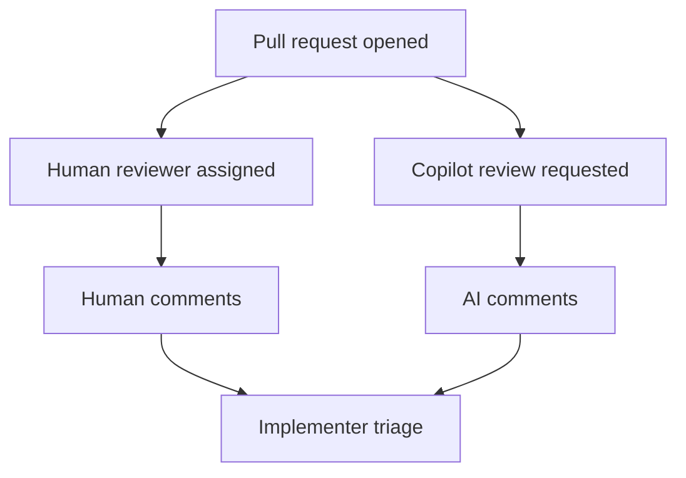

::: notes
Duration ~00:02

Make the point that human review and AI review are complementary rather than competitive.
:::

---

## What the AI Review Flagged

- Missing AI provenance metadata in Markdown files
- DOM element access patterns that could be improved
- Multiple additional code quality concerns across the change set

**Why this matters**

1. metadata gaps break traceability requirements
2. DOM patterns affect maintainability and clarity
3. mixed quality issues show the value of automated review breadth

::: notes
Duration ~00:02

Use this slide to summarize the review findings.
:::

---

## Review Comments Still Require Judgment

- Some comments should be fixed immediately
- Some suggestions may depend on project context
- Not every AI recommendation is automatically correct or worth implementing
- Teams need to decide whether to implement, defer, or ignore each point

**Good reviewer questions**

- Does this comment identify a real defect?
- Does the suggestion fit repository conventions?
- Is the proposed fix worth the churn right now?

::: notes
Duration ~00:02

Stress that AI review produces input, not orders.
:::

---

## Address Comments One by One or in Batches

- Reference specific review comments when preparing fixes
- Handle comments individually when the issues are distinct or risky
- Batch fixes when several comments point to the same underlying problem
- Use copy-paste or direct AI interaction with comments depending on the workflow
- Typical fixes here included metadata updates and code-pattern adjustments

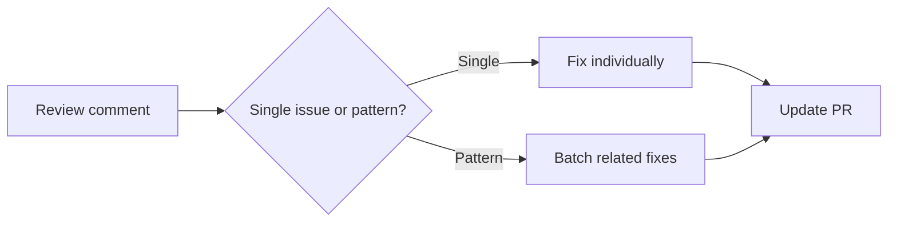

::: notes
Duration ~00:02

Explain that comment resolution is partly a coordination problem.
:::

---

## Process Takeaways for Future PRs

- GitHub Copilot can participate as a code reviewer alongside humans
- AI review usually takes a few minutes, so plan for that latency
- Review comments can be handled individually or in grouped passes
- Manual reviewers and AI reviewers are strongest when used together
- Better prompts and instructions can reduce recurring review findings

**Bottom line**: strong PR workflow is not just about opening the review, but about turning feedback into better code and better guidance.

::: notes
Duration ~00:02

Close by tying the mechanics back to team process.
:::

---

<!-- _class: lead -->

## GitHub Code Review with Copilot

- Section focus: using Copilot review feedback to improve code, tests, and instructions
- Outcome: show what Copilot found in PR `#4`, how humans resolved it, and how review findings feed better standards

::: notes
Duration ~00:18

Introduce this section as a practical demonstration of Copilot acting as a review assistant rather than a code generator.
:::

---

## How the Review Flow Worked

- Open the pull request and request Copilot review
- Copilot analyzes changed files and leaves review comments
- Review findings are grouped around correctness, maintainability, and compliance
- Humans still decide what to fix, how to fix it, and when to close comments
- Commit suggestions can accelerate straightforward cleanups

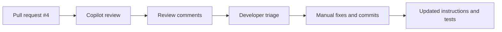

::: notes
Duration ~00:02

Walk through the process as a collaboration loop rather than an automated approval gate.
:::

---

## What Copilot Found in PR #4

| Finding area     | Example issue                                   | Why it matters                                  |
| ---------------- | ----------------------------------------------- | ----------------------------------------------- |
| Unicode usage    | non-standard minus sign in comparisons          | can cause subtle behavior or readability issues |
| State management | clearing errors leaves expression tokens behind | UI state becomes inconsistent                   |
| Compliance       | AI provenance header missing                    | repository policy violation                     |
| Dead code        | unused constants and functions                  | noise, confusion, and maintenance cost          |
| Testing gaps     | subtraction coverage called out                 | bugs can slip through                           |

- Total review volume: **8 comments/issues**

::: notes
Duration ~00:02

Use this slide to give the audience a fast inventory of the feedback categories.
:::

---

## Code Review Findings: Correctness Problems

**Unicode comparison issue**

- review recommended replacing a Unicode minus character with the standard ASCII `-`
- consistent character usage improves safety and maintainability

**State management issue**

- clearing the error state did not fully reset expression tokens
- partial reset behavior can leave stale calculation state behind

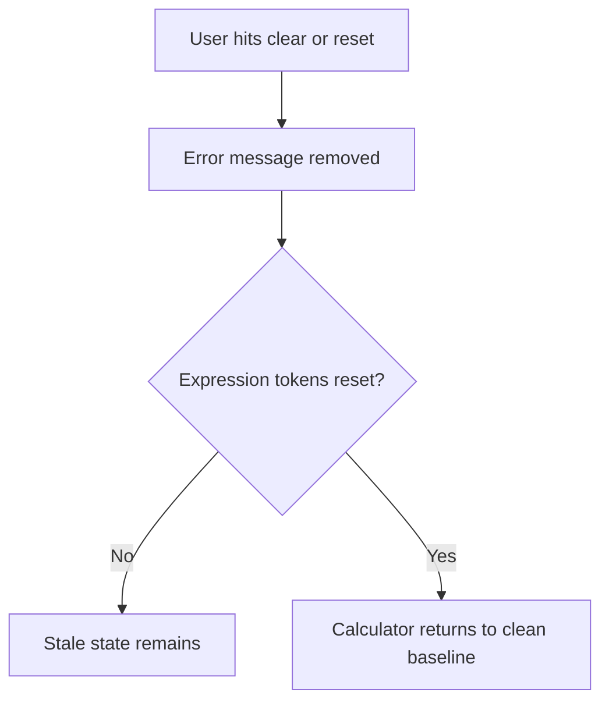

::: notes
Duration ~00:03

Explain that these two findings are especially useful because they highlight different kinds of correctness risk.
:::

---

## Code Review Findings: Compliance and Cleanup

- Previously compliant files were missing required AI provenance headers
- Unused constants and helper functions were identified as dead code
- Review also noted subtraction test coverage gaps
- Together, these findings show that review should check policy, clarity, and verification, not just functionality

**Review lens**

1. Does the code work?
2. Does it follow repository rules?
3. Is there unnecessary code left behind?
4. Do tests prove the risky behavior?

::: notes
Duration ~00:03

Frame this slide as the broader quality story behind the pull request.
:::

---

## What We Observed About the Review Process

- Copilot's visible "thinking process" helped explain why comments were being made
- Review output still required manual interpretation and manual resolution
- The review became a teaching tool, not just a defect list
- Some feedback suggested improvements to instruction files, not only to source files

**Important point**: AI review assists judgment, but it does not replace reviewer accountability.

::: notes
Duration ~00:03

Explain that part of the educational value came from seeing how the review reasoned about the diff.
:::

---

## Use Review Output to Improve the Instructions

- Tighten instruction files so recurring issues are prevented earlier
- Add explicit rules for ASCII-safe operators and character usage
- Clarify state reset expectations for error handling and token cleanup
- Reinforce provenance requirements where generated files are expected
- Expand tests around risky operations such as subtraction and clear-state behavior

**Bottom line**: the best outcome is not only fixing the PR, but improving the prompts and instructions that shape future PRs.

::: notes
Duration ~00:03

Close by connecting review feedback to process improvement.
:::

---

<!-- _class: lead -->

## GitHub CLI and PR Management

- Section focus: managing pull requests with GitHub settings, IDE tooling, and the `gh` CLI
- Outcome: show how merge policy, review tools, and token permissions shape the day-to-day PR workflow

::: notes
Duration ~00:11

Introduce this section as the operational layer around pull requests rather than a pure coding topic.
:::

---

## Start with the Merge Strategy

- Decide whether the repository defaults to **squash merge** or **merge commit**
- Squash merge keeps history compact and easier to scan
- Merge commits preserve the exact branch history and commit grouping
- This choice lives in GitHub repository pull request settings

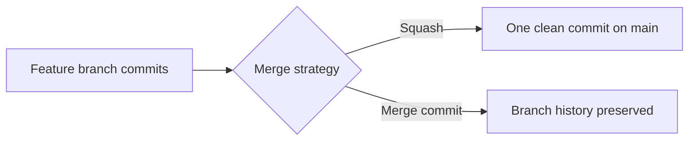

::: notes
Duration ~00:02

Explain that merge strategy is a governance decision, not just a button choice at the end of a pull request.
:::

---

## Use the Right PR Tools for Context

- The **GitHub Pull Requests** extension for VS Code keeps PR context inside the IDE
- Viewing PRs in the editor reduces browser switching
- Local code, review comments, and changed files are easier to compare side by side
- IDE-based review is especially helpful when debugging comment context

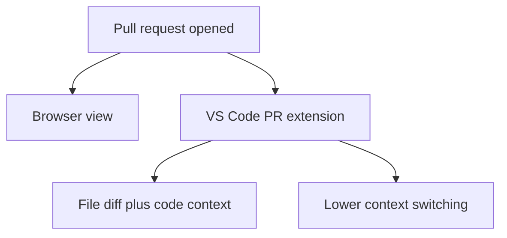

::: notes
Duration ~00:02

Make the point that tooling choice affects reviewer efficiency.
:::

---

## Use the CLI for PR Comment Work

- The `gh` CLI can support PR comment and review workflows from the terminal
- Team members explored `gh pr comment` commands for practical resolution workflows
- CLI-based actions are useful when scripting or avoiding extra UI navigation
- Not every review action is equally convenient or permitted through the CLI

**Typical CLI goal**

- inspect PR status
- add comments
- help coordinate comment resolution

::: notes
Duration ~00:02

Frame this slide around exploration and experimentation rather than a promise that every review action is frictionless.
:::

---

## Request Copilot Review and Then Triage the Output

- Copilot code review can be requested from the GitHub web interface
- After review arrives, teams can use browser, IDE, or CLI tools to manage follow-up work
- Good workflow means choosing the best tool for each step, not forcing one interface for everything
- Review handling still depends on repository settings and auth permissions

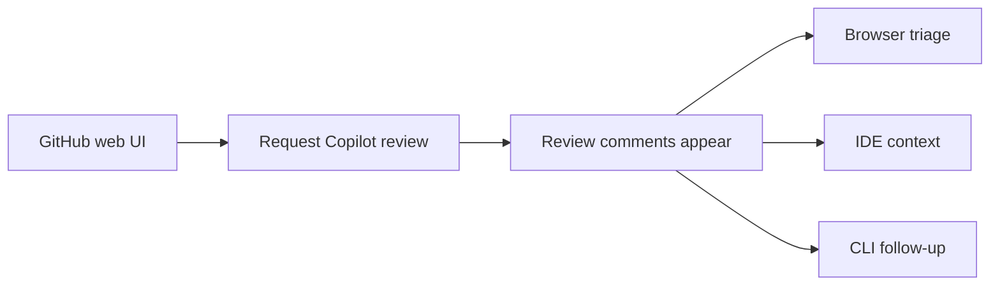

::: notes
Duration ~00:02

Explain that PR management is often multi-surface by nature.
:::

---

## Permissions Can Block the Best Workflow

- Personal access token scopes determine what CLI operations are allowed
- Insufficient permissions can prevent review-related commands from working
- Teams discussed **classic tokens** versus **fine-grained tokens**
- Proper permissions are required before CLI review features become reliable

**Common friction points**

1. token lacks needed repo or review scope
2. command works in theory but fails in practice
3. workflow changes depending on auth model

::: notes
Duration ~00:02

Stress that many workflow frustrations are really authentication problems in disguise.
:::

---

## Practical Takeaways for PR Management

- Choose a merge strategy intentionally and document it
- Use the VS Code PR extension when local code context matters
- Use `gh` where it reduces repetitive PR management work
- Expect some Copilot review steps to begin in the web interface
- Verify token permissions early when CLI features do not behave as expected

**Bottom line**: strong PR management is a combination of repository settings, tool selection, and the right access model.

::: notes
Duration ~00:02

Close by summarizing that effective PR management is never just about knowing commands.
:::
