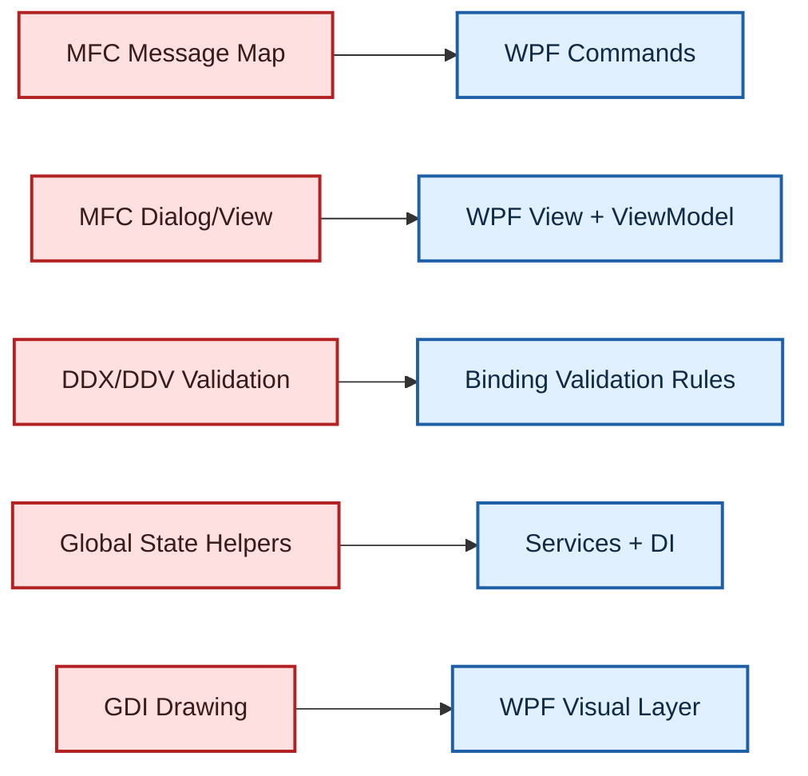

# AI-Assisted MFC to WPF Conversions

## Whole App or Module-by-Module Migration

- Target: legacy C++ MFC UI to modern WPF UI
- Approach: use AI for analysis, scaffolding, and safe refactoring
- Scope choices: full rewrite or incremental module extraction

::: notes
Duration ~00:02

Set context quickly: this is not a "press button, get app" migration. It is a controlled modernization program where AI accelerates repetitive and analytical tasks.

Emphasize that both strategies are valid. The right choice depends on coupling, release pressure, and team skills.
:::

---

## Why Migrate from MFC to WPF?

- Stronger separation of UI and logic with MVVM
- Better data binding, styling, and accessibility support
- Easier modern UX enhancements and test automation
- Improved long-term maintainability for .NET teams

::: notes
Duration ~00:02

Stress business outcomes, not just technology preference: lower change friction, faster feature delivery, and easier onboarding.

If audience asks about performance, note that WPF is usually sufficient for line-of-business apps; profile high-frequency rendering paths early.
:::

---

## Two Migration Modes

### 1) Entire App Conversion

- Replace MFC UI shell in a coordinated program
- Useful when MFC architecture is deeply entangled

### 2) Module-by-Module Conversion

- Move a bounded feature area first
- Useful when release cadence must continue

::: notes
Duration ~00:02

Call out decision criteria: dependency density, test coverage, and ability to isolate modules.

Recommend module-first for high-risk estates unless there is a strong reason for a single cutover.
:::

---

## Technical Mapping: MFC to WPF

::: notes
Duration ~00:03

Walk each mapping pair and explain the mechanical versus architectural conversion.

Mechanical: message handlers to commands. Architectural: global state to injected services.

This is where AI can provide most speed in first drafts, but all mappings need human review.
:::

---

## Entire App Playbook

1. Build inventory of dialogs, views, message handlers
2. Freeze and document current UI behavior
3. Generate WPF shell and MVVM contracts
4. Port screens by domain slices with parity checks
5. Replace integration points and remove MFC shell

::: notes
Duration ~00:03

Use AI to generate inventories and starter ViewModel templates from existing handlers.

Highlight that parity checks are mandatory before feature improvements; avoid mixing migration and redesign too early.
:::

---

## Module Conversion Playbook

1. Choose a low-coupling, high-value module
2. Define adapter boundary between MFC host and WPF module
3. Port module UI and behavior to WPF + MVVM
4. Run dual-mode verification with feature flags
5. Expand boundary until MFC dependency shrinks to zero

::: notes
Duration ~00:03

This strategy reduces blast radius and gives stakeholders visible wins earlier.

Flag-gated rollout is key. Keep rollback simple for each module cutover.
:::

---

## AI-Assisted Workflow

- Analyze legacy code: extract UI flow, dependencies, and handlers
- Generate migration backlog: screen-by-screen tasks
- Scaffold WPF artifacts: XAML, ViewModels, commands
- Draft tests: parity tests, view-model unit tests, smoke tests
- Document deltas: known behavior changes and risks

::: notes
Duration ~00:03

Position AI as a force multiplier for preparation and repetitive coding.

Require review gates: architecture review, security review, and regression checks before merge.
:::

---

## Quality Gates and Safety Nets

- Baseline parity matrix (legacy vs migrated behavior)
- Golden screenshot checks for key workflows
- Automated regression suite in CI
- Feature-flag controlled deployment
- Rollback plan per release slice

::: notes
Duration ~00:02

If there is one slide to remember, this is it. Migration fails when teams skip measurable parity and rollback readiness.

Encourage teams to build these gates before aggressive conversion starts.
:::

---

## Estimation Heuristics

- Simple dialog/module: 1-3 days
- Medium workflow area: 1-2 weeks
- Complex shell + shared state: 3-8 weeks

Risk multipliers:

- undocumented behavior
- custom rendering
- hidden cross-module coupling

::: notes
Duration ~00:02

Set expectation that estimates tighten after inventory and pilot conversion.

Tell audience to include hardening and parity validation in estimates, not only code translation time.
:::

---

## Suggested First Sprint

- Pick one module with clear boundaries
- Build migration inventory and parity checklist
- Convert to WPF with MVVM and tests
- Release behind feature flag
- Capture playbook updates for scale-out

::: notes
Duration ~00:02

End with concrete action: one pilot sprint, not a giant abstract program plan.

The goal is to validate team workflow, tooling, and risk controls before full migration throughput begins.
:::

---

## Closing

AI-assisted MFC to WPF migration works best when you combine:

- clear architectural boundaries
- strict parity and testing gates
- incremental delivery discipline

Start small, prove the path, then scale.

::: notes
Duration ~00:01

Close with confidence and pragmatism. This is a modernization journey with measurable checkpoints.

Invite follow-up: teams can choose full-app or module migration once they complete inventory and pilot evidence.
:::
