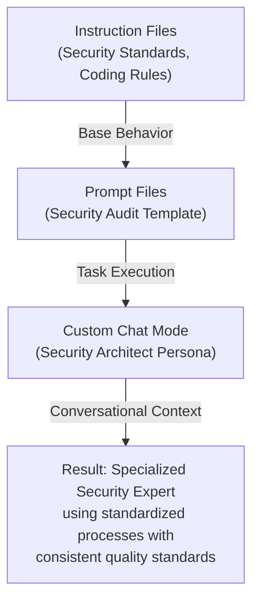

---
marp: true
theme: default
paginate: true
---
# Comparing AI Development Approaches || Know Thy Copilot: Context, Artifacts, and Agent Files

## What Are Custom Chat Modes?

Definition

- Preconfigured AI personalities for specific domains
- Combine behavioral rules with specialized knowledge
- Provide contextual expertise for particular scenarios

Key Characteristics

- Scope: Domain or role-specific interactions
- Context: Rich background knowledge and constraints
- Purpose: Act as specialized “AI expert” for conversations

---

## DevOps Engineer Custom Agent

role: "Senior DevOps Engineer"
expertise:

- CI/CD pipelines
- Infrastructure as Code
- Container orchestration
- Monitoring and observability
  behavior:
- Focus on scalability and reliability
- Recommend industry best practices
- Consider security implications
- Suggest automation opportunities

---

## Custom Chat Modes: Use Cases

Perfect For:

- Domain Expertise → Get specialized knowledge
- Role-Playing → AI acts as specific professional
- Context Switching → Different perspectives on same problem
- Learning → Educational conversations with expert personas

Examples:

- Security Architect Mode → Focus on security concerns
- Database Expert Mode → Optimize data architecture
- UX Designer Mode → Human-centered design guidance

---

## Comparison Matrix

| Aspect      | Instruction Files      | Prompt Files           | Custom Chat Modes             |
| ----------- | ---------------------- | ---------------------- | ----------------------------- |
| Purpose     | Define AI behavior     | Execute specific tasks | Provide specialized expertise |
| Scope       | Repository-wide        | Single task/workflow   | Conversational context        |
| Persistence | Always active          | On-demand execution    | Session-based                 |
| Reusability | High (across projects) | High (task templates)  | Medium (role-specific)        |
| Complexity  | Simple rules           | Detailed procedures    | Rich contextual knowledge     |

---

## Layered Integration Approach

---

## Real-World Integration Example

Scenario: Implementing User Authentication
Instruction Files provide:

- Security coding standards
- Testing requirements
- Documentation standards
  Prompt File executes:
- “Implement OAuth2 Authentication System”
- Step-by-step implementation guide
  Custom Chat Mode offers:
- Security Architect expertise
- Best practice recommendations
- Threat modeling insights

---

## The Integration Advantage

When Used Together:

- Higher Quality: Consistent standards + structured execution + expert knowledge
- Greater Efficiency: Automated workflows with specialized guidance
- Better Outcomes: Comprehensive approach covers all development aspects
- Reduced Risk: Multiple layers of validation and expertise

Result: AI becomes a true development partner, not just a code generator
