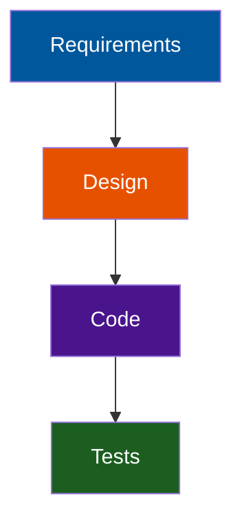

<!-- layout: Centered Title -->

# AI-Generated Code in Regulated Software

Compliance Risks & Mitigations

---

## Why This Matters

- AI-assisted development is accelerating adoption across industries
- Regulated environments face new audit vulnerabilities
- Traditional SDLC controls were not designed for AI-generated artifacts
- Organizations need clarity, governance, and repeatable processes

::: notes
Frame the urgency: AI is already in use, often informally.
Stress that regulators aren't banning AI—they expect organizations to control it.
Position this as a modernization of compliance, not a barrier to innovation.
:::

---

## Compliance Challenges

**Key Risk Areas**
  - Traceability gaps
  - Validation & verification uncertainty
  - Documentation & reproducibility issues
  - Explainability challenges
  - Change control complications
  - IP & licensing exposure

::: notes
Introduce the six major categories of risk.
Mention that these risks appear across industries, not just medical or finance.
Set up the next slides where each risk is unpacked.
:::

---

## Traceability Gaps

- No deterministic mapping from prompt to output
- Difficulty reconstructing how code was produced
- Weak auditability without additional controls

::: notes
Explain that traceability is the #1 issue auditors flag.
AI outputs are not inherently traceable unless teams enforce it.
Give a quick example: "Show me the requirement that led to this function."
:::

---

## Validation & Verification Risks

- Hallucinated or incorrect logic
- Inconsistent coding patterns
- Security vulnerabilities introduced by generated code
- Increased burden on testing and review

::: notes
Emphasize that AI-generated code can look correct but behave incorrectly.
Mention that validation must increase, not decrease, when AI is involved.
Highlight the need for automated testing.
:::

---

## Documentation & Reproducibility

- AI tools do not produce design rationale
- Prompts and model versions often untracked
- Outputs may not be reproducible
- Creates documentation debt for regulated teams

::: notes
Stress that documentation is a regulatory requirement, not a nice-to-have.
Explain that reproducibility is essential for audits and investigations.
Mention prompt logging as a mitigation we'll cover later.
:::

---

## Explainability & Review Challenges

- Non-idiomatic or opaque code
- Harder to justify decisions during audits
- Increased reviewer workload
- Potential misalignment with internal patterns

::: notes
Explain that reviewers often struggle with AI-generated code because it lacks human reasoning.
Auditors may ask "Why was this implemented this way?" and teams need an answer.
:::

---

## Change Control Issues

- Large, rapid code changes
- Unclear impact analysis
- Risk of bypassing formal workflows
- Need for explicit tagging of AI-generated changes

::: notes
Emphasize that AI can generate hundreds of lines instantly, which breaks traditional change control expectations.
Stress the importance of tagging AI-generated commits.
:::

---

## IP & Licensing Risks

- Potential inclusion of copyrighted or copyleft code
- Unclear provenance
- Legal exposure if not scanned and reviewed
- Requires automated license compliance checks

::: notes
Explain that AI models may generate code resembling licensed material.
Stress that legal teams are increasingly concerned about provenance.
:::

---

## Impacted Standards & Regulations

Cross-Industry Impact
  - **ISO/IEC 62304** (software lifecycle)
  - **ISO 14971** (risk management)
  - **SOC 2** (security & change control)
  - **SOX** (financial reporting controls)
  - **PCI-DSS** (secure coding & data protection)
  - **GDPR** (privacy by design)

::: notes
Introduce the standards landscape.
Emphasize that AI-generated code affects multiple compliance domains simultaneously.
:::

---

## Medical Device Standards

**FDA Expectations**
  - Full traceability
  - Documented verification & validation
  - Controlled change management
  - Tool qualification

**ISO/IEC 62304**
  - Lifecycle documentation
  - Architecture & design controls
  - Verification rigor

**ISO 14971**
  - New hazard sources
  - Hard-to-predict failure modes

::: notes
Highlight that medical device software is one of the most impacted domains.
Explain that AI-generated code must still meet all lifecycle and risk requirements.
:::

---

<!-- _class: hide -->

## Enterprise & Financial Standards

**SOC 2**
  - Secure SDLC
  - Change management
  - Access control

**SOX**
  - Auditability of changes
  - Segregation of duties
  - Deterministic logic in financial systems

**PCI-DSS**
  - Secure coding
  - Vulnerability management
  - Logging & monitoring

::: notes
Emphasize that enterprise auditors are already asking about AI usage.
Explain that SOX and SOC 2 care deeply about change control and auditability.
:::

---

<!-- _class: hide -->

## Privacy Regulations

**GDPR**
  - Privacy by design
  - Data minimization
  - Auditability of data flows
  - Risk of unsafe defaults in generated code

::: notes
Explain that AI-generated code may inadvertently mishandle personal data.
Stress that privacy-by-design must be preserved even with AI assistance.
:::

---

## Mitigation Strategies

**Governance & Controls**
  - Tool qualification
  - Human-in-the-loop review
  - Prompt & model version logging
  - Automated testing
  - Risk-based change control
  - IP & license scanning
  - AI Guardrails

::: notes
Introduce the mitigation section as the "how to fix it" part.
Emphasize that these controls are practical and auditable.
:::

---

## Tool Qualification

- Define intended use
- Validate outputs for accuracy
- Restrict access
- Version-lock models when possible
- Maintain prompt logs

::: notes
Explain that AI tools must be treated like any other software tool in regulated environments.
Mention that qualification does not mean certifying the model—just validating its intended use.
:::

---

## Human-in-the-Loop Review

- Mandatory peer review
- Architectural oversight
- Security review for sensitive modules
- Style and pattern conformance checks

::: notes
Stress that human review is non-negotiable.
Explain that reviewers should be trained to identify AI-specific failure modes.
:::

---

## Documentation & Traceability

- Capture prompts and model versions
- Link generated code to requirements
- Document design rationale
- Annotate code reviews for auditability

::: notes
Emphasize that prompt logging is becoming a best practice.
Explain that traceability must be restored manually if AI breaks it.
:::

---

## Automated Testing & Analysis

- Unit, integration, and regression tests
- Static analysis (SAST)
- Dynamic analysis (DAST)
- Dependency and license scanning
- Continuous validation pipelines

::: notes
Explain that automated testing compensates for AI unpredictability.
Mention that static analysis tools often catch AI-generated anti-patterns.
:::

---

## Risk Management & Change Control

- Perform impact analysis for AI-generated changes
- Tag AI-generated code in commits
- Require approvals for high-risk modules
- Maintain audit logs of generation events

::: notes
Stress that AI-generated changes should be treated as high-risk by default.
Explain that tagging AI-generated code helps during audits and investigations.
:::

---

## IP & Licensing Safeguards

- Automated license scanning
- Code similarity detection
- Legal review for high-risk components
- Policies restricting AI use in sensitive areas

::: notes
Reinforce that IP risk is real and growing.
Encourage teams to integrate license scanning into CI/CD.
:::

---

## Best Practices

- Treat AI tools as validated development tools
- Require full human review
- Maintain prompt + output logs
- Strengthen automated testing
- Enforce strict change control
- Integrate risk management into every change
- Scan for IP and licensing issues

::: notes
Summarize the "do this" list.
Encourage teams to adopt these as part of their SDLC modernization.
:::

---

## Common Pitfalls

- Allowing AI tools to commit code directly
- Failing to document prompts or model versions
- Assuming generated code is correct
- Mixing AI and human code without tagging
- Neglecting licensing risks
- Using AI without tool qualification

::: notes
Present these as "avoid these traps."
Mention that most audit findings stem from these exact issues.
:::
