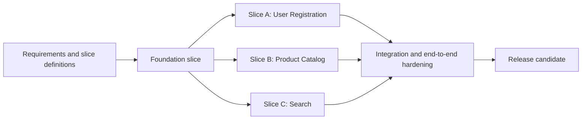

---
ai_generated: true
model: "openai/gpt-5.3-codex@2026-03-25"
operator: "johnmillerATcodemag-com"
chat_id: "vertical-slice-basic-workflow-20260325"
prompt: |
  create a marp deck that outlines a basic workflow for implementing an application in vertical slices. According to the implementation plan, some slices can be implemented in parallel.
started: "2026-03-25T00:00:00Z"
ended: "2026-03-25T00:10:00Z"
task_durations:
  - task: "deck authoring"
    duration: "00:07:00"
  - task: "workflow diagram drafting"
    duration: "00:03:00"
total_duration: "00:10:00"
ai_log: "ai-logs/2026/03/25/vertical-slice-basic-workflow-20260325/conversation.md"
source: "johnmillerATcodemag-com"
marp: true
theme: default
paginate: true
size: 16:9
title: "Basic Vertical Slice Implementation Workflow"
description: "A practical workflow for planning and implementing an application with vertical slices, including parallel slice execution."
---

# Basic Vertical Slice Workflow || Thin Slices, Big Results

---

## Basic Vertical Slice Implementation Workflow

- Goal: deliver working software in thin, end-to-end slices
- Pattern: plan dependencies first, then parallelize safe slices
- Outcome: faster feedback and lower integration risk

::: notes
Introduce the deck as a practical delivery workflow, not just an architecture concept. Emphasize that each vertical slice includes API, domain logic, persistence, and tests. Mention that parallel work is possible only after dependency analysis confirms slice independence.
:::

---

## Step 1: Define Slice Boundaries

- Start from user-visible use cases
- Split by business capability, not technical layer
- Keep each slice independently testable
- Write a short definition for every slice:
  - Scope
  - Inputs/outputs
  - Done criteria

::: notes
Explain that teams should avoid horizontal tasks like build all repositories first. Reinforce that each slice should produce demonstrable value. Recommend a short template for each slice so implementation and review stay consistent.
:::

---

## Step 2: Build the Implementation Plan

- Identify dependency chain first
- Mark slices as:
  - Foundation (must go first)
  - Parallel-ready (can run together)
  - Integration/cleanup (must go last)
- Sequence by risk and coupling

::: notes
Walk left to right. Call out that Foundation might include authentication baseline, shared contracts, and CI setup. Then point to slices A, B, and C as intentionally parallel lanes. Close by explaining that integration hardening is a separate explicit phase.
:::

---

## Step 3: Execute Slices in Parallel

- Assign owners per slice lane
- Use trunk-based integration with short-lived branches
- Keep contracts stable and versioned
- Demo each slice as soon as done

Parallel execution guardrails:

- No hidden cross-slice dependencies
- Shared schema changes reviewed early
- Contract tests required before merge

::: notes
Emphasize team coordination practices. Explain that parallel work fails when contracts are ambiguous. Recommend daily integration checks and a lightweight dependency board to catch collisions early.
:::

---

## Step 4: Integrate, Validate, and Stabilize

- Run full end-to-end and regression tests
- Validate non-functional requirements:
  - Performance
  - Security
  - Observability
- Close documentation and operational runbooks
- Freeze only when release criteria are met

::: notes
Describe this as controlled convergence, not a big bang merge. Point out that each slice already passed its own checks, so this phase focuses on system behavior and production readiness. Encourage using release checklists to avoid late surprises.
:::

---

## Practical Starter Plan (Example)

Week 1

- Foundation slice
- Finalize contracts

Week 2

- Slice A and Slice B in parallel
- Slice C starts mid-week after shared dependency lands

Week 3

- Integration hardening
- UAT and release prep

::: notes
Use this final slide as a reusable planning pattern. Mention that exact durations vary, but the structure remains stable: foundation, parallel execution, then hardening. Invite participants to adapt this pattern to their own project backlog.
:::
