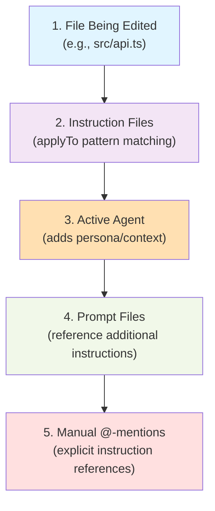

---
marp: true
theme: default
paginate: true
---

# Controlling Copilot Instruction Files || Who's Allowed at the AI Dinner Table?

---

<!-- layout: Centered Two Titles -->

## Controlling GitHub Copilot Files

Understanding Context Submission in AI-Assisted Development

::: notes
Duration ~00:20

Welcome to this session on controlling GitHub Copilot instruction files. This is a critical topic for teams implementing AI-assisted development workflows, as understanding how instructions are submitted with every prompt is essential for maintaining consistency, reducing token costs, and ensuring the right context reaches your AI assistant.

Today we'll cover four key areas: how the automatic inclusion system works through the applyTo field, how prompt files interact with instructions, how agents affect instruction submission, and practical strategies for controlling your context.

This session assumes you're familiar with basic GitHub Copilot usage and have worked with instruction files before. If you haven't, we recommend reviewing the “Creating Instruction Files” session first.
:::

---

<!-- layout: Two Content -->

## Prompt Files: Reference, Don't Control

Prompt files execute tasks, but they do not control automatic instruction inclusion.

**CRITICAL**: All AI-generated artifacts MUST comply with `.github/instructions/ai-assisted-output.instructions.md`

::: column

**Key distinction**

- Can reference instruction requirements in prompt content
- Cannot decide which instructions auto-include
- The target file's `applyTo` matching still determines automatic inclusion

::: notes
This is a common source of confusion, so let's clarify: prompt files and instruction files serve different purposes and work in different ways.

Prompt files are executable tasks - they're like scripts you run to accomplish specific goals. They contain the prompt text, expected deliverables, and requirements. When you execute a prompt file, you're asking the AI to perform a specific task following specific guidelines.

However, prompt files don't control the automatic inclusion of instruction files. What happens instead is:

You execute a prompt file (say, create-api.prompt.md)

The prompt content itself can mention or reference instruction files

The AI reads those references as part of the prompt

But the automatic inclusion of instruction files is still controlled by the applyTo patterns matching the files being created or modified

Here's a practical scenario: You run a prompt to create a new TypeScript API file. The prompt mentions that security instructions must be followed. The security.instructions.md file has applyTo: “\*/.ts”. When the AI creates the new .ts file:

The prompt content enforces the requirement

The applyTo pattern causes automatic inclusion

Both work together, but through different mechanisms

Think of it this way: Prompt files are the “what to do”, instruction files are the “how to do it”, and applyTo patterns are the “when to apply the how”.

The prompt metadata can specify output paths, which helps the system know what file types to expect and therefore which instructions might become relevant, but it's still the applyTo matching that does the heavy lifting.
:::

---

<!-- layout: Two Content -->

## Agents: Persona, Not Pattern Control

Agents create specialized context, not instruction filters.

`.github/agents/security-analyzer.agent.md`

Focus: Code security, vulnerability detection

::: column

**Interaction model**

- File being edited determines `applyTo` matches
- Matching instructions are auto-included first
- Active agent then adds persona and workflow guidance
- Final response uses both the matched instructions and the agent persona

::: notes
Agents are often misunderstood as another way to control instruction inclusion, but they actually serve a different purpose. Let's clarify their role in the context submission system.

Agents create specialized AI personas with domain expertise. When you activate an agent, you're essentially telling the AI “act as a security expert” or “act as a documentation specialist”. The agent defines:

The role and mission of the AI

Core areas of expertise

Communication style and tone

Specialized commands or workflows

Response formatting preferences

But here's the key: agents don't override or control the applyTo pattern matching system. Instead, they layer on top of it. Let's walk through the flow:

You're editing a TypeScript file (src/auth.ts)

applyTo patterns are evaluated - security.instructions.md matches

The security instructions are auto-included in context

You have the “Security Analyzer” agent active

The agent persona is added to the context

The AI now has: the file, the security instructions, AND the security expert persona

The diagram shows this flow. The file type drives instruction inclusion through pattern matching, and the agent adds a specialized persona layer on top. They're complementary, not competitive.

A practical benefit: You could have security instructions that are very technical and rule-based, while the security analyzer agent adds conversational expertise and interactive commands. The instructions say “what to check”, the agent says “how to explain findings”.

One important note: If your agent references specific instruction files in its content, those references work like any other reference - they become part of the conversation, but they don't change the automatic inclusion patterns.
:::

---

## The Control Hierarchy

Understanding the complete context assembly

::: notes
Now let's bring it all together with the complete control hierarchy. This shows the order in which different elements contribute to the context that gets submitted with your Copilot prompts.

Level 1: The Foundation - The File Being Edited Everything starts with the actual file you're working on. This could be a file you have open, a file you're creating, or files you reference in conversation. This establishes the base context and triggers the pattern matching system.

Level 2: Automatic Layer - Instruction Files Based on the file from level 1, the system evaluates all applyTo patterns in your instruction files. Every instruction file whose pattern matches your current file is automatically included. This happens silently in the background - you don't see it, but it's there. This is the primary control mechanism we've been discussing.

Level 3: Persona Layer - Active agent If you have a agent active, its persona definition, methodology, and guidelines are added to the context. This doesn't replace the instructions from level 2, it augments them. Think of this as the “personality” that interprets and applies the technical instructions.

Level 4: Task Layer - Prompt Files When you execute a prompt file, its content becomes part of the conversation. Any references to instruction files in the prompt text are processed. The prompt often specifies what type of output to create, which can trigger additional applyTo matching for the target files.

Level 5: Explicit Layer - Manual @-mentions Finally, you can always manually reference specific instruction files using @-mentions in your chat. This overrides the automatic system - if an instruction file doesn't have an applyTo match but you @-mention it, it gets included anyway.

Understanding this hierarchy helps you:

Debug why certain instructions aren't being applied

Optimize token usage by avoiding redundant inclusion

Design better instruction file patterns

Structure your workflow for maximum efficiency

Pro tip: Use levels 1-2 for 90% of your work (file-driven automatic inclusion), level 3 for specialized domains (agents), and levels 4-5 for exceptional cases (specific tasks or overrides).
:::

---

## Practical Control Strategies

Four approaches to managing instruction context

Strategy | Use Case | Example
--- | --- | ---
Specific Patterns | Domain-specific guidance | src/**/\*.ts for backend TypeScript
No applyTo | Manual inclusion only | Docs that need explicit opt-in
Global with Overrides | Base + specialized | **/\* + specific overrides
Directory Isolation | Project sections | frontend/** vs backend/**

::: notes
Let's conclude with four practical strategies you can use to manage instruction context effectively. These are patterns we've seen work well in real development teams.

Strategy 1: Specific Patterns (Recommended for Most Cases) Use precise glob patterns that match only the files where instructions are relevant. For example, if you have vertical slice architecture instructions, apply them only to your backend code: “src/backend/\*/.{cs,ts,py}”. This keeps your context clean and focused. It also reduces token costs since irrelevant instructions aren't included.

When to use: This should be your default strategy. Be specific about where instructions apply. Think about the actual files developers will be editing and match those patterns.

Strategy 2: No applyTo Field (For Specialized Use) Some instruction files shouldn't automatically include anywhere. These are typically:

Very specialized instructions that rarely apply

Experimental guidelines you're testing

Documentation that needs explicit consent to follow

Instructions with high token costs that should be opt-in

When to use: For instructions that might cause confusion if automatically included, or that are so specialized that automatic inclusion would rarely be appropriate. Developers must @-mention these explicitly.

Strategy 3: Global with Overrides (Advanced) Start with global instructions that apply everywhere (like AI provenance requirements), then create more specific instruction files that override or extend them for particular domains. For example:

ai-assisted-output.instructions.md: applyTo: “\*/”

ai-assisted-code-output.instructions.md: applyTo: “\*/.{code}” The more specific file can provide additional requirements that layer on top of the global ones.

When to use: When you have a base set of universal requirements but need domain-specific extensions. Be careful not to create conflicting instructions.

Strategy 4: Directory Isolation (For Large Projects) In large monorepos or projects with distinct sections, isolate instructions by directory. Frontend, backend, mobile, docs, infrastructure - each gets its own instruction files with directory-specific patterns. This prevents cross-contamination of concerns.

When to use: Projects with clear architectural boundaries, multi-team codebases, or when different parts of your system have fundamentally different requirements.

Implementation tip: Document your strategy in your repository's README so the team understands the pattern matching approach you're using. Include examples of which files trigger which instructions.

Remember: You can see which instructions are active by checking the Copilot context window or by asking Copilot “which instruction files are currently active?”
:::
