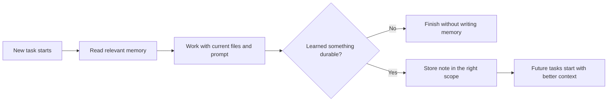

# GitHub Copilot Memory || Persistent Context Without Repeating Yourself

## Copilot Memory Feature

- Lets the agent store small, durable notes instead of relying only on the current prompt
- Reduces repeated explanation of stable preferences, repo facts, and in-progress context
- Helps future prompts start closer to the real task instead of rebuilding context each time
- Works best when memories stay short, accurate, and intentionally scoped

::: notes
Duration ~00:01

Open by defining the feature in plain terms: memory is not model magic, it is a structured note system the agent can read and update across work. Emphasize that the value is continuity, especially for repeated workflows, repository conventions, and long-running tasks that would otherwise require constant restatement. Tell the audience that the rest of the deck will focus on what gets stored, where it goes, and how to keep it useful instead of noisy. Transition by explaining that not all memory is the same and that scope is the key design choice.
:::

---

## Why Memory Matters

- Context windows are temporary working memory, not long-term project memory
- New chats often lose prior decisions unless they are written somewhere reusable
- Memory captures high-signal facts once and reuses them later
- Good memory improves consistency, speed, and prompt efficiency

> Use memory for durable facts, not for every temporary thought.

::: notes
Duration ~00:01

Make the distinction between the model's context window and the repository memory feature. The context window is transient and bounded by tokens, while memory is a persistent store for notes that survive beyond a single exchange or even a single chat. Stress that this is most valuable when teams keep repeating the same constraints, naming rules, or repository-specific practices. Transition by showing the three scopes so the audience can see how persistence is deliberately separated.
:::

---

## Three Memory Scopes

| Scope | Path | Use it for |
| --- | --- | --- |
| User memory | `/memories/` | Stable preferences and repeated personal or team patterns |
| Session memory | `/memories/session/` | Current task notes and working state for this conversation |
| Repo memory | `/memories/repo/` | Verified repository facts, conventions, and project structure |

- Scope controls who benefits from the note and how long it should live
- Short-lived task notes should not be promoted to long-lived memory automatically

::: notes
Duration ~00:02

Walk the table row by row and explain the practical meaning of each scope. User memory is broad and persistent across workspaces, session memory is temporary and chat-specific, and repo memory is the place for facts that belong to this codebase regardless of who is asking. The teaching point here is that scope is a guardrail against clutter: if everything goes into the most persistent bucket, memory quality degrades quickly. Transition by showing the normal workflow so the audience understands when the agent reads and writes these scopes.
:::

---

## Typical Memory Workflow

- Memory is consulted first, then updated only when the information is likely to matter again
- The best memories are concise, verified, and easy to reuse

::: notes
Duration ~00:02

Use the diagram to reinforce that memory is part of the workflow, not a dumping ground after the fact. The agent should read first, do the work, then decide whether anything learned is durable enough to preserve. Call out the decision diamond as the important discipline point: most task details do not deserve to become memory. Transition by moving from workflow to quality rules, because the usefulness of memory depends on what gets written.
:::

---

## What Belongs in Memory

**Good candidates**

- Preferred commands, file locations, and repeatable repo workflows
- Confirmed build or slide-pipeline rules
- Naming conventions, architectural constraints, and verified patterns
- Short reminders about mistakes worth avoiding next time

**Bad candidates**

- Secrets, credentials, tokens, or private data
- Large narrative summaries that duplicate repository files
- Guesses, unverified assumptions, or stale task details
- Everything from every chat

::: notes
Duration ~00:02

Frame this slide as memory hygiene. The audience should leave knowing that memory is a high-signal store for reusable facts, not an archive of everything that happened. Use one or two examples from this repository, such as slide authoring rules or merge-pipeline constraints, because they are concrete and immediately understandable. Transition by showing a realistic scenario where the three scopes are used together instead of in isolation.
:::

---

## Example: Slide Deck Work

1. Read repo memory and find that Marp decks require full provenance metadata and `::: notes` on every slide
2. Keep the current outline and decisions in session memory while drafting
3. If a new repeatable repo fact is confirmed, store it in repo memory for future slide tasks
4. Finish the deck without saving temporary drafting chatter as permanent memory

**Result**

- Faster starts on the next slide task
- Fewer missed repository rules
- Less repeated prompting from the user

::: notes
Duration ~00:01

Tie the concept back to the kind of work this repository already does. Explain that memory becomes a force multiplier when the agent remembers stable slide-authoring rules and pipeline constraints, while still keeping temporary drafting notes isolated to the session. The important lesson is that memory should reduce repetition without making future tasks drag around irrelevant detail. Transition by closing with the operational takeaways the audience can apply immediately.
:::

---

## Key Takeaways

- Memory gives Copilot structured continuity across tasks and sessions
- The three scopes exist to separate personal, temporary, and repository-specific notes
- Write memory sparingly and only when the fact is verified and reusable
- High-quality memory reduces prompt length and improves consistency
- Bad memory becomes noise, so curation matters as much as capture

::: notes
Duration ~00:01

Close by summarizing the feature as a disciplined context-management tool rather than a black box. Reiterate that the biggest mistake is over-storing low-value information, while the biggest advantage comes from preserving a small set of durable, trustworthy facts that the agent can use repeatedly. End with a practical prompt to the audience: ask what repository rule or recurring preference they currently repeat most often, because that is usually the first candidate for memory. 
:::