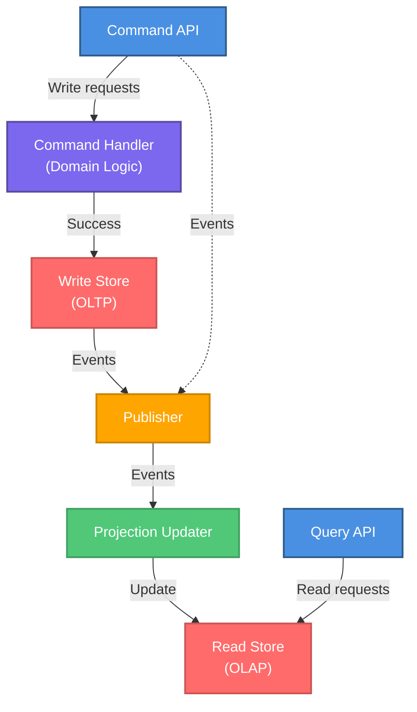

---
ai_generated: true
model: "anthropic/claude-sonnet-4.5@2026-03-18"
operator: "johnmillerATcodemag-com"
chat_id: "merge-marp-decks-20260318"
prompt: |
  Follow instructions in merge-marp-decks.prompt.md — create individual Marp slide deck
  from .github/instructions/cqrs-architecture.instructions.md
started: "2026-03-18T22:41:07Z"
ended: "2026-03-18T22:55:00Z"
task_durations:
  - task: "content analysis"
    duration: "00:03:00"
  - task: "slide creation"
    duration: "00:08:00"
  - task: "speaker notes"
    duration: "00:03:00"
total_duration: "00:14:00"
ai_log: "ai-logs/2026/03/18/merge-marp-decks-20260318/conversation.md"
source: ".github/prompts/merge-marp-decks.prompt.md"
marp: true
theme: default
paginate: true
---

# CQRS Architecture || Reads and Writes: Better Apart, Like Most Couples

---

## CQRS Benefits

- CQRS separates write (command) operations from read (query) operations
- Enables independent scaling and optimization of each model
- Useful when read and write workloads have very different characteristics

::: notes
Duration ~00:01

Welcome to the CQRS Architecture module. This session covers Command Query Responsibility Segregation — a pattern that separates read and write operations into distinct models to improve scalability and maintainability.

**Key Points**:

- CQRS separates write (command) operations from read (query) operations
- Enables independent scaling and optimization of each model
- Useful when read and write workloads have very different characteristics

**Delivery**: Begin by asking the audience about pain points with traditional CRUD APIs — high query complexity, slow writes due to query-optimized schemas, or contention between reads and writes.

**Transition**: "Let's start with when CQRS makes sense — and when it doesn't."
:::

---

<!-- Layout: Two Content -->

## When to Use CQRS

**✅ Use CQRS when:**
  - Read and write workloads scale differently
  - Read models need denormalization, caching, or projections
  - Write model needs strong invariants and task-focused workflows
  - Auditing or event sourcing is required
  - Query complexity slows transactional throughput

::: column

**❌ Avoid CQRS when:**
  - Domain is small and reads/writes are balanced
  - No clear boundary between commands and queries
  - Operational overhead is not justified

::: notes
Duration ~00:03

CQRS is a powerful pattern but it adds operational complexity. Use it only when the benefits outweigh the costs.

**Key Points**:
- The classic CRUD pattern couples reads and writes to the same model — fine for simple domains
- CQRS shines when the query model needs to be radically different from the write model
- Event sourcing almost always pairs with CQRS
- Small teams or simple domains should avoid CQRS due to added complexity

**Real-World Example**: An e-commerce order system where writes go through strict business validation but reads need highly denormalized views for catalog search, order history dashboards, and analytics.

**Audience Question**: "Has anyone implemented something like CQRS without knowing it had a name?"

**Transition**: "Let's look at the core principles that underpin CQRS."
:::

---

## Core Principles

| Principle        | Detail                                            |
| ---------------- | ------------------------------------------------- |
| **Separation**   | Commands change state; queries never change state |
| **Invariants**   | Write model enforces all business rules           |
| **Optimization** | Read model is shaped for query use cases          |
| **Independence** | Models can evolve separately                      |
| **Consistency**  | Eventual consistency between write and read       |

> Commands can fail. Queries should not.

::: notes
Duration ~00:02

These five principles guide every CQRS implementation decision.

**Key Points**:

- The read/write separation is absolute — queries must be side-effect free
- Write model is where business logic lives — all invariants enforced here
- Read models are projections built from the write model's events
- Independence is key — you can evolve the read schema without touching write logic
- Eventual consistency is usually acceptable; design for it intentionally

**Common Misconception**: CQRS does not require separate databases. You can start with a single database and separate logical models before introducing physical separation.

**Transition**: "What are the actual architectural components we need to build?"
:::

---

<!-- layout: Two Content -->

## CQRS Architecture Components

::: column

**Minimum components**

- **Command API** — receives write requests
- **Command Handler** — enforces domain rules
- **Write Store** — authoritative OLTP system
- **Publisher** — emits events reliably
- **Projection Updater** — rebuilds read models
- **Query API** — serves optimized reads
- **Read Store** — denormalized query model

::: notes
Duration ~00:03

This diagram shows the minimum components for a CQRS implementation.

**Walk Through the Diagram**:

1. Command API receives write requests and routes to handlers
2. Command Handler orchestrates domain logic and writes to the Write Store
3. Events are published after successful writes
4. Projection Updater subscribes to events and updates the Read Store
5. Query API serves the Read Store with fast, optimized queries

**Key Components**:

- **Command API**: Validates input, routes to appropriate handler
- **Command Handler**: Enforces invariants, orchestrates domain operations
- **Write Store**: OLTP database for aggregates and consistency
- **Event Publisher**: Reliable event emission (use outbox pattern)
- **Projection Updater**: Maintains read models from events
- **Query API**: Serves denormalized, query-optimized data
- **Read Store**: OLAP or document store optimized for reads

**Transition**: "Let's look at command model design in more detail."
:::

---

## Consistency Strategy

**Strong Consistency** — needed for:
  - Payments and financial transactions
  - Inventory management
  - Security and access control

**Eventual Consistency** — acceptable for:
  - Activity feeds and notifications
  - Analytics dashboards
  - Search indexes and recommendations

**Reliable Event Publication** — use the Outbox Pattern:

> Write event to database table atomically with domain change → background process publishes → idempotent consumers

::: notes
Duration ~00:03

Consistency is often the most debated aspect of CQRS implementations.

**Key Points**:

- Not all data requires strong consistency — choosing the right model reduces complexity
- The Outbox Pattern is the industry standard for reliable event publishing
- "Dual writes" (write to DB and publish in the same transaction) are dangerous — use the outbox
- Idempotent consumers handle duplicate event delivery gracefully

**The Outbox Pattern**:

1. Within the same database transaction: write the domain change AND an outbox event record
2. A background process reads unprocessed outbox events and publishes them to the message broker
3. Mark events as processed after successful publication
4. Consumers handle duplicates idempotently

**Transition**: "What common mistakes should we avoid?"
:::

---

## Example: Order Approval Flow

**Command flow (write)**:
  1. API receives `ApproveOrder` command
  2. Command handler loads `Order` aggregate
  3. Aggregate validates approval rules
  4. Transaction commits to write store
  5. `OrderApproved` event published via outbox

**Query flow (read)**:
  1. UI requests order summary dashboard
  2. Query API reads `OrderSummary` projection
  3. Read store returns denormalized view
  4. Response includes `lastUpdatedUtc` for freshness indicator

::: notes
Duration ~00:02

Tying the concepts together with a concrete example makes the pattern tangible.

**Key Points**:

- The command and query flows are completely independent paths
- The event bridges the write and read sides asynchronously
- `lastUpdatedUtc` in the query response lets the UI show freshness information
- The UI can display a "processing" indicator while the projection catches up after a command

**Discussion Question**: "What are the tradeoffs of showing the read model data vs. the command result directly after an approval?"

**Key Takeaway**: CQRS is not magic — it's a deliberate architectural choice that pays off when reads and writes truly have different requirements.
:::

---

<!-- layout: Two Content -->

## Key Takeaways

**Core reminders**

- Separate commands from queries at the architectural level
- Use CQRS when read and write workloads differ materially
- Use the outbox pattern for reliable event publication
- Design for eventual consistency intentionally
- Start small and migrate one context at a time

::: column

**Further reading**

- Martin Fowler: `martinfowler.com/bliki/CQRS.html`
- Transactional outbox: `microservices.io/patterns/data/transactional-outbox.html`
- Greg Young's CQRS documents

::: notes
Duration ~00:02

Summarize the key points and provide resources for deeper learning.

**Summary**:

- CQRS separates write models (commands) from read models (queries)
- Use it when the complexity pays off — don't over-apply
- Reliable event publication requires the outbox pattern
- Eventual consistency is the norm — manage client expectations
- Incremental migration is the safe approach

**Call to Action**: Review the `cqrs-architecture.instructions.md` file in the repository for implementation checklists and code examples.

**Q&A**: Open the floor for architecture questions and real-world implementation challenges.
:::
