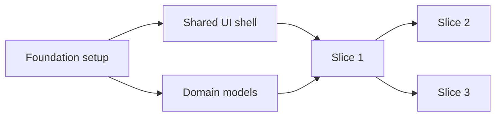
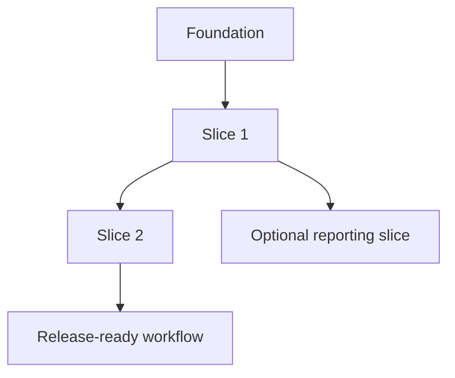
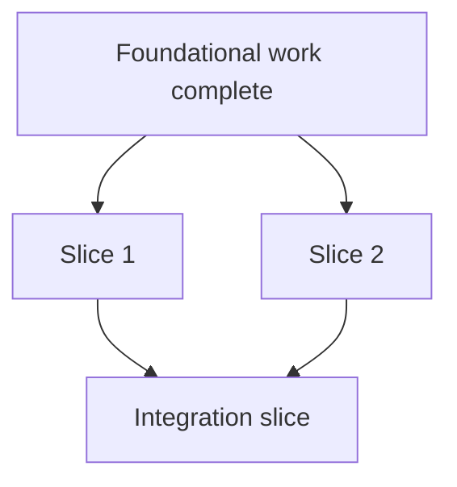

---
ai_generated: true
model: "openai/gpt-5.4@unknown"
operator: "johnmillerATcodemag-com"
chat_id: "dependency-analysis-planning-20260321"
prompt: |
  create a marp deck explaining the following content:

  ## 5. Dependency Analysis and Planning
  **Time**: 00:45:00 - 00:48:30
  **Duration**: ~3.5 minutes

  Brief discussion of dependency graphs and how they inform implementation sequencing.

  **Topics Covered**:
  - Reading and interpreting dependency diagrams
  - Understanding which slices must be completed before others
  - Identifying the critical path through implementation
  - Foundational vs. dependent features

  **Key Insights**:
  - Dependency graphs help visualize implementation order
  - Some slices can be parallelized, others are sequential
  - Foundational work must be completed first
started: "2026-03-21T17:28:42Z"
ended: "2026-03-21T17:44:42Z"
task_durations:
  - task: "slide outline"
    duration: "00:03:00"
  - task: "slide authoring"
    duration: "00:10:00"
  - task: "provenance and catalog updates"
    duration: "00:03:00"
total_duration: "00:16:00"
ai_log: "ai-logs/2026/03/21/dependency-analysis-planning-20260321/conversation.md"
source: "johnmillerATcodemag-com"
marp: true
theme: default
paginate: true
---

# Dependency Analysis and Planning || Everything Depends on This Slide (Literally)

---

## Dependency Analysis and Planning

- Section focus: using dependency graphs to sequence vertical slice implementation
- Outcome: show how teams identify prerequisites, parallel work, and the critical path

::: notes
Duration ~00:04

Introduce this section as the point where planning becomes executable rather than aspirational. Explain that dependency analysis helps the team decide what must be built first, what can safely wait, and what can happen in parallel without creating blockers.  Transition by showing a simple dependency graph and explaining how to read it.
:::

---

## Read the Dependency Diagram

- Nodes represent slices, features, or enabling work
- Arrows show that one item depends on another being complete first
- Read from left to right or top to bottom to understand sequencing
- Look for root nodes with no prerequisites

::: notes
Duration ~00:01

Explain that a dependency graph is a visual map of implementation order, not just a picture of the system. Root nodes such as foundation setup are important because they unlock other work, while downstream nodes cannot start safely until their prerequisites exist.  Transition by asking which path through the graph will determine overall progress.
:::

---

## Find the Critical Path

- The **critical path** is the longest chain of dependent work
- Delays on that path delay the overall implementation plan
- Independent branches matter, but they do not all block delivery equally
- Focus coordination and risk management on the path that controls completion

::: notes
Duration ~00:01

Make the point that not every task has the same scheduling weight. The chain from foundation through Slice 1 and Slice 2 to release readiness is the critical path because a delay anywhere in that line affects the final delivery date.  Transition by showing that some branches can still be parallelized once the right prerequisites are in place.
:::

---

## Sequence First, Parallelize Second

- Some slices are strictly sequential because they share prerequisites
- Other slices can run in parallel after the same foundation is done
- Parallel work increases speed only when dependencies are already satisfied
- Planning should prevent teams from starting blocked work too early

::: notes
Duration ~00:01

Explain that parallelization is useful, but only after the common enabling work is complete. In this example, Slice 1 and Slice 2 can move at the same time, yet the integration slice must wait until both are finished, so sequencing still matters.  Transition by separating foundational work from dependent features so the audience can see how to prioritize the backlog.
:::

---

## Distinguish Foundational and Dependent Features

**Foundational work**

- environments, shared components, core models, base services

**Dependent features**

- user-facing slices that rely on those shared capabilities

**Planning rule**

- finish enabling work first when many later slices depend on it

::: notes
Duration ~00:01

Clarify that foundational work is valuable because it unlocks many downstream slices, not because it is glamorous. Dependent features usually deliver visible business value, but they become risky or inefficient if the core infrastructure they need is missing or unstable.  Transition by summarizing a lightweight planning process the team can repeat for every implementation plan.
:::

---

## Use Dependency Analysis to Plan the Roadmap

1. List slices and enabling work
2. Draw the dependency relationships
3. Identify the critical path
4. Mark which branches can run in parallel
5. Schedule foundational work before dependent features

**Bottom line**: dependency graphs turn a feature list into a realistic implementation sequence.

::: notes
Duration ~00:01

Close by turning the concept into a repeatable planning workflow. The audience should leave with the idea that dependency analysis is a small upfront investment that prevents scheduling confusion, blocked development, and unrealistic sequencing later.  End by connecting this back to vertical slices, where smart sequencing makes incremental delivery much easier.
:::
