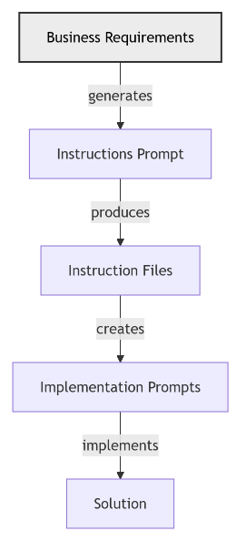

---
ai_generated: true
model: "openai/gpt-5.4@unknown"
operator: "johnmillerATcodemag-com"
chat_id: "convert-getting-started-checklist-20260326"
prompt: |
  convert "slides\pptx\_Getting Started Checklist.pptx" into a marp deck using #file:extract_pptx_to_marp.py
started: "2026-03-26T02:16:00Z"
ended: "2026-03-26T02:24:00Z"
task_durations:
  - task: "pptx extraction"
    duration: "00:02:00"
  - task: "deck normalization"
    duration: "00:04:00"
  - task: "provenance logging"
    duration: "00:02:00"
total_duration: "00:08:00"
ai_log: "ai-logs/2026/03/26/convert-getting-started-checklist-20260326/conversation.md"
source: "johnmillerATcodemag-com"
marp: true
theme: default
paginate: true
---

# Getting Started Checklist || The Recipe Before the Meal

---

## High Level AI Assisted Workflow

### From Requirements to a Solution

- Stakeholders such as SMEs, architects, SREs, and DBAs define the requirements with AI assistance.
  - AI transforms the requirements into implementation instruction files that guide the work.
- Stakeholders review, improve, and approve the instruction files.
  - AI uses those instruction files to create prompts that implement the business requirements.
  - Implementation prompts explain how the feature should be built and how acceptance criteria should be verified.
- Stakeholders review, improve, and approve the implementation prompts.
  - Submitting the implementation prompts produces an implementation that conforms to the instruction files and meets the acceptance criteria.
- Stakeholders review and approve the resulting implementation.

::: notes
Walk the audience through the lifecycle from left to right and keep the focus on the review gates between each AI-generated artifact. Stress that requirements are not handed directly to code generation; instead, they are refined into instruction files and then into implementation prompts, with stakeholder approval at each stage. Use the diagram to reinforce that this is a controlled pipeline where AI accelerates each step but humans still own correctness, safety, and acceptance. End by linking this workflow back to the checklist on the previous slides: foundation, automation, specialization, and integration all support this end-to-end model.
:::
