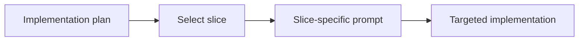
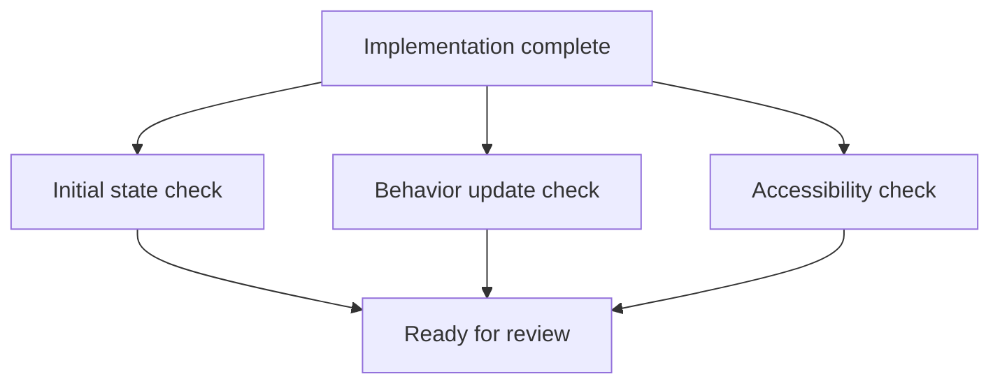

---
ai_generated: true
model: "openai/gpt-5.4@unknown"
operator: "johnmillerATcodemag-com"
chat_id: "implementation-prompts-verification-20260321"
prompt: |
  create a marp deck explaining the following content:

  ## Section 8: Implementation Prompts and Verification (Duration: 00:22:00) [x]

  ### Key Topics

  - Creating implementation prompts for individual slices
  - Slice-specific prompt files
  - Verification steps inclusion
  - Showcase/demonstration instructions
  - Detailed specifications for HTML, CSS, JavaScript
  - File structure and component organization

  ### Subsections

  #### 8.1: Implementation Prompt Creation (Duration: 00:08:00)

  - Select a slice from implementation plan (e.g., Slice 1: Display Current Value)
  - Prompt: "Using slice X instructions and implementation plan, create prompts file that implements slice 1. Include verification steps and showcase instructions that demonstrate the functionality to stakeholders."
  - Generated prompt file includes:
    - Files to create (index.html, styles.css, main.js)
    - Detailed specifications for each component
    - HTML structure requirements
    - CSS styling (colors, fonts, layout)
    - JavaScript functionality (current value property, display object, update function)

  #### 8.2: Verification Steps (Duration: 00:05:00)

  - **Initial State**: Calculator displays "0" on page load
  - **State Update**: Manual value changes in console update display
  - **Accessibility**: Color contrast ratio ≥ 4.5:1, font size ≥ 2rem
  - Automated testing guidance
  - Manual verification procedures

  #### 8.3: Showcase Instructions (Duration: 00:04:00)

  - Current version: Code snippet for demonstration
  - Improvement suggestion: Target human demonstrators
  - Should list what users see and can do
  - Behavior descriptions
  - Interactive demonstration guidance

  #### 8.4: Creating Multiple Slice Prompts (Duration: 00:05:00)

  - Repeating process for additional slices (Slice 2, etc.)
  - Building complete implementation roadmap
  - Each slice prompt is version-controlled
  - Reusable for future modifications
  - Sequential execution and review approach
  - Systematic implementation verification
started: "2026-03-21T17:28:50Z"
ended: "2026-03-21T17:43:50Z"
task_durations:
  - task: "slide outline"
    duration: "00:03:00"
  - task: "slide authoring"
    duration: "00:10:00"
  - task: "provenance and catalog updates"
    duration: "00:02:00"
total_duration: "00:15:00"
ai_log: "ai-logs/2026/03/21/implementation-prompts-verification-20260321/conversation.md"
source: "johnmillerATcodemag-com"
marp: true
theme: default
paginate: true
---
# Implementation Prompts and Verification || The Prompt That Does the Implementation (With a Checklist)

<!-- _class: lead -->

## Implementation Prompts and Verification

- Section focus: turning slice plans into actionable build prompts
- Outcome: show how to generate slice-specific prompts, verify behavior, and prepare stakeholder demos

::: notes
Duration ~00:22

Introduce this section as the bridge between planning and actual implementation. The audience should understand that a slice plan becomes much more useful when it is converted into a precise prompt that tells the AI what to build, how to verify it, and how to demonstrate it.  Transition by asking what information a good implementation prompt must capture before any code is generated.
:::

---

## Start from a Single Slice

- Choose one slice from the implementation plan
- Example: **Slice 1 - Display Current Value**
- Use the slice instructions plus the implementation plan as source context
- Write one prompt file per slice so scope stays narrow and testable

::: notes
Duration ~00:02

Explain that the best implementation prompts are intentionally narrow. Rather than asking for an entire application, the team picks one slice from the plan and turns that into a focused request that can be reviewed and tested independently.  Transition by showing what the actual prompt needs to contain once the slice is chosen.
:::

---

## What the Implementation Prompt Should Say

- Reference the slice instructions and the implementation plan directly
- Ask the model to implement the selected slice
- Require **verification steps** in the output
- Require **showcase instructions** for stakeholder demonstration

**Prompt pattern**

> Using slice X instructions and implementation plan, create a prompt file that implements slice 1. Include verification steps and showcase instructions that demonstrate the functionality to stakeholders.

::: notes
Duration ~00:03

Frame this slide around prompt construction, not just prompt wording. The important move is that the request names the slice, points to the governing instructions, and asks for more than code generation by explicitly requiring verification and demonstration guidance.  Transition by breaking down the expected deliverables inside the generated prompt file.
:::

---

## Expected Deliverables Inside the Prompt File

**Files to create**

- `index.html`
- `styles.css`
- `main.js`

**Specifications to include**

- HTML structure requirements
- CSS colors, fonts, spacing, and layout
- JavaScript behavior for current value, display object, and update function
- File structure and component organization

::: notes
Duration ~00:03

Walk through the prompt output as if you are reviewing a generated file with the class. The goal is not merely to list filenames, but to show that the prompt should describe what each file is responsible for and how the pieces fit together.  Transition by moving from implementation detail to the checks that prove the slice actually works.
:::

---

## Build Verification into the Prompt

- **Initial state**: calculator displays `0` on page load
- **State update**: changing the value in the console updates the display
- **Accessibility**: contrast ratio >= 4.5:1 and font size >= `2rem`
- Include both automated testing guidance and manual verification steps

::: notes
Duration ~00:04

Explain that verification should be authored before or alongside implementation, not after the fact. The checks on this slide are strong examples because they cover default state, observable behavior, and accessibility requirements in a way that reviewers and demonstrators can both understand.  Transition by showing how showcase instructions differ from verification even though the two are related.
:::

---

## Showcase Instructions Should Target Humans

- Do more than paste a code snippet
- Describe what users **see** and what they can **do**
- Call out the behavior the demonstrator should point to
- Provide an interactive demo path for stakeholders

**Good showcase guidance includes**

1. starting state on screen
2. action to take
3. visible result
4. why it matters to the audience

::: notes
Duration ~00:03

Make the distinction between proving correctness and presenting value. Verification asks whether the slice works; showcase guidance tells a human demonstrator how to walk stakeholders through what appears on screen, what changes, and why they should care.  Transition by expanding from one slice to the broader roadmap of multiple prompts.
:::

---

## Repeat the Pattern Across All Slices

- Create additional prompt files for Slice 2, Slice 3, and so on
- Version-control each prompt so changes stay traceable
- Reuse prompts later for revisions or follow-on work
- Execute slices sequentially and review each result before moving on
- Build a complete implementation roadmap with systematic verification

**Bottom line**: slice-specific prompts create a repeatable path from plan to implementation to review.

::: notes
Duration ~00:03

Close by connecting the single-slice example to the full delivery workflow. Each prompt becomes a reusable unit of work that can be re-run, refined, and audited over time, which is especially useful when implementation spans multiple sessions or contributors.  End by encouraging the audience to treat prompt files as versioned implementation assets, not disposable chat text.
:::
