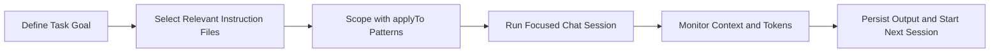

<!-- _class: lead -->

## Managing Instruction Files & Context Windows

- Instruction sharing strategies
- Instruction file scope and application
- Context window monitoring tools
- Token consumption tracking

::: notes
Set expectations for a practical session focused on repeatable team workflows. Emphasize that instruction quality and context discipline are the two biggest multipliers for reliable AI-assisted development.
:::

---

## Instruction Sharing Strategies

- Establish a central baseline in organization-level instructions
- Keep repository-level instructions close to implementation details
- Use reusable templates for recurring instruction patterns
- Share proven prompts and instruction snippets through version control

### Team Pattern

Centralize policy, decentralize implementation guidance.

::: notes
Explain that teams should avoid copy-paste drift by maintaining canonical files and linking to them. Encourage pull-request reviews specifically for instruction changes, not just code changes.
:::

---

## Instruction File Scope and Application

Use scope to target behavior precisely with `applyTo` patterns.

```yaml
applyTo: "**/*"
```

```yaml
applyTo: "slides/marp/**"
```

```yaml
applyTo: "**/*.{cs,ts,js,py,java,go,rb}"
```

### Rule of Thumb

The narrower the scope, the lower the risk of unintended instruction collisions.

::: notes
Walk through broad-to-narrow scoping. Clarify that broad scopes are for policy and compliance, while narrow scopes are for stack-specific implementation rules.
:::

---

## Context Window Monitoring Tools

- Use chat/session history panels to detect topic drift
- Track context attachments (`@workspace`, `@file`, `@terminal`) intentionally
- Start fresh chats when switching goals or bounded contexts
- Use lightweight check-ins: "What context are we currently using?"

### Signals of Context Saturation

- Repeated clarifying questions
- Loss of earlier constraints
- Increasingly generic responses

::: notes
Teach participants to recognize degradation early rather than trying to salvage overloaded context. A clean new chat is usually cheaper than continued correction loops.
:::

---

## Token Consumption Tracking

- Monitor token usage indicators in the chat interface
- Prefer concise prompts with explicit file targets
- Split large tasks into smaller, well-bounded sessions
- Archive outcomes in files instead of keeping all context in-chat

### Cost-Control Tactics

- Reduce redundant restatement
- Reuse instruction files over repeated long prompts
- Move stable constraints into persistent instruction artifacts

::: notes
Stress that token efficiency is not only cost control; it improves response quality by reducing noise. Show that structured prompts plus instruction files usually outperform long conversational buildup.
:::

---

## Workflow Blueprint



### Outcome

Predictable outputs, lower token waste, and better team-level reuse.

::: notes
Use this as the operational model teams can adopt immediately. Recommend adding this flow to onboarding docs so new contributors learn instruction and context discipline from day one.
:::

---

## Practical Checklist

- Define where instructions live: org, repo, folder, or file scope
- Validate `applyTo` patterns before broad adoption
- Monitor context quality every major prompt turn
- Track token trends for long-running work streams
- Capture reusable instruction improvements in versioned files

::: notes
End with execution guidance. Suggest running a short retrospective after one sprint to measure improvements in output quality, rework rate, and token efficiency.
:::
