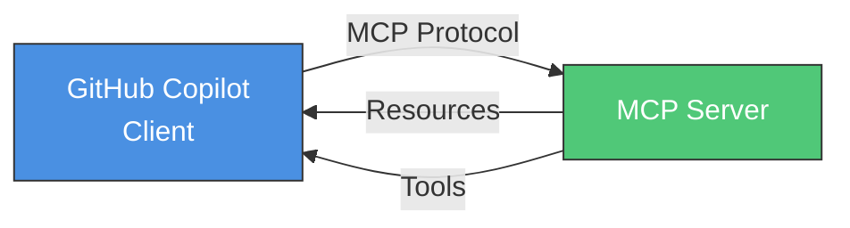
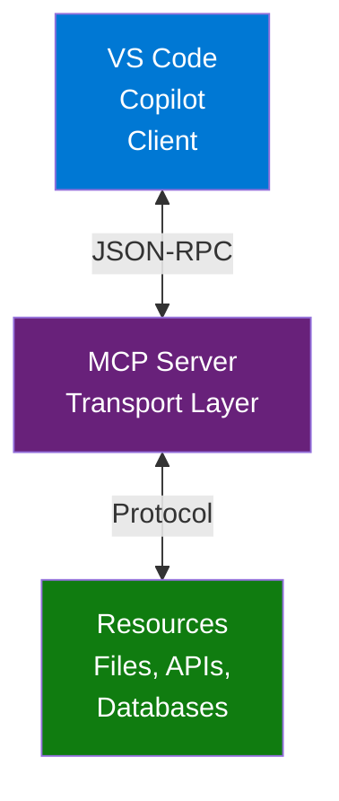
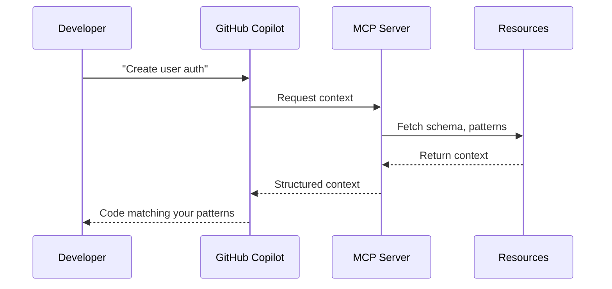

---
ai_generated: true
model: "anthropic/claude-sonnet-4-5@unknown"
operator: "johnmillerATcodemag-com"
chat_id: "mcp-model-context-protocol-servers-20260321"
prompt: |
  Merge three MCP slide decks (mcp-model-context-protocol-servers.md,
  mcp-servers-vscode-copilot.md, mcp-servers.md) into one authoritative deck.
  Use mcp-model-context-protocol-servers.md as the base, inject the hands-on
  install, Copilot integration sequence diagram, secure config, and exercise
  slides from the PPTX-extracted sources, and enhance the architecture slide
  with the Mermaid diagram from mcp-servers-vscode-copilot.md.
started: "2026-03-21T22:30:00Z"
ended: "2026-03-21T22:45:00Z"
task_durations:
  - task: "comparison and merge planning"
    duration: "00:05:00"
  - task: "slide authoring"
    duration: "00:10:00"
total_duration: "00:15:00"
ai_log: "ai-logs/2026/03/21/mcp-model-context-protocol-servers-20260321/conversation.md"
source: "johnmillerATcodemag-com"
marp: true
theme: default
paginate: true
---

# Model Context Protocol Servers || Giving Your AI a USB Hub

---

## MCP: Model Context Protocol Servers

- Connect Copilot to databases, APIs, infrastructure tools, and custom systems
- Built on a standardized protocol so any tool can speak to Copilot

::: notes
Duration ~00:15

Open by framing MCP as Copilot's extensibility layer beyond the repository. Copilot is already powerful for code in a repo, but many real workflows require reaching outside that boundary: querying a database, checking infrastructure state, or pulling from an internal API. MCP is the standard that makes all of those integrations possible.

Transition: "Let's start with what MCP actually is."
:::

---

## What Is MCP?

- **Model Context Protocol** is a standardized communication layer between Copilot and external services
- Adds capabilities and data sources that Copilot cannot access on its own
- Any tool or service that speaks MCP can be connected to Copilot
- A large and growing library of community-built servers already exists
- Key mindset: **configure and consume** — not build from scratch

::: notes
Duration ~00:02

Explain MCP as an open protocol rather than a proprietary plugin system. The key idea is standardization: any team can build a server that exposes data or capabilities to Copilot using the same protocol, which means the ecosystem grows without waiting for first-party integrations.

MCP servers are like npm packages — install and use. Configuration is simple JSON — no coding required.

Examples:

- GitHub MCP Server: Access repos and issues
- Postgres MCP Server: Query your database
- Filesystem MCP Server: Safe file access for Copilot
- Slack MCP Server: Read channels and messages

Transition: "Let's look at the architecture in detail."
:::

---

<!-- layout: Two Content -->

## Architecture: Five Components

::: column

**Components**
- **Client** — VS Code / GitHub Copilot sends requests
- **Server** — MCP server provides capabilities and data
- **Protocol** — standard message format between both sides
- **Resources** — data exposed to Copilot
- **Tools** — callable functions the server permits

::: notes
Duration ~00:03

Walk through each component methodically. The client is already familiar — VS Code with Copilot enabled. The server is what you install. The protocol is what makes them interoperable. Resources are data that can be read into context; tools are actions that Copilot can invoke on behalf of the user.

Consumer focus: think "install and configure" not "build and deploy" — like VS Code extensions from the marketplace.

Transition: "Let's see why you'd want MCP in your workflow."
:::

---

## Use Cases

**External Data Access**
  - Query live databases and include results in Copilot's context
  - Pull from internal APIs or documentation systems

**Tool Integration**
  - Control infrastructure tools like Terraform or Kubernetes directly from the editor
  - Interact with cloud provider APIs without leaving VS Code

**Custom Solutions**
  - Build a server for proprietary internal systems
  - Expose institutional data that no public server covers

::: notes
Duration ~00:01

Use this slide to show why MCP matters in practice. The most compelling cases are often ones where the developer needs real state that lives outside the repo: the current schema of a production database, the live status of a Kubernetes deployment, or data from an internal system.

Encourage the audience to think about what data sources or tools they access repeatedly that could be connected to Copilot through an MCP server.

Transition: "Let's look at what servers are available today."
:::

---

## Available Pre-Built Servers

- **GitHub Repos** — repository metadata, issues, pull requests
- **Database Systems** — Postgres, MySQL, SQLite, MongoDB
- **Terraform** — infrastructure state and plan output
- **Kubernetes** — cluster status and resource inspection
- **Cloud Provider APIs** — AWS, Azure, GCP integrations
- **Web & APIs** — REST, GraphQL, browser automation (Puppeteer)

> Community-maintained libraries add new servers regularly

::: notes
Duration ~00:01

Emphasize that you do not need to build a server to benefit from MCP. Most common integration points already have a server available.

Specific package names to mention:

- @modelcontextprotocol/server-github — Full GitHub integration
- @modelcontextprotocol/server-postgres — Direct database queries
- @modelcontextprotocol/server-filesystem — Workspace file access
- @modelcontextprotocol/server-brave-search — Web search integration
- @modelcontextprotocol/server-puppeteer — Browser automation

The infrastructure-focused servers — Terraform and Kubernetes — tend to generate the most interest in DevOps or platform engineering teams.

Transition: "Now let's find the right server for your needs."
:::

---

## Finding MCP Servers

**VS Code Extension Gallery**
  - Search `MCP` in the extensions panel
  - Read the description to confirm what resources and tools are exposed

**Model Context Protocol Website**
  - `modelcontextprotocol.io` — canonical registry and documentation

**GitHub Community Repository**
  - `github.com/modelcontextprotocol/servers` — community-maintained collection with usage examples

::: notes
Duration ~00:01

Make this actionable. The VS Code extension gallery is the fastest entry point because it is already open. The MCP website is the authoritative source for documentation and the full server registry.

Suggest that attendees check the extension gallery for the tool they care most about as a next-step exercise.

Transition: "Let's install your first MCP server."
:::

---

<!-- layout: Two Content -->

## Copilot + MCP Integration

**Enhanced capabilities**
  - **Context-aware completions** — access project-specific patterns
  - **Tool use** — Copilot can invoke server tools on your behalf
  - **Security boundaries** — controlled, audited resource access

::: column

::: notes
Duration ~00:04

Emphasize the "before and after" — without MCP, completions are based only on training data. With MCP, completions match YOUR codebase patterns.

Examples:

- Database connection: MCP provides your actual schema and connection pattern
- API calls: MCP shares your error handling approach
- Testing: MCP provides your test framework and fixture patterns

Security note: MCP servers can implement rate limiting. Audit logs track what context was provided. The permission model prevents unauthorized access.

Transition: "Let's talk about configuring these safely."
:::

---

<!-- layout: Two Content -->

## Configuring Servers Securely

**Security checklist**
  - Use environment variables for credentials
  - Grant minimum necessary permissions
  - Review server source before installing
  - Configure allowed paths and resources explicitly
  - Never use admin credentials when reader access is sufficient

::: column

**Best practices**
  - Start with read-only servers
  - Use scoped tokens such as `repo:read`
  - Enable only the capabilities you actually need
  - Test in non-production first
  - Keep servers updated

::: notes
Duration ~00:04

Security from the consumer perspective — this is all about what YOU control in configuration.

Good config examples:

// Good: Scoped GitHub token
"env": { "GITHUB_TOKEN": "${env:GH_READ_TOKEN}" }

// Good: Limited database access
"env": { "DATABASE_URL": "postgresql://readonly-user@host/db" }

// Bad: Full access token hardcoded
"env": { "TOKEN": "ghp_admintoken123456" }

Common mistakes:

- Using admin credentials when a reader role is sufficient
- Granting access to the entire filesystem instead of the workspace folder
- Not checking what data the server actually sends to AI

Transition: "Let's put this into practice."
:::
