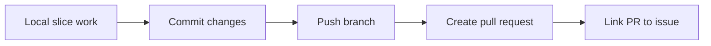
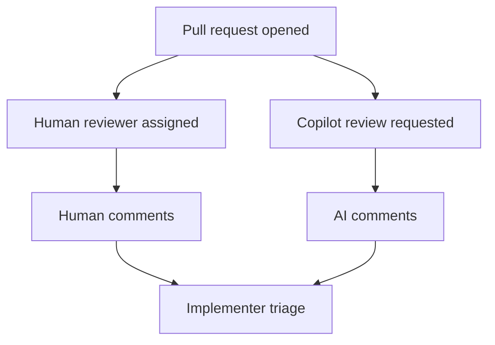
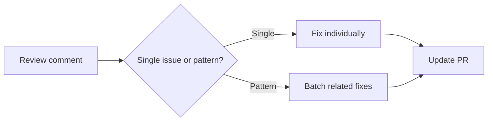

---
ai_generated: true
model: "openai/gpt-5.4@unknown"
operator: "johnmillerATcodemag-com"
chat_id: "pull-request-code-review-20260321"
prompt: |
  create a marp deck explaining the following content:

  ## 7. Pull Request and Code Review
  **Time**: 01:30:00 - 01:41:24
  **Duration**: ~11.5 minutes

  Creating pull request, initiating code reviews (both human and AI), and addressing feedback.

  **Topics Covered**:
  - **01:30:00 - 01:33:00**: Creating the pull request
    - Branch naming: "slice-1"
    - Git workflow: commit, push, create PR
    - Associating PRs with issues (development section)

  - **01:33:00 - 01:36:00**: Code review process
    - Assigning reviewers (Christopher)
    - Initiating GitHub Copilot code review
    - Waiting for AI-generated review comments
    - Assigning issue to implementer (Dan Blanchard)

  - **01:36:00 - 01:39:00**: Reviewing AI feedback
    - AI identifies missing AI provenance metadata in markdown files
    - Discussion of DOM element access patterns
    - Multiple code quality issues flagged

  - **01:39:00 - 01:41:24**: Addressing review comments
    - How to reference specific review comments
    - Copy-paste vs. direct AI interaction with comments
    - Fixing issues: AI metadata, code patterns
    - Discussion of when to implement vs. ignore certain suggestions

  **Key Issues Identified**:
  - **Markdown files missing AI provenance metadata**: AI reviewer caught missing metadata that should track the generation source
  - **DOM element access patterns**: Suggestions for improved DOM manipulation
  - **Multiple other code quality concerns**: Various improvements suggested by AI reviewer

  **Process Insights**:
  - GitHub Copilot can be added as code reviewer
  - AI review takes a few minutes to complete
  - Review comments can be addressed individually or in batch
  - Some AI suggestions may be contextual and require judgment
  - Manual reviewers work in parallel with AI reviewers
started: "2026-03-21T17:46:47Z"
ended: "2026-03-21T18:01:47Z"
task_durations:
  - task: "slide outline"
    duration: "00:03:00"
  - task: "slide authoring"
    duration: "00:09:00"
  - task: "provenance and catalog updates"
    duration: "00:03:00"
total_duration: "00:15:00"
ai_log: "ai-logs/2026/03/21/pull-request-code-review-20260321/conversation.md"
source: "johnmillerATcodemag-com"
marp: true
theme: default
paginate: true
---
# Pull Request Code Review || The Code Review That Doesn't Ghost You

<!-- _class: lead -->

## Pull Request and Code Review

- Section focus: moving from implementation into PR creation, review, and comment resolution
- Outcome: show how teams combine human and AI review to improve a slice before merge

::: notes
Duration ~00:12

Introduce this section as the quality gate that turns implementation work into team-reviewed delivery. Explain that the goal is not only to open a pull request, but to create a workflow where human reviewers and AI reviewers can both contribute useful feedback before the slice is merged.  Transition by starting with the mechanics of creating the pull request itself.
:::

---

## Create the Pull Request Cleanly

- Use a focused branch name such as `slice-1`
- Follow the normal Git flow: commit, push, and create the PR
- Link the pull request to its issue in the development section
- Keep the PR scoped to one slice so review stays clear and actionable

::: notes
Duration ~00:02

Explain that a clean review starts with a clean pull request. Branch naming, a narrow slice-focused scope, and issue linkage all make it easier for both humans and AI to understand what the change is supposed to accomplish and what context it belongs to.  Transition by showing what happens once the PR is open and reviewers are assigned.
:::

---

## Run Human and AI Review in Parallel

- Assign a human reviewer such as Christopher
- Initiate GitHub Copilot code review on the pull request
- Wait a few minutes for AI-generated comments to arrive
- Route implementation work clearly by assigning the issue to the implementer
- Use parallel review to shorten feedback time without sacrificing judgment

::: notes
Duration ~00:02

Make the point that human review and AI review are complementary rather than competitive. The human reviewer brings context, intent, and domain judgment, while Copilot can scan for policy violations, code smells, and other issues that might be easy to miss in a first pass.  Transition by looking at the kinds of issues the AI reviewer surfaced.
:::

---

## What the AI Review Flagged

- Missing AI provenance metadata in Markdown files
- DOM element access patterns that could be improved
- Multiple additional code quality concerns across the change set

**Why this matters**

1. metadata gaps break traceability requirements
2. DOM patterns affect maintainability and clarity
3. mixed quality issues show the value of automated review breadth

::: notes
Duration ~00:02

Use this slide to summarize the review findings before going into comment-handling mechanics. The key takeaway is that the AI review did not focus on one narrow category of defects; it found documentation compliance issues, implementation-pattern concerns, and general quality problems in the same run.  Transition by focusing on how the team should interpret and respond to the comments.
:::

---

## Review Comments Still Require Judgment

- Some comments should be fixed immediately
- Some suggestions may depend on project context
- Not every AI recommendation is automatically correct or worth implementing
- Teams need to decide whether to implement, defer, or ignore each point

**Good reviewer questions**

- Does this comment identify a real defect?
- Does the suggestion fit repository conventions?
- Is the proposed fix worth the churn right now?

::: notes
Duration ~00:02

Stress that AI review produces input, not orders. Review comments can be helpful, but the team still has to evaluate whether a suggestion is accurate, relevant to the slice, and worth making before merge, especially when recommendations touch patterns or style rather than outright defects.  Transition by showing practical ways to handle comments once the team decides to act.
:::

---

## Address Comments One by One or in Batches

- Reference specific review comments when preparing fixes
- Handle comments individually when the issues are distinct or risky
- Batch fixes when several comments point to the same underlying problem
- Use copy-paste or direct AI interaction with comments depending on the workflow
- Typical fixes here included metadata updates and code-pattern adjustments

::: notes
Duration ~00:02

Explain that comment resolution is partly a coordination problem. If comments are unrelated, it is safer to handle them one at a time so the reasoning stays clear, but if several comments all stem from the same root cause, batching them can reduce churn and speed up the next review pass.  Transition by ending with the broader workflow lessons the team should keep using.
:::

---

## Process Takeaways for Future PRs

- GitHub Copilot can participate as a code reviewer alongside humans
- AI review usually takes a few minutes, so plan for that latency
- Review comments can be handled individually or in grouped passes
- Manual reviewers and AI reviewers are strongest when used together
- Better prompts and instructions can reduce recurring review findings

**Bottom line**: strong PR workflow is not just about opening the review, but about turning feedback into better code and better guidance.

::: notes
Duration ~00:02

Close by tying the mechanics back to team process. The audience should leave with the idea that a pull request is a collaborative checkpoint where both human judgment and AI-assisted review improve quality, and where recurring feedback should eventually drive updates to instructions, prompts, and testing standards.  End by suggesting that every repeated review comment is a candidate for strengthening the guidance upstream.
:::
