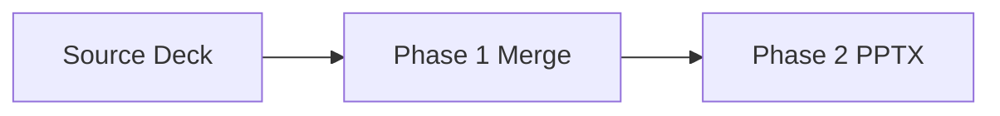

# Table Mermaid and Background Branches

::: notes
Introduce this deck as the content-feature branch coverage set.
Explain that table, mermaid, background images, and legacy inline image markers are all represented.
Mention that expected warnings are acceptable for unavailable Mermaid tooling.

**Expected PPTX Rendering:**

- Layout: Title Slide (deck-level H1, not first in manifest)
- Title Placeholder: "Table Mermaid and Background Branches"
- Subtitle Placeholder: (empty)
- Notes: This notes block content
- Phase 1 Behavior: H1 stripped during merge
  :::

---

## Background Image Title Only

::: notes
This slide should route to title-only output with a resolved background image path.
Verify background image placement and ensure no placeholder body text appears.
If the image is missing, record warning output and fix path references.

**Expected PPTX Rendering:**

- Layout: Title Only (H2 + background image only, no body text)
- Title Placeholder: "Background Image Title Only"
- Content Placeholder: (empty - background image slide)
- Background: Image from marp/images/cqrs-command-query-flow.jpg
- Notes: This notes block content
- Image Handling: ![bg fit] syntax triggers background placement
  :::

---

## Markdown Table Branch

| Branch       | Trigger               | Expected          |
| ------------ | --------------------- | ----------------- |
| Table parser | markdown table syntax | table slide path  |
| Note merge   | ::: notes block       | notes plus source |

::: notes
This table should route through the table-specific slide creation path.
The speaker notes should be combined with source metadata in PPTX.

**Expected PPTX Rendering:**

- Layout: Title and Content (table routing)
- Title Placeholder: "Markdown Table Branch"
- Content Placeholder: PowerPoint table (3 columns × 3 rows including header)
- Table Content: Headers "Branch", "Trigger", "Expected" + 2 data rows
- Notes: This notes block content + source file reference
- Table Handling: Markdown table converted to native PPTX table object
  :::

---

## Markdown Table Centering and Width

| Aspect    | Expected Layout Behavior | Verification Target          |
| --------- | ------------------------ | ---------------------------- |
| Alignment | Centered horizontally    | Equal left and right margins |
| Width     | 80% of slide width       | Matches spec and parser test |
| Height    | Row-driven growth        | Expands with table rows      |

::: notes
This slide verifies the table placement rules introduced for markdown table rendering.
Confirm the generated PowerPoint table is centered horizontally on the slide.
Measure or inspect that table width is 80 percent of the slide width rather than filling the content placeholder.

**Expected PPTX Rendering:**

- Layout: Title and Content (table routing)
- Title Placeholder: "Markdown Table Centering and Width"
- Content Placeholder: Replaced by a PowerPoint table (3 columns x 4 rows including header)
- Table Alignment: Centered horizontally on the slide
- Table Width: 80% of total slide width
- Table Height: Driven by row count using the table slide sizing logic
- Notes: This notes block content + source file reference
- Verification Focus: Left offset equals remaining horizontal margin after applying 80% width rule
  :::

---

<!-- layout: Two Content -->

## Explicit Layout Table Branch

| Case                    | Input Condition                        | Expected Result                          |
| ----------------------- | -------------------------------------- | ---------------------------------------- |
| Named layout present    | `<!-- layout: Two Content -->` comment | Table still renders as native PPTX table |
| Markdown table detected | Standard pipe table syntax             | Table branch takes precedence            |
| Slide title retained    | H2 heading present                     | Title remains in title placeholder       |

::: notes
This slide verifies that explicit layout comments do not bypass markdown table detection.
Confirm the generator still routes through the native table path even when a named layout comment is present.
This protects the regression where explicit Two Content layout could otherwise suppress the table-specific rendering branch.

**Expected PPTX Rendering:**

- Layout: Title and Content with native table insertion
- Title Placeholder: "Explicit Layout Table Branch"
- Content Placeholder: Replaced by a PowerPoint table (3 columns x 4 rows including header)
- Table Handling: Markdown table conversion takes precedence over generic named-layout body rendering
- Notes: This notes block content + source file reference
- Verification Focus: No plain body-text rendering of the markdown pipe syntax
  :::

---

## **Bold Formatting Branch**

This paragraph contains **bold text** alongside normal text.

- **Bold bullet label** followed by normal explanation text
- Normal bullet prefix with **bold emphasis** later in the line

::: notes
This slide verifies that markdown bold syntax is rendered as actual bold runs in the generated PPTX.
Confirm that the title removes the literal asterisks and renders bold.
Confirm that body text and bullet text preserve non-bold segments while rendering only the `**...**` sections in bold.

**Expected PPTX Rendering:**

- Layout: Title and Content
- Title Placeholder: "Bold Formatting Branch" rendered in bold without literal `**`
- Content Placeholder: Body paragraph and 2 bullet paragraphs
- Body Rendering: Only "bold text" is bold in the first paragraph
- Bullet Rendering: Only "Bold bullet label" and "bold emphasis" are bold within their respective bullets
- Notes: This notes block content + source file reference
- Verification Focus: No literal double asterisks remain in visible slide text
  :::

---

## Mermaid Rendering Branch

If Mermaid CLI exists, this should render an image.
If Mermaid CLI is unavailable, the script should print a warning and keep text content.

::: notes
This slide exercises Mermaid extraction and optional rendering behavior.
When Mermaid CLI is present, verify PNG insertion as inline image content.
When absent, verify warning output and retained markdown text path.

**Expected PPTX Rendering (Mermaid CLI Available):**

- Layout: Title and Content
- Title Placeholder: "Mermaid Rendering Branch"
- Content Placeholder: Rendered PNG image from Mermaid diagram + body text
- Image: Flowchart with 3 nodes and 2 arrows
- Notes: This notes block content

**Expected PPTX Rendering (Mermaid CLI Unavailable):**

- Layout: Title and Content
- Title Placeholder: "Mermaid Rendering Branch"
- Content Placeholder: Code block text + body text (diagram not rendered)
- Warning Expected: Mermaid CLI unavailable message
- Notes: This notes block content
  :::

---

## Legacy Inline Image Marker

!Slide 1 image: images/feature-flag-retirement.jpg

Legacy marker parsing should collect this image as inline content.

::: notes
This slide uses the legacy image marker format to test backward-compatible parsing.
Confirm add_inline_images receives the resolved path and image placement succeeds.
If image lookup fails, capture warning output for path diagnostics.

**Expected PPTX Rendering:**

- Layout: Title and Content
- Title Placeholder: "Legacy Inline Image Marker"
- Content Placeholder: Inline image (if found) + body paragraph text
- Image: From marp/images/feature-flag-retirement.jpg
- Notes: This notes block content
- Image Handling: "!Slide N image:" legacy syntax parsed and inserted
  :::

---

## Heading Only Title Only Branch

::: notes
This heading-only slide verifies the title-only branch for H2 with no body content.
Confirm the output uses title-only layout behavior and no content frame text.
Use this to validate the V5 check in the merge prompt verification list.

**Expected PPTX Rendering:**

- Layout: Title Only (H2 with no body content triggers this layout)
- Title Placeholder: "Heading Only Title Only Branch"
- Content Placeholder: (empty - no body content)
- Notes: This notes block content
- Routing: Heading-only detection uses LAYOUT_TITLE_ONLY index
- Validation: Agent verification check V5 target
  :::
