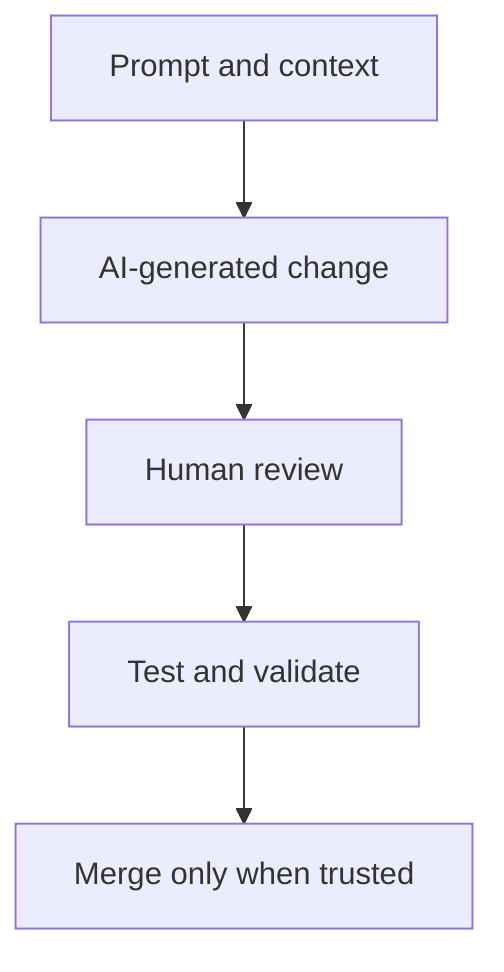

---
ai_generated: true
model: "openai/gpt-5.4@unknown"
operator: "johnmillerATcodemag-com"
chat_id: "safety-measures-best-practices-20260322"
prompt: |
  create a marp deck explaining the following content:

  ### 3. Safety Measures & Best Practices [x]

  **Duration**: 00:35:29 - 00:58:01 (22:32)

  **Content**:

  - Safety nets for AI-assisted development
  - Testing strategies and code coverage vs. signal quality
  - Code review processes treating AI as "eager knowledgeable junior developer"
  - Change review workflows
  - Keeping change sets small
  - Azure DevOps MCP tool mention for PR review automation

  **Key Topics**:

  - **Feature Flag Removal**: Using AI to safely remove obsolete feature flags
  - **Testing Signal Quality**: Emphasizing meaningful tests over coverage metrics alone
  - **Change Review Process**:
    - Treat AI output as junior developer work
    - Review everything generated
    - Keep changes small and focused
  - **Azure DevOps Integration**: MCP tool for automating PR reviews
  - **Small Change Sets**: Benefits of incremental, reviewable changes

  **Best Practices Highlighted**:

  - Never commit AI-generated code without review
  - Test coverage is necessary but not sufficient
  - Focus on test quality and signal over percentage metrics
  - Use automated tools to assist human reviewers
started: "2026-03-22T02:10:08Z"
ended: "2026-03-22T02:28:08Z"
task_durations:
  - task: "slide outline"
    duration: "00:04:00"
  - task: "slide authoring"
    duration: "00:11:00"
  - task: "provenance and catalog updates"
    duration: "00:03:00"
total_duration: "00:18:00"
ai_log: "ai-logs/2026/03/22/safety-measures-best-practices-20260322/conversation.md"
source: "johnmillerATcodemag-com"
marp: true
theme: default
paginate: true
---

# Safety Measures and Best Practices || Code Review: The Last Line of Defense Against AI Overconfidence

---

## Safety Measures & Best Practices

- Safety nets make AI acceleration safer
- Test quality matters more than raw coverage
- AI output must be reviewed like junior developer work
- Small, focused diffs are easier to trust
- Automation helps reviewers scale

::: notes
Duration ~00:01

Open this module by framing safety as the price of speed in AI-assisted development. The point is not to slow teams down, but to make sure faster code generation does not also mean faster mistakes reaching production. Transition by introducing the mindset shift: AI is helpful, but it is never self-approving.
:::

---

## Treat AI Like an Eager Knowledgeable Junior Developer

- AI can produce useful first drafts quickly
- It can also misunderstand requirements or context
- Humans remain accountable for correctness and intent
- Review every generated change before commit or merge
- Use AI for acceleration, not delegated judgment

::: notes
Duration ~00:03

Use the "eager knowledgeable junior developer" analogy because it is memorable and accurate. AI often produces plausible work at high speed, but plausibility is not the same thing as correctness, so every change still needs human review for domain fit, architectural consistency, and unintended side effects. Transition by explaining that tests are one of the main ways we convert suspicion into confidence.
:::

---

## Coverage Is a Floor, Not the Goal

- Coverage tells you **how much** code was executed
- Signal quality tells you **whether failures would matter**
- Prefer tests that detect regressions in behavior
- Include edge cases, negative paths, and business rules
- Do not confuse green dashboards with real confidence

**High-signal tests usually check**
  - outcomes users care about
  - meaningful failure conditions
  - integration boundaries and contracts

::: notes
Duration ~00:04

Make it clear that code coverage is useful, but incomplete. A suite can report high coverage while still missing the exact regression that users will experience, especially if tests only exercise happy paths or assert implementation details instead of behavior. Transition by showing that one concrete place where high-signal validation matters is feature-flag retirement.
:::

---

## Keep Change Sets Small and Reviewable

- Smaller diffs are easier to understand
- Reviewers spot risk faster in focused changes
- Rollback is simpler when scope is narrow
- Incremental delivery reduces blast radius
- Large AI-generated diffs hide subtle mistakes

**Good small-change patterns**
  1. separate refactor from behavior change
  2. ship one concern per pull request
  3. keep cleanup close to the related feature

::: notes
Duration ~00:03

Position small change sets as a safety mechanism, not just a style preference. When AI can generate large amounts of code quickly, the danger is not only bad code but unreviewable code, because reviewers cannot build enough understanding to catch mistakes hidden inside a massive diff. Transition by showing how automation can support review without replacing human judgment.
:::

---

## Human Review + Automated Review Workflow

- Use automation to surface risky files, missing tests, and policy gaps
- Use humans to judge correctness, intent, and business impact
- Azure DevOps MCP tools can help automate PR review workflows
- Automated comments are triage aids, not merge authority
- The best workflow combines speed, consistency, and accountability

**Suggested review split**
  - **Automation**: lint, tests, policy checks, review hints
  - **Human reviewers**: architecture, behavior, domain correctness

::: notes
Duration ~00:04

Explain that automation is most valuable when it reduces reviewer fatigue and helps humans spend attention where judgment matters most. Mention Azure DevOps MCP here as an example of tooling that can support pull-request workflows by pulling context, surfacing work-item links, and assisting review automation around the PR, while still leaving final approval to accountable humans. Transition to a closing checklist that teams can apply immediately.
:::

---

## Practical Safety Checklist for AI-Assisted Changes

- Review every AI-generated diff before commit
- Require tests, but evaluate their **signal**, not just count
- Keep pull requests focused and incremental
- Use automation to pre-screen issues for reviewers
- Clean up obsolete flags and dead paths intentionally
- Merge only when humans understand the change

**Bottom line:** fast AI-assisted delivery still needs disciplined engineering.

::: notes
Duration ~00:03

Close with an operational checklist the audience can adopt the same day. Reiterate that the most important habits are review discipline, meaningful tests, small diffs, and intentional use of automation to make humans more effective rather than less necessary. End by connecting this section back to the larger course theme: safe acceleration beats reckless acceleration every time.
:::
