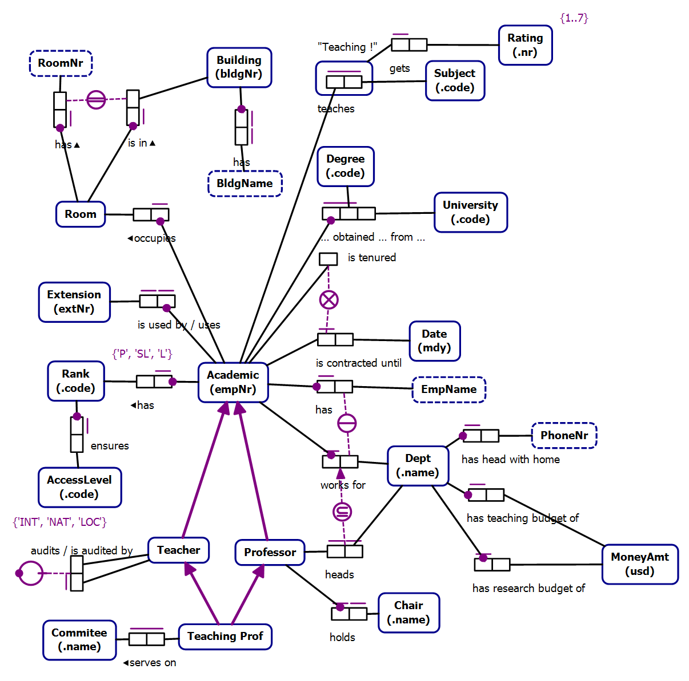

# Starting with Requirements || Build the Right Thing Before Building the Thing Right

## Starting with Project Requirements

::: notes
Shift to greenfield best practices: requirements, prompts, and verification workflows.
:::

---

## Business Rules as Requirements

---

## Conceptual Models

Technology Agnostic
  - Transformable into Logical Models
Clarity
Expressive
Formal
Conceptual Models are not a requirement

---

## Object Role Models

A type of conceptual model
Supported by a Visual Studio Extension (NORMA)
Object Role Models are textual and visual
  - Text can be visualized
  - Diagrams can be verbalized
Textual representation is in a formal natural language that can be validated by subject matter experts

---

## Zeus.Academia.3b

Based on a publicly available model of a commonly understood domain
  - https://orm.net/pdf/ORMwhitePaper.pdf
Allows us to quickly move from requirements to implementation
  - https://github.com/johnmillerATcodemag-com/zeus.academia.3b
Why 3b?
  - Third Iteration in progress
  - If something is hard, do it often

---

## Use Cases

Use cases are specific scenarios that guide data capture and processing in the application
  - Promote a Lecturer to Senior Lecturer
  - Promote a Senior Lecturer to Associate Professor
  - Promote an Associate Professor to Professor
  - Assign a Class to an Academic
  - Add a new Academic to the faculty capturing all required information and allowing the capture of optional information
