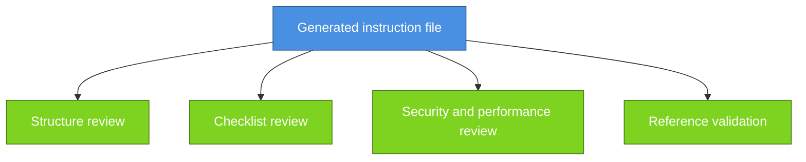

---
ai_generated: true
model: "openai/gpt-5.4@unknown"
operator: "johnmillerATcodemag-com"
chat_id: "technology-stack-instruction-files-20260321"
prompt: |
  create a marp deck explaining the following content:

  ## Section 5: Technology Stack Instruction Files (Duration: 00:17:00) [x]

  ### Key Topics

  - Creating instruction files for specific technologies
  - HTML5, CSS3, and vanilla JavaScript standards
  - Command-line prompt for instruction file generation
  - Model differences (Claude Sonnet vs. GPT-4)
  - Validation checklists
  - Multi-model evaluation strategy

  ### Subsections

  #### 5.1: Creating Technology Instructions (Duration: 00:08:00)

  - Review requirements document for technology stack
  - Simple prompt: "Create instruction files for the following technologies"
  - HTML5, CSS, vanilla JavaScript (or TypeScript alternative)
  - Comprehensive coverage: semantic markup, accessibility, modern CSS, security, performance

  #### 5.2: Instruction File Review (Duration: 00:05:00)

  - Generated file structure and content review
  - Validation checklist inclusion
  - Target audience: AI assistants (primary), developers (secondary)
  - Comprehensive guidelines for semantic HTML5, CSS3, vanilla JavaScript
  - Security and performance considerations
  - Related documentation references

  #### 5.3: Multi-Model Evaluation (Duration: 00:04:00)

  - Using different models to review instruction files (e.g., Gemini reviewing Claude output)
  - Comparing outputs to identify improvements
  - Building instruction files from multiple sources
  - Model-specific characteristics (Claude Sonnet: comprehensive, GPT-4: variable)
  - Importance during foundation phase
started: "2026-03-21T15:34:00Z"
ended: "2026-03-21T15:49:00Z"
task_durations:
  - task: "slide outline"
    duration: "00:04:00"
  - task: "slide authoring"
    duration: "00:09:00"
  - task: "provenance and catalog updates"
    duration: "00:02:00"
total_duration: "00:15:00"
ai_log: "ai-logs/2026/03/21/technology-stack-instruction-files-20260321/conversation.md"
source: "johnmillerATcodemag-com"
marp: true
theme: default
paginate: true
---

# Technology Stack Instruction Files || Teaching Your AI the House Rules for Every Room

---

## Technology Stack Instruction Files

- Turning requirements into tech-specific guidance
- Show how teams generate, review, and improve instruction files

::: notes
Duration ~00:17

Frame this section as part of the greenfield foundation work rather than a documentation side quest. Explain that instruction files help the AI and the team align on standards before implementation begins, which reduces drift and rework later. Transition by asking what should exist before anyone prompts for technology-specific instructions.
:::

---

## Start with the Requirements

- Review the requirements document before generating any instruction file
- Identify the front-end and implementation technologies explicitly in scope
- Decide on the tech stack
- Use the requirements to anchor standards, constraints, accessibility, and security expectations

::: notes
Duration ~00:02

Explain that instruction files are most valuable when they reflect the actual technology choices and constraints of the project. If the requirements are vague, the generated guidance will also be vague, so the stack definition has to come first. Transition by showing the simple prompting pattern used to produce the first draft.
:::

---

## Generate the First Draft Quickly

- Use a direct prompt such as: **Create instruction files for the following technologies**
- Name the stack clearly
- Ask for guidance on:
  - semantic markup
  - accessibility
  - modern CSS practices
  - security
  - performance
- Treat the first output as a draft, not as final policy

::: notes
Duration ~00:02

Make the point that the initial prompt does not need to be elaborate to be useful. What matters is that it clearly names the technologies and asks for standards that map to real development concerns like semantics, accessibility, and runtime performance. Transition by moving from prompt generation to what a good instruction file should contain.
:::

---

## Review the Generated File Critically

- Check the file structure, scope, and clarity
- Ensure a validation checklist is included
- Confirm the primary audience is **AI assistants** and the secondary audience is **developers**
- Verify security and performance guidance is concrete
- Confirm related documentation references are present and accurate

::: notes
Duration ~00:02

Explain that review is what turns an acceptable draft into a dependable working standard. Teams should inspect whether the file is actionable for the AI, readable for humans, and explicit enough to guide consistent output across sessions. Transition by introducing the role of multiple models in improving quality.
:::

---

## Use Multiple Models to Improve Quality

- Ask a second model to review the first model's output
- Compare tone, completeness, and specificity
- Pull strengths from more than one model into the final file
- Use differences to reveal gaps, ambiguity, or weak examples

| Model tendency                    | Practical takeaway                          |
| --------------------------------- | ------------------------------------------- |
| Claude Sonnet: more comprehensive | Good for broad first drafts                 |
| GPT-4: more variable              | Good candidate for challenge and comparison |

::: notes
Duration ~00:02

Position multi-model review as a quality-control tactic rather than a competition. Different models expose different blind spots, so having one model critique another often surfaces missing examples, incomplete checklists, or weakly stated rules. Transition by tying this evaluation loop back to the broader foundation phase of a new project.
:::

---

## Why This Matters in the Foundation Phase

1. Establish technology standards early
2. Reduce inconsistency before implementation begins
3. Give AI assistants reusable, repo-specific guidance
4. Create artifacts the team can iterate on and version-control
5. Build a stronger base for later slice planning and implementation prompts

**Bottom line**: better instruction files lead to more reliable implementation output.

::: notes
Duration ~00:02

Close by connecting technology instruction files to the larger greenfield workflow. These files are foundational because they shape the quality of later prompts, implementation plans, and generated code, especially when multiple people and multiple models are involved. End by suggesting that every new stack choice should trigger the question, what instruction file do we need before we start building?
:::
