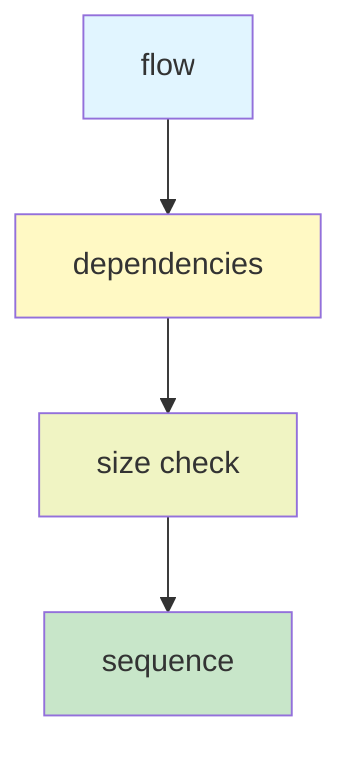
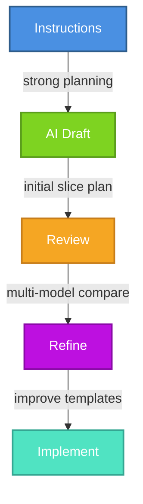

---
ai_generated: true
model: "openai/gpt-5.4@2026-03-21"
operator: "johnmillerATcodemag-com"
chat_id: "vertical-slice-planning-marp-20260321"
prompt: |
  create a marp deck explaining the following content:

  ## Section 7: Creating Vertical Slice Implementation Plans (Duration: 00:16:00) [x]

  ### Key Topics

  - Vertical slice planning instruction file
  - Slice identification strategies
  - Decomposition principles
  - Using AI to create implementation plans
  - Slice definitions and specifications
  - Implementation roadmap creation

  ### Subsections

  #### 7.1: Slice Planning Instruction File Review (Duration: 00:05:00)

  - Located in `.github/instructions/vertical-slice-planning.instructions.md`
  - **Slice Identification Strategies**:
    - User action decomposition (request-to-response flows)
    - Entity CRUD operations
    - Workflow stage decomposition
    - Business event decomposition
    - CQRS-optimized (separate reads from writes)
  - **Decomposition Principles**:
    - Single responsibility
    - Complete vertical stack
    - No horizontal sharing
    - Minimize external dependencies
  - **Slicing Guidelines**: Not too big, not too small
  - **Decision Tree**: Strategy selection guidance
  - **Analysis**: Data dependencies, service dependencies

  #### 7.2: Generating Implementation Plans (Duration: 00:07:00)

  - Prompt: "Using vertical slice planning instructions and web calculator requirements, create implementation plan using vertical slices"
  - AI generates comprehensive plan with:
    - Summary of requirements
    - Slice identification and decomposition
    - Dependency diagram
    - Proposed implementation sequence
    - Sprint organization
  - Model differences in output detail and approach

  #### 7.3: Multi-Model Evaluation Exercise (Duration: 00:04:00)

  - Using Gemini 2.5 Pro to evaluate Claude Sonnet's vertical slice planning file
  - Identified six improvement areas:
    - Missing task duration metadata
    - Incomplete decomposition examples
    - Need more complete dependency strategy examples
    - Finish implementation sequencing examples
    - Complete roadmap template
    - Finalize slice specification template
  - Demonstrates value of multi-model review strategy
started: "2026-03-21T17:27:41Z"
ended: "2026-03-21T17:36:41Z"
task_durations:
  - task: "requirements review"
    duration: "00:03:00"
  - task: "slide drafting"
    duration: "00:05:00"
  - task: "provenance updates"
    duration: "00:01:00"
total_duration: "00:09:00"
ai_log: "ai-logs/2026/03/21/vertical-slice-planning-marp-20260321/conversation.md"
source: "johnmillerATcodemag-com"
marp: true
theme: default
paginate: true
size: 16:9
title: "Creating Vertical Slice Implementation Plans"
description: "Section 7 deck on slice planning guidance, AI-generated plans, and multi-model review."
---

# Vertical Slice Implementation Plans || The Blueprint Before the Blueprint

---

## Creating Vertical Slice Implementation Plans

- Focus: how to plan before implementation
- Goal: turn requirements into executable slices

::: notes
Open by framing this section as the bridge between architecture guidance and actual delivery planning.

Explain that vertical slices are not just a coding pattern; they are also a planning tool. The point of the section is to help the audience see how to move from requirements to a buildable roadmap.

Spend a few seconds previewing the three parts of the talk: reviewing the planning instruction file, generating implementation plans with AI, and improving those plans through multi-model evaluation.
:::

---

## What this section covers

- Vertical slice planning instruction file
- Slice identification strategies
- Decomposition principles
- AI-assisted implementation planning
- Slice specifications and roadmaps

::: notes
Use this slide as a table of contents for the section. Keep the pace brisk and make it clear that each bullet corresponds to a practical planning step teams can repeat.

Emphasize that the section is intentionally operational. It is about making slices small enough to implement, complete enough to deliver value, and structured enough that AI can help generate plans instead of vague suggestions.

Transition by saying the first step is understanding the instruction file that defines the planning rules.
:::

---

## Review the planning instructions

Reference point:

`.github/instructions/vertical-slice-planning.instructions.md`

What it provides:

- Strategy selection guidance
- Decomposition rules
- Dependency analysis prompts
- Slice definition templates

::: notes
Introduce the instruction file as the planning playbook. It tells both humans and AI how to reason about a feature before code is written.

Call out that a strong instruction file improves consistency. Instead of every plan starting from scratch, the team gets a repeatable way to identify slices, document dependencies, and define an implementation sequence.

Mention that the file is valuable even when AI is not involved because it clarifies how the team wants work decomposed.
:::

---

## Slice identification strategies

| Strategy | Best fit |
| --- | --- |
| User action decomposition | End-to-end user flows |
| Entity CRUD operations | Simple data management |
| Workflow stage decomposition | Multi-step processes |
| Business event decomposition | Event-driven behavior |
| CQRS-optimized slicing | Distinct read/write paths |

::: notes
Walk the audience through the five strategies and explain that no single strategy is always correct. The right one depends on the kind of behavior being modeled.

For user action decomposition, use an example like "submit order" or "reset password." For CRUD, use admin maintenance screens. For workflow stages, mention onboarding or approvals. For business events, use order placed or payment failed. For CQRS, explain separating queries from commands when reads and writes differ significantly.

Stress that the planning file helps choose a strategy rather than forcing one pattern onto every feature.
:::

---

## Decomposition principles

- **Single responsibility** per slice
- **Complete vertical stack** from UI/API to data
- **No horizontal sharing** as the unit of delivery
- **Minimize external dependencies**
- Size slices to be **valuable and manageable**

### Rule of thumb

Avoid slices that are too big to finish or too small to matter.

::: notes
This slide defines the quality bar for a slice. Explain that a slice should deliver one meaningful capability and contain everything needed to implement that capability end to end.

Clarify "no horizontal sharing" by contrasting a real slice with a layer-based task such as "build all repositories first." Horizontal work may still exist, but it should not become the primary planning unit.

Use the phrase "valuable and manageable" more than once. That is the balance teams often miss when they either create giant epics or tiny technical chores that produce no user value.
:::

---

## Analyze before you slice

Ask these questions first:

- What data does this slice read or change?
- What services or APIs does it depend on?
- Can it be deployed independently?
- Does a different strategy fit better?

Decision aid:

::: notes
Explain that slicing is not just naming features. It requires examining data dependencies and service dependencies before locking in the plan.

Walk through the decision aid from left to right. Start with the flow, then look at dependency boundaries, then check whether the proposed slice is too large or too fragmented, and finally place it into an execution sequence.

This is a good moment to remind the audience that planning errors often come from ignoring dependencies until implementation begins.
:::

---

## Generate plans with AI

Example prompt:

> Using vertical slice planning instructions and web calculator requirements, create implementation plan using vertical slices.

AI can generate:
  - Requirements summary
  - Slice decomposition
  - Dependency diagram
  - Implementation order
  - Sprint organization

::: notes
Explain that the prompt works because it combines two inputs: the planning instructions and the actual feature requirements. Without both, the output is usually too generic.

Point out that this is where AI becomes a planning accelerator. Instead of starting from a blank page, the team gets a draft plan containing slices, dependencies, sequencing, and potential sprint structure.

Also note that the prompt is intentionally simple. The quality comes from the instruction file and source requirements, not from a complicated prompt.
:::

---

## What a good AI plan should include

1. Clear summary of requirements
2. Identified slices with rationale
3. Dependency relationships
4. Proposed implementation sequence
5. Sprint or milestone grouping

Watch for model differences
  - More detail vs. more concise output
  - Different naming and grouping choices
  - Different sequencing assumptions

::: notes
Use this slide to define evaluation criteria for AI-generated plans. The audience should leave knowing what "good" looks like, not just that AI can produce something.

Explain that different models may emphasize different aspects. One might provide stronger rationale, another might produce cleaner sequencing, and another might be better at summarizing requirements.

Encourage the audience to compare outputs rather than assuming the first plan is correct. This leads naturally into the multi-model review exercise.
:::

---

## Example planning flow

Web calculator example
  1. Summarize calculator requirements
  2. Identify slices such as input, operations, history, validation
  3. Map data and service dependencies
  4. Sequence foundational slices before enhancements
  5. Group slices into sprints

::: notes
Translate the abstract process into a concrete example. Use the calculator scenario because it is simple enough to understand quickly while still showing real decomposition choices.

Mention that one model may group input and validation together, while another may separate them. One may treat history as a later slice because it depends on completed calculations. These are exactly the kinds of planning differences worth discussing.

Reinforce that the output is not just a list of tasks. It is a roadmap with ordering logic.
:::

---

## Multi-model evaluation

Review planning file for gaps:
  1. Missing task duration metadata
  2. Incomplete decomposition examples
  3. Incomplete dependency strategy examples
  4. Unfinished implementation sequencing examples
  5. Incomplete roadmap template
  6. Incomplete slice specification template

::: notes
Present this as a quality-improvement exercise, not a competition between models. The value comes from using one model to review the blind spots of another.

Walk through the six findings quickly and frame them as practical improvements. These are not cosmetic issues; they affect whether teams can actually use the planning artifact consistently.

Highlight that evaluation uncovered missing completeness in examples and templates, which matters because templates are what guide future AI generations.
:::

---

## Key takeaway

Recommended workflow

- Start with a strong planning instruction file
- Generate an initial vertical slice plan
- Compare outputs across models when useful
- Improve templates and examples over time

::: notes
Close with the repeatable workflow. This gives the audience a practical method they can adopt immediately.

Emphasize that the instruction file is the stable asset, AI provides the first draft, and multi-model review improves quality. Over time, the planning assets themselves get better, which improves every future plan.

End by connecting this section to execution: once the slices and roadmap are solid, implementation becomes faster, safer, and easier to parallelize.
:::
