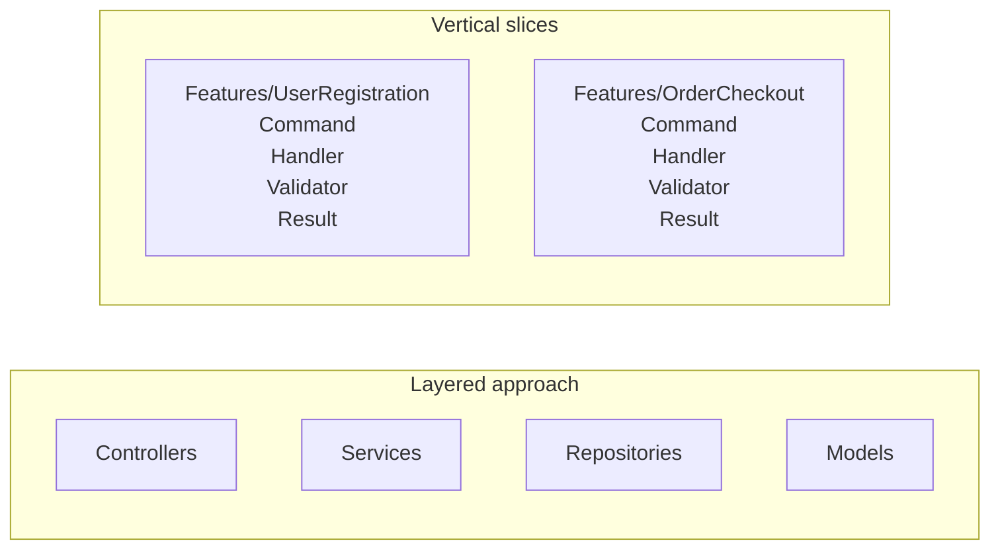
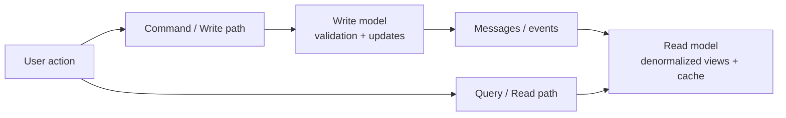

---
ai_generated: true
model: "openai/gpt-5.4@2026-03-21"
operator: "johnmillerATcodemag-com"
chat_id: "vertical-slicing-architecture-introduction-20260321"
prompt: |
  create a marp deck explaining the following content:

  ## Section 6: Vertical Slicing Architecture Introduction (Duration: 00:19:00) [x]

  ### Key Topics

  - Vertical slicing architectural pattern
  - Feature-based organization vs. layered approach
  - Self-contained, independent features
  - Maintainability benefits
  - CQRS (Command Query Responsibility Segregation) relationship
  - Developer experience improvements

  ### Subsections

  #### 6.1: Vertical Slicing Concepts (Duration: 00:08:00)

  - **Definition**: Architectural pattern organizing code by features rather than layers
  - **Characteristics**:
    - Spans all technical layers vertically
    - Everything needed for a feature in one place
    - Self-contained and independent
    - Features don't directly reference each other
    - Localized changes improve maintainability

  #### 6.2: File Structure Comparison (Duration: 00:03:00)

  - **Layered Approach**: Controllers, Services, Repositories, Models (separate folders)
  - **Vertical Slices**: Features folder with sub-folders per feature
    - Example: Features/UserRegistration/ contains all user registration code
    - All code for a feature in single location
    - Easy to enhance or modify specific features

  #### 6.3: Benefits (Duration: 00:05:00)

  - **Developer Experience**:
    - Faster feature development
    - All related code in single location
    - No folder jumping
    - New features don't affect existing ones
  - **Maintainability**:
    - Localized changes
    - Clear boundaries reduce bugs
    - Feature-contained refactoring
  - **Team Collaboration**:
    - Parallel feature development
    - Fewer merge conflicts
    - Clear ownership and responsibility
  - **Testing**:
    - Test complete features, not layers
    - Mock at feature boundaries
    - Independent work with mocked dependencies
    - Straightforward integration

  #### 6.4: CQRS Relationship (Duration: 00:03:00)

  - Command Query Responsibility Segregation overview
  - Separate display (read) from data collection (write)
  - Two different stacks joined by messaging
  - Optimize read side for performance (denormalization, caching)
  - Optimize write side for data updates
  - Natural fit with vertical slices: implement read/write portions simultaneously per feature
started: "2026-03-21T17:19:32Z"
ended: "2026-03-21T17:33:30Z"
task_durations:
  - task: "content planning"
    duration: "00:04:00"
  - task: "slide authoring"
    duration: "00:07:00"
  - task: "speaker notes and repo updates"
    duration: "00:03:00"
total_duration: "00:14:00"
ai_log: "ai-logs/2026/03/21/vertical-slicing-architecture-introduction-20260321/conversation.md"
source: "johnmillerATcodemag-com"
marp: true
theme: default
paginate: true
---

# Vertical Slicing Architecture Introduction || Features Go Vertical. Layers Go Home.

::: notes
Duration ~00:01

Welcome to the vertical slicing architecture introduction. This section explains why organizing code by feature can make complex systems easier to understand, extend, and maintain.

Open by asking how many people have had to change a feature by touching controllers, services, repositories, and models in four different folders.

Emphasize that vertical slicing is not just a folder rename. It changes how teams think about boundaries, ownership, and end-to-end feature delivery.

Transition with: "Let's define the pattern first, then compare it to the layered structure most teams already know."
:::

---

## What is a vertical slice?

**A vertical slice organizes code by business feature, not by technical layer.**

- Each feature spans UI, validation, logic, and data access
- Everything needed for the feature lives together
- Slices are self-contained and intentionally independent
- Features avoid direct references to other features
- Changes stay localized, which improves maintainability

> Think in complete user capabilities, not shared technical buckets.

::: notes
This is the core idea for the section, so spend roughly three minutes here. Explain that a slice is a full path through the system for one business capability, such as user registration or order checkout.

Point out that the goal is strong feature boundaries. A developer should be able to open one folder and understand most of what matters for that feature without navigating the whole solution.

Call out the independence rule explicitly: features should not directly reference each other. Shared abstractions can exist, but the feature itself should remain loosely coupled.

Transition with: "That definition becomes clearer when we compare the file structure side by side."
:::

---

## Layered folders vs. feature folders

**Layered:** related code is separated by technical type.

**Vertical slices:** all code for a feature is kept in one place.

::: notes
Duration ~00:03

Use about three minutes here and walk the audience through the diagram from left to right. In the layered view, explain that user registration logic is split across multiple folders, which creates navigation overhead and makes changes feel scattered.

Then move to the vertical slice view and show how each feature becomes a mini-application. The `Features/UserRegistration` folder contains the command, handler, validator, and any related response or data access pieces in one place.

This is a good moment to mention that enhancing one feature becomes easier because the impact area is much more visible. The file structure starts reflecting business capabilities instead of technical plumbing.

Transition with: "Once the structure changes, the day-to-day developer experience changes too."
:::

---

## Why developers like this approach

Developer experience
  - Faster feature development
  - All related code in one location
  - Less folder jumping during implementation
  - New features are less likely to disturb existing ones

Maintainability
  - Localized changes
  - Clear boundaries reduce accidental bugs
  - Refactoring happens inside the feature more often than across the whole app

::: notes
Duration ~00:03

 Describe the common experience of implementing a new feature in a layered system, where developers bounce between folders just to follow one request from start to finish.

Contrast that with a vertical slice where the work stays mostly inside one feature folder. That reduces cognitive load and makes it easier for a developer to reason about the full behavior before they edit anything.

For maintainability, stress that the architecture makes the blast radius of a change smaller. When the boundary is clear, debugging and refactoring become safer and faster.

Transition with: "Those same boundaries also help teams collaborate and test more effectively."
:::

---

## Collaboration and testing benefits

Team collaboration
  - Teams can build features in parallel
  - Clear boundaries mean fewer merge conflicts
  - Ownership and responsibility are easier to assign

Testing approach
  - Test complete features, not isolated layers
  - Mock at feature boundaries
  - Integration becomes more straightforward
  - Independent development is easier with mocked dependencies

::: notes
Use about two to three minutes on this slide. Explain that feature folders create natural seams for parallel work, so two developers can often build different slices without changing the same files.

In testing, highlight that the unit of reasoning becomes the feature, not a service class in isolation. That leads to tests that better reflect user behavior and system outcomes.

You can also mention that mocking is still useful, but it tends to happen at boundaries instead of inside every technical layer. That usually produces simpler tests with clearer intent.

Transition with: "Vertical slices also pair naturally with another pattern many teams use: CQRS."
:::

---

## Why CQRS fits well with vertical slices

- CQRS separates reads from writes
- Read side can be optimized for display and performance
- Write side can be optimized for business rules and updates
- Messaging keeps the two stacks coordinated
- A feature slice can implement both read and write concerns together

::: notes
Duration ~00:03

 Explain that Command Query Responsibility Segregation separates the write path from the read path because those two concerns often want different models and optimizations.

On the read side, teams may denormalize data, cache aggressively, or build projections for fast display. On the write side, the focus is enforcing rules, validating intent, and updating authoritative data correctly.

Now connect it back to vertical slices: each feature can own both its command side and its query side. That makes CQRS feel less abstract because the pattern is implemented within a feature boundary rather than as a separate architectural island.

Transition with: "Let's close with the main ideas you want people to remember after this section."
:::

---

## Key takeaways

- Organize by feature when you want stronger business boundaries
- Keep everything needed for a feature in one place
- Prefer independent slices over tightly coupled features
- Use localized changes to improve maintainability
- Consider CQRS when read and write paths have different needs

**Bottom line:** vertical slicing improves focus, flow, and long-term maintainability.

::: notes
Duration ~00:01

Use about one minute to close. Recap that vertical slicing is primarily about improving feature ownership and reducing the cost of change.

Reinforce that the architecture helps both individuals and teams: developers move faster, changes are easier to contain, and the codebase better reflects how the business thinks about work.

If you want an audience prompt, ask which current feature in their codebase would be easiest to convert into a first slice. That question helps bridge the presentation into practical adoption.

End by signaling that the next step is usually implementation guidance, where teams define commands, handlers, validators, and feature-level tests.
:::
