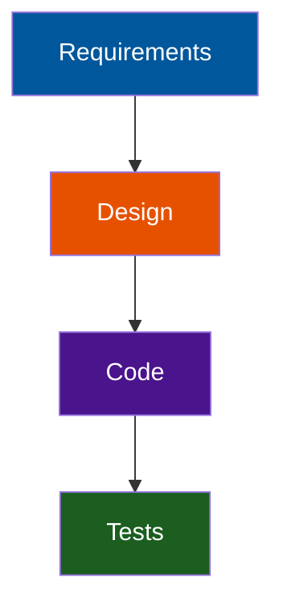

<!-- layout: Title Slide -->


A CODE Presents Webinar

::: notes
Welcome everyone and set the tone: AI-assisted development is here, but regulated environments need clarity.
Emphasize that this session is practical, not theoretical.
Mention that we'll cover risks, standards, and concrete mitigations.
:::

---

## Agenda

1. Why this topic matters now
2. Compliance challenges introduced by AI-generated code
3. Impacted standards and regulations
4. Mitigation strategies and best practices
5. Q&A

::: notes
Walk through the agenda quickly.
Highlight that the session builds from risk → standards → mitigations.
Encourage attendees to jot down questions for the Q&A. 
:::

---

## John Michael Miller

**Principal Software Engineer at CODE**
Played roles of developer, architect, devops engineer, platform engineer, test architect, release manager
AI Practitioner and advocate for effectively using AI to write code

- LinkedIn: [www.linkedin.com/in/johnmichaelmiller](www.linkedin.com/in/johnmichaelmiller)
- Email: [john.miller@codemag.com](john.miller@codemag.com)
- Blog: [codemag.com/blog/AIPractitioner](codemag.com/blog/AIPractitioner)

::: notes
John Michael Miller is a Principal Software Engineer at CODE with over 15 years of experience in software development. He has held various roles including developer, architect, DevOps engineer, platform engineer, test architect, and release manager. John is an AI/ML enthusiast and advocates for effectively using AI to write code. You can connect with him on LinkedIn, reach out via email, or read his blog posts on AI-assisted software development.
- [AI Practitioner Resources](codemag.com/aipractitioner)
:::

---

<!-- _class: hide -->

## Placeholder for Instructor Bio

**{{Title}} at CODE**
{{Short Bio}}

- LinkedIn: [www.linkedin.com/in/{{linkedin id}}](www.linkedin.com/in/{{linkedin id}})
- Email: [{{email}}](mailto:{{email}})
- Blog: [{{blog url}}]({{blog url}})

::: notes
{{Full Bio}}
- [{{Additional Resource}}]({{additional resource url}})
:::

---

<!-- _class: lead -->

## Course Modules

- AI-Assisted Compliance Webinar
- **▶ Compliance Challenges**
- Compliance Assessments
- AI Guardrails
- Conclusions

---

<!-- layout: Centered Title -->


Compliance Risks & Mitigations

---

## Why This Matters

- AI-assisted development is accelerating adoption across industries
- Regulated environments face new audit vulnerabilities
- Traditional SDLC controls were not designed for AI-generated artifacts
- Organizations need clarity, governance, and repeatable processes

::: notes
Frame the urgency: AI is already in use, often informally.
Stress that regulators aren't banning AI—they expect organizations to control it.
Position this as a modernization of compliance, not a barrier to innovation.
:::

---

## Compliance Challenges

**Key Risk Areas**
  - Traceability gaps
  - Validation & verification uncertainty
  - Documentation & reproducibility issues
  - Explainability challenges
  - Change control complications
  - IP & licensing exposure

::: notes
Introduce the six major categories of risk.
Mention that these risks appear across industries, not just medical or finance.
Set up the next slides where each risk is unpacked.
:::

---

## Traceability Gaps



- No deterministic mapping from prompt to output
- Difficulty reconstructing how code was produced
- Weak auditability without additional controls

::: notes
Explain that traceability is the #1 issue auditors flag.
AI outputs are not inherently traceable unless teams enforce it.
Give a quick example: "Show me the requirement that led to this function."
:::

---

## Validation & Verification Risks

- Hallucinated or incorrect logic
- Inconsistent coding patterns
- Security vulnerabilities introduced by generated code
- Increased burden on testing and review

::: notes
Emphasize that AI-generated code can look correct but behave incorrectly.
Mention that validation must increase, not decrease, when AI is involved.
Highlight the need for automated testing.
:::

---

## Documentation & Reproducibility

- AI tools do not produce design rationale
- Prompts and model versions often untracked
- Outputs may not be reproducible
- Creates documentation debt for regulated teams

::: notes
Stress that documentation is a regulatory requirement, not a nice-to-have.
Explain that reproducibility is essential for audits and investigations.
Mention prompt logging as a mitigation we'll cover later.
:::

---

## Explainability & Review Challenges

- Non-idiomatic or opaque code
- Harder to justify decisions during audits
- Increased reviewer workload
- Potential misalignment with internal patterns

::: notes
Explain that reviewers often struggle with AI-generated code because it lacks human reasoning.
Auditors may ask "Why was this implemented this way?" and teams need an answer.
:::

---

## Change Control Issues

- Large, rapid code changes
- Unclear impact analysis
- Risk of bypassing formal workflows
- Need for explicit tagging of AI-generated changes

::: notes
Emphasize that AI can generate hundreds of lines instantly, which breaks traditional change control expectations.
Stress the importance of tagging AI-generated commits.
:::

---

## IP & Licensing Risks

- Potential inclusion of copyrighted or copyleft code
- Unclear provenance
- Legal exposure if not scanned and reviewed
- Requires automated license compliance checks

::: notes
Explain that AI models may generate code resembling licensed material.
Stress that legal teams are increasingly concerned about provenance.
:::

---

## Impacted Standards & Regulations

Cross-Industry Impact
  - **ISO/IEC 62304** (software lifecycle)
  - **ISO 14971** (risk management)
  - **SOC 2** (security & change control)
  - **SOX** (financial reporting controls)
  - **PCI-DSS** (secure coding & data protection)
  - **GDPR** (privacy by design)

::: notes
Introduce the standards landscape.
Emphasize that AI-generated code affects multiple compliance domains simultaneously.
:::

---

## Medical Device Standards

**FDA Expectations**
  - Full traceability
  - Documented verification & validation
  - Controlled change management
  - Tool qualification

**ISO/IEC 62304**
  - Lifecycle documentation
  - Architecture & design controls
  - Verification rigor

**ISO 14971**
  - New hazard sources
  - Hard-to-predict failure modes

::: notes
Highlight that medical device software is one of the most impacted domains.
Explain that AI-generated code must still meet all lifecycle and risk requirements.
:::

---

## Enterprise & Financial Standards

**SOC 2**
  - Secure SDLC
  - Change management
  - Access control

**SOX**
  - Auditability of changes
  - Segregation of duties
  - Deterministic logic in financial systems

**PCI-DSS**
  - Secure coding
  - Vulnerability management
  - Logging & monitoring

::: notes
Emphasize that enterprise auditors are already asking about AI usage.
Explain that SOX and SOC 2 care deeply about change control and auditability.
:::

---

## Privacy Regulations

**GDPR**
  - Privacy by design
  - Data minimization
  - Auditability of data flows
  - Risk of unsafe defaults in generated code

::: notes
Explain that AI-generated code may inadvertently mishandle personal data.
Stress that privacy-by-design must be preserved even with AI assistance.
:::

---

## Mitigation Strategies

**Governance & Controls**
  - Tool qualification
  - Human-in-the-loop review
  - Prompt & model version logging
  - Automated testing
  - Risk-based change control
  - IP & license scanning
  - AI Guardrails

::: notes
Introduce the mitigation section as the "how to fix it" part.
Emphasize that these controls are practical and auditable.
:::

---

## Tool Qualification

- Define intended use
- Validate outputs for accuracy
- Restrict access
- Version-lock models when possible
- Maintain prompt logs

::: notes
Explain that AI tools must be treated like any other software tool in regulated environments.
Mention that qualification does not mean certifying the model—just validating its intended use.
:::

---

## Human-in-the-Loop Review

- Mandatory peer review
- Architectural oversight
- Security review for sensitive modules
- Style and pattern conformance checks

::: notes
Stress that human review is non-negotiable.
Explain that reviewers should be trained to identify AI-specific failure modes.
:::

---

## Documentation & Traceability

- Capture prompts and model versions
- Link generated code to requirements
- Document design rationale
- Annotate code reviews for auditability

::: notes
Emphasize that prompt logging is becoming a best practice.
Explain that traceability must be restored manually if AI breaks it.
:::

---

## Automated Testing & Analysis

- Unit, integration, and regression tests
- Static analysis (SAST)
- Dynamic analysis (DAST)
- Dependency and license scanning
- Continuous validation pipelines

::: notes
Explain that automated testing compensates for AI unpredictability.
Mention that static analysis tools often catch AI-generated anti-patterns.
:::

---

## Risk Management & Change Control

- Perform impact analysis for AI-generated changes
- Tag AI-generated code in commits
- Require approvals for high-risk modules
- Maintain audit logs of generation events

::: notes
Stress that AI-generated changes should be treated as high-risk by default.
Explain that tagging AI-generated code helps during audits and investigations.
:::

---

## IP & Licensing Safeguards

- Automated license scanning
- Code similarity detection
- Legal review for high-risk components
- Policies restricting AI use in sensitive areas

::: notes
Reinforce that IP risk is real and growing.
Encourage teams to integrate license scanning into CI/CD.
:::

---

## Best Practices

- Treat AI tools as validated development tools
- Require full human review
- Maintain prompt + output logs
- Strengthen automated testing
- Enforce strict change control
- Integrate risk management into every change
- Scan for IP and licensing issues

::: notes
Summarize the "do this" list.
Encourage teams to adopt these as part of their SDLC modernization.
:::

---

## Common Pitfalls

- Allowing AI tools to commit code directly
- Failing to document prompts or model versions
- Assuming generated code is correct
- Mixing AI and human code without tagging
- Neglecting licensing risks
- Using AI without tool qualification

::: notes
Present these as "avoid these traps."
Mention that most audit findings stem from these exact issues.
:::

---

<!-- _class: lead -->

## Course Modules

- AI-Assisted Compliance Webinar
- Compliance Challenges
- **▶ Compliance Assessments**
- AI Guardrails
- Conclusions

---

Assessment workflow, artifact demo, and AI guardrails

**Repository:** CODE-Presents-AIASD-Compliance
**Baseline Example:** Assessment 1 for D0003329 Rev 03 Final

::: notes
- Open by framing this as an operational walkthrough, not a theory deck.
- The goal is to show how the repository turns an IEC 62304 assessment into a repeatable, auditable process.
- Tell the audience that the demo section will use Assessment 1 artifacts because it is the current baseline and has the most complete outputs.
:::

---

## Why This Process Exists

- Create a repeatable baseline assessment against IEC 62304
- Produce decision-ready outputs for engineering and leadership
- Preserve audit evidence for how findings were generated
- Keep AI assistance inside explicit quality and provenance guardrails

**Assessment 1 outcome:** 66% overall compliance, 34 total gaps, 8 critical

::: notes
- Emphasize that the process is designed to answer three questions: what is compliant, what is missing, and what should be fixed first.
- Call out that the process is not only about analysis quality; it is also about reproducibility and inspection readiness.
- Mention that the baseline example found substantial compliance but still surfaced critical issues in risk management, legacy software, and problem resolution.
:::

---

## Inputs And Preconditions

| Input | Purpose |
| --- | --- |
| `sop/D0003329_Rev_03_Final.md` | Primary procedure under assessment |
| `standards/BSEN-62304.md` | Normative reference text |
| Related SOPs such as `sop/D0003098_Rev_05_Final.md` | Context for cross-references and controls |
| Standardized prompts in `.github/prompts/` | Consistent assessment method |
| AI provenance policy in `.github/instructions/` | Logging and metadata guardrails |

**Precondition:** start with a new assessment folder and decide the scope before running prompts.

::: notes
- Explain that the process intentionally front-loads context quality.
- The assessment quality drops quickly if the source SOP, the standard text, or the supporting SOPs are missing from context.
- Mention that the prompts are modular by clause, which makes the workflow parallelizable.
:::

---

## Process Overview

1. Create a new `assessments/assessment.{n}/` workspace
2. Run clause-specific assessments for 4.4, 5, 6, 7, 8, and 9
3. Synthesize findings into the comprehensive assessment
4. Generate executive, remediation, and projection outputs
5. Verify provenance, completion criteria, and README updates

**Execution model:** parallel clause analysis, then sequential synthesis

::: notes
- Walk the audience through the shape of the process: broad analysis first, consolidation second, governance checks last.
- Stress that the clause assessments are intentionally separate so that each clause can be reviewed independently before synthesis.
- This is the main reason the team can move quickly without losing traceability.
:::

---

## Phase 1 To 2: Clause Analysis Pipeline

| Phase | What Happens | Main Output |
| --- | --- | --- |
| Prep | Create folder, load source files, select prompts | Assessment workspace |
| Clause execution | Run prompts for 4.4, 5, 6, 7, 8, 9 | Six clause analysis files |
| Clause review | Check consistency, severity, citations | Normalized findings |

**Assessment 1 timing:** the parallel clause phase reduced total runtime by about 65% versus a sequential run.

::: notes
- Use this slide to explain why the process scales.
- In Assessment 1, clause analysis was the biggest leverage point for time savings.
- If asked why not do one large prompt, the answer is that smaller clause-scoped analyses are easier to verify and compare.
:::

---

## Phase 3 To 5: Synthesis And Decision Outputs

| Phase | Outcome | Audience |
| --- | --- | --- |
| Comprehensive synthesis | Unified compliance score, gap catalog, cross-cutting themes | Compliance leads, engineering |
| Executive summary | Leadership view, top gaps, roadmap, ROI | Senior stakeholders |
| Remediation planning | Gap-by-gap recommendations and implementation dependencies | Process owners |
| Projection analysis | Scenario-based improvement targets | Decision makers |
| Completion check | Deliverable checklist and quality verification | Auditors, maintainers |

::: notes
- Explain that the process deliberately produces different artifacts for different consumers.
- Engineering needs specificity, while leadership needs prioritization and resource framing.
- The completion document closes the loop by proving the required outputs and provenance are actually present.
:::

---

## Assessment 1 Artifact Set

- 6 clause-specific assessment files
- 1 comprehensive compliance assessment
- 1 executive summary
- 1 gap analysis and remediation recommendations document
- 1 projected compliance improvement analysis
- 1 completion summary

**Total content:** about 65,000 words across 11 deliverables

::: notes
- Position the artifact set as a documentation system, not a single report.
- Each artifact has a distinct job and should be treated as part of the compliance evidence package.
- Mention that the completion summary also documents the execution timeline and acceptance checks.
:::

---

## Demo Slide: Clause-Level Artifact

**Open:** `assessments/assessment.1/D0003329_REV_03_Final.Analysis.Clause7.md`

Demo points:

- Show clause-specific scoring and findings structure
- Point out the direct IEC 62304 references and severity language
- Highlight why Clause 7 was rated 55% and marked critical
- Show how a single clause artifact can stand alone for reviewer inspection

::: notes
- This is the first live artifact to open in the demo.
- Clause 7 is a strong example because it clearly shows both strengths and critical gaps.
- Call out that the artifact is independently useful during review because it contains citations, findings, and remediation direction in one place.
:::

---

## Demo Slide: Comprehensive Synthesis Artifact

**Open:** `assessments/assessment.1/D0003329_Rev_03_IEC62304_Compliance_Assessment_2026-04-01.md`

Demo points:

- Show the weighted compliance roll-up across clauses
- Review the gap severity distribution and critical gap list
- Explain the move from clause findings to a portfolio-level view
- Use it to answer: "What is the current compliance baseline?"

::: notes
- This is the artifact that converts clause analysis into a single operational picture.
- When presenting, focus on the overall score, the distribution of gap severity, and the cross-cutting implications.
- This is usually the anchor document for planning remediation work.
:::

---

## Demo Slide: Decision Artifacts

**Open in sequence:**

- `assessments/assessment.1/D0003329_REV_03_Final.IEC62304_Executive_Summary.md`
- `assessments/assessment.1/Gap_Analysis_and_Remediation_Recommendations.md`
- `assessments/assessment.1/Projected_Compliance_Improvement_Analysis.md`

What to show:

- Executive summary for leadership framing and top-10 gap view
- Remediation document for implementation detail and dependency mapping
- Projection analysis for scenario planning: 73%, 82%, 92%

::: notes
- This sequence shows how the same assessment supports different decision horizons.
- The executive summary is for prioritization, the remediation plan is for execution, and the projection analysis is for resource tradeoffs.
- If time is short, at least show the recommended Scenario B audit-ready path.
:::

---

## AI Guardrails: Before And During Assessment

- Use standardized prompts rather than ad hoc prompting
- Load the governing SOP and the standard text explicitly
- Keep clause scope bounded to reduce drift and improve reviewability
- Require structured filenames and assessment folders
- Capture exact prompt text, model, timestamps, and source references

**Guardrail intent:** make the process reproducible before content quality is judged.

::: notes
- Frame these as process controls rather than preferences.
- The key idea is that the repository constrains how AI is used so outputs are inspectable later.
- Explain that prompt standardization and explicit source loading are the two highest-value controls at the front of the workflow.
:::

---

## AI Guardrails: Artifact-Level Controls

| Guardrail | Evidence In Repo |
| --- | --- |
| YAML provenance front matter | `chat_id`, `ai_log`, model, operator, prompt |
| Conversation preservation | `ai-logs/YYYY/MM/DD/<chat-id>/conversation.md` |
| Session summary | `ai-logs/.../summary.md` |
| Completion verification | `assessments/.../ASSESSMENT_COMPLETION.md` |
| README registration | Root-level discoverability and traceability |

**Result:** no notable AI-generated artifact should be orphaned from its provenance trail.

::: notes
- This slide is about auditability.
- Show that the artifact, the conversation that produced it, and the repository index all point to each other.
- If someone asks how this helps IEC 62304, connect it to configuration management, review evidence, and procedural discipline.
:::

---

## Demo Slide: Guardrails In Action

**Open in sequence:**

- `.github/instructions/ai-assisted-output.instructions.md`
- `assessments/assessment.1/ASSESSMENT_COMPLETION.md`
- `ai-logs/2026/04/01/assessment-1-comprehensive-20260401/conversation.md`

What to show:

- Policy requirements for provenance and logging
- Completion checklist proving deliverables and metadata exist
- Conversation log as the underlying audit trail for an assessment artifact

::: notes
- This is the most important guardrail demo slide.
- The message is that the AI output is never just a markdown file; it is part of a controlled record.
- If the audience is skeptical about AI-assisted compliance work, this is the slide that addresses that concern directly.
:::

---

## What Success Looks Like

- The assessment is reproducible by another operator
- Every major finding traces back to a clause artifact or source document
- Leadership gets a concise decision package
- Remediation owners get a prioritized execution plan
- Auditors can inspect provenance without reconstructing the workflow manually

::: notes
- Close by tying the process back to operational outcomes.
- A good assessment process produces not just findings, but a maintained evidence chain and a practical remediation path.
- Invite the audience to treat the repository as both a delivery mechanism and a control system.
:::

---

<!-- _class: lead -->

## Course Modules

- AI-Assisted Compliance Webinar
- Compliance Challenges
- Compliance Assessments
- **▶ AI Guardrails**
- Conclusions

---

## Adding AI Guardrails

- What are instructions, prompts, and Agents
- Creating instruction, prompt, and Agent files
- Meta prompts that generate these files
- Instructions for generating artifacts
- Enforcing provenance for AI-assisted artifacts

::: notes
Introduce this module as the foundation for safe, predictable AI-assisted development.

Guardrails ensure that AI output is intentional, reviewable, and aligned with architectural and organizational standards.

These practices turn AI from a novelty into a disciplined engineering tool.
:::

---

## Instructions for Generating Artifacts

- Best practices
  - Define the artifact type
  - Specify required sections
  - Provide examples or templates
  - Include acceptance criteria
  - Require the model to restate constraints

::: notes
When asking AI to generate an artifact, be explicit about structure and constraints.

This prevents drift and ensures the output is usable without heavy editing.
:::

---

## Enforcing Provenance for AI Artifacts

- AI involvement
- Model used
- Date generated
- Human reviewer
  - Store provenance in headers, footers, or side cars
  - Track revisions in version control

::: notes
Provenance is essential for conformance, auditability, and long-term maintainability.

It ensures teams know which artifacts were AI-generated, which were human-generated, and which were hybrid.
:::

---

## Instructions for AI Generated Artifacts

The one instruction file that rules them all

::: notes
Provenance is essential for conformance, auditability, and long-term maintainability.

It ensures teams know which artifacts were AI-generated, which were human-generated, and which were hybrid.
:::

---

## AI-Assisted Output Instructions

- Ensures provenance and logging for all AI-assisted outputs
- Defines required metadata, logging workflow, and quality gates
- Protects code quality and enables audits

::: notes
This slide introduces the purpose of the AI-Assisted Output Instructions file: to enforce traceability, quality, and compliance for all AI-generated artifacts in the repository.
:::

---

## Required Provenance Metadata

Every AI-assisted artifact must include:

```yaml
ai_generated: true
model: provider/model@version
operator: username
chat_id: unique chat identifier
prompt: exact prompt text
started/ended: timestamps
task_durations & total_duration
ai_log: path to conversation log
source: who/what created the file
```

::: notes
This slide lists the mandatory metadata fields that must be embedded in every AI-generated file.

These fields ensure each artifact can be traced back to its origin, model, and operator.
:::

---

## Metadata Placement Policy

- Use YAML front matter for Markdown and similar formats
- For binaries/images, use a sidecar <artifact>.meta.md
- Never use sidecars for Markdown

::: notes
This slide explains where and how to place provenance metadata.

Markdown files must use embedded YAML front matter; only non-embeddable formats use sidecar files.

Note: Instructions files have limited support for metadata and must use sidecar files
:::

---

## AI Chat Logging Workflow

- Each chat creates a unique log folder: `ai-logs/yyyy/mm/dd/<chat-id>/`
- Required files:
  - `conversation.md` (full transcript)
  - `summary.md` (objectives, decisions, outcomes)
  - `artifacts/` (optional)
- Never reuse chat logs between sessions

::: notes
This slide describes the logging structure for AI chats.

Each session gets its own folder, transcript, and summary, ensuring clear separation and traceability.
:::

---

## Quality & PR Checklist

- Metadata complete and correct
- Conversation and summary logs exist
- `README.md` updated for notable artifacts
- No sensitive data in outputs
- All AI-generated content traces to a chat log

::: notes
This slide summarizes the quality gates and PR requirements.

Artifacts must be fully documented, logs must exist, and sensitive data must be avoided.
:::

---

## Copilot Integration Requirements

- Copilot must auto-manage chat IDs and logs
- Metadata injected automatically
- Block artifact creation if chat context is missing
- Enforce provenance before file creation

::: notes
This slide highlights the requirements for GitHub Copilot integration.

Copilot should automate chat management, metadata injection, and enforce compliance before generating files.
:::

---

## Enforcement & Remediation

- PRs blocked if provenance is incomplete
- Missing logs or metadata must be added before merge
- Orphaned artifacts require reconstruction of logs and metadata

::: notes
This slide explains enforcement:

PRs are blocked if requirements are not met.

Any missing provenance must be remediated before merging.
:::

---

## Core Instruction files

`agent-file.instructions.md`
  - Defines the structure and contents of agents

`instruction-files.instructions.md`
  - Defines the structure and contents of instruction files

`prompt-file.instructions.md`
  - Defines the structure and contents of prompts

`instruction-prompt-files.instructions.md`
  - Defines the structure and contents of prompts that create instruction files

---

<!-- _class: lead -->

## Course Modules

- AI-Assisted Compliance Webinar
- Compliance Challenges
- Compliance Assessments
- AI Guardrails
- **▶ Conclusions**

---

## Conclusion

AI-generated code can be used safely in regulated environments —
**but only with strong governance, traceability, validation, and human oversight.**

::: notes
Reinforce that AI is not the enemy—lack of controls is.
Encourage attendees to view this as an opportunity to modernize compliance.
:::

---

## Q&A

Thank you for joining the session.

::: notes
Invite questions.
Offer to share templates, checklists, or deeper dives if requested.
:::
