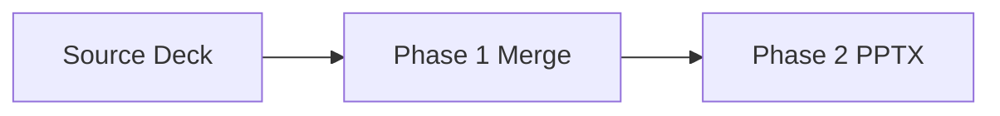

# Phase 1 and Phase 2 Regression Harness

::: notes
Open the regression suite and explain that this deck is intentionally synthetic.
Mention that the first H1 in the first deck should remain a title-only slide in PPTX.
Transition to the next slide where link and separator handling are tested.

**Expected PPTX Rendering:**

- Layout: Title Slide
- Title Placeholder: "Phase 1 and Phase 2 Regression Harness"
- Subtitle Placeholder: (empty - no subtitle in this slide)
- Notes: This notes block content
- Behavior: First H1 in first deck becomes title slide, not stripped
  :::

---

## Link and Image Rewrite Coverage

- Matching link text and target: [https://example.com](https://example.com)
- Different link text and target: [Docs](https://example.com/docs)
- Local image reference for merge rewrite: 

```yaml
meta:
  keep_this_separator_like_text: "---"
  still_inside_code_fence: true
```

::: notes
This slide verifies markdown link processing and image path handling.
The YAML code fence includes a literal --- line that must not be treated as a slide separator.
The merged markdown should keep that line verbatim.

**Expected PPTX Rendering:**

- Layout: Title and Content
- Title Placeholder: "Link and Image Rewrite Coverage"
- Content Placeholder: Bulleted list (3 bullets) + code block content (monospace)
- Image Handling: 
  - Phase 1: Image path rewritten to marp/images/ in merged deck
  - Phase 2: Image markdown extracted and removed from bullet text
  - Phase 2: Image rendered as picture shape in slide (not as markdown text)
  - Bullet text preserved: "Local image reference for merge rewrite:" (without markdown)
- Code Block Rendering:
  - Fence markers (```) not rendered (invisible in output)
  - Language identifier (yaml) not rendered
  - Code block content rendered in monospace font
  - Literal "---" inside code block preserved, not treated as separator
- Notes: This notes block content
  :::

---

# Architecture Truth || But Make It Memorable

::: notes
This slide should trigger the centered two titles branch because it is H1-only with matter-of-fact and witty parts.
Confirm the title and subtitle placeholders are both populated in the generated PPTX.
Point out that the provenance line exists to test Phase 1 stripping behavior.

**Expected PPTX Rendering:**

- Layout: Centered Two Titles
- Title Placeholder: "Architecture Truth"
- Subtitle Placeholder: "But Make It Memorable"
- Content Placeholder: (empty - H1-only slide)
- Notes: This notes block content
- Phase 1 Behavior: H1 and provenance line stripped during merge
- Split Logic: Text before "||" → title, text after "||" → subtitle
  :::

---

# Plain Divider Title

::: notes
This H1-only slide should route to the centered title branch after the first deck-level H1 has been seen.
Validate that no body placeholder text appears and only the centered title is used.
Move to the next content slide to verify normal flow resumes.

**Expected PPTX Rendering:**

- Layout: Centered Title
- Title Placeholder: "Plain Divider Title"
- Subtitle Placeholder: (empty)
- Content Placeholder: (empty - H1-only slide)
- Notes: This notes block content
- Phase 1 Behavior: H1 stripped during merge (not first deck H1)
- Routing: No "||" delimiter, so single centered title layout
  :::

---

## Content After H1 Dividers

This slide confirms normal title and content flow after H1-only blocks.

::: notes
This deck intentionally begins with H1-only slides.
After the first deck-level H1 in the manifest, these should route to centered title layouts.
The provenance line after the first H1 is included to exercise merge stripping behavior.

**Expected PPTX Rendering:**

- Layout: Title and Content
- Title Placeholder: "Content After H1 Dividers"
- Content Placeholder: Body paragraph text
- Notes: This notes block content
- Behavior: Normal H2 + body routing after H1-only dividers
  :::

---

<!-- _class: lead -->

## Course Modules

- Phase12 Intro
- **▶ Phase12 Layout Paths**
- Phase12 Content Paths
- Phase12 Empty Section

---

<!-- _class: lead -->

# Phase12 Layout Paths

---

## Phase12 Layout Paths

- Explicit Title Slide Layout

---

# Layout and Column Branches

::: notes
Introduce this deck as the explicit layout-routing test set.
Call out that both successful and failing layout-name scenarios are included.
Explain that each slide is crafted to force a unique branch in the PPTX generator.

**Expected PPTX Rendering:**

- Layout: Title Slide (deck-level H1, not first in manifest)
- Title Placeholder: "Layout and Column Branches"
- Subtitle Placeholder: (empty)
- Notes: This notes block content
- Phase 1 Behavior: H1 stripped during merge
  :::

---

<!-- layout: Title Slide -->

## Explicit Title Slide Layout

This content validates named layout resolution for a known layout.

::: notes
This slide should use add_named_layout_slide with a valid layout name.
Verify that the requested layout is honored without fallback warnings.
Confirm body placement in the expected placeholder.

**Expected PPTX Rendering:**

- Layout: Title Slide (explicit via comment directive)
- Title Placeholder: "Explicit Title Slide Layout"
- Subtitle Placeholder: "This content validates named layout resolution for a known layout."
- Content Placeholder: (empty - title slide layout has no body frame)
- Notes: This notes block content
- Routing: Explicit layout comment takes precedence
  :::

---

<!-- layout: Two Content -->

## Explicit Two Content Layout

### Left Column

- left one
- left two

### Right Column

- right one
- right two

::: notes
This slide exercises explicit Two Content layout with heading-based left/right extraction.
Confirm both columns are populated and title remains in the title placeholder.
Use this as a baseline before testing separator-driven two-column behavior.

**Expected PPTX Rendering:**

- Layout: Two Content (explicit via comment directive)
- Title Placeholder: "Explicit Two Content Layout"
- Left Column Placeholder: "Left Column" heading + 2 bullets ("left one", "left two")
- Right Column Placeholder: "Right Column" heading + 2 bullets ("right one", "right two")
- Notes: This notes block content
- Splitting: H3 headings mark column boundaries
  :::

---

## Separator Based Two Content

Left side keeps these bullets.

- alpha
- beta

::: column

Right side keeps these bullets.

- gamma
- delta

::: notes
This slide exercises automatic two-column detection based on ::: column separator.
Verify split_two_column_body handles separator content without explicit layout directives.
Check that both columns appear and ordering is preserved.

**Expected PPTX Rendering:**

- Layout: Two Content (auto-detected via ::: column separator)
- Title Placeholder: "Separator Based Two Content"
- Left Column Placeholder: "Left side keeps these bullets." + 2 bullets ("alpha", "beta")
- Right Column Placeholder: "Right side keeps these bullets." + 2 bullets ("gamma", "delta")
- Notes: This notes block content
- Splitting: ::: column marker splits content into left/right
  :::

---

## Exercise: Objectives and Activities Auto Split

Objectives:

- Identify the logic
- Verify the split

Activities:

- Run the merge prompt
- Inspect generated output

::: notes
This exercise-titled slide should trigger the Objectives and Activities fallback split logic.
Verify left column starts at Objectives and right column starts at Activities.
Confirm this works even without ::: column.

**Expected PPTX Rendering:**

- Layout: Two Content (auto-detected via "Exercise:" title + "Objectives:" and "Activities:" keywords)
- Title Placeholder: "Exercise: Objectives and Activities Auto Split"
- Left Column Placeholder: "Objectives:" + 2 bullets ("Identify the logic", "Verify the split")
- Right Column Placeholder: "Activities:" + 2 bullets ("Run the merge prompt", "Inspect generated output")
- Notes: This notes block content
- Splitting: Objectives/Activities keyword detection without ::: column
  :::

---

<!-- layout: Definitely Not A Real Layout -->

## Unknown Layout Fallback

The script should warn about the layout name and fall back to standard branch logic.

::: notes
This slide intentionally requests a non-existent layout to trigger warning and fallback.
Confirm a warning is printed and the slide is still generated through normal routing.
Capture this warning as expected behavior in test notes.

**Expected PPTX Rendering:**

- Layout: Title and Content (fallback after unknown layout warning)
- Title Placeholder: "Unknown Layout Fallback"
- Content Placeholder: Body paragraph text
- Notes: This notes block content
- Warning Expected: "layout 'Definitely Not A Real Layout' not found in template"
- Behavior: Generator prints warning, falls back to standard title+content
  :::

---

<!-- _class: hide -->

## Hidden Slide Branch

This slide verifies that Phase 2 marks hide-class slides as hidden in the generated PPTX.

::: notes
This slide is the regression sentinel for hidden-slide behavior.
Keep it in the deck to ensure Phase 2 still honors the hide class marker.

**Expected PPTX Rendering:**

- Layout: Title and Content
- Title Placeholder: "Hidden Slide Branch"
- Content Placeholder: Body paragraph text
- Hidden: true (slide XML attribute show="0")
- Notes: This notes block content
  :::

---

<!-- _class: lead -->

## Course Modules

- Phase12 Intro
- Phase12 Layout Paths
- **▶ Phase12 Content Paths**
- Phase12 Empty Section

---

<!-- _class: lead -->

# Phase12 Content Paths

---

## Phase12 Content Paths

- Background Image Title Only
- Starts After Leading Separator

---

# Table Mermaid and Background Branches

::: notes
Introduce this deck as the content-feature branch coverage set.
Explain that table, mermaid, background images, and legacy inline image markers are all represented.
Mention that expected warnings are acceptable for unavailable Mermaid tooling.

**Expected PPTX Rendering:**

- Layout: Title Slide (deck-level H1, not first in manifest)
- Title Placeholder: "Table Mermaid and Background Branches"
- Subtitle Placeholder: (empty)
- Notes: This notes block content
- Phase 1 Behavior: H1 stripped during merge
  :::

---

## Background Image Title Only


::: notes
This slide should route to title-only output with a resolved background image path.
Verify background image placement and ensure no placeholder body text appears.
If the image is missing, record warning output and fix path references.

**Expected PPTX Rendering:**

- Layout: Title Only (H2 + background image only, no body text)
- Title Placeholder: "Background Image Title Only"
- Content Placeholder: (empty - background image slide)
- Background: Image from marp/images/cqrs-command-query-flow.jpg
- Notes: This notes block content
- Image Handling: ![bg fit] syntax triggers background placement
  :::

---

## Markdown Table Branch

| Branch       | Trigger               | Expected          |
| ------------ | --------------------- | ----------------- |
| Table parser | markdown table syntax | table slide path  |
| Note merge   | ::: notes block       | notes plus source |

::: notes
This table should route through the table-specific slide creation path.
The speaker notes should be combined with source metadata in PPTX.

**Expected PPTX Rendering:**

- Layout: Title and Content (table routing)
- Title Placeholder: "Markdown Table Branch"
- Content Placeholder: PowerPoint table (3 columns × 3 rows including header)
- Table Content: Headers "Branch", "Trigger", "Expected" + 2 data rows
- Notes: This notes block content + source file reference
- Table Handling: Markdown table converted to native PPTX table object
  :::

---

## Markdown Table Centering and Width

| Aspect    | Expected Layout Behavior | Verification Target          |
| --------- | ------------------------ | ---------------------------- |
| Alignment | Centered horizontally    | Equal left and right margins |
| Width     | 80% of slide width       | Matches spec and parser test |
| Height    | Row-driven growth        | Expands with table rows      |

::: notes
This slide verifies the table placement rules introduced for markdown table rendering.
Confirm the generated PowerPoint table is centered horizontally on the slide.
Measure or inspect that table width is 80 percent of the slide width rather than filling the content placeholder.

**Expected PPTX Rendering:**

- Layout: Title and Content (table routing)
- Title Placeholder: "Markdown Table Centering and Width"
- Content Placeholder: Replaced by a PowerPoint table (3 columns x 4 rows including header)
- Table Alignment: Centered horizontally on the slide
- Table Width: 80% of total slide width
- Table Height: Driven by row count using the table slide sizing logic
- Notes: This notes block content + source file reference
- Verification Focus: Left offset equals remaining horizontal margin after applying 80% width rule
  :::

---

<!-- layout: Two Content -->

## Explicit Layout Table Branch

| Case                    | Input Condition                        | Expected Result                          |
| ----------------------- | -------------------------------------- | ---------------------------------------- |
| Named layout present    | '<!-- layout: Two Content -->' comment | Table still renders as native PPTX table |
| Markdown table detected | Standard pipe table syntax             | Table branch takes precedence            |
| Slide title retained    | H2 heading present                     | Title remains in title placeholder       |

::: notes
This slide verifies that explicit layout comments do not bypass markdown table detection.
Confirm the generator still routes through the native table path even when a named layout comment is present.
This protects the regression where explicit Two Content layout could otherwise suppress the table-specific rendering branch.

**Expected PPTX Rendering:**

- Layout: Title and Content with native table insertion
- Title Placeholder: "Explicit Layout Table Branch"
- Content Placeholder: Replaced by a PowerPoint table (3 columns x 4 rows including header)
- Table Handling: Markdown table conversion takes precedence over generic named-layout body rendering
- Notes: This notes block content + source file reference
- Verification Focus: No plain body-text rendering of the markdown pipe syntax
  :::

---

## Mermaid Rendering Branch



If Mermaid CLI exists, this should render an image.
If Mermaid CLI is unavailable, the script should print a warning and keep text content.

::: notes
This slide exercises Mermaid extraction and optional rendering behavior.
When Mermaid CLI is present, verify PNG insertion as inline image content.
When absent, verify warning output and retained markdown text path.

**Expected PPTX Rendering (Mermaid CLI Available):**

- Layout: Title and Content
- Title Placeholder: "Mermaid Rendering Branch"
- Content Placeholder: Rendered PNG image from Mermaid diagram + body text
- Image: Flowchart with 3 nodes and 2 arrows
- Notes: This notes block content

**Expected PPTX Rendering (Mermaid CLI Unavailable):**

- Layout: Title and Content
- Title Placeholder: "Mermaid Rendering Branch"
- Content Placeholder: Code block text + body text (diagram not rendered)
- Warning Expected: Mermaid CLI unavailable message
- Notes: This notes block content
  :::

---

## Legacy Inline Image Marker

!Slide 1 image: marp/images/feature-flag-retirement.jpg

Legacy marker parsing should collect this image as inline content.

::: notes
This slide uses the legacy image marker format to test backward-compatible parsing.
Confirm add_inline_images receives the resolved path and image placement succeeds.
If image lookup fails, capture warning output for path diagnostics.

**Expected PPTX Rendering:**

- Layout: Title and Content
- Title Placeholder: "Legacy Inline Image Marker"
- Content Placeholder: Inline image (if found) + body paragraph text
- Image: From marp/images/feature-flag-retirement.jpg
- Notes: This notes block content
- Image Handling: "!Slide N image:" legacy syntax parsed and inserted
  :::

---

## Heading Only Title Only Branch

::: notes
This heading-only slide verifies the title-only branch for H2 with no body content.
Confirm the output uses title-only layout behavior and no content frame text.
Use this to validate the V5 check in the merge prompt verification list.

**Expected PPTX Rendering:**

- Layout: Title Only (H2 with no body content triggers this layout)
- Title Placeholder: "Heading Only Title Only Branch"
- Content Placeholder: (empty - no body content)
- Notes: This notes block content
- Routing: Heading-only detection uses LAYOUT_TITLE_ONLY index
- Validation: Agent verification check V5 target
  :::

---

# Leading and Trailing Separator Coverage

::: notes
Explain that this file intentionally stresses separator normalization logic.
The leading separator after the deck heading should not create duplicate joins in merged output.
The provenance line should be stripped in Phase 1 when merged.

**Expected PPTX Rendering:**

- Layout: Title Slide (deck-level H1, not first in manifest)
- Title Placeholder: "Leading and Trailing Separator Coverage"
- Subtitle Placeholder: (empty)
- Notes: This notes block content
- Phase 1 Behavior: H1 and provenance line stripped during merge
- Separator Handling: Leading separator after H1 normalized (not doubled)
  :::

---

## Starts After Leading Separator

This deck intentionally starts content after a leading separator.
Phase 1 should normalize file joins to avoid doubled separators.

::: notes
Verify merged markdown has exactly one separator boundary before this slide block.
Confirm no extra blank slide appears at the file boundary.
Use this as the reference for leading separator normalization.

**Expected PPTX Rendering:**

- Layout: Title and Content
- Title Placeholder: "Starts After Leading Separator"
- Content Placeholder: Body paragraph text (2 lines)
- Notes: This notes block content
- Phase 1 Behavior: Leading --- after H1 stripped, single separator boundary maintained
  :::

---

## Ends With Trailing Separator Candidate

This deck intentionally ends with a bare separator so validation can flag it.
Phase 1 should strip one trailing separator during merge.

::: notes
This slide is paired with an intentional trailing --- at end of file.
Phase 0 should warn about trailing separator and Phase 1 should strip one trailing boundary.
Confirm merged output does not end with duplicate separators from this source file.

**Expected PPTX Rendering:**

- Layout: Title and Content
- Title Placeholder: "Ends With Trailing Separator Candidate"
- Content Placeholder: Body paragraph text (2 lines)
- Notes: This notes block content
- Phase 0 Behavior: Validation warning about trailing --- in source file
- Phase 1 Behavior: Trailing --- stripped, no duplicate separator at end of merged deck
  :::

---

<!-- _class: lead -->

## Course Modules

- Phase12 Intro
- Phase12 Layout Paths
- Phase12 Content Paths
- **▶ Phase12 Empty Section**

---

<!-- _class: lead -->

# Phase12 Empty Section